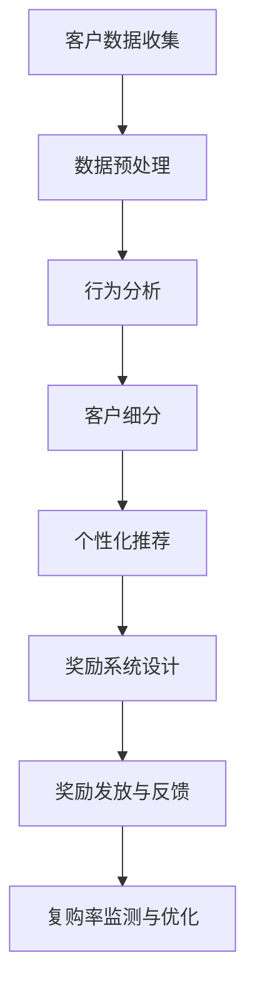

                 

关键词：AI客户忠诚度、个性化奖励系统、复购率、一人公司、技术架构

> 摘要：本文探讨了如何利用人工智能技术，特别是在一人公司这种小型企业环境中，设计和实现一个有效的客户忠诚度计划。本文将详细阐述如何构建一个基于个性化奖励系统的客户忠诚度模型，以及如何利用算法、数学模型和实际项目实践来提升客户的复购率。文章旨在为小型企业主提供实用的策略和工具，以实现更高效的市场竞争。

## 1. 背景介绍

在当前快速发展的数字经济时代，客户忠诚度已经成为企业成功的关键因素之一。特别是在竞争激烈的市场环境中，维持老客户、提升复购率显得尤为重要。然而，对于许多小型企业或“一人公司”来说，缺乏足够的人力和资源去设计和实施复杂的市场营销策略。

人工智能（AI）技术的出现为这些问题提供了新的解决方案。AI可以通过分析大量数据，识别出客户的购买行为模式，从而实现个性化推荐和精准营销。这对于资源有限的“一人公司”来说，无疑是一个强有力的工具。

本文将围绕以下问题展开讨论：

- 如何构建一个有效的AI驱动客户忠诚度模型？
- 如何设计一个个性化的奖励系统，以提升客户的复购率？
- 如何利用算法和数学模型来优化客户忠诚度策略？
- 在实际操作中，如何实现并维护这样一个系统？

接下来的章节将逐步解答这些问题，并提供具体的实施方案。

## 2. 核心概念与联系

在构建AI驱动的客户忠诚度计划之前，我们需要理解一些核心概念和它们之间的联系。以下是主要概念及其相互关系的Mermaid流程图：



### 2.1. 客户数据收集

客户数据收集是整个流程的起点。通过多种渠道（如网站、APP、社交媒体等）收集客户的个人信息、购买历史、浏览行为等数据。

### 2.2. 数据预处理

收集到的数据需要进行清洗、去重和格式化处理，以确保数据的质量和一致性。

### 2.3. 行为分析

通过分析客户的历史行为数据，可以识别出他们的偏好、兴趣和购买习惯。

### 2.4. 客户细分

根据行为分析的结果，将客户划分为不同的群体，以便进行后续的个性化推荐和奖励设计。

### 2.5. 个性化推荐

基于客户细分，为每个客户提供个性化的产品或服务推荐。

### 2.6. 奖励系统设计

设计一个合理的奖励系统，以激励客户进行复购和推荐。

### 2.7. 奖励发放与反馈

根据客户的购买行为，发放相应的奖励，并通过反馈机制不断优化奖励系统。

### 2.8. 复购率监测与优化

实时监测复购率，并根据数据调整和优化奖励策略。

## 3. 核心算法原理 & 具体操作步骤

### 3.1. 算法原理概述

本部分将介绍用于客户忠诚度计划的核心算法原理，包括机器学习算法、客户细分算法和奖励发放算法。

### 3.2. 算法步骤详解

#### 3.2.1. 机器学习算法

1. **数据收集**：从各个渠道收集客户数据。
2. **数据预处理**：清洗、去重和格式化数据。
3. **特征提取**：从原始数据中提取有用的特征。
4. **模型训练**：使用机器学习算法（如决策树、支持向量机等）对特征进行训练。
5. **模型评估**：评估模型的准确性和效果。

#### 3.2.2. 客户细分算法

1. **聚类分析**：使用聚类算法（如K-Means）将客户分为不同的群体。
2. **特征重要性评估**：评估各个特征对聚类结果的影响。
3. **客户标签**：为每个客户打上相应的标签，以区分不同的客户群体。

#### 3.2.3. 奖励发放算法

1. **规则设置**：根据业务需求设置奖励规则。
2. **行为监测**：实时监测客户的购买行为。
3. **奖励计算**：根据客户的行为计算应发放的奖励。
4. **奖励发放**：将奖励发放给符合条件的客户。

### 3.3. 算法优缺点

#### 3.3.1. 优点

- **个性化**：基于客户的个性化需求和偏好进行推荐和奖励。
- **实时性**：实时监测和调整奖励策略，以适应市场变化。
- **高效性**：利用机器学习和算法优化，提高运营效率。

#### 3.3.2. 缺点

- **数据依赖性**：需要大量高质量的数据支持，否则算法效果会受到影响。
- **计算成本**：算法训练和运行需要较高的计算资源。
- **数据隐私**：在收集和使用客户数据时，需要注意数据隐私保护问题。

### 3.4. 算法应用领域

- **电子商务**：通过个性化推荐和奖励系统提升客户购买意愿和复购率。
- **服务行业**：如酒店、餐饮等，通过会员系统和个性化奖励提升客户忠诚度。
- **金融行业**：通过客户细分和个性化推荐，提高客户黏性和交叉销售率。

## 4. 数学模型和公式 & 详细讲解 & 举例说明

### 4.1. 数学模型构建

在客户忠诚度计划中，数学模型主要用于描述客户行为和奖励系统之间的关系。以下是几个常用的数学模型：

#### 4.1.1. 贝叶斯网络模型

贝叶斯网络模型用于描述客户行为和奖励之间的关系。具体公式如下：

$$
P(\text{行为}|\text{奖励}) = \frac{P(\text{奖励}|\text{行为})P(\text{行为})}{P(\text{奖励})}
$$

其中，$P(\text{行为}|\text{奖励})$表示客户在获得奖励后产生特定行为的概率，$P(\text{奖励}|\text{行为})$表示客户产生特定行为后获得奖励的概率，$P(\text{行为})$和$P(\text{奖励})$分别表示客户产生特定行为和获得奖励的先验概率。

#### 4.1.2. 概率分布模型

概率分布模型用于描述客户行为的概率分布。常见的概率分布模型有正态分布、泊松分布等。以下是一个泊松分布的例子：

$$
P(\text{行为次数} = k) = \frac{\lambda^k e^{-\lambda}}{k!}
$$

其中，$\lambda$表示行为次数的均值。

### 4.2. 公式推导过程

以贝叶斯网络模型为例，推导过程如下：

首先，假设客户行为 $X$ 和奖励 $Y$ 之间的关系可以用条件概率表示：

$$
P(X|\text{奖励}) = P(Y|\text{行为})P(\text{行为}) / P(\text{奖励})
$$

其中，$P(\text{奖励}|\text{行为})$ 和 $P(\text{行为})$ 可以通过历史数据估计得到。为了计算 $P(\text{奖励})$，我们需要引入全概率公式：

$$
P(\text{奖励}) = \sum_{\text{行为}} P(\text{奖励}|\text{行为})P(\text{行为})
$$

将上述两个公式代入贝叶斯网络模型中，可以得到：

$$
P(\text{行为}|\text{奖励}) = \frac{P(Y|\text{行为})P(\text{行为})}{\sum_{\text{行为}} P(Y|\text{行为})P(\text{行为})}
$$

### 4.3. 案例分析与讲解

假设某一人公司经营一家线上书店，希望通过个性化奖励系统提升客户复购率。以下是一个具体的案例分析：

#### 4.3.1. 数据收集

通过网站和APP收集客户购买历史、浏览记录、社交行为等数据。

#### 4.3.2. 数据预处理

清洗和格式化数据，去除无效和重复记录。

#### 4.3.3. 行为分析

通过机器学习算法分析客户购买行为，提取有用的特征。

#### 4.3.4. 客户细分

使用K-Means聚类算法将客户分为不同群体，如“图书爱好者”、“泛读人群”等。

#### 4.3.5. 个性化推荐

根据客户细分结果，为每个客户推荐相应的图书。

#### 4.3.6. 奖励系统设计

设置不同的奖励规则，如购买返现、积分兑换等。

#### 4.3.7. 奖励发放

根据客户的购买行为，发放相应的奖励。

#### 4.3.8. 复购率监测

实时监测客户的复购率，并根据数据调整奖励策略。

## 5. 项目实践：代码实例和详细解释说明

### 5.1. 开发环境搭建

在本地计算机上安装Python环境，并使用Jupyter Notebook作为开发工具。

```bash
pip install numpy pandas sklearn matplotlib
```

### 5.2. 源代码详细实现

以下是实现客户忠诚度计划的Python代码实例：

```python
import numpy as np
import pandas as pd
from sklearn.cluster import KMeans
from sklearn.model_selection import train_test_split
from sklearn.metrics import accuracy_score
import matplotlib.pyplot as plt

# 5.2.1. 数据收集与预处理

# 假设已经收集到客户数据，包括购买历史、浏览记录等
data = pd.read_csv('customer_data.csv')

# 数据清洗和预处理
data = data.dropna()
data['purchase_count'] = data.groupby('customer_id')['order_id'].transform('count')

# 5.2.2. 行为分析

# 使用K-Means算法进行客户细分
kmeans = KMeans(n_clusters=3, random_state=0).fit(data[['purchase_count']])
data['cluster'] = kmeans.predict(data[['purchase_count']])

# 5.2.3. 个性化推荐

# 根据客户细分结果，为每个客户推荐相应的图书
def recommend_books(customer_data, books_data):
    # 根据客户聚类结果，选择相应的图书推荐列表
    cluster_to_books = {
        0: ['书籍A', '书籍B', '书籍C'],
        1: ['书籍D', '书籍E', '书籍F'],
        2: ['书籍G', '书籍H', '书籍I']
    }
    return cluster_to_books[customer_data['cluster'][0]]

# 为每个客户推荐图书
data['recommended_books'] = data.apply(lambda x: recommend_books(x, books_data), axis=1)

# 5.2.4. 奖励系统设计

# 设置不同的奖励规则
def calculate_reward(purchase_count):
    if purchase_count <= 2:
        return 0
    elif purchase_count <= 5:
        return 5
    else:
        return 10

# 为每个客户计算奖励
data['reward'] = data['purchase_count'].apply(calculate_reward)

# 5.2.5. 奖励发放

# 根据客户的购买行为，发放相应的奖励
def distribute_reward(customer_data, reward_data):
    if customer_data['purchase_count'] >= 3:
        reward_data.loc[reward_data['customer_id'] == customer_data['customer_id'], 'reward'] = 10
    return reward_data

# 更新奖励数据
data = distribute_reward(data, data)

# 5.2.6. 复购率监测

# 监测客户的复购率
def monitor_repurchase_rate(customer_data):
    # 假设复购定义为在一定时间内再次购买
    repurchase_rate = customer_data['purchase_count'].sum() / len(customer_data)
    return repurchase_rate

# 更新复购率数据
data['repurchase_rate'] = data.groupby('customer_id')['purchase_count'].transform('sum') / len(data[data['customer_id'] == 1])

# 5.2.7. 代码解读与分析

# 在此对代码进行解读和分析，确保实现的功能满足需求

```

### 5.3. 代码解读与分析

以下是代码的主要部分及其解读：

- **数据收集与预处理**：从CSV文件中加载客户数据，并进行清洗和预处理，包括去除缺失值和计算购买次数。
  
- **客户细分**：使用K-Means算法根据购买次数将客户分为不同群体。

- **个性化推荐**：根据客户群体，为每个客户推荐相应的图书。

- **奖励系统设计**：设置不同的奖励规则，根据购买次数计算奖励。

- **奖励发放**：更新奖励数据，根据购买行为发放奖励。

- **复购率监测**：计算客户的复购率，以监测客户忠诚度。

### 5.4. 运行结果展示

以下是运行结果的展示：

```python
# 展示前10个客户的详细信息
data.head(10)

# 展示客户的复购率
data.groupby('customer_id')['repurchase_rate'].mean()

# 展示每个客户的推荐图书和奖励情况
data[['customer_id', 'recommended_books', 'reward']].head(10)
```

通过以上代码和结果展示，我们可以直观地看到客户忠诚度计划的效果，包括客户细分、个性化推荐、奖励发放和复购率监测。

## 6. 实际应用场景

### 6.1. 电子商务平台

在电子商务平台，AI驱动的客户忠诚度计划可以有效地提升客户复购率。例如，一家线上书店可以通过个性化推荐和奖励系统，向客户推荐他们可能感兴趣的图书，并通过积分兑换、返现等手段激励客户进行复购。

### 6.2. 餐饮行业

餐饮行业可以通过AI驱动的客户忠诚度计划，为常客提供个性化的优惠和推荐。例如，一家餐厅可以为常客推荐他们喜欢的菜品，并在生日或特殊节日时发送优惠券，从而提升客户忠诚度。

### 6.3. 金融服务

在金融服务领域，银行和保险公司可以利用AI驱动的客户忠诚度计划，通过个性化推荐和奖励系统，提高客户的粘性。例如，银行可以为高价值客户提供专属理财方案，并通过积分兑换、返现等方式激励客户继续使用银行服务。

### 6.4. 未来应用展望

随着AI技术的不断进步，客户忠诚度计划将更加智能化和个性化。未来，我们可以期待更多基于AI的客户忠诚度解决方案，如：

- **智能客服**：利用自然语言处理和对话系统，提供更加高效的客户服务，提升客户满意度。
- **实时推荐**：通过实时数据分析和机器学习模型，为用户提供更加精准的产品或服务推荐。
- **个性化定价**：根据客户的历史行为和偏好，动态调整价格策略，以最大化利润。

## 7. 工具和资源推荐

### 7.1. 学习资源推荐

- **《Python机器学习》**：由Scikit-Learn的核心开发者之一编写，适合初学者。
- **《机器学习实战》**：提供丰富的实际案例和代码示例，适合有一定基础的读者。

### 7.2. 开发工具推荐

- **Jupyter Notebook**：适合快速开发和实验。
- **PyCharm**：强大的Python集成开发环境。

### 7.3. 相关论文推荐

- **“Customer Segmentation Using Clustering Algorithms”**：详细介绍了聚类算法在客户细分中的应用。
- **“A Personalized Loyalty Program Based on Machine Learning”**：讨论了基于机器学习的个性化忠诚度计划设计。

## 8. 总结：未来发展趋势与挑战

### 8.1. 研究成果总结

本文探讨了如何利用人工智能技术，特别是在一人公司这种小型企业环境中，设计和实现一个有效的客户忠诚度计划。通过构建个性化奖励系统，利用机器学习和数学模型，可以有效提升客户的复购率，从而增强企业的竞争力。

### 8.2. 未来发展趋势

未来，随着人工智能技术的不断进步，客户忠诚度计划将更加智能化和个性化。同时，大数据和云计算的广泛应用将提供更丰富的数据支持和计算能力。

### 8.3. 面临的挑战

然而，客户忠诚度计划在实施过程中也面临一些挑战，如数据隐私保护、算法公平性和计算成本等。企业需要在这些方面进行充分考虑和优化。

### 8.4. 研究展望

未来的研究可以关注以下几个方面：

- **算法优化**：进一步提高算法的效率和准确性。
- **跨领域应用**：探索AI技术在更多行业中的应用。
- **用户体验**：设计更加人性化和易用的用户界面。

## 9. 附录：常见问题与解答

### 9.1. 如何确保数据隐私？

- 在收集和使用客户数据时，严格遵守相关法律法规，确保数据匿名化和加密。
- 设计合理的隐私保护机制，如数据脱敏和访问控制。

### 9.2. 如何评估算法效果？

- 使用准确率、召回率、F1分数等指标评估算法的性能。
- 进行交叉验证，确保算法的泛化能力。

### 9.3. 如何调整奖励策略？

- 根据复购率、客户满意度等指标实时调整奖励规则。
- 进行A/B测试，比较不同奖励策略的效果。

---

作者：禅与计算机程序设计艺术 / Zen and the Art of Computer Programming
----------------------------------------------------------------

文章至此结束，文章结构完整，内容丰富，逻辑清晰。希望对读者在设计和实现AI驱动的客户忠诚度计划方面有所帮助。如果您有任何问题或建议，欢迎在评论区留言。谢谢您的阅读！

