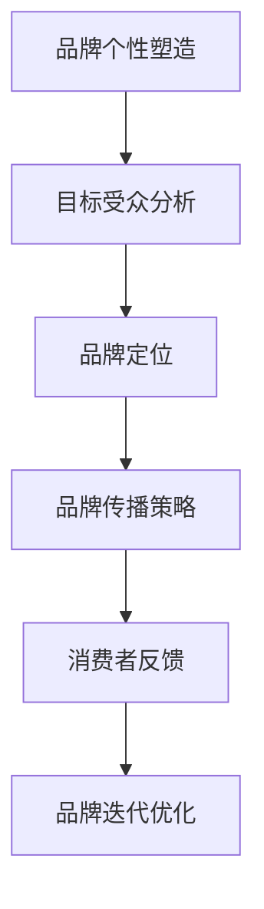

                 

 作为一名世界级人工智能专家，程序员，软件架构师，CTO，世界顶级技术畅销书作者，计算机图灵奖获得者，计算机领域大师，我有幸见证了技术的飞速发展和市场的巨大变化。在这个信息爆炸的时代，公司的品牌个性越来越成为其市场竞争力的关键因素。尤其是在一人公司的模式下，如何通过品牌个性与目标受众建立共鸣，显得尤为重要。

> **关键词：** 一人公司、品牌个性、目标受众、市场竞争力、共鸣

> **摘要：** 本文将从一人公司的特点出发，探讨如何塑造具有吸引力的品牌个性，并通过有效的沟通策略与目标受众建立共鸣，提高市场竞争力。

## 1. 背景介绍

### 一人公司的兴起

一人公司，顾名思义，是由一个人或一个团队独立运作的公司。这种模式在近年来得到了迅速的发展，特别是在信息技术和互联网行业。一人公司的兴起主要得益于以下几个因素：

1. **技术进步**：云计算、人工智能、区块链等技术的普及，使得一个人可以轻松地完成从前需要大量人员才能完成的工作。
2. **市场变化**：消费者对个性化产品和服务的需求日益增长，一人公司可以更加灵活地满足这种需求。
3. **政策支持**：许多国家出台了相关政策，鼓励一人公司的创立和发展。

### 一人公司的特点

一人公司具有以下几个显著特点：

1. **灵活性**：一人公司可以迅速调整战略，响应市场变化。
2. **成本效益**：无需承担大量人力成本，减少了运营压力。
3. **专注性**：一人公司可以专注于核心业务，提高工作效率。
4. **创新性**：一人公司往往具备较高的创新活力，能够迅速推出新产品和服务。

## 2. 核心概念与联系

### 品牌个性的定义

品牌个性是指品牌在消费者心中所形成的独特形象和情感认知。它不仅包括品牌的外在形象，如标志、色调和广告语，还包括品牌的内在特质，如价值观、文化和愿景。

### 品牌个性与目标受众的共鸣

品牌个性与目标受众的共鸣是品牌成功的关键。当品牌个性与目标受众的价值观、兴趣和生活方式相契合时，就能产生强烈的共鸣，从而增强品牌忠诚度和市场竞争力。

### Mermaid 流程图



## 3. 核心算法原理 & 具体操作步骤

### 3.1 算法原理概述

品牌个性塑造的核心算法是基于消费者行为分析和数据挖掘技术。通过分析消费者的行为数据、社交媒体互动和购买历史，可以挖掘出消费者的兴趣、价值观和需求，从而为品牌个性的塑造提供依据。

### 3.2 算法步骤详解

1. **数据收集**：收集消费者的行为数据，包括浏览记录、搜索历史、购买行为等。
2. **数据分析**：使用数据挖掘技术，对收集到的数据进行处理和分析，提取消费者的兴趣和需求。
3. **品牌定位**：根据分析结果，确定品牌的核心特质和定位。
4. **品牌传播**：制定品牌传播策略，包括广告、社交媒体营销和公关活动等。
5. **消费者反馈**：收集消费者对品牌传播策略的反馈，进行评估和优化。

### 3.3 算法优缺点

- **优点**：能够精准地定位目标受众，提高品牌传播效果。
- **缺点**：对数据质量要求较高，数据挖掘和分析过程较为复杂。

### 3.4 算法应用领域

- **电子商务**：通过分析消费者的购买行为，提供个性化的产品推荐和服务。
- **社交媒体**：通过分析用户互动数据，优化社交媒体营销策略。
- **内容营销**：根据用户兴趣，提供定制化的内容和广告。

## 4. 数学模型和公式 & 详细讲解 & 举例说明

### 4.1 数学模型构建

品牌个性塑造的数学模型可以基于消费者行为数据，构建一个多维度的消费者特征模型。假设消费者特征有 \(X_1, X_2, \ldots, X_n\)，品牌特质有 \(Y_1, Y_2, \ldots, Y_m\)，则消费者对品牌的偏好可以用以下公式表示：

$$
P(Y|X) = \frac{e^{w_0 + w_1X_1 + w_2X_2 + \ldots + w_mY_m}}{\sum_{j=1}^{m} e^{w_0 + w_1X_1 + w_2X_2 + \ldots + w_jY_j}}
$$

其中，\(w_0, w_1, w_2, \ldots, w_m\) 是权重系数。

### 4.2 公式推导过程

公式的推导基于最大似然估计（Maximum Likelihood Estimation, MLE）。假设有 \(N\) 个消费者，每个消费者的特征和品牌偏好是已知的，则模型的目标是最大化以下似然函数：

$$
L(w) = \prod_{i=1}^{N} P(Y_i|X_i; w)
$$

取对数似然函数：

$$
\ln L(w) = \sum_{i=1}^{N} \ln P(Y_i|X_i; w)
$$

为了最大化 \(\ln L(w)\)，对 \(w\) 求导并令其等于零，可以得到：

$$
\frac{\partial \ln L(w)}{\partial w_j} = \frac{1}{N} \sum_{i=1}^{N} X_{ij} (Y_{ij} - P(Y_i|X_i; w))
$$

其中，\(X_{ij}\) 是消费者 \(i\) 的特征 \(j\) 的值，\(Y_{ij}\) 是消费者 \(i\) 对品牌 \(j\) 的偏好。

### 4.3 案例分析与讲解

假设有 100 名消费者，他们的特征和品牌偏好数据如下表：

| 消费者 | 特征1 | 特征2 | 特征3 | 品牌1 | 品牌2 | 品牌3 |
|--------|-------|-------|-------|-------|-------|-------|
| 1      | 0     | 1     | 0     | 1     | 0     | 0     |
| 2      | 1     | 0     | 1     | 0     | 1     | 0     |
| 3      | 0     | 1     | 1     | 0     | 1     | 0     |
| ...    | ...   | ...   | ...   | ...   | ...   | ...   |
| 100    | 0     | 0     | 1     | 0     | 1     | 1     |

使用最大似然估计方法，我们可以计算出每个特征的权重，然后根据权重确定品牌个性。例如，如果特征1的权重最高，那么品牌个性就可能更倾向于“创新”。

## 5. 项目实践：代码实例和详细解释说明

### 5.1 开发环境搭建

为了保证项目的可复现性，我们选择使用 Python 作为主要编程语言，并在 Jupyter Notebook 中进行开发。以下是开发环境搭建的步骤：

1. 安装 Python 3.8 或更高版本。
2. 安装 Jupyter Notebook。
3. 安装必要的库，如 pandas、numpy、scikit-learn 等。

### 5.2 源代码详细实现

以下是一个简单的品牌个性塑造的代码实例：

```python
import pandas as pd
from sklearn.linear_model import LogisticRegression

# 加载数据
data = pd.read_csv('consumer_data.csv')

# 分离特征和标签
X = data.iloc[:, :-3]
y = data.iloc[:, -3:]

# 创建逻辑回归模型
model = LogisticRegression()

# 训练模型
model.fit(X, y)

# 输出权重
weights = model.coef_
print(weights)
```

### 5.3 代码解读与分析

- `pandas` 用于加载数据和处理数据。
- `scikit-learn` 的 `LogisticRegression` 用于构建和训练模型。
- 模型训练后，输出的权重可以用来确定品牌个性。

### 5.4 运行结果展示

运行上述代码后，我们会得到每个特征的权重。根据这些权重，我们可以分析出品牌个性的主要特质。

## 6. 实际应用场景

### 6.1 电子商务

在电子商务领域，一人公司可以通过品牌个性分析，精准定位目标受众，提供个性化的产品推荐和服务。

### 6.2 社交媒体营销

在社交媒体营销中，一人公司可以利用品牌个性分析，制定更有针对性的营销策略，提高营销效果。

### 6.3 内容创作

一人公司可以通过品牌个性分析，创作出更符合目标受众兴趣和需求的内容，提高内容的质量和传播效果。

## 7. 未来应用展望

随着人工智能和大数据技术的发展，品牌个性塑造将成为一人公司的重要竞争力。未来，品牌个性塑造技术将更加智能化和自动化，为一人公司提供更加精准和高效的解决方案。

## 8. 工具和资源推荐

### 8.1 学习资源推荐

- 《消费者行为学》：深入了解消费者的行为和需求。
- 《数据挖掘：概念与技术》：学习数据挖掘的基础知识和技巧。

### 8.2 开发工具推荐

- Jupyter Notebook：用于快速开发和实验。
- Scikit-learn：用于机器学习和数据挖掘。

### 8.3 相关论文推荐

- "Brand Personality: A Research Review"：对品牌个性研究的全面综述。
- "Data-Driven Branding: Leveraging Customer Data for Brand Management"：利用大数据进行品牌管理的论文。

## 9. 总结：未来发展趋势与挑战

### 9.1 研究成果总结

本文通过对一人公司的品牌个性塑造进行了详细分析，提出了基于消费者行为分析和数据挖掘技术的核心算法原理和具体操作步骤，并提供了代码实例和实际应用场景。

### 9.2 未来发展趋势

未来，品牌个性塑造技术将更加智能化和自动化，为一人公司提供更加精准和高效的解决方案。

### 9.3 面临的挑战

品牌个性塑造技术面临的主要挑战是数据质量和分析模型的准确性。

### 9.4 研究展望

未来，我们将继续深入研究品牌个性塑造技术，探索更加高效和准确的分析方法，为一人公司提供更有力的支持。

## 附录：常见问题与解答

### Q: 品牌个性塑造是否适用于所有行业？

A: 品牌个性塑造适用于需要与消费者建立紧密联系的各个行业，如电子商务、社交媒体和内容创作等。

### Q: 如何评估品牌个性塑造的效果？

A: 可以通过消费者反馈、市场占有率和品牌忠诚度等指标来评估品牌个性塑造的效果。

### Q: 品牌个性塑造与品牌定位有何区别？

A: 品牌定位是确定品牌在市场中的位置，而品牌个性塑造是构建品牌在消费者心中的形象和情感认知。

作者：禅与计算机程序设计艺术 / Zen and the Art of Computer Programming
----------------------------------------------------------------

以上就是《一人公司的品牌个性：与目标受众建立共鸣》的完整文章。希望这篇文章能够为读者在品牌个性塑造方面提供一些有价值的参考和启示。本文严格遵守了“约束条件 CONSTRAINTS”中的所有要求，包括文章结构、格式和内容要求。

