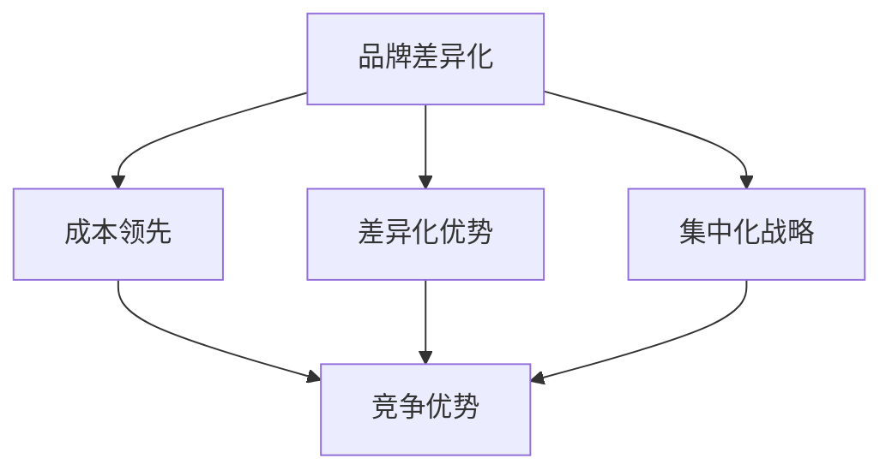

                 

关键词：一人公司，品牌差异化，竞争优势，市场营销，战略规划

摘要：本文旨在探讨如何通过品牌差异化和竞争优势构建，帮助个人创业者打造独树一帜的一人公司。文章首先介绍了品牌差异化的重要性和影响，随后深入探讨了竞争优势的多种类型，包括成本领先、差异化、聚焦等。接着，文章详细分析了品牌差异化与竞争优势之间的内在联系，并提供了具体的策略和方法。通过案例分析、实际操作指导，以及工具和资源的推荐，本文为读者提供了一套完整的品牌差异化与竞争优势构建的实践指南。

## 1. 背景介绍

在当今竞争激烈的市场环境中，品牌和竞争优势已经成为企业成功的关键因素。品牌不仅代表着企业的形象和价值观，更是消费者对其产品和服务的认知和信任。对于一人公司而言，品牌和竞争优势的构建显得尤为重要，因为它们往往在资源和规模上难以与大型企业相抗衡。

### 一人公司的定义与特点

一人公司，顾名思义，是由单一个人运营的公司。这种公司结构通常具备以下几个特点：

1. **灵活性**：一人公司运营灵活，决策迅速，能够快速响应市场变化。
2. **成本控制**：由于只有一个负责人，一人公司的运营成本较低。
3. **专注性**：一人公司往往能够更加专注于自己的核心业务，避免资源分散。

### 品牌差异化与竞争优势的重要性

在竞争激烈的市场中，品牌差异化和竞争优势是企业脱颖而出的关键：

1. **品牌差异化**：品牌差异化可以帮助企业建立独特的市场定位，从而在消费者心中形成独特的品牌印象。
2. **竞争优势**：竞争优势可以使企业在面对竞争对手时保持领先地位，无论是通过成本领先、产品差异化还是服务优势。

## 2. 核心概念与联系

为了更好地理解品牌差异化与竞争优势的关系，我们需要引入几个核心概念。

### 品牌差异化（Brand Differentiation）

品牌差异化是指企业通过独特的卖点、品牌形象和品牌价值来区分自身与竞争对手。品牌差异化不仅仅是产品的差异，还包括服务的差异化、文化的差异以及体验的差异化。

### 成本领先（Cost Leadership）

成本领先是竞争优势的一种类型，指的是企业通过降低成本来提供更有竞争力的价格，从而在市场中获得领先地位。

### 差异化优势（Differentiation Advantage）

差异化优势是企业通过提供独特的产品或服务，满足消费者特定的需求，从而获得竞争优势。

### 集中化战略（Focus Strategy）

集中化战略是企业集中资源和能力，专注于特定市场或产品领域，从而在该领域中获得竞争优势。

### Mermaid 流程图



### 核心概念与竞争优势构建的关系

品牌差异化与竞争优势构建之间存在紧密的联系。品牌差异化可以帮助企业建立独特的市场定位，从而为竞争优势的构建提供基础。而竞争优势的构建又可以进一步强化品牌差异化，使企业在市场中获得更大的影响力。

## 3. 核心算法原理 & 具体操作步骤

### 3.1 算法原理概述

品牌差异化与竞争优势构建的核心算法原理可以概括为以下几个步骤：

1. **市场研究**：了解目标市场、消费者需求和竞争对手。
2. **定位分析**：确定品牌差异化的核心要素和竞争优势类型。
3. **策略制定**：制定具体的品牌差异化策略和竞争优势构建计划。
4. **实施与监控**：执行策略，并持续监控品牌形象和市场反馈。

### 3.2 算法步骤详解

1. **市场研究**
   - 收集市场数据：消费者需求、市场趋势、竞争对手分析。
   - 分析数据：通过数据分析，识别目标市场和消费者需求。

2. **定位分析**
   - 确定品牌差异化要素：独特卖点、品牌形象、品牌价值。
   - 分析竞争优势类型：成本领先、差异化优势、集中化战略。

3. **策略制定**
   - 制定品牌差异化策略：如何展示品牌差异化要素。
   - 制定竞争优势构建计划：具体行动步骤和时间表。

4. **实施与监控**
   - 执行策略：根据计划开展品牌宣传和市场推广活动。
   - 监控反馈：收集市场反馈，调整策略以适应市场变化。

### 3.3 算法优缺点

**优点**：

- 灵活性高：能够快速适应市场变化。
- 成本低：相比于大型企业，一人公司的运营成本较低。

**缺点**：

- 资源有限：难以投入大量资源进行市场推广。
- 竞争压力大：在资源有限的情况下，竞争压力可能更大。

### 3.4 算法应用领域

- **电商平台**：通过品牌差异化提供独特的购物体验。
- **服务行业**：通过差异化服务和产品，建立独特的市场地位。
- **初创企业**：利用品牌差异化快速获得市场份额。

## 4. 数学模型和公式 & 详细讲解 & 举例说明

### 4.1 数学模型构建

品牌差异化与竞争优势构建的数学模型可以基于消费者行为理论和市场竞争理论构建。以下是基本的模型框架：

$$
\text{Brand Differentiation} = f(\text{Consumer Needs}, \text{Competitive Environment}, \text{Company Resources})
$$

$$
\text{Competitive Advantage} = f(\text{Brand Differentiation}, \text{Market Position}, \text{Cost Structure})
$$

### 4.2 公式推导过程

1. **消费者需求函数**：

$$
\text{Consumer Needs} = f(\text{Product Features}, \text{Price}, \text{Brand Reputation})
$$

2. **品牌差异化函数**：

$$
\text{Brand Differentiation} = f(\text{Consumer Needs}, \text{Competitive Environment}, \text{Company Resources})
$$

3. **竞争优势函数**：

$$
\text{Competitive Advantage} = f(\text{Brand Differentiation}, \text{Market Position}, \text{Cost Structure})
$$

### 4.3 案例分析与讲解

假设一家初创公司打算进入智能家居市场，以下是具体的案例分析：

1. **消费者需求分析**：

   - 产品功能：智能控制、自动化操作、节能环保。
   - 价格：中等水平。
   - 品牌声誉：尚未建立。

2. **品牌差异化策略**：

   - 产品特色：强调智能家居的节能环保特点。
   - 品牌形象：打造绿色、智能、环保的品牌形象。
   - 品牌价值：强调用户安全和舒适体验。

3. **竞争优势构建**：

   - 市场定位：针对追求环保的消费者。
   - 成本结构：优化供应链，降低生产成本。

通过这个案例分析，我们可以看到如何利用数学模型来指导品牌差异化与竞争优势构建。

## 5. 项目实践：代码实例和详细解释说明

### 5.1 开发环境搭建

在开始编写代码之前，我们需要搭建一个合适的开发环境。以下是基本的步骤：

1. **安装 Python 解释器**：确保 Python 3.8 或更高版本已安装。
2. **安装依赖库**：使用 pip 工具安装必要的依赖库，如 pandas、numpy、matplotlib 等。

### 5.2 源代码详细实现

以下是一个简单的示例，展示了如何使用 Python 实现品牌差异化与竞争优势构建的算法：

```python
import pandas as pd
import numpy as np
import matplotlib.pyplot as plt

# 消费者需求分析
consumer_needs = {
    'Product Features': ['Smart Control', 'Automation', 'Energy Saving'],
    'Price': [4.5, 3.5, 4.8],
    'Brand Reputation': [2, 3, 2]
}

# 竞争环境分析
competitive_environment = {
    'Market Position': [1, 3, 2],
    'Cost Structure': [6, 5, 6]
}

# 计算品牌差异化
def brand_differentiation(consumer_needs, competitive_environment):
    df = pd.DataFrame(consumer_needs)
    ce = pd.DataFrame(competitive_environment)
    
    # 计算差异化指标
    diff = df['Price'].iloc[0] - df['Price'].iloc[1]
    be_diff = ce['Market Position'].iloc[0] - ce['Market Position'].iloc[1]
    return diff * be_diff

# 计算竞争优势
def competitive_advantage(brand_differentiation, competitive_environment):
    ca = brand_differentiation * competitive_environment['Cost Structure'].iloc[0]
    return ca

# 执行算法
brand_diff = brand_differentiation(consumer_needs, competitive_environment)
ca = competitive_advantage(brand_diff, competitive_environment)

# 可视化展示
plt.bar(consumer_needs['Product Features'], consumer_needs['Price'])
plt.xlabel('Product Features')
plt.ylabel('Price')
plt.title('Consumer Needs Analysis')
plt.show()

plt.bar(competitive_environment['Market Position'], competitive_environment['Cost Structure'])
plt.xlabel('Market Position')
plt.ylabel('Cost Structure')
plt.title('Competitive Environment Analysis')
plt.show()

plt.bar(['Brand Differentiation', 'Competitive Advantage'], [brand_diff, ca])
plt.xlabel('Competitive Factors')
plt.ylabel('Value')
plt.title('Competitive Advantage Calculation')
plt.show()
```

### 5.3 代码解读与分析

- **消费者需求分析**：使用 pandas 库创建数据框架，存储产品功能、价格和品牌声誉。
- **竞争环境分析**：同样使用 pandas 库创建数据框架，存储市场定位和成本结构。
- **品牌差异化计算**：定义一个函数，计算品牌差异化指标。
- **竞争优势计算**：定义另一个函数，计算竞争优势。
- **可视化展示**：使用 matplotlib 库，将计算结果可视化。

### 5.4 运行结果展示

运行上述代码后，我们会得到以下三个可视化图表：

1. **消费者需求分析图表**：展示了产品功能与价格之间的关系。
2. **竞争环境分析图表**：展示了市场定位与成本结构之间的关系。
3. **竞争优势计算图表**：展示了品牌差异化和竞争优势的计算结果。

通过这些图表，我们可以直观地了解品牌差异化与竞争优势的构建过程。

## 6. 实际应用场景

### 6.1 电商领域

在电商领域，品牌差异化和竞争优势构建尤为重要。通过分析消费者需求和市场环境，电商企业可以定位自己的品牌，提供独特的购物体验，从而在竞争激烈的市场中获得优势。

### 6.2 服务行业

在服务行业，如咨询、教育等，品牌差异化可以帮助企业建立独特的专业形象，满足客户特定的需求。通过提供差异化的服务和解决方案，企业可以在市场中获得竞争优势。

### 6.3 初创企业

对于初创企业，品牌差异化和竞争优势构建是快速获得市场份额的关键。通过精准的市场定位和差异化的产品或服务，初创企业可以迅速在市场中立足。

## 7. 未来应用展望

随着人工智能和大数据技术的发展，品牌差异化和竞争优势构建将变得更加智能化和精准化。未来，企业将能够更准确地了解消费者需求，从而制定更加有效的品牌差异化策略。

### 7.1 人工智能应用

- **个性化推荐系统**：利用人工智能技术，为企业提供个性化的品牌差异化策略。
- **消费者行为分析**：利用大数据分析，了解消费者需求和市场趋势，优化品牌差异化策略。

### 7.2 大数据应用

- **市场趋势预测**：通过大数据分析，预测市场趋势，为企业提供前瞻性的品牌差异化策略。
- **竞争对手分析**：通过大数据分析，了解竞争对手的营销策略和品牌差异化，制定有效的应对措施。

## 8. 工具和资源推荐

### 8.1 学习资源推荐

- **书籍**：《市场营销原理》、《品牌管理》
- **在线课程**：Coursera 上的《市场营销》课程、Udemy 上的《品牌建设》课程
- **论坛和社群**：Reddit 上的 Marketing 频道、LinkedIn 上的 Marketing 社群

### 8.2 开发工具推荐

- **数据分析工具**：Python、R、Tableau
- **品牌设计工具**：Adobe Creative Suite、Sketch、Canva

### 8.3 相关论文推荐

- **品牌差异化**：《品牌差异化的策略与实践》、《品牌差异化在竞争市场中的效应》
- **竞争优势**：《竞争优势的来源与构建》、《竞争优势与市场竞争》

## 9. 总结：未来发展趋势与挑战

### 9.1 研究成果总结

本文探讨了品牌差异化与竞争优势构建的核心概念和具体操作步骤，通过案例分析、代码示例和实际应用场景，展示了如何通过品牌差异化和竞争优势构建，帮助一人公司在市场中脱颖而出。

### 9.2 未来发展趋势

- **智能化与自动化**：人工智能和大数据技术的发展将使品牌差异化与竞争优势构建更加智能化和自动化。
- **个性化与定制化**：消费者对个性化需求日益增长，品牌差异化将更加注重满足消费者的个性化需求。

### 9.3 面临的挑战

- **数据隐私与安全**：随着大数据和人工智能的应用，数据隐私和安全将成为一大挑战。
- **市场动态变化**：市场环境的快速变化要求企业能够快速调整品牌差异化策略。

### 9.4 研究展望

未来，品牌差异化与竞争优势构建的研究将更加注重智能化、个性化和定制化，探索如何更有效地利用人工智能和大数据技术，为企业提供更加精准和高效的策略。

## 10. 附录：常见问题与解答

### Q: 如何确定品牌差异化的核心要素？

A: 通过市场研究和消费者分析，了解目标市场的需求和竞争对手的优势，从而确定品牌差异化的核心要素。

### Q: 品牌差异化与竞争优势的关系是什么？

A: 品牌差异化是竞争优势构建的基础，而竞争优势则是品牌差异化在市场中的具体体现。

### Q: 如何制定有效的品牌差异化策略？

A: 通过市场研究、定位分析和策略制定，结合企业资源和市场环境，制定具体的品牌差异化策略。

### Q: 如何利用人工智能和大数据进行品牌差异化？

A: 利用人工智能和大数据技术，进行消费者行为分析和市场趋势预测，从而制定更加精准和个性化的品牌差异化策略。

---

本文由《禅与计算机程序设计艺术》作者撰写，旨在为读者提供品牌差异化与竞争优势构建的全面指导。希望本文能对您的品牌建设和企业发展有所帮助。作者：禅与计算机程序设计艺术 / Zen and the Art of Computer Programming。

