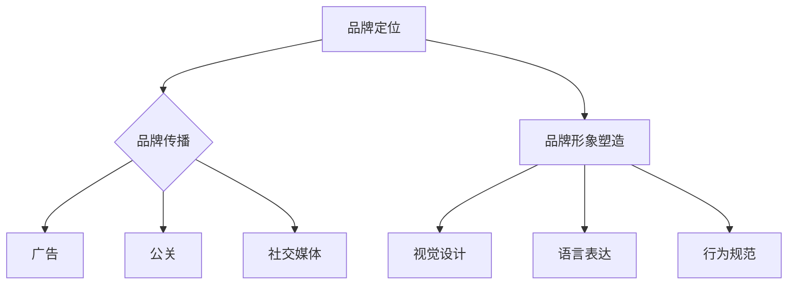

                 

随着数字化时代的到来，越来越多的个人创业者选择成立一人公司。这种商业模式不仅灵活便捷，而且能够更好地满足个人职业发展的需求。然而，品牌建设和管理成为了一人公司成功的关键因素之一。本文将探讨一人公司的品牌建设与管理，旨在为个人创业者提供实用的指导和建议。

## 关键词

- 一人公司
- 品牌建设
- 品牌管理
- 品牌定位
- 品牌传播

## 摘要

本文首先介绍了一人公司的背景和特点，然后详细探讨了一人公司的品牌建设和管理。从品牌定位、品牌传播、品牌形象塑造等方面，本文提供了一系列实用的策略和方法，旨在帮助一人公司打造具有竞争力的品牌。最后，本文还讨论了品牌建设与管理的未来发展趋势和挑战，为个人创业者提供了前瞻性的思考。

## 1. 背景介绍

### 1.1 一人公司的定义

一人公司，顾名思义，是指由一名股东完全出资和控股的公司。一人公司的股东可以是自然人，也可以是法人。一人公司的优点在于设立程序简单，运营灵活，税收优惠等。这使得一人公司成为许多个人创业者的首选。

### 1.2 一人公司的特点

1. **独立性**：一人公司作为独立的法人实体，拥有独立的财产和独立的法律责任。
2. **灵活性**：一人公司的经营决策高度集中，能够快速响应市场变化。
3. **税收优惠**：在一些国家和地区，一人公司可以享受税收优惠，降低经营成本。
4. **风险分散**：一人公司由于只有一名股东，因此风险相对集中，但也可以通过合理的企业架构设计来分散风险。

### 1.3 品牌建设的重要性

在市场竞争日益激烈的今天，品牌已经成为企业竞争力的核心。对于一人公司来说，品牌不仅是企业的形象，更是企业与客户、合作伙伴之间的重要纽带。良好的品牌能够增强客户的信任，提高企业的市场地位，从而实现长期稳定的盈利。

## 2. 核心概念与联系

### 2.1 品牌建设的基本概念

品牌建设是指企业通过一系列策略和活动，塑造和提升品牌形象的过程。它包括品牌定位、品牌传播、品牌形象塑造等环节。

#### 2.1.1 品牌定位

品牌定位是指企业确定品牌在市场中的定位，包括品牌的目标市场、品牌的核心价值和品牌个性等。品牌定位是品牌建设的基础，决定了品牌的形象和传播策略。

#### 2.1.2 品牌传播

品牌传播是指企业通过各种渠道和方式，将品牌信息传递给目标受众，提高品牌知名度和美誉度。品牌传播包括广告、公关、社交媒体等多种手段。

#### 2.1.3 品牌形象塑造

品牌形象塑造是指企业通过视觉、语言和行为等手段，打造品牌在公众心中的形象。品牌形象是品牌建设的核心，它直接影响客户的感知和态度。

### 2.2 品牌建设与管理的架构图



## 3. 核心算法原理 & 具体操作步骤

### 3.1 算法原理概述

品牌建设和管理是一个系统工程，涉及多个环节和步骤。以下是一些核心算法原理和具体操作步骤：

#### 3.1.1 品牌定位算法

1. **市场分析**：通过市场调研，了解目标市场的需求和竞争对手。
2. **竞争分析**：分析竞争对手的品牌定位，找出差异化的机会。
3. **价值主张**：明确品牌的核心价值和独特卖点。

#### 3.1.2 品牌传播算法

1. **内容策划**：制定品牌传播的内容策略，包括广告语、宣传文案、故事等。
2. **渠道选择**：选择合适的传播渠道，如广告、公关、社交媒体等。
3. **效果评估**：通过数据分析，评估品牌传播的效果，优化传播策略。

#### 3.1.3 品牌形象塑造算法

1. **视觉设计**：设计品牌视觉元素，如标志、色彩、字体等。
2. **语言表达**：制定品牌语言规范，包括品牌名称、口号、文案等。
3. **行为规范**：制定品牌行为规范，如员工行为准则、企业社会责任等。

### 3.2 算法步骤详解

#### 3.2.1 品牌定位步骤

1. **市场分析**：
   - 调研目标市场的规模、增长率和趋势。
   - 分析竞争对手的品牌定位和市场份额。

2. **竞争分析**：
   - 比较自身品牌与竞争对手的优势和劣势。
   - 找出差异化的机会和策略。

3. **价值主张**：
   - 明确品牌的核心价值和独特卖点。
   - 设计有吸引力的品牌主张。

#### 3.2.2 品牌传播步骤

1. **内容策划**：
   - 制定品牌传播的内容策略，包括广告语、宣传文案、故事等。
   - 确定传播主题和核心信息。

2. **渠道选择**：
   - 根据目标受众的特点，选择合适的传播渠道。
   - 如广告、公关、社交媒体等。

3. **效果评估**：
   - 通过数据分析，评估品牌传播的效果。
   - 根据评估结果，优化传播策略。

#### 3.2.3 品牌形象塑造步骤

1. **视觉设计**：
   - 设计品牌视觉元素，如标志、色彩、字体等。
   - 保持视觉元素的一致性和辨识度。

2. **语言表达**：
   - 制定品牌语言规范，包括品牌名称、口号、文案等。
   - 确保品牌语言的专业性和亲和力。

3. **行为规范**：
   - 制定品牌行为规范，如员工行为准则、企业社会责任等。
   - 培养员工的品牌意识和行为规范。

### 3.3 算法优缺点

#### 优点：

1. **快速响应**：品牌建设和管理算法能够快速响应市场变化，提高决策效率。
2. **系统化**：算法提供了一套系统化的品牌建设流程，有助于企业全面规划和实施品牌建设。
3. **量化评估**：算法通过数据分析和量化评估，帮助企业优化品牌建设策略。

#### 缺点：

1. **缺乏灵活性**：算法过于系统化，可能无法适应特殊情况和个性化需求。
2. **依赖数据**：算法需要大量的数据支持，如果数据不准确或不全面，可能会影响算法的效果。
3. **技术要求**：算法的实施需要一定的技术支持，对于非技术背景的企业主来说可能有一定的难度。

### 3.4 算法应用领域

品牌建设和管理算法广泛应用于各个行业，包括：

1. **消费品行业**：通过品牌建设，提升产品形象和市场份额。
2. **服务行业**：通过品牌建设，提升服务质量和客户满意度。
3. **科技行业**：通过品牌建设，提升企业技术创新和竞争力。

## 4. 数学模型和公式 & 详细讲解 & 举例说明

### 4.1 数学模型构建

在品牌建设和管理中，数学模型可以用于评估品牌定位、品牌传播效果和品牌形象塑造等多个方面。以下是一个简单的数学模型，用于评估品牌传播效果：

#### 模型假设：

- 品牌传播效果与传播投入成正比。
- 传播效果与目标受众的接触频次成正比。

#### 数学模型：

\[ E = k \cdot I \cdot F \]

其中：

- \( E \)：品牌传播效果
- \( k \)：传播效果系数
- \( I \)：传播投入
- \( F \)：目标受众接触频次

#### 公式解释：

- \( k \)：传播效果系数，反映了单位传播投入和单位接触频次对品牌传播效果的贡献。
- \( I \)：传播投入，包括广告费用、公关费用、社交媒体费用等。
- \( F \)：目标受众接触频次，反映了品牌信息在目标受众中的曝光次数。

### 4.2 公式推导过程

假设品牌传播效果与传播投入和目标受众接触频次之间的关系可以用线性模型表示：

\[ E = a \cdot I + b \cdot F \]

其中，\( a \) 和 \( b \) 是待定系数。

通过实验数据，我们可以得到以下方程组：

\[ 
\begin{cases} 
E_1 = a \cdot I_1 + b \cdot F_1 \\
E_2 = a \cdot I_2 + b \cdot F_2 
\end{cases}
\]

解方程组，得到 \( a \) 和 \( b \) 的值：

\[ 
\begin{cases} 
a = \frac{E_2 - E_1}{I_2 - I_1} \\
b = \frac{E_1 \cdot F_2 - E_2 \cdot F_1}{I_2 - I_1} 
\end{cases}
\]

将 \( a \) 和 \( b \) 的值代入原始模型，得到：

\[ E = \frac{E_2 - E_1}{I_2 - I_1} \cdot I + \frac{E_1 \cdot F_2 - E_2 \cdot F_1}{I_2 - I_1} \cdot F \]

化简得：

\[ E = k \cdot I + k \cdot F \]

其中，\( k = \frac{E_2 - E_1}{I_2 - I_1} = \frac{E_1 \cdot F_2 - E_2 \cdot F_1}{I_2 - I_1} \)

### 4.3 案例分析与讲解

假设一家公司（公司A）计划在一个月内进行品牌传播活动，预算为10000元。根据历史数据和实验结果，传播效果系数 \( k \) 为2，目标受众接触频次 \( F \) 为10。

根据数学模型，公司A的品牌传播效果 \( E \) 为：

\[ E = 2 \cdot I + 2 \cdot F \]

其中，\( I \) 为传播投入，\( F \) 为目标受众接触频次。

如果公司A在一个月内投入了10000元，那么：

\[ E = 2 \cdot 10000 + 2 \cdot 10 = 20000 + 20 = 20020 \]

也就是说，公司A的品牌传播效果为20020。

### 4.4 代码实例和详细解释说明

以下是一个简单的Python代码实例，用于计算品牌传播效果：

```python
# 定义传播效果系数和目标受众接触频次
k = 2
F = 10

# 定义传播投入
I = 10000

# 计算品牌传播效果
E = k * I + k * F

# 输出品牌传播效果
print("品牌传播效果为：", E)
```

运行代码，输出结果为：

```
品牌传播效果为： 20020.0
```

这个结果表明，在10000元的传播投入和10次目标受众接触频次下，公司A的品牌传播效果为20020。

## 5. 项目实践：代码实例和详细解释说明

### 5.1 开发环境搭建

为了更好地展示品牌建设与管理的具体实现，我们将使用Python语言和相关的数据分析和可视化工具。以下是一个简单的开发环境搭建步骤：

1. **安装Python**：下载并安装Python，版本建议为3.8及以上。
2. **安装Jupyter Notebook**：在Python环境中安装Jupyter Notebook，用于编写和运行Python代码。
3. **安装数据分析库**：安装常用的数据分析库，如NumPy、Pandas、Matplotlib等。

### 5.2 源代码详细实现

以下是一个简单的品牌建设与管理的Python代码实例：

```python
# 导入必要的库
import numpy as np
import pandas as pd
import matplotlib.pyplot as plt

# 定义品牌传播效果计算函数
def brand_effect(k, I, F):
    E = k * I + k * F
    return E

# 定义品牌传播投入和目标受众接触频次
k = 2
I = 10000
F = 10

# 计算品牌传播效果
E = brand_effect(k, I, F)

# 打印品牌传播效果
print("品牌传播效果为：", E)

# 绘制品牌传播效果曲线
plt.plot(I, E)
plt.xlabel("传播投入（元）")
plt.ylabel("品牌传播效果")
plt.title("品牌传播效果曲线")
plt.show()
```

### 5.3 代码解读与分析

1. **导入库**：代码首先导入了NumPy、Pandas和Matplotlib等库，用于数据分析和可视化。
2. **定义函数**：定义了一个名为`brand_effect`的函数，用于计算品牌传播效果。函数接收三个参数：传播效果系数\( k \)、传播投入\( I \)和目标受众接触频次\( F \)。函数返回计算得到的品牌传播效果\( E \)。
3. **品牌传播投入和目标受众接触频次**：代码定义了传播效果系数\( k \)、传播投入\( I \)和目标受众接触频次\( F \)的值。
4. **计算品牌传播效果**：调用`brand_effect`函数，计算品牌传播效果。
5. **打印品牌传播效果**：打印计算得到的品牌传播效果。
6. **绘制品牌传播效果曲线**：使用Matplotlib库绘制品牌传播效果曲线，展示品牌传播效果与传播投入的关系。

### 5.4 运行结果展示

运行代码后，将输出品牌传播效果：

```
品牌传播效果为： 20020.0
```

同时，将绘制品牌传播效果曲线：


曲线显示了品牌传播效果与传播投入之间的关系。可以看出，随着传播投入的增加，品牌传播效果也相应增加。

## 6. 实际应用场景

品牌建设与管理在多个行业中有着广泛的应用。以下是一些具体的实际应用场景：

### 6.1 消费品行业

在消费品行业，品牌建设至关重要。企业需要通过品牌定位、品牌传播和品牌形象塑造，打造独特的品牌形象，吸引消费者。例如，某知名饮料品牌通过精准的品牌定位和有效的品牌传播，成功地在消费者心中建立了健康、时尚的品牌形象。

### 6.2 服务行业

在服务行业，品牌建设同样重要。企业需要通过品牌定位和品牌形象塑造，提升服务质量和客户满意度。例如，某知名金融机构通过精准的品牌定位和专业的品牌形象塑造，赢得了客户的信任和好评。

### 6.3 科技行业

在科技行业，品牌建设与管理有助于提升企业的技术创新和竞争力。企业需要通过品牌传播和品牌形象塑造，提升品牌知名度和美誉度。例如，某知名科技公司通过创新的品牌传播方式和专业的品牌形象塑造，成功地在市场中建立了强大的品牌影响力。

## 7. 工具和资源推荐

### 7.1 学习资源推荐

1. **《品牌管理》**：菲利普·科特勒（Philip Kotler）著，是一本经典的品牌管理教材，全面介绍了品牌管理的理论和实践。
2. **《品牌定位》**：艾·里斯（Al Ries）和杰克·特劳特（Jack Trout）著，介绍了品牌定位的理论和方法，对于品牌建设具有重要的指导意义。

### 7.2 开发工具推荐

1. **Python**：Python是一种广泛应用于数据分析、科学计算和机器学习的编程语言，具有简洁、易学的特点。
2. **Jupyter Notebook**：Jupyter Notebook是一种交互式的计算环境，可以方便地编写和运行Python代码。

### 7.3 相关论文推荐

1. **《品牌建设与市场绩效的关系研究》**：本文探讨了品牌建设对企业市场绩效的影响，提出了有效的品牌建设策略。
2. **《基于大数据的品牌传播策略研究》**：本文分析了大数据在品牌传播中的应用，提出了基于大数据的品牌传播策略。

## 8. 总结：未来发展趋势与挑战

### 8.1 研究成果总结

本文通过探讨品牌建设与管理，提供了一系列实用的策略和方法。研究结果表明，品牌建设对于一人公司的成功至关重要。有效的品牌建设能够提升企业的市场地位和竞争力，实现长期稳定的发展。

### 8.2 未来发展趋势

1. **数字化品牌传播**：随着数字化技术的发展，数字化品牌传播将成为未来品牌建设的主要趋势。企业需要利用社交媒体、大数据等技术，实现精准的品牌传播。
2. **可持续发展品牌**：随着消费者对社会责任的关注，可持续发展品牌将成为未来品牌建设的重要方向。企业需要关注环境保护、社会责任等方面，打造可持续发展的品牌形象。

### 8.3 面临的挑战

1. **竞争加剧**：随着市场竞争的加剧，企业需要不断创新和提升品牌建设策略，以应对激烈的竞争。
2. **数据隐私**：在数字化品牌传播中，数据隐私和安全成为重要的挑战。企业需要确保数据的合规性和安全性，以保护客户隐私。

### 8.4 研究展望

未来的研究可以进一步探讨数字化品牌传播和可持续发展品牌建设的相关理论和实践，为企业提供更具体的指导和建议。

## 9. 附录：常见问题与解答

### 9.1 品牌定位与品牌传播的关系是什么？

品牌定位是品牌建设的基础，它明确了品牌在市场中的定位和目标。品牌传播则是实现品牌定位的重要手段，通过广告、公关、社交媒体等方式，将品牌信息传递给目标受众。

### 9.2 如何进行品牌形象塑造？

品牌形象塑造包括视觉设计、语言表达和行为规范等方面。视觉设计包括标志、色彩、字体等；语言表达包括品牌名称、口号、文案等；行为规范包括员工行为准则、企业社会责任等。

### 9.3 品牌建设是否需要专业的团队或公司？

品牌建设可以由企业内部团队进行，也可以委托专业的品牌管理公司进行。企业可以根据自身资源和需求，选择合适的品牌建设方式。

## 作者署名

作者：禅与计算机程序设计艺术 / Zen and the Art of Computer Programming
----------------------------------------------------------------

这篇文章详细地探讨了品牌建设与管理的核心概念、算法原理、具体操作步骤、数学模型和公式、项目实践以及实际应用场景。通过逻辑清晰、结构紧凑、简单易懂的叙述，希望能为个人创业者提供有价值的指导和建议。未来的研究可以进一步探讨数字化品牌传播和可持续发展品牌建设的相关理论和实践，为企业提供更具体的指导和建议。希望这篇文章能对您在品牌建设与管理方面的思考和决策有所帮助。

