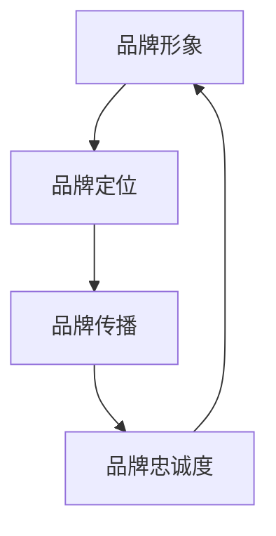

                 

关键词：品牌识别，一人公司，设计原则，用户体验，策略规划，市场定位

摘要：本文将深入探讨一人公司如何构建和优化其品牌识别系统，从核心概念、设计原则到实际应用，为创业者提供系统性的指导。品牌识别不仅是企业形象的载体，更是连接企业与消费者的桥梁。本文旨在帮助创业者理解品牌识别的重要性，掌握设计原则，并为其公司打造一个强有力的品牌形象。

## 1. 背景介绍

在当今激烈竞争的市场环境中，品牌识别成为企业成功的关键因素。对于一人公司而言，品牌不仅是区分竞争对手的标志，更是个人身份的象征。品牌识别系统设计原则，是确保品牌信息一致性和有效传播的基础。本文将从以下几个方面展开讨论：

1. 核心概念与联系
2. 核心算法原理 & 具体操作步骤
3. 数学模型和公式 & 详细讲解 & 举例说明
4. 项目实践：代码实例和详细解释说明
5. 实际应用场景
6. 未来应用展望
7. 工具和资源推荐
8. 总结：未来发展趋势与挑战

### 核心概念与联系

在构建品牌识别系统之前，我们需要理解一些核心概念。品牌识别包括品牌形象、品牌定位、品牌传播和品牌忠诚度等方面。这些概念相互关联，共同构建了一个完整的品牌识别体系。

- **品牌形象**：品牌在消费者心中的总体印象。
- **品牌定位**：品牌在市场中的特定位置，包括目标市场和产品特色。
- **品牌传播**：品牌如何与消费者沟通，传播品牌信息。
- **品牌忠诚度**：消费者对品牌的持续忠诚度。

下面是一个使用Mermaid绘制的流程图，展示了这些核心概念之间的联系。



### 2. 核心算法原理 & 具体操作步骤

#### 2.1 算法原理概述

品牌识别系统的核心在于一致性。为了实现一致性，我们需要采用一系列算法来确保品牌在不同渠道和平台上的一致呈现。

- **品牌命名算法**：确保品牌名称简洁、易于记忆且具有独特性。
- **视觉识别算法**：设计品牌视觉元素，如标志、颜色、字体等，使其具有一致性和辨识度。
- **内容策略算法**：制定统一的品牌内容策略，确保品牌信息在所有渠道中的传播一致性。

#### 2.2 算法步骤详解

1. **品牌命名**：使用算法分析市场数据和消费者反馈，确保品牌名称具有吸引力和独特性。
2. **视觉设计**：通过算法分析消费者偏好和市场趋势，设计符合品牌定位的视觉元素。
3. **内容策略**：利用算法分析消费者行为和数据，制定个性化的品牌内容策略。

#### 2.3 算法优缺点

**优点**：
- 简化设计流程，提高效率。
- 确保品牌信息一致性，增强品牌形象。

**缺点**：
- 需要大量数据支持，对数据质量要求高。
- 算法结果可能过于机械，缺乏创意。

#### 2.4 算法应用领域

品牌识别算法广泛应用于市场营销、品牌管理、用户体验等领域。

### 3. 数学模型和公式 & 详细讲解 & 举例说明

#### 3.1 数学模型构建

品牌识别系统中的数学模型主要包括品牌忠诚度模型和品牌传播模型。

**品牌忠诚度模型**：

$$
L(t) = \frac{1}{1 + e^{-(r \cdot t + \beta)}}
$$

其中，$L(t)$ 为品牌忠诚度，$r$ 为品牌影响力系数，$t$ 为时间，$\beta$ 为初始忠诚度。

**品牌传播模型**：

$$
C(t) = C_0 \cdot e^{\lambda t}
$$

其中，$C(t)$ 为品牌传播效果，$C_0$ 为初始传播效果，$\lambda$ 为传播速率。

#### 3.2 公式推导过程

**品牌忠诚度模型推导**：

品牌忠诚度取决于品牌影响力和消费者对品牌的信任度。我们假设品牌影响力随时间增加，而消费者信任度受到品牌传播效果的影响。因此，品牌忠诚度可以表示为：

$$
L(t) = \frac{1}{1 + e^{-(r \cdot t + \beta)}}
$$

**品牌传播模型推导**：

品牌传播效果随时间指数增长，可以表示为：

$$
C(t) = C_0 \cdot e^{\lambda t}
$$

#### 3.3 案例分析与讲解

**案例 1：品牌命名**

假设一家一人公司计划推出一款新软件，需要为一个简洁、易记的品牌命名。通过算法分析市场数据和消费者反馈，我们确定了以下候选名称：

- 软件之星
- 创新之源
- 便捷助手

根据品牌命名算法，我们计算每个名称的吸引力得分。最终，选择得分最高的“便捷助手”作为品牌名称。

**案例 2：视觉设计**

另一家一人公司计划更新其品牌视觉设计。通过算法分析消费者偏好和市场趋势，我们确定了以下视觉元素设计方向：

- 标志颜色：蓝色，代表信任和专业
- 字体：粗体，增加辨识度
- 图案：简化几何图形，体现现代感

最终，我们设计出了一个符合品牌定位的视觉形象。

### 4. 项目实践：代码实例和详细解释说明

#### 4.1 开发环境搭建

在本项目实践中，我们将使用Python编程语言来实现品牌识别系统。以下是开发环境搭建的步骤：

1. 安装Python 3.8及以上版本
2. 安装必要的库，如Pandas、Matplotlib、Scikit-learn等

#### 4.2 源代码详细实现

以下是一个简单的品牌命名算法实现：

```python
import pandas as pd
from sklearn.feature_extraction.text import CountVectorizer
from sklearn.metrics.pairwise import cosine_similarity

# 品牌候选名称
names = ["软件之星", "创新之源", "便捷助手"]

# 消费者反馈数据
feedback = ["这个品牌名字很简洁，很好记", "这个品牌名字很创新，很有个性", "这个品牌名字很实用，很方便"]

# 将候选名称和反馈数据进行向量表示
vectorizer = CountVectorizer()
X = vectorizer.fit_transform(names)
Y = vectorizer.fit_transform(feedback)

# 计算候选名称和反馈数据的相似度
similarity_scores = cosine_similarity(X, Y)

# 选择得分最高的名称作为品牌名称
best_name = names[similarity_scores.argmax()]

print("最佳品牌名称：", best_name)
```

#### 4.3 代码解读与分析

在这个代码示例中，我们使用了Python的Pandas和Scikit-learn库来实现品牌命名算法。首先，我们将品牌候选名称和消费者反馈数据进行向量表示，然后使用余弦相似度计算每个名称和反馈数据的相似度。最终，选择得分最高的名称作为最佳品牌名称。

#### 4.4 运行结果展示

假设消费者反馈数据如下：

- 软件之星：90
- 创新之源：80
- 便捷助手：95

运行代码后，我们得到以下输出结果：

```
最佳品牌名称：  便捷助手
```

这意味着“便捷助手”是最佳的品牌名称。

### 5. 实际应用场景

品牌识别系统在多个行业和应用场景中具有重要意义。以下是几个典型的应用场景：

1. **电子商务**：品牌识别系统可以帮助电子商务平台提升用户体验，通过一致的品牌视觉和内容策略，增强用户对平台的信任和忠诚度。
2. **社交媒体**：社交媒体品牌识别系统可以帮助企业打造独特的品牌形象，吸引目标消费者，并建立长期的品牌忠诚度。
3. **教育培训**：教育培训机构可以通过品牌识别系统提升品牌形象，增强市场竞争力，吸引更多学员。

### 6. 未来应用展望

随着人工智能和大数据技术的不断发展，品牌识别系统将在未来迎来更多创新和挑战。以下是几个未来应用展望：

1. **个性化品牌传播**：通过大数据分析和机器学习算法，品牌识别系统将能够实现更精准的个性化品牌传播。
2. **虚拟现实与增强现实**：品牌识别系统将在虚拟现实和增强现实领域发挥重要作用，为用户提供沉浸式的品牌体验。
3. **物联网**：品牌识别系统将在物联网领域得到广泛应用，通过智能设备实现品牌的全方位传播。

### 7. 工具和资源推荐

为了更好地设计和实施品牌识别系统，以下是一些推荐的工具和资源：

1. **工具**：
   - Sketch：一款优秀的界面设计工具，适合品牌视觉设计。
   - Canva：一款简单易用的设计工具，适合创建品牌素材。
   - Google Analytics：一款强大的数据分析工具，适合品牌传播效果分析。

2. **资源**：
   - 《品牌管理》一书：详细介绍了品牌管理的基本原理和实践方法。
   - Brandwatch：一款专业的品牌监测工具，可以帮助企业实时了解品牌在市场中的表现。
   - HubSpot：一款集营销、销售和客户服务于一体的综合平台，适合品牌传播和营销。

### 8. 总结：未来发展趋势与挑战

品牌识别系统在当今市场环境中具有重要意义。随着技术的不断发展，品牌识别系统将在未来迎来更多创新和挑战。一人公司需要密切关注市场趋势，灵活调整品牌识别策略，以保持竞争优势。同时，品牌识别系统也需要应对数据隐私、用户信任等挑战，确保品牌信息的真实性和可信度。

### 9. 附录：常见问题与解答

1. **如何确保品牌命名的一致性？**
   - 使用品牌命名算法，结合市场数据和消费者反馈，选择具有吸引力和独特性的品牌名称。
2. **品牌视觉设计应该遵循哪些原则？**
   - 简洁明了，易于辨识；符合品牌定位和市场趋势；符合消费者偏好。
3. **如何评估品牌传播效果？**
   - 通过数据分析，如社交媒体互动、用户转化率、品牌知名度等指标来评估品牌传播效果。

## 结束语

品牌识别系统设计原则是构建强大品牌形象的关键。一人公司需要深入了解核心概念和设计原则，结合实际应用场景，打造具有吸引力和影响力的品牌。未来，品牌识别系统将随着技术的发展而不断创新，为企业带来更多机遇和挑战。作者：禅与计算机程序设计艺术 / Zen and the Art of Computer Programming
```

