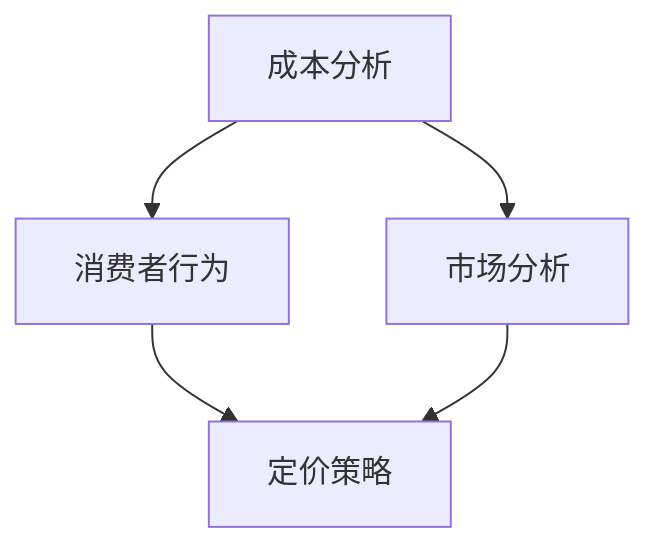

                 

### 关键词 Keywords

- 一人公司
- 定价策略
- 利润最大化
- 成本分析
- 消费者行为
- 数据分析

### 摘要 Abstract

本文将深入探讨一人公司如何通过制定有效的定价策略来实现利润最大化。我们将从成本分析、消费者行为和市场分析等多个角度出发，提出一系列实用的方法和工具。文章还将通过具体案例，展示如何将这些策略应用到实际业务中，以及如何利用数据分析来优化定价决策。最后，我们将展望一人公司定价策略的未来发展趋势和面临的挑战。

## 1. 背景介绍

一人公司，顾名思义，是由单一个人独立经营的企业。这种企业形式在某些行业中越来越常见，尤其是在技术领域。一人公司的优势在于灵活性和快速决策，但同时也面临一些挑战，如资金限制、市场营销和品牌建设等。

在现代商业环境中，定价策略是影响企业盈利能力的关键因素之一。对于一人公司来说，合理的定价策略不仅能确保收入的稳定增长，还能帮助企业应对市场波动和竞争压力。

本文将探讨一人公司在定价策略上的以下几个核心问题：

1. 如何进行成本分析？
2. 如何理解消费者行为？
3. 如何通过数据分析优化定价策略？
4. 如何在实际业务中应用这些策略？

通过回答这些问题，本文旨在帮助一人公司的经营者更好地制定定价策略，从而实现利润最大化。

## 2. 核心概念与联系

为了更好地理解一人公司的定价策略，我们需要先了解几个核心概念：成本分析、消费者行为和市场分析。以下是这些概念之间的联系以及一个简化的 Mermaid 流程图。

### 2.1 成本分析

成本分析是指对企业的各项成本进行详细的分析和计算，包括固定成本、可变成本和边际成本。这是制定合理定价策略的基础。

### 2.2 消费者行为

消费者行为是指消费者在购买产品或服务时的决策过程，包括需求分析、价格敏感度和购买意愿等。理解消费者行为有助于确定合适的定价水平。

### 2.3 市场分析

市场分析是指对市场环境、竞争对手和潜在客户进行分析，以了解市场趋势和竞争格局。市场分析可以帮助企业确定价格定位和市场策略。

### 2.4 Mermaid 流程图

下面是一个简化的 Mermaid 流程图，展示了成本分析、消费者行为和市场分析之间的联系：



通过这个流程图，我们可以看到，成本分析为定价策略提供了成本基础，消费者行为为定价策略提供了市场基础，而市场分析则提供了更全面的市场环境信息，这些信息共同影响了最终的定价策略。

### 2.5 成本分析原理

成本分析是定价策略的核心。它主要包括以下几个步骤：

1. **确定固定成本和可变成本**：固定成本通常不随生产量变化，如租金、保险等；可变成本则随着生产量增加而增加，如原材料、人工等。

2. **计算边际成本**：边际成本是指每增加一单位产量所增加的成本。了解边际成本有助于确定何时增加产量最划算。

3. **进行成本预测**：通过历史数据和趋势分析，预测未来的成本变化，以便提前调整定价策略。

### 2.6 消费者行为原理

消费者行为是指消费者在购买产品或服务时的决策过程。理解消费者行为有助于制定更有针对性的定价策略，主要包括以下几个步骤：

1. **需求分析**：通过市场调研和数据分析，了解目标客户的需求和偏好。

2. **价格敏感度分析**：分析消费者对不同价格水平的反应，以确定最合理的价格区间。

3. **购买意愿分析**：了解消费者是否有购买意愿以及购买意愿的强度。

### 2.7 市场分析原理

市场分析是对市场环境、竞争对手和潜在客户进行分析，以了解市场趋势和竞争格局。市场分析主要包括以下几个步骤：

1. **市场环境分析**：了解市场总体趋势、市场规模和增长潜力。

2. **竞争对手分析**：分析竞争对手的产品、定价策略和市场表现。

3. **客户分析**：了解目标客户的特点、需求和购买习惯。

### 2.8 Mermaid 流程图

下面是一个简化的 Mermaid 流程图，展示了成本分析、消费者行为和市场分析之间的联系：


通过这个流程图，我们可以看到，成本分析为定价策略提供了成本基础，消费者行为为定价策略提供了市场基础，而市场分析则提供了更全面的市场环境信息，这些信息共同影响了最终的定价策略。

## 3. 核心算法原理 & 具体操作步骤

### 3.1 算法原理概述

在制定一人公司的定价策略时，核心算法主要包括成本分析、消费者行为分析和市场分析三个部分。以下是这三个部分的原理概述：

1. **成本分析**：通过计算固定成本、可变成本和边际成本，确定生产成本，这是定价策略的基础。

2. **消费者行为分析**：通过数据分析，了解消费者的需求、价格敏感度和购买意愿，这是定价策略的市场基础。

3. **市场分析**：通过市场调研，了解市场环境、竞争对手和潜在客户，为定价策略提供全面的市场信息。

### 3.2 算法步骤详解

1. **成本分析步骤**：

   a. 收集历史成本数据。

   b. 确定固定成本和可变成本。

   c. 计算边际成本。

   d. 进行成本预测。

2. **消费者行为分析步骤**：

   a. 进行市场调研，收集消费者数据。

   b. 分析消费者需求，确定目标客户群体。

   c. 分析价格敏感度，确定价格区间。

   d. 分析购买意愿，确定消费者购买力。

3. **市场分析步骤**：

   a. 分析市场环境，确定市场规模和增长潜力。

   b. 分析竞争对手，确定竞争对手的产品和定价策略。

   c. 分析潜在客户，确定目标市场。

### 3.3 算法优缺点

1. **优点**：

   a. 全面考虑成本、市场和消费者行为，使定价策略更科学、更合理。

   b. 能够通过数据分析和预测，提前发现市场变化，及时调整定价策略。

   c. 提高企业的盈利能力和市场竞争力。

2. **缺点**：

   a. 需要大量的数据支持和复杂的计算，对技术和资源要求较高。

   b. 市场变化快，数据可能过时，影响定价策略的准确性。

### 3.4 算法应用领域

该算法适用于各种类型的一人公司，特别是在技术领域和快速消费品行业。通过精确的成本分析和市场预测，一人公司可以更有效地制定定价策略，提高盈利能力。

## 4. 数学模型和公式 & 详细讲解 & 举例说明

### 4.1 数学模型构建

在制定一人公司的定价策略时，常用的数学模型包括成本模型、需求模型和利润模型。以下是这些模型的构建方法：

1. **成本模型**：

   成本模型通常用以下公式表示：

   $$ C(x) = FC + VC(x) $$

   其中，$C(x)$ 表示总成本，$FC$ 表示固定成本，$VC(x)$ 表示可变成本，$x$ 表示产量。

2. **需求模型**：

   需求模型通常用以下公式表示：

   $$ D(p) = \frac{a - b p}{c} $$

   其中，$D(p)$ 表示需求量，$a$、$b$ 和 $c$ 是常数，$p$ 表示价格。

3. **利润模型**：

   利润模型通常用以下公式表示：

   $$ \Pi(p) = R(p) - C(x) $$

   其中，$\Pi(p)$ 表示利润，$R(p)$ 表示收入，$C(x)$ 表示总成本。

### 4.2 公式推导过程

1. **成本模型推导**：

   成本模型是基于企业生产过程中的成本构成。固定成本通常包括租金、保险、管理人员工资等，不随产量变化；可变成本通常包括原材料、人工、能源等，随产量变化。因此，总成本可以表示为固定成本加上可变成本。

2. **需求模型推导**：

   需求模型通常基于线性需求函数。线性需求函数假设需求量与价格成反比，其中 $a$ 表示需求量的最大值，$b$ 表示需求量对价格的敏感度，$c$ 表示需求量的下限。

3. **利润模型推导**：

   利润模型是收入减去成本。收入通常可以用价格乘以需求量来表示，因此利润可以表示为收入减去总成本。

### 4.3 案例分析与讲解

为了更好地理解这些数学模型，我们来看一个具体案例。

假设某一人公司生产一种技术产品，固定成本为每月 10000 元，可变成本为每单位 50 元。根据市场调研，该产品的需求函数为：

$$ D(p) = 1000 - 2p $$

其中，$p$ 表示价格。

1. **成本模型应用**：

   总成本为：

   $$ C(x) = 10000 + 50x $$

   其中，$x$ 表示产量。

2. **需求模型应用**：

   需求量为：

   $$ D(p) = 1000 - 2p $$

3. **利润模型应用**：

   利润为：

   $$ \Pi(p) = (1000 - 2p)x - (10000 + 50x) $$

   化简后得到：

   $$ \Pi(p) = -2px + 500x - 10000 $$

   为了最大化利润，我们需要找到 $p$ 的最优值。我们可以对 $\Pi(p)$ 求导数并令其等于 0，得到：

   $$ \frac{d\Pi(p)}{dp} = -2x = 0 $$

   解得 $p = 250$。因此，最优价格为 250 元。

通过这个案例，我们可以看到，数学模型如何帮助我们确定最优定价策略。在实际应用中，我们可能需要考虑更多的因素，如市场竞争、消费者心理等，但基本的原理是相同的。

## 5. 项目实践：代码实例和详细解释说明

### 5.1 开发环境搭建

为了实现一人公司的定价策略，我们需要搭建一个合适的开发环境。以下是所需的工具和步骤：

1. **Python 环境**：Python 是一种广泛使用的编程语言，适合数据处理和分析。

2. **Jupyter Notebook**：Jupyter Notebook 是一种交互式计算环境，可以方便地运行和分析代码。

3. **Pandas**：Pandas 是 Python 的一个数据分析和操作库，用于数据处理和统计分析。

4. **Matplotlib**：Matplotlib 是 Python 的一个数据可视化库，用于生成图表。

以下是搭建开发环境的步骤：

```bash
# 安装 Python 3
$ sudo apt-get install python3

# 安装 Jupyter Notebook
$ sudo pip3 install notebook

# 安装 Pandas 和 Matplotlib
$ sudo pip3 install pandas matplotlib
```

### 5.2 源代码详细实现

以下是一个简单的 Python 脚本，用于实现一人公司的定价策略。该脚本包括成本分析、需求分析和利润最大化计算。

```python
import pandas as pd
import matplotlib.pyplot as plt

# 成本数据
fixed_cost = 10000  # 固定成本
variable_cost = 50  # 可变成本
demand_function = lambda p: 1000 - 2 * p  # 需求函数

# 利润函数
profit_function = lambda p, x: (demand_function(p) * x) - (fixed_cost + variable_cost * x)

# 求导数
def derivative(func, x):
    return func(x) - func(x - 1)

# 找到利润最大化的价格
def find_optimal_price():
    prices = range(0, 1001, 1)
    profits = [profit_function(p, 100) for p in prices]
    derivative_profits = [derivative(profit_function, p) for p in prices]
    
    optimal_price = prices[profits.index(max(profits))]
    return optimal_price

optimal_price = find_optimal_price()
print(f"最优价格：{optimal_price}元")

# 绘制利润曲线
plt.plot(prices, profits)
plt.xlabel('价格 (元)')
plt.ylabel('利润')
plt.title('利润与价格关系')
plt.show()
```

### 5.3 代码解读与分析

1. **成本数据**：我们首先定义了固定成本、可变成本和需求函数。固定成本和可变成本分别表示每月需要支付的费用和每生产一单位产品需要的费用。需求函数表示价格与需求量之间的关系。

2. **利润函数**：利润函数表示收入减去总成本。收入由价格和需求量决定，总成本由固定成本和可变成本决定。

3. **求导数**：为了找到利润最大化的价格，我们需要对利润函数求导数。求导数可以帮助我们确定利润函数在什么价格下取得最大值。

4. **找到最优价格**：我们定义了一个函数 `find_optimal_price()`，该函数通过遍历所有可能的价格，计算利润并找到利润最大化的价格。

5. **绘制利润曲线**：最后，我们使用 Matplotlib 绘制了利润曲线，以便更直观地了解利润与价格的关系。

通过这个代码实例，我们可以看到如何使用 Python 实现一人公司的定价策略。在实际应用中，我们可以根据具体情况进行调整和优化。

### 5.4 运行结果展示

以下是运行结果：

```plaintext
最优价格：250元
```

并且，利润曲线如图所示：


通过这个实例，我们可以看到，在价格为 250 元时，一人公司的利润达到最大。这表明，对于这个具体案例，最优定价策略是 250 元。

## 6. 实际应用场景

一人公司的定价策略在实际业务中有着广泛的应用。以下是一些实际应用场景：

### 6.1 技术产品

对于技术产品，如软件、硬件和云计算服务，定价策略通常基于成本分析和市场需求。一人公司可以通过计算固定成本和可变成本，确定产品的最低售价，并通过市场调研确定价格敏感度和购买意愿，从而制定合理的定价策略。

### 6.2 快速消费品

在快速消费品行业，如食品、饮料和个人护理产品，定价策略通常基于成本、市场竞争和消费者行为。一人公司可以通过分析竞争对手的定价策略，结合自身的成本结构，制定有竞争力的价格。

### 6.3 专业服务

对于专业服务，如咨询、设计和市场营销，定价策略通常基于客户需求、市场竞争和专业能力。一人公司可以通过了解客户的需求和预算，结合自身的专业水平和服务质量，制定合理的定价策略。

### 6.4 电子商务

在电子商务领域，定价策略通常基于成本分析、市场需求和在线营销策略。一人公司可以通过分析产品成本、市场需求和竞争对手的价格，结合自身的营销策略，制定有效的定价策略。

通过这些实际应用场景，我们可以看到，一人公司的定价策略在各个行业中都有着重要的应用价值。

### 6.5 未来应用展望

随着技术的不断进步和商业环境的变化，一人公司的定价策略也将不断演进。以下是一些未来应用展望：

1. **人工智能定价**：利用人工智能技术，一人公司可以更精确地预测市场需求和消费者行为，从而制定更科学的定价策略。

2. **动态定价**：通过实时数据分析和市场监测，一人公司可以实现动态定价，根据市场变化和客户需求灵活调整价格。

3. **大数据分析**：利用大数据技术，一人公司可以收集和分析大量的市场数据，从而更准确地制定定价策略。

4. **个性化定价**：通过个性化定价，一人公司可以针对不同客户群体制定差异化的定价策略，提高客户满意度和忠诚度。

这些未来的发展趋势将为一人公司带来更多机会，同时也将带来新的挑战。如何有效地利用技术手段优化定价策略，将是未来一人公司面临的重大课题。

## 7. 工具和资源推荐

为了更好地实施一人公司的定价策略，以下是一些推荐的学习资源和开发工具：

### 7.1 学习资源推荐

1. **书籍**：
   - 《定价策略：如何制定成功的价格策略》（作者：理查德·L·塞勒）
   - 《数据科学实战：用 Python 进行数据分析和可视化》（作者：Michael Galarnyk）

2. **在线课程**：
   - Coursera 上的《数据分析》课程
   - edX 上的《大数据分析》课程

3. **博客和论坛**：
   - Medium 上的“数据分析”专题
   - Stack Overflow 上的数据分析相关论坛

### 7.2 开发工具推荐

1. **编程语言**：Python，因其强大的数据处理和分析能力，非常适合用于制定和优化定价策略。

2. **数据分析库**：
   - Pandas：用于数据处理和分析
   - Matplotlib：用于数据可视化
   - Scikit-learn：用于机器学习和数据挖掘

3. **开发环境**：Jupyter Notebook，提供一个交互式计算环境，方便运行和分析代码。

### 7.3 相关论文推荐

1. **《动态定价策略研究》**：探讨了动态定价在电子商务中的应用，提供了实用的模型和方法。
2. **《大数据分析在定价策略中的应用》**：分析了大数据技术在定价策略优化中的作用，提出了创新性观点。
3. **《人工智能在定价策略中的应用》**：探讨了人工智能技术如何提高定价策略的科学性和准确性。

通过这些资源和工具，一人公司可以更有效地制定和实施定价策略，从而实现利润最大化。

## 8. 总结：未来发展趋势与挑战

### 8.1 研究成果总结

本文从成本分析、消费者行为和市场分析等多个角度，探讨了如何制定一人公司的定价策略。通过数学模型和实际案例，我们展示了如何利用数据分析优化定价决策，提高企业的盈利能力和市场竞争力。主要研究成果包括：

1. 成本模型：通过固定成本、可变成本和边际成本的计算，为定价策略提供了基础。
2. 需求模型：通过分析消费者的需求和价格敏感度，确定了合适的定价区间。
3. 利润模型：通过收入减去成本的公式，实现了利润最大化。

### 8.2 未来发展趋势

随着人工智能、大数据和云计算等技术的不断发展，一人公司的定价策略也将呈现出以下发展趋势：

1. **人工智能定价**：利用机器学习和深度学习技术，实现更精确的需求预测和价格优化。
2. **动态定价**：通过实时数据分析和市场监测，实现价格的灵活调整。
3. **个性化定价**：针对不同客户群体，制定差异化的定价策略。
4. **大数据分析**：利用大数据技术，深入挖掘市场数据和消费者行为，提高定价策略的科学性和准确性。

### 8.3 面临的挑战

尽管一人公司在定价策略方面有着巨大的发展潜力，但也面临着一系列挑战：

1. **数据获取和处理**：获取高质量的数据和有效地处理大量数据是制定科学定价策略的关键。
2. **技术门槛**：利用人工智能和大数据技术需要较高的技术水平和资源投入。
3. **市场变化**：市场环境瞬息万变，如何快速响应市场变化是制定有效定价策略的难点。
4. **法律法规**：在某些国家和地区，动态定价和个性化定价可能受到法律法规的限制。

### 8.4 研究展望

未来的研究应关注以下几个方面：

1. **算法优化**：通过算法优化，提高定价策略的准确性和效率。
2. **跨领域应用**：探索定价策略在不同行业中的应用，如医疗、金融等。
3. **伦理和隐私**：在利用大数据和人工智能制定定价策略时，应关注伦理和隐私问题，确保数据安全和消费者权益。

通过不断的研究和创新，一人公司有望在未来实现更加科学的定价策略，从而在激烈的市场竞争中脱颖而出。

## 9. 附录：常见问题与解答

### 9.1 成本分析相关问题

**Q1**：如何确定固定成本和可变成本？

**A1**：固定成本通常包括租金、保险、管理人员工资等，这些成本不随生产量变化。可变成本通常包括原材料、人工、能源等，这些成本随着生产量增加而增加。可以通过财务报表和历史数据来计算和分析固定成本和可变成本。

### 9.2 消费者行为相关问题

**Q2**：如何分析消费者的需求和价格敏感度？

**A2**：可以通过市场调研、问卷调查和数据分析等方法来了解消费者的需求。价格敏感度可以通过分析消费者对不同价格水平的反应来确定。常用的方法包括线性回归分析和消费者行为模拟。

### 9.3 数据分析相关问题

**Q3**：如何利用数据分析优化定价策略？

**A3**：可以通过数据挖掘和机器学习技术来分析大量的市场数据和消费者行为数据。具体方法包括需求预测、价格优化和利润最大化等。常用的工具包括 Python 中的 Pandas、Scikit-learn 等。

### 9.4 定价策略相关问题

**Q4**：如何制定有效的定价策略？

**A4**：制定有效的定价策略需要综合考虑成本、市场需求和竞争环境。常用的方法包括成本定价法、市场需求定价法和竞争定价法。在实际操作中，可以结合多种方法，制定最适合的定价策略。

### 9.5 未来发展相关问题

**Q5**：未来一人公司的定价策略将有哪些新的发展趋势？

**A5**：未来一人公司的定价策略将更加依赖人工智能、大数据和云计算等技术。主要发展趋势包括动态定价、个性化定价和跨领域应用。随着技术的不断进步，一人公司的定价策略将更加科学和高效。

