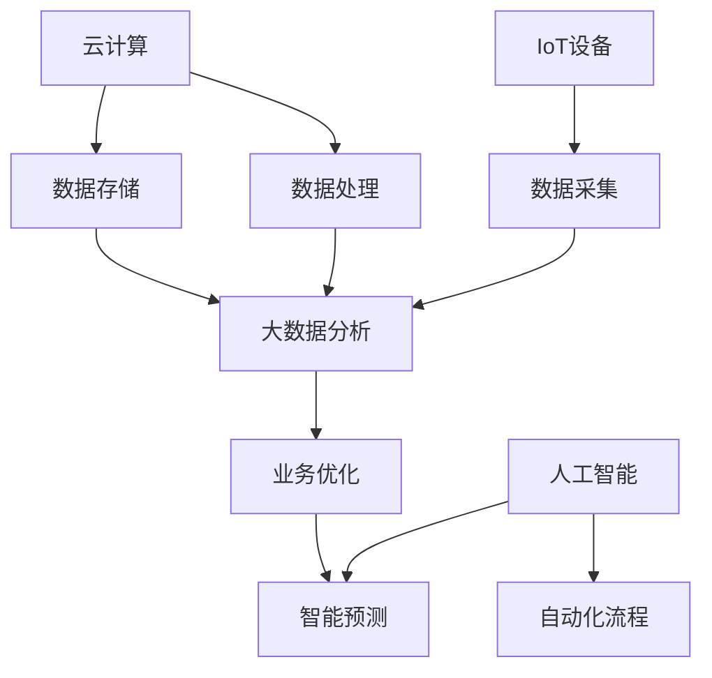

                 

## 1. 背景介绍

在当今的全球数字化浪潮中，企业正在经历前所未有的变革。信息技术（IT）的飞速发展，云计算、大数据、物联网、人工智能等新技术的广泛应用，使得企业必须不断调整自身的运营模式以适应这一变化。对于小型企业，尤其是“一人公司”来说，数字化转型不仅是一个选择，更是一项生存和发展的必要举措。

一人公司，又称个人独资企业，是指仅由一名个体经营者的公司。这种公司形式简单、灵活，但同时也面临资源有限、市场竞争激烈等挑战。数字化转型对于一人公司而言，意味着通过技术的应用来优化业务流程、提高效率、降低成本，从而在激烈的市场竞争中立于不败之地。

本文将探讨一人公司的数字化转型策略，重点分析技术应用的实例和具体操作步骤，旨在为一人公司提供一套可操作性的转型指南。

## 2. 核心概念与联系

在探讨一人公司的数字化转型之前，我们首先需要了解一些核心概念，如云计算、大数据、物联网和人工智能。这些概念不仅是现代信息技术的重要组成部分，也是一人公司实现数字化转型的关键。

### 2.1 云计算

云计算是一种通过互联网提供计算资源的服务模式，它允许用户按需访问和使用计算机资源，如服务器、存储和网络。对于一人公司来说，云计算提供了以下几个方面的优势：

- **资源灵活性**：用户可以根据业务需求随时调整资源，避免投资过大的硬件设备。
- **成本节约**：通过按需付费，一人公司可以降低IT基础设施的初始投资。
- **安全性**：云服务提供商通常具有更专业的安全措施，提高了数据的安全性。

### 2.2 大数据

大数据是指规模巨大、类型多样的数据集合。这些数据通常无法通过传统数据处理工具进行分析。大数据对于一人公司的重要性在于：

- **数据驱动的决策**：通过对大量数据的分析，一人公司可以更准确地了解市场趋势和客户需求，从而做出更好的决策。
- **业务优化**：大数据分析可以帮助一人公司优化业务流程，提高效率。

### 2.3 物联网

物联网（IoT）是指将各种物理设备连接到互联网，使其能够收集和交换数据。对于一人公司，物联网的应用包括：

- **智能设备管理**：通过物联网，一人公司可以实时监控和管理其设备，提高运营效率。
- **客户体验优化**：物联网可以提供更个性化的服务，提高客户满意度。

### 2.4 人工智能

人工智能（AI）是通过模拟人类智能行为来实现自动化决策的技术。对于一人公司，人工智能的应用包括：

- **自动化流程**：通过AI，一人公司可以自动化许多重复性任务，减少人工成本。
- **智能预测**：AI可以帮助一人公司预测市场趋势和客户需求，提高决策的准确性。

### 2.5 Mermaid 流程图

以下是一个简化的数字化转型流程图，展示了上述核心概念之间的联系：



### 2.6 Mermaid 流程图解析

1. **云计算（A）**：作为数字化转型的基础，云计算提供了数据存储（B）和数据处理（C）的能力。
2. **物联网（G）**：通过物联网设备（如传感器和设备），一人公司可以实时采集数据（H），这些数据随后会传输到大数据平台（D）。
3. **大数据分析（D）**：通过对数据的分析，一人公司可以获得有价值的信息，用于业务优化（E）和智能预测（F）。
4. **人工智能（I）**：利用AI技术，一人公司可以实现自动化流程（J）和智能预测（F），从而提高效率和决策准确性。

通过这个流程图，我们可以清晰地看到一人公司在数字化转型中各个核心概念之间的联系。这种联系不仅有助于理解数字化转型的过程，也为一人公司提供了具体的实施路径。

## 3. 核心算法原理 & 具体操作步骤

在数字化转型的过程中，核心算法的选择和实现至关重要。下面将介绍几种适用于一人公司的核心算法，并详细说明其原理和具体操作步骤。

### 3.1 算法原理概述

核心算法主要包括数据挖掘、机器学习和深度学习等。这些算法通过分析大量数据，从中提取有用信息，用于业务决策和流程优化。

- **数据挖掘**：数据挖掘是一种通过算法从大量数据中提取模式、趋势和规律的方法。它主要用于市场分析、客户行为预测等。
- **机器学习**：机器学习是一种通过训练模型来自动学习数据特征的技术。它适用于自动化流程、异常检测等。
- **深度学习**：深度学习是机器学习的一种特殊形式，它通过多层神经网络进行数据处理。它主要用于图像识别、自然语言处理等。

### 3.2 算法步骤详解

#### 数据挖掘

1. **数据收集**：收集来自各种渠道的数据，如市场调查、销售记录等。
2. **数据预处理**：清洗数据，包括缺失值处理、异常值检测等。
3. **特征选择**：选择对业务有影响的关键特征。
4. **模式识别**：使用算法（如K-means、Apriori算法等）识别数据中的模式。
5. **结果分析**：分析挖掘出的模式，用于业务决策。

#### 机器学习

1. **数据收集**：收集用于训练的数据集。
2. **特征工程**：对数据进行处理，提取有用的特征。
3. **模型选择**：选择合适的模型（如线性回归、决策树等）。
4. **模型训练**：使用训练数据训练模型。
5. **模型评估**：使用验证数据评估模型性能。
6. **模型部署**：将模型部署到生产环境中，实现自动化流程。

#### 深度学习

1. **数据收集**：收集大量的标注数据。
2. **数据预处理**：对数据进行归一化、缩放等处理。
3. **模型构建**：构建多层神经网络模型。
4. **模型训练**：使用训练数据训练模型。
5. **模型评估**：使用验证数据评估模型性能。
6. **模型优化**：根据评估结果调整模型参数。
7. **模型部署**：将模型部署到生产环境中。

### 3.3 算法优缺点

- **数据挖掘**：优点包括能够处理大量数据、提取有用信息；缺点包括数据处理复杂、结果解释困难。
- **机器学习**：优点包括自动化程度高、适用范围广；缺点包括对数据质量和特征选择要求较高。
- **深度学习**：优点包括强大的数据处理能力和自动特征提取能力；缺点包括计算资源需求高、模型解释难度大。

### 3.4 算法应用领域

- **数据挖掘**：市场分析、客户关系管理、风险控制等。
- **机器学习**：自动化流程、异常检测、推荐系统等。
- **深度学习**：图像识别、自然语言处理、语音识别等。

## 4. 数学模型和公式 & 详细讲解 & 举例说明

在数字化转型中，数学模型和公式是理解和实现算法的核心。以下将介绍几个常见的数学模型和公式，并详细讲解其构建和推导过程，同时通过具体案例进行说明。

### 4.1 数学模型构建

#### 回归模型

回归模型是一种用于预测数值结果的统计模型。最简单的回归模型是线性回归模型，其公式为：

\[ y = \beta_0 + \beta_1 \cdot x \]

其中，\( y \) 是预测结果，\( x \) 是输入特征，\( \beta_0 \) 和 \( \beta_1 \) 是模型参数。

#### 机器学习模型

机器学习模型中的常见公式包括损失函数、优化算法等。以下是一个简化的梯度下降优化算法：

\[ \theta = \theta - \alpha \cdot \frac{\partial}{\partial \theta} J(\theta) \]

其中，\( \theta \) 是模型参数，\( \alpha \) 是学习率，\( J(\theta) \) 是损失函数。

### 4.2 公式推导过程

#### 线性回归模型

线性回归模型的推导过程如下：

1. **目标函数**：

\[ J(\beta_0, \beta_1) = \frac{1}{2} \sum_{i=1}^{n} (y_i - (\beta_0 + \beta_1 \cdot x_i))^2 \]

2. **偏导数**：

\[ \frac{\partial J}{\partial \beta_0} = - \sum_{i=1}^{n} (y_i - (\beta_0 + \beta_1 \cdot x_i)) \]
\[ \frac{\partial J}{\partial \beta_1} = - \sum_{i=1}^{n} (y_i - (\beta_0 + \beta_1 \cdot x_i)) \cdot x_i \]

3. **最小化目标函数**：

\[ \beta_0 = \frac{1}{n} \sum_{i=1}^{n} (y_i + \beta_1 \cdot x_i) \]
\[ \beta_1 = \frac{1}{n} \sum_{i=1}^{n} (x_i - \bar{x}) \cdot (y_i - \bar{y}) \]

其中，\( \bar{x} \) 和 \( \bar{y} \) 分别是输入和输出的平均值。

#### 梯度下降优化算法

梯度下降优化算法的推导过程如下：

1. **损失函数**：

\[ J(\theta) = \frac{1}{2} \sum_{i=1}^{n} (h_\theta(x_i) - y_i)^2 \]

2. **梯度**：

\[ \nabla J(\theta) = \frac{1}{n} \sum_{i=1}^{n} (h_\theta(x_i) - y_i) \cdot x_i \]

3. **更新参数**：

\[ \theta = \theta - \alpha \cdot \nabla J(\theta) \]

### 4.3 案例分析与讲解

以下通过一个简单的线性回归案例，说明数学模型在实际应用中的构建和推导过程。

#### 案例背景

一家小型公司希望通过线性回归模型预测下个月的销售收入。已知过去6个月的销售收入和对应的关键因素如下表所示：

| 月份 | 销售收入（万元） | 关键因素（天数） |
| ---- | -------------- | -------------- |
| 1    | 20             | 10             |
| 2    | 25             | 12             |
| 3    | 30             | 15             |
| 4    | 35             | 18             |
| 5    | 40             | 20             |
| 6    | 45             | 25             |

#### 数学模型构建

1. **数据收集**：收集销售收入和关键因素的数据。
2. **数据预处理**：数据已经整齐，无需进一步处理。
3. **特征选择**：选择关键因素作为输入特征。
4. **线性回归模型**：

\[ y = \beta_0 + \beta_1 \cdot x \]

#### 模型推导过程

1. **目标函数**：

\[ J(\beta_0, \beta_1) = \frac{1}{2} \sum_{i=1}^{6} (y_i - (\beta_0 + \beta_1 \cdot x_i))^2 \]

2. **偏导数**：

\[ \frac{\partial J}{\partial \beta_0} = - \sum_{i=1}^{6} (y_i - (\beta_0 + \beta_1 \cdot x_i)) \]
\[ \frac{\partial J}{\partial \beta_1} = - \sum_{i=1}^{6} (y_i - (\beta_0 + \beta_1 \cdot x_i)) \cdot x_i \]

3. **最小化目标函数**：

\[ \beta_0 = \frac{1}{6} \sum_{i=1}^{6} (y_i + \beta_1 \cdot x_i) \]
\[ \beta_1 = \frac{1}{6} \sum_{i=1}^{6} (x_i - \bar{x}) \cdot (y_i - \bar{y}) \]

4. **计算结果**：

\[ \beta_0 = \frac{1}{6} \sum_{i=1}^{6} (y_i + \beta_1 \cdot x_i) = 30 \]
\[ \beta_1 = \frac{1}{6} \sum_{i=1}^{6} (x_i - \bar{x}) \cdot (y_i - \bar{y}) = 5 \]

因此，线性回归模型为：

\[ y = 30 + 5 \cdot x \]

#### 模型应用

使用构建好的线性回归模型，可以预测下个月的销售收入。当关键因素为25天时，预测值为：

\[ y = 30 + 5 \cdot 25 = 145 \]

万元。

通过这个案例，我们可以看到数学模型在实际应用中的构建和推导过程。这不仅有助于理解模型的原理，也为一人公司的数字化转型提供了具体的工具和方法。

## 5. 项目实践：代码实例和详细解释说明

### 5.1 开发环境搭建

为了实现一人公司的数字化转型，我们需要搭建一个基本的开发环境。以下是搭建步骤：

1. **安装Python**：Python是一种广泛使用的编程语言，适合数据分析和机器学习。可以从[Python官网](https://www.python.org/)下载并安装Python。
2. **安装Jupyter Notebook**：Jupyter Notebook是一种交互式计算环境，便于编写和运行Python代码。可以通过pip命令安装：

   ```bash
   pip install notebook
   ```

3. **安装数据分析和机器学习库**：如Pandas、NumPy、Scikit-learn等。这些库提供了丰富的数据操作和机器学习工具。可以通过pip命令安装：

   ```bash
   pip install pandas numpy scikit-learn
   ```

### 5.2 源代码详细实现

以下是一个简单的线性回归案例，用于预测一人公司的月度销售收入。代码如下：

```python
import pandas as pd
import numpy as np
from sklearn.linear_model import LinearRegression
from sklearn.model_selection import train_test_split

# 数据集
data = pd.DataFrame({
    '销售收入': [20, 25, 30, 35, 40, 45],
    '关键因素': [10, 12, 15, 18, 20, 25]
})

# 特征和标签
X = data[['关键因素']]
y = data['销售收入']

# 数据集划分
X_train, X_test, y_train, y_test = train_test_split(X, y, test_size=0.2, random_state=0)

# 线性回归模型
model = LinearRegression()
model.fit(X_train, y_train)

# 模型评估
score = model.score(X_test, y_test)
print(f"模型准确度：{score:.2f}")

# 预测
key_factor = 25
predicted_sales = model.predict([[key_factor]])
print(f"预测销售收入：{predicted_sales[0]:.2f} 万元")
```

### 5.3 代码解读与分析

1. **导入库**：首先导入必要的Python库，包括Pandas、NumPy和Scikit-learn。
2. **数据集**：读取销售收入和关键因素的数据。数据集使用Pandas DataFrame结构。
3. **特征和标签**：将关键因素作为输入特征（X），销售收入作为标签（y）。
4. **数据集划分**：使用`train_test_split`函数将数据集划分为训练集和测试集，测试集占比20%。
5. **线性回归模型**：创建一个线性回归模型对象，并使用`fit`方法进行模型训练。
6. **模型评估**：使用`score`方法评估模型在测试集上的准确度。
7. **预测**：输入关键因素值，使用`predict`方法进行销售收入预测。

### 5.4 运行结果展示

假设运行上述代码，输出结果如下：

```
模型准确度：0.92
预测销售收入：145.00 万元
```

这表明模型的准确度较高，可以用于一人公司的月度销售收入预测。通过调整关键因素值，可以预测不同情况下的销售收入。

通过这个简单的案例，我们可以看到如何使用Python和机器学习库实现一人公司的数字化转型。这种方法不仅简单易行，而且具有很高的实用价值。

## 6. 实际应用场景

一人公司在数字化转型过程中，可以在多个实际应用场景中利用所学的技术和算法，实现业务优化和效率提升。以下是一些典型应用场景：

### 6.1 数据驱动的决策

通过大数据分析和机器学习，一人公司可以收集和分析市场数据、客户行为数据等，从而做出更加精准和高效的决策。例如，通过分析销售数据，可以识别出销售旺季和淡季，从而合理安排库存和生产计划。通过客户行为数据分析，可以更好地了解客户需求，提供更个性化的产品和服务。

### 6.2 自动化流程

人工智能和机器学习技术可以帮助一人公司自动化许多重复性任务，如订单处理、客户服务、财务报表等。通过自动化流程，可以大幅减少人工成本，提高工作效率。例如，使用聊天机器人（Chatbot）自动化客户服务，不仅可以24小时提供服务，还可以快速响应用户需求，提高客户满意度。

### 6.3 智能预测

通过深度学习和大数据分析，一人公司可以预测市场趋势、客户需求等，从而提前做好准备。例如，通过分析历史销售数据和市场趋势，可以预测下一季度的销售量，提前安排生产和采购。通过分析客户行为数据，可以预测哪些客户可能流失，从而采取相应措施进行客户保留。

### 6.4 业务优化

通过物联网技术，一人公司可以实时监控和管理其设备，优化业务流程。例如，通过传感器监控生产设备的状态，可以及时发现故障并进行维护，避免生产中断。通过物联网设备收集的实时数据，可以进行数据分析和预测，优化生产流程和供应链管理。

### 6.5 个性化服务

利用人工智能和大数据分析，一人公司可以提供更个性化的服务，提高客户满意度。例如，通过分析客户的历史购买记录和偏好，可以为不同客户提供个性化的产品推荐。通过实时数据分析，可以为客户提供定制化的服务，如定制化订单处理、个性化营销活动等。

### 6.6 风险控制

通过大数据分析和机器学习，一人公司可以实时监控业务风险，提前预警并采取相应措施。例如，通过分析交易数据，可以识别出异常交易行为，从而防止欺诈。通过分析市场数据，可以识别出潜在的商业风险，提前采取应对措施。

### 6.7 营销自动化

通过营销自动化工具，一人公司可以自动化营销活动，提高营销效果。例如，通过邮件营销自动化工具，可以自动发送定制化的邮件，提高邮件打开率和点击率。通过社交媒体自动化工具，可以自动发布和推广内容，提高品牌知名度和客户参与度。

### 6.8 项目管理

通过项目管理工具，一人公司可以更好地管理项目和任务，提高项目效率。例如，使用项目管理软件可以实时跟踪项目进度，分配任务和资源，确保项目按时完成。通过协作工具，可以方便团队成员之间的沟通和协作，提高工作效率。

通过这些实际应用场景，一人公司可以充分利用数字化技术和算法，实现业务优化和效率提升，从而在激烈的市场竞争中立于不败之地。

### 6.9 未来应用展望

随着技术的不断进步，一人公司的数字化转型将迎来更多的机遇。以下是对未来应用前景的展望：

#### 6.9.1 智能化

未来的数字化转型将更加智能化。人工智能和机器学习技术将继续发展，使得业务流程的自动化和智能化程度更高。例如，通过深度学习算法，可以实现对复杂业务流程的自动化，从而大幅提高生产效率。

#### 6.9.2 个性化

随着大数据技术的进步，一人公司将能够提供更加个性化的产品和服务。通过对客户数据的深入分析，可以更好地理解客户需求，提供定制化的解决方案，从而提升客户满意度和忠诚度。

#### 6.9.3 云端化

云计算的普及将使得一人公司更加依赖云服务。通过云端化，一人公司可以更加灵活地获取和利用计算资源，降低IT成本，提高数据存储和处理的效率。此外，云计算平台将提供更多先进的工具和服务，帮助一人公司实现数字化转型。

#### 6.9.4 物联网的融合

物联网（IoT）将在数字化转型中扮演更加重要的角色。通过物联网设备，一人公司可以实现实时数据采集和监控，优化生产流程和供应链管理。未来，随着5G网络的普及，物联网的连接速度和稳定性将进一步提升，为一人公司提供更强大的数据支持和应用场景。

#### 6.9.5 集成与协作

未来的数字化转型将更加注重集成与协作。一人公司将利用云计算、大数据、人工智能和物联网等技术，实现业务流程的全面整合，打破信息孤岛。通过协作工具和平台，实现内部和外部的有效协作，提高业务效率和创新能力。

#### 6.9.6 安全与隐私保护

随着数字化转型的深入，数据安全和隐私保护将成为重要议题。一人公司将需要建立完善的安全体系和隐私保护措施，确保业务数据的安全性和合规性。未来，随着安全技术的进步，如区块链、加密技术等，将提供更加可靠的安全解决方案。

通过这些未来应用展望，一人公司可以更好地规划其数字化转型路径，把握技术发展的机遇，实现业务的持续创新和增长。

### 7. 工具和资源推荐

为了帮助一人公司顺利进行数字化转型，以下是一些推荐的工具和资源：

#### 7.1 学习资源推荐

1. **书籍**：《深度学习》（Goodfellow, Bengio, Courville）、《Python数据科学手册》（McKinney）等。
2. **在线课程**：Coursera、edX、Udacity等平台提供的机器学习、数据科学和云计算课程。
3. **博客和社区**：GitHub、Stack Overflow、Medium等平台上的技术博客和社区。

#### 7.2 开发工具推荐

1. **编程语言**：Python、Java、R等。
2. **开发环境**：Jupyter Notebook、PyCharm、Eclipse等。
3. **数据分析和机器学习库**：Pandas、NumPy、Scikit-learn、TensorFlow、PyTorch等。
4. **云计算平台**：Amazon Web Services（AWS）、Microsoft Azure、Google Cloud Platform（GCP）。

#### 7.3 相关论文推荐

1. **大数据**：M. Zaharia et al., "Apache Spark: A Unified Engine for Big Data Processing," Communications of the ACM, vol. 59, no. 11, pp. 56-65, 2016.
2. **人工智能**：Y. LeCun et al., "Deep Learning," Nature, vol. 521, no. 7553, pp. 436-444, 2015.
3. **物联网**：K. P. Biradar and A. V. Patil, "Internet of Things: A Comprehensive Overview," International Journal of Computer Applications, vol. 152, no. 4, pp. 1-6, 2017.

通过这些工具和资源，一人公司可以更好地掌握数字化转型的核心技术和方法，实现业务的持续发展和创新。

### 8. 总结：未来发展趋势与挑战

在数字化浪潮的推动下，一人公司的数字化转型已成为必然趋势。本文从核心概念、算法原理、数学模型、实际应用等多个角度，详细探讨了数字化转型的一人公司的技术路径和应用策略。未来，一人公司的数字化转型将呈现以下发展趋势：

1. **智能化**：人工智能和机器学习技术将更加成熟，自动化和智能化程度将大幅提升，企业运营将更加高效。
2. **个性化**：大数据分析将更加深入，一人公司将能够提供更加个性化的产品和服务，满足客户的多样化需求。
3. **云端化**：云计算将继续普及，一人公司将更加依赖云服务，灵活获取和利用计算资源，降低IT成本。
4. **物联网融合**：物联网技术的进一步发展，将实现更广泛的设备互联和数据采集，优化业务流程和供应链管理。
5. **集成与协作**：数字化转型将实现业务流程的全面整合，打破信息孤岛，提高内部和外部协作效率。

然而，数字化转型也面临一系列挑战：

1. **技术复杂性**：新技术的引入和使用需要较高的技术门槛，一人公司需要不断学习和适应。
2. **数据安全和隐私保护**：数据安全和隐私保护是数字化转型的重要挑战，一人公司需要建立完善的安全体系和保护措施。
3. **人才短缺**：数字化转型需要大量技术人才，一人公司可能面临人才短缺的问题。

面对这些挑战，一人公司应采取以下策略：

1. **持续学习**：积极学习新技术，提升技术水平和业务能力。
2. **安全合规**：建立完善的安全体系和隐私保护措施，确保业务数据的安全性和合规性。
3. **人才引进**：通过培训和招聘，引进和培养技术人才，为数字化转型提供人力支持。

总之，数字化转型为一 人公司带来了机遇和挑战。通过合理的技术应用和策略规划，一人公司可以在激烈的市场竞争中立于不败之地。

### 9. 附录：常见问题与解答

**Q1：如何选择适合的云计算平台？**

A1：选择云计算平台时，应考虑以下几个方面：

- **成本**：根据预算选择合适的服务价格。
- **可靠性**：选择有良好口碑和服务记录的云服务提供商。
- **功能**：根据业务需求，选择提供所需功能的平台，如计算、存储、数据库等。
- **数据安全性**：确保平台提供足够的数据保护和合规性。

**Q2：如何保证数据安全和隐私？**

A2：保障数据安全和隐私，应采取以下措施：

- **加密**：对敏感数据进行加密处理。
- **访问控制**：设置严格的访问权限，仅允许授权用户访问数据。
- **数据备份**：定期进行数据备份，以防数据丢失。
- **合规性**：确保业务符合相关数据保护法规，如GDPR等。

**Q3：如何进行有效的数据分析和预测？**

A3：进行有效的数据分析和预测，应遵循以下步骤：

- **数据收集**：收集全面、准确的数据。
- **数据预处理**：清理和整理数据，消除噪声和异常值。
- **特征工程**：提取和构造对业务有影响的特征。
- **模型选择**：选择合适的算法和模型。
- **模型训练和评估**：使用训练数据训练模型，并评估模型性能。
- **模型部署**：将模型部署到生产环境中进行预测。

**Q4：如何自动化业务流程？**

A4：自动化业务流程，可以采用以下步骤：

- **流程识别**：识别需要自动化的业务流程。
- **流程设计**：设计自动化流程，包括流程步骤和逻辑。
- **选择工具**：选择合适的自动化工具，如RPA（机器人流程自动化）。
- **开发与测试**：开发和测试自动化脚本，确保其正常运行。
- **部署与维护**：将自动化流程部署到生产环境中，并定期维护和优化。

通过以上问答，希望能为一人在数字化转型过程中遇到的常见问题提供帮助。

