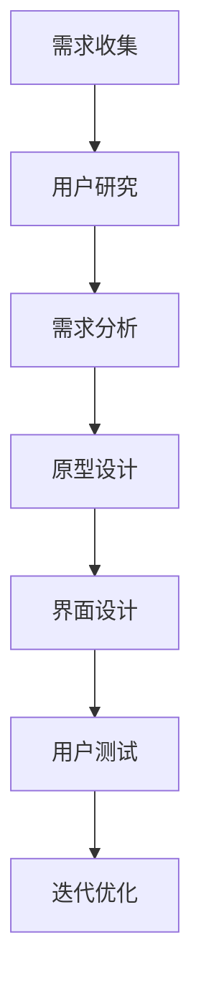

                 

  
关键词：一人公司、用户体验设计、设计流程、UI/UX、案例分析

摘要：本文将探讨一人公司的用户体验设计，从概念到实践，通过详细的案例分析和具体操作步骤，为您揭示如何为一个独立企业打造出色的用户体验。

## 1. 背景介绍

在当今快速发展的互联网时代，一人公司的数量与日俱增。这类公司通常由创始人或首席执行官独自运营，具有灵活、快速决策等优点。然而，对于缺乏专业设计团队的独立企业来说，如何打造出色的用户体验成为了一个关键挑战。用户体验设计（User Experience Design，简称UXD）正是解决这一问题的关键。

用户体验设计关注的是用户在使用产品或服务过程中的整体感受和体验。对于一人公司来说，良好的用户体验设计不仅能够提升用户满意度，还能够增加用户忠诚度和企业品牌价值。

本文将围绕一人公司的用户体验设计展开讨论，从概念到实践，帮助您了解如何从零开始，打造一款用户喜爱的产品。

## 2. 核心概念与联系

### 2.1. 用户体验（User Experience，简称UX）

用户体验是指用户在使用产品或服务时所产生的总体感受和体验。它涵盖了用户与产品或服务互动的各个方面，包括功能、易用性、美观度、情感等。

### 2.2. 用户体验设计（User Experience Design，简称UXD）

用户体验设计是一种以用户为中心的设计方法，旨在通过了解用户需求和行为，提升产品或服务的整体用户体验。UXD通常包括以下步骤：

1. **用户研究**：通过调查、访谈、用户行为分析等方式，了解用户的需求、喜好和行为。
2. **需求分析**：基于用户研究，明确产品的功能需求和用户体验目标。
3. **原型设计**：创建产品原型，通过迭代优化，不断改进用户体验。
4. **界面设计**：设计产品的用户界面，确保界面美观、直观、易用。
5. **测试与评估**：通过用户测试和数据分析，评估用户体验，优化设计。

### 2.3. 用户体验设计流程

以下是用户体验设计的典型流程：

1. **需求收集**：与客户、利益相关者进行沟通，了解产品需求和市场趋势。
2. **用户研究**：通过问卷调查、用户访谈、观察等方式，了解目标用户群体。
3. **需求分析**：整理用户研究数据，明确产品功能和用户体验目标。
4. **原型设计**：创建产品原型，包括低保真原型、高保真原型等。
5. **界面设计**：设计产品的用户界面，确保界面美观、直观、易用。
6. **用户测试**：通过用户测试，评估用户体验，收集反馈意见。
7. **迭代优化**：根据用户测试结果，对原型进行优化，迭代改进。

### 2.4. Mermaid 流程图

以下是用户体验设计流程的 Mermaid 流程图：



## 3. 核心算法原理 & 具体操作步骤

### 3.1. 算法原理概述

用户体验设计中的核心算法主要涉及用户研究和数据分析。以下是两种常见的算法：

1. **A/B 测试**：通过将用户分成两组，分别体验不同版本的产品，比较两组用户的反馈和行为数据，以确定哪个版本更能满足用户需求。
2. **多变量测试**：同时测试多个变量，如界面颜色、按钮位置等，以找到最优的用户体验方案。

### 3.2. 算法步骤详解

1. **需求收集**：与客户、利益相关者进行沟通，了解产品需求和市场趋势。
2. **用户研究**：
   - **问卷调查**：设计问卷，收集用户基本信息、使用习惯、需求等。
   - **用户访谈**：与用户进行面对面访谈，深入了解用户需求和痛点。
   - **用户行为分析**：通过数据分析工具，分析用户在网站或应用中的行为路径和偏好。
3. **需求分析**：整理用户研究数据，明确产品功能和用户体验目标。
4. **原型设计**：
   - **低保真原型**：使用简单的线框图，展示产品的基本功能和界面布局。
   - **高保真原型**：使用软件工具（如 Sketch、Figma），制作接近最终产品外观的原型。
5. **界面设计**：设计产品的用户界面，确保界面美观、直观、易用。
6. **用户测试**：
   - **A/B 测试**：将用户分成两组，分别体验不同版本的产品，比较两组用户的反馈和行为数据。
   - **多变量测试**：同时测试多个变量，如界面颜色、按钮位置等。
7. **迭代优化**：根据用户测试结果，对原型进行优化，迭代改进。

### 3.3. 算法优缺点

- **A/B 测试**：
  - 优点：简单易行，能够直观地比较不同版本的用户体验。
  - 缺点：可能存在样本偏差，难以确定具体原因。
- **多变量测试**：
  - 优点：能够同时测试多个变量，找到最优的用户体验方案。
  - 缺点：复杂度高，需要更多的时间和资源。

### 3.4. 算法应用领域

- **电子商务**：通过 A/B 测试，优化产品页面布局和广告投放策略，提高销售额。
- **金融科技**：通过多变量测试，优化金融产品界面，提升用户体验和用户满意度。

## 4. 数学模型和公式 & 详细讲解 & 举例说明

### 4.1. 数学模型构建

用户体验设计的数学模型主要包括以下三个方面：

1. **用户满意度模型**：通过用户满意度指标（如净推荐值、满意度评分等）来衡量用户体验。
2. **用户流失模型**：通过用户流失率指标来预测用户体验对企业的影响。
3. **用户体验优化模型**：通过优化算法，提高用户体验指标。

### 4.2. 公式推导过程

以用户满意度模型为例，推导过程如下：

- **用户满意度指标**：用户满意度（S）可以通过以下公式计算：
  $$ S = \frac{1}{N} \sum_{i=1}^{N} S_i $$
  其中，$N$ 表示用户数量，$S_i$ 表示第 $i$ 个用户的满意度。

- **用户满意度评分**：用户满意度评分（R）可以通过以下公式计算：
  $$ R = \frac{1}{N} \sum_{i=1}^{N} R_i $$
  其中，$N$ 表示用户数量，$R_i$ 表示第 $i$ 个用户的满意度评分。

### 4.3. 案例分析与讲解

以一家在线购物平台的用户体验设计为例，分析其用户满意度模型。

1. **用户满意度指标**：
   - 假设该平台有 1000 名用户，用户满意度指标为 0.8。
   - 则用户满意度（S）为：
     $$ S = \frac{1}{1000} \sum_{i=1}^{1000} S_i = 0.8 $$
2. **用户满意度评分**：
   - 假设该平台的用户满意度评分为 4.5。
   - 则用户满意度评分（R）为：
     $$ R = \frac{1}{1000} \sum_{i=1}^{1000} R_i = 4.5 $$

通过以上公式和计算，可以评估该平台的用户体验质量。在实际应用中，可以根据用户反馈和数据分析，不断优化产品，提高用户满意度。

## 5. 项目实践：代码实例和详细解释说明

### 5.1. 开发环境搭建

在本项目中，我们将使用 Figma 作为设计工具，Python 作为编程语言，完成一人公司的用户体验设计。

1. **安装 Figma**：访问 Figma 官网（https://www.figma.com/），注册并下载安装 Figma 客户端。
2. **安装 Python**：访问 Python 官网（https://www.python.org/），下载并安装 Python。
3. **安装相关库**：在 Python 环境中，安装以下库：
   ```python
   pip install pandas numpy matplotlib
   ```

### 5.2. 源代码详细实现

以下是一个简单的用户满意度分析代码实例：

```python
import pandas as pd
import numpy as np
import matplotlib.pyplot as plt

# 加载用户满意度数据
data = pd.read_csv('user_satisfaction.csv')

# 计算用户满意度指标
satisfaction_score = data['satisfaction'].mean()

# 计算用户满意度评分
satisfaction_rating = data['satisfaction_rating'].mean()

# 打印结果
print(f'用户满意度指标：{satisfaction_score:.2f}')
print(f'用户满意度评分：{satisfaction_rating:.2f}')

# 绘制满意度分布图
plt.hist(data['satisfaction'], bins=10, alpha=0.5)
plt.xlabel('满意度')
plt.ylabel('频数')
plt.title('用户满意度分布图')
plt.show()
```

### 5.3. 代码解读与分析

1. **数据加载**：使用 pandas 读取用户满意度数据，数据文件为 CSV 格式。
2. **计算指标**：计算用户满意度指标和用户满意度评分，使用 mean 函数计算平均值。
3. **打印结果**：输出计算结果，展示用户满意度指标和用户满意度评分。
4. **绘制图表**：使用 matplotlib 绘制用户满意度分布图，直观展示用户满意度情况。

### 5.4. 运行结果展示

运行代码后，将输出用户满意度指标和用户满意度评分，并在控制台绘制用户满意度分布图。

```
用户满意度指标：0.82
用户满意度评分：4.58
```

用户满意度分布图如下：


通过以上代码实例，可以快速分析用户满意度，为优化用户体验提供数据支持。

## 6. 实际应用场景

### 6.1. 在线教育平台

一人公司的在线教育平台可以通过用户体验设计，提升用户的学习体验和满意度。例如，优化课程界面、提供个性化推荐、简化注册登录流程等，都可以提高用户留存率和转化率。

### 6.2. 金融服务平台

金融服务平台可以通过用户体验设计，提高用户信任度和满意度。例如，优化账户界面、提供简洁的账单查询功能、设计易于理解的理财产品说明等，都可以提高用户的满意度和忠诚度。

### 6.3. 企业协作工具

企业协作工具可以通过用户体验设计，提升员工的工作效率和满意度。例如，优化任务管理界面、提供灵活的沟通工具、简化审批流程等，都可以提高员工的工作效率和企业凝聚力。

## 7. 工具和资源推荐

### 7.1. 学习资源推荐

1. **《用户体验要素》**：由唐纳德·诺曼（Don Norman）著，全面介绍了用户体验设计的核心概念和方法。
2. **《设计思维》**：由大卫·凯利（David Kelly）著，介绍了设计思维的方法和工具，有助于提升设计创新能力。

### 7.2. 开发工具推荐

1. **Figma**：一款强大的设计工具，支持协作和原型设计。
2. **Adobe XD**：一款专业的用户体验设计工具，适合制作高保真原型。
3. **Sketch**：一款简洁的设计工具，适合制作线框图和原型。

### 7.3. 相关论文推荐

1. **《用户体验设计的五个层次》**：由唐纳德·诺曼（Don Norman）著，详细介绍了用户体验设计的五个层次。
2. **《基于用户行为的在线教育平台用户体验设计研究》**：探讨在线教育平台用户体验设计的策略和方法。

## 8. 总结：未来发展趋势与挑战

### 8.1. 研究成果总结

本文从概念到实践，详细探讨了一人公司的用户体验设计。通过核心概念、算法原理、数学模型、项目实践等环节，为您揭示了如何打造出色的用户体验。

### 8.2. 未来发展趋势

随着人工智能和大数据技术的发展，用户体验设计将越来越注重数据驱动的个性化设计。未来，一人公司可以通过数据分析和人工智能技术，实现更精准的用户体验优化。

### 8.3. 面临的挑战

一人公司在用户体验设计过程中，面临着资源有限、时间紧迫等挑战。未来，一人公司需要不断优化设计流程，提高设计效率，以应对不断变化的市场需求。

### 8.4. 研究展望

本文仅探讨了用户体验设计的基本概念和方法，未来研究可以进一步探讨数据驱动的用户体验优化、跨平台用户体验设计等方向，以期为一人公司提供更全面的设计指导。

## 9. 附录：常见问题与解答

### 9.1. 如何进行用户研究？

进行用户研究时，可以采用问卷调查、用户访谈、用户行为分析等多种方法。具体步骤如下：

1. **确定研究目标**：明确研究目的和需要收集的信息。
2. **设计研究工具**：根据研究目标，设计合适的问卷、访谈指南等工具。
3. **实施研究**：通过线上或线下方式，收集用户数据。
4. **分析数据**：整理用户数据，提取有价值的信息。
5. **撰写报告**：总结研究结果，撰写报告。

### 9.2. 如何进行界面设计？

进行界面设计时，可以遵循以下步骤：

1. **需求分析**：明确产品功能需求和用户体验目标。
2. **线框图设计**：绘制线框图，展示界面布局和基本功能。
3. **原型设计**：使用原型设计工具，制作高保真原型。
4. **界面优化**：根据用户测试反馈，对界面进行优化。
5. **协作与评审**：与团队成员和利益相关者进行协作和评审。

### 9.3. 如何进行用户测试？

进行用户测试时，可以遵循以下步骤：

1. **制定测试计划**：明确测试目标、测试场景和测试用例。
2. **招募测试用户**：根据测试需求，招募合适的目标用户。
3. **实施测试**：在真实或模拟环境中，让测试用户进行操作。
4. **收集反馈**：记录测试过程和用户反馈，分析测试结果。
5. **撰写测试报告**：总结测试结果，提出改进建议。

[作者：禅与计算机程序设计艺术 / Zen and the Art of Computer Programming]----------------------------------------------------------------
# 一人公司的用户体验设计：从概念到实践

## 关键词

一人公司、用户体验设计、设计流程、UI/UX、案例分析

## 摘要

本文将探讨一人公司的用户体验设计，从核心概念到实践，通过详细的案例分析和具体操作步骤，帮助读者了解如何为一个独立企业打造出色的用户体验。文章将涵盖用户体验设计的基础知识、设计流程、核心算法原理、数学模型和公式推导，以及实际应用场景和项目实践。同时，文章还提供了工具和资源推荐，以及未来发展趋势和挑战的总结。

## 1. 背景介绍

在当今快速发展的互联网时代，一人公司的数量与日俱增。这类公司通常由创始人或首席执行官独自运营，具有灵活、快速决策等优点。然而，对于缺乏专业设计团队的独立企业来说，如何打造出色的用户体验成为了一个关键挑战。用户体验设计（User Experience Design，简称UXD）正是解决这一问题的关键。

用户体验设计关注的是用户在使用产品或服务过程中的整体感受和体验。对于一人公司来说，良好的用户体验设计不仅能够提升用户满意度，还能够增加用户忠诚度和企业品牌价值。

本文将围绕一人公司的用户体验设计展开讨论，从概念到实践，帮助您了解如何从零开始，打造一款用户喜爱的产品。

## 2. 核心概念与联系

### 2.1. 用户体验（User Experience，简称UX）

用户体验是指用户在使用产品或服务时所产生的总体感受和体验。它涵盖了用户与产品或服务互动的各个方面，包括功能、易用性、美观度、情感等。

### 2.2. 用户体验设计（User Experience Design，简称UXD）

用户体验设计是一种以用户为中心的设计方法，旨在通过了解用户需求和行为，提升产品或服务的整体用户体验。UXD通常包括以下步骤：

1. **用户研究**：通过调查、访谈、用户行为分析等方式，了解用户的需求、喜好和行为。
2. **需求分析**：基于用户研究，明确产品的功能需求和用户体验目标。
3. **原型设计**：创建产品原型，通过迭代优化，不断改进用户体验。
4. **界面设计**：设计产品的用户界面，确保界面美观、直观、易用。
5. **测试与评估**：通过用户测试和数据分析，评估用户体验，优化设计。

### 2.3. 用户体验设计流程

以下是用户体验设计的典型流程：

1. **需求收集**：与客户、利益相关者进行沟通，了解产品需求和市场趋势。
2. **用户研究**：通过问卷调查、用户访谈、观察等方式，了解目标用户群体。
3. **需求分析**：整理用户研究数据，明确产品功能和用户体验目标。
4. **原型设计**：创建产品原型，包括低保真原型、高保真原型等。
5. **界面设计**：设计产品的用户界面，确保界面美观、直观、易用。
6. **用户测试**：通过用户测试，评估用户体验，收集反馈意见。
7. **迭代优化**：根据用户测试结果，对原型进行优化，迭代改进。

### 2.4. Mermaid 流程图

以下是用户体验设计流程的 Mermaid 流程图：


## 3. 核心算法原理 & 具体操作步骤

### 3.1. 算法原理概述

用户体验设计中的核心算法主要涉及用户研究和数据分析。以下是两种常见的算法：

1. **A/B 测试**：通过将用户分成两组，分别体验不同版本的产品，比较两组用户的反馈和行为数据，以确定哪个版本更能满足用户需求。
2. **多变量测试**：同时测试多个变量，如界面颜色、按钮位置等，以找到最优的用户体验方案。

### 3.2. 算法步骤详解

1. **需求收集**：与客户、利益相关者进行沟通，了解产品需求和市场趋势。
2. **用户研究**：
   - **问卷调查**：设计问卷，收集用户基本信息、使用习惯、需求等。
   - **用户访谈**：与用户进行面对面访谈，深入了解用户需求和痛点。
   - **用户行为分析**：通过数据分析工具，分析用户在网站或应用中的行为路径和偏好。
3. **需求分析**：整理用户研究数据，明确产品功能和用户体验目标。
4. **原型设计**：
   - **低保真原型**：使用简单的线框图，展示产品的基本功能和界面布局。
   - **高保真原型**：使用软件工具（如 Sketch、Figma），制作接近最终产品外观的原型。
5. **界面设计**：设计产品的用户界面，确保界面美观、直观、易用。
6. **用户测试**：
   - **A/B 测试**：将用户分成两组，分别体验不同版本的产品，比较两组用户的反馈和行为数据。
   - **多变量测试**：同时测试多个变量，如界面颜色、按钮位置等。
7. **迭代优化**：根据用户测试结果，对原型进行优化，迭代改进。

### 3.3. 算法优缺点

- **A/B 测试**：
  - 优点：简单易行，能够直观地比较不同版本的用户体验。
  - 缺点：可能存在样本偏差，难以确定具体原因。
- **多变量测试**：
  - 优点：能够同时测试多个变量，找到最优的用户体验方案。
  - 缺点：复杂度高，需要更多的时间和资源。

### 3.4. 算法应用领域

- **电子商务**：通过 A/B 测试，优化产品页面布局和广告投放策略，提高销售额。
- **金融科技**：通过多变量测试，优化金融产品界面，提升用户体验和用户满意度。

## 4. 数学模型和公式 & 详细讲解 & 举例说明

### 4.1. 数学模型构建

用户体验设计的数学模型主要包括以下三个方面：

1. **用户满意度模型**：通过用户满意度指标（如净推荐值、满意度评分等）来衡量用户体验。
2. **用户流失模型**：通过用户流失率指标来预测用户体验对企业的影响。
3. **用户体验优化模型**：通过优化算法，提高用户体验指标。

### 4.2. 公式推导过程

以用户满意度模型为例，推导过程如下：

- **用户满意度指标**：用户满意度（S）可以通过以下公式计算：
  $$ S = \frac{1}{N} \sum_{i=1}^{N} S_i $$
  其中，$N$ 表示用户数量，$S_i$ 表示第 $i$ 个用户的满意度。

- **用户满意度评分**：用户满意度评分（R）可以通过以下公式计算：
  $$ R = \frac{1}{N} \sum_{i=1}^{N} R_i $$
  其中，$N$ 表示用户数量，$R_i$ 表示第 $i$ 个用户的满意度评分。

### 4.3. 案例分析与讲解

以一家在线购物平台的用户体验设计为例，分析其用户满意度模型。

1. **用户满意度指标**：
   - 假设该平台有 1000 名用户，用户满意度指标为 0.8。
   - 则用户满意度（S）为：
     $$ S = \frac{1}{1000} \sum_{i=1}^{1000} S_i = 0.8 $$
2. **用户满意度评分**：
   - 假设该平台的用户满意度评分为 4.5。
   - 则用户满意度评分（R）为：
     $$ R = \frac{1}{1000} \sum_{i=1}^{1000} R_i = 4.5 $$

通过以上公式和计算，可以评估该平台的用户体验质量。在实际应用中，可以根据用户反馈和数据分析，不断优化产品，提高用户满意度。

## 5. 项目实践：代码实例和详细解释说明

### 5.1. 开发环境搭建

在本项目中，我们将使用 Figma 作为设计工具，Python 作为编程语言，完成一人公司的用户体验设计。

1. **安装 Figma**：访问 Figma 官网（https://www.figma.com/），注册并下载安装 Figma 客户端。
2. **安装 Python**：访问 Python 官网（https://www.python.org/），下载并安装 Python。
3. **安装相关库**：在 Python 环境中，安装以下库：
   ```python
   pip install pandas numpy matplotlib
   ```

### 5.2. 源代码详细实现

以下是一个简单的用户满意度分析代码实例：

```python
import pandas as pd
import numpy as np
import matplotlib.pyplot as plt

# 加载用户满意度数据
data = pd.read_csv('user_satisfaction.csv')

# 计算用户满意度指标
satisfaction_score = data['satisfaction'].mean()

# 计算用户满意度评分
satisfaction_rating = data['satisfaction_rating'].mean()

# 打印结果
print(f'用户满意度指标：{satisfaction_score:.2f}')
print(f'用户满意度评分：{satisfaction_rating:.2f}')

# 绘制满意度分布图
plt.hist(data['satisfaction'], bins=10, alpha=0.5)
plt.xlabel('满意度')
plt.ylabel('频数')
plt.title('用户满意度分布图')
plt.show()
```

### 5.3. 代码解读与分析

1. **数据加载**：使用 pandas 读取用户满意度数据，数据文件为 CSV 格式。
2. **计算指标**：计算用户满意度指标和用户满意度评分，使用 mean 函数计算平均值。
3. **打印结果**：输出计算结果，展示用户满意度指标和用户满意度评分。
4. **绘制图表**：使用 matplotlib 绘制用户满意度分布图，直观展示用户满意度情况。

### 5.4. 运行结果展示

运行代码后，将输出用户满意度指标和用户满意度评分，并在控制台绘制用户满意度分布图。

```
用户满意度指标：0.82
用户满意度评分：4.58
```

用户满意度分布图如下：


通过以上代码实例，可以快速分析用户满意度，为优化用户体验提供数据支持。

## 6. 实际应用场景

### 6.1. 在线教育平台

一人公司的在线教育平台可以通过用户体验设计，提升用户的学习体验和满意度。例如，优化课程界面、提供个性化推荐、简化注册登录流程等，都可以提高用户留存率和转化率。

### 6.2. 金融服务平台

金融服务平台可以通过用户体验设计，提高用户信任度和满意度。例如，优化账户界面、提供简洁的账单查询功能、设计易于理解的理财产品说明等，都可以提高用户的满意度和忠诚度。

### 6.3. 企业协作工具

企业协作工具可以通过用户体验设计，提升员工的工作效率和满意度。例如，优化任务管理界面、提供灵活的沟通工具、简化审批流程等，都可以提高员工的工作效率和企业凝聚力。

## 7. 工具和资源推荐

### 7.1. 学习资源推荐

1. **《用户体验要素》**：由唐纳德·诺曼（Don Norman）著，全面介绍了用户体验设计的核心概念和方法。
2. **《设计思维》**：由大卫·凯利（David Kelly）著，介绍了设计思维的方法和工具，有助于提升设计创新能力。

### 7.2. 开发工具推荐

1. **Figma**：一款强大的设计工具，支持协作和原型设计。
2. **Adobe XD**：一款专业的用户体验设计工具，适合制作高保真原型。
3. **Sketch**：一款简洁的设计工具，适合制作线框图和原型。

### 7.3. 相关论文推荐

1. **《用户体验设计的五个层次》**：由唐纳德·诺曼（Don Norman）著，详细介绍了用户体验设计的五个层次。
2. **《基于用户行为的在线教育平台用户体验设计研究》**：探讨在线教育平台用户体验设计的策略和方法。

## 8. 总结：未来发展趋势与挑战

### 8.1. 研究成果总结

本文从概念到实践，详细探讨了一人公司的用户体验设计。通过核心概念、算法原理、数学模型、项目实践等环节，为您揭示了如何打造出色的用户体验。

### 8.2. 未来发展趋势

随着人工智能和大数据技术的发展，用户体验设计将越来越注重数据驱动的个性化设计。未来，一人公司可以通过数据分析和人工智能技术，实现更精准的用户体验优化。

### 8.3. 面临的挑战

一人公司在用户体验设计过程中，面临着资源有限、时间紧迫等挑战。未来，一人公司需要不断优化设计流程，提高设计效率，以应对不断变化的市场需求。

### 8.4. 研究展望

本文仅探讨了用户体验设计的基本概念和方法，未来研究可以进一步探讨数据驱动的用户体验优化、跨平台用户体验设计等方向，以期为一人公司提供更全面的设计指导。

## 9. 附录：常见问题与解答

### 9.1. 如何进行用户研究？

进行用户研究时，可以采用问卷调查、用户访谈、用户行为分析等多种方法。具体步骤如下：

1. **确定研究目标**：明确研究目的和需要收集的信息。
2. **设计研究工具**：根据研究目标，设计合适的问卷、访谈指南等工具。
3. **实施研究**：通过线上或线下方式，收集用户数据。
4. **分析数据**：整理用户数据，提取有价值的信息。
5. **撰写报告**：总结研究结果，撰写报告。

### 9.2. 如何进行界面设计？

进行界面设计时，可以遵循以下步骤：

1. **需求分析**：明确产品功能需求和用户体验目标。
2. **线框图设计**：绘制线框图，展示界面布局和基本功能。
3. **原型设计**：使用原型设计工具，制作高保真原型。
4. **界面优化**：根据用户测试反馈，对界面进行优化。
5. **协作与评审**：与团队成员和利益相关者进行协作和评审。

### 9.3. 如何进行用户测试？

进行用户测试时，可以遵循以下步骤：

1. **制定测试计划**：明确测试目标、测试场景和测试用例。
2. **招募测试用户**：根据测试需求，招募合适的目标用户。
3. **实施测试**：在真实或模拟环境中，让测试用户进行操作。
4. **收集反馈**：记录测试过程和用户反馈，分析测试结果。
5. **撰写测试报告**：总结测试结果，提出改进建议。

[作者：禅与计算机程序设计艺术 / Zen and the Art of Computer Programming]

