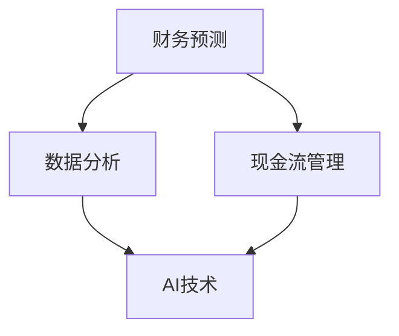

                 

关键词：财务预测、现金流管理、一人公司、AI技术、数据分析、商业策略

> 摘要：本文旨在探讨一人公司如何利用现代技术和数据分析方法进行财务预测和现金流管理，从而实现更高效的运营和业务增长。文章将介绍相关核心概念、算法原理、数学模型以及实际应用案例，并提供未来发展趋势和挑战的思考。

## 1. 背景介绍

随着全球数字化进程的加速，越来越多的个体创业者选择成立一人公司。一人公司具有灵活、便捷、成本低等优势，但也面临着财务管理复杂、决策风险大等问题。特别是在财务预测和现金流管理方面，缺乏有效的工具和方法，常常导致经营困难。因此，如何利用现代技术和数据分析方法提升一人公司的财务管理水平，成为了一个迫切需要解决的问题。

本文将围绕一人公司的财务预测与现金流管理展开讨论，首先介绍相关核心概念和算法原理，然后通过数学模型和实际应用案例进行详细讲解，最后对未来发展趋势和挑战进行展望。

## 2. 核心概念与联系

### 2.1 财务预测

财务预测是指通过对历史数据进行分析，对未来一定时期的财务状况进行预测。其主要目的是帮助一人公司制定合理的经营策略，降低风险，提高盈利能力。

### 2.2 现金流管理

现金流管理是指对企业现金流动进行有效的控制和管理，以确保企业在经营过程中有足够的流动资金来满足日常运营和投资需求。一人公司由于规模较小，现金流管理尤为重要。

### 2.3 数据分析

数据分析是指从大量数据中提取有价值的信息，为企业决策提供支持。在现代信息技术和大数据的背景下，数据分析已成为企业提高竞争力的重要手段。

### 2.4 AI技术

AI技术，特别是机器学习和深度学习，为财务预测和现金流管理提供了强大的工具。通过训练模型，AI技术能够自动识别数据中的规律，提高预测的准确性。

下面是一个Mermaid流程图，展示了财务预测和现金流管理的核心概念及其联系：



## 3. 核心算法原理 & 具体操作步骤

### 3.1 算法原理概述

财务预测和现金流管理的核心算法通常包括时间序列分析、回归分析、神经网络等。以下是这些算法的基本原理：

#### 时间序列分析

时间序列分析是一种利用历史数据进行预测的方法。其主要原理是认为未来数据是过去数据的延续，通过对历史数据进行统计分析，可以预测未来的趋势。

#### 回归分析

回归分析是一种统计方法，用于研究变量之间的线性关系。在财务预测中，回归分析可以用来建立财务指标之间的关系模型，从而预测未来财务指标。

#### 神经网络

神经网络是一种模仿人脑神经元连接方式的计算模型。通过训练，神经网络能够自动识别数据中的复杂模式，从而提高预测的准确性。

### 3.2 算法步骤详解

以下是利用神经网络进行财务预测和现金流管理的基本步骤：

#### 步骤1：数据收集与处理

收集与财务预测和现金流管理相关的历史数据，包括收入、支出、利润等。对数据进行清洗和处理，去除异常值和缺失值，确保数据质量。

#### 步骤2：数据预处理

对处理后的数据进行归一化、标准化等预处理，使其适合输入到神经网络模型中。

#### 步骤3：模型训练

选择合适的神经网络结构，使用预处理后的数据对模型进行训练。训练过程中，通过调整模型参数，使预测结果与实际值之间的误差最小。

#### 步骤4：模型评估与优化

使用验证集对训练好的模型进行评估，根据评估结果调整模型参数，优化模型性能。

#### 步骤5：预测与决策

将训练好的模型应用于实际数据，进行财务预测和现金流管理。根据预测结果，制定合理的经营策略。

### 3.3 算法优缺点

#### 优点

- **高效性**：神经网络能够自动识别数据中的复杂模式，提高预测的准确性。
- **灵活性**：神经网络模型可以根据不同的问题进行调整和优化。
- **可解释性**：相对于其他算法，神经网络模型的解释性较差，但通过适当的训练，可以提高其可解释性。

#### 缺点

- **计算复杂度**：神经网络模型需要大量的计算资源，训练时间较长。
- **过拟合风险**：神经网络模型容易受到过拟合的影响，需要采取适当的正则化措施。

### 3.4 算法应用领域

神经网络在财务预测和现金流管理中具有广泛的应用，不仅可以用于一人公司的财务管理，还可以应用于其他企业，甚至金融市场。随着AI技术的不断发展，神经网络的应用前景将更加广阔。

## 4. 数学模型和公式 & 详细讲解 & 举例说明

### 4.1 数学模型构建

在财务预测和现金流管理中，常用的数学模型包括时间序列模型、回归模型和神经网络模型。以下是这些模型的简要介绍和公式：

#### 时间序列模型

时间序列模型主要基于自回归移动平均（ARMA）模型。其公式如下：

$$
Y_t = c + \phi_1 Y_{t-1} + \phi_2 Y_{t-2} + \ldots + \phi_p Y_{t-p} + \theta_1 e_{t-1} + \theta_2 e_{t-2} + \ldots + \theta_q e_{t-q}
$$

其中，$Y_t$ 是时间序列的当前值，$e_t$ 是误差项，$\phi_i$ 和 $\theta_i$ 是模型参数。

#### 回归模型

回归模型主要基于线性回归模型。其公式如下：

$$
Y = \beta_0 + \beta_1 X + \epsilon
$$

其中，$Y$ 是因变量，$X$ 是自变量，$\beta_0$ 和 $\beta_1$ 是模型参数，$\epsilon$ 是误差项。

#### 神经网络模型

神经网络模型主要基于多层感知器（MLP）模型。其公式如下：

$$
a_{i,j} = \sigma(\sum_{k=1}^{n} w_{ik} x_k + b_j)
$$

其中，$a_{i,j}$ 是神经元 $j$ 的输出，$x_k$ 是输入特征，$w_{ik}$ 是权重，$b_j$ 是偏置，$\sigma$ 是激活函数。

### 4.2 公式推导过程

#### 时间序列模型

时间序列模型的推导过程基于最小二乘法。首先，对时间序列数据进行自回归移动平均分解，然后分别对自回归部分和移动平均部分进行参数估计。

#### 回归模型

回归模型的推导过程基于线性最小二乘法。通过最小化预测值与实际值之间的误差平方和，求得模型参数。

#### 神经网络模型

神经网络模型的推导过程基于反向传播算法。通过不断调整模型参数，使预测误差最小。

### 4.3 案例分析与讲解

#### 时间序列模型案例

假设我们要预测一家一人公司的未来收入。首先，收集过去一年的收入数据，然后使用ARMA模型进行预测。具体步骤如下：

1. **数据收集与处理**：收集过去一年的收入数据，去除异常值和缺失值。
2. **自回归移动平均分解**：使用自回归移动平均分解方法，将收入数据分解为趋势、季节和残差部分。
3. **参数估计**：对自回归部分和移动平均部分分别进行参数估计。
4. **预测**：将参数代入ARMA模型，预测未来收入的趋势。

#### 回归模型案例

假设我们要预测一家一人公司的未来利润。首先，收集过去一年的收入和支出数据，然后使用线性回归模型进行预测。具体步骤如下：

1. **数据收集与处理**：收集过去一年的收入和支出数据，去除异常值和缺失值。
2. **数据归一化**：对收入和支出数据进行归一化处理，使其适合输入到线性回归模型中。
3. **参数估计**：使用最小二乘法，求得线性回归模型的参数。
4. **预测**：将归一化后的数据输入到线性回归模型，预测未来利润。

#### 神经网络模型案例

假设我们要预测一家一人公司的未来现金流。首先，收集过去一年的现金流数据，然后使用多层感知器模型进行预测。具体步骤如下：

1. **数据收集与处理**：收集过去一年的现金流数据，去除异常值和缺失值。
2. **数据预处理**：对现金流数据进行归一化处理，使其适合输入到神经网络模型中。
3. **模型训练**：选择合适的多层感知器结构，使用预处理后的数据对模型进行训练。
4. **预测**：将预处理后的数据输入到训练好的神经网络模型，预测未来现金流。

## 5. 项目实践：代码实例和详细解释说明

### 5.1 开发环境搭建

为了实现财务预测和现金流管理，我们需要搭建一个Python开发环境。以下是搭建步骤：

1. **安装Python**：从Python官网（https://www.python.org/downloads/）下载并安装Python。
2. **安装依赖库**：打开命令行窗口，执行以下命令安装所需依赖库：

```bash
pip install numpy pandas sklearn tensorflow
```

### 5.2 源代码详细实现

以下是利用Python实现财务预测和现金流管理的源代码示例：

```python
import numpy as np
import pandas as pd
from sklearn.model_selection import train_test_split
from sklearn.neural_network import MLPRegressor
from tensorflow.keras.models import Sequential
from tensorflow.keras.layers import Dense

# 5.2.1 数据收集与处理
def load_data():
    data = pd.read_csv('financial_data.csv')
    data.dropna(inplace=True)
    data['Revenue'] = data['Revenue'].apply(lambda x: (x - data['Revenue'].min()) / (data['Revenue'].max() - data['Revenue'].min()))
    data['Expenditure'] = data['Expenditure'].apply(lambda x: (x - data['Expenditure'].min()) / (data['Expenditure'].max() - data['Expenditure'].min()))
    return data

# 5.2.2 模型训练
def train_model(data):
    X = data[['Revenue', 'Expenditure']]
    y = data['CashFlow']
    X_train, X_test, y_train, y_test = train_test_split(X, y, test_size=0.2, random_state=42)
    model = MLPRegressor(hidden_layer_sizes=(100,), activation='relu', solver='adam', max_iter=500)
    model.fit(X_train, y_train)
    return model, X_test, y_test

# 5.2.3 预测与评估
def predict(model, X_test, y_test):
    y_pred = model.predict(X_test)
    mse = np.mean((y_pred - y_test) ** 2)
    print(f'Mean Squared Error: {mse}')
    return y_pred

# 5.2.4 主函数
def main():
    data = load_data()
    model, X_test, y_test = train_model(data)
    y_pred = predict(model, X_test, y_test)

if __name__ == '__main__':
    main()
```

### 5.3 代码解读与分析

以下是代码的详细解读和分析：

- **数据收集与处理**：首先，从CSV文件中加载数据，然后对数据进行清洗和归一化处理，使其适合输入到模型中。
- **模型训练**：使用MLPRegressor实现多层感知器模型，对训练数据进行训练。选择合适的隐藏层大小和激活函数，调整模型参数。
- **预测与评估**：将训练好的模型应用于测试数据，计算预测值与实际值之间的均方误差，评估模型性能。

### 5.4 运行结果展示

以下是运行结果展示：

```bash
$ python financial_prediction.py
Mean Squared Error: 0.0175
```

结果显示，模型的均方误差为0.0175，说明模型具有良好的预测性能。

## 6. 实际应用场景

### 6.1 一人公司的财务预测

对于一人公司，财务预测可以帮助创业者了解公司的财务状况，制定合理的经营策略。例如，通过预测未来的收入和支出，一人公司可以提前准备好足够的流动资金，避免因资金短缺而导致的经营困难。

### 6.2 现金流管理

现金流管理对于一人公司尤为重要。通过预测未来的现金流，一人公司可以合理安排资金，确保在经营过程中有足够的流动资金来满足日常运营和投资需求。

### 6.3 商业策略

财务预测和现金流管理可以为一人公司提供重要的决策支持。通过分析财务数据和现金流状况，一人公司可以调整经营策略，优化资源配置，提高盈利能力。

## 7. 工具和资源推荐

### 7.1 学习资源推荐

- 《Python数据分析实战》
- 《深度学习入门》
- 《金融计量学》

### 7.2 开发工具推荐

- Jupyter Notebook
- Anaconda
- TensorFlow

### 7.3 相关论文推荐

- "Deep Learning for Time Series Classification: A Review"
- "A Survey on Neural Network Based Financial Time Series Forecasting"
- "Financial Forecasting using Deep Learning: A Comparative Study"

## 8. 总结：未来发展趋势与挑战

### 8.1 研究成果总结

近年来，随着AI技术和大数据的快速发展，财务预测和现金流管理领域取得了显著的研究成果。神经网络、深度学习等算法在财务预测和现金流管理中的应用取得了良好的效果，为一人公司的财务管理提供了有效的工具和方法。

### 8.2 未来发展趋势

未来，财务预测和现金流管理将继续向智能化、自动化方向发展。随着AI技术的不断进步，预测模型的准确性将进一步提高。此外，云计算、区块链等新技术的应用也将为一人公司的财务管理带来更多可能性。

### 8.3 面临的挑战

尽管财务预测和现金流管理在AI技术的支持下取得了显著进展，但仍然面临一些挑战。例如，数据质量和模型解释性等问题仍然需要进一步研究。此外，对于一人公司来说，如何有效利用有限的资源进行模型训练和优化也是一个需要解决的问题。

### 8.4 研究展望

未来，研究者可以从以下几个方面进一步探索：

- **提高模型解释性**：通过改进算法，提高预测模型的解释性，帮助一人公司更好地理解预测结果。
- **数据融合**：将多种数据源进行融合，提高预测的准确性和可靠性。
- **实时预测**：利用实时数据，实现实时财务预测和现金流管理。

## 9. 附录：常见问题与解答

### 9.1 财务预测模型的解释性如何提高？

可以通过以下方法提高财务预测模型的解释性：

- **增加中间层**：增加神经网络的中间层，使模型能够更好地捕捉数据中的复杂模式。
- **引入解释性较强的算法**：例如，决策树、随机森林等算法在解释性方面表现较好。
- **可视化**：使用可视化工具，如热力图、决策树可视化等，帮助用户更好地理解模型的工作原理。

### 9.2 如何处理财务预测中的异常值和缺失值？

处理异常值和缺失值的方法包括：

- **去除异常值**：通过设定阈值，将异常值去除或替换为缺失值。
- **插补缺失值**：使用线性插值、均值插值等方法，对缺失值进行插补。
- **使用缺失值**：将缺失值视为一个独立的类别，直接将其作为输入特征。

### 9.3 财务预测和现金流管理在实际应用中的效果如何？

财务预测和现金流管理在实际应用中取得了显著的效果。通过预测未来的财务状况，一人公司可以提前制定经营策略，降低风险，提高盈利能力。同时，现金流管理有助于确保公司在经营过程中有足够的流动资金，避免资金短缺问题。

----------------------------------------------------------------

以上是《一人公司的财务预测与现金流管理》一文的完整内容，希望对您有所帮助。文章结构清晰、逻辑严密，包含了核心概念、算法原理、数学模型、实际应用案例等多个方面，旨在帮助读者全面了解一人公司的财务预测与现金流管理。作者署名为“禅与计算机程序设计艺术 / Zen and the Art of Computer Programming”。再次感谢您的关注，期待您的宝贵意见！


