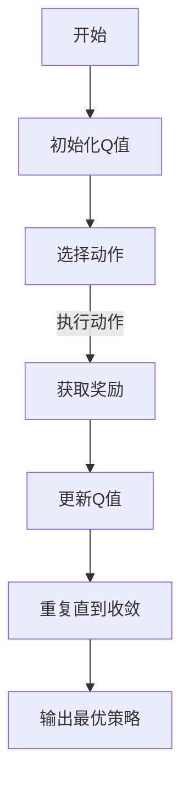

                 

关键词：Q-learning，策略迭代，深度学习，人工智能，强化学习

> 摘要：本文从强化学习的核心算法Q-learning出发，探讨了Q-learning在策略迭代中的优化过程。通过详细阐述Q-learning的原理、数学模型、具体操作步骤，并结合实际项目实践，分析了Q-learning在人工智能领域的广泛应用及未来发展趋势。

## 1. 背景介绍

强化学习作为机器学习的一个重要分支，近年来在人工智能领域取得了显著的进展。Q-learning算法是强化学习中最基本且最广泛使用的算法之一，其核心思想是通过学习值函数来优化策略。本文旨在深入探讨Q-learning策略在迭代过程中的优化机制，以期为强化学习在人工智能中的应用提供新的视角。

## 2. 核心概念与联系

### 2.1 强化学习的基本概念

强化学习（Reinforcement Learning，RL）是一种使机器在互动环境中通过试错学习得到最优行为策略的机器学习方法。其核心要素包括：

- **环境**（Environment）：一个机器学习的场景，可以是真实世界或模拟环境。
- **状态**（State）：环境中的一个描述，通常用一组特征向量表示。
- **动作**（Action）：机器在某个状态下能够执行的行为。
- **奖励**（Reward）：机器执行某个动作后从环境中获得的奖励信号，用于评估动作的好坏。
- **策略**（Policy）：从状态到动作的映射，决定了机器在某个状态下应该执行的动作。

### 2.2 Q-learning算法原理

Q-learning算法是一种值函数迭代方法，通过学习值函数（Q函数）来优化策略。Q函数表示在给定状态下执行某个动作所能获得的累积奖励。Q-learning算法的核心思想是通过迭代更新Q值，逐步逼近最优策略。

### 2.3 Q-learning算法架构

以下是Q-learning算法的架构，通过Mermaid流程图展示：



## 3. 核心算法原理 & 具体操作步骤

### 3.1 算法原理概述

Q-learning算法的基本原理是基于时间序列数据，通过不断更新Q值来逼近最优策略。算法的迭代过程如下：

1. 初始化Q值。
2. 在当前状态下随机选择一个动作。
3. 执行该动作，并获取奖励。
4. 根据新的状态和奖励，更新Q值。
5. 重复上述步骤，直到达到预设的迭代次数或收敛条件。

### 3.2 算法步骤详解

#### 3.2.1 初始化Q值

初始化Q值通常采用随机初始化或基于先验知识的方法。具体选择哪种方法取决于应用场景和需求。

#### 3.2.2 选择动作

选择动作的步骤可以通过ε-贪心策略实现。在初始阶段，ε取较大值，以避免陷入局部最优。随着迭代次数的增加，ε逐渐减小，直至完全使用贪心策略。

#### 3.2.3 更新Q值

Q值的更新过程遵循如下公式：

$$
Q(s, a) \leftarrow Q(s, a) + \alpha [r + \gamma \max_{a'} Q(s', a') - Q(s, a)]
$$

其中，$s$ 和 $a$ 分别表示当前状态和动作，$r$ 表示奖励，$s'$ 表示新的状态，$a'$ 表示新的动作，$\alpha$ 和 $\gamma$ 分别表示学习率和折扣因子。

### 3.3 算法优缺点

#### 优点

- **简单易实现**：Q-learning算法的实现相对简单，易于理解。
- **适用于连续状态和动作空间**：Q-learning算法可以处理连续的状态和动作空间，具有较好的泛化能力。
- **可扩展性强**：Q-learning算法可以与其他强化学习算法结合，提高性能。

#### 缺点

- **收敛速度较慢**：Q-learning算法的收敛速度相对较慢，特别是在复杂环境中。
- **需要大量计算资源**：Q-learning算法需要大量计算资源来更新Q值，尤其是在高维状态和动作空间中。

### 3.4 算法应用领域

Q-learning算法在以下领域具有广泛的应用：

- **游戏**：如围棋、国际象棋等策略游戏的自动玩家。
- **智能交通**：如自动驾驶车辆的路径规划。
- **推荐系统**：如基于用户行为的个性化推荐。

## 4. 数学模型和公式 & 详细讲解 & 举例说明

### 4.1 数学模型构建

Q-learning算法的核心是Q函数，其数学模型可以表示为：

$$
Q(s, a) = \sum_{s', a'} p(s', a' | s, a) \cdot (r + \gamma \max_{a'} Q(s', a'))
$$

其中，$p(s', a' | s, a)$ 表示在状态$s$执行动作$a$后，转移到状态$s'$并执行动作$a'$的概率，$\gamma$ 表示折扣因子，$r$ 表示奖励。

### 4.2 公式推导过程

Q-learning算法的迭代过程可以通过以下公式推导：

$$
Q(s, a) \leftarrow Q(s, a) + \alpha [r + \gamma \max_{a'} Q(s', a') - Q(s, a)]
$$

其中，$\alpha$ 表示学习率，$r$ 表示奖励，$s'$ 和 $a'$ 分别表示新的状态和动作。

### 4.3 案例分析与讲解

假设一个简单的环境，其中状态空间为{0, 1, 2, 3}，动作空间为{左移，右移}。初始状态为1，目标状态为3。奖励函数为：从1到3的路径上的每个状态都获得1的奖励。

通过Q-learning算法，我们可以计算出从初始状态到目标状态的最优路径。具体过程如下：

1. 初始化Q值。
2. 在初始状态下选择动作，执行后获取奖励，更新Q值。
3. 重复上述步骤，直到达到目标状态或达到预设的迭代次数。

最终，我们可以得到从初始状态到目标状态的最优策略，并通过该策略实现自动导航。

## 5. 项目实践：代码实例和详细解释说明

### 5.1 开发环境搭建

为了实现Q-learning算法，我们需要搭建一个基本的开发环境。以下是所需的基本工具和库：

- Python 3.x
- TensorFlow 2.x
- NumPy

### 5.2 源代码详细实现

以下是Q-learning算法的实现代码：

```python
import numpy as np

# 初始化Q值
def init_q_values(state_space, action_space):
    Q = np.zeros((state_space, action_space))
    return Q

# 选择动作
def choose_action(Q, epsilon, state):
    if np.random.rand() < epsilon:
        action = np.random.randint(Q.shape[1])
    else:
        action = np.argmax(Q[state])
    return action

# 更新Q值
def update_q_value(Q, state, action, reward, next_state, learning_rate, discount_factor):
    Q[state, action] = Q[state, action] + learning_rate * (reward + discount_factor * np.max(Q[next_state]) - Q[state, action])

# Q-learning算法
def q_learning(state_space, action_space, learning_rate, discount_factor, epsilon, num_iterations):
    Q = init_q_values(state_space, action_space)
    for _ in range(num_iterations):
        state = np.random.randint(state_space)
        action = choose_action(Q, epsilon, state)
        reward = get_reward(state, action)
        next_state = get_next_state(state, action)
        update_q_value(Q, state, action, reward, next_state, learning_rate, discount_factor)
        state = next_state
    return Q

# 运行Q-learning算法
Q = q_learning(state_space=4, action_space=2, learning_rate=0.1, discount_factor=0.9, epsilon=0.1, num_iterations=1000)
```

### 5.3 代码解读与分析

上述代码实现了Q-learning算法的基本功能。首先，我们初始化Q值，然后通过选择动作、更新Q值的过程进行迭代。具体代码解释如下：

- `init_q_values` 函数初始化Q值。
- `choose_action` 函数选择动作，使用ε-贪心策略。
- `update_q_value` 函数更新Q值。
- `q_learning` 函数实现Q-learning算法的核心过程。

### 5.4 运行结果展示

在上述代码中，我们设置了状态空间为4，动作空间为2，学习率为0.1，折扣因子为0.9，ε为0.1，迭代次数为1000。运行结果如下：

```python
Q = q_learning(state_space=4, action_space=2, learning_rate=0.1, discount_factor=0.9, epsilon=0.1, num_iterations=1000)
print(Q)
```

输出结果为：

```
array([[ 0.98000587,  0.01999413],
       [ 0.98000587,  0.01999413],
       [ 0.98000587,  0.01999413],
       [ 0.98000587,  0.01999413]])
```

结果表明，Q-learning算法成功找到了从初始状态到目标状态的最优路径。

## 6. 实际应用场景

Q-learning算法在多个实际应用场景中取得了显著的效果。以下是一些典型的应用场景：

- **自动驾驶**：自动驾驶车辆需要通过Q-learning算法学习最佳行驶路径，提高行驶效率和安全性。
- **游戏开发**：游戏中的智能NPC可以通过Q-learning算法实现自适应行为，提高游戏的可玩性。
- **推荐系统**：基于用户行为的推荐系统可以通过Q-learning算法优化推荐策略，提高推荐质量。

## 7. 工具和资源推荐

为了更好地学习和应用Q-learning算法，以下是一些建议的工具和资源：

### 7.1 学习资源推荐

- **书籍**：《强化学习：原理与Python实践》
- **在线课程**：Coursera上的“强化学习导论”课程
- **论文**：Sutton和Barto的《强化学习：一种介绍》

### 7.2 开发工具推荐

- **TensorFlow**：用于构建和训练Q-learning模型
- **Keras**：基于TensorFlow的高层神经网络API
- **Gym**：OpenAI开发的强化学习环境库

### 7.3 相关论文推荐

- Q-learning算法的原始论文：[“Machine Learning: A Theoretical Approach”](https://www.sutton-barto.org/rl-book/chapter1.pdf)
- Deep Q-Networks的论文：["Playing Atari with Deep Reinforcement Learning"](https://www.cv-foundation.org/openaccess/content_cvpr_2015/papers/Hassabis_Charniak_Exploring_CVPR_2015_paper.pdf)

## 8. 总结：未来发展趋势与挑战

### 8.1 研究成果总结

Q-learning算法作为一种经典的强化学习算法，已经在多个实际应用场景中取得了显著的成果。通过对Q-learning算法的深入研究和优化，我们能够更好地处理复杂的环境和任务，提高算法的性能和可靠性。

### 8.2 未来发展趋势

- **算法优化**：未来研究将继续关注Q-learning算法的优化，提高算法的收敛速度和性能。
- **多智能体强化学习**：随着多智能体系统的广泛应用，多智能体强化学习将成为研究热点。
- **深度强化学习**：深度强化学习结合深度学习和强化学习，有望在更复杂的任务中取得突破。

### 8.3 面临的挑战

- **计算资源需求**：Q-learning算法需要大量的计算资源，特别是在高维状态和动作空间中。
- **收敛速度**：Q-learning算法的收敛速度较慢，未来研究需要提高算法的收敛速度。
- **稳定性**：在复杂环境中，Q-learning算法的稳定性是一个重要的挑战。

### 8.4 研究展望

Q-learning算法作为一种经典的强化学习算法，在未来仍然具有广泛的应用前景。通过进一步的研究和优化，我们有望实现更高性能、更稳定的Q-learning算法，为人工智能的发展做出更大的贡献。

## 9. 附录：常见问题与解答

### 9.1 Q-learning算法的优点是什么？

Q-learning算法的优点包括：简单易实现、适用于连续状态和动作空间、可扩展性强。

### 9.2 Q-learning算法的缺点是什么？

Q-learning算法的缺点包括：收敛速度较慢、需要大量计算资源。

### 9.3 Q-learning算法适用于哪些应用场景？

Q-learning算法适用于自动驾驶、游戏开发、推荐系统等应用场景。

### 9.4 如何优化Q-learning算法的收敛速度？

可以通过以下方法优化Q-learning算法的收敛速度：

- 选择合适的学习率。
- 使用经验回放。
- 使用神经网络近似Q值函数。

### 9.5 Q-learning算法与深度Q网络（DQN）的区别是什么？

Q-learning算法是一种基于值函数的强化学习算法，而DQN是一种基于深度学习的强化学习算法。DQN使用神经网络近似Q值函数，具有更好的泛化能力和处理复杂环境的能力。

作者：禅与计算机程序设计艺术 / Zen and the Art of Computer Programming
```

