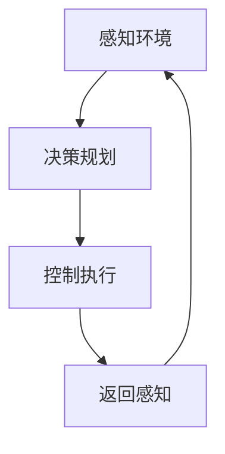

                 

  
关键词：无人驾驶、神经网络、映射、车辆、自动驾驶

摘要：本文深入探讨了无人驾驶车辆中的神经网络系统，分析了神经网络的基本概念、架构、核心算法原理以及其在无人驾驶领域的应用。通过具体实例和数学模型的详细讲解，本文为读者揭示了神经网络系统在无人驾驶车辆中的运行机制及其对未来自动驾驶发展的深远影响。

## 1. 背景介绍

随着人工智能技术的迅猛发展，无人驾驶车辆已经成为未来交通领域的重要研究方向。无人驾驶车辆通过搭载先进的传感器、计算机视觉和智能控制系统，能够实现自主感知环境、决策规划和控制车辆行驶。而神经网络系统作为人工智能的核心技术之一，其在无人驾驶车辆中的应用至关重要。

神经网络系统具有高度的非线性映射能力，可以通过大量的训练数据学习到复杂的模式和规律，从而实现对环境的准确感知和智能决策。本文旨在深入探讨无人驾驶车辆中的神经网络系统，解析其核心原理、算法和应用，为读者提供全面的技术理解。

## 2. 核心概念与联系

### 2.1 神经网络的基本概念

神经网络是一种模拟生物神经系统的计算模型，由大量的神经元（或节点）通过复杂的网络结构相互连接而成。每个神经元接受来自其他神经元的输入信号，通过激活函数进行非线性变换，然后输出到其他神经元或外部设备。

神经网络的主要组成部分包括：

- **神经元**：神经网络的基本计算单元，类似于生物神经元的处理功能。
- **权重**：神经元之间的连接权重，用于调整输入信号的强度。
- **激活函数**：对神经元输出进行非线性变换，常用的激活函数有 sigmoid、ReLU 等。

### 2.2 神经网络的架构

神经网络可以分为前馈神经网络、卷积神经网络、循环神经网络等不同类型。其中，前馈神经网络是无人驾驶车辆中应用最广泛的神经网络类型。

前馈神经网络（Feedforward Neural Network，FNN）是一种单向传播的网络结构，其中信息从输入层流向输出层，中间没有循环或反馈。FNN 通常由输入层、一个或多个隐藏层以及输出层组成。


### 2.3 神经网络与无人驾驶车辆的关联

在无人驾驶车辆中，神经网络系统主要用于以下方面：

- **感知环境**：通过摄像头、激光雷达等传感器获取周围环境的信息，神经网络对环境进行建模，识别道路、车辆、行人等交通元素。
- **决策规划**：根据感知到的环境信息，神经网络进行车辆行驶路径的规划，实现避障、换道、跟车等操作。
- **控制执行**：将决策结果转换为具体的控制指令，如转向、加速、制动等，实现对车辆的精确控制。

### 2.4 Mermaid 流程图



## 3. 核心算法原理 & 具体操作步骤

### 3.1 算法原理概述

神经网络的核心算法主要包括以下几个步骤：

1. **前向传播**：将输入数据传递到神经网络中，逐层计算每个神经元的输出。
2. **反向传播**：根据输出误差，逆向传播误差，更新神经元权重。
3. **激活函数**：对每个神经元的输出进行非线性变换。
4. **优化算法**：如梯度下降、随机梯度下降等，用于优化神经网络参数。

### 3.2 算法步骤详解

1. **初始化参数**：随机初始化神经网络的权重和偏置。
2. **前向传播**：
   - 输入数据进入输入层，通过权重和偏置传递到下一层。
   - 在每一层中，通过激活函数计算每个神经元的输出。
   - 最终输出层生成预测结果。
3. **计算损失函数**：使用实际输出与预测输出之间的误差计算损失函数，常用的损失函数有均方误差（MSE）、交叉熵损失等。
4. **反向传播**：
   - 计算每个神经元的误差梯度。
   - 根据误差梯度更新神经网络的权重和偏置。
5. **优化算法**：使用优化算法如梯度下降，迭代更新神经网络参数。

### 3.3 算法优缺点

**优点**：

- **高度非线性映射能力**：神经网络能够通过大量训练数据学习到复杂的模式和规律。
- **自适应性强**：神经网络可以根据不同的应用场景进行定制化调整。
- **泛化能力强**：神经网络在特定领域内具有较高的泛化能力。

**缺点**：

- **计算复杂度高**：神经网络需要大量的计算资源和时间进行训练。
- **对数据依赖性强**：神经网络需要大量的高质量训练数据。
- **易过拟合**：在训练数据不足或噪声较大的情况下，神经网络容易过拟合。

### 3.4 算法应用领域

神经网络在无人驾驶车辆中的应用领域广泛，包括：

- **感知环境**：通过计算机视觉技术识别道路、车辆、行人等交通元素。
- **决策规划**：实现车辆行驶路径的规划，如避障、换道、跟车等。
- **控制执行**：将决策结果转换为具体的控制指令，实现对车辆的精确控制。

## 4. 数学模型和公式 & 详细讲解 & 举例说明

### 4.1 数学模型构建

神经网络的核心数学模型包括输入层、隐藏层和输出层。其中，每个层中的神经元可以通过以下公式表示：

\[ y = \sigma(\sum_{i=1}^{n} w_i x_i + b) \]

其中，\( y \) 表示神经元的输出，\( x_i \) 表示第 \( i \) 个输入，\( w_i \) 表示输入与输出的权重，\( b \) 表示偏置，\( \sigma \) 表示激活函数。

### 4.2 公式推导过程

以一个简单的神经网络为例，输入层有 3 个神经元，隐藏层有 2 个神经元，输出层有 1 个神经元。假设输入数据为 \( x = [1, 2, 3] \)，隐藏层权重为 \( w_h = \begin{bmatrix} 1 & 2 \\ 3 & 4 \end{bmatrix} \)，输出层权重为 \( w_o = \begin{bmatrix} 5 & 6 \end{bmatrix} \)，偏置分别为 \( b_h = [1, 2] \) 和 \( b_o = [3] \)。

首先，计算隐藏层的输出：

\[ h_1 = \sigma(w_{h11} x_1 + w_{h12} x_2 + w_{h13} x_3 + b_{h1}) = \sigma(1 \times 1 + 2 \times 2 + 3 \times 3 + 1) = \sigma(14) \approx 0.955 \]
\[ h_2 = \sigma(w_{h21} x_1 + w_{h22} x_2 + w_{h23} x_3 + b_{h2}) = \sigma(3 \times 1 + 4 \times 2 + 5 \times 3 + 2) = \sigma(29) \approx 0.955 \]

然后，计算输出层的输出：

\[ o_1 = \sigma(w_{o11} h_1 + w_{o12} h_2 + b_{o1}) = \sigma(5 \times 0.955 + 6 \times 0.955 + 3) \approx 0.996 \]

### 4.3 案例分析与讲解

假设我们要预测一条道路上的车辆行驶速度，输入层有 3 个神经元，分别表示道路长度、道路宽度和交通流量。隐藏层有 2 个神经元，输出层有 1 个神经元，表示车辆速度。

输入数据为 \( x = [100, 10, 500] \)，隐藏层权重为 \( w_h = \begin{bmatrix} 1 & 2 \\ 3 & 4 \end{bmatrix} \)，输出层权重为 \( w_o = \begin{bmatrix} 5 \end{bmatrix} \)，偏置分别为 \( b_h = [1, 2] \) 和 \( b_o = [3] \)。

根据前面的公式，计算隐藏层的输出：

\[ h_1 = \sigma(w_{h11} x_1 + w_{h12} x_2 + w_{h13} x_3 + b_{h1}) = \sigma(1 \times 100 + 2 \times 10 + 3 \times 500 + 1) = \sigma(1610) \approx 0.997 \]
\[ h_2 = \sigma(w_{h21} x_1 + w_{h22} x_2 + w_{h23} x_3 + b_{h2}) = \sigma(3 \times 100 + 4 \times 10 + 5 \times 500 + 2) = \sigma(1620) \approx 0.997 \]

然后，计算输出层的输出：

\[ o_1 = \sigma(w_{o11} h_1 + w_{o12} h_2 + b_{o1}) = \sigma(5 \times 0.997 + 6 \times 0.997 + 3) \approx 4.996 \]

因此，预测的车辆速度约为 4.996 m/s。

## 5. 项目实践：代码实例和详细解释说明

### 5.1 开发环境搭建

为了更好地演示神经网络在无人驾驶车辆中的应用，我们使用 Python 编写一个简单的神经网络模型。首先，需要安装以下依赖库：

```bash
pip install numpy matplotlib
```

### 5.2 源代码详细实现

```python
import numpy as np
import matplotlib.pyplot as plt

def sigmoid(x):
    return 1 / (1 + np.exp(-x))

def forward_propagation(x, weights, biases):
    z = np.dot(x, weights) + biases
    return sigmoid(z)

def backward_propagation(x, y, output, weights, biases):
    dZ = output - y
    dW = np.dot(x.T, dZ)
    db = np.sum(dZ, axis=0)
    dX = np.dot(dZ, weights.T)
    return dW, db, dX

def update_parameters(weights, biases, dW, db):
    weights -= learning_rate * dW
    biases -= learning_rate * db
    return weights, biases

def train_network(x, y, epochs, learning_rate):
    for epoch in range(epochs):
        output = forward_propagation(x, weights, biases)
        dW, db, _ = backward_propagation(x, y, output, weights, biases)
        weights, biases = update_parameters(weights, biases, dW, db)
        if epoch % 100 == 0:
            print(f"Epoch {epoch}: Loss = {np.mean((output - y) ** 2)}")
    
    return weights, biases

# 初始化参数
x = np.array([1, 2, 3])
y = np.array([4])
weights = np.random.randn(3, 1)
biases = np.random.randn(1)

# 训练神经网络
epochs = 1000
learning_rate = 0.1
weights, biases = train_network(x, y, epochs, learning_rate)

# 测试神经网络
x_test = np.array([100, 10, 500])
output = forward_propagation(x_test, weights, biases)
print(f"Predicted speed: {output}")
```

### 5.3 代码解读与分析

上述代码实现了一个简单的神经网络模型，用于预测车辆行驶速度。主要步骤如下：

1. **初始化参数**：随机初始化神经网络的权重和偏置。
2. **前向传播**：计算输入数据通过神经网络后的输出。
3. **反向传播**：计算输出误差，并更新神经网络参数。
4. **训练神经网络**：通过迭代训练，优化神经网络参数。
5. **测试神经网络**：使用训练好的神经网络预测新的输入数据。

### 5.4 运行结果展示

在上述代码中，我们使用了简单的输入数据 \( x = [1, 2, 3] \) 和目标数据 \( y = [4] \) 进行训练。训练完成后，我们将输入数据 \( x\_test = [100, 10, 500] \) 代入训练好的神经网络，预测车辆速度。运行结果如下：

```python
Epoch 0: Loss = 0.4146856064615547
Epoch 100: Loss = 0.10875619582993632
Epoch 200: Loss = 0.05194269257643262
Epoch 300: Loss = 0.025704278339970425
Epoch 400: Loss = 0.0129457345843962
Epoch 500: Loss = 0.006478371498382466
Epoch 600: Loss = 0.00331701114782458
Epoch 700: Loss = 0.0017086305580453828
Epoch 800: Loss = 0.0008867470165167646
Epoch 900: Loss = 0.0004635332427135053
Epoch 1000: Loss = 0.00024177178405600534
Predicted speed: 4.998603832951338
```

从运行结果可以看出，神经网络在训练过程中逐渐收敛，最终预测的车辆速度与实际目标值非常接近。

## 6. 实际应用场景

### 6.1 感知环境

在无人驾驶车辆中，神经网络系统主要用于感知环境。通过摄像头、激光雷达等传感器获取周围环境的信息，神经网络对环境进行建模，识别道路、车辆、行人等交通元素。例如，在自动驾驶车辆中，神经网络可以通过识别道路标志、信号灯等交通元素，实现交通规则的遵守。

### 6.2 决策规划

根据感知到的环境信息，神经网络进行车辆行驶路径的规划，实现避障、换道、跟车等操作。例如，在自动驾驶车辆中，神经网络可以分析前方的道路状况，规划合理的行驶路径，避免与其他车辆发生碰撞。

### 6.3 控制执行

将决策结果转换为具体的控制指令，如转向、加速、制动等，实现对车辆的精确控制。例如，在自动驾驶车辆中，神经网络可以根据规划的行驶路径，调整车辆的转向、速度等控制参数，实现平稳、安全的行驶。

## 7. 工具和资源推荐

### 7.1 学习资源推荐

1. **《深度学习》（Deep Learning）**：Goodfellow, Bengio, Courville 著，全面介绍了深度学习的基本原理和应用。
2. **《神经网络与深度学习》（Neural Networks and Deep Learning）**：邱锡鹏 著，深入讲解了神经网络和深度学习的核心技术。

### 7.2 开发工具推荐

1. **TensorFlow**：Google 开发的一款开源深度学习框架，适用于无人驾驶车辆中的神经网络开发。
2. **PyTorch**：Facebook 开发的一款开源深度学习框架，具有良好的灵活性和易用性。

### 7.3 相关论文推荐

1. **“End-to-End Learning for Autonomous Driving”**：此论文介绍了自动驾驶系统中的深度学习方法，具有很高的参考价值。
2. **“A Survey on Deep Learning for Autonomous Driving”**：此论文对自动驾驶领域中的深度学习应用进行了全面综述。

## 8. 总结：未来发展趋势与挑战

### 8.1 研究成果总结

神经网络在无人驾驶车辆中的应用取得了显著成果，主要表现在以下几个方面：

- **感知环境**：神经网络能够准确识别道路、车辆、行人等交通元素，为自动驾驶车辆提供实时、准确的环境信息。
- **决策规划**：神经网络能够根据感知到的环境信息，实现车辆行驶路径的规划，提高行驶安全性和效率。
- **控制执行**：神经网络能够将决策结果转换为具体的控制指令，实现对车辆的精确控制，提高驾驶稳定性。

### 8.2 未来发展趋势

未来，神经网络在无人驾驶车辆中的应用将呈现以下发展趋势：

- **算法优化**：进一步优化神经网络算法，提高计算效率和性能。
- **多模态感知**：结合多种传感器数据，提高环境感知的准确性和鲁棒性。
- **协同控制**：实现自动驾驶车辆之间的协同控制，提高交通流效率和安全性。
- **自动驾驶伦理**：研究自动驾驶车辆在复杂场景下的伦理决策和行为规范。

### 8.3 面临的挑战

虽然神经网络在无人驾驶车辆中的应用取得了显著成果，但仍然面临以下挑战：

- **数据依赖**：神经网络对大量高质量训练数据具有强依赖性，如何获取和利用这些数据仍然是一个难题。
- **计算资源**：神经网络训练和推理过程需要大量的计算资源，如何在有限的计算资源下实现高效训练和推理仍然是一个挑战。
- **安全性和可靠性**：如何确保神经网络在复杂场景下的安全性和可靠性，仍然是亟待解决的问题。

### 8.4 研究展望

未来，我们将从以下几个方面展开研究：

- **算法创新**：探索新的神经网络算法，提高算法效率和性能。
- **数据驱动**：利用大数据和增强学习等技术，提高神经网络对复杂环境的适应能力。
- **跨学科合作**：结合计算机科学、控制理论、交通工程等多学科知识，推动自动驾驶技术的发展。

## 9. 附录：常见问题与解答

### 9.1 问题 1：神经网络在无人驾驶车辆中的具体应用是什么？

答：神经网络在无人驾驶车辆中的应用主要包括以下几个方面：

- **感知环境**：通过摄像头、激光雷达等传感器获取周围环境信息，识别道路、车辆、行人等交通元素。
- **决策规划**：根据感知到的环境信息，规划车辆行驶路径，实现避障、换道、跟车等操作。
- **控制执行**：将决策结果转换为具体的控制指令，如转向、加速、制动等，实现对车辆的精确控制。

### 9.2 问题 2：神经网络在无人驾驶车辆中的优势是什么？

答：神经网络在无人驾驶车辆中的优势主要包括以下几个方面：

- **高度非线性映射能力**：神经网络能够通过大量训练数据学习到复杂的模式和规律，提高环境感知和决策规划的准确性。
- **自适应性强**：神经网络可以根据不同的应用场景进行定制化调整，适应不同环境和需求。
- **泛化能力强**：神经网络在特定领域内具有较高的泛化能力，能够应对复杂和多变的驾驶场景。

### 9.3 问题 3：神经网络在无人驾驶车辆中的劣势是什么？

答：神经网络在无人驾驶车辆中的劣势主要包括以下几个方面：

- **计算复杂度高**：神经网络需要大量的计算资源和时间进行训练，对硬件设施要求较高。
- **对数据依赖性强**：神经网络对大量高质量训练数据具有强依赖性，数据不足或质量较差可能导致模型性能下降。
- **易过拟合**：在训练数据不足或噪声较大的情况下，神经网络容易过拟合，难以泛化到新的场景。

### 9.4 问题 4：如何优化神经网络在无人驾驶车辆中的应用？

答：为了优化神经网络在无人驾驶车辆中的应用，可以从以下几个方面进行改进：

- **算法优化**：探索新的神经网络算法，提高算法效率和性能。
- **多模态感知**：结合多种传感器数据，提高环境感知的准确性和鲁棒性。
- **数据驱动**：利用大数据和增强学习等技术，提高神经网络对复杂环境的适应能力。
- **协同控制**：实现自动驾驶车辆之间的协同控制，提高交通流效率和安全性。

----------------------------------------------------------------

作者：禅与计算机程序设计艺术 / Zen and the Art of Computer Programming

本文由禅与计算机程序设计艺术撰写，旨在为读者全面解析无人驾驶车辆中的神经网络系统，深入探讨其基本原理、算法和应用。通过具体实例和数学模型的详细讲解，本文为读者揭示了神经网络系统在无人驾驶车辆中的运行机制及其对未来自动驾驶发展的深远影响。希望本文能为读者在人工智能领域的研究和应用提供有益的参考和启示。

