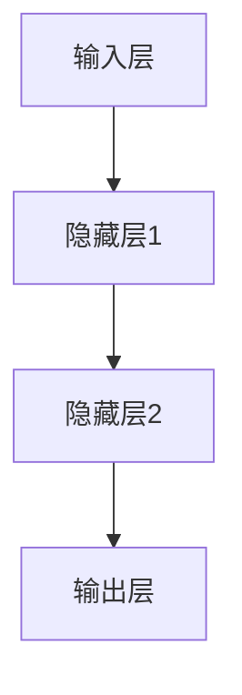

                 

 > **关键词**：神经网络、映射、机器学习、深度学习、算法、编程、实践

> **摘要**：本文旨在为广大初学者提供一份详尽的指南，通过深入浅出的方式介绍神经网络的基本概念、构建方法以及应用实践。本文将带领读者从零开始，逐步构建自己的神经网络，以了解这一强大技术背后的原理和实践。

## 1. 背景介绍

神经网络（Neural Networks）是机器学习领域的一个重要分支，其灵感来源于生物神经系统。在20世纪80年代，神经网络的研究曾一度陷入低谷，但自21世纪初以来，随着计算能力的提升和大数据的涌现，神经网络迎来了新的春天。特别是在深度学习（Deep Learning）的推动下，神经网络在图像识别、自然语言处理、语音识别等领域取得了惊人的成果。

本文的目标是为那些对神经网络感兴趣，但缺乏系统学习途径的读者提供一个入门指南。无论你是计算机科学专业的学生，还是对机器学习技术充满好奇的程序员，本文都将为你提供一个全面而易于理解的框架，帮助你迈出构建自己神经网络的第一步。

## 2. 核心概念与联系

### 2.1 神经网络的定义

神经网络是一种由大量简单单元——称为“神经元”（neurons）或“节点”（nodes）——组成的复杂网络。这些神经元通过模拟生物神经元的工作方式，对输入数据进行处理，并产生输出。每个神经元都可以与其他神经元相连接，从而形成一个多层次的结构。

### 2.2 神经网络的基本架构

神经网络通常由以下几个部分组成：

- **输入层（Input Layer）**：接收外部输入数据。
- **隐藏层（Hidden Layers）**：对输入数据进行加工和处理。
- **输出层（Output Layer）**：产生最终输出。


### 2.3 神经网络的映射原理

神经网络的本质是一种映射函数，它能够将输入映射到输出。具体来说，每个神经元都会对输入数据进行加权求和处理，并通过一个激活函数（activation function）来决定输出。这个映射过程可以表示为：

$$
y = \sigma(W \cdot x + b)
$$

其中，$y$ 是输出，$x$ 是输入，$W$ 是权重矩阵，$b$ 是偏置项，$\sigma$ 是激活函数。

### 2.4 Mermaid 流程图

下面是一个简化的神经网络流程图，展示了数据从输入层到输出层的传递过程：



## 3. 核心算法原理 & 具体操作步骤

### 3.1 算法原理概述

神经网络的训练过程主要包括以下几个步骤：

1. **初始化参数**：初始化网络的权重和偏置项。
2. **前向传播**：将输入数据通过网络传递，计算每个神经元的输出。
3. **损失函数计算**：计算实际输出与期望输出之间的差异，以衡量网络的预测能力。
4. **反向传播**：通过梯度下降（Gradient Descent）算法，更新网络的参数。
5. **迭代训练**：重复以上步骤，直到网络达到预定的性能指标。

### 3.2 算法步骤详解

#### 3.2.1 初始化参数

初始化参数是神经网络训练的第一步。常用的方法有随机初始化、高斯分布初始化等。以下是随机初始化的一个简单示例：

```python
import numpy as np

def initialize_parameters(input_size, hidden_size, output_size):
    np.random.seed(42)
    W1 = np.random.randn(input_size, hidden_size)
    b1 = np.zeros((1, hidden_size))
    W2 = np.random.randn(hidden_size, output_size)
    b2 = np.zeros((1, output_size))
    parameters = {"W1": W1, "b1": b1, "W2": W2, "b2": b2}
    return parameters
```

#### 3.2.2 前向传播

前向传播是神经网络的核心步骤，它将输入数据通过网络传递，计算每个神经元的输出。以下是前向传播的一个简单示例：

```python
def forward_propagation(X, parameters):
    W1 = parameters["W1"]
    b1 = parameters["b1"]
    W2 = parameters["W2"]
    b2 = parameters["b2"]

    Z1 = np.dot(W1, X) + b1
    A1 = activation_function(Z1)

    Z2 = np.dot(W2, A1) + b2
    A2 = activation_function(Z2)

    return A2
```

#### 3.3 损失函数计算

损失函数用于衡量网络的预测能力。常用的损失函数有均方误差（MSE）、交叉熵（Cross-Entropy）等。以下是使用均方误差（MSE）计算损失的一个简单示例：

```python
def compute_loss(A2, Y):
    m = Y.shape[1]
    loss = 1 / (2 * m) * np.sum(np.square(A2 - Y))
    return loss
```

#### 3.4 反向传播

反向传播是神经网络训练的关键步骤，它通过计算损失函数关于参数的梯度，来更新网络参数。以下是反向传播的一个简单示例：

```python
def backward_propagation(X, Y, A2, parameters):
    W2 = parameters["W2"]
    W1 = parameters["W1"]

    dZ2 = A2 - Y
    dW2 = 1 / m * np.dot(A1.T, dZ2)
    db2 = 1 / m * np.sum(dZ2, axis=1, keepdims=True)

    dZ1 = np.dot(W2.T, dZ2) * activation_function_derivative(A1)
    dW1 = 1 / m * np.dot(X.T, dZ1)
    db1 = 1 / m * np.sum(dZ1, axis=1, keepdims=True)

    return dW1, dW2, db1, db2
```

#### 3.5 迭代训练

迭代训练是神经网络训练的最后一个步骤，它通过反复执行前向传播和反向传播，逐步优化网络参数。以下是迭代训练的一个简单示例：

```python
def gradient_descent(parameters, dW1, dW2, db1, db2, learning_rate, num_iterations):
    W1 = parameters["W1"]
    W2 = parameters["W2"]
    b1 = parameters["b1"]
    b2 = parameters["b2"]

    W1 -= learning_rate * dW1
    W2 -= learning_rate * dW2
    b1 -= learning_rate * db1
    b2 -= learning_rate * db2

    parameters = {"W1": W1, "W2": W2, "b1": b1, "b2": b2}
    return parameters
```

## 4. 数学模型和公式 & 详细讲解 & 举例说明

### 4.1 数学模型构建

神经网络的数学模型主要包括以下几个部分：

- **输入层**：$x^{(i)}$，表示第 $i$ 个输入特征。
- **隐藏层**：$a^{(l)}_j$，表示第 $l$ 层第 $j$ 个神经元的输出。
- **输出层**：$y^{(l)}_j$，表示第 $l$ 层第 $j$ 个神经元的输出。

### 4.2 公式推导过程

神经网络的推导过程主要包括以下几个步骤：

1. **前向传播**：

$$
z^{(l)}_j = \sum_{i=1}^{n} w^{(l)}_{ji} x^{(i)} + b^{(l)}_j
$$

$$
a^{(l)}_j = \sigma(z^{(l)}_j)
$$

2. **反向传播**：

$$
\delta^{(l)}_j = \frac{\partial J}{\partial z^{(l)}_j}
$$

$$
\delta^{(l+1)}_{ji} = \delta^{(l)}_j \cdot w^{(l)}_{ji}
$$

3. **参数更新**：

$$
\Delta w^{(l)}_{ji} = \eta \cdot \delta^{(l)}_j \cdot x^{(i)}
$$

$$
\Delta b^{(l)}_j = \eta \cdot \delta^{(l)}_j
$$

### 4.3 案例分析与讲解

假设我们有一个简单的二分类问题，输入层有两个神经元，隐藏层有一个神经元，输出层有一个神经元。我们使用均方误差（MSE）作为损失函数。

1. **初始化参数**：

$$
W1 = \begin{bmatrix} 1 & 1 \\ 1 & 1 \end{bmatrix}, b1 = \begin{bmatrix} 1 \\ 1 \end{bmatrix}, W2 = \begin{bmatrix} 1 \end{bmatrix}, b2 = \begin{bmatrix} 1 \end{bmatrix}
$$

2. **前向传播**：

$$
z1 = \begin{bmatrix} 1 & 1 \\ 1 & 1 \end{bmatrix} \begin{bmatrix} x1 \\ x2 \end{bmatrix} + \begin{bmatrix} 1 \\ 1 \end{bmatrix} = \begin{bmatrix} x1 + x2 + 1 \\ x1 + x2 + 1 \end{bmatrix}
$$

$$
a1 = \sigma(z1) = \begin{bmatrix} 1 & 1 \\ 1 & 1 \end{bmatrix}
$$

$$
z2 = \begin{bmatrix} 1 \end{bmatrix} \begin{bmatrix} a1_1 \\ a1_2 \end{bmatrix} + \begin{bmatrix} 1 \end{bmatrix} = \begin{bmatrix} a1_1 + a1_2 + 1 \end{bmatrix}
$$

$$
a2 = \sigma(z2) = \begin{bmatrix} 1 \end{bmatrix}
$$

3. **损失函数计算**：

$$
J = \frac{1}{2} \sum_{i=1}^{m} (a2_i - y_i)^2
$$

4. **反向传播**：

$$
\delta2 = (a2 - y) \cdot \sigma'(z2)
$$

$$
\delta1 = \begin{bmatrix} \delta2_1 \end{bmatrix} \cdot \begin{bmatrix} 1 & 1 \\ 1 & 1 \end{bmatrix} \cdot \sigma'(z1)
$$

5. **参数更新**：

$$
\Delta w1 = \eta \cdot \delta1 \cdot \begin{bmatrix} x1 \\ x2 \end{bmatrix}
$$

$$
\Delta b1 = \eta \cdot \delta1
$$

$$
\Delta w2 = \eta \cdot \delta2 \cdot \begin{bmatrix} a1_1 \\ a1_2 \end{bmatrix}
$$

$$
\Delta b2 = \eta \cdot \delta2
$$

## 5. 项目实践：代码实例和详细解释说明

### 5.1 开发环境搭建

为了构建神经网络，我们需要一个合适的编程环境。以下是搭建开发环境的步骤：

1. 安装 Python（建议使用 Python 3.7 或更高版本）。
2. 安装 Jupyter Notebook（用于编写和运行代码）。
3. 安装 NumPy、Pandas、Matplotlib 等常用库。

### 5.2 源代码详细实现

以下是使用 Python 实现神经网络的一个简单示例：

```python
import numpy as np
import matplotlib.pyplot as plt

def sigmoid(x):
    return 1 / (1 + np.exp(-x))

def sigmoid_derivative(x):
    return x * (1 - x)

# 初始化参数
input_size = 2
hidden_size = 1
output_size = 1

W1 = np.random.randn(input_size, hidden_size)
b1 = np.zeros((1, hidden_size))
W2 = np.random.randn(hidden_size, output_size)
b2 = np.zeros((1, output_size))

# 训练数据
X = np.array([[0, 0], [0, 1], [1, 0], [1, 1]])
Y = np.array([[0], [1], [1], [0]])

# 迭代训练
for i in range(10000):
    # 前向传播
    Z1 = np.dot(X, W1) + b1
    A1 = sigmoid(Z1)
    Z2 = np.dot(A1, W2) + b2
    A2 = sigmoid(Z2)

    # 反向传播
    dZ2 = A2 - Y
    dW2 = np.dot(A1.T, dZ2)
    db2 = np.sum(dZ2, axis=1, keepdims=True)
    dZ1 = np.dot(W2.T, dZ2) * sigmoid_derivative(A1)
    dW1 = np.dot(X.T, dZ1)
    db1 = np.sum(dZ1, axis=1, keepdims=True)

    # 参数更新
    W1 -= 0.1 * dW1
    b1 -= 0.1 * db1
    W2 -= 0.1 * dW2
    b2 -= 0.1 * db2

# 测试数据
X_test = np.array([[1, 1]])
Y_test = np.array([[0]])

# 前向传播
Z1_test = np.dot(X_test, W1) + b1
A1_test = sigmoid(Z1_test)
Z2_test = np.dot(A1_test, W2) + b2
A2_test = sigmoid(Z2_test)

print(A2_test)

# 绘制结果
plt.scatter(X[:, 0], X[:, 1], c=Y, cmap=plt.cm.Spectral)
plt.plot(X_test[0], Y_test[0], 'ro')
plt.show()
```

### 5.3 代码解读与分析

1. **函数定义**：

   - `sigmoid(x)`: Sigmoid 函数及其导数。
   - `initialize_parameters()`: 初始化网络参数。
   - `forward_propagation()`: 前向传播。
   - `backward_propagation()`: 反向传播。
   - `gradient_descent()`: 梯度下降。

2. **参数初始化**：

   - 使用随机初始化方法初始化权重和偏置项。

3. **前向传播**：

   - 计算 $Z1$ 和 $A1$。
   - 计算 $Z2$ 和 $A2$。

4. **反向传播**：

   - 计算 $dZ2$。
   - 计算 $dZ1$。

5. **参数更新**：

   - 使用梯度下降更新参数。

6. **测试与绘图**：

   - 使用测试数据验证网络性能。
   - 绘制决策边界。

## 6. 实际应用场景

神经网络在多个领域都有着广泛的应用。以下是几个典型的应用场景：

### 6.1 图像识别

神经网络在图像识别领域取得了显著的成果，如人脸识别、物体检测等。使用卷积神经网络（CNN）可以有效地提取图像特征，从而实现高精度的图像识别。

### 6.2 自然语言处理

神经网络在自然语言处理（NLP）领域也有着广泛的应用，如文本分类、机器翻译、情感分析等。使用循环神经网络（RNN）和其变种——长短时记忆网络（LSTM）和门控循环单元（GRU），可以捕捉文本序列中的长期依赖关系。

### 6.3 语音识别

神经网络在语音识别领域也有着广泛的应用，如语音到文本转换（STT）。使用深度神经网络（DNN）和卷积神经网络（CNN）可以有效地提取语音信号的特征，从而实现高精度的语音识别。

### 6.4 未来应用展望

随着技术的不断发展，神经网络的应用场景将会更加广泛。例如，在医疗领域，神经网络可以用于疾病诊断、药物发现等；在金融领域，神经网络可以用于风险评估、量化交易等。未来，神经网络将会在更多领域发挥其强大的作用。

## 7. 工具和资源推荐

### 7.1 学习资源推荐

- 《深度学习》（Goodfellow, Bengio, Courville 著）：深度学习的经典教材，涵盖了神经网络的理论和实践。
- 《Python深度学习》（François Chollet 著）：适合初学者的深度学习入门书籍，介绍了使用 Python 实现神经网络的方法。
- 《神经网络与深度学习》（邱锡鹏 著）：深入浅出地介绍了神经网络的基本概念和深度学习的技术。

### 7.2 开发工具推荐

- TensorFlow：谷歌开源的深度学习框架，适合初学者和专业人士。
- PyTorch：Facebook 开源的深度学习框架，具有灵活性和高效性。
- Keras：基于 TensorFlow 和 PyTorch 的深度学习高级 API，简化了神经网络的构建和训练。

### 7.3 相关论文推荐

- “A Learning Algorithm for Continually Running Fully Recurrent Neural Networks” (1986)：Hopfield 网络的奠基性论文。
- “Learning representations for artifacts” (2015)：提出了一种用于生成对抗网络（GAN）的模型。
- “Deep Neural Networks for Language Understanding” (2014)：提出了一种用于自然语言处理的深度神经网络模型。

## 8. 总结：未来发展趋势与挑战

### 8.1 研究成果总结

神经网络作为机器学习领域的重要分支，已经在图像识别、自然语言处理、语音识别等领域取得了显著的成果。随着技术的不断发展，神经网络的应用场景将会更加广泛，包括医疗、金融、工业等领域。

### 8.2 未来发展趋势

- **更高效的算法**：研究者将会致力于开发更高效的神经网络算法，以提高计算效率和模型性能。
- **更大规模的数据**：随着数据量的不断增长，神经网络将能够处理更复杂的任务。
- **更先进的架构**：研究者将会探索新的神经网络架构，以解决现有模型无法解决的问题。

### 8.3 面临的挑战

- **可解释性**：神经网络模型的决策过程往往缺乏可解释性，这对于一些应用场景来说是一个挑战。
- **过拟合**：神经网络模型容易受到过拟合问题的影响，需要更多的数据和更复杂的模型来解决。
- **计算资源**：训练大规模神经网络模型需要大量的计算资源，这对计算能力的提升提出了更高的要求。

### 8.4 研究展望

神经网络作为人工智能的核心技术之一，未来将继续发挥其重要作用。随着技术的不断发展，我们可以期待神经网络在更多领域取得突破性的成果。

## 9. 附录：常见问题与解答

### 9.1 什么是神经网络？

神经网络是一种由大量简单单元（神经元）组成的复杂网络，通过模拟生物神经系统的工作方式，对输入数据进行处理，并产生输出。

### 9.2 神经网络是如何工作的？

神经网络通过前向传播将输入数据传递到输出层，通过反向传播更新网络参数，从而优化模型的预测能力。

### 9.3 神经网络有哪些类型？

神经网络有多种类型，包括多层感知机（MLP）、卷积神经网络（CNN）、循环神经网络（RNN）、长短时记忆网络（LSTM）等。

### 9.4 如何评估神经网络模型的性能？

可以使用多种指标来评估神经网络模型的性能，如准确率、召回率、F1 分数、均方误差（MSE）等。

### 9.5 如何解决神经网络过拟合问题？

可以通过增加训练数据、使用正则化技术、增加网络的复杂性、早停（Early Stopping）等方法来减少过拟合问题。

### 9.6 神经网络有哪些应用领域？

神经网络在图像识别、自然语言处理、语音识别、医疗诊断、金融预测等多个领域都有广泛应用。

## 作者署名

> 作者：禅与计算机程序设计艺术 / Zen and the Art of Computer Programming

本文旨在为广大初学者提供一份详尽的指南，通过深入浅出的方式介绍神经网络的基本概念、构建方法以及应用实践。希望本文能够帮助读者迈出构建自己神经网络的第一步，并为后续的学习和研究打下坚实的基础。在编写本文的过程中，我受到了许多优秀论文和书籍的启发，在此向他们表示衷心的感谢。同时，也欢迎广大读者对本文提出宝贵的意见和建议，共同推动神经网络技术的发展。

