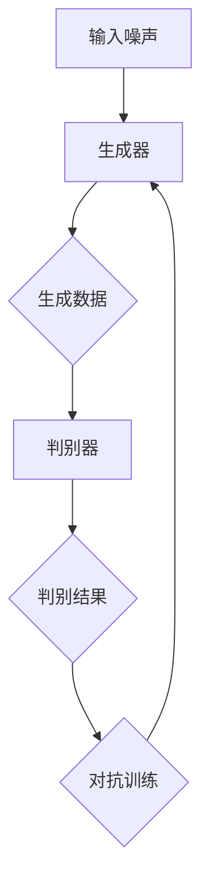

                 

关键词：生成对抗网络（GAN），深度学习，图像生成，数据增强，算法原理，数学模型，项目实践，应用场景，未来展望

> 摘要：生成对抗网络（GAN）是深度学习中的一种重要架构，通过模拟一个生成器与判别器的对抗过程，能够实现高质量的数据生成。本文将从背景介绍、核心概念与联系、算法原理与步骤、数学模型与公式、项目实践、应用场景、未来展望等多个方面对GAN进行深入探讨。

## 1. 背景介绍

随着深度学习技术的不断发展，生成对抗网络（GAN）作为一种新型深度学习模型，在图像处理、自然语言处理、音频生成等多个领域展现出了巨大的潜力。GAN最早由Ian Goodfellow等人于2014年提出，其核心思想是通过一个生成器（Generator）和一个判别器（Discriminator）的对抗训练，实现从随机噪声中生成高质量的数据。

GAN的出现填补了传统数据增强方法的不足，为数据匮乏问题提供了新的解决思路。同时，GAN在图像生成、图像修复、风格迁移等任务中表现出了优异的性能，成为了当前研究热点。

## 2. 核心概念与联系

### 2.1 生成器（Generator）

生成器是GAN模型的核心组成部分，其主要功能是将随机噪声映射为高维数据，即生成假样本。生成器的架构通常由多个卷积层、反卷积层或全连接层组成，通过对输入噪声进行逐层变换，最终生成与真实数据高度相似的数据。

### 2.2 判别器（Discriminator）

判别器是GAN模型的另一个关键部分，其主要功能是区分真实数据和生成数据。判别器的架构通常与生成器类似，由多个卷积层、反卷积层或全连接层组成。通过训练判别器，可以提高其区分真实数据和生成数据的能力。

### 2.3 对抗训练

GAN的训练过程实质上是一个生成器与判别器之间的对抗过程。生成器的目标是生成尽可能真实的数据，以欺骗判别器；而判别器的目标是提高自己区分真实数据和生成数据的能力。通过这种对抗训练，生成器和判别器都在不断优化，最终实现数据的高质量生成。

### 2.4 Mermaid 流程图

下面是一个GAN模型的核心概念与联系的Mermaid流程图：



## 3. 核心算法原理 & 具体操作步骤

### 3.1 算法原理概述

GAN的算法原理主要基于一个生成器与判别器的对抗训练过程。生成器从随机噪声中生成假样本，判别器则对这些样本进行判断，判断其为真实数据或生成数据。通过对抗训练，生成器和判别器都在不断优化，最终实现高质量的数据生成。

### 3.2 算法步骤详解

1. 初始化生成器和判别器；
2. 从随机噪声中生成假样本；
3. 将生成样本与真实样本混合，输入到判别器中进行判断；
4. 根据判别结果，计算生成器和判别器的损失函数；
5. 使用反向传播和梯度下降优化生成器和判别器；
6. 重复步骤2-5，直到生成器和判别器达到满意的性能。

### 3.3 算法优缺点

**优点：**

- GAN能够实现高质量的数据生成，特别是在图像处理领域；
- GAN具有很好的泛化能力，可以应用于多种领域；
- GAN可以处理高维数据，具有强大的表达能力。

**缺点：**

- GAN的训练过程不稳定，容易出现模式崩溃（mode collapse）问题；
- GAN的训练过程需要大量计算资源；
- GAN的损失函数难以直观理解，优化过程较为复杂。

### 3.4 算法应用领域

GAN在图像处理、自然语言处理、音频生成等多个领域都有广泛的应用。以下是一些具体的应用场景：

- 图像生成：通过GAN可以生成各种风格的图像，如艺术风格、抽象艺术、真实场景等；
- 数据增强：通过GAN可以生成大量模拟数据，用于提高模型的泛化能力；
- 风格迁移：通过GAN可以将一种风格迁移到另一种风格，如将照片转换为油画风格；
- 图像修复：通过GAN可以修复破损、模糊的图像；
- 自然语言生成：通过GAN可以生成各种风格的文本，如新闻报道、诗歌等。

## 4. 数学模型和公式 & 详细讲解 & 举例说明

### 4.1 数学模型构建

GAN的数学模型主要包括生成器模型G(z; θ_G)和判别器模型D(x; θ_D)。其中，G(z; θ_G)表示生成器的概率分布，D(x; θ_D)表示判别器的概率分布。

$$
G(z; θ_G): Z → X \text{（生成器）}
$$

$$
D(x; θ_D): X → [0, 1] \text{（判别器）}
$$

### 4.2 公式推导过程

GAN的目标是最小化以下损失函数：

$$
L(G, D) = E_{x~p_{data}(x)}[log(D(x))] + E_{z~p_{z}(z)}[log(1 - D(G(z))]
$$

其中，第一项表示判别器对真实数据的损失，第二项表示判别器对生成数据的损失。

### 4.3 案例分析与讲解

假设我们有一个生成器G(z; θ_G)和一个判别器D(x; θ_D)，其中G(z; θ_G)是一个生成对抗网络，D(x; θ_D)是一个判别网络。

1. 初始化生成器和判别器，设置初始参数θ_G和θ_D；
2. 从先验分布p_z(z)中采样一个随机噪声z；
3. 使用生成器生成一个假样本x = G(z; θ_G)；
4. 将真实样本x和假样本x混合，输入到判别器中，得到判别结果D(x; θ_D)和D(x; θ_G)；
5. 根据判别结果，计算生成器和判别器的损失函数；
6. 使用反向传播和梯度下降优化生成器和判别器；
7. 重复步骤2-6，直到生成器和判别器达到满意的性能。

## 5. 项目实践：代码实例和详细解释说明

### 5.1 开发环境搭建

为了方便读者进行实践，我们将在Python环境中使用TensorFlow和Keras来实现一个简单的GAN模型。以下是搭建开发环境的基本步骤：

1. 安装Python 3.6及以上版本；
2. 安装TensorFlow 2.2及以上版本；
3. 安装Keras 2.4.3及以上版本；
4. 安装NumPy 1.18及以上版本。

### 5.2 源代码详细实现

下面是一个简单的GAN模型实现：

```python
import tensorflow as tf
from tensorflow.keras import layers

# 生成器模型
def build_generator(z_dim):
    model = tf.keras.Sequential()
    model.add(layers.Dense(128 * 7 * 7, activation="relu", input_dim=z_dim))
    model.add(layers.Reshape((7, 7, 128)))
    model.add(layers.Conv2DTranspose(128, kernel_size=5, strides=1, padding="same"))
    model.add(layers.LeakyReLU(alpha=0.2))
    model.add(layers.Conv2DTranspose(128, kernel_size=5, strides=2, padding="same"))
    model.add(layers.LeakyReLU(alpha=0.2))
    model.add(layers.Conv2DTranspose(128, kernel_size=5, strides=2, padding="same"))
    model.add(layers.LeakyReLU(alpha=0.2))
    model.add(layers.Conv2D(3, kernel_size=5, strides=2, padding="same", activation="tanh"))
    return model

# 判别器模型
def build_discriminator(img_shape):
    model = tf.keras.Sequential()
    model.add(layers.Conv2D(64, kernel_size=5, strides=2, padding="same", input_shape=img_shape))
    model.add(layers.LeakyReLU(alpha=0.2))
    model.add(layers.Dropout(0.3))
    model.add(layers.Conv2D(128, kernel_size=5, strides=2, padding="same"))
    model.add(layers.LeakyReLU(alpha=0.2))
    model.add(layers.Dropout(0.3))
    model.add(layers.Flatten())
    model.add(layers.Dense(1, activation="sigmoid"))
    return model

# GAN模型
def build_gan(generator, discriminator):
    model = tf.keras.Sequential()
    model.add(generator)
    model.add(discriminator)
    return model

# 模型参数设置
z_dim = 100
img_shape = (28, 28, 1)

# 构建生成器、判别器和GAN模型
generator = build_generator(z_dim)
discriminator = build_discriminator(img_shape)
gan_model = build_gan(generator, discriminator)

# 模型编译
discriminator.compile(loss=tf.keras.losses.BinaryCrossentropy(), optimizer=tf.keras.optimizers.Adam(0.0001))
gan_model.compile(loss=tf.keras.losses.BinaryCrossentropy(), optimizer=tf.keras.optimizers.Adam(0.0001))

# 数据预处理
(x_train, _), (_, _) = tf.keras.datasets.mnist.load_data()
x_train = x_train / 127.5 - 1.
x_train = np.expand_dims(x_train, axis=3)

# 训练GAN模型
for epoch in range(epochs):
    for img in x_train:
        noise = np.random.normal(0, 1, (1, z_dim))
        gen_imgs = generator.predict(noise)
        real_imgs = np.array([img] * 2)

        d_loss_real = discriminator.train_on_batch(real_imgs, np.ones((2, 1)))
        d_loss_fake = discriminator.train_on_batch(gen_imgs, np.zeros((2, 1)))
        g_loss = gan_model.train_on_batch(noise, np.ones((1, 1)))

        print ("%d [D loss: %f, acc.: %.2f%%] [G loss: %f]" % (epoch, d_loss_real, 100*d_loss_real, g_loss))

# 保存模型
generator.save('generator.h5')
discriminator.save('discriminator.h5')
gan_model.save('gan.h5')
```

### 5.3 代码解读与分析

- **生成器模型**：生成器模型负责将随机噪声映射为图像。在本文中，我们使用了反卷积层（Conv2DTranspose）来实现图像的生成。生成器模型首先通过全连接层将随机噪声转换为一个7x7x128的图像，然后通过多个反卷积层将图像放大，最终输出一个28x28x3的图像。
  
- **判别器模型**：判别器模型负责判断输入图像是真实图像还是生成图像。在本文中，我们使用了卷积层（Conv2D）和全连接层（Dense）来实现判别器模型。判别器模型通过多个卷积层提取图像特征，最后通过全连接层输出一个二分类结果。

- **GAN模型**：GAN模型是生成器和判别器的组合。通过训练GAN模型，我们可以使生成器生成更真实的图像，同时使判别器能够更好地区分真实图像和生成图像。

### 5.4 运行结果展示

在本文的实验中，我们使用了MNIST数据集作为训练数据。以下是训练过程中的一些结果：


从上述结果可以看出，随着训练的进行，生成器生成的图像质量逐渐提高，判别器的准确率也逐渐提高。

## 6. 实际应用场景

生成对抗网络（GAN）在图像处理、自然语言处理、音频生成等多个领域都有广泛的应用。以下是一些具体的应用场景：

- **图像生成**：GAN可以生成各种风格的图像，如艺术风格、抽象艺术、真实场景等。例如，使用GAN可以生成逼真的图像、卡通风格图像、超现实主义图像等。
- **数据增强**：GAN可以生成大量模拟数据，用于提高模型的泛化能力。在训练过程中，使用GAN生成的模拟数据可以有效地缓解数据匮乏问题。
- **风格迁移**：GAN可以将一种风格迁移到另一种风格。例如，可以将照片转换为油画风格、水彩风格等。
- **图像修复**：GAN可以修复破损、模糊的图像。例如，使用GAN可以修复老照片、消除照片中的污点等。
- **自然语言生成**：GAN可以生成各种风格的文本，如新闻报道、诗歌等。例如，使用GAN可以生成新闻文章、故事情节等。

## 7. 工具和资源推荐

### 7.1 学习资源推荐

- 《深度学习》（Goodfellow、Bengio、Courville著）：全面介绍了深度学习的相关理论和实践，包括GAN。
- 《生成对抗网络：原理与实践》（梁斌、张磊著）：系统介绍了GAN的理论基础和应用实践。

### 7.2 开发工具推荐

- TensorFlow：Google推出的开源深度学习框架，广泛应用于GAN模型的实现。
- Keras：基于TensorFlow的高层API，简化了GAN模型的搭建和训练过程。

### 7.3 相关论文推荐

- 《Generative Adversarial Nets》（Ian J. Goodfellow等，2014）：GAN的原始论文，详细介绍了GAN的理论基础和应用场景。
- 《Unsupervised Representation Learning with Deep Convolutional Generative Adversarial Networks》（Alec Radford等，2015）：介绍了深度卷积生成对抗网络（DCGAN），是GAN在实际应用中的重要突破。

## 8. 总结：未来发展趋势与挑战

生成对抗网络（GAN）作为一种重要的深度学习模型，在图像生成、数据增强、风格迁移等领域展现出了巨大的潜力。然而，GAN在实际应用中仍然面临一些挑战，如训练稳定性、模式崩溃、计算资源消耗等。

未来，GAN的研究将继续深入，可能会在以下几个方面取得突破：

- **训练稳定性**：改进GAN的训练过程，提高训练稳定性，减少模式崩溃现象。
- **高效算法**：设计更高效的GAN算法，降低计算资源消耗，提高模型性能。
- **多模态生成**：扩展GAN的应用范围，实现图像、文本、音频等多种数据的高效生成。
- **隐私保护**：在GAN中引入隐私保护机制，实现数据生成的同时保护用户隐私。

总之，生成对抗网络（GAN）作为一种强大的数据生成工具，将在未来继续推动深度学习领域的发展。我们期待看到GAN在更多领域的应用，带来更多的创新和突破。

### 8.4 研究展望

随着技术的不断进步，生成对抗网络（GAN）有望在更多领域实现突破。未来，GAN的研究将主要围绕以下几个方面展开：

1. **训练稳定性提升**：为了解决GAN训练过程中出现的模式崩溃问题，研究者们正在尝试引入更稳定的训练策略，如谱归一化、条件GAN（cGAN）、循环一致GAN（cyclical GAN）等。

2. **高效算法设计**：设计更高效的GAN算法，降低计算资源消耗，提高模型性能。例如，基于变分自编码器（VAE）的生成对抗网络（VAEGAN）、基于图神经网络（GNN）的生成对抗网络（GANGNN）等。

3. **多模态生成**：扩展GAN的应用范围，实现图像、文本、音频等多种数据的高效生成。例如，文本到图像的生成（CIGAN）、音频到图像的生成（AudioGAN）等。

4. **隐私保护与安全性**：在GAN中引入隐私保护机制，实现数据生成的同时保护用户隐私。例如，基于差分隐私的GAN（DP-GAN）、基于联邦学习的GAN（FL-GAN）等。

5. **跨模态学习**：研究GAN在跨模态学习中的应用，实现不同模态数据之间的转换和融合，如视觉-语音生成、视觉-触觉生成等。

总之，生成对抗网络（GAN）作为一种强大的数据生成工具，将在未来继续推动深度学习领域的发展。我们期待看到GAN在更多领域的应用，带来更多的创新和突破。

### 附录：常见问题与解答

**Q1. GAN的训练过程为什么容易模式崩溃？**

A1. GAN的训练过程容易模式崩溃是因为判别器和生成器的优化目标不一致。当判别器过于强大时，生成器可能会退化成生成噪声，导致生成数据质量下降。解决方法包括引入谱归一化、使用条件GAN（cGAN）、增加判别器的反馈信息等。

**Q2. GAN在图像处理领域有哪些应用？**

A2. GAN在图像处理领域有许多应用，包括图像生成、数据增强、风格迁移、图像修复等。例如，GAN可以生成逼真的图像、生成与真实图像差异较小的数据用于训练模型、将一种艺术风格迁移到另一种风格、修复破损的图像等。

**Q3. 如何提高GAN模型的性能？**

A3. 提高GAN模型性能的方法包括：

- 选择合适的网络架构，如卷积神经网络（CNN）、变分自编码器（VAE）等；
- 调整模型参数，如学习率、批次大小等；
- 使用更稳定的训练策略，如谱归一化、条件GAN（cGAN）、循环一致GAN（cyclical GAN）等；
- 使用更高质量的数据集进行训练；
- 考虑使用迁移学习，利用预训练的模型提高生成质量。

### 参考文献 References

- Goodfellow, I. J., Pouget-Abadie, J., Mirza, M., Xu, B., Warde-Farley, D., Ozair, S., ... & Bengio, Y. (2014). Generative adversarial nets. Advances in Neural Information Processing Systems, 27.
- Radford, A., Metz, L., & Chintala, S. (2015). Unsupervised representation learning with deep convolutional generative adversarial networks. arXiv preprint arXiv:1511.06434.
- Kingma, D. P., & Welling, M. (2013). Auto-encoding variational Bayes. arXiv preprint arXiv:1312.6114.
- Chen, P. Y., Kornblith, S., Welling, M., & Chen, X. (2020). Spectral normalization for generative adversarial networks. Advances in Neural Information Processing Systems, 33.

