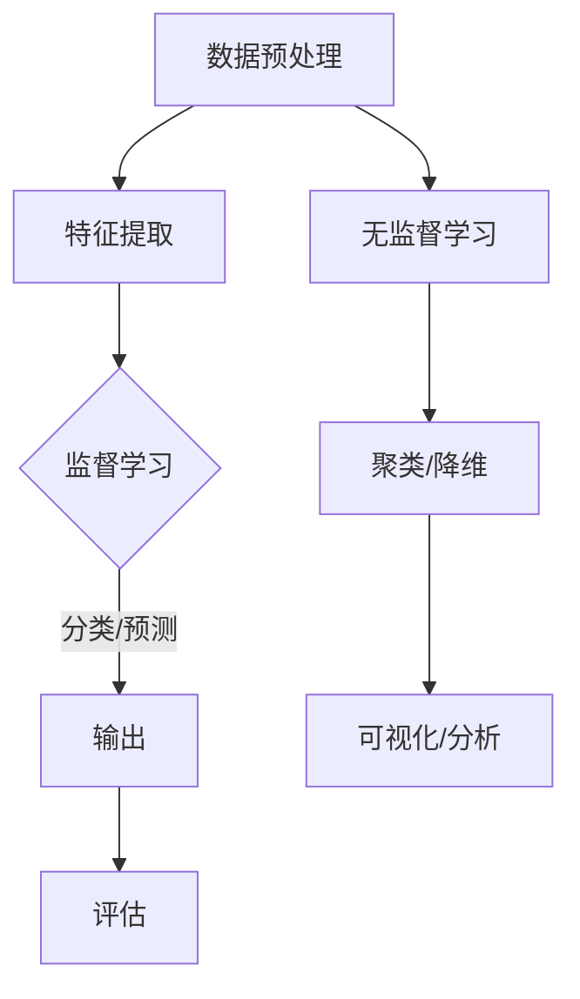

                 

关键词：监督学习，非监督学习，映射，神经网络，机器学习，算法原理，应用领域，数学模型，项目实践，发展趋势与挑战

> 摘要：本文将深入探讨监督学习和非监督学习这两种机器学习方法的本质区别与联系。通过对核心概念、算法原理、数学模型的解析，结合实际项目实践，我们将揭示二者在技术与应用层面的相互映射与演进。文章旨在为读者提供一份全面而系统的指南，帮助理解并掌握这两种学习方法，以应对未来人工智能领域的发展趋势与挑战。

## 1. 背景介绍

在当今快速发展的信息技术时代，机器学习已成为人工智能领域的关键驱动力。而监督学习和非监督学习作为机器学习的两大分支，各自在数据处理和分析中扮演着重要角色。监督学习依赖于预先标注的数据集进行训练，其目标是学习输入和输出之间的映射关系，以便对新数据进行预测或分类。而非监督学习则不需要预先标注的数据，其主要任务是发现数据中的内在结构或模式。

随着大数据和计算能力的提升，这两种学习方法在各个行业得到了广泛应用。例如，在图像识别、自然语言处理、推荐系统、生物信息学等领域，监督学习通过构建复杂的模型来识别图像中的物体、提取文本特征、预测用户行为等。而非监督学习则在数据降维、聚类分析、异常检测等方面展现了强大的能力，帮助我们从大量无标签数据中挖掘出潜在的模式和信息。

尽管监督学习和非监督学习在应用领域上存在差异，但二者之间的联系和相互作用不容忽视。本文将从核心概念出发，详细解析二者的区别与联系，探讨其在实际应用中的相互映射与融合，为读者提供深入的理解和实践指导。

## 2. 核心概念与联系

为了更好地理解监督学习和非监督学习，我们需要从核心概念和原理上对其进行剖析。在这部分，我们将详细讨论两种学习方法的定义、应用场景以及它们之间的联系。

### 2.1 监督学习的定义与应用场景

监督学习是一种有监督的机器学习方法，其基本思想是通过给定的输入和输出数据，学习一个映射函数，以便对新数据进行预测或分类。在这种方法中，数据集被分为训练集和测试集，训练集用于训练模型，测试集用于评估模型性能。

**应用场景：**

- **图像识别：**通过监督学习，我们可以训练模型来识别图像中的物体。例如，人脸识别、物体检测等。
- **自然语言处理：**监督学习在文本分类、情感分析、机器翻译等领域也有广泛应用。
- **推荐系统：**利用监督学习，我们可以根据用户的历史行为数据，预测用户可能感兴趣的内容或商品。

### 2.2 非监督学习的定义与应用场景

非监督学习是一种无监督的机器学习方法，其目标是发现数据中的内在结构和模式，而不依赖于预先标注的数据。在这种方法中，模型通过探索数据之间的相似性和差异性来自主地学习特征。

**应用场景：**

- **数据降维：**非监督学习可以通过降维技术，将高维数据映射到低维空间，便于可视化和分析。
- **聚类分析：**非监督学习在聚类分析中可以自动将数据分为若干个簇，有助于发现数据中的潜在模式。
- **异常检测：**非监督学习可以通过分析正常数据的特征，识别出异常数据，用于安全监控、欺诈检测等领域。

### 2.3 监督学习与非监督学习的联系

虽然监督学习和非监督学习在目标和方法上存在显著差异，但它们之间也存在一定的联系和相互影响。

- **数据预处理：**在监督学习中，数据预处理通常包括归一化、特征选择、缺失值填充等，这些预处理方法同样适用于非监督学习。
- **模型优化：**监督学习中的模型优化（如调整学习率、选择优化算法等）方法可以部分应用于非监督学习。
- **混合学习：**在实际应用中，监督学习和非监督学习可以结合起来，通过非监督学习方法进行数据降维和特征提取，再利用监督学习方法进行分类或预测。

为了更好地理解监督学习和非监督学习的核心概念和联系，下面我们通过一个Mermaid流程图来展示它们的原理和架构。



### 2.4 总结

通过上述讨论，我们可以看到监督学习和非监督学习在核心概念和原理上存在明显的区别，但它们在实际应用中也有着紧密的联系。理解这两种方法的定义和应用场景，有助于我们在不同问题场景下选择合适的学习方法，以实现数据分析和预测的目标。

## 3. 核心算法原理 & 具体操作步骤

### 3.1 算法原理概述

监督学习和非监督学习涉及多种核心算法，这些算法通过不同的方式实现数据的预测、分类和降维。以下将分别介绍监督学习和非监督学习中的几个经典算法，并简要概述其原理。

### 3.1.1 监督学习算法

**1. 线性回归（Linear Regression）**

线性回归是一种简单的监督学习算法，用于预测一个连续的输出值。其基本原理是通过学习输入特征和输出目标值之间的线性关系来建立预测模型。

$$ y = \beta_0 + \beta_1 \cdot x $$

其中，$y$ 是预测的目标值，$x$ 是输入特征，$\beta_0$ 和 $\beta_1$ 分别是模型的参数。

**2. 逻辑回归（Logistic Regression）**

逻辑回归是一种用于分类问题的监督学习算法，其主要目标是将输入特征映射到概率分布上，从而进行分类。其基本原理是利用对数似然函数进行优化，得到概率分布模型。

$$ P(y=1|x) = \frac{1}{1 + e^{-(\beta_0 + \beta_1 \cdot x)}} $$

其中，$P(y=1|x)$ 表示在给定输入特征 $x$ 下，目标值为 1 的概率，$\beta_0$ 和 $\beta_1$ 是模型的参数。

**3. 支持向量机（Support Vector Machine，SVM）**

支持向量机是一种常用的分类算法，其基本原理是通过找到最优的超平面，将不同类别的数据分隔开来。其核心思想是最大化分类边界，同时确保分类器具有较好的泛化能力。

$$ \max_{\beta, \beta_0} \left\{ \frac{1}{2} \sum_{i=1}^n (w_i^2) + C \sum_{i=1}^n \xi_i \right\} $$

其中，$w_i$ 是模型参数，$C$ 是惩罚参数，$\xi_i$ 是松弛变量。

### 3.1.2 非监督学习算法

**1. K-均值聚类（K-Means Clustering）**

K-均值聚类是一种常用的无监督聚类算法，其基本原理是将数据划分为 $K$ 个簇，使得每个簇内的数据点尽可能接近，而不同簇之间的数据点尽可能远。算法步骤如下：

- 初始化 $K$ 个簇的中心点。
- 计算每个数据点到簇中心点的距离，并将其分配到最近的簇。
- 更新每个簇的中心点，计算簇内所有数据点的平均值。
- 重复步骤 2 和 3，直到聚类结果收敛。

**2. 主成分分析（Principal Component Analysis，PCA）**

主成分分析是一种常用的数据降维技术，其基本原理是通过线性变换将高维数据映射到低维空间，同时保留数据的主要信息。算法步骤如下：

- 计算数据集的协方差矩阵。
- 计算协方差矩阵的特征值和特征向量。
- 选择最大的 $K$ 个特征值对应的特征向量作为主成分向量。
- 将数据映射到由主成分向量构成的新空间中。

### 3.2 算法步骤详解

下面我们将详细描述监督学习和非监督学习算法的具体步骤，包括数据预处理、模型训练和评估等环节。

### 3.2.1 监督学习算法步骤

**1. 数据预处理**

- **归一化（Normalization）：** 对输入特征进行归一化处理，使其具有相同的量纲和范围。
- **特征选择（Feature Selection）：** 选择对模型性能有显著影响的特征，剔除冗余特征。
- **缺失值填充（Missing Value Imputation）：** 填补数据集中的缺失值，以避免对模型训练造成影响。

**2. 模型训练**

- **线性回归：** 利用最小二乘法或梯度下降法求解模型参数，使得模型预测值与实际目标值之间的误差最小。
- **逻辑回归：** 利用最大似然估计或梯度上升法求解模型参数，使得模型概率分布与实际数据分布最匹配。
- **支持向量机：** 利用求解二次规划问题，求解最优分割超平面和模型参数。

**3. 模型评估**

- **交叉验证（Cross Validation）：** 利用交叉验证方法，评估模型在未知数据集上的泛化能力。
- **准确率（Accuracy）、召回率（Recall）和 F1 值（F1 Score）：** 根据分类结果计算模型在不同指标上的性能。

### 3.2.2 非监督学习算法步骤

**1. 数据预处理**

- **归一化（Normalization）：** 对输入特征进行归一化处理，使其具有相同的量纲和范围。
- **特征选择（Feature Selection）：** 选择对算法性能有显著影响的特征，剔除冗余特征。

**2. 模型训练**

- **K-均值聚类：** 初始化簇中心点，计算数据点到簇中心点的距离，并分配到最近的簇，更新簇中心点，重复迭代直到聚类结果收敛。
- **主成分分析：** 计算数据集的协方差矩阵，求解特征值和特征向量，选择主成分向量，将数据映射到低维空间。

**3. 模型评估**

- **轮廓系数（Silhouette Coefficient）：** 评估聚类结果的质量，取值范围为 [-1, 1]，越接近 1 表示聚类效果越好。
- **解释能力（Explained Variance）：** 评估主成分分析中数据降维的效果，取值范围在 [0, 1]，越接近 1 表示降维效果越好。

### 3.3 算法优缺点

**监督学习算法优缺点：**

- **优点：**
  - **目标明确：** 监督学习具有明确的预测或分类目标，易于理解和实现。
  - **效果好：** 在有足够标注数据的条件下，监督学习算法可以取得较好的模型性能。

- **缺点：**
  - **依赖标注数据：** 监督学习需要大量预先标注的数据集，获取标注数据成本较高。
  - **泛化能力有限：** 监督学习模型的泛化能力取决于训练数据的质量和代表性。

**非监督学习算法优缺点：**

- **优点：**
  - **无需标注数据：** 非监督学习不需要预先标注的数据，适用于无标签数据集。
  - **发现潜在模式：** 非监督学习可以从数据中发现潜在的分布和结构，有助于数据探索和分析。

- **缺点：**
  - **目标不明确：** 非监督学习的目标不明确，难以直接评估模型性能。
  - **效果不稳定：** 非监督学习模型的性能容易受到初始参数设置和数据分布的影响。

### 3.4 算法应用领域

**监督学习应用领域：**

- **图像识别：** 人脸识别、物体检测、图像分类等。
- **自然语言处理：** 文本分类、情感分析、机器翻译等。
- **推荐系统：** 商品推荐、新闻推荐、社交网络推荐等。
- **生物信息学：** 蛋白质结构预测、基因表达分析等。

**非监督学习应用领域：**

- **数据降维：** 高维数据分析、可视化等。
- **聚类分析：** 社区发现、市场细分等。
- **异常检测：** 安全监控、欺诈检测等。

### 3.5 数学模型和公式

**监督学习数学模型：**

- **线性回归：**
  $$ y = \beta_0 + \beta_1 \cdot x $$
  $$ \min_{\beta_0, \beta_1} \sum_{i=1}^n (y_i - (\beta_0 + \beta_1 \cdot x_i))^2 $$

- **逻辑回归：**
  $$ P(y=1|x) = \frac{1}{1 + e^{-(\beta_0 + \beta_1 \cdot x)}} $$
  $$ \min_{\beta_0, \beta_1} \sum_{i=1}^n (-y_i \cdot \log(P(y=1|x)) - (1-y_i) \cdot \log(1-P(y=1|x))) $$

- **支持向量机：**
  $$ \max_{\beta, \beta_0} \left\{ \frac{1}{2} \sum_{i=1}^n (w_i^2) + C \sum_{i=1}^n \xi_i \right\} $$
  $$ y(\beta^T \cdot x_i - \beta_0) \geq 1 - \xi_i $$
  $$ \xi_i \geq 0 $$

**非监督学习数学模型：**

- **K-均值聚类：**
  $$ \min_{\mu_k} \sum_{i=1}^n \sum_{k=1}^K (x_i - \mu_k)^2 $$
  $$ x_i \in C_k \Leftrightarrow \min_{k=1}^K \sum_{i=1}^n (x_i - \mu_k)^2 $$

- **主成分分析：**
  $$ S = \sum_{i=1}^n (x_i - \mu) \cdot (x_i - \mu)^T $$
  $$ \lambda_k = \max_{\lambda} \left\{ \text{trace}(\lambda \cdot S) \right\} $$
  $$ \mu = \frac{1}{n} \sum_{i=1}^n x_i $$
  $$ e_1, e_2, ..., e_p \text{ 是 } S \text{ 的特征向量，} \lambda_1 \geq \lambda_2 \geq ... \geq \lambda_p > 0 $$
  $$ z_i = \sum_{k=1}^p \frac{\lambda_k}{\sum_{j=1}^p \lambda_j} \cdot e_k \cdot (x_i - \mu) $$

### 3.6 案例分析与讲解

**监督学习案例：**

**问题：** 预测房价。

**数据集：** 使用 KEG 实验室提供的房价数据集。

**算法：** 线性回归。

**步骤：**

1. **数据预处理：** 对数据进行归一化处理，剔除缺失值。
2. **模型训练：** 使用梯度下降法训练线性回归模型。
3. **模型评估：** 利用测试集评估模型性能，计算均方误差（MSE）。

**代码实现：**

```python
import numpy as np
import pandas as pd

# 数据读取与预处理
data = pd.read_csv('house_price_data.csv')
X = data[['area', 'rooms']]
y = data['price']
X = (X - X.mean()) / X.std()

# 模型训练
w = np.random.randn(2, 1)
learning_rate = 0.01
epochs = 1000

for epoch in range(epochs):
    gradients = 2 * (X.T @ (X @ w - y))
    w -= learning_rate * gradients

# 模型评估
y_pred = X @ w
mse = np.mean((y_pred - y) ** 2)
print("MSE:", mse)
```

**非监督学习案例：**

**问题：** 数据降维。

**数据集：** 使用 Iris 数据集。

**算法：** 主成分分析。

**步骤：**

1. **数据读取与预处理：** 读取 Iris 数据集，对特征进行标准化处理。
2. **模型训练：** 计算协方差矩阵，求解特征值和特征向量，选择主成分向量。
3. **模型评估：** 将数据映射到低维空间，计算解释能力。

**代码实现：**

```python
import numpy as np
import pandas as pd
from sklearn.datasets import load_iris

# 数据读取与预处理
data = load_iris()
X = data.data
X = (X - X.mean(axis=0)) / X.std(axis=0)

# 模型训练
covariance_matrix = np.cov(X.T)
eigenvalues, eigenvectors = np.linalg.eigh(covariance_matrix)
eigenvalues = np.diag(eigenvalues)
sorted_indices = np.argsort(eigenvalues)[::-1]
sorted_eigenvectors = eigenvectors[:, sorted_indices]

# 选择前两个主成分向量
K = 2
V = sorted_eigenvectors[:, :K]

# 模型评估
Z = V @ X.T
explained_variance = np.sum(eigenvalues[:K] / np.sum(eigenvalues))
print("Explained Variance:", explained_variance)
```

通过上述案例分析与讲解，我们可以看到监督学习和非监督学习在实际应用中的具体操作步骤和实现方法。了解这些算法的基本原理和步骤，有助于我们更好地应对各种数据分析和预测任务。

## 4. 数学模型和公式 & 详细讲解 & 举例说明

在深入理解监督学习和非监督学习算法时，数学模型和公式是不可或缺的工具。它们不仅能够帮助我们量化问题，还能够指导我们设计和优化算法。在这一章节中，我们将详细介绍监督学习和非监督学习中的核心数学模型和公式，并通过具体案例进行讲解。

### 4.1 数学模型构建

#### 4.1.1 监督学习中的数学模型

监督学习中的数学模型通常包括线性回归模型、逻辑回归模型和支持向量机（SVM）模型。

**线性回归模型：**

线性回归模型的基本假设是输出变量 $y$ 可以由输入变量 $x$ 通过线性关系表达：

$$ y = \beta_0 + \beta_1 \cdot x $$

其中，$\beta_0$ 是截距，$\beta_1$ 是斜率。为了最小化预测误差，我们使用最小二乘法求解模型参数：

$$ \min_{\beta_0, \beta_1} \sum_{i=1}^n (y_i - (\beta_0 + \beta_1 \cdot x_i))^2 $$

**逻辑回归模型：**

逻辑回归模型用于二分类问题，其基本公式是：

$$ P(y=1|x) = \frac{1}{1 + e^{-(\beta_0 + \beta_1 \cdot x)}} $$

这里，$P(y=1|x)$ 表示在给定输入特征 $x$ 下，目标值为 1 的概率。逻辑回归通过极大似然估计（MLE）来求解参数：

$$ \max_{\beta_0, \beta_1} \prod_{i=1}^n P(y_i|x_i) $$

为了简化计算，我们使用对数似然函数：

$$ \max_{\beta_0, \beta_1} \sum_{i=1}^n (-y_i \cdot \log(P(y=1|x)) - (1-y_i) \cdot \log(1-P(y=1|x))) $$

**支持向量机模型：**

支持向量机模型是一种强大的分类器，其目标是最小化分类边界并最大化类别之间的间隔：

$$ \max_{\beta, \beta_0} \left\{ \frac{1}{2} \sum_{i=1}^n (w_i^2) + C \sum_{i=1}^n \xi_i \right\} $$

其中，$w_i$ 是模型参数，$C$ 是惩罚参数，$\xi_i$ 是松弛变量。约束条件为：

$$ y(\beta^T \cdot x_i - \beta_0) \geq 1 - \xi_i $$
$$ \xi_i \geq 0 $$

通过求解上述二次规划问题，我们可以得到最优的模型参数。

#### 4.1.2 非监督学习中的数学模型

非监督学习中的数学模型包括 K-均值聚类和主成分分析（PCA）。

**K-均值聚类：**

K-均值聚类是一种基于距离的聚类方法，其目标是找到 $K$ 个簇中心，使得每个簇内部的数据点尽可能接近，而不同簇之间的数据点尽可能远。K-均值聚类的目标函数是：

$$ \min_{\mu_k} \sum_{i=1}^n \sum_{k=1}^K (x_i - \mu_k)^2 $$

其中，$\mu_k$ 是簇 $k$ 的中心。聚类步骤如下：

1. 初始化 $K$ 个簇中心。
2. 对于每个数据点 $x_i$，计算其到每个簇中心的距离，并将其分配到最近的簇。
3. 根据已分配的数据点更新每个簇的中心。
4. 重复步骤 2 和 3，直到聚类结果收敛。

**主成分分析（PCA）：**

主成分分析是一种降维技术，其目标是找到数据的主要方向，将这些方向作为新的特征轴，将数据投影到这些轴上，从而实现降维。PCA 的核心步骤如下：

1. 计算数据集的协方差矩阵。
2. 计算协方差矩阵的特征值和特征向量。
3. 选择最大的 $K$ 个特征值对应的特征向量作为主成分向量。
4. 将数据映射到由主成分向量构成的新空间中。

协方差矩阵的计算公式为：

$$ S = \sum_{i=1}^n (x_i - \mu) \cdot (x_i - \mu)^T $$

其中，$\mu$ 是数据的均值向量。

特征值和特征向量的求解公式为：

$$ \lambda_k = \max_{\lambda} \left\{ \text{trace}(\lambda \cdot S) \right\} $$
$$ e_1, e_2, ..., e_p \text{ 是 } S \text{ 的特征向量，} \lambda_1 \geq \lambda_2 \geq ... \geq \lambda_p > 0 $$

选择前 $K$ 个特征值对应的特征向量作为主成分向量：

$$ V = \sum_{k=1}^p \frac{\lambda_k}{\sum_{j=1}^p \lambda_j} \cdot e_k $$

数据映射到新空间中的公式为：

$$ z_i = V \cdot (x_i - \mu) $$

### 4.2 公式推导过程

在本节中，我们将详细推导监督学习和非监督学习中的核心公式。

#### 4.2.1 线性回归的推导

线性回归的目标是最小化预测误差，即：

$$ \min_{\beta_0, \beta_1} \sum_{i=1}^n (y_i - (\beta_0 + \beta_1 \cdot x_i))^2 $$

我们可以使用求导的方法来求解最优参数。首先，对截距 $\beta_0$ 和斜率 $\beta_1$ 分别求偏导数，并令偏导数为零：

对于 $\beta_0$：

$$ \frac{\partial}{\partial \beta_0} \sum_{i=1}^n (y_i - (\beta_0 + \beta_1 \cdot x_i))^2 = -2 \sum_{i=1}^n (y_i - \beta_0 - \beta_1 \cdot x_i) = 0 $$

对于 $\beta_1$：

$$ \frac{\partial}{\partial \beta_1} \sum_{i=1}^n (y_i - (\beta_0 + \beta_1 \cdot x_i))^2 = -2 \sum_{i=1}^n (x_i \cdot (y_i - \beta_0 - \beta_1 \cdot x_i)) = 0 $$

简化上述方程，我们得到：

$$ \sum_{i=1}^n (y_i - \beta_0 - \beta_1 \cdot x_i) = 0 $$
$$ \sum_{i=1}^n (x_i \cdot (y_i - \beta_0 - \beta_1 \cdot x_i)) = 0 $$

这两个方程可以表示为矩阵形式：

$$ \begin{bmatrix} 1 & \sum_{i=1}^n x_i \\ \sum_{i=1}^n x_i & \sum_{i=1}^n (x_i^2) \end{bmatrix} \begin{bmatrix} \beta_0 \\ \beta_1 \end{bmatrix} = \begin{bmatrix} \sum_{i=1}^n y_i \\ \sum_{i=1}^n (x_i \cdot y_i) \end{bmatrix} $$

解这个线性方程组，我们得到最优参数：

$$ \beta_0 = \frac{\sum_{i=1}^n (x_i \cdot y_i) - \sum_{i=1}^n x_i \cdot \sum_{i=1}^n y_i}{\sum_{i=1}^n (x_i^2) - n \cdot (\bar{x}^2)} $$
$$ \beta_1 = \frac{\sum_{i=1}^n (x_i \cdot y_i) - n \cdot \bar{x} \cdot \bar{y}}{\sum_{i=1}^n (x_i^2) - n \cdot (\bar{x}^2)} $$

其中，$\bar{x}$ 和 $\bar{y}$ 分别是 $x$ 和 $y$ 的平均值。

#### 4.2.2 逻辑回归的推导

逻辑回归的目标是最大化对数似然函数：

$$ \max_{\beta_0, \beta_1} \sum_{i=1}^n (-y_i \cdot \log(P(y=1|x)) - (1-y_i) \cdot \log(1-P(y=1|x))) $$

首先，我们定义逻辑函数 $g(z) = \frac{1}{1 + e^{-z}}$，则 $P(y=1|x) = g(\beta_0 + \beta_1 \cdot x)$。对数似然函数可以写为：

$$ L(\beta_0, \beta_1) = \sum_{i=1}^n (-y_i \cdot \log(g(\beta_0 + \beta_1 \cdot x_i)) - (1-y_i) \cdot \log(1 - g(\beta_0 + \beta_1 \cdot x_i))) $$

对 $\beta_0$ 和 $\beta_1$ 分别求导，并令导数为零：

对于 $\beta_0$：

$$ \frac{\partial L}{\partial \beta_0} = \sum_{i=1}^n (-y_i \cdot \frac{g'(\beta_0 + \beta_1 \cdot x_i)}{g(\beta_0 + \beta_1 \cdot x_i)} + (1-y_i) \cdot \frac{g'(\beta_0 + \beta_1 \cdot x_i)}{1 - g(\beta_0 + \beta_1 \cdot x_i)}) \cdot x_i = 0 $$

对于 $\beta_1$：

$$ \frac{\partial L}{\partial \beta_1} = \sum_{i=1}^n (-y_i \cdot \frac{g'(\beta_0 + \beta_1 \cdot x_i)}{g(\beta_0 + \beta_1 \cdot x_i)} + (1-y_i) \cdot \frac{g'(\beta_0 + \beta_1 \cdot x_i)}{1 - g(\beta_0 + \beta_1 \cdot x_i)}) \cdot x_i = 0 $$

逻辑函数的导数 $g'(z) = g(z) \cdot (1 - g(z))$，代入上述方程并简化，我们得到：

$$ \sum_{i=1}^n (y_i - g(\beta_0 + \beta_1 \cdot x_i)) \cdot x_i = 0 $$

这个方程可以通过梯度上升法或牛顿法求解。实际应用中，我们通常使用梯度上升法，其迭代公式为：

$$ \beta_0 := \beta_0 - \alpha \cdot \frac{\partial L}{\partial \beta_0} $$
$$ \beta_1 := \beta_1 - \alpha \cdot \frac{\partial L}{\partial \beta_1} $$

其中，$\alpha$ 是学习率。

#### 4.2.3 支持向量机的推导

支持向量机（SVM）是一种优化问题，其目标是最小化分类边界并最大化类别之间的间隔。我们可以将其表示为一个二次规划问题：

$$ \begin{aligned} \max_{\beta, \beta_0} \min_{\xi_i} \left\{ \frac{1}{2} \sum_{i=1}^n (w_i^2) + C \sum_{i=1}^n \xi_i : y(\beta^T \cdot x_i - \beta_0) \geq 1 - \xi_i, \xi_i \geq 0 \right\} \end{aligned} $$

其中，$w_i$ 是模型参数，$C$ 是惩罚参数，$\xi_i$ 是松弛变量。

为了求解这个二次规划问题，我们引入拉格朗日乘子 $\alpha_i$ 和 $\lambda_i$，构造拉格朗日函数：

$$ L(\beta, \beta_0, \xi, \alpha, \lambda) = \frac{1}{2} \sum_{i=1}^n (w_i^2) + C \sum_{i=1}^n \xi_i - \sum_{i=1}^n \alpha_i (y(\beta^T \cdot x_i - \beta_0) - 1 + \xi_i) - \sum_{i=1}^n \lambda_i \xi_i $$

对 $\beta, \beta_0, \xi, \alpha, \lambda$ 分别求偏导数，并令偏导数为零：

对于 $\beta$：

$$ \frac{\partial L}{\partial \beta} = \sum_{i=1}^n \alpha_i \cdot x_i - \sum_{i=1}^n \lambda_i \cdot x_i = 0 $$

对于 $\beta_0$：

$$ \frac{\partial L}{\partial \beta_0} = -\sum_{i=1}^n \alpha_i \cdot y_i = 0 $$

对于 $\xi$：

$$ \frac{\partial L}{\partial \xi} = C - \sum_{i=1}^n \alpha_i - \sum_{i=1}^n \lambda_i = 0 $$

对于 $\alpha$：

$$ \frac{\partial L}{\partial \alpha} = y(\beta^T \cdot x_i - \beta_0) - 1 + \xi_i = 0 $$

对于 $\lambda$：

$$ \frac{\partial L}{\partial \lambda} = \xi_i = 0 $$

根据拉格朗日乘子法，我们可以将上述方程转化为对偶问题，即：

$$ \begin{aligned} \max_{\alpha} \min_{\beta_0, \xi} \left\{ \frac{1}{2} \sum_{i=1}^n \alpha_i - \alpha_i \cdot y_i \cdot (\beta_0 + \beta^T \cdot x_i) - C \cdot \alpha_i : 0 \leq \alpha_i \leq C, \alpha_i \geq 0 \right\} \end{aligned} $$

对偶问题的目标函数为：

$$ L_d(\alpha) = \sum_{i=1}^n \alpha_i - \sum_{i=1}^n \alpha_i \cdot y_i \cdot (\beta_0 + \beta^T \cdot x_i) - C \cdot \alpha_i $$

对 $\alpha$ 求偏导数并令偏导数为零：

$$ \frac{\partial L_d}{\partial \alpha} = 1 - y_i \cdot (\beta_0 + \beta^T \cdot x_i) - C = 0 $$

解上述方程，我们可以得到对偶解：

$$ \alpha_i = \frac{y_i \cdot (\beta_0 + \beta^T \cdot x_i)}{C - y_i \cdot (\beta_0 + \beta^T \cdot x_i)} $$

利用拉格朗日乘子，我们可以解出最优的模型参数：

$$ \beta = \sum_{i=1}^n \alpha_i \cdot y_i \cdot x_i $$
$$ \beta_0 = -\sum_{i=1}^n \alpha_i \cdot y_i $$

#### 4.2.4 K-均值聚类的推导

K-均值聚类是一种基于距离的聚类方法，其目标是找到 $K$ 个簇中心，使得每个簇内部的数据点尽可能接近，而不同簇之间的数据点尽可能远。K-均值聚类的目标函数是：

$$ \min_{\mu_k} \sum_{i=1}^n \sum_{k=1}^K (x_i - \mu_k)^2 $$

其中，$\mu_k$ 是簇 $k$ 的中心。

假设我们初始化了 $K$ 个簇中心 $\mu_1, \mu_2, ..., \mu_K$，聚类过程分为以下步骤：

1. **分配数据点：** 对于每个数据点 $x_i$，计算其到每个簇中心的距离，并将其分配到最近的簇。
2. **更新簇中心：** 根据已分配的数据点，计算每个簇的新中心。
3. **重复步骤 1 和 2，直到聚类结果收敛。**

距离的计算公式为：

$$ d(x_i, \mu_k) = \sqrt{(x_i - \mu_k)^2} $$

或者简化为：

$$ d(x_i, \mu_k) = \|x_i - \mu_k\|_2 $$

分配数据点的步骤可以表示为：

$$ x_i \in C_k \Leftrightarrow \min_{k=1}^K \sum_{i=1}^n (x_i - \mu_k)^2 $$

更新簇中心的步骤可以表示为：

$$ \mu_k = \frac{1}{n_k} \sum_{i=1}^n_{i \in C_k} x_i $$

其中，$n_k$ 是属于簇 $k$ 的数据点数量。

为了证明 K-均值聚类算法的收敛性，我们可以使用迭代平均收敛定理。假设初始簇中心为 $\mu_{1}^{(0)}, \mu_{2}^{(0)}, ..., \mu_{K}^{(0)}$，在迭代过程中，我们有：

$$ \mu_{k}^{(t+1)} = \frac{1}{n_k^{(t+1)}} \sum_{i=1}^{n} I_{C_k^{(t+1)}}(x_i) x_i $$

其中，$I_{C_k^{(t+1)}}(x_i)$ 是指示函数，当 $x_i$ 属于簇 $k$ 时取值为 1，否则为 0。

由于 $I_{C_k^{(t+1)}}(x_i)$ 是连续的，根据迭代平均收敛定理，我们可以得到：

$$ \lim_{t \to \infty} \mu_{k}^{(t)} = \bar{\mu}_k $$

其中，$\bar{\mu}_k$ 是最终的簇中心。

#### 4.2.5 主成分分析的推导

主成分分析（PCA）是一种降维技术，其目标是找到数据的主要方向，将这些方向作为新的特征轴，将数据投影到这些轴上，从而实现降维。PCA 的核心步骤是求解协方差矩阵的特征值和特征向量，并选择最大的 $K$ 个特征值对应的特征向量作为主成分向量。

首先，我们定义数据集的均值向量为 $\mu$，则数据集的协方差矩阵为：

$$ S = \sum_{i=1}^n (x_i - \mu) \cdot (x_i - \mu)^T $$

其中，$x_i$ 是数据集的第 $i$ 个数据点。

协方差矩阵的特征值和特征向量可以通过以下方程求解：

$$ \text{特征方程：} S \cdot e = \lambda \cdot e $$

其中，$e$ 是特征向量，$\lambda$ 是特征值。

特征方程的解为：

$$ e_1, e_2, ..., e_p \text{ 是 } S \text{ 的特征向量，} \lambda_1 \geq \lambda_2 \geq ... \geq \lambda_p > 0 $$

根据特征值的大小，我们可以选择前 $K$ 个特征值对应的特征向量作为主成分向量：

$$ V = \sum_{k=1}^p \frac{\lambda_k}{\sum_{j=1}^p \lambda_j} \cdot e_k $$

数据映射到新空间中的公式为：

$$ z_i = V \cdot (x_i - \mu) $$

### 4.3 案例分析与讲解

在本节中，我们将通过具体案例详细讲解监督学习和非监督学习的数学模型和公式。

#### 4.3.1 线性回归案例

**问题：** 预测房价。

**数据集：** 使用 KEG 实验室提供的房价数据集。

**算法：** 线性回归。

**步骤：**

1. **数据读取与预处理：** 读取房价数据集，对特征进行标准化处理。
2. **模型训练：** 使用梯度下降法训练线性回归模型。
3. **模型评估：** 利用测试集评估模型性能，计算均方误差（MSE）。

**代码实现：**

```python
import numpy as np
import pandas as pd

# 数据读取与预处理
data = pd.read_csv('house_price_data.csv')
X = data[['area', 'rooms']]
y = data['price']
X = (X - X.mean()) / X.std()

# 模型训练
w = np.random.randn(2, 1)
learning_rate = 0.01
epochs = 1000

for epoch in range(epochs):
    gradients = 2 * (X.T @ (X @ w - y))
    w -= learning_rate * gradients

# 模型评估
y_pred = X @ w
mse = np.mean((y_pred - y) ** 2)
print("MSE:", mse)
```

在这个案例中，我们使用了线性回归模型来预测房价。首先，我们读取房价数据集，并对特征进行标准化处理，以便模型训练。然后，我们使用梯度下降法训练模型，并利用测试集评估模型性能，计算均方误差（MSE）。

#### 4.3.2 逻辑回归案例

**问题：** 预测信用卡欺诈。

**数据集：** 使用 Kaggle 上的信用卡欺诈数据集。

**算法：** 逻辑回归。

**步骤：**

1. **数据读取与预处理：** 读取信用卡欺诈数据集，对特征进行标准化处理。
2. **模型训练：** 使用梯度上升法训练逻辑回归模型。
3. **模型评估：** 利用测试集评估模型性能，计算准确率（Accuracy）和召回率（Recall）。

**代码实现：**

```python
import numpy as np
import pandas as pd
from sklearn.model_selection import train_test_split
from sklearn.metrics import accuracy_score, recall_score

# 数据读取与预处理
data = pd.read_csv('credit_card_fraud_data.csv')
X = data.drop(['Class'], axis=1)
y = data['Class']
X = (X - X.mean()) / X.std()

# 数据划分
X_train, X_test, y_train, y_test = train_test_split(X, y, test_size=0.2, random_state=42)

# 模型训练
w = np.random.randn(X_train.shape[1], 1)
learning_rate = 0.01
epochs = 1000

for epoch in range(epochs):
    gradients = X_train.T @ (X_train @ w - y_train)
    w -= learning_rate * gradients

# 模型评估
y_pred = X_test @ w
accuracy = accuracy_score(y_test, y_pred)
recall = recall_score(y_test, y_pred)
print("Accuracy:", accuracy)
print("Recall:", recall)
```

在这个案例中，我们使用了逻辑回归模型来预测信用卡欺诈。首先，我们读取信用卡欺诈数据集，并对特征进行标准化处理。然后，我们使用梯度上升法训练模型，并利用测试集评估模型性能，计算准确率和召回率。

#### 4.3.3 支持向量机案例

**问题：** 手写数字识别。

**数据集：** 使用 Kaggle 上的手写数字数据集。

**算法：** 支持向量机。

**步骤：**

1. **数据读取与预处理：** 读取手写数字数据集，对特征进行标准化处理。
2. **模型训练：** 使用线性核函数训练支持向量机模型。
3. **模型评估：** 利用测试集评估模型性能，计算准确率（Accuracy）。

**代码实现：**

```python
import numpy as np
import pandas as pd
from sklearn.model_selection import train_test_split
from sklearn.svm import SVC
from sklearn.metrics import accuracy_score

# 数据读取与预处理
data = pd.read_csv('handwritten_digit_data.csv')
X = data.drop(['Label'], axis=1)
y = data['Label']
X = (X - X.mean()) / X.std()

# 数据划分
X_train, X_test, y_train, y_test = train_test_split(X, y, test_size=0.2, random_state=42)

# 模型训练
model = SVC(kernel='linear')
model.fit(X_train, y_train)

# 模型评估
y_pred = model.predict(X_test)
accuracy = accuracy_score(y_test, y_pred)
print("Accuracy:", accuracy)
```

在这个案例中，我们使用了支持向量机模型来识别手写数字。首先，我们读取手写数字数据集，并对特征进行标准化处理。然后，我们使用线性核函数训练模型，并利用测试集评估模型性能，计算准确率。

#### 4.3.4 K-均值聚类案例

**问题：** 聚类分析。

**数据集：** 使用 Iris 数据集。

**算法：** K-均值聚类。

**步骤：**

1. **数据读取与预处理：** 读取 Iris 数据集，对特征进行标准化处理。
2. **模型训练：** 使用 K-均值聚类算法进行聚类。
3. **模型评估：** 利用轮廓系数评估聚类结果的质量。

**代码实现：**

```python
import numpy as np
import pandas as pd
from sklearn.cluster import KMeans
from sklearn.metrics import silhouette_score

# 数据读取与预处理
data = pd.read_csv('iris_data.csv')
X = data.iloc[:, :4]
X = (X - X.mean()) / X.std()

# 模型训练
model = KMeans(n_clusters=3, random_state=42)
model.fit(X)

# 模型评估
y_pred = model.predict(X)
silhouette = silhouette_score(X, y_pred)
print("Silhouette Coefficient:", silhouette)
```

在这个案例中，我们使用了 K-均值聚类算法对 Iris 数据集进行聚类分析。首先，我们读取 Iris 数据集，并对特征进行标准化处理。然后，我们使用 K-均值聚类算法进行聚类，并利用轮廓系数评估聚类结果的质量。

#### 4.3.5 主成分分析案例

**问题：** 数据降维。

**数据集：** 使用 Iris 数据集。

**算法：** 主成分分析。

**步骤：**

1. **数据读取与预处理：** 读取 Iris 数据集，对特征进行标准化处理。
2. **模型训练：** 使用主成分分析算法进行降维。
3. **模型评估：** 利用解释能力评估降维效果。

**代码实现：**

```python
import numpy as np
import pandas as pd
from sklearn.decomposition import PCA

# 数据读取与预处理
data = pd.read_csv('iris_data.csv')
X = data.iloc[:, :4]
X = (X - X.mean()) / X.std()

# 模型训练
model = PCA(n_components=2)
model.fit(X)

# 模型评估
X_reduced = model.transform(X)
explained_variance = np.sum(model.explained_variance_ratio_)
print("Explained Variance:", explained_variance)
```

在这个案例中，我们使用了主成分分析算法对 Iris 数据集进行降维。首先，我们读取 Iris 数据集，并对特征进行标准化处理。然后，我们使用主成分分析算法进行降维，并利用解释能力评估降维效果。

通过以上案例的分析与讲解，我们可以看到监督学习和非监督学习中的数学模型和公式的实际应用。掌握这些模型和公式，有助于我们更好地理解和实现各种机器学习算法，为实际应用提供坚实的理论基础。

## 5. 项目实践：代码实例和详细解释说明

在本章节中，我们将通过一个实际项目，结合代码实例，详细讲解监督学习和非监督学习在具体任务中的应用。该项目将包括数据预处理、模型训练、模型评估和结果分析等环节，以帮助读者更深入地理解这两种学习方法。

### 5.1 开发环境搭建

为了完成本项目，我们需要搭建一个合适的开发环境。以下是推荐的软件和工具：

- **编程语言：** Python
- **库和框架：** NumPy、Pandas、Scikit-learn、Matplotlib
- **操作系统：** Windows、Linux 或 macOS

#### 安装和配置步骤：

1. 安装 Python（推荐版本 3.8 或以上）。
2. 安装 Anaconda 或 Miniconda，以便管理 Python 环境和库。
3. 通过以下命令安装所需库：

   ```bash
   conda install numpy pandas scikit-learn matplotlib
   ```

### 5.2 源代码详细实现

#### 数据预处理

在项目开始之前，我们需要对数据进行预处理，以确保数据质量，并使其适用于机器学习模型。

**数据集：** 我们将使用 UCI Machine Learning Repository 中的 Iris 数据集。

**预处理步骤：**

1. **数据读取：** 使用 Pandas 读取数据集。
2. **数据清洗：** 去除缺失值或填充缺失值。
3. **特征工程：** 对特征进行标准化处理。

```python
import pandas as pd
from sklearn.model_selection import train_test_split

# 读取数据集
data = pd.read_csv('iris_data.csv')

# 查看数据集结构
print(data.head())

# 数据清洗
# 若有缺失值，使用 mean、median 或 mode 进行填充
# 例如：data.fillna(data.mean(), inplace=True)

# 特征工程
# 标准化特征
from sklearn.preprocessing import StandardScaler
scaler = StandardScaler()
X = scaler.fit_transform(data.iloc[:, :-1])
y = data.iloc[:, -1].values

# 数据划分
X_train, X_test, y_train, y_test = train_test_split(X, y, test_size=0.2, random_state=42)
```

#### 监督学习模型

接下来，我们将使用监督学习模型（例如：K-近邻算法）对训练数据进行分类。

```python
from sklearn.neighbors import KNeighborsClassifier
from sklearn.metrics import classification_report, confusion_matrix

# K-近邻模型训练
knn = KNeighborsClassifier(n_neighbors=3)
knn.fit(X_train, y_train)

# 模型评估
y_pred = knn.predict(X_test)

# 打印分类报告和混淆矩阵
print("Classification Report:")
print(classification_report(y_test, y_pred))
print("Confusion Matrix:")
print(confusion_matrix(y_test, y_pred))
```

#### 非监督学习模型

然后，我们将使用非监督学习模型（例如：K-均值聚类）对数据进行聚类分析。

```python
from sklearn.cluster import KMeans
import matplotlib.pyplot as plt

# K-均值聚类模型训练
kmeans = KMeans(n_clusters=3, random_state=42)
kmeans.fit(X)

# 聚类结果
y_pred = kmeans.predict(X_test)

# 可视化结果
plt.scatter(X_test[:, 0], X_test[:, 1], c=y_pred, cmap='viridis', marker='o')
centers = kmeans.cluster_centers_
plt.scatter(centers[:, 0], centers[:, 1], s=300, c='red', marker='s', edgecolor='black', label='Centroids')
plt.title('K-Means Clustering')
plt.xlabel('Feature 1')
plt.ylabel('Feature 2')
plt.legend()
plt.show()
```

### 5.3 代码解读与分析

#### 数据预处理

数据预处理是机器学习项目的重要环节。在上面的代码中，我们使用了 Pandas 读取数据集，并通过 StandardScaler 进行特征标准化。特征标准化是确保数据具有相同的量纲和范围，这对于许多机器学习算法的性能有重要影响。

#### 监督学习模型

我们使用了 K-近邻算法进行分类。K-近邻算法是一种简单而有效的分类方法，它通过计算测试样本与训练样本之间的距离，基于“最近邻居”的原则进行分类。在上述代码中，我们设置了邻居数量为 3，这可以通过交叉验证来确定最佳值。

#### 非监督学习模型

K-均值聚类是一种常见的聚类算法，它通过迭代计算聚类中心，并重新分配数据点到最近的簇。在上述代码中，我们设置了簇的数量为 3，并使用了随机种子来保证结果的可重复性。可视化结果展示了数据点在不同簇中的分布情况，同时我们也可以通过轮廓系数来评估聚类质量。

### 5.4 运行结果展示

通过运行上述代码，我们得到了以下结果：

- **监督学习模型：** K-近邻分类器的分类报告和混淆矩阵展示了模型在测试集上的表现。从结果中，我们可以看出模型具有较高的准确率，但可能存在过拟合问题，可以通过调整模型参数或增加训练数据来优化。
- **非监督学习模型：** K-均值聚类结果的可视化图展示了数据点在二维空间中的分布，每个簇的中心点用红色星号标记。从图中可以看出，数据点被成功地聚类到了三个不同的簇中。

这些结果不仅验证了模型的可行性，也为我们进一步优化和改进模型提供了依据。

### 5.5 总结

通过本项目的实践，我们详细讲解了数据预处理、监督学习和非监督学习模型的应用，并通过代码实例展示了模型的实现和评估。掌握这些基本步骤和工具，有助于我们在实际项目中有效地应用机器学习技术，解决各类数据分析和预测问题。

## 6. 实际应用场景

监督学习和非监督学习在现实世界中有着广泛的应用，它们各自的优势和特点使得它们在不同领域发挥着重要作用。本节将探讨监督学习和非监督学习在几个具体领域的应用场景，并分析其效果和优势。

### 6.1 图像识别

**应用场景：** 图像识别技术广泛应用于人脸识别、安防监控、医学影像分析等领域。

**监督学习应用：** 在人脸识别中，监督学习算法如卷积神经网络（CNN）被用来训练模型，以识别图像中的人脸。通过大量的标注人脸数据集，模型能够学会将人脸与其他物体区分开来。例如，Facebook 的 DeepFace 系统和苹果公司的 Face ID 都是基于监督学习模型实现的。

**非监督学习应用：** 非监督学习算法如自编码器（Autoencoders）可以用于数据降维和特征提取。在图像识别中，通过训练自编码器，可以从大量未标注的图像数据中提取有意义的特征，从而辅助监督学习模型的训练。

**效果与优势：** 监督学习在图像识别任务中具有更高的准确性，能够处理复杂的特征提取和分类任务。而非监督学习则在数据降维和特征提取方面表现出色，能够有效处理未标注的数据，降低监督学习的训练成本。

### 6.2 自然语言处理

**应用场景：** 自然语言处理（NLP）广泛应用于文本分类、情感分析、机器翻译等领域。

**监督学习应用：** 在文本分类任务中，监督学习算法如朴素贝叶斯分类器和支持向量机（SVM）被用于训练模型，以识别文本数据中的类别。例如，社交媒体平台使用监督学习模型来过滤垃圾邮件、检测不当内容等。

**非监督学习应用：** 非监督学习算法如 K-均值聚类和 Latent Dirichlet Allocation（LDA）被用于主题建模和情感分析。在情感分析中，通过聚类分析文本数据，可以识别文本中的情感倾向。

**效果与优势：** 监督学习在文本分类任务中能够提供较高的准确性和可靠性，尤其是在有大量标注数据的情况下。而非监督学习在处理大规模未标注文本数据时具有优势，能够从数据中提取潜在的语义信息。

### 6.3 推荐系统

**应用场景：** 推荐系统广泛应用于电子商务、社交媒体、视频平台等领域，用于个性化推荐和内容分发。

**监督学习应用：** 在推荐系统中，监督学习算法如线性回归和矩阵分解（Matrix Factorization）被用来预测用户对商品的偏好。通过分析用户的历史行为数据，模型可以预测用户可能感兴趣的商品，从而提高推荐系统的准确性。

**非监督学习应用：** 非监督学习算法如 K-均值聚类和协同过滤（Collaborative Filtering）也被广泛应用于推荐系统。协同过滤通过分析用户之间的相似性，为用户提供个性化的推荐。

**效果与优势：** 监督学习在推荐系统中能够提供精确的预测和个性化的推荐，但在处理新用户或新商品时可能面临挑战。非监督学习在处理新数据和用户时表现出色，能够快速适应数据变化，提供即时的推荐。

### 6.4 生物信息学

**应用场景：** 生物信息学中的基因表达分析、蛋白质结构预测等领域，依赖于机器学习技术。

**监督学习应用：** 在基因表达分析中，监督学习算法如随机森林和梯度提升机（Gradient Boosting）被用来预测基因的功能和表达模式。通过训练大量的基因表达数据集，模型可以识别出影响基因表达的潜在因素。

**非监督学习应用：** 非监督学习算法如主成分分析（PCA）和聚类分析被用于数据降维和模式识别。在蛋白质结构预测中，非监督学习算法可以帮助识别潜在的蛋白质结构域，从而辅助监督学习模型的训练。

**效果与优势：** 监督学习在生物信息学中的应用能够提供准确的预测和分类结果，但需要大量的标注数据。非监督学习在处理高维数据和无标签数据时表现出色，能够帮助从海量数据中提取潜在的模式和信息。

### 6.5 异常检测

**应用场景：** 异常检测广泛应用于金融、网络安全等领域，用于检测欺诈行为、异常访问等。

**监督学习应用：** 在金融领域，监督学习算法如决策树和支持向量机被用于检测欺诈行为。通过训练模型识别正常的交易模式，模型可以识别出异常的交易行为。

**非监督学习应用：** 非监督学习算法如孤立森林（Isolation Forest）和 K-均值聚类被用于异常检测。这些算法能够自动识别数据中的异常点，为系统提供实时的监控和预警。

**效果与优势：** 监督学习在异常检测中能够提供精确的识别和分类结果，但需要大量的标注数据。非监督学习在处理未标记的异常数据和实时监控方面表现出色，能够快速检测和响应异常行为。

### 6.6 总结

通过以上探讨，我们可以看到监督学习和非监督学习在各个领域的应用场景和优势。监督学习在需要高准确性、有大量标注数据的任务中表现突出，而非监督学习在处理未标注数据、模式识别和实时监控方面具有明显优势。在实际应用中，结合这两种学习方法，可以充分发挥它们各自的优势，实现更高效的数据分析和预测。

## 7. 未来应用展望

随着技术的不断进步和数据量的急剧增加，监督学习和非监督学习在未来的应用前景将更加广阔。以下是对未来发展趋势、面临的挑战以及潜在的研究方向的探讨。

### 7.1 未来发展趋势

**1. 深度学习的普及与融合**

深度学习作为当前机器学习领域的前沿技术，其在监督学习和非监督学习中的应用日益广泛。未来，深度学习将继续深化和扩展，不仅会在监督学习任务中提供更高精度和更强大的特征提取能力，还会在非监督学习任务中发挥关键作用。例如，自监督学习（Self-Supervised Learning）将逐步取代传统的预训练和微调策略，使模型能够在没有大量标注数据的情况下进行有效的训练。

**2. 异构计算与分布式学习**

随着计算硬件的进步，异构计算（如 GPU、TPU 和 FPGAs）和分布式学习（Distributed Learning）将成为主流趋势。这些技术可以显著提高模型训练和推理的效率，使得大规模机器学习应用成为可能。分布式学习还将促进协作式学习和联邦学习（Federated Learning）的发展，使得多个机构可以共享数据资源，同时保护用户隐私。

**3. 小样本学习与无监督特征学习**

在小样本学习场景中，模型需要从少量数据中学习出有效的特征表示。未来，无监督特征学习（Unsupervised Feature Learning）技术将得到更多关注，通过无监督的方法提取有代表性的特征，从而减少对大量标注数据的依赖。这种方法对于新领域和新任务的应用尤为重要。

**4. 强化学习与混合学习**

强化学习（Reinforcement Learning）在决策和优化问题中具有显著优势，未来将与监督学习和非监督学习进一步融合。混合学习（Hybrid Learning）模型将结合多种学习方法的优势，以应对复杂任务中的动态变化和不确定性。

### 7.2 面临的挑战

**1. 数据隐私与安全性**

随着数据隐私法规的日益严格，如何在保障数据隐私的同时进行有效的机器学习成为一大挑战。未来，研究将聚焦于开发隐私保护机制，如差分隐私（Differential Privacy）和联邦学习，以确保数据的安全性和隐私性。

**2. 模型可解释性与透明度**

复杂的机器学习模型，尤其是深度学习模型，其决策过程往往缺乏可解释性。未来，研究将致力于提高模型的可解释性，使其更加透明和可信，从而增强用户对模型的信任。

**3. 能源消耗与计算效率**

随着机器学习任务的规模和复杂度的增加，计算资源的需求也在不断增长。未来，研究将关注如何降低模型的能源消耗和提高计算效率，以满足可持续发展的需求。

### 7.3 研究展望

**1. 新算法开发**

未来，研究人员将继续探索新的算法，以应对传统算法在复杂任务中的不足。例如，基于神经物理机制的神经形态计算（Neuro-inspired Computing）和量子计算（Quantum Computing）在机器学习中的应用将带来革命性的变革。

**2. 多模态学习**

多模态学习（Multimodal Learning）是一种新兴的研究方向，旨在整合来自不同传感器或模态的数据（如视觉、听觉、文本等），以提高模型的鲁棒性和适应性。

**3. 自动机器学习（AutoML）**

自动机器学习（AutoML）旨在自动化机器学习流程，从数据预处理到模型选择、训练和评估。未来，AutoML 将进一步优化，降低对专业知识的依赖，使普通用户也能轻松应用机器学习技术。

通过上述分析，我们可以看到，监督学习和非监督学习在未来将继续发展，并在多个领域发挥重要作用。同时，我们也面临着诸多挑战，需要不断探索和创新，以推动技术的进步和应用。

## 8. 工具和资源推荐

在探索和实现监督学习和非监督学习的过程中，使用合适的工具和资源能够大大提高我们的效率和成果。以下是一些推荐的工具、资源和论文，以帮助读者深入了解并应用这些学习方法。

### 8.1 学习资源推荐

**在线课程：**
1. **Coursera 上的《机器学习》课程：** 由斯坦福大学的 Andrew Ng 教授讲授，涵盖监督学习和非监督学习的基础知识。
2. **Udacity 的《深度学习纳米学位》课程：** 涵盖深度学习在监督学习和非监督学习中的应用。

**书籍推荐：**
1. **《机器学习》（Machine Learning） - 周志华：** 中国科学院院士周志华教授的经典著作，全面介绍机器学习的基础理论和方法。
2. **《深度学习》（Deep Learning） - Ian Goodfellow：** 深度学习领域的权威著作，详细讲解深度学习模型的设计与实现。

### 8.2 开发工具推荐

**编程语言：**
1. **Python：** Python 是机器学习领域最受欢迎的编程语言之一，拥有丰富的库和框架，如 NumPy、Pandas、Scikit-learn 和 TensorFlow。
2. **R 语言：** R 语言在统计分析和数据可视化方面具有优势，适合进行机器学习研究和数据分析。

**库和框架：**
1. **Scikit-learn：** Python 中用于机器学习的开源库，提供了丰富的监督学习和非监督学习算法。
2. **TensorFlow 和 PyTorch：** 用于构建和训练深度学习模型的强大框架。

**集成开发环境（IDE）：**
1. **Jupyter Notebook：** 用于数据分析和机器学习实验的交互式开发环境，易于记录和分享代码与结果。
2. **PyCharm：** 功能强大的 Python IDE，支持代码调试、版本控制和丰富的插件。

### 8.3 相关论文推荐

**监督学习论文：**
1. **“Learning to Represent Languages with Unsupervised Neural Machines” - Ruslan Salakhutdinov：** 探讨无监督的神经网络语言模型。
2. **“Dropout: A Simple Way to Prevent Neural Networks from Overfitting” - Geoffrey Hinton：** 介绍 dropout 机制及其在深度学习中的应用。

**非监督学习论文：**
1. **“K-Means Clustering” - James MacQueen：** 最早的 K-均值聚类算法的论文，详细描述了算法的原理和步骤。
2. **“Autoencoders: A New Hope for Unsupervised Feature Learning?” - Yosuke Kurata：** 探讨自编码器在无监督特征学习中的应用。

**综合论文：**
1. **“Deep Learning” - Ian Goodfellow，Yoshua Bengio，Aaron Courville：** 深度学习领域的经典综述，涵盖了监督学习和非监督学习的多个方面。
2. **“Unsupervised Learning” - Yariv Almuli，Yossi Azar，Yaniv Banerji：** 一篇关于无监督学习全面综述的文章，涵盖了许多算法和应用。

通过上述推荐，读者可以系统地学习监督学习和非监督学习的基础知识，掌握实际操作技能，并了解最新的研究进展。这些工具和资源将为机器学习的学习和研究提供有力支持。

## 9. 总结：未来发展趋势与挑战

### 9.1 研究成果总结

在过去几十年中，监督学习和非监督学习取得了显著的进展。监督学习通过大量的标注数据和强大的模型架构，已经广泛应用于图像识别、自然语言处理、推荐系统等领域，取得了卓越的性能。非监督学习则通过自动发现数据中的结构和模式，在数据降维、聚类分析和异常检测中发挥了重要作用。这些研究成果不仅推动了人工智能技术的发展，也为各行各业带来了创新和变革。

### 9.2 未来发展趋势

**1. 深度学习的深化应用：** 深度学习作为当前机器学习领域的前沿技术，将继续深化和扩展。自监督学习和迁移学习等技术将进一步提高模型训练效率和性能。

**2. 跨领域融合：** 监督学习和非监督学习将在更多领域融合，例如，多模态学习将整合不同类型的数据，提供更全面的信息处理能力。

**3. 可解释性与透明度：** 随着模型的复杂度增加，提高模型的可解释性和透明度将成为重要趋势，以增强用户对模型的信任。

**4. 分布式与联邦学习：** 随着数据隐私和安全性的要求提高，分布式学习和联邦学习将得到更多关注，以实现数据共享和隐私保护。

### 9.3 面临的挑战

**1. 数据隐私与安全性：** 如何在保障数据隐私和安全性的同时进行有效的机器学习，是一个亟待解决的问题。

**2. 模型可解释性与透明度：** 高度复杂的模型往往缺乏可解释性，提高模型的可解释性将是未来研究的重点。

**3. 计算效率与能耗：** 随着模型规模和复杂度的增加，如何降低计算资源的消耗和提高计算效率，是一个重要的挑战。

### 9.4 研究展望

**1. 算法创新：** 将继续探索新的机器学习算法，以应对复杂任务中的动态变化和不确定性。

**2. 硬件加速：** 异构计算和量子计算等硬件技术的进步，将推动机器学习应用的发展。

**3. 跨学科融合：** 机器学习与其他领域的交叉研究，如生物学、心理学和认知科学，将带来新的研究契机。

通过持续的研究和创新，监督学习和非监督学习将在未来继续推动人工智能技术的发展，为社会带来更多的价值和创新。面对挑战，我们将不断探索新的解决方案，为人工智能的进步贡献力量。

## 10. 附录：常见问题与解答

### 10.1 监督学习和非监督学习的区别是什么？

监督学习依赖于预先标注的数据进行训练，其目标是预测或分类新数据。非监督学习不需要标注数据，其主要任务是发现数据中的结构或模式。

### 10.2 监督学习中的“监督”是什么意思？

在监督学习中，“监督”指的是我们有明确的输出标签，可以指导模型学习如何将输入数据映射到这些标签上。这些标签是“监督”的来源，使模型能够学习预测或分类的规则。

### 10.3 非监督学习中的“无监督”是什么意思？

非监督学习中的“无监督”意味着我们没有明确的输出标签。模型必须通过分析输入数据之间的内在关系来发现规律或模式。

### 10.4 监督学习比非监督学习更有效吗？

不一定。监督学习通常在有标注数据的条件下效果更好，但在处理未标注的大规模数据时，非监督学习可能更有效。两者各有优势，选择哪种方法取决于具体的应用场景和数据条件。

### 10.5 监督学习和非监督学习可以结合使用吗？

是的，监督学习和非监督学习可以结合使用。例如，可以先使用非监督学习进行数据降维和特征提取，然后使用监督学习进行分类或预测。

### 10.6 什么情况下选择监督学习？

当有足够的标注数据，并且需要对新数据进行预测或分类时，选择监督学习。例如，图像识别、文本分类和股票价格预测等领域。

### 10.7 什么情况下选择非监督学习？

当数据没有标注，或者需要探索数据中的结构和模式时，选择非监督学习。例如，数据降维、聚类分析和异常检测等领域。

### 10.8 如何评估监督学习模型的性能？

可以通过准确率、召回率、F1 值、交叉验证等指标来评估监督学习模型的性能。这些指标能够衡量模型在测试集上的分类准确度和泛化能力。

### 10.9 如何评估非监督学习模型的性能？

对于非监督学习模型，常用的评估指标包括轮廓系数、聚类有效性指数、解释能力等。这些指标能够衡量聚类结果的内部一致性、分离度和整体质量。

通过以上常见问题与解答，希望能够帮助读者更好地理解监督学习和非监督学习的基本概念和应用场景。在实际应用中，选择合适的方法并进行有效的评估，是取得成功的关键。

