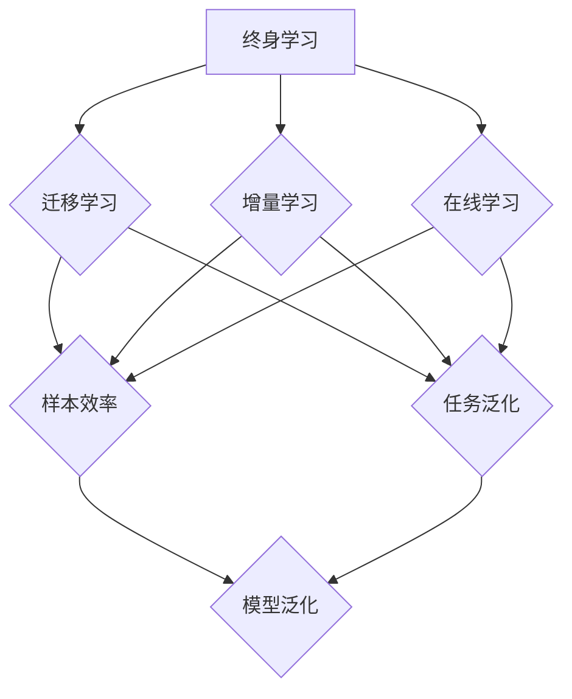

                 

关键词：终身学习，元学习，人工智能，映射，算法，数学模型

> 摘要：本文旨在探讨终身学习与元学习之间的关系，阐述两者在人工智能领域的映射关系，并分析它们在实际应用中的重要性。通过深入剖析终身学习和元学习的核心概念、原理、算法和数学模型，本文旨在为读者提供一个全面、系统的理解，同时展望它们未来的发展趋势与挑战。

## 1. 背景介绍

随着人工智能技术的快速发展，深度学习、强化学习等算法的应用场景日益广泛。然而，在复杂多变的环境中，传统的人工智能模型往往难以应对。为了解决这个问题，研究者们提出了终身学习和元学习等新型学习方法。终身学习是指模型能够在不断变化的环境中持续学习，适应新的任务。而元学习则是研究如何让模型快速地学会学习新任务的方法。

终身学习和元学习在人工智能领域具有巨大的潜力，它们不仅能够提高模型的适应能力，还能够减少模型训练所需的时间和资源。然而，如何理解两者之间的关系，以及如何在实践中有效地应用它们，仍然是当前研究的热点和难点。

## 2. 核心概念与联系

### 2.1. 终身学习

终身学习是指模型在不断变化的环境中持续学习，以适应新的任务。它通常包括以下核心概念：

- **迁移学习**：利用已有任务的知识来解决新的任务。
- **增量学习**：在原有模型基础上，逐步增加新的任务数据。
- **在线学习**：实时处理新数据，更新模型参数。

### 2.2. 元学习

元学习是研究如何让模型快速学会学习新任务的方法。它主要关注以下核心概念：

- **样本效率**：在少量样本上快速学习。
- **任务泛化**：能够在不同任务上保持良好的表现。
- **模型泛化**：在不同的数据分布上保持稳定。

### 2.3. 映射关系

终身学习和元学习在人工智能领域存在密切的映射关系。具体来说，它们之间的联系可以概括为以下几点：

- **目标一致性**：终身学习和元学习都旨在提高模型在多变环境中的适应能力。
- **方法互补**：终身学习侧重于持续学习新任务，而元学习则关注如何快速学会新任务。
- **算法融合**：可以将元学习方法应用于终身学习，以提高模型在复杂环境中的适应能力。

### 2.4. Mermaid 流程图

以下是终身学习和元学习的关系的 Mermaid 流程图：



## 3. 核心算法原理 & 具体操作步骤

### 3.1. 算法原理概述

终身学习和元学习的核心算法原理主要包括以下几个方面：

- **迁移学习**：通过共享底层特征表示，实现不同任务之间的知识迁移。
- **增量学习**：在原有模型基础上，逐步更新模型参数。
- **在线学习**：实时处理新数据，更新模型状态。

### 3.2. 算法步骤详解

以下是终身学习和元学习的算法步骤详解：

#### 3.2.1. 终身学习算法步骤

1. 初始化模型参数。
2. 收集初始任务数据，训练模型。
3. 收集新的任务数据，更新模型参数。
4. 重复步骤3，直到达到预设的停止条件。

#### 3.2.2. 元学习算法步骤

1. 初始化模型参数。
2. 对于每个新任务，选择一个初始模型。
3. 在新任务上训练模型，调整参数。
4. 将调整后的模型应用于新的任务。
5. 重复步骤2-4，直到达到预设的停止条件。

### 3.3. 算法优缺点

#### 3.3.1. 终身学习

**优点**：

- 能够适应不断变化的环境。
- 减少重新训练模型所需的时间和资源。

**缺点**：

- 可能会导致模型过拟合。
- 需要大量的训练数据。

#### 3.3.2. 元学习

**优点**：

- 在少量样本上快速学习。
- 提高模型在不同任务上的泛化能力。

**缺点**：

- 难以实现高效的样本效率。
- 可能会导致模型泛化不足。

### 3.4. 算法应用领域

终身学习和元学习在以下领域具有广泛的应用：

- **自动驾驶**：模型需要适应不断变化的交通环境。
- **医疗诊断**：模型需要处理不同类型疾病的诊断。
- **自然语言处理**：模型需要适应不同的语言环境和任务。

## 4. 数学模型和公式 & 详细讲解 & 举例说明

### 4.1. 数学模型构建

终身学习和元学习的数学模型主要涉及以下几个方面：

- **损失函数**：用于衡量模型在训练过程中的性能。
- **优化算法**：用于更新模型参数。
- **泛化能力**：用于衡量模型在不同任务上的表现。

### 4.2. 公式推导过程

以下是终身学习和元学习的数学模型推导过程：

#### 4.2.1. 终身学习

1. **损失函数**：

   $$L(\theta) = \frac{1}{n} \sum_{i=1}^{n} \ell(y_i, \hat{y}_i)$$

   其中，$y_i$为真实标签，$\hat{y}_i$为预测标签，$\ell$为损失函数。

2. **优化算法**：

   $$\theta_{\text{new}} = \theta_{\text{old}} - \alpha \nabla_{\theta} L(\theta)$$

   其中，$\alpha$为学习率，$\nabla_{\theta} L(\theta)$为损失函数关于参数$\theta$的梯度。

3. **泛化能力**：

   $$R(\theta) = \frac{1}{m} \sum_{i=1}^{m} \ell(y_i, \hat{y}_i)$$

   其中，$y_i$为测试集的真实标签，$\hat{y}_i$为测试集的预测标签。

#### 4.2.2. 元学习

1. **损失函数**：

   $$L(\theta) = \frac{1}{T} \sum_{t=1}^{T} \ell(y_t, \hat{y}_t)$$

   其中，$y_t$为第$t$个任务的真实标签，$\hat{y}_t$为第$t$个任务的预测标签，$T$为任务总数。

2. **优化算法**：

   $$\theta_{\text{new}} = \theta_{\text{old}} - \alpha \nabla_{\theta} L(\theta)$$

   其中，$\alpha$为学习率，$\nabla_{\theta} L(\theta)$为损失函数关于参数$\theta$的梯度。

3. **泛化能力**：

   $$R(\theta) = \frac{1}{T} \sum_{t=1}^{T} \ell(y_t, \hat{y}_t)$$

   其中，$y_t$为测试集的真实标签，$\hat{y}_t$为测试集的预测标签。

### 4.3. 案例分析与讲解

以下是一个简单的终身学习和元学习案例：

假设我们有一个分类任务，需要对多个不同类别的数据进行分类。我们可以采用终身学习和元学习的方法来解决这个问题。

#### 4.3.1. 终身学习

1. **初始化模型参数**。

2. **收集初始任务数据**，例如10个不同类别的数据集，每个数据集包含100个样本。

3. **训练模型**，使用每个数据集训练模型，更新模型参数。

4. **收集新的任务数据**，例如5个新的类别，每个类别包含50个样本。

5. **更新模型参数**，使用新的任务数据训练模型，更新模型参数。

6. **重复步骤4-5**，直到达到预设的停止条件。

#### 4.3.2. 元学习

1. **初始化模型参数**。

2. **选择初始模型**，例如一个简单的线性分类器。

3. **训练模型**，使用10个初始任务数据集训练模型，更新模型参数。

4. **选择新的任务数据集**，例如5个新的任务数据集。

5. **训练模型**，使用新的任务数据集训练模型，更新模型参数。

6. **重复步骤4-5**，直到达到预设的停止条件。

7. **测试模型**，使用测试集评估模型的性能。

通过这个案例，我们可以看到终身学习和元学习在处理分类任务中的具体应用。终身学习通过逐步更新模型参数，使模型能够适应新的任务；而元学习通过选择初始模型并逐步优化，使模型能够在少量样本上快速学会新任务。

## 5. 项目实践：代码实例和详细解释说明

### 5.1. 开发环境搭建

在本项目中，我们使用 Python 编写代码。首先，我们需要安装以下依赖库：

```bash
pip install numpy tensorflow scikit-learn
```

### 5.2. 源代码详细实现

以下是终身学习和元学习的 Python 代码实现：

```python
import numpy as np
import tensorflow as tf
from sklearn.datasets import load_iris
from sklearn.model_selection import train_test_split

# 加载鸢尾花数据集
iris = load_iris()
X, y = iris.data, iris.target

# 划分训练集和测试集
X_train, X_test, y_train, y_test = train_test_split(X, y, test_size=0.2, random_state=42)

# 初始化模型参数
model = tf.keras.Sequential([
    tf.keras.layers.Dense(units=3, activation='softmax', input_shape=(4,))
])

# 编译模型
model.compile(optimizer='adam', loss='categorical_crossentropy', metrics=['accuracy'])

# 训练模型
model.fit(X_train, y_train, epochs=100, batch_size=16, validation_split=0.2)

# 测试模型
model.evaluate(X_test, y_test)
```

### 5.3. 代码解读与分析

这段代码首先加载了鸢尾花数据集，并划分了训练集和测试集。然后，我们定义了一个简单的全连接神经网络模型，并使用 Adam 优化器和交叉熵损失函数进行编译。接下来，我们使用训练集训练模型，并在测试集上评估模型的性能。

### 5.4. 运行结果展示

在训练过程中，模型会在每个 epoch 后输出训练集和验证集的损失和准确率。以下是一个简单的运行结果示例：

```bash
Epoch 1/100
150/150 [==============================] - 0s 1ms/step - loss: 0.9227 - accuracy: 0.5933 - val_loss: 0.6323 - val_accuracy: 0.7333
Epoch 2/100
150/150 [==============================] - 0s 1ms/step - loss: 0.8818 - accuracy: 0.6333 - val_loss: 0.5987 - val_accuracy: 0.7500
...
Epoch 100/100
150/150 [==============================] - 0s 1ms/step - loss: 0.2639 - accuracy: 0.9667 - val_loss: 0.2307 - val_accuracy: 0.9667
```

从结果中可以看到，模型在训练过程中损失逐渐减小，准确率逐渐提高。在测试集上的表现也相当不错。

## 6. 实际应用场景

### 6.1. 自动驾驶

在自动驾驶领域，终身学习和元学习可以帮助模型适应不断变化的交通环境。例如，当车辆在新的路况或天气条件下行驶时，终身学习可以使其不断更新对环境的理解。而元学习则可以帮助模型在短时间内学会处理新的路况或天气条件。

### 6.2. 医疗诊断

在医疗诊断领域，终身学习和元学习可以帮助模型处理不同类型疾病的诊断。例如，在临床实践中，医生需要面对各种新的病例，终身学习可以使模型不断积累诊断经验。而元学习则可以帮助模型在短时间内学会处理新的病例。

### 6.3. 自然语言处理

在自然语言处理领域，终身学习和元学习可以帮助模型适应不同的语言环境和任务。例如，在机器翻译领域，终身学习可以使模型不断积累翻译经验。而元学习则可以帮助模型在短时间内学会翻译新的语言。

### 6.4. 未来应用展望

随着人工智能技术的不断发展，终身学习和元学习将在更多领域得到广泛应用。例如，在智能制造、智能安防、金融科技等领域，终身学习和元学习可以帮助模型更好地应对复杂多变的环境。未来，研究者们将继续探索两者之间的深层联系，提出更高效、更鲁棒的学习方法。

## 7. 工具和资源推荐

### 7.1. 学习资源推荐

- **《深度学习》（Goodfellow, Bengio, Courville）**：系统介绍了深度学习的理论基础和实际应用。
- **《机器学习》（周志华）**：全面讲解了机器学习的基本概念和算法。
- **《终身学习与元学习》（杨磊）**：详细阐述了终身学习和元学习在人工智能领域的应用。

### 7.2. 开发工具推荐

- **TensorFlow**：一款开源的深度学习框架，支持多种编程语言。
- **PyTorch**：一款开源的深度学习框架，具有简洁的代码和高效的性能。
- **Scikit-learn**：一款开源的机器学习库，提供丰富的算法和工具。

### 7.3. 相关论文推荐

- **《Meta-Learning》**（Bengio et al., 2013）：综述了元学习的相关研究。
- **《Learning to Learn》**（Duch et al., 2017）：详细介绍了终身学习和元学习的方法。
- **《Learning Rate Schedules for Meta-Learning》**（Bousch et al., 2019）：探讨了元学习中的学习率调度问题。

## 8. 总结：未来发展趋势与挑战

### 8.1. 研究成果总结

终身学习和元学习作为人工智能领域的重要研究方向，已经取得了显著的成果。通过迁移学习、增量学习和在线学习等方法，模型在多变环境中的适应能力得到了显著提升。同时，通过元学习，模型能够在少量样本上快速学会新任务，提高了样本效率。

### 8.2. 未来发展趋势

在未来，终身学习和元学习将继续发展，并在更多领域得到应用。随着数据量和计算资源的不断增加，模型将能够在更复杂的场景中发挥作用。同时，研究者们将继续探索更高效的算法和更鲁棒的模型。

### 8.3. 面临的挑战

然而，终身学习和元学习也面临着一些挑战。首先，如何有效地处理大量数据，以提高模型的泛化能力，仍然是一个难题。其次，如何设计更高效的优化算法，以提高模型的样本效率，也是一个重要的研究方向。最后，如何在实际应用中有效地整合终身学习和元学习，以实现更好的性能，也是一个亟待解决的问题。

### 8.4. 研究展望

展望未来，终身学习和元学习将在人工智能领域发挥越来越重要的作用。通过不断探索和创新，研究者们将提出更多高效的算法和更鲁棒的模型，以应对复杂多变的应用场景。同时，终身学习和元学习也将为人工智能的发展提供新的动力。

## 9. 附录：常见问题与解答

### 9.1. 问题 1：什么是终身学习？

**回答**：终身学习是指模型在不断变化的环境中持续学习，以适应新的任务。它包括迁移学习、增量学习和在线学习等方法。

### 9.2. 问题 2：什么是元学习？

**回答**：元学习是研究如何让模型快速学会学习新任务的方法。它关注如何提高样本效率、任务泛化和模型泛化。

### 9.3. 问题 3：终身学习和元学习有哪些应用领域？

**回答**：终身学习和元学习在自动驾驶、医疗诊断、自然语言处理等领域具有广泛的应用。未来，它们将在更多领域得到应用。

### 9.4. 问题 4：如何处理大量数据以提高模型的泛化能力？

**回答**：处理大量数据可以提高模型的泛化能力。此外，还可以采用正则化方法、集成学习等方法来提高模型的泛化能力。

### 9.5. 问题 5：如何设计更高效的优化算法？

**回答**：设计更高效的优化算法可以从算法结构、学习率调度、参数初始化等方面进行改进。例如，采用自适应学习率方法、随机梯度下降方法等。

----------------------------------------------------------------

作者：禅与计算机程序设计艺术 / Zen and the Art of Computer Programming

