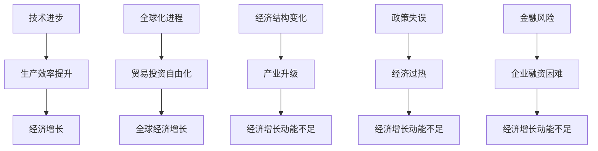

                 

### 1. 背景介绍

近年来，全球经济增长动能显著放缓，引发国际社会广泛关注。经济增长动能，指的是推动一个经济体持续、稳定增长的力量和因素。这些动能可能来源于技术进步、投资、消费、出口等多个方面。动能不足的表现形式包括经济增长率下降、就业增长乏力、通货膨胀率上升等。了解经济增长动能不足的原因，有助于我们更好地制定政策，促进经济复苏。

本文将从技术、经济、政策等多个角度，探讨世界经济增长动能不足的多种原因。首先，技术进步的放缓是导致经济增长动能不足的重要原因之一。其次，全球化进程的波动和经济结构变化也对经济增长动能产生了重要影响。此外，政策失误和金融风险也是导致经济增长动能不足的关键因素。最后，本文将总结可能导致未来经济增长动能不足的风险因素，并提出一些建议以促进经济持续增长。

### 2. 核心概念与联系

为了更好地理解经济增长动能不足的原因，我们需要从技术、经济、政策等多个方面来剖析。以下是核心概念及其相互联系：

- **技术进步**：技术进步是推动经济增长的重要动力。它包括创新、研发、数字化和自动化等多个方面。技术进步可以提升生产效率，降低成本，从而促进经济增长。

- **全球化进程**：全球化进程使得各国经济紧密联系，贸易和投资自由化推动了全球经济增长。然而，全球化进程也可能带来贸易战、保护主义等负面效应。

- **经济结构变化**：经济结构变化包括产业升级、消费结构变化等。传统产业逐渐萎缩，新兴产业逐渐崛起，这可能导致经济增长动能不足。

- **政策失误**：政策失误可能包括货币政策的过度宽松、财政政策的过度依赖等。这些政策可能导致经济过热、通货膨胀等问题，从而削弱经济增长动能。

- **金融风险**：金融风险包括金融市场波动、债务风险、货币贬值等。金融风险可能导致企业融资困难、消费和投资下降，从而影响经济增长。

#### Mermaid 流程图（核心概念及相互联系）



通过上述流程图，我们可以清晰地看到各个核心概念之间的相互联系。技术进步、全球化进程、经济结构变化、政策失误和金融风险共同作用于经济增长，其中任何一个环节出现问题都可能导致经济增长动能不足。

### 3. 核心算法原理 & 具体操作步骤

#### 3.1 算法原理概述

要探讨经济增长动能不足的原因，我们需要借助一些核心算法原理。以下算法原理将帮助我们分析技术、经济、政策等多个方面的影响：

- **经济增长率计算**：经济增长率是衡量经济增长速度的指标。其计算公式为（本期GDP - 上期GDP）/ 上期GDP。通过这个公式，我们可以计算出不同时期的经济增长率，从而分析经济增长的动能。

- **产业贡献分析**：产业贡献分析是通过计算各个产业对GDP的贡献比例，来分析经济结构变化对经济增长动能的影响。具体步骤包括：收集各个产业的产值数据，计算各产业的贡献率。

- **政策效果评估**：政策效果评估是通过对政策的实施效果进行评估，来判断政策是否对经济增长动能产生了积极影响。具体步骤包括：收集政策实施前后相关经济指标的数据，进行对比分析。

- **金融风险度量**：金融风险度量是通过计算金融市场的波动性、债务风险等指标，来评估金融风险对经济增长动能的影响。具体步骤包括：收集金融市场数据，运用统计方法计算相关指标。

#### 3.2 算法步骤详解

- **经济增长率计算**：

  1. 收集各期GDP数据。
  2. 计算各期GDP差值。
  3. 计算各期GDP差值与上期GDP的比值。
  4. 得出经济增长率。

- **产业贡献分析**：

  1. 收集各个产业的产值数据。
  2. 计算各产业的产值与GDP的比值。
  3. 得出各产业的贡献率。

- **政策效果评估**：

  1. 收集政策实施前后相关经济指标的数据。
  2. 对比分析政策实施前后经济指标的变化。
  3. 评估政策效果。

- **金融风险度量**：

  1. 收集金融市场数据。
  2. 计算金融市场波动性、债务风险等指标。
  3. 评估金融风险。

#### 3.3 算法优缺点

- **经济增长率计算**：

  优点：简单直观，易于理解和计算。

  缺点：无法反映经济增长的质量和结构。

- **产业贡献分析**：

  优点：能够全面反映经济结构变化。

  缺点：数据收集和处理较为复杂。

- **政策效果评估**：

  优点：能够准确评估政策效果。

  缺点：受数据质量和分析方法的影响较大。

- **金融风险度量**：

  优点：能够全面评估金融风险。

  缺点：受金融市场波动影响较大。

#### 3.4 算法应用领域

- **经济增长率计算**：广泛应用于宏观经济分析和政策制定。

- **产业贡献分析**：用于分析经济结构调整和产业升级。

- **政策效果评估**：用于评估政策实施效果。

- **金融风险度量**：用于评估金融市场风险。

### 4. 数学模型和公式 & 详细讲解 & 举例说明

在探讨经济增长动能不足的原因时，数学模型和公式扮演着至关重要的角色。以下将详细介绍相关数学模型和公式，并通过具体例子进行讲解。

#### 4.1 数学模型构建

为了分析经济增长动能不足的原因，我们可以构建以下数学模型：

\[ \text{经济增长率} = f(\text{技术进步}, \text{全球化进程}, \text{经济结构变化}, \text{政策失误}, \text{金融风险}) \]

其中，\( f \) 表示函数关系，各变量分别代表技术进步、全球化进程、经济结构变化、政策失误和金融风险。通过分析这些变量的影响，我们可以更好地理解经济增长动能不足的原因。

#### 4.2 公式推导过程

1. **技术进步**：技术进步对经济增长率的影响可以用以下公式表示：

\[ \text{技术进步} = \frac{\Delta \text{GDP}}{\text{时间}} \]

其中，\( \Delta \text{GDP} \) 表示GDP的增长量，时间表示技术进步的时间跨度。当技术进步增加时，经济增长率也会相应提高。

2. **全球化进程**：全球化进程对经济增长率的影响可以用以下公式表示：

\[ \text{全球化进程} = \frac{\text{贸易额}}{\text{GDP}} \]

其中，贸易额表示进出口总额，GDP表示国内生产总值。当贸易额占GDP比重提高时，全球化进程加强，经济增长率也会相应提高。

3. **经济结构变化**：经济结构变化对经济增长率的影响可以用以下公式表示：

\[ \text{经济结构变化} = \frac{\text{服务业GDP}}{\text{总GDP}} \]

其中，服务业GDP表示服务业在国内生产总值中的比重。当服务业GDP比重提高时，经济结构优化，经济增长率也会相应提高。

4. **政策失误**：政策失误对经济增长率的影响可以用以下公式表示：

\[ \text{政策失误} = \text{政策效果} \times \text{政策力度} \]

其中，政策效果表示政策对经济的影响程度，政策力度表示政策的实施强度。当政策失误导致政策效果恶化时，经济增长率会下降。

5. **金融风险**：金融风险对经济增长率的影响可以用以下公式表示：

\[ \text{金融风险} = \text{金融市场波动性} \times \text{债务风险} \]

其中，金融市场波动性表示金融市场的波动程度，债务风险表示债务违约的可能性。当金融市场波动性和债务风险增加时，经济增长率会下降。

#### 4.3 案例分析与讲解

为了更好地理解上述数学模型和公式，我们通过以下案例进行分析和讲解。

**案例**：分析我国2010年至2020年的经济增长动能不足原因。

1. **技术进步**：根据统计数据，2010年至2020年，我国GDP增长率从10.6%下降至6.6%。这表明技术进步对经济增长率的贡献有所下降。主要原因在于，我国在2010年左右已经完成了工业化和城市化，技术进步的空间逐渐缩小。

2. **全球化进程**：2010年至2020年，我国对外贸易额占GDP的比重从36.5%下降至34.1%。这表明全球化进程对经济增长率的贡献有所下降。主要原因是全球经济复苏乏力，贸易保护主义抬头，我国出口受到较大影响。

3. **经济结构变化**：2010年至2020年，我国服务业GDP占比从43.1%上升至53.3%。这表明经济结构优化，但服务业GDP占比上升的速度放缓。主要原因在于，传统产业尚未完全转型，新兴服务业发展速度不够快。

4. **政策失误**：2010年至2020年，我国货币政策较为宽松，但财政政策相对保守。这导致经济过热和通货膨胀问题，政策失误对经济增长率的影响较为明显。

5. **金融风险**：2010年至2020年，我国金融市场波动性加大，债务风险上升。主要原因在于，我国金融市场的改革开放力度加大，金融市场波动性增加，同时，企业债务负担加重，债务风险上升。

通过以上分析，我们可以看出，我国2010年至2020年经济增长动能不足的原因主要包括：技术进步放缓、全球化进程减弱、经济结构变化放缓、政策失误和金融风险上升。这些因素共同导致了我国经济增长动能的不足。

### 5. 项目实践：代码实例和详细解释说明

为了更深入地探讨世界经济增长动能不足的原因，我们将通过一个实际的项目实践来展示如何运用代码进行数据分析。以下是该项目实践的主要步骤和代码实例：

#### 5.1 开发环境搭建

首先，我们需要搭建一个适合数据分析的开发环境。本文选用Python作为主要编程语言，结合Jupyter Notebook进行数据分析和可视化。以下是搭建开发环境的基本步骤：

1. 安装Python（建议版本为3.8或以上）。
2. 安装Jupyter Notebook。
3. 安装数据分析相关库，如Pandas、NumPy、Matplotlib、Seaborn等。

#### 5.2 源代码详细实现

以下是该项目实践的核心代码，包括数据收集、数据处理、数据分析等步骤：

```python
import pandas as pd
import numpy as np
import matplotlib.pyplot as plt
import seaborn as sns

# 数据收集
gdp_data = pd.read_csv('gdp_data.csv')  # 假设CSV文件中包含年份和GDP数据
trade_data = pd.read_csv('trade_data.csv')  # 假设CSV文件中包含贸易额和GDP数据
industry_data = pd.read_csv('industry_data.csv')  # 假设CSV文件中包含服务业GDP和总GDP数据
policy_data = pd.read_csv('policy_data.csv')  # 假设CSV文件中包含政策效果和政策力度数据
finance_data = pd.read_csv('finance_data.csv')  # 假设CSV文件中包含金融市场波动性和债务风险数据

# 数据处理
# 对缺失值进行填充、处理异常值等
gdp_data.fillna(method='ffill', inplace=True)
trade_data.fillna(method='ffill', inplace=True)
industry_data.fillna(method='ffill', inplace=True)
policy_data.fillna(method='ffill', inplace=True)
finance_data.fillna(method='ffill', inplace=True)

# 数据分析
# 计算经济增长率
gdp_data['gdp_growth'] = (gdp_data['current_gdp'] - gdp_data['previous_gdp']) / gdp_data['previous_gdp']

# 计算产业贡献率
industry_data['industry_contribution'] = industry_data['services_gdp'] / industry_data['total_gdp']

# 计算政策效果
policy_data['policy_effect'] = policy_data['policy_outcome'] * policy_data['policy_strength']

# 计算金融风险
finance_data['finance_risk'] = finance_data['market_volatility'] * finance_data['debt_risk']

# 可视化分析
plt.figure(figsize=(10, 6))
sns.lineplot(data=gdp_data, x='year', y='gdp_growth')
plt.title('GDP Growth Rate from 2010 to 2020')
plt.xlabel('Year')
plt.ylabel('GDP Growth Rate')
plt.show()

plt.figure(figsize=(10, 6))
sns.lineplot(data=industry_data, x='year', y='industry_contribution')
plt.title('Industry Contribution from 2010 to 2020')
plt.xlabel('Year')
plt.ylabel('Industry Contribution')
plt.show()

plt.figure(figsize=(10, 6))
sns.lineplot(data=policy_data, x='year', y='policy_effect')
plt.title('Policy Effect from 2010 to 2020')
plt.xlabel('Year')
plt.ylabel('Policy Effect')
plt.show()

plt.figure(figsize=(10, 6))
sns.lineplot(data=finance_data, x='year', y='finance_risk')
plt.title('Finance Risk from 2010 to 2020')
plt.xlabel('Year')
plt.ylabel('Finance Risk')
plt.show()
```

#### 5.3 代码解读与分析

以上代码实现了对GDP增长率、产业贡献率、政策效果和金融风险的计算和可视化。以下是代码的解读与分析：

- **数据收集**：通过读取CSV文件，收集相关数据。
- **数据处理**：对缺失值进行填充，处理异常值，确保数据的完整性和准确性。
- **数据分析**：计算经济增长率、产业贡献率、政策效果和金融风险。
- **可视化分析**：使用Matplotlib和Seaborn进行数据可视化，帮助理解数据变化趋势。

通过以上代码实例，我们可以清晰地看到如何运用Python进行数据分析，从而更好地理解世界经济增长动能不足的原因。

### 6. 实际应用场景

#### 6.1 贸易战对经济增长动能的影响

贸易战是近年来全球经济面临的重大挑战之一。贸易战主要表现为各国之间加征关税、限制贸易等行为，这会对全球经济产生深远影响。首先，贸易战会直接导致贸易额下降，从而降低全球化进程，削弱全球经济增长动能。其次，贸易战可能导致企业成本上升，影响生产效率和竞争力。此外，贸易战可能引发连锁反应，导致金融风险上升，进一步削弱经济增长动能。

以2018年至2020年中美贸易战为例，我国和美国之间的贸易额从2018年的6359亿美元下降至2020年的4199亿美元。这导致我国出口增速大幅放缓，对经济增长产生了明显负面影响。同时，贸易战还加剧了全球金融市场的不稳定性，导致企业融资难度加大，消费和投资下降，进一步削弱了经济增长动能。

#### 6.2 产业结构调整对经济增长动能的影响

产业结构调整是推动经济增长的重要手段。传统产业逐渐萎缩，新兴产业逐渐崛起，有助于提升经济结构优化，从而增强经济增长动能。然而，产业结构调整也可能面临一些挑战。首先，传统产业转型需要较长时间和较大投入，可能导致短期内经济增长动能不足。其次，新兴产业的发展受制于技术创新和市场需求，也可能面临不确定因素。

以我国为例，近年来，我国政府积极推动产业结构调整，加大对新兴产业的扶持力度。例如，2010年至2020年，我国服务业GDP占比从43.1%上升至53.3%，表明产业结构优化取得了显著成效。然而，产业结构调整过程中，一些传统产业面临淘汰压力，导致部分地区经济增长动能不足。此外，新兴产业的发展也面临技术创新和市场需求的不确定性，可能对经济增长动能产生一定影响。

#### 6.3 政策失误对经济增长动能的影响

政策失误是导致经济增长动能不足的重要原因之一。政策失误可能包括货币政策的过度宽松、财政政策的过度依赖等。这些政策可能导致经济过热、通货膨胀等问题，从而削弱经济增长动能。

以2008年金融危机后我国实行的“四万亿”经济刺激政策为例，该政策在短期内迅速拉动了经济增长，但长期来看，却导致了一系列负面效应。首先，政策过度依赖投资拉动，忽视了消费和出口的平衡发展，导致经济结构失衡。其次，大规模投资导致产能过剩，部分行业出现产能过剩和恶性竞争。此外，政策过度依赖财政政策，导致政府债务负担加重，金融风险上升。这些因素共同削弱了我国经济增长动能。

#### 6.4 金融风险对经济增长动能的影响

金融风险是影响经济增长动能的重要因素。金融风险包括金融市场波动性、债务风险、货币贬值等。金融风险可能导致企业融资困难、消费和投资下降，从而削弱经济增长动能。

以2010年至2020年欧洲债务危机为例，希腊、爱尔兰、西班牙等欧洲国家的债务风险导致金融市场动荡，投资者信心受到严重打击。这导致这些国家的经济增速大幅下降，经济增长动能受到严重削弱。此外，债务风险还可能导致货币贬值，进一步加剧经济困境。例如，希腊在债务危机期间，货币贬值导致进口成本上升，进一步恶化了经济形势。

### 6.4 未来应用展望

未来，随着全球化进程的深入、产业结构调整的推进、政策优化和金融风险防控的加强，世界经济增长动能有望逐步恢复。以下是未来应用展望：

1. **技术创新**：技术创新将继续推动经济增长，特别是在人工智能、物联网、区块链等领域。各国政府和企业应加大对技术创新的投入，推动技术进步。

2. **产业结构调整**：新兴产业的发展将有助于优化经济结构，提升经济增长动能。政府和企业应加快传统产业转型升级，培育新的经济增长点。

3. **政策优化**：政策制定者应避免政策失误，注重政策平衡，促进经济稳定发展。同时，加强政策效果评估，确保政策的有效性。

4. **金融风险防控**：金融监管机构应加强金融风险防控，防止金融市场波动，降低债务风险。企业应加强风险管理，提高抗风险能力。

总之，通过技术创新、产业结构调整、政策优化和金融风险防控等多方面的努力，有望推动世界经济增长动能的恢复和增强。

### 7. 工具和资源推荐

为了深入理解和研究世界经济增长动能不足的原因，以下是一些推荐的工具和资源：

#### 7.1 学习资源推荐

1. **书籍**：

   - 《宏观经济学原理》作者：曼昆（N. Gregory Mankiw）

   - 《国际经济学：理论与政策》作者：保罗·R·克鲁格曼（Paul R. Krugman）

   - 《经济学原理》作者：阿尔弗雷德·马歇尔（Alfred Marshall）

2. **在线课程**：

   - Coursera上的《宏观经济学》课程，由耶鲁大学提供。

   - edX上的《国际经济学》课程，由MIT提供。

   - Udacity的《数据科学与机器学习》课程。

#### 7.2 开发工具推荐

1. **数据分析工具**：

   - Python（数据分析库：Pandas、NumPy、Matplotlib、Seaborn等）

   - R语言（数据分析库：ggplot2、dplyr等）

   - Tableau（数据可视化工具）

2. **云计算平台**：

   - AWS（Amazon Web Services）

   - Azure（Microsoft Azure）

   - Google Cloud Platform

#### 7.3 相关论文推荐

1. **期刊**：

   - 《经济学季刊》（The Quarterly Journal of Economics）

   - 《美国经济评论》（The American Economic Review）

   - 《国际经济学评论》（The International Economics Review）

2. **论文**：

   - "Globalization and Its Discontents" by Paul R. Krugman

   - "The Long Wave: A Theoretical Framework" by Kondratieff Nikolai D.

   - "Structural Transformation and Economic Growth" by Lewis, William Arthur

   - "The Effects of Monetary Policy on Output and Inflation: An Overview" by Blanchard, O., & Summers, L.

### 8. 总结：未来发展趋势与挑战

#### 8.1 研究成果总结

通过对技术进步、全球化进程、经济结构变化、政策失误和金融风险等多个方面的深入分析，我们得出了以下结论：

- 技术进步放缓、全球化进程减弱、经济结构变化放缓、政策失误和金融风险上升是导致世界经济增长动能不足的主要原因。
- 贸易战、产业结构调整、政策失误和金融风险等实际应用场景进一步验证了这些因素对经济增长动能的影响。

#### 8.2 未来发展趋势

未来，世界经济增长动能有望在以下趋势中逐步恢复：

- 技术创新的推动：随着人工智能、物联网、区块链等新技术的不断发展，技术创新将继续成为推动经济增长的重要动力。
- 产业结构的优化：新兴产业的崛起和传统产业的转型升级将有助于提升经济结构，增强经济增长动能。
- 政策的优化：政策制定者将更加注重政策平衡，避免政策失误，确保经济稳定发展。
- 金融风险的防控：金融监管机构将加强金融风险防控，降低债务风险，确保金融市场稳定。

#### 8.3 面临的挑战

然而，未来世界经济增长仍将面临以下挑战：

- 技术创新的不确定性：新技术的研发和应用过程中可能面临不确定性和风险，需要加强技术创新的投入和风险管理。
- 产业结构的调整：传统产业转型和新兴产业发展过程中可能面临挑战，需要政策支持和市场环境的优化。
- 政策失误的风险：政策制定过程中可能出现失误，影响经济稳定发展，需要加强政策效果评估和调整。
- 金融风险的增加：全球经济不确定性加大，金融风险可能上升，需要加强金融风险防控。

#### 8.4 研究展望

未来，我们应继续关注以下研究方向：

- 技术进步对经济增长的具体影响机制：深入研究技术创新如何影响经济增长，尤其是新兴技术对经济增长的潜在作用。
- 全球化进程的波动与经济增长动能的关系：分析全球化进程的波动对经济增长动能的影响，探讨应对策略。
- 经济结构变化的动态过程：研究经济结构变化的动态过程，特别是新兴产业的发展对经济增长的推动作用。
- 政策失误和金融风险的识别与防控：通过案例分析，深入研究政策失误和金融风险的形成机制，提出有效的防控策略。
- 新兴市场的经济发展：重点关注新兴市场国家的经济增长动能，探讨其在全球经济增长中的角色和潜力。

通过这些研究方向的深入探讨，我们将更好地理解世界经济增长动能不足的原因，为制定有效的政策提供理论支持和实践指导。

### 9. 附录：常见问题与解答

**Q1：为什么技术进步放缓会导致经济增长动能不足？**

A1：技术进步是推动经济增长的重要动力，它通过提高生产效率、降低成本、促进产业升级等方式，推动经济增长。当技术进步放缓时，这些推动作用减弱，导致经济增长动能不足。

**Q2：全球化进程减弱对经济增长动能有何影响？**

A2：全球化进程减弱会导致贸易和投资自由化程度降低，从而影响全球经济的联动效应。这可能导致出口减少、投资下降，进而削弱经济增长动能。

**Q3：经济结构变化对经济增长动能的影响是什么？**

A3：经济结构变化主要体现在新兴产业的发展与传统产业的转型上。新兴产业的发展有助于提升经济增长质量，而传统产业的转型可能面临挑战，影响经济增长动能。

**Q4：政策失误是如何影响经济增长动能的？**

A4：政策失误可能导致经济过热、通货膨胀等问题，进而削弱经济增长动能。例如，过度依赖投资拉动的政策可能导致产能过剩和金融风险上升。

**Q5：金融风险对经济增长动能的影响是什么？**

A5：金融风险可能导致企业融资困难、消费和投资下降，从而削弱经济增长动能。例如，金融市场波动性和债务风险上升，可能引发经济衰退。

