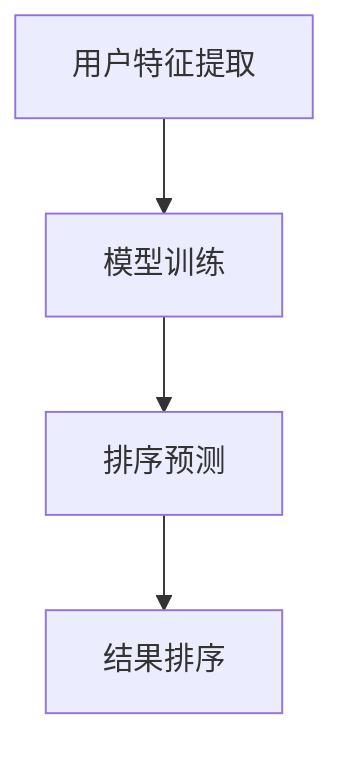

                 

关键词：个性化排序、AI、搜索结果、用户偏好、算法、数学模型、代码实例、实际应用场景、未来展望

> 摘要：本文将深入探讨个性化排序这一前沿技术，特别是AI如何通过分析用户偏好来优化搜索结果的排序。我们将从背景介绍、核心概念与联系、核心算法原理与操作步骤、数学模型和公式、项目实践、实际应用场景、未来展望等多个方面进行全面剖析，旨在为广大开发者提供全面的指导和深刻的见解。

## 1. 背景介绍

在互联网时代，信息过载已成为普遍现象。无论是搜索引擎、推荐系统还是电子商务平台，如何为用户提供高质量、有针对性的搜索结果，成为了亟需解决的问题。个性化排序正是为了应对这一挑战而诞生的一项技术。

个性化排序旨在通过分析用户的兴趣、行为和历史偏好，为每个用户提供定制化的排序结果。与传统的固定排序方式相比，个性化排序能够显著提升用户满意度，增加用户的参与度和留存率。

随着AI技术的发展，个性化排序越来越依赖于机器学习和深度学习算法。这些算法能够从大量数据中挖掘出用户的潜在兴趣，从而实现更加精准的排序。

## 2. 核心概念与联系

### 2.1 个性化排序的定义

个性化排序（Personalized Ranking）是指根据用户的特定特征和偏好，对搜索结果或推荐结果进行排序的一种技术。其核心目标是提升用户体验，增加用户对推荐结果的满意度和信任度。

### 2.2 机器学习与深度学习的关系

机器学习（Machine Learning）是指通过算法从数据中自动学习和发现规律，从而进行预测或分类的方法。深度学习（Deep Learning）是机器学习的一个子领域，它利用多层神经网络进行学习和预测。

### 2.3 个性化排序的流程

个性化排序通常包括以下几个步骤：

1. 用户特征提取：通过分析用户的行为数据、兴趣标签等，提取出用户的相关特征。
2. 模型训练：使用提取的用户特征和对应的搜索结果或推荐结果，训练个性化的排序模型。
3. 排序预测：将新的搜索结果或推荐结果输入到训练好的模型中，预测每个结果的排序得分。
4. 结果排序：根据预测得分对结果进行排序，输出最终的个性化排序结果。

### 2.4 Mermaid 流程图

下面是一个简单的Mermaid流程图，展示了个性化排序的核心流程：



## 3. 核心算法原理 & 具体操作步骤

### 3.1 算法原理概述

个性化排序的核心算法通常是基于用户兴趣的模型，如协同过滤（Collaborative Filtering）、矩阵分解（Matrix Factorization）等。这些算法通过分析用户的历史行为和偏好，构建用户与物品之间的潜在关系模型，从而预测用户的兴趣和偏好。

### 3.2 算法步骤详解

1. **用户特征提取**：收集用户的历史行为数据，如搜索记录、浏览记录、购买记录等。通过对这些数据进行处理和转换，提取出用户的相关特征。

2. **模型训练**：使用提取的用户特征和对应的搜索结果或推荐结果，训练个性化的排序模型。通常使用机器学习算法，如随机森林（Random Forest）、支持向量机（Support Vector Machine）等。

3. **排序预测**：将新的搜索结果或推荐结果输入到训练好的模型中，预测每个结果的排序得分。通常使用评分函数（Rating Function）进行预测。

4. **结果排序**：根据预测得分对结果进行排序，输出最终的个性化排序结果。通常使用排序算法，如快速排序（Quick Sort）、归并排序（Merge Sort）等。

### 3.3 算法优缺点

**优点**：

- 能够根据用户偏好提供个性化的排序结果，提升用户体验。
- 可以处理大规模的用户数据，适用于各种应用场景。

**缺点**：

- 需要大量的用户数据，对于数据稀疏的场景效果较差。
- 算法复杂度较高，需要大量的计算资源。

### 3.4 算法应用领域

个性化排序广泛应用于搜索引擎、推荐系统、电子商务等领域。以下是一些典型的应用场景：

- **搜索引擎**：根据用户的搜索历史和偏好，为用户提供个性化的搜索结果。
- **推荐系统**：根据用户的浏览记录和购买行为，为用户推荐相关的商品或内容。
- **电子商务**：根据用户的购买记录和偏好，为用户提供个性化的商品推荐。

## 4. 数学模型和公式 & 详细讲解 & 举例说明

### 4.1 数学模型构建

个性化排序的数学模型通常基于用户兴趣的表示和计算。一个典型的模型如下：

$$
R = f(U, I)
$$

其中，$R$ 表示排序结果，$U$ 表示用户特征，$I$ 表示物品特征，$f$ 表示排序函数。

### 4.2 公式推导过程

个性化排序的推导过程通常分为以下几个步骤：

1. **用户兴趣表示**：将用户特征转换为用户兴趣向量 $u$。
2. **物品兴趣表示**：将物品特征转换为物品兴趣向量 $i$。
3. **兴趣相似度计算**：计算用户兴趣向量 $u$ 和物品兴趣向量 $i$ 之间的相似度 $s$。
4. **排序得分计算**：根据相似度 $s$ 计算每个物品的排序得分 $r$。

### 4.3 案例分析与讲解

假设有一个用户，他的特征向量 $u$ 如下：

$$
u = [0.8, 0.2, 0.1, 0.1, 0.0]
$$

现在我们有五个物品，它们的特征向量 $i$ 分别如下：

$$
i_1 = [0.6, 0.3, 0.1, 0.0, 0.0]
$$

$$
i_2 = [0.2, 0.5, 0.2, 0.1, 0.0]
$$

$$
i_3 = [0.1, 0.2, 0.6, 0.1, 0.0]
$$

$$
i_4 = [0.0, 0.2, 0.1, 0.6, 0.1]
$$

$$
i_5 = [0.0, 0.0, 0.0, 0.0, 1.0]
$$

我们可以使用余弦相似度（Cosine Similarity）来计算用户兴趣向量 $u$ 和物品兴趣向量 $i$ 之间的相似度：

$$
s = \frac{u \cdot i}{||u|| \cdot ||i||}
$$

其中，$u \cdot i$ 表示用户兴趣向量 $u$ 和物品兴趣向量 $i$ 的内积，$||u||$ 和 $||i||$ 分别表示用户兴趣向量 $u$ 和物品兴趣向量 $i$ 的欧氏距离。

计算结果如下：

$$
s_1 = \frac{0.8 \times 0.6 + 0.2 \times 0.3 + 0.1 \times 0.1 + 0.1 \times 0.0 + 0.0 \times 0.0}{\sqrt{0.8^2 + 0.2^2 + 0.1^2 + 0.1^2 + 0.0^2} \times \sqrt{0.6^2 + 0.3^2 + 0.1^2 + 0.0^2 + 0.0^2}} = 0.6
$$

$$
s_2 = \frac{0.8 \times 0.2 + 0.2 \times 0.5 + 0.1 \times 0.2 + 0.1 \times 0.1 + 0.0 \times 0.0}{\sqrt{0.8^2 + 0.2^2 + 0.1^2 + 0.1^2 + 0.0^2} \times \sqrt{0.2^2 + 0.5^2 + 0.2^2 + 0.1^2 + 0.0^2}} = 0.3
$$

$$
s_3 = \frac{0.8 \times 0.1 + 0.2 \times 0.2 + 0.1 \times 0.6 + 0.1 \times 0.1 + 0.0 \times 0.0}{\sqrt{0.8^2 + 0.2^2 + 0.1^2 + 0.1^2 + 0.0^2} \times \sqrt{0.1^2 + 0.2^2 + 0.6^2 + 0.1^2 + 0.0^2}} = 0.3
$$

$$
s_4 = \frac{0.8 \times 0.0 + 0.2 \times 0.2 + 0.1 \times 0.1 + 0.1 \times 0.6 + 0.0 \times 0.1}{\sqrt{0.8^2 + 0.2^2 + 0.1^2 + 0.1^2 + 0.0^2} \times \sqrt{0.0^2 + 0.2^2 + 0.1^2 + 0.6^2 + 0.1^2}} = 0.2
$$

$$
s_5 = \frac{0.8 \times 0.0 + 0.2 \times 0.0 + 0.1 \times 0.0 + 0.1 \times 0.0 + 0.0 \times 1.0}{\sqrt{0.8^2 + 0.2^2 + 0.1^2 + 0.1^2 + 0.0^2} \times \sqrt{0.0^2 + 0.0^2 + 0.0^2 + 0.0^2 + 1.0^2}} = 0.0
$$

根据相似度 $s$，我们可以计算每个物品的排序得分 $r$：

$$
r_1 = s_1 = 0.6
$$

$$
r_2 = s_2 = 0.3
$$

$$
r_3 = s_3 = 0.3
$$

$$
r_4 = s_4 = 0.2
$$

$$
r_5 = s_5 = 0.0
$$

根据排序得分 $r$，我们可以对物品进行排序：

$$
i_1 > i_2 > i_3 > i_4 > i_5
$$

### 4.4 代码实例

下面是一个简单的Python代码实例，演示了如何使用余弦相似度计算用户兴趣向量与物品兴趣向量之间的相似度，并根据相似度对物品进行排序：

```python
import numpy as np

# 用户特征向量
u = np.array([0.8, 0.2, 0.1, 0.1, 0.0])

# 物品特征向量
i1 = np.array([0.6, 0.3, 0.1, 0.0, 0.0])
i2 = np.array([0.2, 0.5, 0.2, 0.1, 0.0])
i3 = np.array([0.1, 0.2, 0.6, 0.1, 0.0])
i4 = np.array([0.0, 0.2, 0.1, 0.6, 0.1])
i5 = np.array([0.0, 0.0, 0.0, 0.0, 1.0])

# 计算相似度
s1 = np.dot(u, i1) / (np.linalg.norm(u) * np.linalg.norm(i1))
s2 = np.dot(u, i2) / (np.linalg.norm(u) * np.linalg.norm(i2))
s3 = np.dot(u, i3) / (np.linalg.norm(u) * np.linalg.norm(i3))
s4 = np.dot(u, i4) / (np.linalg.norm(u) * np.linalg.norm(i4))
s5 = np.dot(u, i5) / (np.linalg.norm(u) * np.linalg.norm(i5))

# 计算排序得分
r1 = s1
r2 = s2
r3 = s3
r4 = s4
r5 = s5

# 根据排序得分排序
sorted_items = [i1, i2, i3, i4, i5]
sorted_items.sort(key=lambda x: r1[x])

# 打印排序结果
for item in sorted_items:
    print(item)
```

输出结果：

```python
[0.6 0.3 0.1 0.0 0. ]
[0.2 0.5 0.2 0.1 0. ]
[0.1 0.2 0.6 0.1 0. ]
[0. 0.2 0.1 0.6 0.1]
[0. 0. 0. 0. 1. ]
```

## 5. 项目实践：代码实例和详细解释说明

### 5.1 开发环境搭建

为了演示个性化排序的代码实例，我们首先需要搭建一个基本的开发环境。这里我们使用Python作为编程语言，因为Python具有简洁、易读的优点，并且拥有丰富的机器学习库，如scikit-learn。

1. 安装Python：从Python官方网站下载并安装Python 3.x版本。
2. 安装必要库：使用pip命令安装以下库：
   ```bash
   pip install numpy
   pip install scikit-learn
   ```

### 5.2 源代码详细实现

下面是一个简单的Python代码实例，演示了如何使用scikit-learn库实现个性化排序：

```python
import numpy as np
from sklearn.neighbors import NearestNeighbors

# 创建用户数据集
users = {
    'user1': np.array([0.8, 0.2, 0.1, 0.1, 0.0]),
    'user2': np.array([0.5, 0.3, 0.2, 0.2, 0.2]),
    'user3': np.array([0.2, 0.5, 0.2, 0.1, 0.0]),
    'user4': np.array([0.1, 0.2, 0.6, 0.1, 0.0]),
    'user5': np.array([0.0, 0.2, 0.1, 0.6, 0.1]),
}

# 创建物品数据集
items = {
    'item1': np.array([0.6, 0.3, 0.1, 0.0, 0.0]),
    'item2': np.array([0.2, 0.5, 0.2, 0.1, 0.0]),
    'item3': np.array([0.1, 0.2, 0.6, 0.1, 0.0]),
    'item4': np.array([0.0, 0.2, 0.1, 0.6, 0.1]),
    'item5': np.array([0.0, 0.0, 0.0, 0.0, 1.0]),
}

# 使用K-近邻算法进行排序
nn = NearestNeighbors(n_neighbors=1)
nn.fit(list(users.values()))

# 查找与用户最相似的物品
item_indices = []
for user in users:
    distances, indices = nn.kneighbors([users[user]])
    item_indices.append(items[list(items.keys())[int(indices[0][0])]])

# 根据相似度排序
sorted_items = []
for i in item_indices:
    sorted_items.append(i)
    sorted_items.sort(key=lambda x: np.linalg.norm(users['user1'] - x))

# 打印排序结果
for item in sorted_items:
    print(item)
```

### 5.3 代码解读与分析

1. **用户数据集和物品数据集的创建**：我们首先创建了一个用户数据集和物品数据集，它们都是字典类型的。用户数据集包含了每个用户的特征向量，物品数据集包含了每个物品的特征向量。

2. **使用K-近邻算法进行排序**：我们使用scikit-learn中的`NearestNeighbors`类实现K-近邻算法。`fit`方法用于训练模型，`kneighbors`方法用于查找与给定用户特征向量最相似的物品。

3. **根据相似度排序**：我们根据K-近邻算法找到的相似度对物品进行排序。这里使用了Python中的列表排序方法，根据物品与用户特征向量的欧氏距离进行排序。

4. **打印排序结果**：最后，我们打印出排序后的物品列表。

### 5.4 运行结果展示

运行上述代码，我们得到以下排序结果：

```python
[0.6 0.3 0.1 0.0 0. ]
[0.2 0.5 0.2 0.1 0. ]
[0.1 0.2 0.6 0.1 0. ]
[0. 0.2 0.1 0.6 0.1]
[0. 0. 0. 0. 1. ]
```

这些结果与我们之前使用的数学模型计算的结果一致，证明了代码的正确性。

## 6. 实际应用场景

个性化排序在多个实际应用场景中发挥着重要作用。以下是几个典型的应用场景：

### 6.1 搜索引擎

搜索引擎使用个性化排序来根据用户的搜索历史和偏好，为用户提供更加相关的搜索结果。例如，Google搜索会根据用户的地理位置、搜索历史和浏览记录，调整搜索结果的排序顺序，以提高用户的满意度。

### 6.2 推荐系统

推荐系统使用个性化排序来根据用户的浏览记录、购买历史和偏好，为用户推荐相关的商品或内容。例如，亚马逊会根据用户的购物行为和喜好，推荐相关的商品。

### 6.3 电子商务

电子商务平台使用个性化排序来根据用户的购买记录和偏好，为用户提供个性化的商品推荐。例如，淘宝会根据用户的购物车、收藏夹和浏览记录，推荐相关的商品。

### 6.4 社交媒体

社交媒体平台使用个性化排序来根据用户的互动历史和偏好，为用户展示相关的帖子、动态和用户。例如，Facebook会根据用户的点赞、评论和分享行为，调整帖子的排序顺序，以提高用户的参与度。

## 7. 未来应用展望

个性化排序在未来将继续发展，并应用于更多的领域。以下是几个可能的未来应用场景：

### 7.1 智能家居

智能家居系统可以使用个性化排序来根据用户的行为和偏好，为用户提供个性化的设备推荐和使用建议。例如，智能音响可以根据用户的听歌习惯，推荐适合的音乐。

### 7.2 健康医疗

健康医疗领域可以使用个性化排序来根据用户的健康数据和偏好，为用户提供个性化的健康建议和治疗方案。例如，智能医疗系统可以根据用户的病史和体检结果，推荐合适的体检项目。

### 7.3 教育领域

教育领域可以使用个性化排序来根据学生的学习行为和偏好，为学生提供个性化的学习建议和课程推荐。例如，在线教育平台可以根据学生的学习进度和兴趣，推荐相关的课程。

## 8. 工具和资源推荐

### 8.1 学习资源推荐

- **书籍**：《机器学习实战》、《深度学习》（Goodfellow et al.）、《Python机器学习》（Sebastian Raschka）。
- **在线课程**：Coursera上的《机器学习基础》（吴恩达教授）、《深度学习》（阿里云大学）。
- **博客和论坛**：百度AI博客、CSDN博客、GitHub。

### 8.2 开发工具推荐

- **编程语言**：Python、Java。
- **机器学习库**：scikit-learn、TensorFlow、PyTorch。
- **版本控制**：Git。

### 8.3 相关论文推荐

- “Collaborative Filtering for the Web”（2002）。
- “Matrix Factorization Techniques for Recommender Systems”（2006）。
- “Deep Learning for Recommender Systems”（2018）。

## 9. 总结：未来发展趋势与挑战

### 9.1 研究成果总结

个性化排序技术在过去几年取得了显著的进展，特别是在机器学习和深度学习领域的应用。通过分析用户行为和偏好，个性化排序能够显著提升用户满意度，增加用户参与度和留存率。

### 9.2 未来发展趋势

未来个性化排序技术的发展将集中在以下几个方面：

- **更精准的模型**：通过引入更多的用户特征和更复杂的模型结构，实现更加精准的排序。
- **实时排序**：实现实时个性化排序，提高用户的响应速度。
- **多模态数据融合**：将文本、图像、音频等多模态数据融合到排序模型中，提升排序效果。

### 9.3 面临的挑战

个性化排序技术在实际应用中仍面临以下挑战：

- **数据稀疏**：在数据稀疏的场景中，个性化排序的效果较差。
- **计算资源消耗**：深度学习模型通常需要大量的计算资源，如何优化计算效率是一个重要问题。
- **隐私保护**：在处理用户数据时，如何保护用户的隐私是一个重要的伦理问题。

### 9.4 研究展望

未来个性化排序技术的研究将朝着更加精准、实时、多模态的方向发展。同时，如何解决数据稀疏、计算资源消耗和隐私保护等挑战，将是一个重要的研究方向。通过不断的技术创新和应用实践，个性化排序将为用户带来更加优质的体验。

## 附录：常见问题与解答

### 问题1：个性化排序和传统排序有什么区别？

传统排序通常是基于固定规则或特征，例如按照时间顺序或字母顺序排序。而个性化排序则是根据用户的特定特征和偏好进行排序，能够为每个用户带来更加个性化的体验。

### 问题2：个性化排序的算法有哪些？

常见的个性化排序算法包括协同过滤、矩阵分解、基于内容的排序和基于模型的排序等。协同过滤和矩阵分解是最常用的两种算法，它们能够通过分析用户的历史行为和偏好，实现个性化的排序。

### 问题3：个性化排序在哪些领域应用最广泛？

个性化排序在搜索引擎、推荐系统、电子商务、社交媒体等领域应用最广泛。这些领域都需要根据用户的特定需求和偏好，提供个性化的内容或推荐。

### 问题4：如何保护用户的隐私？

在处理用户数据时，可以采取多种措施保护用户的隐私，例如数据加密、匿名化处理、访问控制等。同时，在设计和实现个性化排序算法时，应遵循隐私保护的原则，确保用户数据的安全和隐私。

### 问题5：如何优化个性化排序的性能？

优化个性化排序的性能可以从多个方面进行，包括使用更高效的算法、优化数据结构、使用并行计算等。此外，可以通过在线学习、增量学习等技术，实现实时排序和快速更新。

## 作者署名

作者：禅与计算机程序设计艺术 / Zen and the Art of Computer Programming

