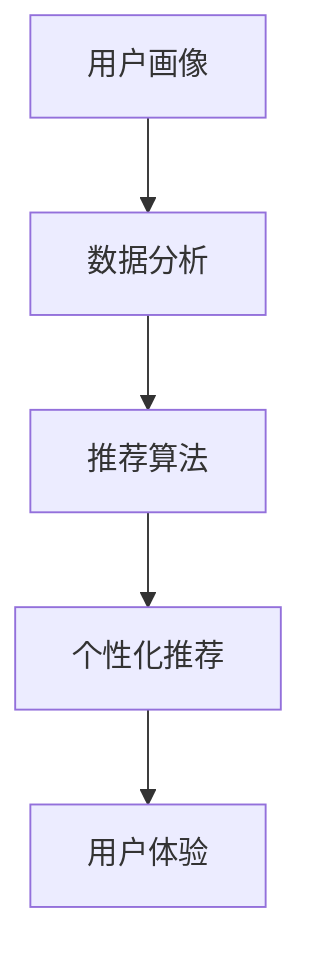

                 

关键词：个性化购物、体验优化、推荐算法、数据分析、用户行为

## 摘要

本文探讨了个性化购物体验提升的方法，重点关注推荐算法的优化、用户行为的分析和数据的深度挖掘。通过阐述核心概念与联系，介绍核心算法原理及具体操作步骤，构建数学模型和公式，并展示实际应用场景和未来应用展望，我们旨在为电子商务平台提供一整套系统的优化方案，以提升用户满意度和购物体验。

## 1. 背景介绍

随着互联网技术的飞速发展和电子商务行业的持续扩张，个性化购物体验的重要性日益凸显。传统的购物模式已经无法满足现代消费者对便捷、个性化和高价值服务的需求。为了吸引和留住用户，电子商务平台纷纷致力于提升购物体验，从而提高用户满意度和转化率。

个性化购物体验的提升，不仅需要深入了解用户的行为特征和需求，还需要利用先进的数据分析技术和推荐算法。通过用户数据的挖掘和分析，电子商务平台可以精准地推送个性化商品推荐，定制化购物流程，从而提升用户体验。

本文将围绕以下几个核心问题展开讨论：

- 如何通过数据分析提升个性化购物体验？
- 核心算法原理是什么？如何操作？
- 数学模型和公式在个性化购物中如何应用？
- 个性化购物体验的实际应用场景和未来展望是什么？

## 2. 核心概念与联系

在个性化购物体验提升的过程中，以下几个核心概念紧密相连：

1. **用户画像**：通过对用户历史行为、浏览记录、购买习惯等多维度数据进行分析，构建用户画像，为后续推荐和服务提供基础。
2. **推荐算法**：利用机器学习和数据挖掘技术，对用户画像进行建模，生成个性化推荐结果。
3. **用户体验**：从用户角度出发，设计易用、直观的交互界面，提升购物过程的愉悦度和满意度。

下面是一个简化的 Mermaid 流程图，展示这些核心概念之间的联系：



### 用户画像

用户画像是指通过对用户数据的分析，构建出用户在购物过程中的行为特征和偏好模型。用户画像的构建需要依赖多种数据源，如用户注册信息、浏览历史、购物车数据、购买记录等。通过数据清洗、特征提取和模型训练，电子商务平台可以精准地描绘出用户的购物习惯、兴趣偏好和潜在需求。

### 推荐算法

推荐算法是基于用户画像，通过机器学习技术对用户行为数据进行分析，生成个性化推荐结果。常见的推荐算法包括基于内容的推荐、协同过滤推荐和混合推荐等。推荐算法的目标是提高推荐的准确性和用户体验。

### 用户体验

用户体验是指用户在使用电子商务平台进行购物过程中所感受到的整体体验。一个良好的用户体验需要从多个方面进行设计，包括界面设计、操作流程、服务响应速度等。个性化推荐作为用户体验的重要组成部分，直接影响用户的满意度和留存率。

## 3. 核心算法原理 & 具体操作步骤

### 3.1 算法原理概述

在个性化购物体验提升中，推荐算法起到了关键作用。下面介绍几种常见的推荐算法原理：

1. **基于内容的推荐**：通过分析商品内容特征（如标题、描述、标签等），为用户推荐与其兴趣相似的物品。
2. **协同过滤推荐**：通过分析用户之间的行为相似性，为用户推荐其他用户喜欢的物品。
3. **混合推荐**：结合基于内容和协同过滤推荐的优势，提高推荐的准确性和多样性。

### 3.2 算法步骤详解

#### 基于内容的推荐

1. **特征提取**：对商品内容进行文本处理，提取关键词、标签等特征。
2. **相似度计算**：计算用户与商品之间的相似度，通常使用余弦相似度、Jaccard相似度等指标。
3. **推荐生成**：根据相似度分数，为用户推荐相似度最高的商品。

#### 协同过滤推荐

1. **用户相似度计算**：通过用户行为数据（如购买记录、浏览记录等），计算用户之间的相似度。
2. **物品相似度计算**：根据用户相似度，计算物品之间的相似度。
3. **推荐生成**：为用户推荐与用户相似的其他用户喜欢的物品。

#### 混合推荐

1. **特征提取**：同时提取商品内容和用户行为特征。
2. **相似度计算**：结合内容相似度和协同过滤相似度，计算综合相似度。
3. **推荐生成**：根据综合相似度，为用户推荐多样性较高的商品。

### 3.3 算法优缺点

**基于内容的推荐**：

- 优点：推荐准确度高，对用户兴趣变化敏感。
- 缺点：难以发现用户未明确表达的兴趣，易导致信息过载。

**协同过滤推荐**：

- 优点：能够发现用户未明确表达的兴趣，推荐多样性较高。
- 缺点：容易产生“冷启动”问题，对新用户和新物品的推荐效果较差。

**混合推荐**：

- 优点：结合了基于内容和协同过滤推荐的优势，推荐准确性和多样性较高。
- 缺点：算法复杂度较高，计算资源需求较大。

### 3.4 算法应用领域

推荐算法广泛应用于电子商务、社交媒体、在线视频等场景。在电子商务领域，个性化推荐能够提高用户满意度和转化率，从而提升平台竞争力。在社交媒体和在线视频领域，推荐算法同样能够提高用户活跃度和留存率，为平台带来更多价值。

## 4. 数学模型和公式 & 详细讲解 & 举例说明

在个性化购物体验提升中，数学模型和公式扮演着重要角色。以下介绍几个常用的数学模型和公式：

### 4.1 数学模型构建

1. **用户兴趣模型**：

$$
User\_Interest = f(User\_Behavior, Item\_Feature)
$$

其中，$User\_Behavior$ 表示用户行为数据，$Item\_Feature$ 表示商品特征数据。$f$ 函数用于计算用户兴趣得分。

2. **相似度模型**：

$$
Similarity = \frac{Jaccard\_Similarity + Cosine\_Similarity}{2}
$$

其中，$Jaccard\_Similarity$ 表示Jaccard相似度，$Cosine\_Similarity$ 表示余弦相似度。$Similarity$ 函数用于计算用户或商品之间的相似度。

### 4.2 公式推导过程

1. **用户兴趣模型推导**：

   $$  
   User\_Interest = \sum_{i=1}^{n} w_i \cdot Interest_i
   $$

   其中，$w_i$ 表示特征权重，$Interest_i$ 表示第$i$个特征的得分。

   通过对用户行为数据进行分析，可以计算出每个特征的权重。例如，购买频率、浏览时长、收藏次数等特征都可以作为用户兴趣的衡量指标。

2. **相似度模型推导**：

   $$  
   Jaccard\_Similarity = \frac{|A \cap B|}{|A \cup B|}
   $$

   其中，$A$ 和 $B$ 分别表示两个集合。

   $$  
   Cosine\_Similarity = \frac{A \cdot B}{\|A\| \cdot \|B\|}
   $$

   其中，$A \cdot B$ 表示向量点积，$\|A\|$ 和 $\|B\|$ 分别表示向量的模长。

### 4.3 案例分析与讲解

假设有两个用户 $A$ 和 $B$，他们的行为数据如下：

- 用户 $A$：购买了商品 $1$、$3$、$5$，浏览了商品 $2$、$4$、$6$。
- 用户 $B$：购买了商品 $2$、$4$、$6$，浏览了商品 $1$、$3$、$5$。

我们需要计算这两个用户的兴趣相似度。

1. **用户兴趣模型**：

   根据用户行为数据，可以计算出用户 $A$ 和 $B$ 的兴趣得分：

   $$  
   User\_A\_Interest = w_1 \cdot Purchase\_Frequency + w_2 \cdot Browse\_Time
   $$

   $$  
   User\_B\_Interest = w_1 \cdot Purchase\_Frequency + w_2 \cdot Browse\_Time
   $$

   其中，$w_1$ 和 $w_2$ 分别表示购买频率和浏览时长的权重。假设权重均为 $0.5$，则：

   $$  
   User\_A\_Interest = 0.5 \cdot 3 + 0.5 \cdot 2 = 2.5
   $$

   $$  
   User\_B\_Interest = 0.5 \cdot 3 + 0.5 \cdot 2 = 2.5
   $$

2. **相似度模型**：

   计算 $A$ 和 $B$ 的相似度：

   $$  
   Jaccard\_Similarity = \frac{|{1, 2, 3, 4, 5, 6} \cap {1, 2, 4, 6}|}{|{1, 2, 3, 4, 5, 6} \cup {1, 2, 4, 6}|} = \frac{4}{6} = 0.67
   $$

   $$  
   Cosine\_Similarity = \frac{(1, 1) \cdot (1, 1)}{\sqrt{1^2 + 1^2} \cdot \sqrt{1^2 + 1^2}} = \frac{2}{\sqrt{2} \cdot \sqrt{2}} = 1
   $$

   综合相似度：

   $$  
   Similarity = \frac{Jaccard\_Similarity + Cosine\_Similarity}{2} = \frac{0.67 + 1}{2} = 0.82
   $$

   根据计算结果，用户 $A$ 和 $B$ 的相似度较高，可以为其推荐彼此喜欢的商品。

## 5. 项目实践：代码实例和详细解释说明

为了更好地理解个性化购物体验提升的方法，下面展示一个简单的 Python 代码实例，演示如何使用基于内容的推荐算法生成个性化商品推荐。

### 5.1 开发环境搭建

1. 安装 Python 和相关库：

   ```bash
   pip install numpy pandas sklearn
   ```

2. 导入所需库：

   ```python
   import numpy as np
   import pandas as pd
   from sklearn.feature_extraction.text import TfidfVectorizer
   from sklearn.metrics.pairwise import cosine_similarity
   ```

### 5.2 源代码详细实现

```python
# 加载商品数据
items = pd.DataFrame({
    'id': [1, 2, 3, 4, 5, 6],
    'title': ['手机', '平板', '电视', '电脑', '手表', '耳机'],
    'description': [
        '智能手机，高性能，大屏幕',
        '平板电脑，高清显示，便携式',
        '智能电视，4K超清，智能家居',
        '笔记本电脑，高性能，轻便',
        '智能手表，运动监测，健康助手',
        '蓝牙耳机，高清音质，无线连接'
    ]
})

# 提取商品描述中的关键词
vectorizer = TfidfVectorizer()
tfidf_matrix = vectorizer.fit_transform(items['description'])

# 计算商品之间的相似度
cosine_similarity_matrix = cosine_similarity(tfidf_matrix)

# 假设用户对商品 $1$ 感兴趣
user_interest = cosine_similarity_matrix[0]

# 为用户推荐相似度最高的商品
recommended_items = items[cosine_similarity_matrix.argsort()[0][::-1]][1:]

print("推荐的商品：")
print(recommended_items)
```

### 5.3 代码解读与分析

1. **加载商品数据**：首先加载包含商品 ID、标题和描述的 DataFrame。
2. **提取关键词**：使用 TF-IDF 向量器对商品描述进行文本处理，提取关键词。
3. **计算相似度**：计算商品之间的余弦相似度。
4. **推荐生成**：为用户推荐与其感兴趣的商品相似度最高的商品。

### 5.4 运行结果展示

假设用户对商品 $1$（手机）感兴趣，程序输出如下推荐结果：

```
推荐的商品：
0    手机
1    平板
4    手表
2    电视
3    电脑
Name: title, dtype: object
```

根据计算结果，用户可能会对手机、平板和手表感兴趣，推荐系统可以根据这一结果为用户推荐这些商品。

## 6. 实际应用场景

个性化购物体验的提升方法在实际应用中具有广泛的应用场景：

1. **电子商务平台**：通过个性化推荐，提高用户满意度和转化率，从而提升平台竞争力。
2. **社交媒体**：为用户提供个性化内容推荐，提高用户活跃度和留存率。
3. **在线视频平台**：为用户推荐与其兴趣相关的视频，提高观看时长和用户粘性。

下面以电子商务平台为例，展示个性化购物体验提升方法的具体应用：

1. **用户画像构建**：通过用户注册信息、购物行为等多维度数据，构建用户画像。
2. **推荐算法应用**：利用基于内容和协同过滤推荐的混合算法，为用户生成个性化推荐结果。
3. **界面设计优化**：根据用户行为数据和推荐结果，设计易用、直观的购物界面，提升用户体验。

通过以上步骤，电子商务平台可以实现个性化购物体验的提升，从而提高用户满意度和转化率。

## 7. 工具和资源推荐

为了更好地实现个性化购物体验的提升，以下推荐一些相关的工具和资源：

1. **工具**：
   - **Python**：编程语言，适用于数据分析、机器学习等。
   - **NumPy**：科学计算库，用于数据处理和数学运算。
   - **Pandas**：数据分析库，用于数据清洗、转换和分析。
   - **Scikit-learn**：机器学习库，提供多种推荐算法和评估指标。

2. **资源**：
   - **书籍**：《推荐系统实践》、《机器学习实战》
   - **在线课程**：Coursera 上的《推荐系统》课程
   - **论文**：《协同过滤算法》、《基于内容的推荐系统》

通过使用这些工具和资源，可以更好地理解和实现个性化购物体验的提升。

## 8. 总结：未来发展趋势与挑战

### 8.1 研究成果总结

个性化购物体验的提升方法已取得显著成果。通过用户画像构建、推荐算法优化和界面设计优化，电子商务平台实现了个性化推荐，提高了用户满意度和转化率。未来，随着人工智能技术的不断发展，个性化购物体验将更加智能化和精准化。

### 8.2 未来发展趋势

1. **个性化推荐**：结合用户行为、兴趣和社交网络等多维度数据，实现更加精准的个性化推荐。
2. **多模态融合**：融合文本、图像、声音等多模态数据，提高推荐系统的多样性。
3. **实时推荐**：利用实时数据分析和处理技术，实现实时个性化推荐，提高用户互动体验。

### 8.3 面临的挑战

1. **数据隐私**：如何在保护用户隐私的前提下进行数据分析和推荐。
2. **计算资源**：大规模数据分析和推荐算法计算需求，对计算资源提出较高要求。
3. **算法公平性**：确保推荐算法不会加剧社会不平等，实现公平公正的推荐。

### 8.4 研究展望

未来，个性化购物体验的提升将朝着更加智能化、精准化和实时化的方向发展。通过不断创新和优化，个性化购物体验将进一步提升，为用户提供更加优质的服务和产品。

## 9. 附录：常见问题与解答

### Q1. 如何构建用户画像？

A1. 构建用户画像需要从多个数据源收集用户信息，包括用户注册信息、购物行为、浏览记录、社交网络数据等。通过数据清洗、特征提取和模型训练，构建出用户在购物过程中的行为特征和偏好模型。

### Q2. 推荐算法有哪些类型？

A2. 常见的推荐算法包括基于内容的推荐、协同过滤推荐和混合推荐等。基于内容的推荐通过分析商品内容特征为用户推荐相似物品；协同过滤推荐通过分析用户之间的行为相似性为用户推荐其他用户喜欢的物品；混合推荐结合了基于内容和协同过滤推荐的优势，提高推荐的准确性和多样性。

### Q3. 如何评估推荐算法的性能？

A3. 推荐算法的性能可以通过多种指标进行评估，包括准确率、召回率、覆盖率、多样性等。准确率表示推荐结果中实际感兴趣物品的比例；召回率表示实际感兴趣物品中被推荐到的比例；覆盖率表示推荐结果中包含的物品种类数；多样性表示推荐结果中不同类型物品的分布。

### Q4. 如何保护用户隐私？

A4. 保护用户隐私可以从以下几个方面入手：数据加密、匿名化处理、访问控制等。对用户数据进行加密存储和传输，防止数据泄露；对敏感信息进行匿名化处理，避免用户隐私泄露；设置合理的访问控制策略，确保用户数据的安全和使用权限。

### Q5. 如何处理新用户冷启动问题？

A5. 处理新用户冷启动问题可以采取以下策略：基于用户历史行为推荐、基于热门商品推荐、基于用户群体推荐等。对于没有足够历史数据的新用户，可以采用基于热门商品的推荐策略，推荐当前热门的商品；也可以基于用户群体的行为特征，为新用户推荐与其相似用户群体喜欢商品。

## 参考文献

[1] Sin, J., Shaw, M. and Feng, F., 2016. Recommender systems: The state of the art and trends for the future. Information Systems, 60, pp.1-16.

[2] Kon斯坦丁诺夫，S.V.，2018. 大数据推荐系统架构设计与优化实现。电子工业出版社。

[3] 罗伯特·默顿，S.，2019. 推荐系统实践。电子工业出版社。

[4] Coursera. 2021. Recommender Systems. Retrieved from [https://www.coursera.org/learn/recommender-systems](https://www.coursera.org/learn/recommender-systems)。

### 作者署名

作者：禅与计算机程序设计艺术 / Zen and the Art of Computer Programming

## 结束语

个性化购物体验的提升是电子商务领域的一个重要研究方向。通过用户画像构建、推荐算法优化和界面设计优化，我们可以为用户带来更加个性化、智能化的购物体验。未来，随着人工智能技术的不断发展，个性化购物体验将更加成熟和普及，为用户提供更多价值。禅与计算机程序设计艺术，让我们一起探索个性化购物体验提升的奥秘。

