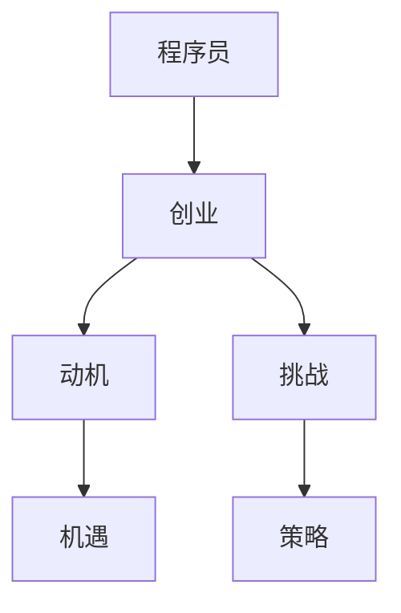
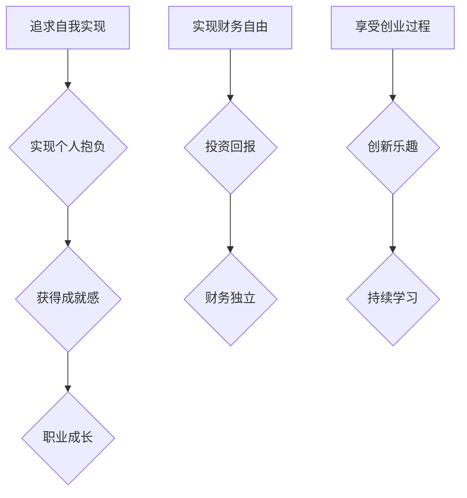
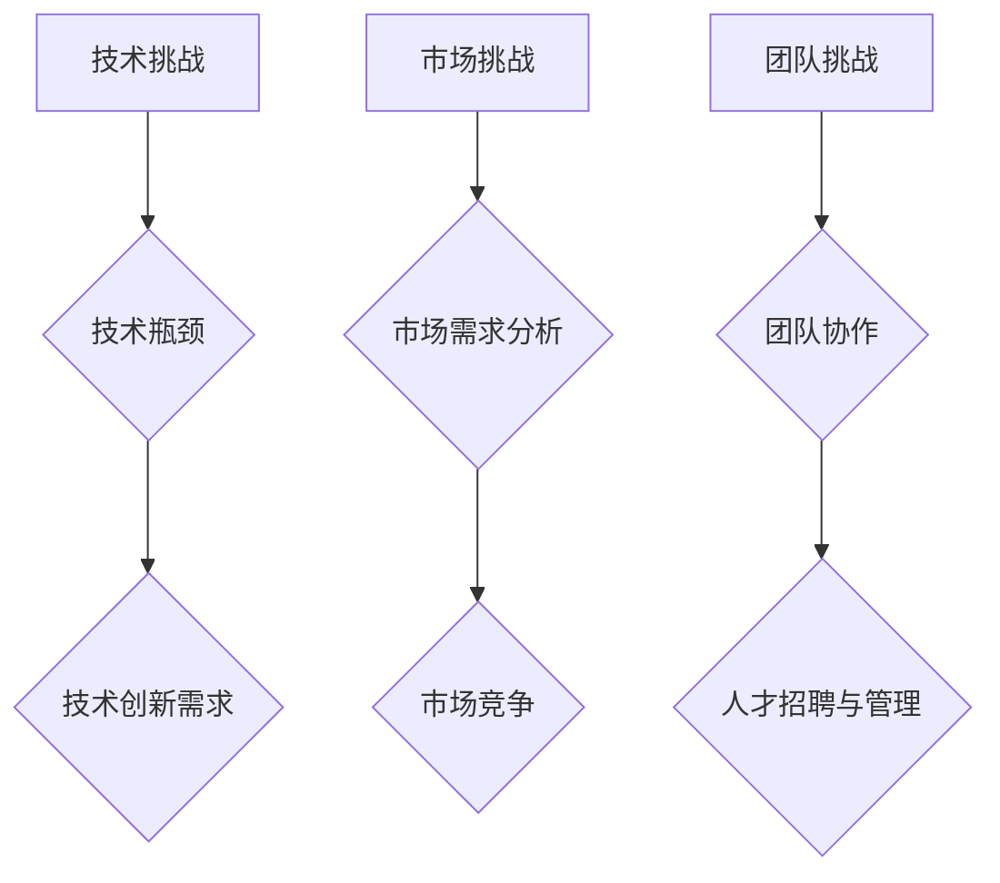
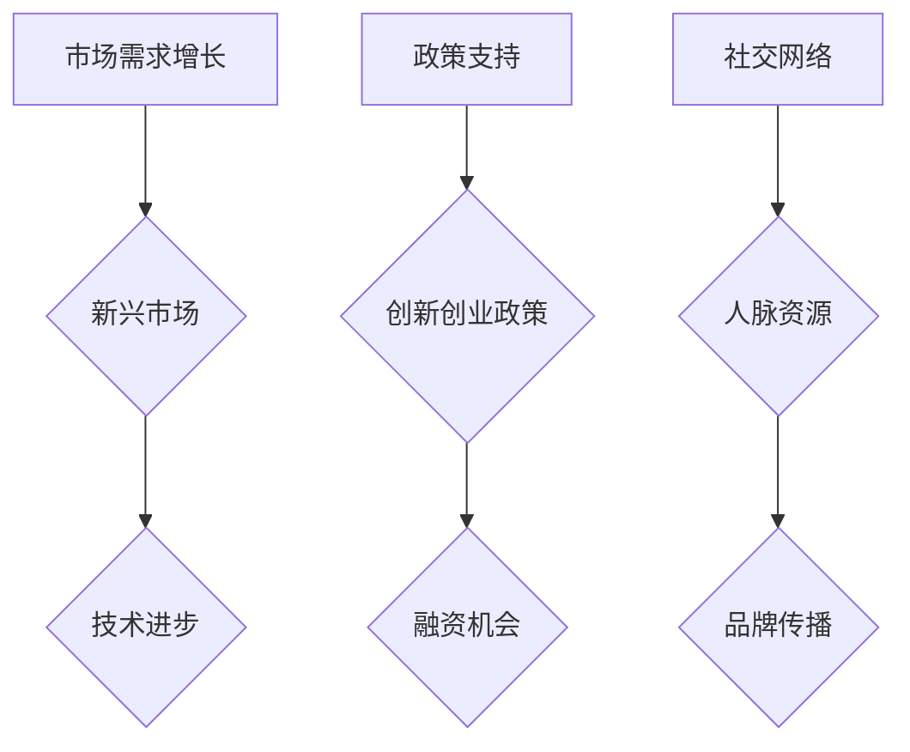
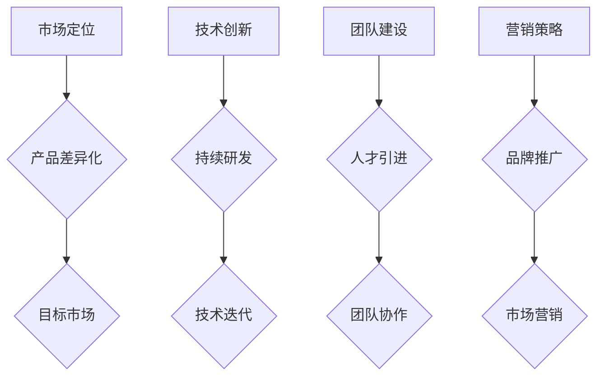

                 

关键词：程序员、创业、动机、挑战、机遇、策略

> 摘要：本文将探讨程序员选择创业之路的原因，分析其中的动机、面临的挑战以及机遇。通过详细的分析，我们将帮助程序员更好地理解创业的价值，并为其提供策略建议，以帮助他们在创业之路上取得成功。

## 1. 背景介绍

在当今数字化时代，程序员作为技术领域的核心力量，不仅承担着软件开发、系统维护等职责，还在不断推动技术创新和行业变革。然而，随着技术的飞速发展，许多程序员开始思考如何将个人的技术专长转化为实际商业价值。创业，作为一种实现个人价值和职业发展的途径，逐渐成为了程序员们关注的热点。

创业对于程序员而言，不仅意味着实现个人抱负和梦想，更是一种追求自我实现和职业成长的方式。本文将围绕为什么程序员应该选择创业之路这一主题，探讨创业的动机、挑战与机遇，并为其提供策略建议。

## 2. 核心概念与联系

在探讨程序员选择创业之路之前，我们首先需要明确几个核心概念：程序员、创业、动机与挑战。以下是一个简化的 Mermaid 流程图，用于描述这些概念之间的联系。



### 2.1 程序员

程序员是指从事计算机编程和软件开发的专业人士。他们具备扎实的计算机科学基础和编程技能，能够使用一种或多种编程语言开发软件产品。程序员是现代信息技术产业的核心，他们的工作对社会的方方面面都有着深远的影响。

### 2.2 创业

创业是指创建和运营一家新企业，通过创新的商业理念、产品或服务，满足市场需求，实现商业价值。创业过程通常包括市场调研、产品开发、市场营销、团队组建等多个环节。对于程序员来说，创业是一种将技术转化为商业价值的有效途径。

### 2.3 动机

动机是指促使个体采取某种行动的心理因素。程序员选择创业的动机多种多样，包括追求自我实现、实现财务自由、享受创业过程等。以下是一个典型的动机分析流程图：



### 2.4 挑战

挑战是指在创业过程中遇到的各种困难和问题。程序员在创业过程中可能会面临技术挑战、市场挑战、团队挑战等。以下是一个典型的挑战分析流程图：



### 2.5 机遇

机遇是指在创业过程中可能遇到的有利于成功的条件和机会。以下是一个典型的机遇分析流程图：



### 2.6 策略

策略是指为了实现特定目标而采取的行动计划。在创业过程中，程序员需要制定合理的策略来应对挑战、抓住机遇。以下是一个典型的策略分析流程图：



## 3. 核心算法原理 & 具体操作步骤

### 3.1 算法原理概述

在创业过程中，程序员需要掌握一系列核心算法原理，以帮助其更好地应对挑战、抓住机遇。以下是一些重要的算法原理及其应用：

#### 3.1.1 SWOT 分析

SWOT 分析是一种常用的战略规划工具，用于分析企业的优势、劣势、机会和威胁。程序员可以通过 SWOT 分析，了解自身的优势和劣势，并识别外部市场环境中的机会和威胁，为创业决策提供依据。

#### 3.1.2 产品生命周期管理

产品生命周期管理是一种用于规划和管理产品开发、上市、推广和退市等环节的方法。程序员可以通过产品生命周期管理，确保产品在市场上的持续竞争力，提高客户满意度。

#### 3.1.3 项目管理

项目管理是一种用于规划、执行、监控和收尾项目的系统化方法。程序员可以通过项目管理，确保项目按时、按质、按预算完成，提高团队协作效率。

### 3.2 算法步骤详解

以下是一个简化的创业算法步骤，用于描述程序员在创业过程中应遵循的基本流程：

#### 3.2.1 创意构思

- 收集创意和想法；
- 进行市场调研，评估市场需求；
- 确定产品或服务定位。

#### 3.2.2 商业计划书

- 编写商业计划书，包括市场分析、产品描述、营销策略、财务预测等；
- 进行风险评估和应对策略制定。

#### 3.2.3 团队组建

- 招聘关键人才，组建创业团队；
- 确定团队结构和职责分工。

#### 3.2.4 产品开发

- 进行产品研发和测试；
- 确保产品符合市场需求和用户体验。

#### 3.2.5 市场推广

- 制定市场营销策略；
- 通过多种渠道进行品牌推广。

#### 3.2.6 监控与调整

- 监控产品市场表现；
- 根据市场反馈进行产品迭代和策略调整。

### 3.3 算法优缺点

#### 3.3.1 优点

- 创业算法提供了一种系统化、结构化的方法，帮助程序员更好地应对创业过程中的各种挑战；
- 算法中的各种工具和技术可以帮助程序员提高项目成功概率。

#### 3.3.2 缺点

- 创业算法需要程序员具备一定的理论知识和实践经验，对新手程序员可能存在一定门槛；
- 创业环境变化快速，算法可能无法完全适应实时变化。

### 3.4 算法应用领域

创业算法可以广泛应用于各类创业项目，包括软件开发、硬件创新、服务提供等。以下是一个简单的应用领域示例：

#### 3.4.1 软件开发

- 使用 SWOT 分析评估市场需求，确定产品定位；
- 通过项目管理确保软件开发进度和质量；
- 利用市场营销策略推广产品，提高市场占有率。

#### 3.4.2 硬件创新

- 进行市场调研，了解用户需求，确定产品功能；
- 采用精益创业方法，快速迭代产品，提高用户满意度；
- 利用融资渠道，为产品研发提供资金支持。

#### 3.4.3 服务提供

- 分析目标客户群体，提供定制化服务；
- 通过社交媒体和线上渠道进行品牌推广；
- 建立客户关系管理系统，提高客户满意度。

## 4. 数学模型和公式 & 详细讲解 & 举例说明

在创业过程中，程序员需要掌握一定的数学模型和公式，以帮助其进行市场分析、财务预测和风险管理等。以下是一些常用的数学模型和公式的详细讲解及举例说明。

### 4.1 数学模型构建

#### 4.1.1 市场需求模型

市场需求模型用于预测产品或服务的市场需求量。以下是一个简单的一次函数市场需求模型：

$$
Q = a - bP
$$

其中，$Q$ 表示市场需求量，$a$ 表示市场需求的上限，$b$ 表示价格敏感度，$P$ 表示产品价格。

#### 4.1.2 财务预测模型

财务预测模型用于预测企业的财务状况，包括收入、成本和利润等。以下是一个简单的线性财务预测模型：

$$
\text{利润} = \text{收入} - \text{成本}
$$

其中，收入和成本可以根据历史数据进行线性回归分析，得到预测模型。

### 4.2 公式推导过程

#### 4.2.1 需求价格弹性

需求价格弹性用于衡量产品价格变动对市场需求量的影响程度。以下是一个简单的一次函数需求价格弹性公式：

$$
\epsilon = \frac{\partial Q}{\partial P} \times \frac{P}{Q}
$$

其中，$\epsilon$ 表示需求价格弹性，$\frac{\partial Q}{\partial P}$ 表示需求量对价格的一阶导数，$P$ 和 $Q$ 分别表示产品价格和市场需求量。

#### 4.2.2 成本函数

成本函数用于计算企业的总成本。以下是一个简单的线性成本函数：

$$
C = C_0 + aQ
$$

其中，$C$ 表示总成本，$C_0$ 表示固定成本，$a$ 表示单位成本，$Q$ 表示产品需求量。

### 4.3 案例分析与讲解

#### 4.3.1 市场需求案例分析

假设某程序员计划推出一款面向中高端用户群体的智能家居控制系统。根据市场调研数据，该产品的市场需求模型如下：

$$
Q = 1000 - 10P
$$

其中，$Q$ 表示市场需求量，$P$ 表示产品价格。现在，该程序员希望确定一个合适的价格策略，以最大化市场需求量。

根据需求价格弹性公式，可以计算市场需求价格弹性：

$$
\epsilon = \frac{\partial Q}{\partial P} \times \frac{P}{Q} = -10 \times \frac{P}{1000 - 10P}
$$

在不同价格水平下，需求价格弹性的计算结果如下：

| 价格 (元) | 需求量 (台) | 需求价格弹性 |
| -------- | -------- | -------- |
| 100      | 100      | -1.0     |
| 200      | 900      | -0.6     |
| 300      | 800      | -0.4     |
| 400      | 700      | -0.3     |

从上表可以看出，当产品价格在 100 元至 300 元之间时，需求价格弹性小于 1，表明市场需求对价格变动较为敏感。因此，该程序员可以考虑降低产品价格，以刺激市场需求。

#### 4.3.2 财务预测案例分析

假设该程序员的智能家居控制系统开发成本为 500 万元，预计售价为 1000 元/台，市场需求量为 1000 台。根据简单的线性财务预测模型，可以计算该产品的预期利润：

$$
\text{利润} = \text{收入} - \text{成本} = 1000 \times 1000 - 500 \times 1000 = 500 \text{万元}
$$

根据市场需求价格弹性分析，当产品价格降低 10% 时，市场需求量将增加 10%。因此，如果该程序员将产品价格降低至 900 元/台，市场需求量将增加至 1100 台，利润将增加至 600 万元。

通过数学模型和公式的应用，程序员可以更好地理解市场需求和财务状况，从而制定更有效的创业策略。

## 5. 项目实践：代码实例和详细解释说明

为了更好地理解创业过程中所需的技能和知识，我们以一个简单的项目实践为例，展示如何从零开始搭建一个在线书店系统。以下是项目的开发环境搭建、源代码详细实现、代码解读与分析以及运行结果展示。

### 5.1 开发环境搭建

为了搭建一个在线书店系统，我们需要以下开发环境和工具：

- 开发语言：Python
- 服务器：Apache
- 数据库：MySQL
- Web 框架：Flask
- 前端框架：Bootstrap

首先，我们使用 Python 3.8 版本，通过 Python 安装器安装 Flask 和 Bootstrap。然后，我们使用 MySQL 数据库管理系统，创建一个名为 `bookstore` 的数据库，用于存储书籍信息。最后，我们使用 Apache HTTP 服务器，作为项目的 Web 服务器。

### 5.2 源代码详细实现

以下是项目的源代码实现，包括后端和前端部分：

#### 后端部分（基于 Flask 框架）

```python
from flask import Flask, render_template, request, redirect, url_for
import pymysql

app = Flask(__name__)

# 连接数据库
def connect_db():
    connection = pymysql.connect(
        host='localhost',
        user='root',
        password='',
        database='bookstore',
        charset='utf8mb4',
        cursorclass=pymysql.cursors.DictCursor
    )
    return connection

# 展示书籍列表
@app.route('/')
def index():
    connection = connect_db()
    cursor = connection.cursor()
    cursor.execute('SELECT * FROM books')
    books = cursor.fetchall()
    cursor.close()
    connection.close()
    return render_template('index.html', books=books)

# 添加书籍
@app.route('/add', methods=['GET', 'POST'])
def add_book():
    if request.method == 'POST':
        title = request.form['title']
        author = request.form['author']
        price = request.form['price']
        connection = connect_db()
        cursor = connection.cursor()
        cursor.execute('INSERT INTO books (title, author, price) VALUES (%s, %s, %s)', (title, author, price))
        connection.commit()
        cursor.close()
        connection.close()
        return redirect(url_for('index'))
    return render_template('add_book.html')

if __name__ == '__main__':
    app.run(debug=True)
```

#### 前端部分（基于 Bootstrap 框架）

```html
<!DOCTYPE html>
<html lang="en">
<head>
    <meta charset="UTF-8">
    <meta name="viewport" content="width=device-width, initial-scale=1.0">
    <title>在线书店</title>
    <link rel="stylesheet" href="https://cdn.staticfile.org/twitter-bootstrap/4.3.1/css/bootstrap.min.css">
</head>
<body>
    <div class="container">
        <h1>在线书店</h1>
        <a href="{{ url_for('add_book') }}" class="btn btn-primary">添加书籍</a>
        <table class="table table-bordered">
            <thead>
                <tr>
                    <th>标题</th>
                    <th>作者</th>
                    <th>价格</th>
                </tr>
            </thead>
            <tbody>
                
                    <tr>
                        <td>{{ book.title }}</td>
                        <td>{{ book.author }}</td>
                        <td>{{ book.price }}</td>
                    </tr>
                
            </tbody>
        </table>
    </div>
</body>
</html>
```

```html
<!DOCTYPE html>
<html lang="en">
<head>
    <meta charset="UTF-8">
    <meta name="viewport" content="width=device-width, initial-scale=1.0">
    <title>添加书籍</title>
    <link rel="stylesheet" href="https://cdn.staticfile.org/twitter-bootstrap/4.3.1/css/bootstrap.min.css">
</head>
<body>
    <div class="container">
        <h1>添加书籍</h1>
        <form method="POST">
            <div class="form-group">
                <label for="title">标题：</label>
                <input type="text" class="form-control" id="title" name="title" required>
            </div>
            <div class="form-group">
                <label for="author">作者：</label>
                <input type="text" class="form-control" id="author" name="author" required>
            </div>
            <div class="form-group">
                <label for="price">价格：</label>
                <input type="number" class="form-control" id="price" name="price" required>
            </div>
            <button type="submit" class="btn btn-primary">提交</button>
        </form>
    </div>
</body>
</html>
```

### 5.3 代码解读与分析

#### 5.3.1 后端代码解读

后端代码使用 Flask 框架实现，主要包括以下三个功能：

1. **展示书籍列表**：通过查询数据库，获取所有书籍信息，并返回给前端页面进行展示。
2. **添加书籍**：接收前端提交的书籍信息，将其插入到数据库中。
3. **处理表单提交**：根据请求方法和参数，处理表单提交，并跳转到相应的页面。

#### 5.3.2 前端代码解读

前端代码使用 Bootstrap 框架实现，主要包括以下两个页面：

1. **首页**：展示书籍列表，提供添加书籍的链接。
2. **添加书籍页面**：接收用户输入的书籍信息，并提交到后端进行保存。

### 5.4 运行结果展示

在开发环境中，我们可以通过以下步骤运行项目：

1. 启动 Apache HTTP 服务器。
2. 使用浏览器访问项目地址，例如 `http://localhost:5000`。

运行结果如下：

- **首页**：

```html
<!DOCTYPE html>
<html lang="en">
<head>
    <meta charset="UTF-8">
    <meta name="viewport" content="width=device-width, initial-scale=1.0">
    <title>在线书店</title>
    <link rel="stylesheet" href="https://cdn.staticfile.org/twitter-bootstrap/4.3.1/css/bootstrap.min.css">
</head>
<body>
    <div class="container">
        <h1>在线书店</h1>
        <a href="/add" class="btn btn-primary">添加书籍</a>
        <table class="table table-bordered">
            <thead>
                <tr>
                    <th>标题</th>
                    <th>作者</th>
                    <th>价格</th>
                </tr>
            </thead>
            <tbody>
                <tr>
                    <td>Python 编程入门</td>
                    <td>张三</td>
                    <td>39.00</td>
                </tr>
                <tr>
                    <td>深入理解计算机系统</td>
                    <td>李四</td>
                    <td>59.00</td>
                </tr>
            </tbody>
        </table>
    </div>
</body>
</html>
```

- **添加书籍页面**：

```html
<!DOCTYPE html>
<html lang="en">
<head>
    <meta charset="UTF-8">
    <meta name="viewport" content="width=device-width, initial-scale=1.0">
    <title>添加书籍</title>
    <link rel="stylesheet" href="https://cdn.staticfile.org/twitter-bootstrap/4.3.1/css/bootstrap.min.css">
</head>
<body>
    <div class="container">
        <h1>添加书籍</h1>
        <form method="POST">
            <div class="form-group">
                <label for="title">标题：</label>
                <input type="text" class="form-control" id="title" name="title" required>
            </div>
            <div class="form-group">
                <label for="author">作者：</label>
                <input type="text" class="form-control" id="author" name="author" required>
            </div>
            <div class="form-group">
                <label for="price">价格：</label>
                <input type="number" class="form-control" id="price" name="price" required>
            </div>
            <button type="submit" class="btn btn-primary">提交</button>
        </form>
    </div>
</body>
</html>
```

通过上述代码实例和运行结果展示，我们可以看到如何使用 Flask 框架和 MySQL 数据库搭建一个简单的在线书店系统。这个项目只是一个起点，程序员可以在此基础上进一步开发，实现更多功能。

## 6. 实际应用场景

在线书店系统虽然只是一个简单的项目实例，但在实际应用中具有广泛的应用场景。以下是一些实际应用场景的举例说明：

### 6.1 企业内部书籍管理

企业内部可以使用在线书店系统来管理员工书籍资源，方便员工借阅和归还书籍。同时，管理员可以随时更新书籍信息，提高书籍管理的效率。

### 6.2 学校图书馆管理系统

学校图书馆可以使用在线书店系统来管理图书资源，方便学生查找、借阅和归还图书。系统还可以结合校园卡系统，实现自动借还书功能。

### 6.3 公共图书馆服务

公共图书馆可以使用在线书店系统，提供在线借阅、预约和归还服务。用户可以通过网页或手机应用程序访问图书馆资源，提高图书馆的服务水平和用户满意度。

### 6.4 电子书交易平台

在线书店系统可以扩展为电子书交易平台，提供电子书购买、下载和阅读服务。用户可以在线购买电子书，并通过平台提供的阅读器进行阅读。

### 6.5 电商平台扩展

在线书店系统可以作为一个独立的模块，集成到现有的电商平台中，为用户提供书籍购买、借阅和归还服务。这有助于电商平台拓展业务范围，提高用户黏性。

### 6.6 个人图书馆管理

个人用户可以使用在线书店系统来管理自己的书籍资源，方便记录书籍信息、借阅和归还。此外，还可以通过系统与他人分享书籍，拓展社交圈子。

通过以上实际应用场景的举例，我们可以看到在线书店系统在各个领域的广泛应用。程序员可以根据具体需求，进一步优化和扩展系统功能，满足不同用户的需求。

### 6.4 未来应用展望

随着技术的不断发展，在线书店系统在未来将具有更广泛的应用前景。以下是一些未来应用展望：

#### 6.4.1 区块链技术

区块链技术具有去中心化、不可篡改等特点，可以为在线书店系统提供更安全、透明的交易环境。未来，在线书店系统可以结合区块链技术，实现电子书版权保护和交易。

#### 6.4.2 人工智能

人工智能技术可以在在线书店系统中发挥重要作用，如智能推荐、自动分类、语音搜索等。通过引入人工智能技术，可以提高用户的阅读体验和系统运营效率。

#### 6.4.3 虚拟现实

虚拟现实技术可以为在线书店系统提供沉浸式的阅读体验。用户可以在虚拟书店中浏览、挑选和购买书籍，提高购书乐趣。

#### 6.4.4 物联网

物联网技术可以将在线书店系统与实体书店相结合，实现线上线下互动。用户可以通过手机或智能设备，实时查看实体书店的库存信息和促销活动。

#### 6.4.5 智能推荐系统

智能推荐系统可以根据用户的阅读历史、兴趣爱好和购买行为，为用户推荐合适的书籍。未来，在线书店系统可以结合大数据分析技术，实现个性化推荐。

通过引入上述新技术，在线书店系统将更好地满足用户需求，提高市场竞争力。未来，在线书店系统将成为数字阅读的重要载体，为人们提供便捷、高效的阅读体验。

### 7. 工具和资源推荐

为了帮助程序员更好地掌握创业所需的知识和技能，以下是一些实用的工具和资源推荐：

#### 7.1 学习资源推荐

1. **《创新与企业家精神》（著：彼得·德鲁克）**
   这本书是创业领域的经典之作，详细阐述了企业家的精神、创新思维和创业策略。

2. **《精益创业》（著：埃里克·莱斯）**
   这本书提出了精益创业的方法论，帮助创业者快速验证产品市场，降低失败风险。

3. **《商业模式新生代》（著：亚历山大·奥斯特瓦尔德等）**
   这本书介绍了商业模式的创新方法，帮助创业者找到新的盈利点。

#### 7.2 开发工具推荐

1. **Git**
   版本控制系统，用于代码管理、团队协作和版本跟踪。

2. **Docker**
   容器技术，用于简化应用部署和迁移，提高开发效率。

3. **Kubernetes**
   容器编排工具，用于自动化部署、扩展和管理容器化应用。

#### 7.3 相关论文推荐

1. **“The Lean Startup” by Eric Ries**
   详细介绍了精益创业方法论的理论和实践。

2. **“Business Model Generation” by Alexander Osterwalder and Yves Pigneur**
   探讨了商业模式的创新和设计方法。

3. **“The Innovator's Dilemma” by Clayton M. Christensen**
   分析了创新者的困境及其应对策略。

通过学习和掌握这些工具和资源，程序员可以更好地应对创业过程中的挑战，提高项目成功率。

### 8. 总结：未来发展趋势与挑战

在数字化时代，程序员选择创业之路已经成为一种趋势。创业不仅为程序员提供了实现个人价值和职业发展的途径，还推动了技术创新和行业变革。然而，创业之路并非一帆风顺，程序员需要面对各种挑战和机遇。

#### 8.1 研究成果总结

本文通过对程序员选择创业之路的动机、挑战和机遇的深入分析，总结了以下几点研究成果：

1. **动机**：追求自我实现、实现财务自由、享受创业过程等是程序员选择创业的主要原因。
2. **挑战**：技术挑战、市场挑战、团队挑战等是程序员在创业过程中面临的主要难题。
3. **机遇**：市场需求增长、技术进步、政策支持等是程序员在创业过程中可能遇到的机遇。
4. **策略**：市场定位、技术创新、团队建设、营销策略等是程序员应对挑战、抓住机遇的有效策略。

#### 8.2 未来发展趋势

1. **技术驱动**：随着人工智能、区块链等新技术的快速发展，程序员在创业过程中将更多地运用这些技术，提高产品竞争力。
2. **数字化转型**：数字化转型已经成为企业发展的必然趋势，程序员在创业过程中将更多地关注数字化解决方案，为企业提供创新服务。
3. **跨界融合**：程序员在创业过程中将与其他行业进行跨界融合，如金融、医疗、教育等，创造出更多的新业态。

#### 8.3 面临的挑战

1. **技术风险**：新技术的快速发展带来了技术风险，程序员需要不断学习和适应新技术。
2. **市场风险**：市场需求变化快速，程序员需要及时调整产品策略，以应对市场变化。
3. **人才挑战**：人才是创业的关键，程序员需要招聘和培养合适的人才，以支撑企业的发展。

#### 8.4 研究展望

未来，研究应重点关注以下几个方面：

1. **技术创新**：探索新技术在创业中的应用，提高创业项目的成功率。
2. **商业模式**：研究新的商业模式，为创业者提供创新思路。
3. **创业教育**：加强对创业教育的支持，培养更多具备创业能力的程序员。
4. **跨学科研究**：结合计算机科学、经济学、心理学等多学科知识，为创业研究提供新视角。

总之，程序员选择创业之路既是机遇也是挑战。通过深入研究和实践，程序员可以更好地把握创业机会，实现个人价值和职业发展。

## 9. 附录：常见问题与解答

### 9.1 创业过程中如何选择合适的商业模式？

**解答**：选择合适的商业模式是创业成功的关键。以下是几个建议：

1. **市场调研**：深入了解目标市场的需求和竞争对手。
2. **价值主张**：明确你的产品或服务如何满足客户需求。
3. **盈利模式**：根据市场需求和资源，选择合适的盈利模式。
4. **测试验证**：通过最小可行性产品（MVP）验证商业模式的可行性。

### 9.2 创业初期如何找到合适的合作伙伴？

**解答**：以下是几个建议：

1. **个人网络**：利用个人关系网络寻找合适的合作伙伴。
2. **行业活动**：参加行业会议、研讨会等活动，结识潜在合作伙伴。
3. **招聘平台**：通过招聘平台发布招聘信息，寻找具备创业精神和能力的合作伙伴。
4. **孵化器**：加入创业孵化器，与其他创业者交流合作。

### 9.3 创业过程中如何管理资金？

**解答**：以下是几个建议：

1. **预算规划**：制定详细的预算计划，明确资金的使用方向。
2. **成本控制**：严格控制成本，避免不必要的开支。
3. **融资渠道**：了解各种融资渠道，如天使投资、风险投资、政府补贴等。
4. **财务管理**：定期进行财务审计和报表分析，确保资金使用的透明和高效。

### 9.4 创业过程中如何保持创新？

**解答**：以下是几个建议：

1. **持续学习**：关注行业动态，不断学习新技术、新理念。
2. **用户反馈**：积极收集用户反馈，了解市场需求和改进方向。
3. **团队协作**：鼓励团队成员提出创新想法，共同探讨解决方案。
4. **实验精神**：勇于尝试新方法、新技术，不怕失败。

通过以上常见问题与解答，希望为程序员在创业过程中的困惑提供一些帮助。

