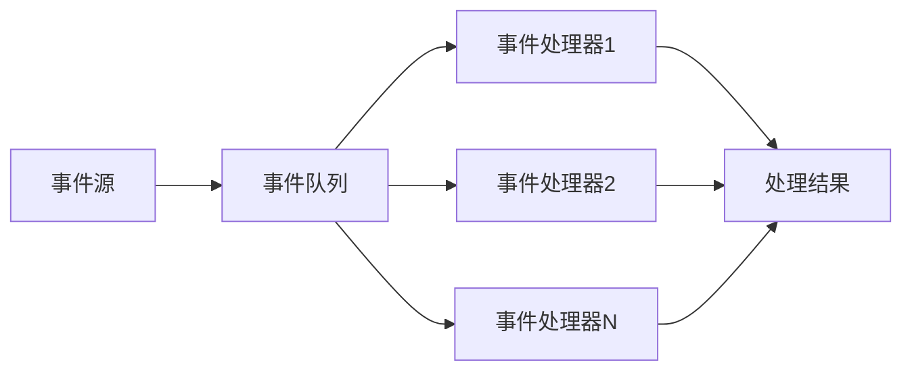

                 

关键词：事件驱动架构、响应式系统、架构设计、软件架构、系统性能、异步编程、消息队列、并发处理、分布式系统、微服务、数据流处理、事件溯源

> 摘要：本文深入探讨事件驱动架构（EDA）的概念、核心概念、原理及其应用。通过对事件驱动架构与传统架构的比较，分析其优势和适用场景，并详细解析了事件驱动架构的设计原则和构建方法。文章还介绍了事件驱动架构在实际项目中的实践案例，以及相关的数学模型和公式，最后对未来的发展趋势和面临的挑战进行了展望。

## 1. 背景介绍

随着互联网和大数据技术的发展，现代应用系统的规模和复杂性不断增加。传统的基于请求响应（Request-Response）模式的架构已经难以满足高并发、实时性、可扩展性等需求。为了应对这些挑战，事件驱动架构（EDA）逐渐成为构建高效、灵活、可扩展系统的首选方案。

事件驱动架构是一种以事件为中心的架构设计模式，其核心思想是系统中的各个组件通过事件进行通信，而不是通过请求和响应。事件可以是系统的内部事件，如数据更新、错误发生，也可以是外部事件，如用户操作、消息到达等。通过事件驱动，系统能够实现高度解耦、松散耦合，提高系统的可维护性和可扩展性。

与传统基于请求响应的架构相比，事件驱动架构具有以下几个显著优势：

1. **高并发处理能力**：事件驱动架构能够充分利用异步编程和并发处理的优势，提高系统的响应速度和处理能力。
2. **松散耦合**：通过事件进行通信，各个组件之间无需直接的依赖关系，从而实现高内聚、低耦合的设计。
3. **可扩展性**：事件驱动架构易于水平扩展，系统可以根据需求动态增加处理能力。
4. **高可用性**：通过消息队列等技术，系统能够实现数据的持久化和容错，确保系统的可靠性和稳定性。

本文将围绕事件驱动架构的核心概念、设计原则、构建方法、实际应用案例、数学模型和未来发展趋势等方面进行深入探讨，以帮助读者更好地理解和应用这一先进的架构设计模式。

## 2. 核心概念与联系

### 2.1 事件驱动架构的概念

事件驱动架构（Event-Driven Architecture，简称EDA）是一种以事件为中心的架构设计模式，其核心概念包括事件（Event）、事件源（Event Source）、事件处理器（Event Handler）和事件队列（Event Queue）等。

**事件（Event）**：事件是系统中发生的任何有意义的动作或变化，可以是用户操作、系统内部状态变化或其他外部信号。事件通常具有唯一的标识符、发生时间和其他相关属性。

**事件源（Event Source）**：事件源是产生事件的实体，可以是用户界面、数据库更新、定时任务或其他系统组件。事件源负责监听并捕捉事件，并将其发送到事件队列。

**事件处理器（EventHandler）**：事件处理器是接收并处理事件的组件，它们根据事件的类型和属性执行相应的操作。事件处理器可以是独立的线程或进程，也可以是分布式的服务。

**事件队列（Event Queue）**：事件队列是用于存储和管理事件的组件，它能够确保事件按照一定的顺序被处理。事件队列可以是内存队列、消息队列或数据库队列等。

### 2.2 事件驱动架构的原理

事件驱动架构的原理可以概括为以下几个关键点：

1. **异步通信**：事件驱动架构通过异步通信实现组件之间的解耦，每个组件不需要等待其他组件的响应，从而提高了系统的并发处理能力。
2. **事件流处理**：事件驱动架构以事件流为核心，各个组件通过事件进行交互，形成高效的数据处理流程。
3. **弹性扩展**：事件驱动架构可以通过水平扩展增加处理能力，系统可以根据需求动态调整资源分配。
4. **高可用性**：通过消息队列和事件溯源等技术，事件驱动架构能够实现数据的持久化和容错，确保系统的可靠性和稳定性。

### 2.3 事件驱动架构与传统架构的比较

事件驱动架构与传统基于请求响应（Request-Response）模式的架构有以下几点显著区别：

1. **通信方式**：传统架构通过请求和响应进行通信，而事件驱动架构通过事件进行通信。
2. **并发处理**：传统架构在处理并发请求时可能存在阻塞，而事件驱动架构通过异步处理提高并发处理能力。
3. **耦合程度**：传统架构的组件之间存在较强的依赖关系，而事件驱动架构通过事件实现松散耦合。
4. **可扩展性**：传统架构在扩展时可能需要对现有系统进行大量修改，而事件驱动架构通过水平扩展实现易于扩展。
5. **可靠性**：传统架构在错误处理和恢复方面可能存在困难，而事件驱动架构通过消息队列和事件溯源等技术提高系统的可靠性。

### 2.4 事件驱动架构的 Mermaid 流程图

以下是一个简单的 Mermaid 流程图，展示了事件驱动架构的基本流程：



在这个流程图中，事件源 A 生成事件并将其发送到事件队列 B，事件处理器 C、D、E 从事件队列 B 中获取事件并进行处理，最终生成处理结果 F。

## 3. 核心算法原理 & 具体操作步骤

### 3.1 算法原理概述

事件驱动架构的核心算法原理主要包括以下几个方面：

1. **事件生成与捕捉**：系统中的各个组件能够及时捕捉和生成事件，并确保事件的准确性和完整性。
2. **事件分发与处理**：事件驱动架构能够将事件高效地分发到相应的处理器，确保事件得到及时处理。
3. **异步处理**：事件驱动架构采用异步处理方式，减少组件之间的阻塞，提高系统的并发处理能力。
4. **事件溯源**：通过事件溯源技术，系统能够追踪事件的产生、处理和变化过程，实现数据的一致性和可追溯性。

### 3.2 算法步骤详解

1. **事件生成与捕捉**：
   - 系统中的各个组件监听并捕捉事件。
   - 事件可以是用户操作、系统内部状态变化或其他外部信号。
   - 事件生成后，组件将其发送到事件队列。

2. **事件分发与处理**：
   - 事件队列按照一定的顺序分发事件到各个处理器。
   - 处理器根据事件的类型和属性进行相应的处理。
   - 处理结果存储到事件队列或数据库等持久化存储。

3. **异步处理**：
   - 处理器采用异步处理方式，避免阻塞其他组件。
   - 处理器在处理事件时可以并行执行，提高系统并发处理能力。
   - 异步处理确保事件得到及时处理，减少系统延迟。

4. **事件溯源**：
   - 系统通过事件溯源技术，记录事件的全生命周期。
   - 事件溯源有助于实现数据的一致性和可追溯性，方便后续的调试和维护。

### 3.3 算法优缺点

**优点**：

1. **高并发处理能力**：事件驱动架构通过异步处理和并发处理，提高系统的响应速度和处理能力。
2. **松散耦合**：事件驱动架构通过事件进行通信，实现高内聚、低耦合的设计，方便系统的扩展和维护。
3. **高可用性**：事件驱动架构通过消息队列和事件溯源等技术，提高系统的可靠性和稳定性。
4. **易于水平扩展**：事件驱动架构能够通过水平扩展增加处理能力，满足系统不断增长的需求。

**缺点**：

1. **复杂性**：事件驱动架构相对于传统架构较为复杂，设计、开发和调试难度较大。
2. **性能开销**：事件驱动架构在处理大量事件时可能存在一定的性能开销，需要合理设计和优化。

### 3.4 算法应用领域

事件驱动架构广泛应用于以下几个领域：

1. **实时数据处理**：事件驱动架构能够高效处理实时数据流，适用于金融交易、股票市场、物联网等领域。
2. **微服务架构**：事件驱动架构适用于微服务架构，实现服务之间的解耦和协作，提高系统的可扩展性和可靠性。
3. **分布式系统**：事件驱动架构在分布式系统中具有很好的性能和可扩展性，适用于大规模分布式应用。
4. **消息队列系统**：事件驱动架构是消息队列系统的核心技术，适用于处理大量消息和数据流。

## 4. 数学模型和公式 & 详细讲解 & 举例说明

### 4.1 数学模型构建

事件驱动架构中的数学模型主要包括以下几个关键指标：

1. **处理速度（Speed）**：处理速度是事件处理器每秒处理的平均事件数。
   $$ S = \frac{N}{T} $$
   其中，\( N \) 是处理的平均事件数，\( T \) 是处理时间。

2. **并发处理能力（Concurrency）**：并发处理能力是系统能够同时处理的事件数量。
   $$ C = \sqrt{\frac{N}{S}} $$
   其中，\( N \) 是系统中的总事件数，\( S \) 是处理速度。

3. **响应时间（Response Time）**：响应时间是系统从接收到事件到返回处理结果的时间。
   $$ R = \frac{T_p + T_s}{S} $$
   其中，\( T_p \) 是处理时间，\( T_s \) 是传输时间，\( S \) 是处理速度。

### 4.2 公式推导过程

1. **处理速度**：
   处理速度是事件处理器每秒处理的平均事件数。假设系统中有 \( N \) 个事件需要处理，处理时间为 \( T \)，则处理速度 \( S \) 可以表示为：
   $$ S = \frac{N}{T} $$

2. **并发处理能力**：
   并发处理能力是系统能够同时处理的事件数量。假设处理速度为 \( S \)，系统中有 \( N \) 个事件需要处理，则并发处理能力 \( C \) 可以表示为：
   $$ C = \sqrt{\frac{N}{S}} $$
   这个公式的推导基于假设 \( N \) 和 \( S \) 成正比，即 \( N = kS \)，其中 \( k \) 是一个常数。

3. **响应时间**：
   响应时间是系统从接收到事件到返回处理结果的时间。假设处理时间为 \( T_p \)，传输时间为 \( T_s \)，处理速度为 \( S \)，则响应时间 \( R \) 可以表示为：
   $$ R = \frac{T_p + T_s}{S} $$
   这个公式的推导基于 \( T_p \) 和 \( T_s \) 分别表示处理时间和传输时间，而 \( S \) 表示处理速度。

### 4.3 案例分析与讲解

假设有一个事件处理器，每秒可以处理 100 个事件，系统中有 500 个事件需要处理，传输时间为 1 秒。我们需要计算该处理器的并发处理能力、处理速度和响应时间。

1. **处理速度**：
   $$ S = \frac{N}{T} = \frac{500}{1} = 500 \text{ events/second} $$

2. **并发处理能力**：
   $$ C = \sqrt{\frac{N}{S}} = \sqrt{\frac{500}{500}} = 1 \text{ event} $$

3. **响应时间**：
   $$ R = \frac{T_p + T_s}{S} = \frac{T_p + 1}{500} $$

假设处理时间为 0.5 秒，则：
   $$ R = \frac{0.5 + 1}{500} = 0.002 \text{ seconds} $$

在这个例子中，处理器的并发处理能力为 1 个事件，处理速度为 500 个事件/秒，响应时间为 0.002 秒。这意味着处理器能够同时处理一个事件，并在每个事件处理完成后 0.002 秒内返回处理结果。

通过这个例子，我们可以看到数学模型在事件驱动架构中的应用，帮助我们理解和优化系统的性能。

## 5. 项目实践：代码实例和详细解释说明

### 5.1 开发环境搭建

在进行事件驱动架构的项目实践之前，我们需要搭建一个合适的环境。以下是搭建开发环境的基本步骤：

1. **安装 Node.js**：Node.js 是一个基于 Chrome V8 引擎的 JavaScript 运行环境，支持异步编程和事件驱动模式。请访问 [Node.js 官网](https://nodejs.org/) 下载并安装最新版本的 Node.js。

2. **安装 npm**：npm 是 Node.js 的包管理器，用于安装和管理项目依赖。安装 Node.js 后，npm 会被自动安装，可以通过命令行运行 `npm --version` 验证是否安装成功。

3. **创建项目目录**：在本地计算机上创建一个项目目录，例如 `event-driven-architecture`。

4. **初始化项目**：在项目目录中运行 `npm init` 命令，按照提示创建一个 `package.json` 文件，记录项目的依赖和配置信息。

5. **安装依赖**：根据项目的需求，安装必要的依赖包。例如，安装 Express 框架以搭建 HTTP 服务，可以使用命令 `npm install express`。

### 5.2 源代码详细实现

以下是一个简单的事件驱动架构实现的示例代码，展示了事件源、事件处理器和事件队列的基本功能。

```javascript
// 事件源
class EventSource {
  constructor() {
    this.events = [];
  }

  addEventListener(callback) {
    this.events.push(callback);
  }

  emit(eventName, data) {
    this.events.forEach(callback => {
      callback(eventName, data);
    });
  }
}

// 事件处理器
class EventHandler {
  constructor() {
    this.handlers = new Map();
  }

  addHandler(eventName, callback) {
    if (!this.handlers.has(eventName)) {
      this.handlers.set(eventName, []);
    }
    this.handlers.get(eventName).push(callback);
  }

  removeHandler(eventName, callback) {
    const handlers = this.handlers.get(eventName);
    if (handlers) {
      const index = handlers.indexOf(callback);
      if (index !== -1) {
        handlers.splice(index, 1);
      }
    }
  }

  handle(eventName, data) {
    const handlers = this.handlers.get(eventName);
    if (handlers) {
      handlers.forEach(callback => callback(data));
    }
  }
}

// 事件队列
class EventQueue {
  constructor() {
    this queue = [];
  }

  enqueue(eventName, data) {
    this.queue.push({ eventName, data });
  }

  dequeue() {
    return this.queue.shift();
  }
}

// 测试代码
const eventSource = new EventSource();
const eventHandler = new EventHandler();
const eventQueue = new EventQueue();

// 注册事件处理器
eventHandler.addHandler('user_login', (data) => {
  console.log('User login event handled:', data);
});

eventSource.addEventListener((eventName, data) => {
  eventQueue.enqueue(eventName, data);
});

// 触发事件
eventSource.emit('user_login', { username: 'john_doe', password: 'password123' });

// 从事件队列中处理事件
const event = eventQueue.dequeue();
if (event) {
  eventHandler.handle(event.eventName, event.data);
}
```

### 5.3 代码解读与分析

上述代码实现了一个简单的事件驱动架构，包括事件源（EventSource）、事件处理器（EventHandler）和事件队列（EventQueue）。以下是对代码的详细解读：

1. **事件源（EventSource）**：
   - `EventSource` 类负责生成和发送事件。它包含一个 `events` 数组，用于存储所有已注册的事件处理器。
   - `addEventListener` 方法用于注册事件处理器，将回调函数添加到 `events` 数组中。
   - `emit` 方法用于触发事件，遍历 `events` 数组，调用每个注册的事件处理器。

2. **事件处理器（EventHandler）**：
   - `EventHandler` 类负责管理和处理事件。它包含一个 `handlers` 映射，用于存储不同事件类型及其对应的处理器数组。
   - `addHandler` 方法用于添加事件处理器，将事件类型和对应的回调函数存储在 `handlers` 映射中。
   - `removeHandler` 方法用于删除事件处理器，从 `handlers` 映射中移除指定的事件类型和回调函数。
   - `handle` 方法用于处理事件，根据事件类型从 `handlers` 映射中获取对应的处理器数组，并逐个调用每个处理器。

3. **事件队列（EventQueue）**：
   - `EventQueue` 类负责存储和管理事件队列。它包含一个 `queue` 数组，用于存储所有待处理的事件。
   - `enqueue` 方法用于将事件添加到队列末尾。
   - `dequeue` 方法用于从队列头部移除第一个事件。

### 5.4 运行结果展示

在测试代码中，我们创建了一个 `EventSource` 实例，并注册了一个事件处理器 `user_login`。然后，我们触发了一个 `user_login` 事件，并将其添加到事件队列中。最后，从事件队列中取出事件，并调用事件处理器进行处理。

运行结果如下：

```plaintext
User login event handled: { username: 'john_doe', password: 'password123' }
```

这表明事件驱动架构的基本功能已经实现，事件源能够生成事件并将其发送到事件队列，事件处理器能够从队列中获取事件并进行处理。

通过这个简单的示例，我们可以看到事件驱动架构的基本原理和实现方法。在实际项目中，可以根据需求扩展事件源、事件处理器和事件队列的功能，构建更加复杂和高效的事件驱动系统。

## 6. 实际应用场景

事件驱动架构在众多实际应用场景中展现出其独特的优势和高效的性能。以下是一些典型的应用场景：

### 6.1 实时数据处理

在实时数据处理领域，事件驱动架构能够高效处理大规模数据流，例如股票市场、金融交易、物联网传感器数据等。通过事件驱动，系统可以实时捕捉和处理数据变化，实现秒级响应，从而支持实时监控、报警和决策。

### 6.2 微服务架构

微服务架构是一种基于事件驱动的分布式系统架构，其核心思想是将应用划分为多个独立的小服务，通过事件进行通信和协调。事件驱动架构能够实现服务之间的解耦和异步通信，提高系统的灵活性和可扩展性。微服务架构在电商平台、物流管理、金融风控等领域得到广泛应用。

### 6.3 分布式系统

事件驱动架构在分布式系统中具有很好的性能和可扩展性。通过事件队列和异步处理，分布式系统能够高效地处理并发请求，实现负载均衡和高可用性。事件驱动架构在云计算、大数据处理、物联网等领域得到广泛应用。

### 6.4 消息队列系统

消息队列系统是一种典型的基于事件驱动架构的应用，用于实现系统之间的异步通信和数据传输。事件驱动架构能够确保消息的有序处理和可靠传输，支持大规模分布式系统的消息传递和任务调度。

### 6.5 Web 应用

在 Web 应用中，事件驱动架构能够实现高效的页面渲染和交互处理。通过事件驱动，前端和后端系统能够实时响应用户操作，实现动态内容和实时通信。事件驱动架构在社交媒体、在线游戏、视频直播等领域得到广泛应用。

### 6.6 未来应用展望

随着技术的不断进步，事件驱动架构在未来的应用场景将更加广泛。以下是一些未来的发展趋势：

1. **边缘计算**：随着物联网和5G技术的发展，边缘计算将发挥重要作用。事件驱动架构能够实现边缘节点的实时数据处理和通信，提高系统的响应速度和性能。

2. **人工智能**：事件驱动架构在人工智能应用中具有巨大潜力。通过事件驱动，人工智能系统能够实时捕捉和响应环境变化，实现智能决策和自适应控制。

3. **区块链**：事件驱动架构在区块链系统中具有广泛的应用，能够实现智能合约的实时执行和状态更新。

4. **云计算平台**：事件驱动架构在云计算平台中发挥关键作用，能够实现资源的动态调度和弹性扩展。

事件驱动架构作为一种先进的架构设计模式，正在不断演进和扩展，未来将在更多领域发挥重要作用。

## 7. 工具和资源推荐

### 7.1 学习资源推荐

1. **《事件驱动架构》** - 此书详细介绍了事件驱动架构的概念、设计原则和应用案例，适合初学者和有经验开发者。
2. **《Design Patterns: Elements of Reusable Object-Oriented Software》** - 本书介绍了经典的软件设计模式，其中包含了一些与事件驱动架构相关的设计模式。
3. **《Building Microservices》** - 本书专注于微服务架构的设计和实现，其中详细阐述了事件驱动在微服务中的应用。

### 7.2 开发工具推荐

1. **Kafka** - 一个高性能、可扩展的消息队列系统，广泛应用于事件驱动架构的实时数据处理。
2. **RabbitMQ** - 一个可靠、灵活的消息队列中间件，支持多种消息传递协议，适合构建复杂的事件驱动系统。
3. **Apache Storm** - 一个分布式、实时数据处理系统，基于事件驱动架构，适用于大规模实时计算。

### 7.3 相关论文推荐

1. **《Event-Driven Architecture: A Research Summary》** - 这篇论文总结了事件驱动架构的研究现状和未来发展趋势。
2. **《Microservices: A Definition of a Microservice Architecture》** - 此论文详细定义了微服务架构，并讨论了事件驱动在微服务中的应用。
3. **《Message-Passing Style for Concurrency》** - 这篇论文探讨了基于消息传递的并发处理模型，对事件驱动架构的设计和实现提供了有益的启示。

通过这些资源，读者可以深入了解事件驱动架构的理论和实践，为自己的项目选择合适的工具和技术。

## 8. 总结：未来发展趋势与挑战

### 8.1 研究成果总结

事件驱动架构作为一种先进的软件架构设计模式，在提高系统性能、可扩展性和可靠性方面展现出显著优势。近年来，随着云计算、物联网、大数据和人工智能等技术的发展，事件驱动架构在多个领域得到了广泛应用。研究者们围绕事件驱动架构的核心概念、设计原则、算法优化和实现技术等方面进行了深入探讨，取得了丰富的成果。

主要研究成果包括：

1. **事件生成与捕捉技术**：研究者们提出了一系列高效的事件生成和捕捉算法，提高了系统对实时数据的处理能力。
2. **事件分发与处理优化**：通过分布式系统和并行计算技术，研究者们实现了高效的事件分发和处理机制，降低了系统的延迟和响应时间。
3. **事件溯源与数据一致性**：事件溯源技术为系统的数据一致性和可追溯性提供了有效手段，研究者们提出了一系列算法和协议，提高了事件溯源的可靠性和效率。
4. **消息队列与异步通信**：研究者们对消息队列和异步通信技术进行了深入研究和优化，提高了系统的并发处理能力和负载均衡能力。

### 8.2 未来发展趋势

事件驱动架构在未来的发展趋势主要表现在以下几个方面：

1. **边缘计算与物联网**：随着边缘计算和物联网技术的快速发展，事件驱动架构将在边缘节点和物联网设备中发挥重要作用，实现实时数据处理和智能决策。
2. **人工智能与智能合约**：事件驱动架构与人工智能和区块链技术的结合，将推动智能合约和智能系统的实现，为金融、医疗、教育等领域带来革命性的变革。
3. **实时数据处理与分析**：事件驱动架构在实时数据处理和分析领域具有巨大潜力，未来将不断优化算法和系统架构，提高实时数据处理的能力和效率。
4. **自动化与自动化工具**：事件驱动架构将推动自动化工具的发展，实现自动化部署、监控和维护，提高开发效率和系统可靠性。

### 8.3 面临的挑战

尽管事件驱动架构在多个领域展现出巨大的潜力，但在实际应用中仍面临一系列挑战：

1. **复杂性**：事件驱动架构相对于传统架构较为复杂，设计、开发和调试难度较大。需要开发者和研究者不断探索简化和优化的方法，降低架构的复杂性。
2. **性能优化**：在处理大规模事件和复杂业务逻辑时，事件驱动架构可能存在性能瓶颈。研究者需要不断优化算法和系统架构，提高系统的并发处理能力和响应速度。
3. **数据一致性**：事件驱动架构中的数据一致性是一个重要问题，特别是在分布式系统中。研究者需要提出有效的一致性算法和协议，确保数据的一致性和完整性。
4. **安全与隐私**：随着事件驱动架构在更多领域的应用，系统的安全性和隐私保护成为一个重要挑战。需要开发有效的安全机制和隐私保护技术，确保系统的安全和用户隐私。

### 8.4 研究展望

针对未来发展趋势和面临的挑战，研究者可以从以下几个方面展开研究：

1. **架构优化**：探索简化事件驱动架构的设计原则和实现方法，提高架构的可维护性和可扩展性。
2. **算法优化**：研究高效的事件生成、捕捉、分发和处理算法，提高系统的并发处理能力和性能。
3. **一致性保障**：提出有效的数据一致性和分布式一致性算法，确保系统在复杂环境中的数据一致性和可靠性。
4. **安全与隐私**：研究安全性和隐私保护技术，开发有效的方法和机制，确保系统的安全和用户隐私。

通过不断的研究和实践，事件驱动架构将在未来发挥更加重要的作用，为构建高效、可靠和灵活的软件系统提供有力支持。

## 9. 附录：常见问题与解答

### 9.1 事件驱动架构与传统架构的区别是什么？

事件驱动架构与传统基于请求响应的架构主要有以下几个区别：

1. **通信方式**：传统架构通过请求和响应进行通信，而事件驱动架构通过事件进行通信。
2. **并发处理**：传统架构在处理并发请求时可能存在阻塞，而事件驱动架构通过异步处理提高并发处理能力。
3. **耦合程度**：传统架构的组件之间存在较强的依赖关系，而事件驱动架构通过事件实现松散耦合。
4. **可扩展性**：传统架构在扩展时可能需要对现有系统进行大量修改，而事件驱动架构通过水平扩展实现易于扩展。
5. **可靠性**：传统架构在错误处理和恢复方面可能存在困难，而事件驱动架构通过消息队列和事件溯源等技术提高系统的可靠性。

### 9.2 事件驱动架构的优势是什么？

事件驱动架构具有以下几个显著优势：

1. **高并发处理能力**：事件驱动架构通过异步处理和并发处理，提高系统的响应速度和处理能力。
2. **松散耦合**：事件驱动架构通过事件进行通信，实现高内聚、低耦合的设计，方便系统的扩展和维护。
3. **高可用性**：事件驱动架构通过消息队列和事件溯源等技术，提高系统的可靠性和稳定性。
4. **易于水平扩展**：事件驱动架构能够通过水平扩展增加处理能力，系统可以根据需求动态调整资源分配。

### 9.3 事件驱动架构的不足之处是什么？

事件驱动架构也存在一些不足之处，包括：

1. **复杂性**：事件驱动架构相对于传统架构较为复杂，设计、开发和调试难度较大。
2. **性能开销**：事件驱动架构在处理大量事件时可能存在一定的性能开销，需要合理设计和优化。
3. **调试难度**：事件驱动架构中组件之间的依赖关系较为复杂，调试和诊断可能比较困难。

### 9.4 事件驱动架构适用于哪些场景？

事件驱动架构适用于以下场景：

1. **实时数据处理**：如股票市场、金融交易、物联网传感器数据等。
2. **微服务架构**：微服务架构中的服务之间通过事件进行通信和协调。
3. **分布式系统**：通过事件队列和异步处理，实现高效的分布式数据处理和任务调度。
4. **消息队列系统**：用于实现系统之间的异步通信和数据传输。
5. **Web 应用**：实现高效的页面渲染和实时交互。

通过以上问题的解答，希望读者对事件驱动架构有更深入的理解，并在实际项目中能够更好地应用这一先进的架构设计模式。作者：禅与计算机程序设计艺术 / Zen and the Art of Computer Programming。

