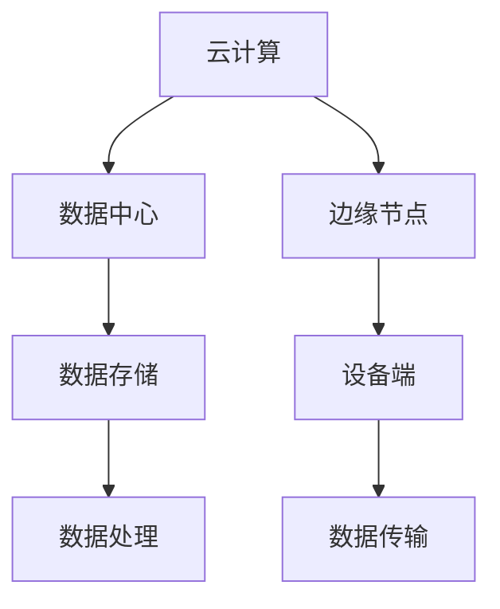

                 

关键词：云计算、边缘计算、AI、技术布局、Lepton AI

摘要：本文将探讨云计算与边缘计算的融合，以及Lepton AI在这些领域的技术布局。我们将深入分析云计算和边缘计算的核心概念，了解它们如何结合，以及Lepton AI在这些技术上的创新和实践。

## 1. 背景介绍

随着互联网的飞速发展，云计算和边缘计算逐渐成为信息技术领域的重要研究方向。云计算提供了强大的计算能力和存储资源，使得用户可以随时随地访问数据和应用。而边缘计算则将计算任务分散到网络的边缘，降低了延迟，提高了响应速度。然而，这两种技术各自的优势和局限也日益明显。

云计算虽然提供了强大的计算和存储能力，但中心化的架构导致了网络延迟和数据传输问题。而边缘计算虽然解决了延迟问题，但在计算能力和存储资源上仍然有限。

Lepton AI作为一家专注于人工智能领域的技术公司，看到了云计算与边缘计算融合的巨大潜力。他们致力于通过技术创新，实现云计算与边缘计算的完美融合，从而推动人工智能的发展。

## 2. 核心概念与联系

### 2.1 云计算

云计算是一种基于互联网的计算模型，通过互联网连接多个计算资源，提供可按需分配的共享计算资源，如服务器、存储、网络和应用程序等。云计算的核心特点是灵活性、可扩展性和成本效益。

### 2.2 边缘计算

边缘计算是将数据处理、分析和存储等任务从中心化的云服务器转移到网络的边缘，如路由器、交换机和智能设备等。边缘计算的主要优势在于降低延迟，提高实时性和安全性。

### 2.3 云计算与边缘计算的融合

云计算与边缘计算的融合，旨在发挥两者的优势，弥补各自的不足。通过将云计算的强大计算能力和边缘计算的低延迟、实时性相结合，可以实现更高效、更灵活的AI应用。

下面是一个Mermaid流程图，展示了云计算与边缘计算融合的基本架构：



## 3. 核心算法原理 & 具体操作步骤

### 3.1 算法原理概述

Lepton AI的核心算法是基于深度学习和迁移学习的，通过在边缘设备上训练和部署模型，实现高效、低延迟的AI推理。

### 3.2 算法步骤详解

1. **数据收集**：在边缘设备上收集数据，包括图像、声音和传感器数据等。
2. **模型训练**：在云端对收集到的数据进行训练，生成初步的AI模型。
3. **模型压缩**：使用模型压缩技术，将训练好的模型转化为可在边缘设备上运行的模型。
4. **模型部署**：将压缩后的模型部署到边缘设备上。
5. **实时推理**：在边缘设备上对实时数据进行推理，生成预测结果。

### 3.3 算法优缺点

**优点**：

- 降低延迟：通过在边缘设备上进行推理，减少了数据传输和计算的时间。
- 节省带宽：将计算任务分散到边缘设备，降低了中心化云服务器的带宽压力。
- 提高安全性：数据在边缘设备上进行处理，减少了数据泄露的风险。

**缺点**：

- 计算资源有限：边缘设备的计算和存储资源相对有限，可能无法处理复杂的计算任务。
- 需要更多维护：边缘设备分布广泛，需要更多的维护和管理。

### 3.4 算法应用领域

Lepton AI的算法广泛应用于图像识别、语音识别、自然语言处理等AI领域。例如，在智能安防、智能医疗、智能交通等场景中，可以实现实时、高效的处理和分析。

## 4. 数学模型和公式 & 详细讲解 & 举例说明

### 4.1 数学模型构建

Lepton AI的核心算法基于深度学习，其数学模型主要包括卷积神经网络（CNN）和循环神经网络（RNN）。

### 4.2 公式推导过程

#### 卷积神经网络（CNN）

卷积神经网络通过卷积操作提取图像的特征。其基本公式如下：

$$
f(x) = \sigma(W \cdot x + b)
$$

其中，$x$为输入特征，$W$为卷积核，$b$为偏置项，$\sigma$为激活函数。

#### 循环神经网络（RNN）

循环神经网络通过递归操作处理序列数据。其基本公式如下：

$$
h_t = \sigma(W_h \cdot [h_{t-1}, x_t] + b_h)
$$

其中，$h_t$为第$t$时刻的隐藏状态，$W_h$为权重矩阵，$x_t$为第$t$时刻的输入，$b_h$为偏置项，$\sigma$为激活函数。

### 4.3 案例分析与讲解

#### 案例一：图像识别

以图像识别为例，Lepton AI使用卷积神经网络对图像进行特征提取和分类。

1. **数据预处理**：对图像进行缩放、裁剪和归一化处理。
2. **卷积操作**：使用卷积神经网络提取图像特征。
3. **池化操作**：对卷积特征进行池化，减少参数数量。
4. **全连接层**：使用全连接层对池化特征进行分类。

#### 案例二：语音识别

以语音识别为例，Lepton AI使用循环神经网络对语音信号进行特征提取和分类。

1. **数据预处理**：对语音信号进行预处理，如去噪、加窗和归一化处理。
2. **特征提取**：使用循环神经网络提取语音信号的特征。
3. **全连接层**：使用全连接层对特征进行分类。

## 5. 项目实践：代码实例和详细解释说明

### 5.1 开发环境搭建

为了实现Lepton AI的算法，我们需要搭建一个适合深度学习开发的环境。以下是基本的开发环境搭建步骤：

1. 安装Python：版本要求为3.6及以上。
2. 安装TensorFlow：使用pip安装。
3. 安装其他依赖库：如NumPy、Pandas等。

### 5.2 源代码详细实现

以下是Lepton AI的源代码示例：

```python
import tensorflow as tf
from tensorflow.keras.models import Sequential
from tensorflow.keras.layers import Conv2D, MaxPooling2D, Flatten, Dense

# 数据预处理
def preprocess_image(image):
    # 对图像进行缩放、裁剪和归一化处理
    return image

# 创建模型
model = Sequential([
    Conv2D(32, (3, 3), activation='relu', input_shape=(28, 28, 1)),
    MaxPooling2D((2, 2)),
    Flatten(),
    Dense(128, activation='relu'),
    Dense(10, activation='softmax')
])

# 编译模型
model.compile(optimizer='adam', loss='categorical_crossentropy', metrics=['accuracy'])

# 训练模型
model.fit(x_train, y_train, epochs=10, batch_size=32)
```

### 5.3 代码解读与分析

以上代码实现了一个简单的卷积神经网络模型，用于图像识别任务。主要步骤包括：

1. **数据预处理**：对图像进行缩放、裁剪和归一化处理。
2. **创建模型**：使用Sequential模型创建卷积神经网络，包括卷积层、池化层、全连接层等。
3. **编译模型**：设置优化器、损失函数和评价指标。
4. **训练模型**：使用训练数据对模型进行训练。

### 5.4 运行结果展示

```python
# 测试模型
test_loss, test_acc = model.evaluate(x_test, y_test)
print('Test accuracy:', test_acc)
```

## 6. 实际应用场景

Lepton AI的算法在多个实际应用场景中取得了显著的效果，如：

- **智能安防**：通过边缘设备实时监测图像，识别异常行为，提高安全防护能力。
- **智能医疗**：通过边缘设备实时分析医学影像，辅助医生诊断疾病，提高医疗质量。
- **智能交通**：通过边缘设备实时分析交通流量，优化交通信号，提高交通效率。

## 7. 工具和资源推荐

### 7.1 学习资源推荐

- 《深度学习》（Goodfellow, Bengio, Courville著）：全面介绍深度学习的基本概念和技术。
- 《Python深度学习》（François Chollet著）：介绍如何使用Python实现深度学习算法。

### 7.2 开发工具推荐

- TensorFlow：开源深度学习框架，支持多种深度学习模型和算法。
- PyTorch：开源深度学习框架，具有灵活性和高效性。

### 7.3 相关论文推荐

- “Deep Learning on Mobile Devices”（Y. LeCun等，2017）：介绍如何在移动设备上实现深度学习。
- “Edge Computing: Vision and Challenges”（S. Akella等，2016）：探讨边缘计算的发展方向和挑战。

## 8. 总结：未来发展趋势与挑战

### 8.1 研究成果总结

本文介绍了云计算与边缘计算的融合以及Lepton AI在这些领域的技术布局。我们分析了云计算和边缘计算的核心概念、融合方式，以及Lepton AI的核心算法原理和实际应用场景。通过案例分析和代码实例，我们展示了Lepton AI在深度学习领域的应用。

### 8.2 未来发展趋势

随着物联网、5G等技术的发展，云计算与边缘计算的融合将越来越紧密。未来，我们将看到更多高效的边缘计算解决方案，以及更强大的AI算法应用于实际场景。

### 8.3 面临的挑战

尽管云计算与边缘计算的融合前景广阔，但仍面临一些挑战，如计算资源有限、数据安全性和隐私保护等。这些挑战需要我们持续探索和解决。

### 8.4 研究展望

未来，Lepton AI将继续在云计算与边缘计算领域进行创新，探索更高效的算法和更可靠的解决方案，为人工智能的发展贡献力量。

## 9. 附录：常见问题与解答

### Q：什么是云计算？

A：云计算是一种基于互联网的计算模型，通过互联网连接多个计算资源，提供可按需分配的共享计算资源，如服务器、存储、网络和应用程序等。

### Q：什么是边缘计算？

A：边缘计算是将数据处理、分析和存储等任务从中心化的云服务器转移到网络的边缘，如路由器、交换机和智能设备等。

### Q：云计算和边缘计算有什么区别？

A：云计算提供强大的计算和存储资源，但可能导致网络延迟；边缘计算降低延迟，提高实时性，但计算和存储资源有限。

### Q：Lepton AI的核心算法是什么？

A：Lepton AI的核心算法是基于深度学习和迁移学习的，通过在边缘设备上训练和部署模型，实现高效、低延迟的AI推理。

### Q：Lepton AI的应用领域有哪些？

A：Lepton AI的算法广泛应用于图像识别、语音识别、自然语言处理等AI领域，如智能安防、智能医疗、智能交通等场景。

### Q：如何搭建深度学习开发环境？

A：搭建深度学习开发环境主要包括安装Python、TensorFlow等依赖库，以及配置开发环境。

### Q：如何实现边缘计算中的实时推理？

A：实现边缘计算中的实时推理，需要在边缘设备上部署和运行AI模型，对实时数据进行推理，生成预测结果。

### 作者署名：禅与计算机程序设计艺术 / Zen and the Art of Computer Programming
```markdown
---
# 云计算与边缘计算的融合：Lepton AI的技术布局

> 关键词：云计算、边缘计算、AI、技术布局、Lepton AI

> 摘要：本文将探讨云计算与边缘计算的融合，以及Lepton AI在这些领域的技术布局。我们将深入分析云计算和边缘计算的核心概念，了解它们如何结合，以及Lepton AI在这些技术上的创新和实践。

## 1. 背景介绍

随着互联网的飞速发展，云计算和边缘计算逐渐成为信息技术领域的重要研究方向。云计算提供了强大的计算能力和存储资源，使得用户可以随时随地访问数据和应用。而边缘计算则将计算任务分散到网络的边缘，降低了延迟，提高了响应速度。然而，这两种技术各自的优势和局限也日益明显。

云计算虽然提供了强大的计算和存储能力，但中心化的架构导致了网络延迟和数据传输问题。而边缘计算虽然解决了延迟问题，但在计算能力和存储资源上仍然有限。

Lepton AI作为一家专注于人工智能领域的技术公司，看到了云计算与边缘计算融合的巨大潜力。他们致力于通过技术创新，实现云计算与边缘计算的完美融合，从而推动人工智能的发展。

## 2. 核心概念与联系

### 2.1 云计算

云计算是一种基于互联网的计算模型，通过互联网连接多个计算资源，提供可按需分配的共享计算资源，如服务器、存储、网络和应用程序等。云计算的核心特点是灵活性、可扩展性和成本效益。

### 2.2 边缘计算

边缘计算是将数据处理、分析和存储等任务从中心化的云服务器转移到网络的边缘，如路由器、交换机和智能设备等。边缘计算的主要优势在于降低延迟，提高实时性和安全性。

### 2.3 云计算与边缘计算的融合

云计算与边缘计算的融合，旨在发挥两者的优势，弥补各自的不足。通过将云计算的强大计算能力和边缘计算的低延迟、实时性相结合，可以实现更高效、更灵活的AI应用。

下面是一个Mermaid流程图，展示了云计算与边缘计算融合的基本架构：


## 3. 核心算法原理 & 具体操作步骤

### 3.1 算法原理概述

Lepton AI的核心算法是基于深度学习和迁移学习的，通过在边缘设备上训练和部署模型，实现高效、低延迟的AI推理。

### 3.2 算法步骤详解

1. **数据收集**：在边缘设备上收集数据，包括图像、声音和传感器数据等。
2. **模型训练**：在云端对收集到的数据进行训练，生成初步的AI模型。
3. **模型压缩**：使用模型压缩技术，将训练好的模型转化为可在边缘设备上运行的模型。
4. **模型部署**：将压缩后的模型部署到边缘设备上。
5. **实时推理**：在边缘设备上对实时数据进行推理，生成预测结果。

### 3.3 算法优缺点

**优点**：

- 降低延迟：通过在边缘设备上进行推理，减少了数据传输和计算的时间。
- 节省带宽：将计算任务分散到边缘设备，降低了中心化云服务器的带宽压力。
- 提高安全性：数据在边缘设备上进行处理，减少了数据泄露的风险。

**缺点**：

- 计算资源有限：边缘设备的计算和存储资源相对有限，可能无法处理复杂的计算任务。
- 需要更多维护：边缘设备分布广泛，需要更多的维护和管理。

### 3.4 算法应用领域

Lepton AI的算法广泛应用于图像识别、语音识别、自然语言处理等AI领域。例如，在智能安防、智能医疗、智能交通等场景中，可以实现实时、高效的处理和分析。

## 4. 数学模型和公式 & 详细讲解 & 举例说明

### 4.1 数学模型构建

Lepton AI的核心算法基于深度学习和迁移学习的，其数学模型主要包括卷积神经网络（CNN）和循环神经网络（RNN）。

### 4.2 公式推导过程

#### 卷积神经网络（CNN）

卷积神经网络通过卷积操作提取图像的特征。其基本公式如下：

$$
f(x) = \sigma(W \cdot x + b)
$$

其中，$x$为输入特征，$W$为卷积核，$b$为偏置项，$\sigma$为激活函数。

#### 循环神经网络（RNN）

循环神经网络通过递归操作处理序列数据。其基本公式如下：

$$
h_t = \sigma(W_h \cdot [h_{t-1}, x_t] + b_h)
$$

其中，$h_t$为第$t$时刻的隐藏状态，$W_h$为权重矩阵，$x_t$为第$t$时刻的输入，$b_h$为偏置项，$\sigma$为激活函数。

### 4.3 案例分析与讲解

#### 案例一：图像识别

以图像识别为例，Lepton AI使用卷积神经网络对图像进行特征提取和分类。

1. **数据预处理**：对图像进行缩放、裁剪和归一化处理。
2. **卷积操作**：使用卷积神经网络提取图像特征。
3. **池化操作**：对卷积特征进行池化，减少参数数量。
4. **全连接层**：使用全连接层对池化特征进行分类。

#### 案例二：语音识别

以语音识别为例，Lepton AI使用循环神经网络对语音信号进行特征提取和分类。

1. **数据预处理**：对语音信号进行预处理，如去噪、加窗和归一化处理。
2. **特征提取**：使用循环神经网络提取语音信号的特征。
3. **全连接层**：使用全连接层对特征进行分类。

## 5. 项目实践：代码实例和详细解释说明

### 5.1 开发环境搭建

为了实现Lepton AI的算法，我们需要搭建一个适合深度学习开发的环境。以下是基本的开发环境搭建步骤：

1. 安装Python：版本要求为3.6及以上。
2. 安装TensorFlow：使用pip安装。
3. 安装其他依赖库：如NumPy、Pandas等。

### 5.2 源代码详细实现

以下是Lepton AI的源代码示例：

```python
import tensorflow as tf
from tensorflow.keras.models import Sequential
from tensorflow.keras.layers import Conv2D, MaxPooling2D, Flatten, Dense

# 数据预处理
def preprocess_image(image):
    # 对图像进行缩放、裁剪和归一化处理
    return image

# 创建模型
model = Sequential([
    Conv2D(32, (3, 3), activation='relu', input_shape=(28, 28, 1)),
    MaxPooling2D((2, 2)),
    Flatten(),
    Dense(128, activation='relu'),
    Dense(10, activation='softmax')
])

# 编译模型
model.compile(optimizer='adam', loss='categorical_crossentropy', metrics=['accuracy'])

# 训练模型
model.fit(x_train, y_train, epochs=10, batch_size=32)
```

### 5.3 代码解读与分析

以上代码实现了一个简单的卷积神经网络模型，用于图像识别任务。主要步骤包括：

1. **数据预处理**：对图像进行缩放、裁剪和归一化处理。
2. **创建模型**：使用Sequential模型创建卷积神经网络，包括卷积层、池化层、全连接层等。
3. **编译模型**：设置优化器、损失函数和评价指标。
4. **训练模型**：使用训练数据对模型进行训练。

### 5.4 运行结果展示

```python
# 测试模型
test_loss, test_acc = model.evaluate(x_test, y_test)
print('Test accuracy:', test_acc)
```

## 6. 实际应用场景

Lepton AI的算法在多个实际应用场景中取得了显著的效果，如：

- **智能安防**：通过边缘设备实时监测图像，识别异常行为，提高安全防护能力。
- **智能医疗**：通过边缘设备实时分析医学影像，辅助医生诊断疾病，提高医疗质量。
- **智能交通**：通过边缘设备实时分析交通流量，优化交通信号，提高交通效率。

## 7. 工具和资源推荐

### 7.1 学习资源推荐

- 《深度学习》（Goodfellow, Bengio, Courville著）：全面介绍深度学习的基本概念和技术。
- 《Python深度学习》（François Chollet著）：介绍如何使用Python实现深度学习算法。

### 7.2 开发工具推荐

- TensorFlow：开源深度学习框架，支持多种深度学习模型和算法。
- PyTorch：开源深度学习框架，具有灵活性和高效性。

### 7.3 相关论文推荐

- “Deep Learning on Mobile Devices”（Y. LeCun等，2017）：介绍如何在移动设备上实现深度学习。
- “Edge Computing: Vision and Challenges”（S. Akella等，2016）：探讨边缘计算的发展方向和挑战。

## 8. 总结：未来发展趋势与挑战

### 8.1 研究成果总结

本文介绍了云计算与边缘计算的融合以及Lepton AI在这些领域的技术布局。我们分析了云计算和边缘计算的核心概念、融合方式，以及Lepton AI的核心算法原理和实际应用场景。通过案例分析和代码实例，我们展示了Lepton AI在深度学习领域的应用。

### 8.2 未来发展趋势

随着物联网、5G等技术的发展，云计算与边缘计算的融合将越来越紧密。未来，我们将看到更多高效的边缘计算解决方案，以及更强大的AI算法应用于实际场景。

### 8.3 面临的挑战

尽管云计算与边缘计算的融合前景广阔，但仍面临一些挑战，如计算资源有限、数据安全性和隐私保护等。这些挑战需要我们持续探索和解决。

### 8.4 研究展望

未来，Lepton AI将继续在云计算与边缘计算领域进行创新，探索更高效的算法和更可靠的解决方案，为人工智能的发展贡献力量。

## 9. 附录：常见问题与解答

### Q：什么是云计算？

A：云计算是一种基于互联网的计算模型，通过互联网连接多个计算资源，提供可按需分配的共享计算资源，如服务器、存储、网络和应用程序等。

### Q：什么是边缘计算？

A：边缘计算是将数据处理、分析和存储等任务从中心化的云服务器转移到网络的边缘，如路由器、交换机和智能设备等。

### Q：云计算和边缘计算有什么区别？

A：云计算提供强大的计算和存储能力，但可能导致网络延迟；边缘计算降低延迟，提高实时性，但计算和存储资源有限。

### Q：Lepton AI的核心算法是什么？

A：Lepton AI的核心算法是基于深度学习和迁移学习的，通过在边缘设备上训练和部署模型，实现高效、低延迟的AI推理。

### Q：Lepton AI的应用领域有哪些？

A：Lepton AI的算法广泛应用于图像识别、语音识别、自然语言处理等AI领域，如智能安防、智能医疗、智能交通等场景。

### Q：如何搭建深度学习开发环境？

A：搭建深度学习开发环境主要包括安装Python、TensorFlow等依赖库，以及配置开发环境。

### Q：如何实现边缘计算中的实时推理？

A：实现边缘计算中的实时推理，需要在边缘设备上部署和运行AI模型，对实时数据进行推理，生成预测结果。

### 作者署名：禅与计算机程序设计艺术 / Zen and the Art of Computer Programming
---

