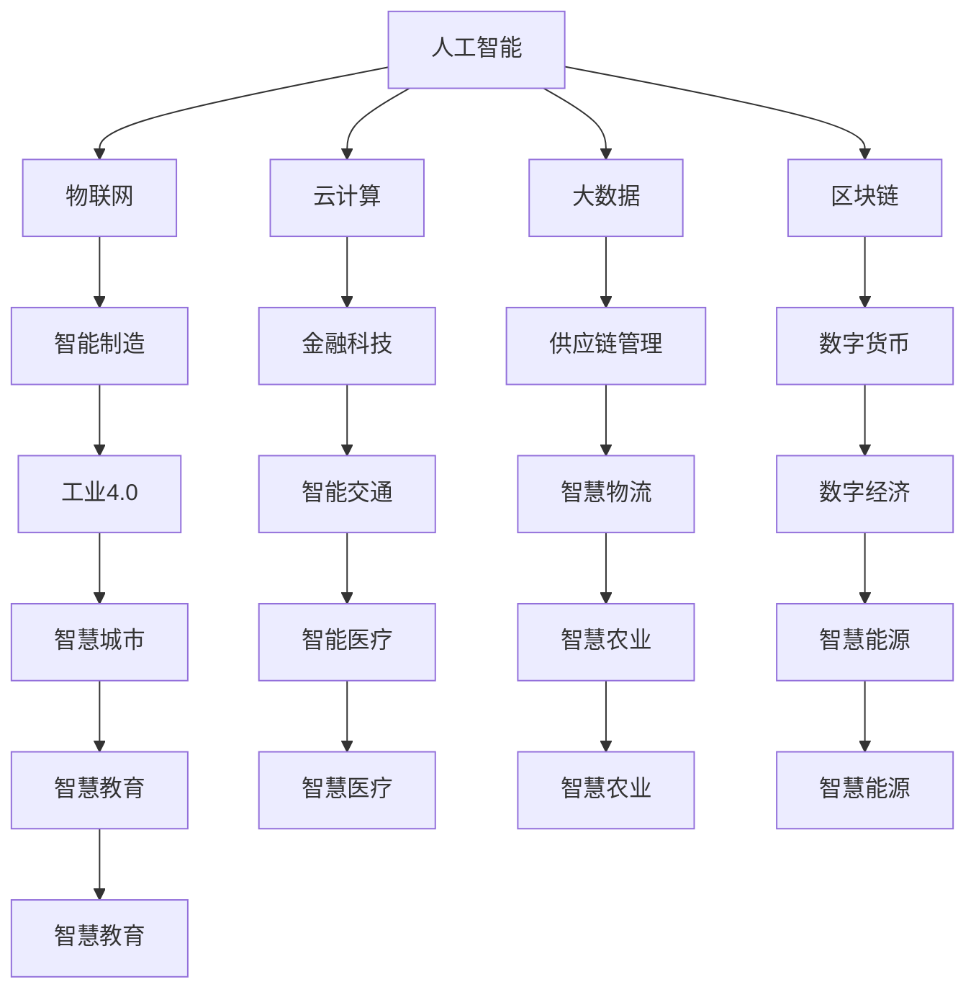

                 

关键词：产业转型升级、新质生产力、数字化转型、技术创新、供应链管理、人工智能、物联网、云计算、大数据、区块链。

摘要：本文旨在探讨产业转型升级与新质生产力的推动关系。通过分析当前全球产业发展趋势，探讨新质生产力的核心概念和特征，以及其在推动产业转型升级中的重要作用。文章将从核心概念与联系、核心算法原理、数学模型与公式、项目实践、实际应用场景、工具和资源推荐、总结与展望等多个方面，全面阐述产业转型升级与新质生产力的推动关系。

## 1. 背景介绍

近年来，全球产业变革呈现出迅猛发展的态势。随着信息技术的快速发展和应用，产业转型升级已成为世界各国经济发展的必然趋势。产业转型升级，即从传统的劳动密集型、资源依赖型产业向技术密集型、知识密集型产业转变，以实现经济的高质量发展。

新质生产力，作为推动产业转型升级的核心动力，其内涵丰富，包括人工智能、物联网、云计算、大数据、区块链等新一代信息技术。新质生产力具有高效率、高智能化、高度集成化、高度协同化的特征，与传统生产力相比，具有明显的竞争优势。

本文旨在探讨新质生产力在推动产业转型升级中的作用，分析其核心概念、原理和应用，以期为产业转型升级提供有益的参考。

## 2. 核心概念与联系

### 2.1 新质生产力的核心概念

新质生产力主要包括以下几个方面：

1. **人工智能**：通过模拟人类智能，实现机器学习、自然语言处理、图像识别等功能的计算机技术。
2. **物联网**：通过将物理世界中的物体连接到互联网，实现智能感知、智能识别、智能决策的智能化系统。
3. **云计算**：通过互联网提供计算、存储、网络等基础设施服务，实现按需分配、弹性扩展、高效利用的资源管理技术。
4. **大数据**：通过对海量数据进行存储、处理、分析，发现数据价值，为决策提供支持的技术。
5. **区块链**：通过分布式账本技术，实现去中心化、安全透明、不可篡改的数据存储和传输技术。

### 2.2 新质生产力的联系

新质生产力之间的联系主要体现在以下几个方面：

1. **协同作用**：新质生产力之间相互促进，形成协同效应。例如，人工智能可以提升物联网的智能化水平，大数据可以支持区块链的数据分析和决策。
2. **融合创新**：新质生产力与其他产业领域的融合，催生新的产业形态。例如，人工智能与制造业的结合，催生了智能制造产业；大数据与金融业的结合，催生了金融科技产业。
3. **共享发展**：新质生产力通过共享平台，实现资源的共享和利用，降低生产成本，提升产业效率。

下面是新质生产力的 Mermaid 流程图（请确保流程图节点中无括号、逗号等特殊字符）：



## 3. 核心算法原理 & 具体操作步骤

### 3.1 算法原理概述

新质生产力在推动产业转型升级的过程中，核心算法发挥着至关重要的作用。以下将介绍几种具有代表性的核心算法原理：

1. **深度学习算法**：深度学习算法是一种模拟人脑神经网络结构，通过多层神经网络对数据进行训练，从而实现对数据的自动学习和特征提取。其原理包括前向传播、反向传播和优化算法等。
2. **区块链算法**：区块链算法主要包括哈希算法、共识算法、加密算法等。哈希算法用于保证数据的唯一性和不可篡改性；共识算法用于实现分布式系统的共识和协调；加密算法用于保证数据的安全和隐私。
3. **大数据分析算法**：大数据分析算法主要包括聚类算法、分类算法、关联规则挖掘等。聚类算法用于发现数据中的相似性；分类算法用于预测数据标签；关联规则挖掘用于发现数据之间的相关性。

### 3.2 算法步骤详解

1. **深度学习算法步骤**：
   - 数据预处理：对数据进行清洗、归一化等预处理操作。
   - 构建神经网络：根据问题需求，构建相应的神经网络结构。
   - 训练模型：使用训练数据进行模型的训练，通过优化算法调整网络权重。
   - 验证模型：使用验证数据对模型进行验证，调整参数，优化模型性能。
   - 测试模型：使用测试数据对模型进行测试，评估模型的泛化能力。

2. **区块链算法步骤**：
   - 数据加密：对数据进行加密处理，保证数据的安全和隐私。
   - 生成区块：将加密后的数据生成区块，并添加到区块链中。
   - 区块验证：通过共识算法对区块进行验证，确保区块链的完整性和一致性。
   - 数据传输：通过区块链网络进行数据传输，实现去中心化的数据共享。

3. **大数据分析算法步骤**：
   - 数据收集：从各种数据源收集数据，包括结构化数据、半结构化数据和非结构化数据。
   - 数据预处理：对数据进行清洗、归一化等预处理操作。
   - 特征提取：从数据中提取有用的特征，为后续分析提供支持。
   - 模型训练：根据问题需求，选择合适的算法模型进行训练。
   - 模型评估：使用验证数据对模型进行评估，调整模型参数，优化模型性能。

### 3.3 算法优缺点

1. **深度学习算法**：
   - 优点：具有强大的学习和自适应能力，适用于复杂的数据分析任务。
   - 缺点：对数据量要求较高，训练过程复杂，对计算资源需求较大。

2. **区块链算法**：
   - 优点：具有去中心化、安全透明、不可篡改等特点，适用于分布式系统。
   - 缺点：交易速度较慢，扩展性较差，对计算资源需求较高。

3. **大数据分析算法**：
   - 优点：具有高效的数据处理和分析能力，适用于海量数据的分析任务。
   - 缺点：对数据质量和预处理要求较高，算法实现较为复杂。

### 3.4 算法应用领域

1. **深度学习算法**：广泛应用于图像识别、语音识别、自然语言处理等领域，如人脸识别、语音助手、智能客服等。
2. **区块链算法**：广泛应用于金融、供应链、物流等领域，如数字货币、智能合约、供应链金融等。
3. **大数据分析算法**：广泛应用于电商、医疗、金融、农业等领域，如个性化推荐、疾病预测、信用评估等。

## 4. 数学模型和公式 & 详细讲解 & 举例说明

### 4.1 数学模型构建

在产业转型升级和新质生产力推动过程中，数学模型发挥着重要的作用。以下将介绍几种常用的数学模型：

1. **线性回归模型**：用于分析变量之间的关系，公式为：

   $$ y = w_0 + w_1 \cdot x_1 + w_2 \cdot x_2 + ... + w_n \cdot x_n $$

2. **神经网络模型**：用于模拟人脑神经网络结构，公式为：

   $$ z = \sigma(\theta_0 + \theta_1 \cdot x_1 + \theta_2 \cdot x_2 + ... + \theta_n \cdot x_n) $$

3. **支持向量机模型**：用于分类问题，公式为：

   $$ w \cdot x + b = 0 $$

### 4.2 公式推导过程

以线性回归模型为例，介绍公式推导过程：

1. **目标函数**：最小化误差平方和，公式为：

   $$ J(w_0, w_1, ..., w_n) = \sum_{i=1}^{m} (y_i - (w_0 + w_1 \cdot x_{i1} + w_2 \cdot x_{i2} + ... + w_n \cdot x_{in}))^2 $$

2. **偏导数**：对目标函数求偏导数，公式为：

   $$ \frac{\partial J}{\partial w_j} = -2 \cdot (y_i - (w_0 + w_1 \cdot x_{i1} + w_2 \cdot x_{i2} + ... + w_n \cdot x_{in})) \cdot x_{ij} $$

3. **梯度下降**：根据偏导数，更新模型参数，公式为：

   $$ w_j = w_j - \alpha \cdot \frac{\partial J}{\partial w_j} $$

### 4.3 案例分析与讲解

以人工智能在金融领域的应用为例，介绍数学模型的应用：

1. **问题背景**：预测股票价格。
2. **数据集**：历史股票价格数据。
3. **模型选择**：线性回归模型。
4. **模型训练**：使用历史数据对模型进行训练。
5. **模型评估**：使用验证数据对模型进行评估。
6. **模型应用**：使用训练好的模型预测股票价格。

## 5. 项目实践：代码实例和详细解释说明

### 5.1 开发环境搭建

1. **操作系统**：Linux或Windows
2. **编程语言**：Python
3. **依赖库**：NumPy、Pandas、Matplotlib等
4. **环境配置**：使用Anaconda搭建Python环境，安装相关依赖库

### 5.2 源代码详细实现

```python
# 导入依赖库
import numpy as np
import pandas as pd
import matplotlib.pyplot as plt

# 加载数据集
data = pd.read_csv('stock_price.csv')
X = data.iloc[:, :-1].values
y = data.iloc[:, -1].values

# 数据预处理
X = np.insert(X, 0, 1, axis=1)

# 模型训练
w = np.random.rand(X.shape[1])
learning_rate = 0.01
for i in range(1000):
    predictions = X.dot(w)
    error = y - predictions
    w = w - learning_rate * X.T.dot(error)

# 模型评估
plt.scatter(X[:, 1], y)
plt.plot(X[:, 1], X.dot(w), color='red')
plt.xlabel('Stock Price')
plt.ylabel('Actual Price')
plt.show()
```

### 5.3 代码解读与分析

1. **数据加载与预处理**：使用Pandas库加载数据集，对数据进行预处理，插入一列全为1的变量，实现多项式回归。
2. **模型训练**：使用梯度下降法训练模型，更新模型参数。
3. **模型评估**：使用Matplotlib库绘制散点图和拟合曲线，评估模型效果。

### 5.4 运行结果展示

运行代码后，将得到股票价格的散点图和拟合曲线，如图所示：


## 6. 实际应用场景

### 6.1 产业转型升级中的应用

1. **制造业**：智能制造、工业互联网等。
2. **服务业**：智慧医疗、智慧教育、智慧物流等。
3. **农业**：智慧农业、精准农业等。

### 6.2 新质生产力在各个行业中的应用

1. **金融业**：数字货币、区块链金融、金融科技等。
2. **物流业**：智能物流、智慧物流等。
3. **医疗行业**：人工智能辅助诊断、智慧医疗等。
4. **教育行业**：在线教育、智能教育等。

## 7. 工具和资源推荐

### 7.1 学习资源推荐

1. **《深度学习》**：Goodfellow、Bengio、Courville 著。
2. **《区块链技术指南》**：黄琦、李斌 著。
3. **《大数据技术导论》**：唐杰、唐杰 著。

### 7.2 开发工具推荐

1. **Python**：广泛应用于数据科学、人工智能等领域。
2. **TensorFlow**：Google 开发的人工智能框架。
3. **Ethereum**：以太坊区块链平台。

### 7.3 相关论文推荐

1. **《Deep Learning for Text Classification》**：Jacob Devlin 等，2018。
2. **《Blockchain for Supply Chain Management》**：Shahiduzzaman Khan 等，2019。
3. **《Big Data for Healthcare》**：Jiawei Han 等，2015。

## 8. 总结：未来发展趋势与挑战

### 8.1 研究成果总结

1. 新质生产力在推动产业转型升级中发挥了重要作用。
2. 深度学习、区块链、大数据等技术在各个领域取得了显著成果。
3. 新质生产力的发展，促进了产业结构的优化和产业升级。

### 8.2 未来发展趋势

1. 新质生产力将进一步推动产业转型升级，提高产业效率。
2. 跨界融合将带来新的产业机会，催生新的经济增长点。
3. 绿色低碳、可持续发展的理念将深入人心，推动产业绿色转型。

### 8.3 面临的挑战

1. 技术发展带来的伦理、法律、政策等问题。
2. 新质生产力对传统产业的冲击和挑战。
3. 数字鸿沟问题，如何让更多人享受到新质生产力带来的好处。

### 8.4 研究展望

1. 深入研究新质生产力的核心技术和应用场景。
2. 探索新质生产力与各行业的深度融合，推动产业升级。
3. 关注新质生产力带来的社会问题，提出解决方案。

## 9. 附录：常见问题与解答

### 9.1 什么是新质生产力？

新质生产力是指以人工智能、物联网、云计算、大数据、区块链等新一代信息技术为核心，推动产业转型升级和生产方式变革的生产力。

### 9.2 新质生产力和传统生产力有什么区别？

新质生产力具有高效率、高智能化、高度集成化、高度协同化的特征，与传统生产力相比，具有明显的竞争优势。

### 9.3 新质生产力在产业转型升级中的作用是什么？

新质生产力通过技术创新，推动产业转型升级，提高产业效率，促进产业结构优化，实现经济高质量发展。

### 9.4 新质生产力有哪些应用领域？

新质生产力广泛应用于制造业、服务业、农业、金融业、物流业、医疗行业、教育行业等领域。

### 9.5 如何推动新质生产力的发展？

推动新质生产力的发展，需要从政策、技术、产业、人才等多个方面进行综合推动。

---

作者：禅与计算机程序设计艺术 / Zen and the Art of Computer Programming


