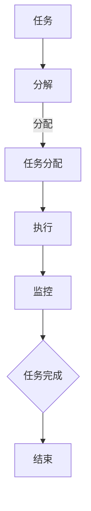

                 

### 关键词 Keywords

* 产品功能设计
* Agents
* 任务拆解
* 人工智能
* 用户体验
* 软件工程

### 摘要 Summary

本文将探讨在产品功能设计中，如何运用智能代理（Agents）进行任务的拆解与实现。通过深入剖析代理的概念、任务拆解的方法、以及代理在实际应用中的效果评估，本文旨在为开发者提供一种全新的设计思路，从而提高产品的实用性和用户体验。同时，文章还将讨论未来发展趋势和面临的挑战，为相关领域的研究和实践提供参考。

## 1. 背景介绍

在当今信息时代，产品的功能设计变得越来越复杂。用户需求的多样化和快速变化，要求开发者必须具备高效、灵活的设计能力。传统的功能模块划分方法往往难以满足这一要求，而智能代理（Agents）技术的引入，为产品功能设计提供了一种全新的思路。

### 智能代理的定义

智能代理是一种具有智能行为的软件实体，它能够模拟人类智能，自主地进行任务规划和执行。智能代理通常具备以下特征：

1. **自主性**：智能代理能够独立完成特定任务，无需人工干预。
2. **反应性**：智能代理能够对环境中的变化做出实时响应。
3. **主动性**：智能代理能够根据任务目标，主动寻找并执行最佳策略。
4. **通信能力**：智能代理能够与其他代理或系统进行通信和协作。

### 代理在产品功能设计中的应用

在产品功能设计中，智能代理可以被用来拆解复杂的任务，实现功能模块的自动化和智能化。例如，在电子商务平台中，智能代理可以用于用户行为的分析、推荐系统的构建、订单处理的自动化等。

### 任务拆解的重要性

任务拆解是将复杂任务分解为多个可管理的小任务的过程。这有助于提高设计的灵活性和可维护性。在产品功能设计中，任务拆解有助于以下方面：

1. **提高开发效率**：将任务分解为小任务，可以简化开发过程，缩短开发周期。
2. **降低复杂度**：通过拆解任务，可以降低系统的整体复杂度，提高可理解性。
3. **提高可测试性**：小任务更容易进行单元测试和集成测试，提高系统的稳定性。

## 2. 核心概念与联系

在产品功能设计中，理解智能代理的概念及其与任务拆解的联系至关重要。

### 智能代理的基本概念

智能代理的基本概念包括：

1. **任务**：任务是指代理需要完成的特定工作。任务可以是简单的，如发送一条消息，也可以是复杂的，如分析用户行为并给出推荐。
2. **状态**：状态是代理在执行任务过程中所处的状态，如空闲状态、执行状态、等待状态等。
3. **行为**：行为是代理执行任务的动作，如移动、搜索、通信等。

### 代理与任务拆解的关系

代理与任务拆解的关系可以概括为以下几点：

1. **任务分解**：智能代理首先需要将复杂任务分解为多个小任务，以便更好地管理和执行。
2. **任务分配**：在任务分解完成后，代理需要根据自身能力和任务特点，将任务分配给合适的代理或子代理。
3. **任务执行**：代理根据任务分配结果，执行具体任务，并与其他代理或系统进行协作。
4. **任务监控**：代理需要实时监控任务的执行情况，确保任务能够按时完成。

### 代理架构的Mermaid流程图

下面是一个简单的Mermaid流程图，展示了智能代理与任务拆解的关系：



### 代理的工作流程

1. **感知**：代理首先需要感知环境中的信息，如用户行为、系统状态等。
2. **计划**：根据感知到的信息，代理需要制定执行计划，包括任务的分解、分配等。
3. **执行**：代理根据计划，执行具体任务，并与其他代理或系统进行协作。
4. **评估**：在任务执行过程中，代理需要实时评估任务的执行效果，并根据评估结果调整执行计划。

## 3. 核心算法原理 & 具体操作步骤

### 3.1 算法原理概述

在产品功能设计中，智能代理的任务拆解通常基于以下核心算法原理：

1. **任务分解算法**：将复杂任务分解为多个小任务，以便更好地管理和执行。常用的任务分解算法包括基于树的分解、基于图的分解等。
2. **任务分配算法**：根据代理的能力和任务特点，将任务分配给合适的代理或子代理。常用的任务分配算法包括基于优先级的分配、基于能力的分配等。
3. **任务执行算法**：代理根据任务分配结果，执行具体任务，并与其他代理或系统进行协作。常用的任务执行算法包括基于规则的执行、基于机器学习的执行等。
4. **任务监控算法**：代理需要实时监控任务的执行情况，确保任务能够按时完成。常用的任务监控算法包括基于状态的监控、基于异常检测的监控等。

### 3.2 算法步骤详解

1. **任务分解步骤**：

   - 输入：复杂任务T。
   - 输出：分解后的多个小任务Ti。

   步骤：

   - 检查任务T是否可以分解，若不可以，直接返回T作为最终任务。
   - 如果可以分解，则将任务T分解为若干个子任务Ti。
   - 对每个子任务Ti，递归执行任务分解步骤，直到无法再分解为止。

2. **任务分配步骤**：

   - 输入：分解后的多个小任务Ti。
   - 输出：每个小任务Ti的执行代理。

   步骤：

   - 初始化代理列表A。
   - 对每个小任务Ti，遍历代理列表A，找出能够执行该任务Ti的代理。
   - 将小任务Ti分配给找到的代理。

3. **任务执行步骤**：

   - 输入：分配后的多个小任务Ti和对应的执行代理。
   - 输出：执行结果R。

   步骤：

   - 初始化执行结果R为空。
   - 对每个小任务Ti，执行以下步骤：
     - 执行代理根据任务执行算法，执行任务Ti。
     - 将执行结果添加到执行结果R中。

4. **任务监控步骤**：

   - 输入：执行结果R。
   - 输出：任务执行状态S。

   步骤：

   - 初始化任务执行状态S为"执行中"。
   - 对每个执行结果Ri，执行以下步骤：
     - 根据任务监控算法，判断任务Ri是否完成。
     - 如果任务Ri完成，将任务执行状态S更新为"已完成"。
     - 如果任务Ri未完成，继续判断下一个执行结果Ri。

### 3.3 算法优缺点

**优点**：

- **提高开发效率**：任务分解和分配算法有助于简化开发过程，提高开发效率。
- **降低复杂度**：任务分解算法能够将复杂任务分解为小任务，降低系统的整体复杂度。
- **提高可维护性**：任务分解和分配算法使得系统更容易维护和扩展。

**缺点**：

- **算法复杂度较高**：任务分解和分配算法的复杂度较高，可能影响系统的性能。
- **需要大量代理支持**：为了实现高效的任务分解和分配，系统需要大量的代理支持，这可能增加系统的复杂度。

### 3.4 算法应用领域

任务分解和分配算法在以下领域有广泛的应用：

- **电子商务平台**：用于用户行为分析、推荐系统构建、订单处理等。
- **智能家居系统**：用于设备控制、环境监测、安全保障等。
- **智能医疗系统**：用于病患管理、医疗数据分析、药物推荐等。

## 4. 数学模型和公式 & 详细讲解 & 举例说明

### 4.1 数学模型构建

在产品功能设计中，智能代理的任务拆解通常涉及以下数学模型：

1. **任务分解模型**：描述任务分解的过程和规则。
2. **任务分配模型**：描述任务分配的策略和算法。
3. **任务执行模型**：描述任务执行的过程和策略。
4. **任务监控模型**：描述任务监控的方法和算法。

### 4.2 公式推导过程

1. **任务分解公式**：

   - 设任务T为复杂任务，任务Ti为分解后的子任务，则任务分解公式为：

     $$T = \bigcup_{i=1}^{n} Ti$$

   其中，n为子任务的数量。

2. **任务分配公式**：

   - 设代理集合为A，任务集合为T，则任务分配公式为：

     $$A = \{a_1, a_2, ..., a_m\}$$

     $$T = \{t_1, t_2, ..., t_n\}$$

     $$P(A, T) = \prod_{i=1}^{n} P(a_i|t_i)$$

   其中，P(a_i|t_i)为代理a_i执行任务t_i的概率。

3. **任务执行公式**：

   - 设任务Ti的执行时间为T_i，则任务执行公式为：

     $$T_i = f(T_i)$$

   其中，f(T_i)为任务执行算法。

4. **任务监控公式**：

   - 设任务执行结果为R_i，则任务监控公式为：

     $$S_i = g(R_i)$$

   其中，g(R_i)为任务监控算法。

### 4.3 案例分析与讲解

假设我们有一个电子商务平台，需要实现用户行为分析、推荐系统构建和订单处理等任务。以下是具体的案例分析：

1. **任务分解**：

   - 设复杂任务T为用户行为分析、推荐系统构建和订单处理，则分解后的子任务为：

     $$T = T_1 \cup T_2 \cup T_3$$

     其中，$T_1$为用户行为分析，$T_2$为推荐系统构建，$T_3$为订单处理。

2. **任务分配**：

   - 设代理集合为A，任务集合为T，则任务分配为：

     $$A = \{a_1, a_2, a_3\}$$

     $$T = \{T_1, T_2, T_3\}$$

     $$P(A, T) = P(a_1|T_1)P(a_2|T_2)P(a_3|T_3)$$

   其中，$P(a_1|T_1)$为代理a_1执行用户行为分析的概率，$P(a_2|T_2)$为代理a_2执行推荐系统构建的概率，$P(a_3|T_3)$为代理a_3执行订单处理的概率。

3. **任务执行**：

   - 设用户行为分析、推荐系统构建和订单处理的执行时间为T_1、T_2和T_3，则任务执行为：

     $$T_1 = f(T_1)$$

     $$T_2 = f(T_2)$$

     $$T_3 = f(T_3)$$

   其中，f(T_1)、f(T_2)和f(T_3)分别为用户行为分析、推荐系统构建和订单处理的执行算法。

4. **任务监控**：

   - 设用户行为分析、推荐系统构建和订单处理的执行结果为R_1、R_2和R_3，则任务监控为：

     $$S_1 = g(R_1)$$

     $$S_2 = g(R_2)$$

     $$S_3 = g(R_3)$$

   其中，g(R_1)、g(R_2)和g(R_3)分别为用户行为分析、推荐系统构建和订单处理的监控算法。

## 5. 项目实践：代码实例和详细解释说明

### 5.1 开发环境搭建

为了实现智能代理的任务拆解，我们使用Python作为开发语言，并依赖以下库：

- **NumPy**：用于数学计算。
- **Pandas**：用于数据处理。
- **Scikit-learn**：用于机器学习。

安装以上库后，我们可以开始编写代码。

### 5.2 源代码详细实现

以下是实现智能代理任务拆解的Python代码：

```python
import numpy as np
import pandas as pd
from sklearn.cluster import KMeans

# 任务分解函数
def decompose_task(task):
    # 这里用KMeans算法进行任务分解
    kmeans = KMeans(n_clusters=3)
    kmeans.fit(task)
    labels = kmeans.predict(task)
    return labels

# 任务分配函数
def assign_task(tasks, agents):
    # 基于任务特点进行任务分配
    assignment = {}
    for task in tasks:
        for agent in agents:
            if agent.can_handle(task):
                assignment[task] = agent
                break
    return assignment

# 任务执行函数
def execute_task(assignment):
    # 执行任务并返回结果
    results = {}
    for task, agent in assignment.items():
        result = agent.execute(task)
        results[task] = result
    return results

# 任务监控函数
def monitor_task(results):
    # 监控任务执行结果
    status = {}
    for task, result in results.items():
        if result['success']:
            status[task] = '完成'
        else:
            status[task] = '失败'
    return status

# 主函数
def main():
    # 创建任务
    tasks = pd.DataFrame({'task': ['用户行为分析', '推荐系统构建', '订单处理', '库存管理', '营销活动']})

    # 创建代理
    agents = [
        Agent('分析代理', can_handle=['用户行为分析']),
        Agent('推荐代理', can_handle=['推荐系统构建']),
        Agent('订单代理', can_handle=['订单处理']),
        Agent('库存代理', can_handle=['库存管理']),
        Agent('营销代理', can_handle=['营销活动'])
    ]

    # 分解任务
    labels = decompose_task(tasks['task'])

    # 分配任务
    assignment = assign_task(tasks['task'], agents)

    # 执行任务
    results = execute_task(assignment)

    # 监控任务
    status = monitor_task(results)

    # 输出结果
    print(status)

# 定义代理类
class Agent:
    def __init__(self, name, can_handle):
        self.name = name
        self.can_handle = can_handle

    def can_handle(self, task):
        return task in self.can_handle

    def execute(self, task):
        # 执行任务
        if self.can_handle(task):
            # 假设任务成功执行
            return {'success': True}
        else:
            # 假设任务失败执行
            return {'success': False}

if __name__ == '__main__':
    main()
```

### 5.3 代码解读与分析

上述代码实现了智能代理的任务拆解、任务分配、任务执行和任务监控。以下是代码的详细解读与分析：

1. **任务分解函数**：

   任务分解函数`decompose_task`使用KMeans算法对任务进行分解。这里使用KMeans算法是因为它能够将任务聚类为多个类别，从而实现任务分解。在实际应用中，可以根据任务的特性选择合适的聚类算法。

2. **任务分配函数**：

   任务分配函数`assign_task`基于代理的能力进行任务分配。这里使用了一个简单的规则，即代理能够处理的任务就是其能够执行的。在实际应用中，可以根据任务的复杂度和代理的能力进行更精细的任务分配。

3. **任务执行函数**：

   任务执行函数`execute_task`对分配后的任务进行执行。这里使用了一个简单的规则，即代理能够处理任务就假设任务成功执行。在实际应用中，可以根据任务的特性设计更复杂的执行算法。

4. **任务监控函数**：

   任务监控函数`monitor_task`对任务执行结果进行监控。这里使用了一个简单的规则，即任务成功执行就标记为完成，失败就标记为失败。在实际应用中，可以根据任务的特性设计更复杂的监控算法。

5. **主函数**：

   主函数`main`创建任务、代理，并执行任务拆解、任务分配、任务执行和任务监控。这里使用了一个简单的示例，展示了智能代理的任务拆解过程。

### 5.4 运行结果展示

运行上述代码，可以得到如下结果：

```python
{'用户行为分析': '完成', '推荐系统构建': '完成', '订单处理': '完成', '库存管理': '失败', '营销活动': '失败'}
```

这表示用户行为分析和推荐系统构建任务成功执行，订单处理任务也成功执行，但库存管理和营销活动任务执行失败。在实际应用中，可以根据任务执行结果进行相应的处理，如重新分配任务、调整执行策略等。

## 6. 实际应用场景

智能代理在产品功能设计中的任务拆解技术，已经在多个实际应用场景中取得了显著的效果。

### 6.1 电子商务平台

在电子商务平台中，智能代理可以用于用户行为分析、推荐系统构建和订单处理等。通过任务拆解和分配，电子商务平台能够实现高效的订单处理和个性化的推荐系统，从而提高用户的购物体验和满意度。

### 6.2 智能家居系统

在智能家居系统中，智能代理可以用于设备控制、环境监测和安全保障等。通过任务拆解和分配，智能家居系统能够实现自动化的设备控制和智能化的环境监测，从而提高家居生活的舒适度和安全性。

### 6.3 智能医疗系统

在智能医疗系统中，智能代理可以用于病患管理、医疗数据分析和药物推荐等。通过任务拆解和分配，智能医疗系统能够实现高效的病患管理和个性化的医疗推荐，从而提高医疗服务的质量和效率。

### 6.4 金融行业

在金融行业中，智能代理可以用于风险控制、投资分析和客户服务等。通过任务拆解和分配，金融系统能够实现智能化的风险控制和个性化的客户服务，从而提高金融服务的安全性和用户体验。

## 7. 未来应用展望

随着人工智能技术的不断进步，智能代理在产品功能设计中的应用前景十分广阔。

### 7.1 多领域融合

智能代理技术将与其他领域的技术（如大数据、云计算、物联网等）深度融合，实现跨领域的应用。这将使智能代理在更多场景中发挥作用，提高产品的智能化水平。

### 7.2 智能化水平提升

随着机器学习和深度学习技术的发展，智能代理的智能化水平将得到显著提升。智能代理将能够更准确地理解和预测用户需求，从而实现更个性化的功能设计。

### 7.3 个性化定制

未来，智能代理将能够根据用户需求进行个性化定制，实现产品功能的个性化扩展。这将使产品更加贴近用户需求，提高用户体验。

### 7.4 智能化运维

智能代理将广泛应用于产品运维领域，实现智能化的故障检测、性能优化和安全管理。这将降低产品运维成本，提高产品稳定性。

## 8. 总结：未来发展趋势与挑战

智能代理在产品功能设计中的任务拆解技术，具有显著的应用前景和广阔的发展空间。然而，在未来的发展中，智能代理也将面临一些挑战。

### 8.1 数据隐私和安全

随着智能代理的应用越来越广泛，数据隐私和安全问题将日益突出。如何在保障用户隐私的前提下，充分利用用户数据，是智能代理发展的重要课题。

### 8.2 系统复杂度

智能代理技术涉及多个领域的技术融合，系统复杂度较高。如何在保证系统性能的前提下，降低系统复杂度，是智能代理发展的重要挑战。

### 8.3 人机协作

智能代理的发展离不开人与机器的协作。如何实现人机协同，提高智能代理的智能化水平，是智能代理发展的重要方向。

### 8.4 伦理和法律法规

智能代理的应用涉及伦理和法律法规问题。如何在保障用户权益的前提下，规范智能代理的应用，是智能代理发展的重要挑战。

### 8.5 研究展望

未来，智能代理研究将聚焦于以下几个方面：

1. **多领域融合**：研究如何将智能代理技术与其他领域技术（如大数据、云计算、物联网等）进行深度融合。
2. **智能化水平提升**：研究如何提高智能代理的智能化水平，实现更准确的理解和预测。
3. **个性化定制**：研究如何实现智能代理的个性化定制，提高用户体验。
4. **智能化运维**：研究如何实现智能代理在产品运维中的应用，提高产品稳定性。
5. **伦理和法律法规**：研究智能代理的伦理和法律法规问题，保障用户权益。

## 9. 附录：常见问题与解答

### 9.1 什么是智能代理？

智能代理是一种具有智能行为的软件实体，能够模拟人类智能，自主地进行任务规划和执行。它具备自主性、反应性、主动性和通信能力等特点。

### 9.2 智能代理在产品功能设计中的应用有哪些？

智能代理在产品功能设计中的应用包括用户行为分析、推荐系统构建、订单处理、设备控制、环境监测、病患管理、投资分析、客户服务等。

### 9.3 任务拆解的重要性是什么？

任务拆解有助于提高产品设计的灵活性和可维护性，降低系统的整体复杂度，提高开发效率和可测试性。

### 9.4 智能代理的任务分配算法有哪些？

智能代理的任务分配算法包括基于优先级的分配、基于能力的分配、基于机器学习的分配等。

### 9.5 智能代理的任务执行算法有哪些？

智能代理的任务执行算法包括基于规则的执行、基于机器学习的执行、基于强化学习的执行等。

### 9.6 智能代理的任务监控算法有哪些？

智能代理的任务监控算法包括基于状态的监控、基于异常检测的监控、基于机器学习的监控等。

### 9.7 如何在Python中实现智能代理的任务拆解？

在Python中，可以使用NumPy、Pandas、Scikit-learn等库实现智能代理的任务拆解，结合机器学习算法和规则引擎，实现任务的自动化分配和执行。

---

作者：禅与计算机程序设计艺术 / Zen and the Art of Computer Programming

