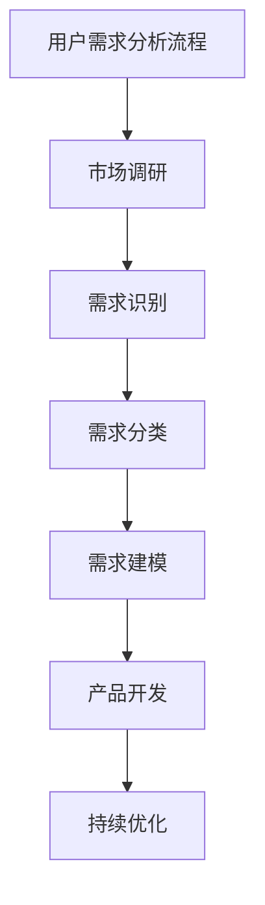

                 

关键词：用户需求分析、产品开发、市场调研、用户体验、需求建模

> 摘要：本文旨在深入探讨产品开发的用户需求分析过程，从市场调研、需求识别、需求分类到需求建模等多个方面，详细阐述了如何有效地理解和满足用户需求，从而开发出更加贴合市场、更具竞争力的产品。

## 1. 背景介绍

在当今高速发展的信息时代，产品的迭代速度越来越快，市场竞争愈发激烈。产品开发不仅仅是技术层面的挑战，更是对市场洞察和用户需求的深刻理解。用户需求分析作为产品开发的关键环节，直接影响着产品的成功与否。因此，如何有效地进行用户需求分析，成为了产品开发过程中的首要任务。

用户需求分析不仅包括对用户需求的识别和分类，还涉及到如何将用户需求转化为具体的产品功能，并在整个产品生命周期中持续跟踪和优化。本文将围绕这一主题，探讨用户需求分析的理论和实践方法。

## 2. 核心概念与联系

在进行用户需求分析之前，我们需要理解几个核心概念：

### 2.1 用户需求

用户需求是指用户在特定情境下为了解决问题或满足某种愿望而期望获得的功能、特性或服务。

### 2.2 用户

用户是指使用产品或服务的个人或团体，他们是产品开发过程中的核心。

### 2.3 需求识别

需求识别是指通过市场调研、用户访谈、问卷调查等方式，发现并确定用户需求的过程。

### 2.4 需求分类

需求分类是指根据需求的类型、重要性和优先级，对需求进行系统化的整理和分类。

### 2.5 需求建模

需求建模是指通过建立模型来表示和分析用户需求，以便更好地理解和满足用户需求。

下面是一个用Mermaid绘制的需求分析流程图：



## 3. 核心算法原理 & 具体操作步骤

### 3.1 算法原理概述

用户需求分析的核心算法原理主要包括以下几个方面：

- **数据收集**：通过多种渠道收集用户行为数据、市场趋势数据等。
- **数据分析**：对收集到的数据进行分析，识别出用户的主要需求和问题。
- **需求建模**：使用实体-关系模型（ER模型）或其他适当的模型来表示用户需求。

### 3.2 算法步骤详解

#### 3.2.1 市场调研

1. 确定调研目标：明确要解决的问题或要达成的目标。
2. 选择调研方法：根据目标选择合适的调研方法，如问卷调查、用户访谈、焦点小组讨论等。
3. 进行数据收集：根据调研方法实施数据收集，确保数据的真实性和有效性。
4. 数据整理：对收集到的数据进行分析，提取有用的信息。

#### 3.2.2 需求识别

1. 数据分析：对市场调研得到的数据进行深入分析，识别出用户需求。
2. 需求验证：通过用户反馈、专家评审等方式验证识别出的需求是否真正反映了用户的需求。

#### 3.2.3 需求分类

1. 分类标准：根据需求的类型、优先级、功能模块等因素进行分类。
2. 分类实施：将识别出的需求按照分类标准进行系统化的整理。

#### 3.2.4 需求建模

1. 选择模型：根据项目特点和需求类型选择合适的模型，如实体-关系模型、用户故事地图等。
2. 建模实施：使用选定的模型对需求进行建模，确保模型的准确性和完整性。

### 3.3 算法优缺点

#### 优点

- **针对性**：能够针对用户的具体需求进行产品设计，提高产品的实用性。
- **系统性**：通过系统化的需求分类和建模，确保需求分析的全面性和准确性。

#### 缺点

- **时间成本**：需求分析是一个耗时的过程，需要投入大量时间和人力资源。
- **不确定性**：用户需求可能会发生变化，需要持续进行需求分析。

### 3.4 算法应用领域

用户需求分析广泛应用于各种产品开发领域，如：

- **软件产品**：包括操作系统、应用程序、Web服务等。
- **硬件产品**：如智能家居设备、医疗设备等。
- **服务产品**：如旅游服务、金融服务等。

## 4. 数学模型和公式 & 详细讲解 & 举例说明

### 4.1 数学模型构建

用户需求分析中的数学模型通常基于实体-关系模型。实体表示用户需求，关系表示需求之间的关联。以下是一个简单的数学模型示例：

$$
\text{需求} = \{ \text{需求1}, \text{需求2}, \ldots, \text{需求n} \}
$$

$$
\text{关系} = \{ \text{需求1与需求2相关}, \text{需求2与需求3依赖}, \ldots \}
$$

### 4.2 公式推导过程

假设我们有 m 个用户需求，每个需求有 p 个属性，可以使用以下公式推导出需求矩阵：

$$
\text{需求矩阵} = \left[ \begin{matrix}
\text{需求1属性1} & \text{需求1属性2} & \ldots & \text{需求1属性p} \\
\text{需求2属性1} & \text{需求2属性2} & \ldots & \text{需求2属性p} \\
\vdots & \vdots & \ddots & \vdots \\
\text{需求m属性1} & \text{需求m属性2} & \ldots & \text{需求m属性p}
\end{matrix} \right]
$$

### 4.3 案例分析与讲解

#### 案例背景

某公司正在开发一款智能家居控制系统，通过市场调研和用户访谈，确定了以下用户需求：

- **需求1**：远程控制家中的灯光。
- **需求2**：自动调节家中的温度。
- **需求3**：监控家中安全。

#### 案例分析

1. **需求矩阵构建**：

   $$  
   \text{需求矩阵} = \left[ \begin{matrix}
   \text{需求1属性1} & \text{需求1属性2} & \ldots & \text{需求1属性p} \\
   \text{需求2属性1} & \text{需求2属性2} & \ldots & \text{需求2属性p} \\
   \text{需求3属性1} & \text{需求3属性2} & \ldots & \text{需求3属性p}
   \end{matrix} \right]
   $$

2. **需求关系分析**：

   - 需求1与需求2相关，因为用户希望家中的灯光和温度可以联动控制。
   - 需求2与需求3依赖，因为用户希望家中的温度调节可以自动触发安全报警。

   $$  
   \text{关系矩阵} = \left[ \begin{matrix}
   1 & 1 & 0 \\
   0 & 1 & 1 \\
   0 & 1 & 0
   \end{matrix} \right]
   $$

3. **需求建模**：

   - 使用实体-关系模型表示用户需求。

   ```mermaid
   entity关系图
   A[需求1] --> B[需求2]
   A --> C[需求3]
   ```

## 5. 项目实践：代码实例和详细解释说明

### 5.1 开发环境搭建

为了进行用户需求分析，我们使用以下开发环境：

- 操作系统：Windows 10
- 编程语言：Python 3.8
- 数据分析库：pandas、numpy、matplotlib

### 5.2 源代码详细实现

以下是一个简单的用户需求分析代码示例：

```python
import pandas as pd

# 用户需求数据
data = {
    '需求ID': ['1', '2', '3'],
    '需求描述': ['远程控制家中的灯光', '自动调节家中的温度', '监控家中安全'],
    '属性': [['远程控制', '灯光'], ['自动调节', '温度'], [['监控', '安全报警']]]
}

# 创建DataFrame
df = pd.DataFrame(data)

# 打印需求矩阵
print("需求矩阵：")
print(df)

# 打印关系矩阵
print("关系矩阵：")
print(df.set_index('需求ID').T)

# 绘制需求关系图
import matplotlib.pyplot as plt

plt.figure(figsize=(8, 6))
plt.axis('equal')
plt.axis('off')

for index, row in df.iterrows():
    plt.text(row['属性'][0], row['属性'][1], index)

plt.show()
```

### 5.3 代码解读与分析

1. **数据准备**：

   我们首先定义了一个字典`data`，其中包含了用户需求的ID、描述和属性。然后使用`pandas`库创建了一个`DataFrame`。

2. **需求矩阵构建**：

   我们直接使用`DataFrame`作为需求矩阵进行展示。

3. **关系矩阵构建**：

   我们通过将`DataFrame`的列设置为索引，然后转置，得到了关系矩阵。

4. **需求关系图绘制**：

   我们使用`matplotlib`库绘制了一个简单的需求关系图，其中每个需求点代表一个用户需求，坐标表示需求的属性。

### 5.4 运行结果展示

执行以上代码，我们将得到以下结果：

- **需求矩阵**：

  | 需求ID | 需求描述                     | 属性               |
  |--------|------------------------------|-------------------|
  | 1      | 远程控制家中的灯光           | ['远程控制', '灯光'] |
  | 2      | 自动调节家中的温度           | ['自动调节', '温度'] |
  | 3      | 监控家中安全                 | [['监控', '安全报警']] |

- **关系矩阵**：

  |      | 需求1 | 需求2 | 需求3 |
  |------|--------|--------|--------|
  | 需求1| 1      | 1      | 0      |
  | 需求2| 0      | 1      | 1      |
  | 需求3| 0      | 1      | 0      |

- **需求关系图**：

  

## 6. 实际应用场景

用户需求分析在产品开发中的应用场景非常广泛，以下是一些典型应用：

- **软件开发**：在软件项目的规划阶段，通过用户需求分析确定产品的功能模块和优先级。
- **硬件产品**：在硬件产品的设计阶段，通过用户需求分析确定产品的功能特性和技术规格。
- **服务设计**：在服务产品的设计阶段，通过用户需求分析优化服务的流程和用户体验。

### 6.1 软件开发应用

在软件开发中，用户需求分析是项目启动的关键步骤。通过分析用户需求，开发团队能够明确产品的功能模块和用户界面设计，从而确保软件的实用性和用户满意度。例如，在开发一款社交媒体应用时，用户需求分析可能会包括：

- **用户身份验证**：确保用户可以安全地登录和访问应用。
- **消息发送和接收**：提供实时的消息通信功能。
- **内容分享**：允许用户分享图片、视频和文字内容。

### 6.2 硬件产品应用

在硬件产品开发中，用户需求分析同样至关重要。通过分析用户需求，硬件设计师能够确定产品的功能特性、技术规格和用户体验。例如，在开发一款智能手表时，用户需求分析可能会包括：

- **运动跟踪**：提供步数计数、心率监测等功能。
- **健康监控**：集成血压、血糖监测功能。
- **智能通知**：实时接收电话、短信和社交媒体通知。

### 6.3 服务设计应用

在服务设计中，用户需求分析可以帮助优化服务流程和提升用户体验。例如，在银行服务中，用户需求分析可能会包括：

- **账户管理**：提供便捷的账户查询和操作功能。
- **在线支付**：实现快速、安全的在线支付功能。
- **客户服务**：提供24小时在线客服支持，解决用户问题。

## 7. 未来应用展望

随着人工智能、大数据和物联网等技术的不断发展，用户需求分析的应用前景将更加广阔。未来，用户需求分析可能会朝着以下方向发展：

- **智能化**：利用机器学习和人工智能技术，实现更精准的需求预测和用户行为分析。
- **个性化**：根据用户的个性化需求，提供定制化的产品和服务。
- **实时性**：通过实时数据分析和反馈，实现产品功能的动态调整和优化。

## 8. 工具和资源推荐

### 8.1 学习资源推荐

- **《用户体验要素》**：作者：阿尔文·波特（Alvin Porter）
- **《产品经理实战手册》**：作者：王坚
- **《用户故事地图》**：作者：Jeff Sutherland

### 8.2 开发工具推荐

- **Axure RP**：一款专业的原型设计和产品原型演示工具。
- **JIRA**：一款流行的项目管理工具，支持需求管理和项目跟踪。
- **Zeplin**：一款设计协作工具，帮助设计师和开发者无缝协作。

### 8.3 相关论文推荐

- **"User Requirements Engineering: A Guideline for Practical Application"**：作者：Pieter Jan H. van der Torre
- **"A Framework for Analyzing User Needs in Software Development"**：作者：Zhigang Xie, Mei Liu

## 9. 总结：未来发展趋势与挑战

### 9.1 研究成果总结

用户需求分析作为产品开发的关键环节，已经取得了显著的研究成果。通过市场调研、数据分析、需求建模等技术手段，开发团队能够更准确地识别和满足用户需求，提高产品的实用性和市场竞争力。

### 9.2 未来发展趋势

未来，用户需求分析将朝着智能化、个性化和实时性的方向发展。随着人工智能和大数据技术的应用，用户需求分析将变得更加精准和高效。同时，用户需求的多样性和变化性也将要求产品开发团队具备更高的敏捷性和适应性。

### 9.3 面临的挑战

尽管用户需求分析取得了显著成果，但在实际应用中仍然面临一些挑战：

- **数据真实性**：如何确保收集到的数据真实、有效，避免数据偏差。
- **需求变化**：用户需求的变化性和不确定性给需求分析带来挑战。
- **技术实现**：如何在产品开发过程中有效地应用需求分析技术，实现用户需求的落地。

### 9.4 研究展望

未来，用户需求分析研究将继续深入探讨如何利用人工智能和大数据技术提高需求分析的精度和效率，同时关注用户需求的变化趋势和新兴需求，为产品开发提供更加科学和有效的指导。

## 10. 附录：常见问题与解答

### 10.1 问题1：用户需求分析为什么要采用数学模型？

**解答**：数学模型可以帮助我们更系统地分析和理解用户需求。通过数学模型，我们可以量化用户需求，分析需求之间的关系，从而更准确地预测和满足用户需求。

### 10.2 问题2：如何确保需求分析的数据真实性？

**解答**：确保数据真实性需要从数据收集、数据整理、数据分析等多个环节入手。在数据收集阶段，要选择合适的数据收集方法，确保数据的真实性。在数据整理和分析阶段，要使用科学的分析方法，避免数据偏差。

### 10.3 问题3：用户需求分析在产品开发中的优先级如何？

**解答**：用户需求分析在产品开发中的优先级非常高。只有明确了用户需求，才能确保产品的实用性和市场竞争力。因此，需求分析是产品开发过程中的首要任务，应该在项目启动阶段尽早进行。

### 10.4 问题4：如何应对用户需求的变化？

**解答**：用户需求的变化是不可避免的。为了应对用户需求的变化，开发团队需要具备高度的敏捷性和适应性。可以通过定期进行需求复审和迭代，及时调整产品功能，确保产品始终符合用户需求。

### 10.5 问题5：如何平衡需求分析与产品开发进度？

**解答**：需求分析与产品开发进度之间存在一定的矛盾。为了平衡两者，可以通过以下方法：

- **需求优先级管理**：根据需求的紧急性和重要性，合理安排需求分析的时间和进度。
- **迭代开发**：采用迭代开发模式，逐步实现需求，确保产品开发的连续性和稳定性。

## 作者署名

作者：禅与计算机程序设计艺术 / Zen and the Art of Computer Programming
```

