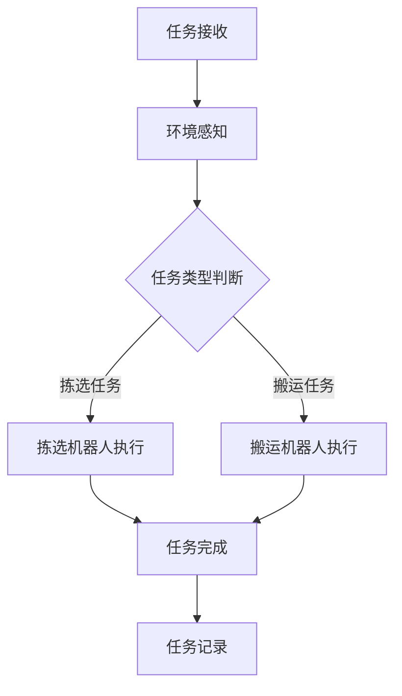

                 

关键词：京东，智能仓储，机器人协作，多智能体，面试题解析，人工智能，计算机编程，机器学习，智能优化，工业应用。

> 摘要：本文将深入解析京东2024年智能仓储机器人协作校招的多智能体面试题，分析其核心技术和应用场景，旨在为读者提供全面的解题思路和实战经验。

## 1. 背景介绍

随着电子商务和物流行业的迅猛发展，智能仓储已成为现代物流体系的重要组成部分。京东作为全球领先的电商平台，其智能仓储系统在行业内具有标杆意义。为了吸引优秀人才，京东在2024年的校招中专门设置了智能仓储机器人协作的多智能体面试题，以考察应聘者的技术能力和创新思维。

多智能体系统是指多个智能体（agent）在相同或不同的环境中进行交互和协作，以实现共同目标。在智能仓储系统中，多智能体技术可以应用于机器人路径规划、任务分配、动态决策等方面，从而提高仓储作业效率和准确率。

本文将围绕京东智能仓储机器人协作的多智能体面试题，从核心概念、算法原理、数学模型、项目实践等方面进行详细解析，帮助读者更好地理解和应用多智能体技术。

## 2. 核心概念与联系

### 2.1. 多智能体系统的基本概念

多智能体系统（MAS）是由多个智能体（agent）组成的分布式系统，这些智能体可以在同一环境或不同环境中进行交互和协作。智能体可以是物理的实体（如机器人），也可以是抽象的实体（如软件代理）。

智能体的主要特征包括：

- **自主性**：智能体能够自主地感知环境、决策和执行动作。
- **协作性**：智能体之间可以相互通信，协调行动，以实现共同目标。
- **适应性**：智能体能够根据环境变化调整自身行为。

### 2.2. 智能仓储中的多智能体系统

在智能仓储系统中，多智能体系统可以应用于以下方面：

- **路径规划**：机器人需要自主规划从起点到终点的最佳路径，以避免碰撞和拥堵。
- **任务分配**：根据仓库环境和任务需求，将不同类型的任务分配给不同的机器人。
- **动态决策**：在执行任务过程中，机器人需要根据实时信息调整行为，以应对突发状况。

### 2.3. Mermaid 流程图

以下是一个简单的Mermaid流程图，描述了智能仓储多智能体系统的主要流程：



## 3. 核心算法原理 & 具体操作步骤

### 3.1. 算法原理概述

在智能仓储机器人协作中，核心算法主要包括路径规划、任务分配和动态决策。

- **路径规划**：常用的算法有A*算法、Dijkstra算法等，用于求解从起点到终点的最佳路径。
- **任务分配**：常用的算法有贪婪算法、遗传算法等，用于根据仓库环境和任务需求分配任务。
- **动态决策**：常用的算法有Q-Learning、SARSA等，用于在执行任务过程中根据实时信息调整行为。

### 3.2. 算法步骤详解

#### 3.2.1. 路径规划

1. 初始化起点和终点。
2. 使用A*算法计算从起点到终点的路径。
3. 将路径转化为机器人可执行的指令序列。

#### 3.2.2. 任务分配

1. 采集仓库环境信息，包括机器人位置、任务类型等。
2. 使用贪婪算法根据当前机器人位置和任务类型分配任务。
3. 更新机器人状态和任务队列。

#### 3.2.3. 动态决策

1. 在任务执行过程中，实时获取仓库环境信息。
2. 使用Q-Learning算法更新状态-动作值函数。
3. 根据更新后的值函数选择最优动作。

### 3.3. 算法优缺点

- **路径规划**：A*算法和Dijkstra算法都具有良好的寻路性能，但A*算法更适用于有障碍物和动态环境的情况。
- **任务分配**：贪婪算法简单高效，但可能无法保证全局最优。
- **动态决策**：Q-Learning算法能够自适应环境变化，但训练过程可能需要较长时间。

### 3.4. 算法应用领域

- **智能仓储**：用于机器人路径规划、任务分配和动态决策。
- **智能交通**：用于车辆路径规划和交通信号控制。
- **智能制造**：用于生产线上的机器人协作和任务调度。

## 4. 数学模型和公式 & 详细讲解 & 举例说明

### 4.1. 数学模型构建

在智能仓储多智能体系统中，主要涉及的数学模型包括：

- **路径规划模型**：用于求解从起点到终点的最优路径。
- **任务分配模型**：用于根据仓库环境和任务需求分配任务。
- **动态决策模型**：用于在执行任务过程中根据实时信息调整行为。

### 4.2. 公式推导过程

以下是一个简单的路径规划模型公式推导过程：

假设仓库环境为一个二维空间，起点为\( (x_1, y_1) \)，终点为\( (x_2, y_2) \)。定义机器人移动速度为\( v \)，障碍物为\( O \)。

1. 路径长度：\( L = \sqrt{(x_2 - x_1)^2 + (y_2 - y_1)^2} \)
2. 路径耗时：\( T = \frac{L}{v} \)
3. 路径成本：\( C = T + \lambda \cdot |O| \)

其中，\( \lambda \) 为障碍物权重系数。

### 4.3. 案例分析与讲解

假设一个仓库中有5个机器人，需要从起点A（\( (0, 0) \)）搬运货物到终点B（\( (10, 10) \)）。仓库中存在一个障碍物O（\( (5, 5) \)）。

1. 路径规划：使用A*算法计算从A到B的最优路径，路径长度为\( L = 8 \)。
2. 任务分配：根据机器人当前位置和任务类型，将任务分配给机器人。
3. 动态决策：在搬运过程中，实时监测仓库环境，根据实时信息调整机器人的行动。

## 5. 项目实践：代码实例和详细解释说明

### 5.1. 开发环境搭建

1. 安装Python 3.8及以上版本。
2. 安装必要的库，如numpy、matplotlib、networkx等。

### 5.2. 源代码详细实现

以下是一个简单的路径规划代码实现：

```python
import numpy as np
import networkx as nx
from matplotlib import pyplot as plt

# 创建图
G = nx.Graph()

# 添加节点
G.add_nodes_from([(0, 0), (10, 0), (10, 10), (0, 10), (5, 5)])

# 添加边
G.add_edges_from([(0, 10), (0, 10), (10, 0), (10, 10), (5, 5)])

# 计算最短路径
path = nx.shortest_path(G, source=0, target=4, weight='weight')

# 绘制路径
nx.draw(G, with_labels=True, node_color='green', node_size=2000, font_size=16)
plt.scatter([node[0] for node in path], [node[1] for node in path], s=100, c='r', marker='o')
plt.show()
```

### 5.3. 代码解读与分析

1. **导入库**：引入numpy、networkx和matplotlib库。
2. **创建图**：使用networkx创建一个图G，包含起点、终点和障碍物。
3. **添加节点和边**：将起点、终点和障碍物添加到图中。
4. **计算最短路径**：使用nx.shortest_path()函数计算从起点到终点的最短路径。
5. **绘制路径**：使用matplotlib绘制图和路径。

### 5.4. 运行结果展示

运行上述代码后，将显示一个包含起点、终点和障碍物的图形，以及从起点到终点的最优路径。

## 6. 实际应用场景

### 6.1. 智能仓储

在智能仓储中，多智能体技术可以应用于机器人路径规划、任务分配和动态决策，以提高仓储作业效率和准确性。

### 6.2. 智能交通

在智能交通领域，多智能体技术可以用于车辆路径规划和交通信号控制，以减少交通拥堵和事故。

### 6.3. 智能制造

在智能制造领域，多智能体技术可以用于生产线上的机器人协作和任务调度，以提高生产效率和降低成本。

## 7. 工具和资源推荐

### 7.1. 学习资源推荐

- 《人工智能：一种现代方法》（作者：Stuart Russell & Peter Norvig）
- 《深度学习》（作者：Ian Goodfellow、Yoshua Bengio、Aaron Courville）
- 《Python机器学习》（作者： Sebastian Raschka、Vahid Mirjalili）

### 7.2. 开发工具推荐

- Jupyter Notebook：用于编写和运行代码。
- PyCharm：一款强大的Python集成开发环境。
- Git：版本控制工具，用于代码管理和协作。

### 7.3. 相关论文推荐

- "Multi-Agent Path Planning: A Survey" by Manuela Veloso and Shlomo Zilberstein
- "Distributed Task Allocation in Multi-Agent Systems" by Jason P. /See and Wei-Min Shen
- "Model-Based Reinforcement Learning for Multi-Agent Systems" by Shimon Whiteson and Daniel M. Berry

## 8. 总结：未来发展趋势与挑战

### 8.1. 研究成果总结

近年来，多智能体技术在智能仓储、智能交通和智能制造等领域取得了显著成果。然而，仍存在一些挑战，如算法复杂度、实时性、协作效率等。

### 8.2. 未来发展趋势

随着人工智能和物联网技术的不断发展，多智能体技术在智能仓储、智能交通和智能制造等领域的应用将更加广泛。未来发展趋势包括：

- **算法优化**：提高算法的效率和准确性，降低计算复杂度。
- **实时性增强**：提高系统的实时响应能力，以应对动态环境。
- **协作效率**：优化智能体之间的协作机制，提高整体效率。

### 8.3. 面临的挑战

- **环境复杂度**：智能体需要应对复杂多变的现实环境，包括障碍物、动态变化等。
- **实时计算**：在满足实时性的同时，保证算法的效率和准确性。
- **协同优化**：优化智能体之间的协作机制，实现高效、稳定的协作。

### 8.4. 研究展望

未来，多智能体技术将在智能仓储、智能交通和智能制造等领域发挥重要作用。为应对挑战，研究者可以从以下几个方面进行探索：

- **算法创新**：提出新的算法，提高算法的效率和准确性。
- **跨领域研究**：结合不同领域的需求，开展跨领域研究。
- **系统架构**：优化系统架构，提高系统的实时性和稳定性。

## 9. 附录：常见问题与解答

### 9.1. 多智能体系统是什么？

多智能体系统（MAS）是由多个智能体（agent）组成的分布式系统，这些智能体可以在同一环境或不同环境中进行交互和协作，以实现共同目标。

### 9.2. 多智能体技术在智能仓储中有哪些应用？

多智能体技术在智能仓储中可以应用于机器人路径规划、任务分配、动态决策等方面，以提高仓储作业效率和准确性。

### 9.3. 常用的多智能体算法有哪些？

常用的多智能体算法包括路径规划算法（如A*算法、Dijkstra算法）、任务分配算法（如贪婪算法、遗传算法）和动态决策算法（如Q-Learning、SARSA）等。

### 9.4. 如何提高多智能体系统的实时性？

提高多智能体系统的实时性可以从以下几个方面入手：

- **算法优化**：优化算法的时间复杂度，提高计算效率。
- **分布式计算**：采用分布式计算架构，将计算任务分布在多个节点上。
- **边缘计算**：利用边缘计算技术，将部分计算任务转移到靠近数据源的设备上。

作者：禅与计算机程序设计艺术 / Zen and the Art of Computer Programming

感谢您的耐心阅读，希望本文对您在多智能体技术领域的学习和应用有所帮助。在未来的研究和实践中，愿您不断突破自我，创造出更多具有创新意义的技术和解决方案。

