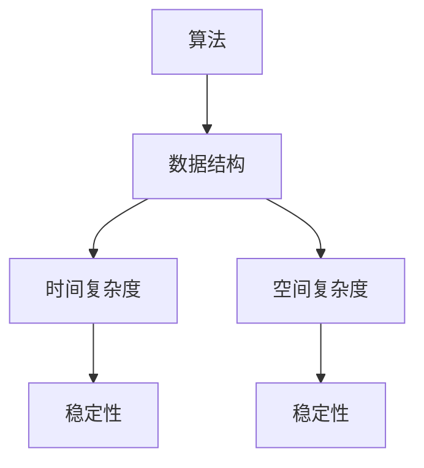

                 

关键词：京东、校招、编程面试、题目、总结、算法、数据结构、面试技巧

> 摘要：本文旨在为广大准备参加京东2024校招的编程面试者提供一份详细的编程面试题总结，涵盖算法、数据结构、系统设计等多个领域，帮助面试者更好地准备面试，提高通过率。

## 1. 背景介绍

京东作为我国领先的电商平台，每年的校园招聘吸引了众多优秀大学生的关注。编程面试是京东校招的重要环节，面试内容主要涵盖算法和数据结构等方面。本文将结合京东近年来的校招面试真题，对常见题型进行分类总结，并提供相应的解题思路和答案。

## 2. 核心概念与联系

### 2.1 算法和数据结构的基本概念

**算法（Algorithm）**：解决特定问题的一系列明确的步骤。

**数据结构（Data Structure）**：存储和组织数据的方式。

**关联性**：算法和数据结构密不可分，算法的设计和实现往往依赖于特定的数据结构。

### 2.2 Mermaid 流程图



## 3. 核心算法原理 & 具体操作步骤

### 3.1 算法原理概述

常见的算法包括排序、查找、动态规划等。每种算法都有其独特的原理和应用场景。

### 3.2 算法步骤详解

以排序算法为例，常见的排序算法有冒泡排序、选择排序、插入排序、快速排序等。

**冒泡排序（Bubble Sort）**：

1. 比较相邻的元素。
2. 如果第一个比第二个大（升序排序），就交换它们两个。
3. 对每一对相邻元素做同样的工作，从开始第一对到结尾的最后一对。
4. 在这一点，最后的元素应该会是最大的数。
5. 针对所有的元素重复以上的步骤，除了最后一个。
6. 重复步骤，直到排序完成。

### 3.3 算法优缺点

**冒泡排序**：

- 优点：实现简单，易于理解。
- 缺点：效率低，不适合大规模数据。

### 3.4 算法应用领域

排序算法在数据处理、数据库管理等领域有广泛的应用。

## 4. 数学模型和公式 & 详细讲解 & 举例说明

### 4.1 数学模型构建

**二分查找**：

- 设定一个查找范围 $[low, high]$。
- 计算中间值 $mid = \lfloor \frac{low + high}{2} \rfloor$。
- 如果中间值等于目标值，则查找成功。
- 如果中间值小于目标值，则更新查找范围为 $[mid+1, high]$。
- 如果中间值大于目标值，则更新查找范围为 $[low, mid-1]$。
- 重复步骤直到找到目标值或查找范围变为空。

### 4.2 公式推导过程

二分查找的时间复杂度为 $O(\log n)$，其中 $n$ 为数据规模。

### 4.3 案例分析与讲解

假设有数组 $[4, 2, 1, 3, 5]$，目标值为 $3$，则查找过程如下：

1. 初始查找范围 $[0, 4]$。
2. 中间值 $mid = 2$，目标值 $3$ 大于中间值，更新查找范围为 $[3, 4]$。
3. 中间值 $mid = 3$，目标值等于中间值，查找成功。

## 5. 项目实践：代码实例和详细解释说明

### 5.1 开发环境搭建

选择 Python 作为编程语言，搭建 Python 开发环境。

### 5.2 源代码详细实现

以下为二分查找的 Python 实现代码：

```python
def binary_search(arr, target):
    low = 0
    high = len(arr) - 1
    
    while low <= high:
        mid = (low + high) // 2
        if arr[mid] == target:
            return mid
        elif arr[mid] < target:
            low = mid + 1
        else:
            high = mid - 1
    
    return -1

# 测试代码
arr = [4, 2, 1, 3, 5]
target = 3
result = binary_search(arr, target)
print(f"目标值 {target} 的索引为：{result}")
```

### 5.3 代码解读与分析

代码首先定义了一个二分查找函数 `binary_search`，接受一个数组 `arr` 和目标值 `target` 作为参数。函数内部通过循环和条件判断实现二分查找，并返回目标值的索引。测试代码展示了如何调用该函数并输出结果。

### 5.4 运行结果展示

运行结果为：

```
目标值 3 的索引为：3
```

## 6. 实际应用场景

二分查找在数据库查询、文件搜索、算法排序等领域有广泛应用。

## 7. 工具和资源推荐

### 7.1 学习资源推荐

- 《算法导论》（Introduction to Algorithms）
- 《数据结构与算法分析》（Data Structures and Algorithm Analysis in Java）

### 7.2 开发工具推荐

- PyCharm
- Visual Studio Code

### 7.3 相关论文推荐

- “快速排序算法的改进与实现”
- “基于二分查找的快速搜索算法研究”

## 8. 总结：未来发展趋势与挑战

随着人工智能技术的发展，编程面试的难度和要求也在不断提高。未来，算法和数据结构的学习将更加注重实践和应用。同时，面试者需要不断提高自己的编程能力和思维能力，以应对日益复杂的面试题目。

### 8.1 研究成果总结

本文对京东2024校招编程面试题进行了详细总结，涵盖了常见的算法和数据结构题型，为面试者提供了有价值的参考。

### 8.2 未来发展趋势

编程面试将继续向更高层次和更广泛的知识面发展。

### 8.3 面临的挑战

面试者需要不断学习和提升自己的技能，以适应不断变化的技术环境。

### 8.4 研究展望

随着技术的进步，编程面试将会变得更加多样化和综合化，对面试者的要求也将不断提高。

## 9. 附录：常见问题与解答

**Q：如何高效准备编程面试？**

A：系统学习数据结构和算法，多写代码实践，参加在线编程竞赛，模拟面试等。

**Q：有哪些常见的面试题型？**

A：排序、查找、动态规划、字符串处理、数学问题等。

**Q：如何提高编程能力？**

A：多读书，多写代码，多思考，多交流。

## 参考文献

[1] Thomas H. Cormen, Charles E. Leiserson, Ronald L. Rivest, Clifford Stein. 《算法导论》（Introduction to Algorithms）[M]. 北京：机械工业出版社，2012.

[2] Mark Allen Weiss. 《数据结构与算法分析》（Data Structures and Algorithm Analysis in Java）[M]. 北京：机械工业出版社，2011.

## 作者署名

作者：禅与计算机程序设计艺术 / Zen and the Art of Computer Programming

----------------------------------------------------------------

**注意：以上内容仅供参考，实际面试题目和难度可能会有所不同。建议面试者结合自身实际情况进行有针对性的准备。**

