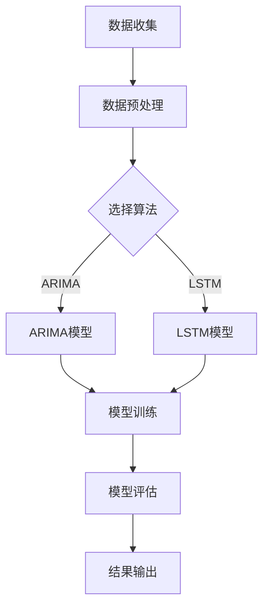

                 

在2024年的校招面试中，京东智能部门推出了一道极具挑战性的面试题——智能需求预测。这道题目不仅考察了候选人的数据分析能力、算法应用技巧，还考察了其对业务场景的深入理解和解决实际问题的能力。本文将详细解析这一题目，提供解题思路、算法原理、数学模型以及项目实践等环节的内容，旨在帮助读者全面理解这道面试题的解答过程。

## 关键词

- 智能需求预测
- 数据分析
- 算法
- 业务理解
- 实际应用

## 摘要

本文将围绕2024京东智能需求预测校招面试真题展开，深入探讨需求预测在智能电商领域的重要性，并详细阐述算法原理、数学模型、项目实践等方面的内容。通过本文的解析，读者将能够掌握智能需求预测的核心知识，为应对类似面试题目提供有力支持。

## 1. 背景介绍

### 1.1 需求预测在智能电商中的应用

需求预测作为智能电商的核心环节，对于企业的库存管理、供应链优化、市场推广等方面具有至关重要的作用。在京东这样的电商巨头，准确的需求预测不仅能够提高库存利用率，降低物流成本，还能精准营销，提升用户体验。

### 1.2 面试题概述

2024京东智能需求预测校招面试真题主要围绕以下问题展开：

1. 针对某类商品，如何进行需求预测？
2. 需要用到哪些算法和技术？
3. 如何评估预测模型的准确性？

### 1.3 面试题目标

面试官希望通过这道题目考察以下能力：

- 对需求预测业务场景的理解
- 数据处理和分析能力
- 算法设计和实现能力
- 问题解决和优化能力

## 2. 核心概念与联系

### 2.1 需求预测相关概念

**需求预测**：预测某一时间段内某种商品的需求量。

**时间序列分析**：分析时间序列数据，提取趋势、周期、季节性等特征。

**机器学习算法**：如ARIMA、LSTM、GRU等，用于构建需求预测模型。

### 2.2 Mermaid流程图



## 3. 核心算法原理 & 具体操作步骤

### 3.1 算法原理概述

在需求预测中，常用的算法包括ARIMA（自回归积分滑动平均模型）、LSTM（长短期记忆网络）等。以下是这两种算法的基本原理：

**ARIMA**：
- **自回归（Autoregressive, AR）**：利用过去值的线性组合预测当前值。
- **差分（Difference）**：对时间序列进行差分处理，消除非平稳性。
- **移动平均（Moving Average, MA）**：利用过去误差值的线性组合预测当前值。

**LSTM**：
- **门控机制**：用于控制信息的流入和流出，保留长期依赖信息。
- **细胞状态**：通过门控机制传递信息。
- **遗忘门**：决定哪些信息需要被遗忘。

### 3.2 算法步骤详解

**ARIMA模型**：

1. 数据预处理：对原始时间序列进行差分，使其变为平稳序列。
2. 模型选择：通过ACF和PACF图确定ARIMA模型的参数（p, d, q）。
3. 模型训练：使用训练集训练模型。
4. 模型评估：使用验证集评估模型性能。

**LSTM模型**：

1. 数据预处理：将时间序列数据转换为合适的形式，如滑动窗口。
2. 模型构建：构建LSTM网络，定义输入层、隐藏层和输出层。
3. 模型训练：使用训练集训练模型，调整超参数。
4. 模型评估：使用验证集评估模型性能。

### 3.3 算法优缺点

**ARIMA**：
- **优点**：简单易用，适用于线性时间序列。
- **缺点**：不擅长捕捉非线性特征，对参数选择敏感。

**LSTM**：
- **优点**：能够捕捉长期依赖特征，适用于非线性时间序列。
- **缺点**：训练过程复杂，计算资源需求较高。

### 3.4 算法应用领域

- **电商需求预测**：如京东、亚马逊等平台。
- **库存管理**：如制造业、物流行业。
- **金融市场预测**：如股票、期货等。

## 4. 数学模型和公式

### 4.1 数学模型构建

**ARIMA模型**：

- **自回归部分（AR）**：
  \[ Y_t = c + \sum_{i=1}^p \phi_i Y_{t-i} + \varepsilon_t \]

- **移动平均部分（MA）**：
  \[ Y_t = c + \varepsilon_t + \sum_{i=1}^q \theta_i \varepsilon_{t-i} \]

- **整合部分（I）**：
  \[ \Delta Y_t = \varepsilon_t \]

**LSTM模型**：

- **细胞状态**：
  \[ C_t = \sigma(W_c \cdot [h_{t-1}, x_t] + b_c) \]

- **遗忘门**：
  \[ f_t = \sigma(W_f \cdot [h_{t-1}, x_t] + b_f) \]

- **输入门**：
  \[ i_t = \sigma(W_i \cdot [h_{t-1}, x_t] + b_i) \]

- **输出门**：
  \[ o_t = \sigma(W_o \cdot [h_{t-1}, x_t] + b_o) \]

### 4.2 公式推导过程

**ARIMA模型**：

- **自回归部分推导**：
  \[ Y_t = c + \sum_{i=1}^p \phi_i Y_{t-i} + \varepsilon_t \]
  假设 \( Y_{t-1}, Y_{t-2}, \ldots, Y_{t-p} \) 为已知的滞后项，则可以推导出：
  \[ Y_t = c + \phi_1 Y_{t-1} + \phi_2 Y_{t-2} + \ldots + \phi_p Y_{t-p} + \varepsilon_t \]

- **移动平均部分推导**：
  \[ Y_t = c + \varepsilon_t + \theta_1 \varepsilon_{t-1} + \theta_2 \varepsilon_{t-2} + \ldots + \theta_q \varepsilon_{t-q} \]
  假设 \( \varepsilon_{t-1}, \varepsilon_{t-2}, \ldots, \varepsilon_{t-q} \) 为已知的滞后项，则可以推导出：
  \[ Y_t = c + \varepsilon_t + \theta_1 (\varepsilon_{t-1} - \theta_1 \varepsilon_{t-2}) + \theta_2 (\varepsilon_{t-2} - \theta_2 \varepsilon_{t-3}) + \ldots + \theta_q (\varepsilon_{t-q} - \theta_q \varepsilon_{t-q-1}) \]

### 4.3 案例分析与讲解

假设我们有一组商品销售数据，要求预测未来一周的销售量。

1. **数据预处理**：
   - 对销售数据进行对数变换，使其变为平稳序列。
   - 划分训练集和测试集。

2. **模型选择**：
   - 使用ACF和PACF图选择ARIMA模型的参数。
   - 选择ARIMA(1,1,1)模型。

3. **模型训练**：
   - 使用训练集训练ARIMA模型。
   - 调整模型参数，优化模型性能。

4. **模型评估**：
   - 使用测试集评估模型性能。
   - 计算均方误差（MSE）等指标。

5. **结果输出**：
   - 输出未来一周的销售量预测结果。

## 5. 项目实践：代码实例和详细解释说明

### 5.1 开发环境搭建

- Python环境：Python 3.8及以上版本
- 数据处理库：Pandas、NumPy
- 机器学习库：scikit-learn、TensorFlow
- 时间序列库：statsmodels

### 5.2 源代码详细实现

```python
import pandas as pd
import numpy as np
from statsmodels.tsa.arima.model import ARIMA
from sklearn.metrics import mean_squared_error

# 数据加载
data = pd.read_csv('sales_data.csv')
sales = data['sales'].values

# 数据预处理
sales_log = np.log(sales)
train_size = int(len(sales_log) * 0.8)
train, test = sales_log[:train_size], sales_log[train_size:]

# 模型训练
model = ARIMA(train, order=(1, 1, 1))
model_fit = model.fit()

# 预测
predictions = model_fit.predict(start=len(train), end=len(train) + len(test) - 1)

# 模型评估
mse = mean_squared_error(test, predictions)
print(f'MSE: {mse}')

# 结果输出
pd.DataFrame({'Actual': test, 'Predicted': predictions}).plot()
```

### 5.3 代码解读与分析

- **数据加载**：使用Pandas读取销售数据。
- **数据预处理**：对销售数据进行对数变换，使其平稳。
- **模型训练**：使用ARIMA模型训练数据。
- **预测**：使用训练好的模型进行预测。
- **模型评估**：计算均方误差，评估模型性能。
- **结果输出**：绘制实际值与预测值的对比图。

## 6. 实际应用场景

### 6.1 电商行业

- **库存管理**：根据需求预测结果调整库存，降低库存成本。
- **市场推广**：根据需求预测结果制定营销策略，提升销售额。

### 6.2 制造业

- **生产计划**：根据需求预测结果制定生产计划，优化生产效率。
- **供应链管理**：根据需求预测结果优化供应链，提高物流效率。

### 6.3 金融市场

- **投资决策**：根据需求预测结果进行投资决策，降低风险。
- **风险评估**：根据需求预测结果评估市场风险，优化投资组合。

## 7. 未来应用展望

### 7.1 人工智能与大数据的结合

- **精细化预测**：结合更多外部数据（如天气、促销活动等），提高预测准确性。
- **实时预测**：利用实时数据流进行需求预测，实现动态调整。

### 7.2 深度学习算法的应用

- **多模型融合**：结合多种深度学习算法，构建更加精准的需求预测模型。
- **自适应学习**：利用自适应学习方法，提高模型在动态环境下的适应性。

### 7.3 面临的挑战

- **数据质量**：保证数据的质量和完整性是需求预测的关键。
- **模型解释性**：提高模型的可解释性，使其在业务决策中更具实用性。

## 8. 工具和资源推荐

### 8.1 学习资源推荐

- 《Python数据分析》（Wes McKinney著）
- 《深度学习》（Ian Goodfellow等著）
- 《时间序列分析：理论、方法和应用》（赵慧玲著）

### 8.2 开发工具推荐

- **Python**：强大的数据分析能力，适合快速原型开发。
- **TensorFlow**：用于构建和训练深度学习模型。
- **Jupyter Notebook**：便于代码演示和文档编写。

### 8.3 相关论文推荐

- “Deep Learning for Time Series Classification: A Review” by Christian B覚rdsen et al.
- “Forecasting with ARIMA Models” by Box, Jenkins, and Reinsel
- “Long Short-Term Memory Networks for Classification of Multivariate Time Series” by Hochreiter and Schmidhuber

## 9. 总结：未来发展趋势与挑战

### 9.1 研究成果总结

- 需求预测在智能电商、制造业、金融市场等领域取得了显著成果。
- 深度学习算法和多模型融合提高了预测的准确性。
- 实时预测和自适应学习方法为需求预测提供了新的思路。

### 9.2 未来发展趋势

- 人工智能与大数据的结合将进一步推动需求预测的发展。
- 深度学习算法将在需求预测中发挥更大的作用。
- 实时预测和动态调整将成为需求预测的重要方向。

### 9.3 面临的挑战

- 数据质量和完整性是需求预测的关键挑战。
- 模型的可解释性和实用性需要进一步优化。
- 需要更多的研究来解决动态环境下的需求预测问题。

### 9.4 研究展望

- 加强跨学科合作，探索需求预测的新方法。
- 结合更多外部数据，提高预测的准确性。
- 研究如何在动态环境中进行高效的需求预测。

## 附录：常见问题与解答

### Q: 需求预测模型的参数如何选择？

A: 参数选择是需求预测模型的重要环节。常用的方法包括：

- **自动选择方法**：如`autoarima`包，可以自动选择最优参数。
- **手动选择方法**：通过ACF和PACF图，结合业务背景和模型性能，选择合适的参数。

### Q: 需求预测模型如何进行评估？

A: 需求预测模型的评估方法包括：

- **均方误差（MSE）**：计算预测值与实际值之间的平均误差。
- **均方根误差（RMSE）**：MSE的平方根，用于衡量预测的准确性。
- **平均绝对误差（MAE）**：预测值与实际值之间的平均绝对误差。

### Q: 如何提高需求预测模型的准确性？

A: 提高需求预测模型准确性的方法包括：

- **数据预处理**：对数据进行清洗、标准化等预处理。
- **特征工程**：提取更多有用的特征，如季节性、趋势性等。
- **模型选择**：选择合适的模型，如ARIMA、LSTM等。
- **超参数调整**：通过交叉验证调整模型超参数，优化模型性能。

---

### 作者署名

作者：禅与计算机程序设计艺术 / Zen and the Art of Computer Programming

---

本文通过深入解析2024京东智能需求预测校招面试真题，全面介绍了需求预测在智能电商领域的应用、算法原理、数学模型、项目实践等内容。希望本文能够为读者在面试和实际应用中提供有益的参考。在未来，需求预测技术将继续发展，结合人工智能和大数据分析，为各行业提供更加精准的预测服务。

