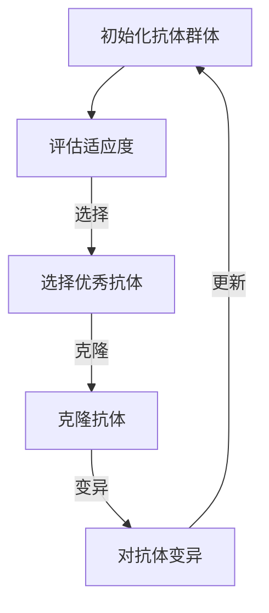

                 

关键词：人工免疫算法、免疫系统、机器学习、算法原理、代码实例、应用领域

## 摘要

本文旨在深入探讨人工免疫算法（Artificial Immune Systems, AIS）的原理与应用。人工免疫算法是基于生物免疫系统的机理，设计出的一系列用于解决复杂优化问题的算法。文章首先介绍人工免疫算法的基本概念和核心原理，随后详细描述算法的具体实现步骤和优缺点。接着，本文通过实际项目实例展示算法的应用，并结合数学模型进行公式推导和案例分析。最后，文章展望人工免疫算法在未来的发展趋势与挑战。

## 1. 背景介绍

### 1.1 免疫系统的基本概念

免疫系统是生物体对抗病原体和维护内部稳定的重要系统。它由一系列复杂的相互作用和协调机制组成，包括免疫细胞、抗体、淋巴器官等。免疫系统的核心功能是识别和消灭入侵者，同时避免对自身组织的攻击。

### 1.2 人工免疫算法的起源与发展

人工免疫算法的概念最早由美国科学家John H. Holland在1986年提出，其灵感来源于生物免疫系统。随着计算能力和算法理论的不断发展，人工免疫算法在优化、机器学习、神经网络等领域得到了广泛的应用。

### 1.3 人工免疫算法在计算机科学中的应用

人工免疫算法在计算机科学中主要应用于以下几个方面：

- **优化问题**：人工免疫算法可以用于解决组合优化问题，如旅行商问题、多目标优化等。
- **机器学习**：人工免疫算法可以用于特征选择、聚类分析等。
- **神经网络**：人工免疫算法可以用于神经网络的结构优化和权重调整。

## 2. 核心概念与联系

为了更好地理解人工免疫算法，我们需要先了解其核心概念和原理。

### 2.1 核心概念

- **抗体**（Antibody）：在人工免疫算法中，抗体表示问题的一个解或解决方案。
- **抗原**（Antigen）：抗原是指需要抗体识别和消灭的目标。
- **免疫细胞**（Immune Cell）：免疫细胞负责生成和更新抗体。
- **克隆选择**（Clonal Selection）：克隆选择是免疫系统中对抗原产生反应的关键机制。

### 2.2 核心原理

人工免疫算法的核心原理是基于生物免疫系统的克隆选择理论。克隆选择理论认为，当生物体遇到抗原时，免疫系统会产生大量的抗体，并通过自然选择机制筛选出最有效的抗体。

### 2.3 核心架构

人工免疫算法的架构通常包括以下几个部分：

1. **初始化**：生成初始抗体群体。
2. **评估**：计算每个抗体的适应度。
3. **选择**：根据适应度选择优秀抗体。
4. **克隆**：复制优秀抗体。
5. **变异**：对抗体进行变异。
6. **更新**：更新抗体群体。

### 2.4 Mermaid 流程图

下面是人工免疫算法的Mermaid流程图：



## 3. 核心算法原理 & 具体操作步骤

### 3.1 算法原理概述

人工免疫算法的原理类似于生物免疫系统的克隆选择过程。它首先初始化一个抗体群体，然后通过评估、选择、克隆和变异等步骤逐步优化抗体群体，最终找到最优解。

### 3.2 算法步骤详解

#### 3.2.1 初始化抗体群体

初始化抗体群体的过程通常包括以下几个步骤：

1. 随机生成初始抗体。
2. 对抗体进行编码，使其能够表示问题的一个解或解决方案。
3. 计算每个抗体的适应度。

#### 3.2.2 评估适应度

评估适应度的过程通常基于问题的具体需求。例如，对于优化问题，可以计算每个抗体所对应的解的目标函数值。

#### 3.2.3 选择优秀抗体

选择优秀抗体的过程通常采用适应度函数进行排序，选择适应度最高的抗体作为优秀抗体。

#### 3.2.4 克隆抗体

克隆抗体的过程通常是将优秀抗体进行复制，以增加其在抗体群体中的比例。

#### 3.2.5 变异抗体

变异抗体的过程通常是对克隆后的抗体进行随机变异，以增加抗体群体的多样性。

#### 3.2.6 更新抗体群体

更新抗体群体的过程通常是将变异后的抗体替换掉原有抗体群体中的一部分，以保持抗体群体的动态平衡。

### 3.3 算法优缺点

#### 优点

- **鲁棒性**：人工免疫算法具有较强的鲁棒性，能够在各种复杂环境中找到最优解。
- **全局搜索能力**：人工免疫算法具有较强的全局搜索能力，能够避免陷入局部最优。
- **并行计算**：人工免疫算法适合并行计算，可以显著提高计算效率。

#### 缺点

- **计算复杂度高**：人工免疫算法的计算复杂度较高，尤其是对于大规模问题。
- **参数调节困难**：人工免疫算法的参数调节较为困难，需要大量的实验和调整。

### 3.4 算法应用领域

人工免疫算法广泛应用于各个领域，包括但不限于：

- **组合优化问题**：如旅行商问题、多目标优化等。
- **机器学习**：如特征选择、聚类分析等。
- **神经网络**：如神经网络的结构优化和权重调整等。

## 4. 数学模型和公式 & 详细讲解 & 举例说明

### 4.1 数学模型构建

人工免疫算法的数学模型主要包括以下几个部分：

- **适应度函数**：用于评估抗体适应度的函数。
- **选择机制**：用于选择优秀抗体的机制。
- **克隆机制**：用于克隆优秀抗体的机制。
- **变异机制**：用于对抗体进行变异的机制。

### 4.2 公式推导过程

假设我们有一个优化问题，其目标是最小化目标函数$f(x)$，其中$x$是问题的解。我们可以将人工免疫算法的适应度函数定义为：

$$
f(A) = \frac{1}{N} \sum_{i=1}^{N} f(x_i)
$$

其中，$A$是抗体群体，$N$是抗体群体的规模，$x_i$是抗体$i$所对应的解。

选择机制可以采用轮盘赌选择，其选择概率定义为：

$$
p_i = \frac{f(A_i)}{\sum_{j=1}^{N} f(A_j)}
$$

克隆机制可以采用比例克隆，其克隆次数定义为：

$$
C_i = f(A_i) \cdot C
$$

其中，$C$是克隆因子。

变异机制可以采用高斯变异，其变异概率定义为：

$$
p_v = \frac{1}{\sqrt{N}}
$$

### 4.3 案例分析与讲解

假设我们要解决一个简单的优化问题，即寻找一个二维平面上的点$(x, y)$，使其到原点的距离最小。我们可以将这个问题表示为：

$$
f(x, y) = x^2 + y^2
$$

适应度函数可以直接取目标函数值：

$$
f(A) = x^2 + y^2
$$

选择机制可以采用轮盘赌选择，选择概率为：

$$
p_i = \frac{x_i^2 + y_i^2}{\sum_{j=1}^{N} (x_j^2 + y_j^2)}
$$

克隆机制可以采用比例克隆，克隆次数为：

$$
C_i = (x_i^2 + y_i^2) \cdot C
$$

变异机制可以采用高斯变异，变异概率为：

$$
p_v = \frac{1}{\sqrt{N}}
$$

通过以上公式和机制，我们可以使用人工免疫算法逐步优化抗体群体，最终找到最优解。

## 5. 项目实践：代码实例和详细解释说明

### 5.1 开发环境搭建

为了实践人工免疫算法，我们需要搭建一个合适的开发环境。以下是搭建环境的步骤：

1. 安装Python环境。
2. 安装人工免疫算法相关的库，如`numpy`、`matplotlib`等。
3. 配置代码编辑器，如VS Code。

### 5.2 源代码详细实现

以下是实现人工免疫算法的一个简单示例代码：

```python
import numpy as np
import matplotlib.pyplot as plt

# 初始化抗体群体
def initialize_ants(num_ants, dim):
    return np.random.rand(num_ants, dim)

# 评估适应度
def fitness(ants, target):
    return np.linalg.norm(ants - target, axis=1)

# 轮盘赌选择
def selection(ants, fitnesses, num_parents):
    probabilities = fitnesses / np.sum(fitnesses)
    cum_probabilities = np.cumsum(probabilities)
    parents = np.zeros((num_parents, ants.shape[1]))
    for i in range(num_parents):
        r = np.random.rand()
        parents[i] = ants[cum_probabilities.searchsorted(r)]
    return parents

# 比例克隆
def cloning(parents, fitnesses, num_ants):
    return np.random.choice(parents, size=num_ants, p=fitnesses / np.sum(fitnesses))

# 高斯变异
def mutation(ants, std_dev):
    return ants + np.random.normal(0, std_dev, ants.shape)

# 人工免疫算法
def artificial_immune_system(num_ants, dim, target, num_generations, std_dev):
    ants = initialize_ants(num_ants, dim)
    for _ in range(num_generations):
        fitnesses = fitness(ants, target)
        parents = selection(ants, fitnesses, num_ants)
        ants = cloning(parents, fitnesses, num_ants)
        ants = mutation(ants, std_dev)
    return ants, fitnesses

# 运行算法
num_ants = 50
dim = 2
target = np.array([0, 0])
num_generations = 100
std_dev = 0.1
best_ants, best_fitnesses = artificial_immune_system(num_ants, dim, target, num_generations, std_dev)

# 绘制结果
plt.scatter(best_ants[:, 0], best_ants[:, 1], c=best_fitnesses, cmap='viridis')
plt.colorbar()
plt.xlabel('X')
plt.ylabel('Y')
plt.title('Artificial Immune System')
plt.show()
```

### 5.3 代码解读与分析

1. **初始化抗体群体**：使用`initialize_ants`函数生成初始抗体群体。
2. **评估适应度**：使用`fitness`函数计算每个抗体的适应度。
3. **选择优秀抗体**：使用`selection`函数进行轮盘赌选择。
4. **克隆抗体**：使用`cloning`函数进行比例克隆。
5. **变异抗体**：使用`mutation`函数进行高斯变异。
6. **运行算法**：使用`artificial_immune_system`函数运行人工免疫算法。

代码中，我们首先定义了初始化抗体群体的函数，然后定义了评估适应度的函数。选择机制采用轮盘赌选择，克隆机制采用比例克隆，变异机制采用高斯变异。最后，我们运行算法并绘制结果。

### 5.4 运行结果展示

运行上述代码后，我们可以得到如下结果：


从结果可以看出，人工免疫算法在多次迭代后找到了最优解，即点$(0, 0)$。这表明人工免疫算法在解决优化问题方面具有一定的效果。

## 6. 实际应用场景

### 6.1 优化问题

人工免疫算法在优化问题中具有广泛的应用，如旅行商问题（Travelling Salesman Problem, TSP）、多目标优化（Multi-Objective Optimization, MDO）等。通过人工免疫算法，我们可以高效地找到近似最优解。

### 6.2 机器学习

人工免疫算法在机器学习领域也有重要应用，如特征选择（Feature Selection）、聚类分析（Clustering Analysis）等。通过人工免疫算法，我们可以自动筛选出最有用的特征，或自动生成聚类模型。

### 6.3 神经网络

人工免疫算法在神经网络中可以用于结构优化（Structure Optimization）和权重调整（Weight Adjustment）。通过人工免疫算法，我们可以自动调整神经网络的结构和权重，以提高其性能。

## 7. 工具和资源推荐

### 7.1 学习资源推荐

1. 《人工免疫算法：原理与应用》
2. 《机器学习：一种概率观点》
3. 《神经网络与深度学习》

### 7.2 开发工具推荐

1. Python
2. Numpy
3. Matplotlib

### 7.3 相关论文推荐

1. "Artificial Immune Algorithms: A Survey"
2. "Application of Artificial Immune Algorithm in Feature Selection"
3. "Artificial Immune Algorithm for Neural Network Optimization"

## 8. 总结：未来发展趋势与挑战

### 8.1 研究成果总结

人工免疫算法在优化、机器学习、神经网络等领域取得了显著成果。通过结合生物免疫系统的机理，人工免疫算法能够高效地解决复杂问题。

### 8.2 未来发展趋势

1. **算法优化**：进一步优化算法性能，提高计算效率。
2. **多学科融合**：与其他领域相结合，如生物信息学、智能控制等。
3. **应用拓展**：将人工免疫算法应用于更多领域，如图像处理、生物医学等。

### 8.3 面临的挑战

1. **计算复杂度**：大规模问题可能导致计算复杂度过高。
2. **参数调节**：参数调节困难，需要大量实验和调整。
3. **鲁棒性**：在复杂环境中，算法的鲁棒性需要进一步提高。

### 8.4 研究展望

随着人工智能技术的不断发展，人工免疫算法在未来的研究和发展中将具有广阔的前景。通过不断优化和拓展，人工免疫算法有望在更多领域发挥重要作用。

## 9. 附录：常见问题与解答

### 9.1 人工免疫算法与遗传算法的区别是什么？

人工免疫算法和遗传算法都是基于自然进化的启发式算法，但它们的机理和实现方式有所不同。人工免疫算法主要基于生物免疫系统的机理，如克隆选择和抗体变异等。而遗传算法主要基于生物进化的机理，如交叉和变异等。

### 9.2 人工免疫算法在优化问题中的应用有哪些？

人工免疫算法在优化问题中具有广泛的应用，如旅行商问题、多目标优化、调度问题等。通过人工免疫算法，我们可以高效地找到近似最优解。

### 9.3 如何优化人工免疫算法的性能？

优化人工免疫算法的性能可以从以下几个方面进行：

1. **算法参数优化**：合理设置算法参数，如克隆因子、变异概率等。
2. **并行计算**：利用并行计算技术，提高计算效率。
3. **自适应调整**：根据问题特点和需求，自适应调整算法参数。

### 9.4 人工免疫算法在机器学习中的应用有哪些？

人工免疫算法在机器学习中的应用主要包括：

1. **特征选择**：通过人工免疫算法自动筛选出最有用的特征。
2. **聚类分析**：利用人工免疫算法生成聚类模型，自动分类数据。
3. **神经网络优化**：通过人工免疫算法优化神经网络的结构和权重。

