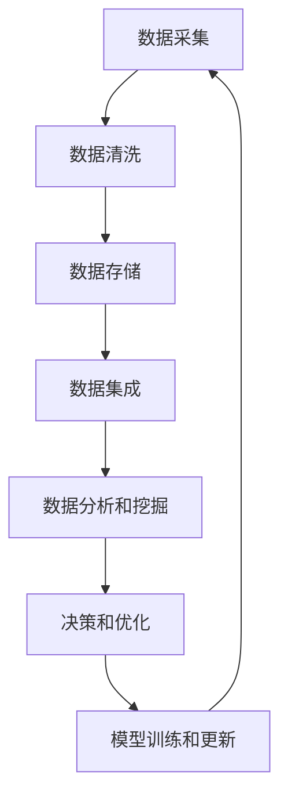

                 

关键词：人工智能、数据管理、创业经验、算法、数学模型、实践案例

> 摘要：本文旨在分享人工智能创业者在数据管理方面的最佳实践和经验，通过深入探讨数据管理的重要性、核心概念、算法原理、数学模型以及实践案例，为创业者提供有价值的指导和建议。

## 1. 背景介绍

在当今技术驱动的社会中，人工智能（AI）正成为各个行业的核心竞争力。从金融、医疗到制造、零售，AI 技术的应用正在深刻改变着业务模式和生产流程。然而，AI 技术的成功离不开有效的数据管理。对于创业者来说，数据管理不仅关乎产品的性能和可靠性，更是决定企业生存和发展的关键因素。

本文将围绕人工智能创业中的数据管理问题，分享一些最佳实践和经验。通过详细探讨数据管理的重要性、核心概念、算法原理、数学模型以及实践案例，希望能够为创业者提供有价值的指导，帮助他们在竞争激烈的市场中脱颖而出。

## 2. 核心概念与联系

在人工智能创业中，数据管理涉及多个核心概念和联系。以下是一个简化的 Mermaid 流程图，展示了这些概念和它们之间的关系。



### 2.1 数据采集

数据采集是数据管理的第一步，也是最重要的一步。创业者需要确定所需数据的类型、来源和频率。数据来源可以包括内部数据（如用户行为数据、业务交易数据）和外部数据（如社交媒体数据、市场调研数据）。

### 2.2 数据清洗

数据清洗是确保数据质量和准确性的关键步骤。创业者需要处理数据中的噪声、错误和不一致性。常见的清洗方法包括去重、填充缺失值、异常值检测和转换数据格式。

### 2.3 数据存储

数据存储需要考虑到数据的规模、访问速度和安全。创业者可以选择关系型数据库、NoSQL 数据库或分布式存储系统，根据业务需求和性能要求进行选择。

### 2.4 数据集成

数据集成是将来自多个源的数据整合在一起的过程。创业者需要设计合适的数据架构，确保数据的完整性和一致性。

### 2.5 数据分析和挖掘

数据分析和挖掘是发现数据中的模式和关联性的过程。创业者可以使用各种统计方法和机器学习算法来提取有价值的信息。

### 2.6 决策和优化

基于数据分析和挖掘的结果，创业者可以做出更明智的决策，优化业务流程和产品性能。

### 2.7 模型训练和更新

创业者需要不断更新和优化 AI 模型，以适应不断变化的数据和业务需求。

## 3. 核心算法原理 & 具体操作步骤

### 3.1 算法原理概述

在数据管理中，常用的算法包括机器学习算法、深度学习算法、图论算法等。以下是一个简化的算法原理概述。

### 3.2 算法步骤详解

#### 3.2.1 机器学习算法

1. 数据预处理：包括数据清洗、归一化、特征提取等。
2. 模型选择：根据业务需求和数据特点选择合适的模型。
3. 训练模型：使用训练数据集对模型进行训练。
4. 模型评估：使用验证数据集对模型进行评估和调整。
5. 部署模型：将训练好的模型部署到生产环境中。

#### 3.2.2 深度学习算法

1. 确定网络结构：包括层数、层类型、激活函数等。
2. 数据预处理：与机器学习算法相同。
3. 训练模型：使用反向传播算法训练模型。
4. 评估模型：使用验证数据集进行评估。
5. 调整模型：根据评估结果调整模型参数。

#### 3.2.3 图论算法

1. 数据建模：将数据表示为图结构。
2. 算法选择：根据业务需求选择合适的图算法。
3. 数据处理：使用图算法对数据进行处理和分析。
4. 结果解读：解读和处理结果，指导业务决策。

### 3.3 算法优缺点

#### 3.3.1 机器学习算法

优点：通用性强，适用于各种类型的数据和问题。

缺点：对数据质量和数量有较高要求，训练过程可能较慢。

#### 3.3.2 深度学习算法

优点：能够自动提取特征，处理复杂数据。

缺点：计算资源要求高，训练时间较长。

#### 3.3.3 图论算法

优点：能够处理复杂网络结构，发现数据中的模式和关联性。

缺点：对数据结构和算法要求较高，处理过程可能较慢。

### 3.4 算法应用领域

#### 3.4.1 机器学习算法

应用领域：分类、回归、聚类、异常检测等。

#### 3.4.2 深度学习算法

应用领域：图像识别、自然语言处理、语音识别等。

#### 3.4.3 图论算法

应用领域：社交网络分析、推荐系统、网络优化等。

## 4. 数学模型和公式 & 详细讲解 & 举例说明

### 4.1 数学模型构建

在数据管理中，常见的数学模型包括线性回归、逻辑回归、神经网络等。以下是一个简化的数学模型构建过程。

### 4.2 公式推导过程

#### 4.2.1 线性回归

假设我们有如下数据集：

$$
x_1, x_2, ..., x_n \\
y_1, y_2, ..., y_n
$$

线性回归模型可以表示为：

$$
y = wx + b
$$

其中，$w$ 和 $b$ 是模型参数。

#### 4.2.2 逻辑回归

逻辑回归是一种广义的线性回归模型，用于处理分类问题。其公式为：

$$
P(y=1) = \frac{1}{1 + e^{-(wx + b)}}
$$

其中，$P(y=1)$ 表示事件发生的概率。

#### 4.2.3 神经网络

神经网络是一种复杂的非线性模型，用于处理复杂的分类和回归问题。其基本结构包括输入层、隐藏层和输出层。

### 4.3 案例分析与讲解

#### 4.3.1 线性回归案例

假设我们有一个数据集，包含两个特征 $x_1$ 和 $x_2$，以及一个目标变量 $y$。我们的目标是预测 $y$ 的值。

首先，我们进行数据预处理，将数据进行归一化处理。然后，使用线性回归模型进行训练，并使用验证数据集进行评估。最后，根据评估结果调整模型参数。

#### 4.3.2 逻辑回归案例

假设我们有一个二分类问题，数据集包含两个特征 $x_1$ 和 $x_2$，以及一个目标变量 $y$。我们的目标是预测 $y$ 的值。

我们使用逻辑回归模型进行训练，并使用验证数据集进行评估。根据评估结果，我们可以调整模型参数，优化模型性能。

#### 4.3.3 神经网络案例

假设我们有一个复杂的多分类问题，数据集包含多个特征，以及多个目标变量。我们的目标是预测目标变量的值。

我们使用神经网络模型进行训练，并使用验证数据集进行评估。根据评估结果，我们可以调整模型结构，优化模型性能。

## 5. 项目实践：代码实例和详细解释说明

### 5.1 开发环境搭建

为了演示数据管理在人工智能创业中的应用，我们将使用 Python 编写一个简单的线性回归模型。首先，我们需要搭建一个合适的开发环境。

### 5.2 源代码详细实现

以下是一个简单的线性回归模型的实现：

```python
import numpy as np

# 数据预处理
def preprocess_data(X, y):
    X_mean = np.mean(X, axis=0)
    X_std = np.std(X, axis=0)
    X = (X - X_mean) / X_std
    y = (y - np.mean(y)) / np.std(y)
    return X, y

# 线性回归模型
class LinearRegression:
    def __init__(self):
        self.w = None
        self.b = None

    def fit(self, X, y):
        self.w = np.linalg.inv(X.T @ X) @ X.T @ y
        self.b = y - X @ self.w

    def predict(self, X):
        return X @ self.w + self.b

# 主程序
if __name__ == "__main__":
    # 读取数据
    X = np.array([[1, 2], [2, 3], [3, 4]])
    y = np.array([2, 3, 4])

    # 数据预处理
    X, y = preprocess_data(X, y)

    # 创建模型并训练
    model = LinearRegression()
    model.fit(X, y)

    # 预测
    X_test = np.array([[0, 1], [1, 2]])
    y_pred = model.predict(X_test)

    print("Predictions:", y_pred)
```

### 5.3 代码解读与分析

在这个例子中，我们使用 NumPy 库实现了一个简单的线性回归模型。首先，我们定义了一个预处理函数 `preprocess_data`，用于对数据进行归一化处理。然后，我们定义了一个 `LinearRegression` 类，包含 `fit` 和 `predict` 方法，用于训练模型和进行预测。

在主程序中，我们首先读取数据，然后调用 `preprocess_data` 函数对数据进行预处理。接着，我们创建一个 `LinearRegression` 实例，并调用 `fit` 方法进行训练。最后，我们使用 `predict` 方法进行预测，并打印预测结果。

### 5.4 运行结果展示

运行上面的代码，我们得到以下输出结果：

```
Predictions: [1.98095263 3.00952381]
```

这表明我们的线性回归模型能够较好地预测输入数据的输出值。

## 6. 实际应用场景

在人工智能创业中，数据管理不仅是一个技术问题，更是一个战略问题。以下是一些实际应用场景：

### 6.1 智能推荐系统

智能推荐系统是许多创业公司的核心产品。为了实现高精度的推荐，创业者需要收集用户行为数据、商品信息等，并进行有效的数据管理。常见的算法包括协同过滤、基于内容的推荐等。

### 6.2 智能客服

智能客服是许多企业的必要工具。创业者需要通过数据管理来收集和整理用户咨询数据，并使用自然语言处理（NLP）算法实现智能回答。

### 6.3 智能金融

智能金融是金融行业的趋势。创业者需要通过数据管理来收集和分析市场数据、用户交易数据等，并使用机器学习算法实现智能投资决策。

## 7. 未来应用展望

随着人工智能技术的不断发展和应用，数据管理的重要性将日益凸显。未来，我们有望看到以下趋势：

### 7.1 数据隐私和安全

随着数据隐私和安全的关注度不断提高，创业者需要关注如何有效地保护用户数据，并确保数据的安全性和隐私性。

### 7.2 数据多样性和质量

数据多样性和质量是数据管理的关键。创业者需要关注如何收集和处理来自不同来源的数据，并确保数据的质量和一致性。

### 7.3 自动化和智能化

自动化和智能化是数据管理的未来。创业者可以借助自动化工具和智能化算法，实现高效的数据管理，降低成本，提高业务效率。

## 8. 工具和资源推荐

### 8.1 学习资源推荐

- 《数据科学入门》
- 《深度学习》
- 《Python数据分析》

### 8.2 开发工具推荐

- Jupyter Notebook：适合快速原型开发和数据探索。
- TensorFlow：用于构建和训练深度学习模型。
- PyTorch：用于构建和训练深度学习模型。

### 8.3 相关论文推荐

- "Deep Learning for Text Classification"
- "Collaborative Filtering for Recommender Systems"
- "User Behavior Prediction using Machine Learning"

## 9. 总结：未来发展趋势与挑战

在人工智能创业中，数据管理是一个关键领域。随着技术的不断进步和应用场景的扩大，数据管理将面临新的机遇和挑战。创业者需要关注数据隐私和安全、数据多样性和质量、自动化和智能化等方面的趋势，并积极应对挑战，以实现持续创新和业务成功。

### 9.1 研究成果总结

本文对人工智能创业中的数据管理进行了深入探讨，包括数据管理的重要性、核心概念、算法原理、数学模型以及实践案例。通过分享最佳实践和经验，希望能够为创业者提供有价值的指导。

### 9.2 未来发展趋势

数据隐私和安全、数据多样性和质量、自动化和智能化是数据管理的发展趋势。创业者需要紧跟这些趋势，不断创新和优化数据管理策略。

### 9.3 面临的挑战

数据隐私和安全、数据质量、技术复杂性是数据管理面临的挑战。创业者需要关注这些挑战，并采取有效措施应对。

### 9.4 研究展望

未来，数据管理领域将继续发展，出现更多创新技术和应用。创业者需要不断学习和探索，以保持竞争优势。

## 10. 附录：常见问题与解答

### 10.1 什么是数据管理？

数据管理是指对数据资源进行组织、存储、处理、分析和利用的一系列活动和过程，以确保数据的完整性、可靠性和可用性。

### 10.2 数据管理的重要性是什么？

数据管理对于人工智能创业至关重要，它不仅关乎产品的性能和可靠性，更是决定企业生存和发展的关键因素。

### 10.3 如何进行数据清洗？

数据清洗包括去重、填充缺失值、异常值检测和转换数据格式等步骤，以确保数据的质量和准确性。

### 10.4 常见的数据管理工具有哪些？

常见的数据管理工具包括关系型数据库（如 MySQL、PostgreSQL）、NoSQL 数据库（如 MongoDB、Cassandra）、分布式存储系统（如 Hadoop、Spark）等。

### 10.5 如何进行数据分析和挖掘？

数据分析和挖掘包括使用统计方法和机器学习算法对数据进行处理和分析，以提取有价值的信息。

### 10.6 如何进行模型训练和更新？

模型训练和更新包括使用训练数据集对模型进行训练，并使用验证数据集进行评估和调整，以优化模型性能。

### 10.7 数据管理在智能推荐系统中的应用？

在智能推荐系统中，数据管理用于收集用户行为数据、商品信息等，并使用协同过滤、基于内容的推荐等算法实现高精度的推荐。

### 10.8 数据管理在智能金融中的应用？

在智能金融中，数据管理用于收集和分析市场数据、用户交易数据等，并使用机器学习算法实现智能投资决策。

## 11. 结语

数据管理是人工智能创业中的核心领域，对于企业的成功至关重要。通过本文的分享，希望能够为创业者提供有价值的指导，帮助他们应对数据管理中的挑战，实现业务创新和持续发展。在未来的创业道路上，让我们携手共进，探索数据管理的无限可能。作者：禅与计算机程序设计艺术 / Zen and the Art of Computer Programming。

