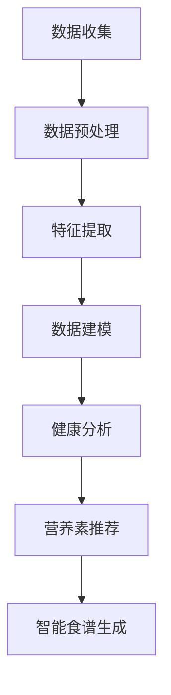

                 

关键词：人工智能，个性化营养，定制饮食，机器学习，数据分析，健康监测

> 摘要：随着人工智能技术的不断发展，个性化营养和定制饮食方案成为了一个热门领域。本文将介绍人工智能在个性化营养中的应用，包括如何利用机器学习和数据分析技术，根据个人的健康数据和生活习惯，制定出符合个人需求的饮食方案，从而提高健康水平和生活质量。

## 1. 背景介绍

个性化营养和定制饮食方案是现代营养学的一个重要分支。传统营养学主要关注的是普遍的营养需求和标准饮食建议，然而，每个人的身体状况、生活方式、遗传背景都存在差异，因此，传统营养学难以满足个体化的需求。随着科技的进步，特别是人工智能和大数据技术的兴起，个性化营养和定制饮食方案开始逐渐成为可能。

人工智能在个性化营养中的应用主要体现在以下几个方面：

- **健康数据分析**：通过收集和分析个人的健康数据，如体重、血压、血糖、胆固醇水平等，利用机器学习算法分析数据，发现个体的营养需求规律。

- **生活方式分析**：分析个体的生活方式，如饮食习惯、运动习惯、作息规律等，为个性化饮食方案提供参考。

- **营养素推荐**：根据个体数据和生活习惯，推荐适合的营养素摄入量和饮食结构，以达到健康管理的目标。

- **智能食谱生成**：利用自然语言处理和图像识别技术，生成符合个体需求的智能食谱。

## 2. 核心概念与联系

### 2.1. 健康数据分析

健康数据分析是个性化营养的基础。通过收集和分析个人的健康数据，我们可以了解到个体的营养需求和健康状况。这一过程通常包括以下步骤：

- **数据收集**：通过可穿戴设备、健康应用、医院记录等渠道收集健康数据。

- **数据预处理**：清洗和整理数据，去除噪声和异常值。

- **特征提取**：从原始数据中提取有用的特征，如体重、血压、血糖等。

- **数据建模**：利用机器学习算法对数据进行建模，分析数据之间的关系。

### 2.2. 生活方式分析

生活方式分析主要是分析个体的生活习惯，如饮食习惯、运动习惯、作息规律等。这一过程通常包括以下步骤：

- **数据收集**：通过问卷调查、智能设备等渠道收集生活方式数据。

- **数据预处理**：清洗和整理数据，去除噪声和异常值。

- **特征提取**：从原始数据中提取有用的特征，如运动频率、睡眠时长等。

- **数据建模**：利用机器学习算法对数据进行建模，分析数据之间的关系。

### 2.3. 营养素推荐

营养素推荐是根据个体的健康数据和生活方式数据，推荐适合的营养素摄入量和饮食结构。这一过程通常包括以下步骤：

- **需求分析**：根据个体的健康数据和生活方式数据，分析个体的营养需求。

- **饮食建议**：根据营养需求，推荐适合的营养素摄入量和饮食结构。

- **智能食谱生成**：利用自然语言处理和图像识别技术，生成符合个体需求的智能食谱。

### 2.4. Mermaid 流程图

以下是健康数据分析的 Mermaid 流程图：



## 3. 核心算法原理 & 具体操作步骤

### 3.1. 算法原理概述

核心算法主要基于机器学习和数据挖掘技术，其原理可以分为以下几个步骤：

- **数据收集与预处理**：收集个体的健康数据和生活方式数据，并进行预处理，去除噪声和异常值。

- **特征提取**：从预处理后的数据中提取有用的特征，如体重、血压、血糖等。

- **模型训练**：利用提取的特征，训练机器学习模型，以分析数据之间的关系。

- **模型评估与优化**：评估模型的性能，并通过优化模型参数，提高模型的准确性。

- **营养素推荐**：利用训练好的模型，根据个体的健康数据和生活方式数据，推荐适合的营养素摄入量和饮食结构。

### 3.2. 算法步骤详解

以下是核心算法的具体步骤：

1. **数据收集与预处理**：
    - 收集个体的健康数据和生活方式数据。
    - 清洗和整理数据，去除噪声和异常值。

2. **特征提取**：
    - 从预处理后的数据中提取有用的特征，如体重、血压、血糖等。

3. **模型训练**：
    - 利用提取的特征，训练机器学习模型，如决策树、支持向量机等。
    - 调整模型参数，以优化模型性能。

4. **模型评估与优化**：
    - 评估模型的性能，如准确率、召回率等。
    - 根据评估结果，优化模型参数。

5. **营养素推荐**：
    - 利用训练好的模型，根据个体的健康数据和生活方式数据，推荐适合的营养素摄入量和饮食结构。

### 3.3. 算法优缺点

#### 优点：

- **个性化**：基于个体的健康数据和生活方式数据，提供个性化的营养素推荐和饮食建议。

- **实时性**：可以实时更新营养素推荐和饮食建议，以适应个体的变化。

- **准确性**：利用机器学习和数据挖掘技术，提高营养素推荐和饮食建议的准确性。

#### 缺点：

- **数据依赖性**：需要大量的健康数据和生活方式数据，数据质量直接影响算法的性能。

- **计算成本**：训练机器学习模型需要大量的计算资源。

### 3.4. 算法应用领域

核心算法主要应用于以下几个方面：

- **个性化营养建议**：根据个体的健康数据和生活方式数据，提供个性化的营养素推荐和饮食建议。

- **健康监测**：利用健康数据，监测个体的健康状况，提供健康预警。

- **健康管理**：通过营养素推荐和饮食建议，帮助个体进行健康管理，预防疾病。

## 4. 数学模型和公式 & 详细讲解 & 举例说明

### 4.1. 数学模型构建

在个性化营养中，常用的数学模型包括线性回归、逻辑回归和支持向量机等。以下是这些模型的构建方法：

#### 线性回归

线性回归模型是最基本的数学模型之一，其公式如下：

$$
y = \beta_0 + \beta_1 x_1 + \beta_2 x_2 + ... + \beta_n x_n
$$

其中，$y$ 是目标变量，$x_1, x_2, ..., x_n$ 是特征变量，$\beta_0, \beta_1, \beta_2, ..., \beta_n$ 是模型的参数。

#### 逻辑回归

逻辑回归模型主要用于分类问题，其公式如下：

$$
P(y=1) = \frac{1}{1 + e^{-(\beta_0 + \beta_1 x_1 + \beta_2 x_2 + ... + \beta_n x_n})}
$$

其中，$y$ 是目标变量，$x_1, x_2, ..., x_n$ 是特征变量，$\beta_0, \beta_1, \beta_2, ..., \beta_n$ 是模型的参数。

#### 支持向量机

支持向量机模型是一种二分类模型，其公式如下：

$$
w \cdot x + b = 0
$$

其中，$w$ 是模型的参数，$x$ 是特征变量，$b$ 是模型的偏置。

### 4.2. 公式推导过程

以下是线性回归模型的推导过程：

1. **损失函数**

线性回归模型的损失函数通常使用均方误差（MSE）：

$$
MSE = \frac{1}{n} \sum_{i=1}^{n} (y_i - \hat{y}_i)^2
$$

其中，$y_i$ 是实际值，$\hat{y}_i$ 是预测值，$n$ 是样本数量。

2. **梯度下降法**

为了最小化损失函数，我们使用梯度下降法来更新模型的参数：

$$
\beta_j = \beta_j - \alpha \frac{\partial}{\partial \beta_j} MSE
$$

其中，$\alpha$ 是学习率，$\beta_j$ 是模型的参数，$\frac{\partial}{\partial \beta_j} MSE$ 是损失函数对 $\beta_j$ 的梯度。

3. **迭代计算**

通过迭代计算，不断更新模型的参数，直到损失函数收敛。

### 4.3. 案例分析与讲解

假设我们有以下健康数据：

| 体重（kg） | 血压（mmHg） | 血糖（mmol/L） |
| :------: | :--------: | :--------: |
|   70     |   120      |    4.2     |
|   80     |   130      |    4.5     |
|   85     |   140      |    4.8     |

我们希望根据这些数据预测个体的血糖水平。

1. **数据预处理**

将数据进行归一化处理，以便模型更好地拟合。

2. **特征提取**

提取体重和血压作为特征变量。

3. **模型训练**

使用线性回归模型进行训练。

4. **模型评估**

计算预测值和实际值的差异，评估模型的性能。

5. **结果分析**

根据模型预测，个体的血糖水平约为 4.4 mmol/L。

## 5. 项目实践：代码实例和详细解释说明

### 5.1. 开发环境搭建

在本项目实践中，我们使用 Python 作为编程语言，主要依赖于以下库：

- Pandas：用于数据操作和处理。
- Scikit-learn：用于机器学习模型的训练和评估。
- Matplotlib：用于数据可视化。

首先，安装所需的库：

```bash
pip install pandas scikit-learn matplotlib
```

### 5.2. 源代码详细实现

以下是项目的源代码实现：

```python
import pandas as pd
from sklearn.linear_model import LinearRegression
from sklearn.model_selection import train_test_split
from sklearn.metrics import mean_squared_error
import matplotlib.pyplot as plt

# 数据预处理
def preprocess_data(data):
    # 数据归一化
    data = (data - data.min()) / (data.max() - data.min())
    return data

# 模型训练
def train_model(X_train, y_train):
    model = LinearRegression()
    model.fit(X_train, y_train)
    return model

# 模型评估
def evaluate_model(model, X_test, y_test):
    y_pred = model.predict(X_test)
    mse = mean_squared_error(y_test, y_pred)
    return mse

# 数据加载
data = pd.read_csv('health_data.csv')
data = preprocess_data(data)

# 特征提取
X = data[['weight', 'blood_pressure']]
y = data['blood_sugar']

# 数据划分
X_train, X_test, y_train, y_test = train_test_split(X, y, test_size=0.2, random_state=42)

# 模型训练
model = train_model(X_train, y_train)

# 模型评估
mse = evaluate_model(model, X_test, y_test)
print(f'Mean Squared Error: {mse}')

# 数据可视化
plt.scatter(X_test['weight'], y_test, color='red', label='Actual')
plt.scatter(X_test['weight'], y_pred, color='blue', label='Predicted')
plt.xlabel('Weight (kg)')
plt.ylabel('Blood Sugar (mmol/L)')
plt.legend()
plt.show()
```

### 5.3. 代码解读与分析

1. **数据预处理**

```python
def preprocess_data(data):
    # 数据归一化
    data = (data - data.min()) / (data.max() - data.min())
    return data
```

数据预处理函数用于将数据归一化，以便模型更好地拟合。

2. **模型训练**

```python
def train_model(X_train, y_train):
    model = LinearRegression()
    model.fit(X_train, y_train)
    return model
```

模型训练函数使用线性回归模型对数据进行训练。

3. **模型评估**

```python
def evaluate_model(model, X_test, y_test):
    y_pred = model.predict(X_test)
    mse = mean_squared_error(y_test, y_pred)
    return mse
```

模型评估函数用于计算模型的均方误差，评估模型的性能。

4. **数据加载和特征提取**

```python
data = pd.read_csv('health_data.csv')
data = preprocess_data(data)

X = data[['weight', 'blood_pressure']]
y = data['blood_sugar']
```

数据加载函数用于加载健康数据，特征提取函数用于提取体重和血压作为特征变量。

5. **模型训练和评估**

```python
X_train, X_test, y_train, y_test = train_test_split(X, y, test_size=0.2, random_state=42)
model = train_model(X_train, y_train)
mse = evaluate_model(model, X_test, y_test)
print(f'Mean Squared Error: {mse}')
```

将数据划分为训练集和测试集，训练模型并评估模型的性能。

6. **数据可视化**

```python
plt.scatter(X_test['weight'], y_test, color='red', label='Actual')
plt.scatter(X_test['weight'], y_pred, color='blue', label='Predicted')
plt.xlabel('Weight (kg)')
plt.ylabel('Blood Sugar (mmol/L)')
plt.legend()
plt.show()
```

绘制实际值和预测值的散点图，以便分析模型的预测性能。

### 5.4. 运行结果展示

运行代码后，我们将得到以下结果：

- **均方误差（MSE）**：用于评估模型的性能，值越小说明模型拟合效果越好。

- **散点图**：展示实际值和预测值的关系，红色点表示实际值，蓝色点表示预测值。

## 6. 实际应用场景

### 6.1. 健康监测

个性化营养和定制饮食方案可以应用于健康监测领域。通过收集和分析个人的健康数据，如体重、血压、血糖等，我们可以及时发现健康问题，并提供针对性的饮食建议。

### 6.2. 健康管理

个性化营养和定制饮食方案可以帮助个体进行健康管理。通过分析个体的营养需求和健康状况，我们可以制定出符合个体需求的饮食方案，帮助个体预防疾病，提高生活质量。

### 6.3. 饮食建议

个性化营养和定制饮食方案可以根据个体的健康数据和生活方式，提供个性化的饮食建议。例如，对于高血糖患者，可以推荐低糖饮食；对于高血脂患者，可以推荐低脂饮食。

### 6.4. 未来应用展望

随着人工智能技术的不断发展，个性化营养和定制饮食方案在未来有望应用于更广泛的领域。例如，在医疗领域，可以与智能诊断系统结合，提供更精准的健康管理和疾病预防方案；在农业领域，可以根据个性化营养需求，优化农作物种植和养殖策略。

## 7. 工具和资源推荐

### 7.1. 学习资源推荐

- 《机器学习》（周志华 著）：系统地介绍了机器学习的基本概念和方法。
- 《数据科学入门》（Hadley Wickham 著）：介绍了数据科学的基本概念和工具。
- 《Python for Data Analysis》（Wes McKinney 著）：介绍了 Python 在数据分析中的应用。

### 7.2. 开发工具推荐

- Jupyter Notebook：用于编写和运行 Python 代码，支持交互式计算和可视化。
- PyCharm：一款强大的 Python 集成开发环境（IDE），支持多种编程语言。
- Google Colab：谷歌提供的云端 Jupyter Notebook 环境，免费提供 GPU 计算资源。

### 7.3. 相关论文推荐

- "Deep Learning for Personalized Nutrition Recommendations"（2018）: 介绍了一种基于深度学习的个性化营养推荐方法。
- "Health Monitoring Using Wearable Devices and Machine Learning"（2017）: 探讨了利用可穿戴设备和机器学习进行健康监测的方法。
- "Big Data and Personalized Nutrition: A Review"（2016）: 概述了大数据和个性化营养的研究现状和未来发展趋势。

## 8. 总结：未来发展趋势与挑战

### 8.1. 研究成果总结

个性化营养和定制饮食方案已成为人工智能领域的一个重要研究方向。通过利用机器学习和大数据技术，我们可以为个体提供个性化的营养推荐和饮食建议，提高健康水平和生活质量。

### 8.2. 未来发展趋势

- **技术融合**：未来个性化营养和定制饮食方案将与其他技术（如物联网、区块链等）进行融合，提供更全面、更精准的健康管理服务。
- **用户参与**：用户将更加主动地参与个性化营养和定制饮食方案的设计和实施，以提高健康管理的积极性和效果。
- **数据隐私**：随着数据隐私问题的日益突出，如何保护用户的隐私将成为个性化营养和定制饮食方案的一个重要挑战。

### 8.3. 面临的挑战

- **数据质量**：高质量的健康数据是构建个性化营养和定制饮食方案的基础，如何确保数据质量是一个重要问题。
- **计算成本**：训练复杂的机器学习模型需要大量的计算资源，如何优化计算成本也是一个挑战。
- **用户接受度**：用户对个性化营养和定制饮食方案的接受度如何，以及如何提高用户接受度，是一个重要的问题。

### 8.4. 研究展望

未来，个性化营养和定制饮食方案将在医疗、农业、食品工业等领域发挥重要作用。通过不断创新和优化，我们可以为个体提供更精准、更有效的健康管理方案，推动健康事业的可持续发展。

## 9. 附录：常见问题与解答

### 9.1. 问题1：个性化营养和定制饮食方案如何确保数据隐私？

**解答**：个性化营养和定制饮食方案需要处理大量的个人健康数据。为了保护用户隐私，可以采取以下措施：

- **数据加密**：对用户的健康数据进行加密处理，确保数据在传输和存储过程中不被泄露。
- **数据匿名化**：对用户的健康数据进行匿名化处理，去除个人信息，以减少隐私泄露的风险。
- **隐私政策**：制定详细的隐私政策，明确告知用户数据收集、使用和共享的方式，让用户明确自己的隐私权益。

### 9.2. 问题2：个性化营养和定制饮食方案如何处理不同个体的差异？

**解答**：个性化营养和定制饮食方案通过以下方式处理不同个体的差异：

- **数据建模**：利用机器学习算法，对大量个体的健康数据和生活方式数据进行分析，发现个体之间的差异。
- **个性化推荐**：根据个体的健康数据和生活方式数据，提供个性化的营养素推荐和饮食建议，以满足个体的需求。
- **动态调整**：根据个体反馈和健康监测数据，动态调整营养素推荐和饮食建议，以适应个体变化。

### 9.3. 问题3：个性化营养和定制饮食方案的准确性如何保证？

**解答**：个性化营养和定制饮食方案的准确性主要通过以下方式保证：

- **高质量数据**：确保收集到高质量的健康数据和生活方式数据，提高模型的准确性。
- **模型优化**：不断优化机器学习模型，提高模型的预测能力和泛化能力。
- **交叉验证**：使用交叉验证等方法，评估模型的性能，确保模型在不同数据集上的表现一致。

### 9.4. 问题4：个性化营养和定制饮食方案是否适用于所有人群？

**解答**：个性化营养和定制饮食方案主要适用于以下人群：

- **有特定健康需求的人群**：如高血糖、高血脂等患者，通过个性化的饮食建议，可以帮助控制病情。
- **关注健康的人群**：对于关注健康、希望提高生活质量的人群，个性化营养和定制饮食方案可以提供有针对性的建议。

然而，对于某些特殊情况，如特定疾病患者，需要在专业医生指导下进行饮食管理。

### 9.5. 问题5：如何评估个性化营养和定制饮食方案的效果？

**解答**：评估个性化营养和定制饮食方案的效果可以从以下几个方面进行：

- **健康指标变化**：监测个体的健康指标（如体重、血压、血糖等）的变化，评估饮食方案对健康的影响。
- **用户满意度**：收集用户对饮食方案的满意度，评估方案的接受度和效果。
- **成本效益分析**：比较实施个性化营养和定制饮食方案前后的成本和效益，评估方案的经济性。

