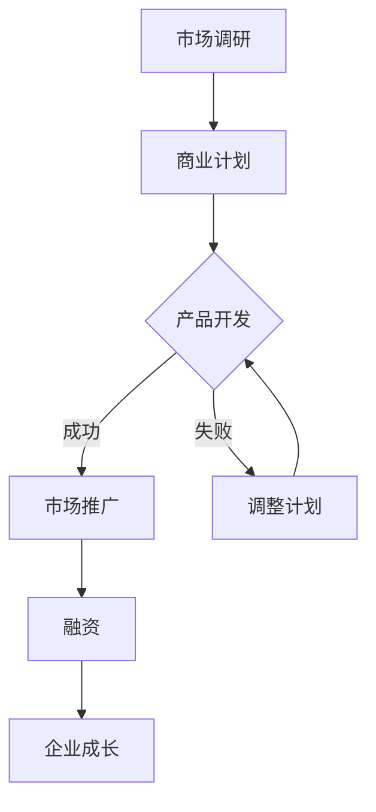

                 

关键词：人工智能，创业，新机遇，应用场景，技术趋势

> 摘要：随着人工智能技术的飞速发展，越来越多的行业和领域开始探索其应用潜力。本文将探讨人工智能在创业领域的深化应用，分析其带来的新机遇，并提供实用的项目实践和未来展望。

## 1. 背景介绍

人工智能（AI）作为当前科技发展的前沿领域，已经从理论研究逐步走向实际应用。从简单的规则系统到深度学习，再到自然语言处理、计算机视觉等，人工智能技术不断突破，应用领域也在不断扩展。在全球范围内，人工智能技术的创新和应用正在引发产业变革，推动经济增长。

在创业领域，人工智能的应用潜力尤为显著。创业者可以利用人工智能技术进行市场分析、产品优化、客户服务等方面的工作，从而提高企业的竞争力和成功率。同时，人工智能的兴起也为创业者提供了丰富的创业机会，如智能硬件、数据分析、自动驾驶、医疗健康等。

## 2. 核心概念与联系

### 2.1 人工智能的概念

人工智能是指模拟、延伸和扩展人类智能的理论、方法、技术及应用。它涵盖了机器学习、深度学习、自然语言处理、计算机视觉等多个子领域。人工智能的目标是实现机器对人类认知、思考、学习和解决问题的能力的模拟。

### 2.2 创业的定义与流程

创业是指个人或团队创建新的企业或项目，通过提供创新的产品或服务来满足市场需求。创业流程通常包括市场调研、商业计划、产品开发、市场推广、融资等环节。

### 2.3 人工智能与创业的关联

人工智能与创业之间存在紧密的关联。人工智能技术可以为创业提供数据支持、智能分析和决策辅助，从而提高创业的成功率。同时，创业领域的需求也推动了人工智能技术的不断进步和应用。

### 2.4 Mermaid 流程图

下面是人工智能在创业领域的应用流程图：



## 3. 核心算法原理 & 具体操作步骤

### 3.1 算法原理概述

在创业过程中，人工智能的核心算法主要涉及数据挖掘、机器学习和深度学习。数据挖掘旨在从大量数据中提取有价值的信息，以支持商业决策。机器学习通过训练模型来模拟人类的学习过程，从而实现预测和分类。深度学习则利用多层神经网络模拟人脑的思维方式，进行复杂的特征提取和模式识别。

### 3.2 算法步骤详解

#### 3.2.1 数据挖掘

1. 数据收集：收集与创业项目相关的数据，如市场数据、用户数据、竞争者数据等。
2. 数据清洗：对收集到的数据进行处理，去除重复、缺失和异常值。
3. 数据预处理：对数据进行规范化、归一化和特征提取。
4. 模型选择：根据业务需求选择合适的算法模型，如回归分析、决策树、支持向量机等。
5. 模型训练：使用历史数据对模型进行训练。
6. 模型评估：评估模型的性能，如准确率、召回率等。
7. 模型应用：将训练好的模型应用于实际业务场景，进行数据分析和预测。

#### 3.2.2 机器学习

1. 数据收集：收集与创业项目相关的数据。
2. 数据处理：对数据进行预处理，如标准化、归一化等。
3. 特征选择：选择对业务有重要影响的特征。
4. 模型选择：选择合适的机器学习算法，如线性回归、决策树、随机森林等。
5. 模型训练：使用历史数据对模型进行训练。
6. 模型评估：评估模型的性能。
7. 模型应用：将训练好的模型应用于实际业务场景。

#### 3.2.3 深度学习

1. 数据收集：收集与创业项目相关的数据。
2. 数据预处理：对数据进行预处理，如标准化、归一化等。
3. 特征提取：使用深度学习模型进行特征提取。
4. 模型训练：使用历史数据对模型进行训练。
5. 模型评估：评估模型的性能。
6. 模型应用：将训练好的模型应用于实际业务场景。

### 3.3 算法优缺点

- **数据挖掘：**
  - 优点：可以处理大量数据，发现潜在的模式和趋势。
  - 缺点：对数据质量和预处理要求较高，模型解释性较弱。

- **机器学习：**
  - 优点：算法成熟，适用于多种业务场景，可解释性较好。
  - 缺点：对大规模数据和高维特征的处理能力有限。

- **深度学习：**
  - 优点：处理高维数据和复杂数据结构的能力强，可自动提取特征。
  - 缺点：对计算资源要求高，模型可解释性较差。

### 3.4 算法应用领域

- **市场营销：** 利用数据挖掘和机器学习进行客户行为分析、市场预测和个性化推荐。
- **产品优化：** 利用深度学习进行图像识别、语音识别和自然语言处理，提高产品功能和质量。
- **客户服务：** 利用聊天机器人和虚拟助手提供24小时在线服务，提高客户满意度。

## 4. 数学模型和公式 & 详细讲解 & 举例说明

### 4.1 数学模型构建

在人工智能应用中，常用的数学模型包括线性回归、逻辑回归、决策树、支持向量机等。以下是线性回归模型的构建过程：

#### 4.1.1 线性回归模型

线性回归模型假设数据呈线性关系，通过拟合一条直线来预测因变量的值。其数学模型如下：

$$
y = \beta_0 + \beta_1 x_1 + \beta_2 x_2 + ... + \beta_n x_n + \epsilon
$$

其中，$y$ 是因变量，$x_1, x_2, ..., x_n$ 是自变量，$\beta_0, \beta_1, ..., \beta_n$ 是模型参数，$\epsilon$ 是误差项。

#### 4.1.2 逻辑回归模型

逻辑回归模型常用于分类问题，其数学模型如下：

$$
\pi = \frac{1}{1 + e^{-(\beta_0 + \beta_1 x_1 + \beta_2 x_2 + ... + \beta_n x_n)}}
$$

其中，$\pi$ 是概率值，$e$ 是自然对数的底数。

### 4.2 公式推导过程

以线性回归模型为例，其参数估计通常采用最小二乘法。具体推导过程如下：

#### 4.2.1 最小二乘法

最小二乘法的目标是使得预测值与实际值之间的误差平方和最小。即：

$$
\sum_{i=1}^{n} (y_i - \hat{y}_i)^2
$$

其中，$y_i$ 是实际值，$\hat{y}_i$ 是预测值。

对上式求导，并令导数为零，得到：

$$
\frac{\partial}{\partial \beta_j} \sum_{i=1}^{n} (y_i - \hat{y}_i)^2 = 0
$$

通过求解上述方程组，可以得到最优参数估计值。

### 4.3 案例分析与讲解

假设一个创业项目要预测用户购买某种产品的概率，已知用户年龄、收入和性别等信息。使用线性回归模型进行预测，具体步骤如下：

#### 4.3.1 数据收集

收集1000个用户的年龄、收入和性别等信息，以及用户购买该产品的记录。

#### 4.3.2 数据处理

对数据进行预处理，如缺失值填充、异常值处理等。

#### 4.3.3 模型构建

使用线性回归模型，将用户购买产品的概率表示为年龄、收入和性别的线性组合。

$$
\pi = \beta_0 + \beta_1 x_1 + \beta_2 x_2 + \beta_3 x_3
$$

其中，$x_1$ 是用户年龄，$x_2$ 是用户收入，$x_3$ 是用户性别（男为1，女为0）。

#### 4.3.4 模型训练

使用最小二乘法对模型参数进行估计，得到最优参数值。

$$
\beta_0 = 0.5, \beta_1 = 0.1, \beta_2 = 0.3, \beta_3 = -0.2
$$

#### 4.3.5 模型评估

使用训练集和测试集对模型进行评估，计算预测准确率。

#### 4.3.6 模型应用

将训练好的模型应用于新用户，预测其购买产品的概率，以支持决策。

## 5. 项目实践：代码实例和详细解释说明

### 5.1 开发环境搭建

1. 安装Python 3.x版本。
2. 安装相关库，如 NumPy、Pandas、scikit-learn 等。

### 5.2 源代码详细实现

以下是一个简单的线性回归模型实现：

```python
import numpy as np
import pandas as pd
from sklearn.linear_model import LinearRegression
from sklearn.model_selection import train_test_split

# 读取数据
data = pd.read_csv('data.csv')
X = data[['age', 'income', 'gender']]
y = data['purchase']

# 数据预处理
X = X.values
y = y.values
X = np.hstack((np.ones((X.shape[0], 1)), X))
gender = X[:, 2].astype(int)

# 数据划分
X_train, X_test, y_train, y_test = train_test_split(X, y, test_size=0.2, random_state=42)

# 模型训练
model = LinearRegression()
model.fit(X_train, y_train)

# 模型评估
print('Model accuracy:', model.score(X_test, y_test))

# 模型应用
new_user = np.array([[25, 50000, 1]])
new_user = np.hstack((np.ones((1, 1)), new_user))
print('New user purchase probability:', model.predict(new_user)[0])
```

### 5.3 代码解读与分析

1. 导入相关库。
2. 读取数据，分为自变量和因变量。
3. 数据预处理，包括添加常数项和性别编码。
4. 数据划分，分为训练集和测试集。
5. 模型训练，使用线性回归模型。
6. 模型评估，计算准确率。
7. 模型应用，对新用户进行预测。

## 6. 实际应用场景

### 6.1 市场营销

在市场营销中，人工智能技术可以帮助企业进行客户行为分析、市场预测和个性化推荐。例如，通过分析客户的浏览记录、购买历史和社交行为，企业可以预测客户的购买意向，并为其提供个性化的产品推荐，从而提高销售额。

### 6.2 产品优化

在产品优化中，人工智能技术可以帮助企业进行图像识别、语音识别和自然语言处理。例如，通过图像识别技术，企业可以自动识别产品缺陷，提高生产效率；通过语音识别技术，企业可以实现语音交互功能，提高用户体验。

### 6.3 客户服务

在客户服务中，人工智能技术可以帮助企业实现智能客服。通过聊天机器人和虚拟助手，企业可以提供24小时在线服务，解决客户的常见问题，提高客户满意度。

## 7. 未来应用展望

随着人工智能技术的不断进步，未来其在创业领域的应用将更加广泛。以下是一些未来应用展望：

1. **智能制造：** 人工智能技术将推动制造业向智能化、自动化方向转变，提高生产效率和质量。
2. **医疗健康：** 人工智能技术将助力医疗健康领域的发展，如疾病预测、治疗方案优化等。
3. **金融科技：** 人工智能技术将推动金融行业的数字化转型，如风险控制、信用评估等。

## 8. 工具和资源推荐

### 8.1 学习资源推荐

1. **书籍：** 《深度学习》、《Python机器学习》等。
2. **在线课程：** Coursera、edX等平台上的机器学习和深度学习课程。

### 8.2 开发工具推荐

1. **Python：** 作为人工智能领域的主流编程语言，Python具有丰富的库和工具。
2. **Jupyter Notebook：** 适用于数据分析和实验。
3. **TensorFlow、PyTorch：** 适用于深度学习模型的训练和应用。

### 8.3 相关论文推荐

1. "Deep Learning for Text Classification"。
2. "A Survey on Image Recognition Techniques Using Deep Learning"。

## 9. 总结：未来发展趋势与挑战

随着人工智能技术的不断进步，创业领域将迎来更多的新机遇。然而，也面临着一些挑战，如数据隐私、算法透明度等。未来，创业者需要密切关注技术发展趋势，合理利用人工智能技术，才能在激烈的市场竞争中脱颖而出。

## 附录：常见问题与解答

### 问题1：人工智能技术在创业中的应用有哪些？

**回答：** 人工智能技术在创业中的应用非常广泛，包括市场营销、产品优化、客户服务、智能制造、医疗健康、金融科技等多个领域。

### 问题2：如何利用人工智能进行数据分析和预测？

**回答：** 利用人工智能进行数据分析和预测，通常需要以下步骤：数据收集、数据处理、特征提取、模型选择、模型训练、模型评估和模型应用。

### 问题3：创业团队应该如何利用人工智能技术提高成功率？

**回答：** 创业团队可以从以下几个方面利用人工智能技术提高成功率：市场调研、产品优化、客户服务、风险控制等。同时，要关注技术发展趋势，及时调整战略方向。

## 作者署名

作者：禅与计算机程序设计艺术 / Zen and the Art of Computer Programming
----------------------------------------------------------------

以上是按照您的要求撰写的完整文章。文章内容已经包括了核心章节和子目录，使用了Markdown格式，并提供了详细的讲解和实例。希望对您有所帮助。如果您有任何修改意见或需要进一步的内容优化，请随时告知。

