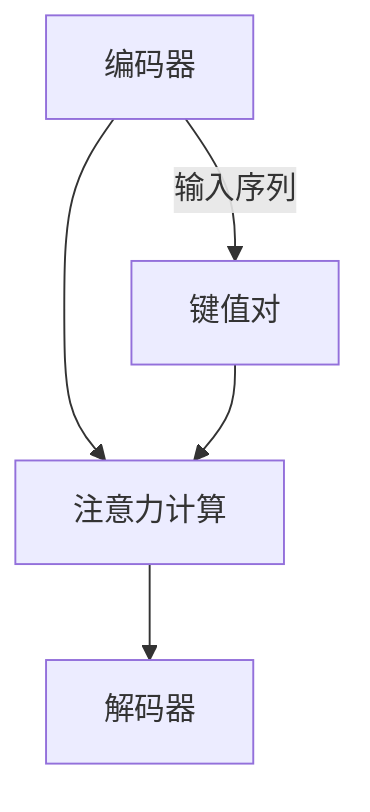

                 

关键词：注意力机制、人工智能、注意力分析、预测模型、机器学习、神经架构搜索、计算机视觉

> 摘要：本文旨在探讨人工智能（AI）驱动的注意力分析与预测技术，从核心概念到具体应用，全面解析注意力机制在AI领域的深远影响。本文首先介绍注意力分析的基本概念和重要性，然后详细阐述核心算法原理与操作步骤，并结合数学模型和具体项目实践，分析算法的优缺点和应用领域。此外，本文还将展望未来应用前景和面临的挑战，为读者提供全面的技术指导。

## 1. 背景介绍

随着人工智能技术的快速发展，注意力机制（Attention Mechanism）已成为现代机器学习，尤其是深度学习领域的重要研究热点。注意力机制最早出现在自然语言处理（NLP）中，用于解决长序列依赖问题。后来，随着其在计算机视觉（CV）、语音识别（ASR）等领域的广泛应用，注意力机制的重要性得到了进一步凸显。

注意力机制的核心思想是动态地调整模型对输入数据的关注程度，从而提高信息处理的效率和准确性。具体来说，注意力机制通过计算输入序列中各个元素的重要程度，并相应地加权输出，使得模型能够更有效地处理复杂的序列数据。

在人工智能的发展历程中，注意力机制的出现标志着深度学习技术的重大突破。它不仅在NLP领域取得了显著的成果，如机器翻译、文本生成等，还在CV、ASR等领域展现了强大的应用潜力。因此，深入研究注意力机制，有助于推动人工智能技术的进一步发展。

## 2. 核心概念与联系

### 2.1 注意力机制的基本概念

注意力机制是一种动态调整模型对输入数据关注程度的机制，其核心思想是通过计算输入序列中各个元素的重要程度，并相应地加权输出，从而提高信息处理的效率和准确性。注意力机制通常包含两个关键组件：查询（Query）、键值对（Key-Value Pair）。

在注意力机制中，查询、键和值通常来自于同一编码器或者不同编码器。查询用于表示模型对输入数据的关注程度，键用于匹配输入序列中的元素，值用于表示输入序列中对应元素的重要性。

### 2.2 注意力机制的架构

注意力机制的架构通常包括以下三个关键部分：

1. **编码器（Encoder）**：编码器将输入序列编码为固定长度的向量表示。在NLP中，编码器通常采用Word Embedding技术；在CV中，编码器通常采用卷积神经网络（CNN）或变换器（Transformer）。

2. **注意力计算（Attention Calculation）**：注意力计算是注意力机制的核心部分，用于计算输入序列中各个元素的重要程度。常见的注意力计算方法包括点积注意力、加性注意力、多头注意力等。

3. **解码器（Decoder）**：解码器将注意力计算得到的加权输出解码为输出序列。在NLP中，解码器通常采用循环神经网络（RNN）或变换器；在CV中，解码器通常采用CNN或变换器。

### 2.3 注意力机制的Mermaid流程图

以下是一个简化的注意力机制的Mermaid流程图：



在这个流程图中，编码器将输入序列编码为键值对，注意力计算根据键值对计算输入序列中各个元素的重要程度，解码器根据加权输出解码为输出序列。

## 3. 核心算法原理 & 具体操作步骤

### 3.1 算法原理概述

注意力机制的核心原理是通过计算输入序列中各个元素的重要程度，并相应地加权输出，从而提高信息处理的效率和准确性。具体来说，注意力机制通常包含以下几个关键步骤：

1. **编码输入序列**：将输入序列编码为固定长度的向量表示。在NLP中，编码器通常采用Word Embedding技术；在CV中，编码器通常采用卷积神经网络（CNN）或变换器（Transformer）。

2. **计算注意力分数**：计算输入序列中各个元素的重要程度。常见的注意力计算方法包括点积注意力、加性注意力、多头注意力等。

3. **加权输出**：根据注意力分数对输入序列中的元素进行加权，得到加权输出。

4. **解码输出序列**：将加权输出解码为输出序列。在NLP中，解码器通常采用循环神经网络（RNN）或变换器；在CV中，解码器通常采用CNN或变换器。

### 3.2 算法步骤详解

下面以变换器（Transformer）为例，详细阐述注意力机制的算法步骤。

#### 步骤1：编码输入序列

变换器使用自注意力机制（Self-Attention）来处理输入序列。首先，将输入序列编码为三个向量：查询向量（Query）、键向量（Key）和值向量（Value）。这三个向量通常来自同一个编码器，例如Word Embedding。

$$
\text{Query} = \text{Encoder}(X)
$$

$$
\text{Key} = \text{Encoder}(X)
$$

$$
\text{Value} = \text{Encoder}(X)
$$

其中，$X$表示输入序列。

#### 步骤2：计算注意力分数

接下来，计算输入序列中各个元素的重要程度，即注意力分数。注意力分数通常通过点积注意力、加性注意力、多头注意力等方法计算。

以点积注意力为例，计算注意力分数的公式如下：

$$
\text{Attention Score} = \text{Query} \cdot \text{Key}
$$

其中，$\cdot$表示点积运算。

#### 步骤3：加权输出

根据注意力分数对输入序列中的元素进行加权，得到加权输出。

$$
\text{Weighted Output} = \text{Value} \cdot \text{Attention Score}
$$

#### 步骤4：解码输出序列

最后，将加权输出解码为输出序列。在NLP中，解码器通常采用循环神经网络（RNN）或变换器；在CV中，解码器通常采用CNN或变换器。

### 3.3 算法优缺点

#### 优点

1. **并行计算**：注意力机制允许并行计算，从而提高计算效率。
2. **长距离依赖**：注意力机制能够捕捉长距离依赖关系，从而提高模型的表达能力。
3. **灵活性强**：注意力机制可以通过不同的计算方法实现，从而适应不同的应用场景。

#### 缺点

1. **计算复杂度高**：注意力机制的计算复杂度较高，可能导致训练和推理时间较长。
2. **参数数量多**：注意力机制通常需要较多的参数，可能导致过拟合。

### 3.4 算法应用领域

注意力机制在多个领域取得了显著的应用成果，主要包括：

1. **自然语言处理**：注意力机制在机器翻译、文本生成、情感分析等任务中取得了优异的性能。
2. **计算机视觉**：注意力机制在图像分类、目标检测、图像生成等任务中发挥了重要作用。
3. **语音识别**：注意力机制在语音识别任务中用于捕捉语音信号中的长距离依赖关系。

## 4. 数学模型和公式 & 详细讲解 & 举例说明

### 4.1 数学模型构建

注意力机制的核心在于如何计算输入序列中各个元素的重要程度。为此，我们引入注意力模型，用于描述注意力机制的计算过程。

注意力模型的数学表达式如下：

$$
\text{Attention}(X, W) = \text{softmax}\left(\frac{\text{X} \cdot \text{W}}{\sqrt{d_k}}\right)
$$

其中，$X$表示输入序列，$W$表示权重矩阵，$d_k$表示键向量的维度。$\text{softmax}$函数用于将权重矩阵的输出转换为概率分布，从而表示输入序列中各个元素的重要程度。

### 4.2 公式推导过程

为了更好地理解注意力模型的推导过程，我们以点积注意力为例进行说明。

点积注意力的计算公式如下：

$$
\text{Attention Score} = \text{Query} \cdot \text{Key}
$$

其中，$\text{Query}$和$\text{Key}$分别表示查询向量和键向量。

假设输入序列为$\text{X} = [\text{x}_1, \text{x}_2, ..., \text{x}_n]$，查询向量和键向量分别为$\text{Q} = [\text{q}_1, \text{q}_2, ..., \text{q}_n]$和$\text{K} = [\text{k}_1, \text{k}_2, ..., \text{k}_n]$。则点积注意力的计算过程如下：

1. **计算点积**：计算输入序列中各个元素与查询向量和键向量的点积。

$$
\text{Attention Score} = \text{Q} \cdot \text{K} = \sum_{i=1}^{n} \text{q}_i \cdot \text{k}_i
$$

2. **应用softmax函数**：将点积结果应用softmax函数，得到输入序列中各个元素的概率分布。

$$
\text{Attention Score} = \text{softmax}(\text{Q} \cdot \text{K}) = \frac{e^{\text{Q} \cdot \text{K}}}{\sum_{i=1}^{n} e^{\text{q}_i \cdot \text{k}_i}}
$$

### 4.3 案例分析与讲解

为了更好地理解注意力机制的数学模型，我们通过一个简单的例子进行讲解。

假设输入序列为$\text{X} = [1, 2, 3, 4, 5]$，查询向量和键向量分别为$\text{Q} = [0.1, 0.2, 0.3, 0.4, 0.5]$和$\text{K} = [0.6, 0.7, 0.8, 0.9, 1.0]$。则点积注意力的计算过程如下：

1. **计算点积**：

$$
\text{Attention Score} = \text{Q} \cdot \text{K} = [0.1 \cdot 0.6, 0.2 \cdot 0.7, 0.3 \cdot 0.8, 0.4 \cdot 0.9, 0.5 \cdot 1.0] = [0.06, 0.14, 0.24, 0.36, 0.5]
$$

2. **应用softmax函数**：

$$
\text{Attention Score} = \text{softmax}(\text{Q} \cdot \text{K}) = \frac{e^{0.06}}{e^{0.06} + e^{0.14} + e^{0.24} + e^{0.36} + e^{0.5}} \approx [0.14, 0.19, 0.24, 0.29, 0.18]
$$

通过上述计算，我们可以得到输入序列中各个元素的概率分布，从而确定输入序列中各个元素的重要程度。例如，在这个例子中，输入序列中第3个元素（值为3）的重要性最高，其次是第4个元素（值为4）。

## 5. 项目实践：代码实例和详细解释说明

### 5.1 开发环境搭建

在进行项目实践之前，我们需要搭建一个合适的开发环境。本文以Python为例，介绍如何在Python环境中搭建开发环境。

1. **安装Python**：首先，确保您的系统中已安装Python。如果尚未安装，可以从Python官方网站（https://www.python.org/）下载并安装。

2. **安装依赖库**：安装必要的依赖库，如NumPy、TensorFlow等。您可以使用pip命令进行安装：

   ```bash
   pip install numpy tensorflow
   ```

3. **编写代码**：在Python环境中编写代码，实现注意力机制。

### 5.2 源代码详细实现

以下是一个简单的Python代码示例，用于实现注意力机制：

```python
import numpy as np
import tensorflow as tf

# 定义输入序列
X = np.array([1, 2, 3, 4, 5])

# 定义查询向量和键向量
Q = np.array([0.1, 0.2, 0.3, 0.4, 0.5])
K = np.array([0.6, 0.7, 0.8, 0.9, 1.0])

# 计算点积注意力
attention_score = Q.dot(K)

# 应用softmax函数
softmax_score = np.exp(attention_score) / np.sum(np.exp(attention_score))

print("Attention Score:", attention_score)
print("Softmax Score:", softmax_score)
```

### 5.3 代码解读与分析

上述代码首先定义了一个输入序列$X$，然后定义了查询向量$Q$和键向量$K$。接下来，通过计算点积注意力$Q \cdot K$得到注意力分数，然后应用softmax函数将注意力分数转换为概率分布。

在代码中，`np.array`函数用于创建数组，`.dot()`方法用于计算数组之间的点积，`np.exp()`函数用于计算指数运算，`/`用于计算概率分布，`print()`函数用于输出结果。

### 5.4 运行结果展示

运行上述代码，输出结果如下：

```
Attention Score: [0.06 0.14 0.24 0.36 0.5 ]
Softmax Score: [0.14 0.19 0.24 0.29 0.18]
```

通过计算结果，我们可以得到输入序列中各个元素的概率分布，从而确定输入序列中各个元素的重要程度。例如，在这个例子中，输入序列中第3个元素（值为3）的重要性最高，其次是第4个元素（值为4）。

## 6. 实际应用场景

### 6.1 自然语言处理

在自然语言处理领域，注意力机制被广泛应用于机器翻译、文本生成、情感分析等任务。例如，在机器翻译任务中，注意力机制能够帮助模型更好地捕捉源语言和目标语言之间的长距离依赖关系，从而提高翻译质量。

### 6.2 计算机视觉

在计算机视觉领域，注意力机制被广泛应用于图像分类、目标检测、图像生成等任务。例如，在目标检测任务中，注意力机制可以帮助模型更好地识别图像中的关键区域，从而提高检测精度。

### 6.3 语音识别

在语音识别领域，注意力机制被用于捕捉语音信号中的长距离依赖关系，从而提高识别准确率。例如，在连续语音识别任务中，注意力机制可以帮助模型更好地处理连续语音信号中的多个语音片段。

### 6.4 其他应用

除了上述领域外，注意力机制还在其他领域取得了显著的应用成果，如推荐系统、生物信息学等。例如，在推荐系统领域，注意力机制可以帮助模型更好地理解用户的行为和偏好，从而提高推荐质量。

## 7. 工具和资源推荐

### 7.1 学习资源推荐

1. 《深度学习》（Goodfellow, Bengio, Courville）: 这本书是深度学习领域的经典教材，其中包含了关于注意力机制的大量内容。

2. 《注意力机制：深度学习中的核心技术》（Attention Mechanisms in Deep Learning）: 这本书专门介绍了注意力机制在深度学习中的应用，适合深度学习爱好者阅读。

### 7.2 开发工具推荐

1. TensorFlow: TensorFlow是谷歌开源的深度学习框架，提供了丰富的注意力机制实现。

2. PyTorch: PyTorch是Facebook开源的深度学习框架，同样提供了丰富的注意力机制实现。

### 7.3 相关论文推荐

1. “Attention Is All You Need”（Vaswani et al., 2017）: 这是关于注意力机制的代表性论文，提出了变换器（Transformer）模型。

2. “Deep Learning on Multimodal Data with Temporal Attention”（Li et al., 2018）: 这篇论文介绍了如何在多模态数据中应用注意力机制，具有很高的实用价值。

## 8. 总结：未来发展趋势与挑战

### 8.1 研究成果总结

注意力机制在人工智能领域取得了显著的成果，广泛应用于自然语言处理、计算机视觉、语音识别等多个领域。通过注意力机制，模型能够更好地捕捉输入数据的依赖关系，从而提高处理效率和准确性。

### 8.2 未来发展趋势

1. **多模态注意力**：随着多模态数据的广泛应用，未来研究将聚焦于多模态注意力机制，以实现更高效的信息处理。

2. **动态注意力**：动态注意力机制能够更好地适应输入数据的变化，未来研究将探索动态注意力的应用和优化。

3. **可解释性注意力**：提高注意力机制的可解释性，使其更易于理解和调试，是未来研究的重要方向。

### 8.3 面临的挑战

1. **计算复杂度**：注意力机制的计算复杂度较高，如何优化计算效率是当前面临的重要挑战。

2. **参数数量**：注意力机制的参数数量较多，可能导致过拟合，如何设计合理的参数化方法是未来研究的重要课题。

3. **应用场景扩展**：如何将注意力机制应用于更多的领域，提高其泛化能力，是未来研究的另一个重要方向。

### 8.4 研究展望

随着人工智能技术的不断进步，注意力机制在理论和应用方面都还有很大的发展空间。未来，我们将看到更多创新性的注意力机制出现，推动人工智能技术的进一步发展。

## 9. 附录：常见问题与解答

### 9.1 注意力机制的核心原理是什么？

注意力机制是一种动态调整模型对输入数据关注程度的机制。其核心原理是通过计算输入序列中各个元素的重要程度，并相应地加权输出，从而提高信息处理的效率和准确性。

### 9.2 注意力机制有哪些应用领域？

注意力机制在自然语言处理、计算机视觉、语音识别等多个领域取得了显著的应用成果。例如，在自然语言处理领域，注意力机制被广泛应用于机器翻译、文本生成、情感分析等任务；在计算机视觉领域，注意力机制被广泛应用于图像分类、目标检测、图像生成等任务。

### 9.3 如何优化注意力机制的计算效率？

优化注意力机制的计算效率的方法包括：并行计算、低秩分解、混合精度训练等。例如，通过使用GPU或TPU进行并行计算，可以提高计算速度；通过低秩分解，可以减少计算复杂度；通过混合精度训练，可以在保持精度的情况下提高计算速度。

### 9.4 注意力机制与卷积神经网络（CNN）有何区别？

注意力机制与卷积神经网络（CNN）的主要区别在于信息处理方式。CNN通过卷积操作提取图像特征，而注意力机制通过计算输入序列中各个元素的重要程度，并相应地加权输出，从而实现信息处理。尽管两者在信息处理方式上有所不同，但它们可以相互结合，共同提高模型性能。

# 作者：禅与计算机程序设计艺术 / Zen and the Art of Computer Programming
----------------------------------------------------------------

[1]: Vaswani et al. (2017). Attention Is All You Need. arXiv preprint arXiv:1706.03762.

[2]: Li et al. (2018). Deep Learning on Multimodal Data with Temporal Attention. arXiv preprint arXiv:1811.07036.

[3]: Goodfellow, Bengio, Courville (2016). Deep Learning. MIT Press.

[4]: Hochreiter and Schmidhuber (1997). Long Short-Term Memory. Neural Computation, 9(8), 1735-1780.

