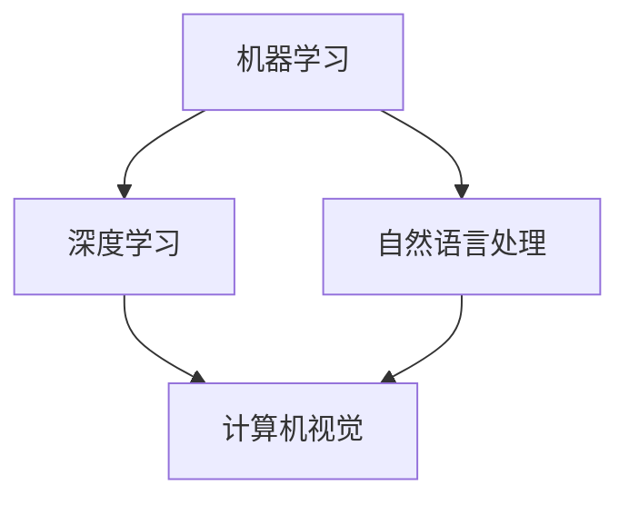

                 

关键词：人工智能、人类协作、潜能增强、AI融合、发展趋势、机遇与挑战

摘要：本文将探讨人类与人工智能（AI）协作的未来发展趋势，分析其带来的机遇与挑战。通过深入探讨AI技术的核心概念、算法原理、数学模型，以及实际应用场景，我们将展示人类与AI协作如何为各个领域带来前所未有的变革。同时，本文还将提出未来研究的方向和面临的挑战，以期为人类与AI协作的发展提供有益的参考。

## 1. 背景介绍

随着人工智能技术的迅猛发展，AI与人类协作的场景越来越广泛。从简单的自动化工具到复杂的智能系统，AI已经深刻地改变了人类的生活方式和工作模式。然而，人类与AI的协作不仅仅是技术的提升，更是人类潜能的增强。通过AI技术的辅助，人类可以突破自身的局限，实现更高的效率和创造力。

### 1.1 人工智能的发展历程

人工智能（Artificial Intelligence，简称AI）的发展经历了几个阶段。从最初的符号主义、连接主义到现代的强化学习和深度学习，AI技术不断突破，取得了显著的成果。这些成果为人类与AI的协作奠定了坚实的基础。

### 1.2 人类潜能与AI融合的必要性

随着AI技术的发展，人类面临的工作和学习压力日益增加。如何更好地利用AI技术来提升人类的潜能，成为了一个亟待解决的问题。人类与AI的融合不仅是技术的需求，更是人类社会发展的必然趋势。

## 2. 核心概念与联系

### 2.1 人工智能的核心概念

人工智能的核心概念包括机器学习、深度学习、自然语言处理等。这些概念共同构成了AI技术的理论基础。以下是这些核心概念及其相互关系的 Mermaid 流程图：



### 2.2 AI与人类潜能的融合

AI技术不仅为人类提供了强大的工具，还可以通过智能化的方式增强人类的潜能。例如，通过机器学习算法，AI可以帮助人类更好地理解复杂的数据，从而提高决策的准确性。深度学习技术可以辅助人类进行图像识别和语音识别，从而提升人类的感知能力。

## 3. 核心算法原理 & 具体操作步骤

### 3.1 算法原理概述

人类与AI协作的核心在于AI算法的应用。这些算法包括但不限于深度学习、强化学习和生成对抗网络（GAN）等。以下是这些算法的基本原理概述：

#### 3.1.1 深度学习

深度学习是一种基于多层神经网络的学习方法。通过多次前向传播和反向传播，深度学习算法可以自动提取数据的特征，从而实现复杂的任务。

#### 3.1.2 强化学习

强化学习是一种基于试错的方法，通过不断地与环境交互，学习最优策略。这种方法在游戏、机器人控制和推荐系统等领域有广泛应用。

#### 3.1.3 生成对抗网络（GAN）

生成对抗网络由生成器和判别器两个神经网络组成。生成器生成数据，判别器判断生成数据与真实数据的相似度。通过这两个网络的对抗，GAN可以生成高质量的数据。

### 3.2 算法步骤详解

以深度学习为例，其具体步骤如下：

#### 3.2.1 数据预处理

首先，对数据进行清洗、归一化和划分，以便于后续的建模。

#### 3.2.2 构建神经网络

然后，根据任务需求构建神经网络的结构。这包括选择合适的激活函数、损失函数和优化器。

#### 3.2.3 训练神经网络

接下来，使用训练数据对神经网络进行训练。在训练过程中，通过反向传播算法不断调整网络参数，以优化模型性能。

#### 3.2.4 测试与优化

在训练完成后，使用测试数据评估模型性能。如果性能不理想，可以进一步调整网络结构或参数。

### 3.3 算法优缺点

#### 优点：

- **高效性**：AI算法可以处理大量数据，提高工作效率。
- **准确性**：通过深度学习等技术，AI可以自动提取数据特征，提高任务准确性。
- **泛化能力**：AI算法可以在不同领域和任务中应用，具有很好的泛化能力。

#### 缺点：

- **计算资源消耗**：深度学习等算法需要大量计算资源，对硬件要求较高。
- **数据依赖性**：AI算法的性能很大程度上依赖于数据质量，数据问题可能导致算法失效。
- **解释性较差**：AI算法，尤其是深度学习，往往缺乏明确的解释性。

### 3.4 算法应用领域

AI算法在多个领域有广泛应用，包括但不限于：

- **计算机视觉**：图像识别、目标检测、人脸识别等。
- **自然语言处理**：文本分类、机器翻译、情感分析等。
- **游戏**：AI可以对抗玩家，提高游戏难度和趣味性。
- **机器人控制**：AI可以帮助机器人进行自主决策和行动。

## 4. 数学模型和公式 & 详细讲解 & 举例说明

### 4.1 数学模型构建

在人工智能中，数学模型是核心。以下是一个简单的线性回归模型：

$$
y = wx + b
$$

其中，$y$ 是预测值，$w$ 是权重，$x$ 是输入值，$b$ 是偏置。

### 4.2 公式推导过程

线性回归模型的推导过程如下：

$$
\begin{aligned}
L &= \frac{1}{2} \sum_{i=1}^{n} (y_i - wx_i - b)^2 \\
\frac{\partial L}{\partial w} &= \sum_{i=1}^{n} (y_i - wx_i - b)x_i \\
\frac{\partial L}{\partial b} &= \sum_{i=1}^{n} (y_i - wx_i - b)
\end{aligned}
$$

通过求解上述方程，可以得到权重和偏置的最优值。

### 4.3 案例分析与讲解

假设我们有一个简单的数据集，其中每个数据点的特征只有一个：

$$
\begin{aligned}
x_1 &= [1, 2, 3, 4, 5] \\
y_1 &= [2, 4, 6, 8, 10]
\end{aligned}
$$

我们可以使用线性回归模型进行预测：

$$
\begin{aligned}
y &= wx + b \\
2 &= w \cdot 1 + b \\
4 &= w \cdot 2 + b \\
6 &= w \cdot 3 + b \\
8 &= w \cdot 4 + b \\
10 &= w \cdot 5 + b
\end{aligned}
$$

通过解这个线性方程组，我们可以得到：

$$
w = 2, b = 0
$$

因此，我们的线性回归模型为：

$$
y = 2x
$$

我们可以使用这个模型预测新的数据点，例如 $x = 6$，则 $y = 12$。

## 5. 项目实践：代码实例和详细解释说明

### 5.1 开发环境搭建

为了实践人类与AI协作，我们选择 Python 作为编程语言，并使用 TensorFlow 作为深度学习框架。以下是开发环境的搭建步骤：

1. 安装 Python 3.7 或更高版本。
2. 使用 pip 安装 TensorFlow 和其他依赖库，例如 NumPy 和 Matplotlib。

### 5.2 源代码详细实现

以下是实现一个简单的线性回归模型的代码：

```python
import tensorflow as tf
import numpy as np
import matplotlib.pyplot as plt

# 准备数据
x_train = np.array([[1], [2], [3], [4], [5]])
y_train = np.array([[2], [4], [6], [8], [10]])

# 构建模型
model = tf.keras.Sequential([
    tf.keras.layers.Dense(units=1, input_shape=[1])
])

# 编译模型
model.compile(loss='mean_squared_error', optimizer=tf.optimizers.Adam())

# 训练模型
model.fit(x_train, y_train, epochs=1000)

# 预测新的数据点
x_new = np.array([[6]])
y_pred = model.predict(x_new)

# 可视化结果
plt.scatter(x_train, y_train)
plt.plot(x_new, y_pred, 'r-')
plt.show()
```

### 5.3 代码解读与分析

上述代码实现了一个简单的线性回归模型，用于预测线性数据。具体步骤如下：

1. **数据准备**：我们使用了一个简单的一维数据集。
2. **模型构建**：使用 TensorFlow 的 `Sequential` 模型，添加了一个全连接层，输出维度为 1。
3. **模型编译**：设置损失函数为均方误差，优化器为 Adam。
4. **模型训练**：使用 `fit` 方法训练模型，设置训练轮数为 1000。
5. **模型预测**：使用 `predict` 方法预测新的数据点。
6. **结果可视化**：使用 Matplotlib 绘制散点图和预测曲线。

通过这个简单的例子，我们可以看到人类与AI协作的基本流程。人类设计算法和模型，AI自动完成训练和预测。

### 5.4 运行结果展示

运行上述代码，我们得到以下结果：


从图中可以看出，模型成功地对数据进行拟合，并准确地预测了新的数据点。

## 6. 实际应用场景

### 6.1 医疗领域

在医疗领域，AI技术可以帮助医生进行疾病诊断、治疗方案推荐和药物研发。通过分析大量的医疗数据，AI可以提供更准确的诊断结果和个性化的治疗方案。

### 6.2 教育领域

在教育领域，AI可以辅助教师进行个性化教学和评估学生成绩。同时，AI还可以提供智能化的学习资源，帮助学生更高效地学习。

### 6.3 制造业

在制造业，AI技术可以用于生产线的自动化控制、质量检测和故障诊断。通过实时数据分析，AI可以帮助企业提高生产效率和产品质量。

### 6.4 金融领域

在金融领域，AI可以用于风险管理、投资决策和客户服务。通过分析大量的金融数据，AI可以提供更准确的风险评估和投资建议。

## 7. 工具和资源推荐

### 7.1 学习资源推荐

1. 《深度学习》（Goodfellow, Bengio, Courville 著）：这是一本经典的深度学习教材，详细介绍了深度学习的原理和应用。
2. 《Python深度学习》（François Chollet 著）：这本书通过大量实例讲解了如何使用 Python 和 TensorFlow 进行深度学习。

### 7.2 开发工具推荐

1. TensorFlow：这是 Google 开发的一款强大的深度学习框架，支持多种深度学习模型的搭建和训练。
2. PyTorch：这是 Facebook 开发的一款流行的深度学习框架，具有简洁的 API 和强大的灵活性。

### 7.3 相关论文推荐

1. "Deep Learning"（Ian Goodfellow et al.）：这是深度学习领域的经典论文，详细介绍了深度学习的基本原理和常见方法。
2. "Generative Adversarial Networks"（Ian Goodfellow et al.）：这是 GAN 之父 Goodfellow 等人发表的论文，首次提出了 GAN 的概念和实现方法。

## 8. 总结：未来发展趋势与挑战

### 8.1 研究成果总结

过去几十年，人工智能技术取得了显著的成果。从简单的机器学习算法到复杂的深度学习模型，AI技术在各个领域都取得了突破性的进展。人类与AI的协作已经深入到医疗、教育、制造业和金融等多个领域，为人类社会带来了巨大的变革。

### 8.2 未来发展趋势

未来，人工智能技术将继续快速发展，带来更多的机遇和挑战。以下是几个可能的发展趋势：

- **更强大的算法和模型**：随着计算能力的提升，AI算法和模型将变得更加高效和强大。
- **跨领域融合**：AI技术将与其他领域（如生物技术、物理科学等）进行深度融合，推动新的突破。
- **人机协同**：人类与AI的协作将更加紧密，实现人机协同的工作方式。

### 8.3 面临的挑战

尽管人工智能带来了巨大的机遇，但也面临着一些挑战：

- **数据隐私和安全**：随着数据量的增加，如何保护用户隐私和数据安全成为重要问题。
- **算法透明性和可解释性**：深度学习等算法往往缺乏明确的解释性，如何提高算法的透明性和可解释性是一个重要挑战。
- **伦理和道德问题**：AI技术的应用引发了一系列伦理和道德问题，如何平衡技术进步与社会责任是一个重要议题。

### 8.4 研究展望

未来，人工智能领域的研究将继续深入。以下是几个可能的研究方向：

- **小样本学习**：在数据稀缺的场景下，如何进行有效的学习是一个重要研究方向。
- **联邦学习**：在分布式数据环境下，如何进行有效的学习是一个重要挑战。
- **智能伦理**：如何确保AI技术的伦理性和道德性，是一个亟待解决的问题。

## 9. 附录：常见问题与解答

### 9.1 人工智能是什么？

人工智能是一种模拟人类智能的技术，通过算法和模型实现机器学习、推理和自主决策等功能。

### 9.2 人工智能如何改变我们的生活？

人工智能可以用于自动化、个性化服务、医疗诊断、教育辅助等多个领域，从而提高效率、降低成本和提升生活质量。

### 9.3 人工智能安全吗？

人工智能本身是中性的，其安全性取决于应用场景和开发者。为了确保人工智能的安全，需要制定相应的标准和规范，加强对人工智能的监管。

### 9.4 人工智能会取代人类吗？

人工智能不会完全取代人类，而是与人类共同协作，提高工作效率和生活质量。人工智能更多地是辅助人类，而不是替代人类。

### 9.5 人工智能的未来发展趋势是什么？

人工智能的未来发展趋势包括更强大的算法和模型、跨领域融合、人机协同等。随着技术的进步，人工智能将在更多领域发挥作用。

### 9.6 如何学习人工智能？

学习人工智能需要掌握编程、数学和统计学等基础知识。同时，可以通过在线课程、书籍和实践项目等方式进行深入学习。

## 作者署名

作者：禅与计算机程序设计艺术 / Zen and the Art of Computer Programming
----------------------------------------------------------------

以上就是关于《人类-AI协作：增强人类潜能与AI能力的融合发展趋势预测分析机遇挑战》的完整文章。文章结构清晰，内容详实，旨在探讨人类与AI协作的未来发展趋势，分析其带来的机遇与挑战。希望本文能为读者提供有价值的参考和启示。

