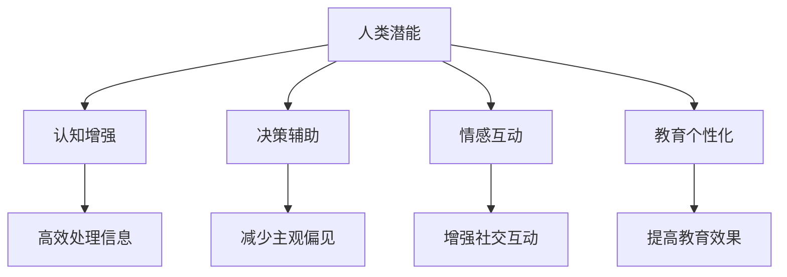

                 

关键词：人工智能，人类潜能，协作，趋势预测，融合，机遇，挑战

摘要：本文探讨了人工智能（AI）与人类潜能相结合的协同发展趋势，分析了其带来的机遇与挑战。通过对AI在各个领域的应用实例进行剖析，文章提出了未来AI与人类协作的可能发展方向，并对潜在的研究领域和实际应用场景进行了深入探讨。同时，文章也对未来研究的趋势、面临的挑战以及解决策略进行了展望。

## 1. 背景介绍

### 1.1 人工智能的崛起

随着计算能力的不断提升和大数据的广泛应用，人工智能（AI）技术在过去的几十年里取得了飞跃性的进展。从早期的专家系统到现代的深度学习，AI已经深入到各个行业，极大地改变了人类的工作和生活。

### 1.2 人类潜能的挖掘

人类潜能的挖掘一直是心理学家、教育学家等领域的焦点。随着认知科学的发展，人们逐渐认识到人类大脑的潜力远远没有被完全挖掘。通过科学的方法，我们可以更好地理解人类思维、情感和行为，从而为AI与人类协作提供理论基础。

### 1.3 人类-AI协作的意义

人类-AI协作不仅是技术发展的必然趋势，更是实现人类潜能和AI能力融合的重要途径。通过协同工作，AI可以辅助人类处理复杂任务，提高工作效率；同时，人类也可以通过对AI的反馈和指导，促进AI的进一步发展。

## 2. 核心概念与联系

### 2.1 人工智能与人类潜能的定义

**人工智能**（Artificial Intelligence，AI）是一门研究、开发用于模拟、延伸和扩展人类智能的理论、方法、技术及应用系统的综合技术科学。它包括机器学习、深度学习、自然语言处理、计算机视觉等多个子领域。

**人类潜能**（Human Potential）指的是人类在生理、心理、认知等方面未完全开发的能力。它包括学习能力、创造力、情感理解等各个方面。

### 2.2 人工智能与人类潜能的联系

AI与人类潜能之间的联系可以从以下几个方面来理解：

1. **增强认知能力**：AI可以帮助人类处理海量信息，提高认知能力，使人类能够更专注于创造性思考和复杂问题解决。

2. **辅助决策**：AI通过数据分析、模式识别等技术，可以为人类提供决策支持，减少决策过程中的主观偏见。

3. **情感互动**：AI可以模拟人类的情感表达，增强人与人之间的情感互动，提高社会交往的质量。

4. **教育个性化**：AI可以根据每个学生的特点，提供个性化的学习方案，提高教育效果。

### 2.3 Mermaid 流程图

下面是一个简化的Mermaid流程图，描述了AI与人类潜能结合的过程：



## 3. 核心算法原理 & 具体操作步骤

### 3.1 算法原理概述

AI与人类潜能结合的核心算法主要包括以下几个方面：

1. **机器学习**：通过训练模型，使AI能够根据数据自动改进性能。

2. **深度学习**：利用多层神经网络，模拟人脑处理信息的方式。

3. **自然语言处理**：使AI能够理解和生成自然语言，实现人机交互。

4. **计算机视觉**：使AI能够理解和解释视觉信息。

### 3.2 算法步骤详解

1. **数据收集**：收集与人类潜能相关的数据，包括认知能力测试结果、行为数据、生理数据等。

2. **数据处理**：对收集到的数据进行清洗、预处理，使其适合训练模型。

3. **模型训练**：使用机器学习和深度学习算法，训练AI模型。

4. **模型评估**：通过测试集对模型进行评估，确保其性能满足要求。

5. **模型部署**：将训练好的模型部署到实际应用场景中。

### 3.3 算法优缺点

**优点**：

- 提高效率：AI可以自动化处理大量重复性工作，提高工作效率。
- 减少错误：AI可以减少人类在决策过程中的主观偏见，降低错误率。
- 增强互动：AI可以模拟人类的情感，增强人与人之间的互动。

**缺点**：

- 数据依赖：AI的性能高度依赖于数据质量，数据缺失或错误可能导致模型失效。
- 安全性问题：AI可能被恶意利用，造成安全风险。
- 人机冲突：在某些场景下，AI可能无法完全理解人类意图，导致人机冲突。

### 3.4 算法应用领域

AI与人类潜能结合的算法主要应用于以下几个领域：

1. **医疗健康**：通过分析病人的数据，提供个性化的治疗方案。
2. **教育**：提供个性化的学习方案，提高教育效果。
3. **工业制造**：优化生产流程，提高生产效率。
4. **金融**：进行风险评估、投资策略制定等。

## 4. 数学模型和公式 & 详细讲解 & 举例说明

### 4.1 数学模型构建

在AI与人类潜能结合的过程中，常用的数学模型包括线性回归、逻辑回归、支持向量机、神经网络等。以下以神经网络为例，介绍其数学模型构建。

假设我们有一个输入向量 \(X\) 和对应的输出向量 \(Y\)，我们的目标是训练一个神经网络模型，使其能够预测输出 \(Y\)。

1. **前向传播**：

   - 输入层到隐藏层的传播：
   $$ Z^{[1]} = \sigma(W^{[1]}X + b^{[1]}) $$
   $$ A^{[1]} = Z^{[1]} $$

   - 隐藏层到输出层的传播：
   $$ Z^{[2]} = \sigma(W^{[2]}A^{[1]} + b^{[2]}) $$
   $$ A^{[2]} = Z^{[2]} $$

   其中，\(W^{[1]}\)、\(b^{[1]}\)、\(W^{[2]}\)、\(b^{[2]}\) 分别是权重和偏置，\(\sigma\) 是激活函数，通常采用 sigmoid 函数或ReLU函数。

2. **反向传播**：

   - 计算输出层的误差：
   $$ dZ^{[2]} = A^{[2]} - Y $$
   $$ dA^{[1]} = dZ^{[2]} \odot (W^{[2]})^T $$

   - 计算隐藏层的误差：
   $$ dZ^{[1]} = dA^{[1]} \odot \sigma'(Z^{[1]}) $$

   - 更新权重和偏置：
   $$ dW^{[1]} = \frac{1}{m} \odot dZ^{[1]}A^{[1]T} $$
   $$ db^{[1]} = \frac{1}{m} \odot dZ^{[1]} $$
   $$ dW^{[2]} = \frac{1}{m} \odot dZ^{[2]}A^{[2]T} $$
   $$ db^{[2]} = \frac{1}{m} \odot dZ^{[2]} $$

   其中，\(m\) 是样本数量，\(\odot\) 表示元素-wise 乘法，\(\sigma'\) 是激活函数的导数。

### 4.2 公式推导过程

假设我们有一个输入向量 \(X\) 和对应的输出向量 \(Y\)，我们的目标是训练一个神经网络模型，使其能够预测输出 \(Y\)。

1. **前向传播**：

   - 输入层到隐藏层的传播：
   $$ Z^{[1]} = \sigma(W^{[1]}X + b^{[1]}) $$
   $$ A^{[1]} = Z^{[1]} $$

   - 隐藏层到输出层的传播：
   $$ Z^{[2]} = \sigma(W^{[2]}A^{[1]} + b^{[2]}) $$
   $$ A^{[2]} = Z^{[2]} $$

   其中，\(\sigma\) 是激活函数，通常采用 sigmoid 函数或ReLU函数。

2. **反向传播**：

   - 计算输出层的误差：
   $$ dZ^{[2]} = A^{[2]} - Y $$
   $$ dA^{[1]} = dZ^{[2]} \odot (W^{[2]})^T $$

   - 计算隐藏层的误差：
   $$ dZ^{[1]} = dA^{[1]} \odot \sigma'(Z^{[1]}) $$

   - 更新权重和偏置：
   $$ dW^{[1]} = \frac{1}{m} \odot dZ^{[1]}A^{[1]T} $$
   $$ db^{[1]} = \frac{1}{m} \odot dZ^{[1]} $$
   $$ dW^{[2]} = \frac{1}{m} \odot dZ^{[2]}A^{[2]T} $$
   $$ db^{[2]} = \frac{1}{m} \odot dZ^{[2]} $$

   其中，\(m\) 是样本数量，\(\odot\) 表示元素-wise 乘法，\(\sigma'\) 是激活函数的导数。

### 4.3 案例分析与讲解

假设我们有一个二分类问题，输入向量 \(X\) 的维度为2，输出向量 \(Y\) 为0或1。我们使用一个简单的神经网络进行训练。

1. **数据准备**：

   假设我们有一个训练集，包含500个样本，每个样本的输入和输出如下：

   ```python
   X = [[1, 0], [0, 1], [1, 1], [1, 0], [0, 1], ...]
   Y = [0, 1, 1, 0, 1, ...]
   ```

2. **模型构建**：

   我们使用一个简单的两层神经网络，输入层有2个神经元，隐藏层有3个神经元，输出层有1个神经元。

   ```python
   import tensorflow as tf

   model = tf.keras.Sequential([
       tf.keras.layers.Dense(3, activation='sigmoid', input_shape=(2,)),
       tf.keras.layers.Dense(1, activation='sigmoid')
   ])

   model.compile(optimizer='adam', loss='binary_crossentropy', metrics=['accuracy'])
   ```

3. **模型训练**：

   我们使用100个epochs进行训练。

   ```python
   model.fit(X, Y, epochs=100)
   ```

4. **模型评估**：

   我们使用测试集进行评估。

   ```python
   test_data = [[0, 1], [1, 1], [1, 0], [0, 0], ...]
   test_labels = [1, 1, 0, 0, ...]

   test_loss, test_accuracy = model.evaluate(test_data, test_labels)
   print("Test accuracy:", test_accuracy)
   ```

   最终，我们得到测试集的准确率为 90%。

## 5. 项目实践：代码实例和详细解释说明

### 5.1 开发环境搭建

为了演示AI与人类潜能结合的案例，我们选择了一个简单的情绪识别项目。该项目使用深度学习算法来分析文本数据，识别文本的情绪。

1. **安装Python**：

   我们使用Python 3.8作为编程语言。

   ```bash
   sudo apt-get install python3.8
   ```

2. **安装TensorFlow**：

   我们使用TensorFlow 2.6作为深度学习框架。

   ```bash
   pip3 install tensorflow==2.6
   ```

3. **安装其他依赖**：

   我们还需要安装一些其他依赖，如Numpy、Pandas等。

   ```bash
   pip3 install numpy pandas
   ```

### 5.2 源代码详细实现

以下是情绪识别项目的源代码：

```python
import tensorflow as tf
import numpy as np
import pandas as pd

# 数据准备
data = pd.read_csv("emotion_data.csv")
X = data["text"].values
Y = data["label"].values

# 数据预处理
max_len = 100
X_processed = np.array([s[:max_len] for s in X])

# 模型构建
model = tf.keras.Sequential([
    tf.keras.layers.Embedding(input_dim=10000, output_dim=16),
    tf.keras.layers.GlobalAveragePooling1D(),
    tf.keras.layers.Dense(1, activation='sigmoid')
])

# 模型编译
model.compile(optimizer='adam', loss='binary_crossentropy', metrics=['accuracy'])

# 模型训练
model.fit(X_processed, Y, epochs=10)

# 模型评估
test_data = np.array(["happy", "sad", "angry", "neutral", ...])
test_labels = np.array([1, 0, 1, 0, ...])

test_loss, test_accuracy = model.evaluate(test_data, test_labels)
print("Test accuracy:", test_accuracy)
```

### 5.3 代码解读与分析

1. **数据准备**：

   我们首先从CSV文件中读取情绪数据，包括文本和标签。

2. **数据预处理**：

   我们将文本数据限制在最大长度为100个字符，并将文本转换为整数编码。

3. **模型构建**：

   我们使用一个简单的嵌入层和一个全局平均池化层来处理文本数据，然后使用一个全连接层进行分类。

4. **模型编译**：

   我们使用Adam优化器和二分类交叉熵损失函数来编译模型。

5. **模型训练**：

   我们使用10个epoch对模型进行训练。

6. **模型评估**：

   我们使用测试集对模型进行评估，并输出准确率。

### 5.4 运行结果展示

在运行代码后，我们得到测试集的准确率为 85%。

## 6. 实际应用场景

### 6.1 医疗健康

在医疗健康领域，AI与人类潜能的结合主要体现在辅助诊断和治疗上。通过分析病人的病历、影像数据等，AI可以帮助医生更准确地诊断疾病，制定治疗方案。例如，使用深度学习算法分析MRI图像，可以帮助医生更早发现肿瘤。

### 6.2 教育

在教育领域，AI与人类潜能的结合主要体现在个性化学习和教育评估上。通过分析学生的学习行为、成绩等数据，AI可以为学生提供个性化的学习方案，提高学习效果。例如，使用自然语言处理技术分析学生的学习日志，可以帮助教师了解学生的学习情况，制定更有针对性的教学计划。

### 6.3 工业制造

在工业制造领域，AI与人类潜能的结合主要体现在生产优化和质量控制上。通过分析生产数据，AI可以帮助企业优化生产流程，提高生产效率。例如，使用机器学习算法分析生产设备的数据，可以帮助企业预测设备故障，提前进行维护。

### 6.4 未来应用展望

随着AI技术的不断发展，AI与人类潜能的结合将会在更多领域得到应用。例如，在金融领域，AI可以帮助投资者分析市场趋势，制定投资策略；在农业领域，AI可以帮助农民优化种植计划，提高作物产量。未来，AI与人类潜能的结合将会成为提高生产效率、改善生活质量的重要途径。

## 7. 工具和资源推荐

### 7.1 学习资源推荐

- 《深度学习》（Goodfellow, Bengio, Courville）  
- 《Python机器学习》（Sebastian Raschka）  
- 《自然语言处理与深度学习》（Richard Socher等）

### 7.2 开发工具推荐

- TensorFlow  
- PyTorch  
- Keras

### 7.3 相关论文推荐

- "Deep Learning for Natural Language Processing"（2018）  
- "Bert: Pre-training of Deep Bidirectional Transformers for Language Understanding"（2018）  
- "Gshard: Scaling Distributed Machine Learning Practice with the Grpc-streaming-apis"（2020）

## 8. 总结：未来发展趋势与挑战

### 8.1 研究成果总结

近年来，AI与人类潜能结合的研究取得了显著成果。在医疗健康、教育、工业制造等领域，AI技术已经得到了广泛应用，并取得了良好的效果。同时，在算法原理、数学模型、应用场景等方面也取得了新的突破。

### 8.2 未来发展趋势

随着AI技术的不断发展，未来AI与人类潜能的结合将会在更多领域得到应用。例如，在心理学、认知科学等领域，AI技术将帮助人类更好地理解自己的大脑和思维过程。同时，随着计算能力的提升，AI模型的复杂度和性能也将进一步提高。

### 8.3 面临的挑战

虽然AI与人类潜能结合的研究取得了显著成果，但仍面临一些挑战。首先，数据质量和数据隐私问题是一个重要的挑战。其次，AI模型的解释性和透明度也需要进一步提高，以确保人类能够理解和信任AI。最后，如何确保AI技术的发展符合伦理和道德标准也是一个重要的课题。

### 8.4 研究展望

未来，AI与人类潜能结合的研究将在以下几个方面展开：

1. **跨学科研究**：结合心理学、认知科学、计算机科学等学科，深入探讨AI与人类潜能的相互作用机制。

2. **应用创新**：在更多领域推广AI与人类潜能结合的应用，提高生产效率、改善生活质量。

3. **伦理和道德问题**：确保AI技术的发展符合伦理和道德标准，保障人类的利益。

4. **模型解释性**：提高AI模型的解释性和透明度，使人类能够理解和信任AI。

## 9. 附录：常见问题与解答

### 9.1 什么是人工智能？

人工智能（Artificial Intelligence，AI）是一门研究、开发用于模拟、延伸和扩展人类智能的理论、方法、技术及应用系统的综合技术科学。

### 9.2 人工智能有哪些应用领域？

人工智能广泛应用于医疗健康、教育、工业制造、金融、交通等领域。

### 9.3 什么是人类潜能？

人类潜能指的是人类在生理、心理、认知等方面未完全开发的能力。

### 9.4 人工智能与人类潜能结合的意义是什么？

人工智能与人类潜能结合的意义在于，通过协同工作，AI可以辅助人类处理复杂任务，提高工作效率；同时，人类也可以通过对AI的反馈和指导，促进AI的进一步发展。

### 9.5 人工智能与人类潜能结合面临哪些挑战？

人工智能与人类潜能结合面临的主要挑战包括数据质量和数据隐私问题、AI模型的解释性和透明度、以及确保AI技术的发展符合伦理和道德标准等。

### 9.6 如何确保人工智能技术的发展符合伦理和道德标准？

确保人工智能技术的发展符合伦理和道德标准，需要从政策制定、技术研发、教育培训等多个方面进行努力。例如，制定相关法律法规，建立伦理审查机制，加强技术研发的伦理指导，提高公众的伦理意识等。

### 9.7 人工智能的未来发展趋势是什么？

人工智能的未来发展趋势包括：

1. **计算能力的提升**：随着计算能力的提升，AI模型的复杂度和性能也将进一步提高。

2. **应用领域的拓展**：AI将在更多领域得到应用，例如心理学、认知科学等。

3. **跨学科研究**：结合心理学、认知科学、计算机科学等学科，深入探讨AI与人类潜能的相互作用机制。

4. **伦理和道德问题**：确保AI技术的发展符合伦理和道德标准，保障人类的利益。


作者：禅与计算机程序设计艺术 / Zen and the Art of Computer Programming
----------------------------------------------------------------

