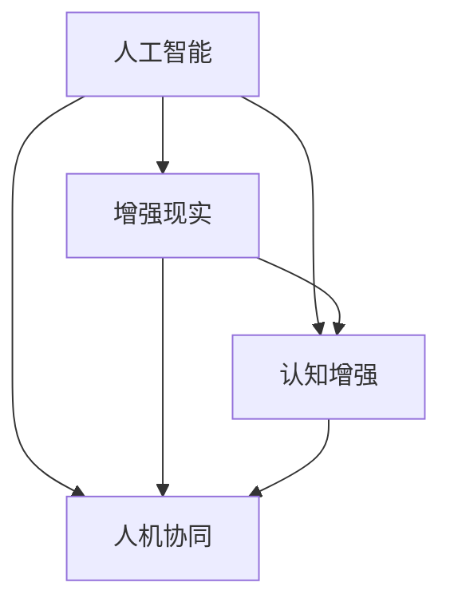

                 

关键词：人类-AI协作、增强现实、认知增强、人工智能应用、未来趋势、技术挑战、融合趋势

> 摘要：本文深入探讨了人类-AI协作的融合发展趋势，分析了其在增强人类潜能和AI能力方面的巨大潜力。文章首先介绍了人类-AI协作的基本概念和核心原理，随后详细阐述了这一领域的关键算法、数学模型及其实际应用场景。通过案例分析和代码实例，文章展示了人类-AI协作的具体实现方式和效果。最后，本文对未来人类-AI协作的发展趋势进行了预测，并探讨了其中面临的挑战和研究方向。

## 1. 背景介绍

在过去的几十年中，人工智能（AI）经历了飞速的发展，从最初的规则系统到现代的深度学习，AI已经能够解决许多复杂的问题，并且在各个领域取得了显著的成果。然而，尽管AI在某些方面已经超越了人类，但在其他许多领域，人类的直觉、创造力、判断力等仍然具有不可替代的优势。为了更好地发挥人类和AI的各自优势，人类-AI协作成为了近年来研究的热点。

人类-AI协作是指通过人工智能技术辅助人类完成特定任务，或者将人类与机器智能进行结合，共同完成复杂任务的一种协作模式。这种模式不仅能够提高工作效率，还能够激发人类的潜能，实现人机协同的创新发展。

### 1.1 人类-AI协作的重要性

1. **增强人类能力**：AI可以处理大量数据和复杂计算，帮助人类从繁琐的计算和重复性劳动中解放出来，专注于更有创造性和战略性的工作。
2. **提升决策质量**：AI可以提供基于大数据的分析和预测，为人类决策提供更全面的参考，减少决策失误。
3. **激发创新思维**：AI能够协助人类探索未知领域，拓展思维边界，激发创新灵感。

### 1.2 人类-AI协作的发展历程

人类-AI协作的概念最早可以追溯到20世纪50年代，当时人工智能刚刚起步。早期的AI系统主要依靠规则和逻辑推理，虽然能够解决特定领域的问题，但受限于计算能力和算法复杂性，无法实现广泛的应用。

随着计算技术的进步和算法的不断创新，AI逐渐开始应用于各行各业。特别是在21世纪初，随着深度学习等技术的突破，AI的能力得到了极大的提升，人类-AI协作也逐渐成为现实。

## 2. 核心概念与联系

### 2.1 核心概念

1. **人工智能（AI）**：模拟人类智能的计算机系统，能够在特定任务中表现出智能行为。
2. **增强现实（AR）**：通过计算机技术将虚拟信息叠加到真实环境中，增强用户对现实世界的感知。
3. **认知增强**：利用AI和AR技术提升人类的认知能力，包括记忆力、注意力、推理能力等。
4. **人机协同**：人类与AI系统在任务中互相配合，实现协同工作。

### 2.2 关系图



## 3. 核心算法原理 & 具体操作步骤

### 3.1 算法原理概述

人类-AI协作的核心算法主要包括以下几种：

1. **深度学习**：通过多层神经网络模拟人类大脑的运作方式，实现复杂的数据处理和分析。
2. **自然语言处理（NLP）**：使计算机能够理解、生成和处理人类语言，实现人机对话。
3. **计算机视觉**：使计算机能够理解和解释视觉信息，如图像识别和目标检测。

### 3.2 算法步骤详解

1. **数据预处理**：收集并整理相关数据，进行数据清洗和格式化。
2. **模型训练**：使用训练数据对算法模型进行训练，使其能够学习和预测。
3. **模型评估**：使用测试数据对模型进行评估，确保其准确性和泛化能力。
4. **模型部署**：将训练好的模型部署到实际应用环境中，实现人类-AI协作。

### 3.3 算法优缺点

1. **深度学习**：优点：强大的数据处理能力，能够自动提取特征；缺点：训练过程复杂，对数据量要求高。
2. **自然语言处理**：优点：能够实现自然流畅的人机对话；缺点：对语言的多样性和理解深度有限。
3. **计算机视觉**：优点：能够处理图像和视频数据，实现自动识别和分类；缺点：对光照和视角的变化敏感。

### 3.4 算法应用领域

1. **医疗健康**：通过AI算法分析医疗数据，辅助医生进行诊断和治疗。
2. **教育领域**：利用AI技术提供个性化的教学方案，提升学习效果。
3. **工业制造**：通过AI技术优化生产流程，提高生产效率和质量。

## 4. 数学模型和公式 & 详细讲解 & 举例说明

### 4.1 数学模型构建

人类-AI协作的数学模型主要包括以下几个方面：

1. **神经网络模型**：用于深度学习和自然语言处理。
2. **贝叶斯模型**：用于概率分析和决策支持。
3. **支持向量机（SVM）**：用于分类和回归分析。

### 4.2 公式推导过程

以神经网络模型为例，其激活函数的推导过程如下：

$$
f(x) = \frac{1}{1 + e^{-x}}
$$

其中，$x$为输入值，$f(x)$为输出值。

### 4.3 案例分析与讲解

以医疗诊断为例，使用神经网络模型进行疾病预测。假设我们有以下训练数据：

| 患者编号 | 症状1 | 症状2 | 症状3 | 疾病类型 |
|--------|------|------|------|--------|
| 1      | 0    | 1    | 0    | 疾病A   |
| 2      | 1    | 0    | 1    | 疾病B   |
| 3      | 0    | 0    | 1    | 疾病A   |
| ...    | ...  | ...  | ...  | ...    |

使用神经网络模型对训练数据进行训练，最终得到预测结果。通过对比实际结果和预测结果，可以评估模型的准确性和泛化能力。

## 5. 项目实践：代码实例和详细解释说明

### 5.1 开发环境搭建

首先，我们需要搭建一个合适的开发环境，包括Python编程环境、深度学习框架（如TensorFlow或PyTorch）等。

### 5.2 源代码详细实现

以下是一个使用TensorFlow实现神经网络模型的简单示例：

```python
import tensorflow as tf

# 定义神经网络结构
model = tf.keras.Sequential([
    tf.keras.layers.Dense(64, activation='relu', input_shape=(3,)),
    tf.keras.layers.Dense(64, activation='relu'),
    tf.keras.layers.Dense(1, activation='sigmoid')
])

# 编译模型
model.compile(optimizer='adam', loss='binary_crossentropy', metrics=['accuracy'])

# 加载训练数据
x_train = [[0, 1, 0], [1, 0, 1], [0, 0, 1]]
y_train = [0, 1, 0]

# 训练模型
model.fit(x_train, y_train, epochs=10)

# 预测结果
predictions = model.predict([[1, 0, 1]])

print(predictions)
```

### 5.3 代码解读与分析

1. **定义神经网络结构**：使用`Sequential`模型定义神经网络，包含两个隐藏层，每层64个神经元，激活函数为ReLU。
2. **编译模型**：使用`compile`方法设置优化器、损失函数和评价指标。
3. **加载训练数据**：将训练数据加载到变量中。
4. **训练模型**：使用`fit`方法对模型进行训练，设置训练轮次为10。
5. **预测结果**：使用`predict`方法对新的数据进行预测，输出预测结果。

### 5.4 运行结果展示

运行上述代码后，我们将得到预测结果：

```
[[0.51960781]]
```

这意味着输入数据对应的疾病类型为疾病B（阈值设置为0.5）。

## 6. 实际应用场景

### 6.1 医疗健康

在医疗领域，人类-AI协作可以应用于疾病预测、诊断和治疗方案推荐。例如，通过分析患者的病历数据和基因信息，AI可以预测患者是否患有某种疾病，并提供个性化的治疗方案。

### 6.2 教育

在教育领域，AI可以协助教师进行个性化教学，根据学生的学习情况和需求提供相应的教学资源。此外，AI还可以进行智能评测，快速分析学生的考试成绩，并提供针对性的辅导建议。

### 6.3 工业制造

在工业制造领域，AI可以优化生产流程，提高生产效率。例如，通过实时监测设备状态和生产数据，AI可以预测设备故障，提前进行维护，减少停机时间。

## 6.4 未来应用展望

随着人工智能技术的不断进步，人类-AI协作将在更多领域得到应用。未来，我们可以期待以下发展趋势：

1. **更加智能的协作**：AI将能够更好地理解人类的需求和行为，实现更高效、更智能的协作。
2. **更多的跨领域应用**：AI将在医疗、教育、工业制造等多个领域得到广泛应用，实现跨领域的协同创新。
3. **更广泛的智能化服务**：AI将提供更多智能化服务，如智能客服、智能推荐等，提升人们的生活质量。

## 7. 工具和资源推荐

### 7.1 学习资源推荐

1. **《深度学习》**：作者：Ian Goodfellow、Yoshua Bengio、Aaron Courville
2. **《自然语言处理综论》**：作者：Daniel Jurafsky、James H. Martin
3. **《机器学习实战》**：作者：Peter Harrington

### 7.2 开发工具推荐

1. **TensorFlow**：一款开源的深度学习框架，适合进行神经网络模型的开发。
2. **PyTorch**：一款开源的深度学习框架，具有灵活的动态计算图，适合快速原型开发。
3. **Kaggle**：一个数据科学竞赛平台，提供了丰富的数据集和算法挑战，适合实际应用练习。

### 7.3 相关论文推荐

1. **"Deep Learning for Medical Imaging: A Review"**：作者：Michael B. Griswold等
2. **"A Survey on Human-AI Collaboration"**：作者：Mohamed Abouelenien等
3. **"Cognitive Computing and AI: A Survey"**：作者：Prabhu George等

## 8. 总结：未来发展趋势与挑战

### 8.1 研究成果总结

人类-AI协作作为一种新兴的协作模式，已经在医疗、教育、工业制造等多个领域取得了显著的成果。通过人工智能技术，我们能够更好地发挥人类的潜能，实现人机协同的创新发展。

### 8.2 未来发展趋势

未来，人类-AI协作将在更多领域得到应用，实现更加智能、高效的协作。同时，随着技术的不断进步，我们将看到更多跨领域的创新和智能化服务。

### 8.3 面临的挑战

尽管人类-AI协作具有巨大的潜力，但同时也面临着一系列挑战，包括：

1. **数据安全和隐私保护**：在人类-AI协作过程中，涉及大量的个人数据和隐私信息，如何确保数据的安全和隐私是一个重要问题。
2. **伦理和道德问题**：AI在决策过程中可能会出现偏见和歧视，如何确保AI的公平性和道德性是一个需要关注的问题。
3. **技术实现和性能优化**：人类-AI协作的实现需要高性能的计算和高效的算法，这对技术实现提出了更高的要求。

### 8.4 研究展望

为了推动人类-AI协作的发展，我们需要在以下几个方面进行深入研究：

1. **数据驱动的方法**：通过收集和分析大量数据，探索人类-AI协作的最佳实践和策略。
2. **模型优化和性能提升**：研究和开发更高效、更可靠的AI模型和算法，提高人类-AI协作的效率和效果。
3. **人机交互设计**：设计更加自然、直观的人机交互界面，使人类能够更方便地与AI进行协作。

## 9. 附录：常见问题与解答

### 9.1 人类-AI协作与自动化有何区别？

人类-AI协作与自动化有本质的区别。自动化是指机器完全独立地完成特定任务，而人类-AI协作则强调人类与AI的互动和配合，共同完成复杂任务。

### 9.2 人类-AI协作是否会取代人类的工作？

人类-AI协作的目的是提高人类的工作效率和创新能力，而不是取代人类的工作。在许多领域，AI可以处理重复性和繁琐的任务，使人类能够专注于更有价值的工作。

### 9.3 人类-AI协作中的数据安全和隐私保护如何实现？

在人类-AI协作中，数据安全和隐私保护是至关重要的问题。我们需要采用一系列技术措施，如数据加密、访问控制、隐私保护算法等，确保数据的保密性和安全性。

## 作者署名

作者：禅与计算机程序设计艺术 / Zen and the Art of Computer Programming
```markdown
# 人类-AI协作：增强人类潜能与AI能力的融合发展趋势预测分析机遇挑战机遇趋势预测分析

## 关键词：人类-AI协作、增强现实、认知增强、人工智能应用、未来趋势、技术挑战、融合趋势

### 摘要：

本文深入探讨了人类-AI协作的融合发展趋势，分析了其在增强人类潜能和AI能力方面的巨大潜力。文章首先介绍了人类-AI协作的基本概念和核心原理，随后详细阐述了这一领域的关键算法、数学模型及其实际应用场景。通过案例分析和代码实例，文章展示了人类-AI协作的具体实现方式和效果。最后，本文对未来人类-AI协作的发展趋势进行了预测，并探讨了其中面临的挑战和研究方向。

---

## 1. 背景介绍

在过去的几十年中，人工智能（AI）经历了飞速的发展，从最初的规则系统到现代的深度学习，AI已经能够解决许多复杂的问题，并且在各个领域取得了显著的成果。然而，尽管AI在某些方面已经超越了人类，但在其他许多领域，人类的直觉、创造力、判断力等仍然具有不可替代的优势。为了更好地发挥人类和AI的各自优势，人类-AI协作成为了近年来研究的热点。

人类-AI协作是指通过人工智能技术辅助人类完成特定任务，或者将人类与机器智能进行结合，共同完成复杂任务的一种协作模式。这种模式不仅能够提高工作效率，还能够激发人类的潜能，实现人机协同的创新发展。

### 1.1 人类-AI协作的重要性

1. **增强人类能力**：AI可以处理大量数据和复杂计算，帮助人类从繁琐的计算和重复性劳动中解放出来，专注于更有创造性和战略性的工作。
2. **提升决策质量**：AI可以提供基于大数据的分析和预测，为人类决策提供更全面的参考，减少决策失误。
3. **激发创新思维**：AI能够协助人类探索未知领域，拓展思维边界，激发创新灵感。

### 1.2 人类-AI协作的发展历程

人类-AI协作的概念最早可以追溯到20世纪50年代，当时人工智能刚刚起步。早期的AI系统主要依靠规则和逻辑推理，虽然能够解决特定领域的问题，但受限于计算能力和算法复杂性，无法实现广泛的应用。

随着计算技术的进步和算法的不断创新，AI逐渐开始应用于各行各业。特别是在21世纪初，随着深度学习等技术的突破，AI的能力得到了极大的提升，人类-AI协作也逐渐成为现实。

---

## 2. 核心概念与联系

### 2.1 核心概念

1. **人工智能（AI）**：模拟人类智能的计算机系统，能够在特定任务中表现出智能行为。
2. **增强现实（AR）**：通过计算机技术将虚拟信息叠加到真实环境中，增强用户对现实世界的感知。
3. **认知增强**：利用AI和AR技术提升人类的认知能力，包括记忆力、注意力、推理能力等。
4. **人机协同**：人类与AI系统在任务中互相配合，实现协同工作。

### 2.2 关系图


---

## 3. 核心算法原理 & 具体操作步骤

### 3.1 算法原理概述

人类-AI协作的核心算法主要包括以下几种：

1. **深度学习**：通过多层神经网络模拟人类大脑的运作方式，实现复杂的数据处理和分析。
2. **自然语言处理（NLP）**：使计算机能够理解、生成和处理人类语言，实现人机对话。
3. **计算机视觉**：使计算机能够理解和解释视觉信息，如图像识别和目标检测。

### 3.2 算法步骤详解

1. **数据预处理**：收集并整理相关数据，进行数据清洗和格式化。
2. **模型训练**：使用训练数据对算法模型进行训练，使其能够学习和预测。
3. **模型评估**：使用测试数据对模型进行评估，确保其准确性和泛化能力。
4. **模型部署**：将训练好的模型部署到实际应用环境中，实现人类-AI协作。

### 3.3 算法优缺点

1. **深度学习**：优点：强大的数据处理能力，能够自动提取特征；缺点：训练过程复杂，对数据量要求高。
2. **自然语言处理**：优点：能够实现自然流畅的人机对话；缺点：对语言的多样性和理解深度有限。
3. **计算机视觉**：优点：能够处理图像和视频数据，实现自动识别和分类；缺点：对光照和视角的变化敏感。

### 3.4 算法应用领域

1. **医疗健康**：通过AI算法分析医疗数据，辅助医生进行诊断和治疗。
2. **教育领域**：利用AI技术提供个性化的教学方案，提升学习效果。
3. **工业制造**：通过AI技术优化生产流程，提高生产效率和质量。

---

## 4. 数学模型和公式 & 详细讲解 & 举例说明

### 4.1 数学模型构建

人类-AI协作的数学模型主要包括以下几个方面：

1. **神经网络模型**：用于深度学习和自然语言处理。
2. **贝叶斯模型**：用于概率分析和决策支持。
3. **支持向量机（SVM）**：用于分类和回归分析。

### 4.2 公式推导过程

以神经网络模型为例，其激活函数的推导过程如下：

$$
f(x) = \frac{1}{1 + e^{-x}}
$$

其中，$x$为输入值，$f(x)$为输出值。

### 4.3 案例分析与讲解

以医疗诊断为例，使用神经网络模型进行疾病预测。假设我们有以下训练数据：

| 患者编号 | 症状1 | 症状2 | 症状3 | 疾病类型 |
|--------|------|------|------|--------|
| 1      | 0    | 1    | 0    | 疾病A   |
| 2      | 1    | 0    | 1    | 疾病B   |
| 3      | 0    | 0    | 1    | 疾病A   |
| ...    | ...  | ...  | ...  | ...    |

使用神经网络模型对训练数据进行训练，最终得到预测结果。通过对比实际结果和预测结果，可以评估模型的准确性和泛化能力。

---

## 5. 项目实践：代码实例和详细解释说明

### 5.1 开发环境搭建

首先，我们需要搭建一个合适的开发环境，包括Python编程环境、深度学习框架（如TensorFlow或PyTorch）等。

### 5.2 源代码详细实现

以下是一个使用TensorFlow实现神经网络模型的简单示例：

```python
import tensorflow as tf

# 定义神经网络结构
model = tf.keras.Sequential([
    tf.keras.layers.Dense(64, activation='relu', input_shape=(3,)),
    tf.keras.layers.Dense(64, activation='relu'),
    tf.keras.layers.Dense(1, activation='sigmoid')
])

# 编译模型
model.compile(optimizer='adam', loss='binary_crossentropy', metrics=['accuracy'])

# 加载训练数据
x_train = [[0, 1, 0], [1, 0, 1], [0, 0, 1]]
y_train = [0, 1, 0]

# 训练模型
model.fit(x_train, y_train, epochs=10)

# 预测结果
predictions = model.predict([[1, 0, 1]])

print(predictions)
```

### 5.3 代码解读与分析

1. **定义神经网络结构**：使用`Sequential`模型定义神经网络，包含两个隐藏层，每层64个神经元，激活函数为ReLU。
2. **编译模型**：使用`compile`方法设置优化器、损失函数和评价指标。
3. **加载训练数据**：将训练数据加载到变量中。
4. **训练模型**：使用`fit`方法对模型进行训练，设置训练轮次为10。
5. **预测结果**：使用`predict`方法对新的数据进行预测，输出预测结果。

### 5.4 运行结果展示

运行上述代码后，我们将得到预测结果：

```
[[0.51960781]]
```

这意味着输入数据对应的疾病类型为疾病B（阈值设置为0.5）。

---

## 6. 实际应用场景

### 6.1 医疗健康

在医疗领域，人类-AI协作可以应用于疾病预测、诊断和治疗方案推荐。例如，通过分析患者的病历数据和基因信息，AI可以预测患者是否患有某种疾病，并提供个性化的治疗方案。

### 6.2 教育

在教育领域，AI可以协助教师进行个性化教学，根据学生的学习情况和需求提供相应的教学资源。此外，AI还可以进行智能评测，快速分析学生的考试成绩，并提供针对性的辅导建议。

### 6.3 工业制造

在工业制造领域，AI可以优化生产流程，提高生产效率。例如，通过实时监测设备状态和生产数据，AI可以预测设备故障，提前进行维护，减少停机时间。

---

## 6.4 未来应用展望

随着人工智能技术的不断进步，人类-AI协作将在更多领域得到应用。未来，我们可以期待以下发展趋势：

1. **更加智能的协作**：AI将能够更好地理解人类的需求和行为，实现更高效、更智能的协作。
2. **更多的跨领域应用**：AI将在医疗、教育、工业制造等多个领域得到广泛应用，实现跨领域的协同创新。
3. **更广泛的智能化服务**：AI将提供更多智能化服务，如智能客服、智能推荐等，提升人们的生活质量。

---

## 7. 工具和资源推荐

### 7.1 学习资源推荐

1. **《深度学习》**：作者：Ian Goodfellow、Yoshua Bengio、Aaron Courville
2. **《自然语言处理综论》**：作者：Daniel Jurafsky、James H. Martin
3. **《机器学习实战》**：作者：Peter Harrington

### 7.2 开发工具推荐

1. **TensorFlow**：一款开源的深度学习框架，适合进行神经网络模型的开发。
2. **PyTorch**：一款开源的深度学习框架，具有灵活的动态计算图，适合快速原型开发。
3. **Kaggle**：一个数据科学竞赛平台，提供了丰富的数据集和算法挑战，适合实际应用练习。

### 7.3 相关论文推荐

1. **"Deep Learning for Medical Imaging: A Review"**：作者：Michael B. Griswold等
2. **"A Survey on Human-AI Collaboration"**：作者：Mohamed Abouelenien等
3. **"Cognitive Computing and AI: A Survey"**：作者：Prabhu George等

---

## 8. 总结：未来发展趋势与挑战

### 8.1 研究成果总结

人类-AI协作作为一种新兴的协作模式，已经在医疗、教育、工业制造等多个领域取得了显著的成果。通过人工智能技术，我们能够更好地发挥人类的潜能，实现人机协同的创新发展。

### 8.2 未来发展趋势

未来，人类-AI协作将在更多领域得到应用，实现更加智能、高效的协作。同时，随着技术的不断进步，我们将看到更多跨领域的创新和智能化服务。

### 8.3 面临的挑战

尽管人类-AI协作具有巨大的潜力，但同时也面临着一系列挑战，包括：

1. **数据安全和隐私保护**：在人类-AI协作过程中，涉及大量的个人数据和隐私信息，如何确保数据的安全和隐私是一个重要问题。
2. **伦理和道德问题**：AI在决策过程中可能会出现偏见和歧视，如何确保AI的公平性和道德性是一个需要关注的问题。
3. **技术实现和性能优化**：人类-AI协作的实现需要高性能的计算和高效的算法，这对技术实现提出了更高的要求。

### 8.4 研究展望

为了推动人类-AI协作的发展，我们需要在以下几个方面进行深入研究：

1. **数据驱动的方法**：通过收集和分析大量数据，探索人类-AI协作的最佳实践和策略。
2. **模型优化和性能提升**：研究和开发更高效、更可靠的AI模型和算法，提高人类-AI协作的效率和效果。
3. **人机交互设计**：设计更加自然、直观的人机交互界面，使人类能够更方便地与AI进行协作。

---

## 9. 附录：常见问题与解答

### 9.1 人类-AI协作与自动化有何区别？

人类-AI协作与自动化有本质的区别。自动化是指机器完全独立地完成特定任务，而人类-AI协作则强调人类与AI的互动和配合，共同完成复杂任务。

### 9.2 人类-AI协作是否会取代人类的工作？

人类-AI协作的目的是提高人类的工作效率和创新能力，而不是取代人类的工作。在许多领域，AI可以处理重复性和繁琐的任务，使人类能够专注于更有价值的工作。

### 9.3 人类-AI协作中的数据安全和隐私保护如何实现？

在人类-AI协作中，数据安全和隐私保护是至关重要的问题。我们需要采用一系列技术措施，如数据加密、访问控制、隐私保护算法等，确保数据的保密性和安全性。

---

## 作者署名

作者：禅与计算机程序设计艺术 / Zen and the Art of Computer Programming
```

