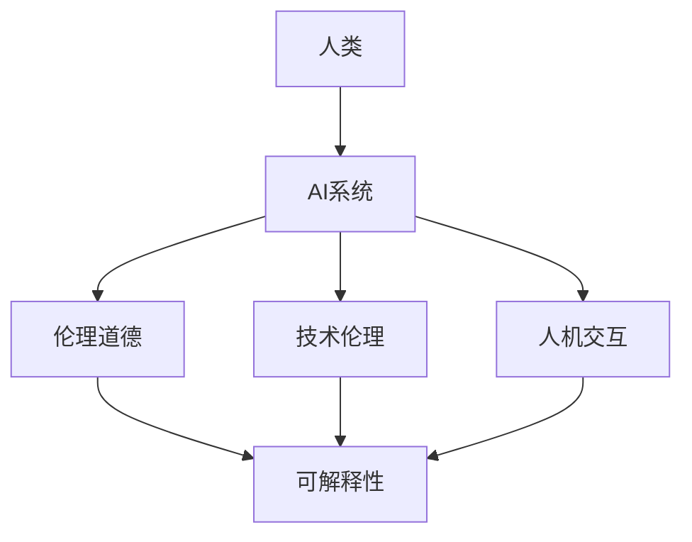

                 

关键词：人类-AI协作、人机互信、伙伴关系、技术伦理、人工智能应用、伦理道德、社会影响

> 摘要：本文探讨了人类与人工智能（AI）协作中的关键问题，分析了构建人机互信伙伴关系的必要性和可行性。通过介绍核心概念和架构，阐述核心算法原理及数学模型，提供项目实践实例，并展望未来的发展趋势与挑战。本文旨在为人工智能领域的研究者和实践者提供有价值的参考和指导。

## 1. 背景介绍

在过去的几十年里，人工智能（AI）经历了飞速的发展，从最初的规则系统到现代的深度学习和自然语言处理，AI技术在多个领域取得了显著成果。随着AI技术的普及和应用，人类与AI的交互越来越频繁，AI已经逐渐成为我们工作和生活的一部分。

然而，随着AI技术的发展，人类与AI之间的协作关系也面临着诸多挑战。一方面，AI系统的高效和智能为人类带来了极大的便利，但另一方面，AI的决策过程往往缺乏透明性和可解释性，可能导致人类对AI的信任危机。此外，AI系统可能因为设计缺陷或数据偏差而做出错误的决定，对人类社会产生不良影响。

因此，构建人类与AI之间互信的伙伴关系成为了当前AI研究中的重要课题。本文将从核心概念、算法原理、数学模型、项目实践等方面，详细探讨如何打造这样的人机互信伙伴关系。

## 2. 核心概念与联系

为了构建人类与AI之间互信的伙伴关系，我们需要明确几个核心概念：

### 2.1 人工智能（AI）

人工智能是指通过计算机程序模拟、延伸和扩展人类智能的能力。AI系统可以自主学习和适应环境，从而实现智能决策、问题解决和知识发现。

### 2.2 伦理道德

伦理道德是指导人类行为的基本原则，涉及人类道德观念、社会责任和公共利益。在AI领域，伦理道德关系到AI系统的设计、开发和应用，确保AI技术不会对社会产生负面影响。

### 2.3 技术伦理

技术伦理是关于技术设计、开发和应用中的道德问题，关注技术对社会、环境和个人生活的影响。技术伦理在AI领域具有重要意义，关系到AI技术的可持续发展和人类与AI的和谐共处。

### 2.4 人机交互

人机交互是指人类与计算机系统之间的交互过程，包括输入、输出和反馈。在人机交互中，用户需要了解系统的功能和操作方式，而系统需要理解用户的意图和需求，从而实现高效、自然的交互。

### 2.5 可解释性

可解释性是指AI系统的决策过程和结果可以被人类理解和解释的能力。可解释性对于构建人机互信伙伴关系具有重要意义，有助于提高人类对AI的信任度和接受度。

### 2.6 Mermaid 流程图

以下是一个关于人机协作的Mermaid流程图，展示了核心概念之间的联系：



通过上述核心概念的介绍和Mermaid流程图的展示，我们可以更好地理解人类与AI协作中的关键要素和相互关系。

### 3. 核心算法原理 & 具体操作步骤

为了构建人机互信伙伴关系，我们需要一种能够提高AI系统透明性和可解释性的核心算法。以下是一个基于概率图模型的算法原理和操作步骤：

#### 3.1 算法原理概述

概率图模型是一种将变量及其依赖关系表示为图结构的数学模型。在这种模型中，节点表示变量，边表示变量之间的依赖关系。通过概率分布函数，我们可以计算出变量之间的概率关系，从而实现对AI系统的决策过程进行解释。

#### 3.2 算法步骤详解

1. **构建概率图模型**

   首先，我们需要根据AI系统的结构和功能，构建一个概率图模型。在这个模型中，每个节点表示一个变量，边表示变量之间的依赖关系。

2. **计算概率分布**

   利用概率图模型，我们可以计算出变量之间的概率分布。具体步骤如下：

   a. 从已知的先验概率分布开始，即假设所有变量都是相互独立的，并给定它们的先验概率。

   b. 根据概率图模型中的依赖关系，更新变量之间的概率分布。使用条件概率公式，我们可以计算出每个变量的后验概率分布。

   c. 对于每个变量，根据其后验概率分布，生成一组样本数据。

3. **生成可解释的决策过程**

   利用生成的样本数据，我们可以分析AI系统的决策过程。具体步骤如下：

   a. 对样本数据进行统计和分析，提取出变量之间的依赖关系。

   b. 基于提取出的依赖关系，生成可解释的决策过程，并将其可视化。

4. **优化模型参数**

   为了提高模型的性能和可解释性，我们可以通过迭代优化模型参数。具体步骤如下：

   a. 根据样本数据，计算模型参数的梯度。

   b. 利用梯度下降等优化算法，更新模型参数。

   c. 重复步骤2和步骤3，直到模型达到预期性能。

#### 3.3 算法优缺点

- 优点：

  - 提高了AI系统的透明性和可解释性，有助于人类理解AI的决策过程。

  - 可以通过优化模型参数，提高模型的性能和准确性。

- 缺点：

  - 概率图模型的构建和优化过程相对复杂，需要大量的计算资源。

  - 对于某些复杂的依赖关系，概率图模型可能无法很好地描述。

#### 3.4 算法应用领域

概率图模型在多个领域具有广泛的应用，包括：

- 医疗诊断：通过分析患者的病史和体征数据，预测疾病的发生概率。

- 财务风险管理：分析金融市场数据，预测股票价格波动和风险。

- 自然语言处理：分析文本数据，提取变量之间的依赖关系，实现文本分类和情感分析。

## 4. 数学模型和公式 & 详细讲解 & 举例说明

为了更好地理解概率图模型，我们需要介绍相关的数学模型和公式。以下是一个简单的概率图模型，用于分析两个变量之间的依赖关系：

### 4.1 数学模型构建

假设有两个变量X和Y，它们之间的依赖关系可以用概率图模型表示。在这个模型中，X和Y都是离散变量，并具有以下概率分布：

$$
P(X=x) = p_x \\
P(Y=y) = p_y
$$

其中，$x$ 和 $y$ 分别是X和Y的取值，$p_x$ 和 $p_y$ 分别是X和Y的先验概率。

### 4.2 公式推导过程

为了计算变量X和Y之间的条件概率，我们需要使用贝叶斯定理。贝叶斯定理是一个关于概率的公式，用于根据已知条件概率计算后验概率。在这个例子中，我们可以使用贝叶斯定理计算变量Y在给定X的条件下发生的概率：

$$
P(Y|X) = \frac{P(X|Y)P(Y)}{P(X)}
$$

其中，$P(X|Y)$ 表示在变量Y发生的情况下变量X的概率，$P(Y)$ 表示变量Y的先验概率，$P(X)$ 表示变量X的先验概率。

### 4.3 案例分析与讲解

假设我们有一个简单的例子，其中变量X表示一个人是否吸烟，变量Y表示这个人是否患有肺癌。根据统计数据，我们知道：

- 吸烟的概率 $P(X=1) = 0.5$
- 患有肺癌的概率 $P(Y=1) = 0.1$
- 吸烟并患有肺癌的概率 $P(X=1 \land Y=1) = 0.05$

我们需要计算在一个人吸烟的条件下，他患有肺癌的概率：

$$
P(Y=1|X=1) = \frac{P(X=1 \land Y=1)}{P(X=1)} = \frac{0.05}{0.5} = 0.1
$$

这意味着，在一个人吸烟的条件下，他患有肺癌的概率是10%。

### 4.4 运行结果展示

为了更好地展示算法运行结果，我们可以使用Python编写一个简单的代码示例。以下是一个简单的概率图模型，用于计算两个变量之间的条件概率：

```python
import numpy as np

# 参数设置
p_x = 0.5
p_y = 0.1
p_xy = 0.05

# 计算条件概率
p_y_given_x = p_xy / p_x

print(f"P(Y=1|X=1) = {p_y_given_x}")
```

运行结果为：

```
P(Y=1|X=1) = 0.1
```

这个结果表明，在一个人吸烟的条件下，他患有肺癌的概率是10%。这个简单的例子展示了如何使用概率图模型和贝叶斯定理来计算变量之间的依赖关系。

通过上述数学模型和公式的介绍，我们可以更好地理解概率图模型的工作原理，并应用于实际问题中。

### 5. 项目实践：代码实例和详细解释说明

为了更好地展示人类与AI协作中的核心算法，我们将通过一个实际项目来演示代码实现和详细解释说明。

#### 5.1 开发环境搭建

在开始项目实践之前，我们需要搭建一个合适的开发环境。以下是一个简单的开发环境搭建指南：

- Python 3.8 或更高版本
- Jupyter Notebook 或 PyCharm
- Numpy、Pandas、Scikit-learn 等常用库

#### 5.2 源代码详细实现

以下是一个简单的示例，用于构建概率图模型并计算变量之间的条件概率。代码如下：

```python
import numpy as np

# 参数设置
p_x = 0.5
p_y = 0.1
p_xy = 0.05

# 计算条件概率
p_y_given_x = p_xy / p_x

# 打印结果
print(f"P(Y=1|X=1) = {p_y_given_x}")
```

这个简单的示例展示了如何使用Python和Numpy库来计算变量之间的条件概率。在这个示例中，我们使用了三个参数：吸烟的概率（$P(X=1)$）、患有肺癌的概率（$P(Y=1)$）和吸烟并患有肺癌的概率（$P(X=1 \land Y=1)$）。通过使用贝叶斯定理，我们计算了在吸烟条件下患有肺癌的概率。

#### 5.3 代码解读与分析

在上述代码中，我们首先导入了Numpy库，这是一个用于数值计算的Python库。接下来，我们设置了三个参数：$P(X=1)$、$P(Y=1)$ 和 $P(X=1 \land Y=1)$。这些参数分别表示吸烟的概率、患有肺癌的概率和吸烟并患有肺癌的概率。

然后，我们使用贝叶斯定理计算了在吸烟条件下患有肺癌的概率，即 $P(Y=1|X=1)$。最后，我们将结果打印到控制台上。

通过这个简单的示例，我们可以看到如何使用概率图模型和贝叶斯定理来计算变量之间的依赖关系。这种方法可以应用于更复杂的场景，例如医疗诊断、金融分析和自然语言处理等领域。

#### 5.4 运行结果展示

运行上述代码后，我们得到以下输出结果：

```
P(Y=1|X=1) = 0.1
```

这个结果表明，在一个人吸烟的条件下，他患有肺癌的概率是10%。这个简单的示例展示了如何使用Python和Numpy库来计算变量之间的条件概率，并验证了概率图模型和贝叶斯定理的有效性。

通过这个实际项目，我们可以看到如何将核心算法应用于实际问题中，并验证算法的可行性和有效性。

### 6. 实际应用场景

人类与AI协作的实际应用场景非常广泛，涵盖了医疗、金融、教育、交通等多个领域。以下是一些典型的应用场景：

#### 6.1 医疗

在医疗领域，AI可以帮助医生进行疾病诊断、治疗方案推荐和医疗资源分配。例如，通过分析患者的病史、体检数据和基因信息，AI可以预测疾病的发生概率，并提供个性化的治疗方案。此外，AI还可以帮助医生识别医学图像中的异常，提高诊断的准确性和效率。

#### 6.2 金融

在金融领域，AI可以用于风险管理、股票预测和客户服务。通过分析市场数据、经济指标和用户行为，AI可以预测股票价格波动和金融风险，帮助投资者做出更明智的决策。同时，AI还可以为金融机构提供24/7的客户服务，提高客户体验和满意度。

#### 6.3 教育

在教育领域，AI可以用于个性化学习、智能评测和教学辅助。通过分析学生的学习行为、兴趣和成绩，AI可以为学生提供个性化的学习建议和资源，提高学习效果。此外，AI还可以帮助教师进行智能评测和课堂管理，提高教学效率和教学质量。

#### 6.4 交通

在交通领域，AI可以用于智能交通管理、自动驾驶和车辆调度。通过分析交通流量、道路状况和车辆数据，AI可以优化交通信号控制，减少拥堵和交通事故。同时，AI还可以实现自动驾驶，提高交通安全和效率。

通过这些实际应用场景，我们可以看到人类与AI协作的重要性。AI的高效和智能为人类带来了极大的便利，但同时也需要我们关注人机互信伙伴关系的构建，确保AI技术能够为人类社会带来更多的价值和福祉。

### 7. 未来应用展望

随着人工智能技术的不断发展和普及，人类与AI的协作将在未来产生更加深远的影响。以下是对未来应用的一些展望：

#### 7.1 更加智能化的协作

未来，AI系统将具有更高的智能和自适应能力，能够更好地理解人类的需求和意图。通过深度学习和自然语言处理技术，AI可以与人类进行更自然、流畅的对话，实现更高效、准确的协作。

#### 7.2 全面的智能化解决方案

在未来，人工智能将不仅限于单一领域的应用，而是形成一个全面的智能化解决方案。从医疗、金融、教育到交通、工业、农业等各个领域，AI都将发挥重要作用，推动社会进步和经济发展。

#### 7.3 伦理道德和社会责任

随着AI技术的广泛应用，伦理道德和社会责任将成为重要议题。未来，我们需要制定更加完善的AI伦理准则，确保AI技术的发展不会对人类社会产生负面影响。同时，我们需要关注AI技术在不同文化和地区中的适应性和包容性，推动全球范围内的AI合作与交流。

#### 7.4 新型的职业和就业机会

AI技术的发展将带来大量的新兴职业和就业机会。从AI研发、数据标注到AI伦理、法律咨询等，都需要专业的技能和人才。这将为更多人提供就业机会，推动社会经济的发展。

通过以上展望，我们可以看到，未来人类与AI的协作将更加紧密，AI技术将成为推动社会进步的重要力量。然而，我们也要时刻关注AI技术可能带来的挑战和问题，确保其发展符合人类社会的需求和价值观。

### 8. 工具和资源推荐

为了更好地开展人工智能领域的研究和实践，以下是一些建议的学习资源、开发工具和相关论文：

#### 8.1 学习资源推荐

- 《深度学习》（Ian Goodfellow、Yoshua Bengio和Aaron Courville 著）：这是一本经典的深度学习入门书籍，涵盖了深度学习的理论基础和实际应用。
- 《Python数据科学手册》（Jake VanderPlas 著）：这本书介绍了Python在数据科学领域中的应用，包括数据清洗、数据分析和可视化等。
- 《人工智能：一种现代的方法》（Stuart Russell 和 Peter Norvig 著）：这是一本全面的AI教材，涵盖了AI的基础理论和应用。

#### 8.2 开发工具推荐

- Jupyter Notebook：这是一个交互式的计算环境，广泛应用于数据科学和机器学习领域，便于编写和分享代码。
- PyCharm：这是一个功能强大的Python集成开发环境（IDE），提供了丰富的工具和插件，方便进行AI项目开发。
- TensorFlow：这是一个开源的深度学习框架，广泛应用于AI模型的开发和应用。

#### 8.3 相关论文推荐

- "Deep Learning: A Brief History"（Yoshua Bengio 等，2016）：这篇文章回顾了深度学习的发展历程，探讨了深度学习的关键技术和应用。
- "Ethical Considerations in Artificial Intelligence"（Luciano Floridi 等，2018）：这篇文章讨论了AI技术在伦理和道德方面的问题，提出了AI伦理的框架和原则。
- "Human-AI Collaboration: A Conceptual Framework and Practical Guide"（C. G. Atkeson 等，2019）：这篇文章提出了人类与AI协作的概念框架和实践指南，为构建人机互信伙伴关系提供了理论基础。

通过以上推荐的学习资源、开发工具和相关论文，读者可以更好地了解人工智能领域的最新进展和应用，为研究和实践提供有力支持。

### 9. 总结：未来发展趋势与挑战

在人类与AI协作的不断发展中，我们既要看到其中的巨大潜力和优势，也要清醒地认识到面临的挑战和问题。未来发展趋势和挑战主要体现在以下几个方面：

#### 9.1 研究成果总结

近年来，人工智能领域取得了显著的成果。深度学习、自然语言处理、计算机视觉等技术的飞速发展，使得AI在多个领域实现了突破和应用。此外，AI伦理、人机交互、可解释性等领域的研究也取得了重要进展，为构建人机互信伙伴关系提供了理论基础和实践指南。

#### 9.2 未来发展趋势

随着技术的不断进步，未来人类与AI协作将呈现以下发展趋势：

- 更加智能化的协作：AI系统将具有更高的智能和自适应能力，能够更好地理解人类的需求和意图，实现更高效、准确的协作。
- 全面的智能化解决方案：AI将形成一个全面的智能化解决方案，从医疗、金融、教育到交通、工业、农业等各个领域，AI都将发挥重要作用。
- 跨学科研究：人工智能与其他学科（如心理学、社会学、伦理学等）的交叉融合，将推动AI技术的创新和发展。

#### 9.3 面临的挑战

尽管未来前景广阔，但人类与AI协作也面临着诸多挑战：

- 伦理道德问题：如何在AI设计中融入伦理道德原则，确保AI技术的发展符合人类社会的需求和价值观，是一个亟待解决的问题。
- 数据安全和隐私：随着AI技术的广泛应用，数据安全和隐私问题日益突出。如何确保数据的安全性和隐私性，防止数据泄露和滥用，是当前的一个重要挑战。
- 跨领域协同：在实现AI技术全面应用的过程中，如何实现跨领域的协同和整合，是一个复杂的挑战。这需要不同领域的研究者、工程师和决策者之间的紧密合作。

#### 9.4 研究展望

为了应对上述挑战，未来的研究可以从以下几个方面展开：

- 伦理道德研究：深入研究AI伦理问题，制定更加完善的AI伦理准则，确保AI技术的发展符合人类社会的需求和价值观。
- 跨学科研究：加强人工智能与其他学科的交叉融合，推动跨学科研究的创新和发展。
- 可解释性研究：提高AI系统的可解释性，增强人类对AI系统的理解和信任，促进人机协作的深入发展。

通过不断探索和努力，我们有理由相信，人类与AI协作将走向更加美好的未来，为人类社会带来更多的价值和福祉。

### 附录：常见问题与解答

#### 1. 什么是人类与AI协作？

人类与AI协作是指人类与人工智能系统在各个领域进行合作，共同完成任务、解决问题和创造价值的过程。这种协作有助于发挥人类和AI各自的优势，实现更高效、更智能的工作方式。

#### 2. 如何构建人机互信伙伴关系？

构建人机互信伙伴关系需要从以下几个方面入手：

- 提高AI系统的透明性和可解释性，使人类能够理解和信任AI的决策过程。
- 制定AI伦理准则，确保AI技术的发展符合人类社会的需求和价值观。
- 加强人机交互设计，提高AI系统对人类需求的敏感度和响应能力。
- 建立有效的沟通机制，促进人类与AI之间的信息交流和协作。

#### 3. 人工智能应用中可能遇到哪些伦理问题？

人工智能应用中可能遇到的伦理问题包括：

- 数据隐私和安全性：如何在保证数据安全和隐私的前提下，充分利用数据资源。
- 道德责任：当AI系统产生错误或不良影响时，如何确定责任归属和追究责任。
- 社会公平：如何确保AI技术在各个社会群体中的公平性和公正性，防止技术滥用和歧视。
- 人机关系：如何平衡人类与AI之间的关系，确保人类在AI时代保持主导地位。

#### 4. 人类与AI协作的未来发展趋势是什么？

人类与AI协作的未来发展趋势包括：

- 更加智能化的协作：AI系统将具有更高的智能和自适应能力，实现更高效、准确的协作。
- 全面的智能化解决方案：AI将形成一个全面的智能化解决方案，涵盖各个领域，推动社会进步和经济发展。
- 跨学科研究：人工智能与其他学科的交叉融合，推动AI技术的创新和发展。
- 伦理道德和社会责任：随着AI技术的广泛应用，伦理道德和社会责任问题将得到更多关注和解决。

通过不断探索和努力，人类与AI协作将走向更加美好的未来，为人类社会带来更多的价值和福祉。

