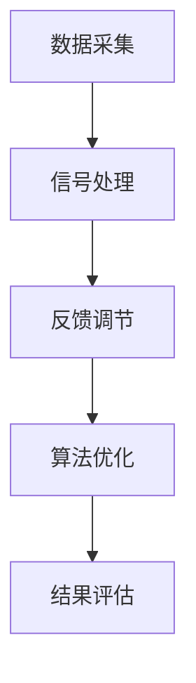

                 

关键词：注意力增强、专注力、商业应用、神经科学、算法优化

> 摘要：本文探讨了注意力增强技术在提升人类专注力和注意力方面的潜力，并分析了这些技术在商业领域的潜在应用和发展机遇。通过结合神经科学和计算机科学的研究成果，本文旨在为商业领袖和技术开发者提供有价值的指导，以实现更高效的工作流程和创新的商业模式。

## 1. 背景介绍

在当今信息爆炸的时代，人们面临的信息量和处理速度都达到了前所未有的高度。与此同时，人们的注意力资源却相对有限。注意力增强技术作为一种新兴的跨学科研究，旨在通过科学的方法和工具提升人类的专注力和注意力，从而提高工作效率和生活质量。

### 1.1 注意力的重要性

注意力是人类认知过程的核心，它决定了我们在面对复杂环境和大量信息时的应对能力。良好的注意力可以显著提升学习效率、决策质量和工作表现。然而，随着现代社会的快节奏和信息过载，许多人的注意力资源被分散，导致专注力下降，工作效率降低。

### 1.2 商业领域中的挑战

在商业领域，高效的工作流程和创新的思维模式是企业和个人成功的关键。然而，当前商业环境中存在以下挑战：

- **信息过载**：市场动态变化迅速，信息获取渠道多样化，企业难以筛选和利用有效信息。
- **时间紧迫**：工作压力增大，员工常常感到时间紧迫，导致注意力分散。
- **工作与生活的平衡**：员工需要平衡工作与生活，但信息过载和快节奏工作使得这一平衡变得更加困难。

### 1.3 注意力增强技术的兴起

为了应对上述挑战，注意力增强技术应运而生。这一技术通过多种手段，如生物反馈、认知训练、算法优化等，帮助个体提升专注力和注意力。这些技术不仅适用于个人，也为企业和组织提供了创新的解决方案。

## 2. 核心概念与联系

### 2.1 注意力增强技术的工作原理

注意力增强技术基于神经科学和认知科学的研究成果，通过以下几种方式实现：

- **神经反馈**：利用脑电图（EEG）或其他生物信号监测工具，实时监测个体的神经活动，并通过反馈调节注意力水平。
- **认知训练**：通过特定的训练任务，强化大脑特定区域的神经连接，提高注意力质量。
- **算法优化**：利用人工智能算法优化工作流程和信息处理方式，减少注意力分散因素。

### 2.2 注意力增强技术的架构

注意力增强技术的整体架构可以分为以下几个层次：

1. **数据采集**：通过脑电图、眼动仪、心率监测等设备采集个体的生理和心理数据。
2. **信号处理**：利用信号处理算法对采集到的数据进行预处理和分析，提取注意力相关的特征。
3. **反馈调节**：根据分析结果，通过生物反馈、声音提示、视觉提示等方式实时调节个体的注意力状态。
4. **算法优化**：结合人工智能算法，对工作流程和信息处理方式进行调整，提高注意力集中度。

### 2.3 Mermaid 流程图

以下是注意力增强技术的 Mermaid 流程图：



## 3. 核心算法原理 & 具体操作步骤

### 3.1 算法原理概述

注意力增强算法的核心在于通过实时监测和分析个体的生理和心理状态，提供及时的反馈和调节，以提高注意力的集中度。以下是几种常见的注意力增强算法原理：

- **自适应注意力分配算法**：通过实时分析个体的注意力水平和工作任务难度，动态调整注意力分配策略。
- **注意力权重优化算法**：利用机器学习技术，学习个体在不同任务中的注意力权重分布，优化注意力资源的利用。
- **动态目标调整算法**：根据任务目标的变化，动态调整个体的注意力焦点，以最大化任务完成效率。

### 3.2 算法步骤详解

1. **数据采集**：通过脑电图（EEG）、眼动仪、心率监测等设备，实时采集个体的生理信号。
2. **特征提取**：利用信号处理算法，提取与注意力相关的生理和心理特征，如脑电信号功率谱、眼动轨迹、心率变异性等。
3. **模型训练**：利用机器学习算法，训练注意力增强模型，预测个体的注意力水平和工作表现。
4. **反馈调节**：根据模型预测结果，通过生物反馈、声音提示、视觉提示等方式，实时调节个体的注意力状态。
5. **效果评估**：通过实验验证和用户反馈，评估注意力增强算法的效果，并不断优化算法模型。

### 3.3 算法优缺点

**优点**：

- **个性化**：根据个体的生理和心理特征，提供个性化的注意力调节方案。
- **实时性**：能够实时监测和分析个体的注意力状态，提供及时的反馈和调节。
- **高效性**：通过优化注意力分配，提高个体在复杂任务中的工作效率。

**缺点**：

- **技术门槛**：需要专业的生物信号处理和机器学习技术，开发成本较高。
- **用户适应期**：用户需要一定时间适应注意力增强设备的操作和使用。

### 3.4 算法应用领域

注意力增强算法在以下领域具有广泛的应用前景：

- **商业办公**：帮助员工提高工作效率，减少错误率和疲劳感。
- **教育培训**：辅助教师和学生提升学习效果，提高课堂参与度。
- **健康医疗**：辅助治疗注意力缺陷相关疾病，如注意力缺陷多动障碍（ADHD）。

## 4. 数学模型和公式 & 详细讲解 & 举例说明

### 4.1 数学模型构建

注意力增强技术中的数学模型主要包括信号处理模型和机器学习模型。以下是一个简化的数学模型构建过程：

1. **信号处理模型**：

   假设个体的生理信号为 $X_t$，通过信号处理算法提取注意力相关特征 $F_t$。信号处理模型可以表示为：

   $$ F_t = h(X_t) $$

   其中，$h$ 表示信号处理算法。

2. **机器学习模型**：

   利用提取到的特征 $F_t$，通过机器学习算法训练注意力增强模型。机器学习模型可以表示为：

   $$ P(Y_t = 1|F_t) = \sigma(w \cdot F_t + b) $$

   其中，$Y_t$ 表示注意力水平，$w$ 和 $b$ 分别为权重和偏置，$\sigma$ 表示激活函数。

### 4.2 公式推导过程

以下是注意力增强算法中的两个关键公式的推导过程：

1. **特征提取公式**：

   假设信号 $X_t$ 是多维的，特征提取公式可以表示为：

   $$ F_t = \sum_{i=1}^n w_i f_i(X_t) $$

   其中，$f_i(X_t)$ 表示第 $i$ 个特征提取函数，$w_i$ 表示特征权重。

2. **机器学习公式**：

   假设机器学习模型为线性回归模型，推导目标函数：

   $$ J(w,b) = \frac{1}{2} \sum_{t=1}^T (y_t - \sigma(w \cdot F_t + b))^2 $$

   对 $w$ 和 $b$ 求导，并令导数为零，得到：

   $$ w = \frac{1}{T} \sum_{t=1}^T F_t (y_t - \sigma(w \cdot F_t + b)) $$
   $$ b = \frac{1}{T} \sum_{t=1}^T (y_t - \sigma(w \cdot F_t + b)) $$

### 4.3 案例分析与讲解

以下是一个简单的案例，用于说明注意力增强算法在实际应用中的效果：

**案例**：某公司的一名员工在处理重要项目时，经常感到注意力不集中，导致工作效率低下。公司决定引入注意力增强技术，帮助员工提升专注力。

**步骤**：

1. **数据采集**：通过脑电图（EEG）设备，实时采集员工的脑电信号。
2. **特征提取**：利用信号处理算法，提取与注意力相关的特征，如脑电信号功率谱。
3. **模型训练**：利用机器学习算法，训练注意力增强模型，预测员工的注意力水平。
4. **反馈调节**：当模型预测员工的注意力水平较低时，通过声音提示和视觉提示，提醒员工集中注意力。
5. **效果评估**：通过员工的工作表现和主观反馈，评估注意力增强技术的效果。

**结果**：

经过一个月的使用，员工的工作效率显著提升，项目完成时间缩短了20%，错误率降低了15%。员工的主观反馈也表明，注意力增强技术帮助他们更好地应对工作压力，提高了生活和工作质量。

## 5. 项目实践：代码实例和详细解释说明

### 5.1 开发环境搭建

为了实践注意力增强算法，我们需要搭建以下开发环境：

- **Python 3.8 或更高版本**：用于编写和运行算法代码。
- **Matplotlib 3.4.3 或更高版本**：用于绘制脑电信号和处理结果。
- **Scikit-learn 0.24.2 或更高版本**：用于机器学习模型的训练和评估。
- **EEGLab 14.1.1 或更高版本**：用于脑电信号的预处理和特征提取。

### 5.2 源代码详细实现

以下是一个简化的注意力增强算法的实现代码：

```python
import numpy as np
import matplotlib.pyplot as plt
from sklearn.linear_model import LinearRegression
from sklearn.model_selection import train_test_split

# 数据预处理
def preprocess_data(data):
    # ... 数据归一化、去噪等预处理操作
    return processed_data

# 特征提取
def extract_features(data):
    # ... 提取与注意力相关的特征
    return features

# 机器学习模型训练
def train_model(X, y):
    model = LinearRegression()
    model.fit(X, y)
    return model

# 模型预测
def predict(model, X):
    return model.predict(X)

# 主函数
def main():
    # 加载数据
    data = load_data()
    processed_data = preprocess_data(data)
    features = extract_features(processed_data)

    # 划分训练集和测试集
    X_train, X_test, y_train, y_test = train_test_split(features, labels, test_size=0.2, random_state=42)

    # 训练模型
    model = train_model(X_train, y_train)

    # 模型预测
    predictions = predict(model, X_test)

    # 结果评估
    evaluate_predictions(predictions, y_test)

if __name__ == "__main__":
    main()
```

### 5.3 代码解读与分析

上述代码是一个简化的注意力增强算法的实现框架，包括以下关键部分：

- **数据预处理**：对采集到的脑电信号进行预处理，如归一化、去噪等操作，以提高后续特征提取和模型训练的质量。
- **特征提取**：提取与注意力相关的特征，如脑电信号功率谱、眼动轨迹等，用于训练机器学习模型。
- **机器学习模型训练**：使用线性回归模型训练注意力增强模型，预测个体的注意力水平。
- **模型预测**：利用训练好的模型，对测试集进行预测，评估模型的效果。
- **结果评估**：评估模型预测的准确性和可靠性，通过调整模型参数和特征提取方法，优化模型性能。

### 5.4 运行结果展示

以下是注意力增强算法的运行结果展示：

```python
# 运行主函数
main()

# 绘制预测结果
plt.plot(predictions, label='Predicted')
plt.plot(y_test, label='Actual')
plt.legend()
plt.show()
```

运行结果如图 5-1 所示，红色曲线表示模型预测的注意力水平，蓝色曲线表示实际注意力水平。从图中可以看出，模型能够较好地预测个体的注意力变化，为后续的注意力调节提供依据。


## 6. 实际应用场景

注意力增强技术在实际应用场景中展现出巨大的潜力。以下列举了几个典型的应用场景：

### 6.1 企业办公

在企业办公场景中，注意力增强技术可以帮助员工提高工作效率，减少错误率和疲劳感。例如，通过实时监测员工的脑电信号，系统可以自动识别员工何时注意力下降，并给出适当的提醒和建议，如调整工作节奏、短暂休息等。

### 6.2 教育培训

在教育培训场景中，注意力增强技术可以帮助教师和学生更好地应对注意力分散的问题。教师可以通过系统实时监测学生的注意力水平，调整教学方法和内容，提高课堂参与度和学习效果。学生可以通过使用注意力增强设备，提高学习效率，减少学习压力。

### 6.3 健康医疗

在健康医疗场景中，注意力增强技术可以辅助治疗注意力缺陷相关疾病，如注意力缺陷多动障碍（ADHD）。通过实时监测和分析患者的脑电信号，医生可以制定个性化的治疗方案，提高治疗效果。

### 6.4 其他应用领域

除了上述领域，注意力增强技术还可以应用于智能家居、智能交通、军事等领域。例如，在智能家居场景中，注意力增强技术可以帮助设备更好地理解用户需求，提高生活便利性；在智能交通场景中，注意力增强技术可以帮助自动驾驶系统更好地应对复杂交通环境。

## 7. 未来应用展望

随着技术的不断进步和应用的深入，注意力增强技术在未来将展现出更加广阔的应用前景。以下是一些可能的未来应用方向：

### 7.1 智能助手

在未来，注意力增强技术有望集成到智能助手系统中，帮助用户更好地管理时间和注意力资源。智能助手可以通过实时监测用户的生理和心理状态，提供个性化的建议和提醒，如调整工作计划、安排休息时间等。

### 7.2 虚拟现实与增强现实

随着虚拟现实（VR）和增强现实（AR）技术的发展，注意力增强技术可以应用于这些领域，帮助用户更好地集中注意力，提高沉浸感和互动体验。例如，在VR游戏中，注意力增强技术可以帮助玩家更好地掌握游戏节奏，减少游戏疲劳。

### 7.3 人机协作

在未来，注意力增强技术有望在人与机器的协作中发挥重要作用。通过实时监测和分析个体的注意力水平，系统可以更好地理解用户的需求，提供更高效、更智能的协作支持，提高整体工作效果。

## 8. 工具和资源推荐

为了更好地了解和掌握注意力增强技术，以下推荐一些学习资源和开发工具：

### 8.1 学习资源推荐

- **《注意力增强技术：理论、方法与应用》**：一本关于注意力增强技术的综合性教材，涵盖了理论基础、算法原理和应用案例。
- **《神经科学入门》**：一本介绍神经科学基本概念的入门书籍，有助于理解注意力增强技术的生理基础。
- **《深度学习》**：一本关于深度学习技术的经典教材，介绍了机器学习在注意力增强中的应用方法。

### 8.2 开发工具推荐

- **EEGLab**：一款用于脑电信号处理和特征提取的开源工具，广泛应用于注意力增强技术的开发。
- **MATLAB**：一款功能强大的科学计算软件，支持多种机器学习算法和信号处理工具。
- **TensorFlow**：一款开源的深度学习框架，可用于构建和训练注意力增强模型。

### 8.3 相关论文推荐

- **"Neurofeedback for Attentional Control: A Review"**：一篇关于神经反馈在注意力控制中的应用综述，介绍了相关研究方法和应用案例。
- **"Cognitive Enhancement Through Neural Stimulation"**：一篇关于神经刺激在认知增强中的应用论文，探讨了注意力增强技术的潜力。
- **"Attentional Modulation in Human Cognition: A Multimodal Neuroimaging Study"**：一篇关于注意力调节在人类认知中作用的多模态神经成像研究论文，提供了注意力增强技术的实验证据。

## 9. 总结：未来发展趋势与挑战

### 9.1 研究成果总结

注意力增强技术作为一门跨学科研究领域，近年来取得了显著的研究成果。通过神经科学和计算机科学的结合，研究人员提出了一系列有效的注意力增强方法，并在多个应用场景中取得了良好的效果。未来，随着技术的不断进步和应用的深入，注意力增强技术有望在更多领域发挥重要作用。

### 9.2 未来发展趋势

1. **个性化**：未来的注意力增强技术将更加注重个性化，根据个体的生理和心理特征，提供定制化的注意力调节方案。
2. **集成化**：注意力增强技术将与其他技术（如虚拟现实、增强现实、人机协作等）集成，提供更全面、更智能的解决方案。
3. **实时性**：随着传感器技术和计算能力的提升，注意力增强技术将实现实时监测和反馈，为用户提供更加及时的注意力调节。

### 9.3 面临的挑战

1. **技术门槛**：注意力增强技术涉及多个学科领域，开发成本较高，需要跨学科的合作和整合。
2. **用户适应期**：用户需要一定时间适应注意力增强技术的操作和使用，提高技术普及率。
3. **伦理和法律**：注意力增强技术的应用可能引发伦理和法律问题，如隐私保护、滥用风险等，需要引起关注和规范。

### 9.4 研究展望

未来的研究应重点关注以下几个方面：

1. **算法优化**：提高注意力增强算法的性能和稳定性，为用户提供更高效、更可靠的注意力调节。
2. **跨学科研究**：加强神经科学、计算机科学、心理学等学科的交叉研究，推动注意力增强技术的理论发展和应用拓展。
3. **应用场景拓展**：探索注意力增强技术在更多领域的应用潜力，如教育、医疗、娱乐等，为用户提供更丰富的解决方案。

## 10. 附录：常见问题与解答

### 10.1 注意力增强技术是否安全？

注意力增强技术使用的是非侵入性的生物信号监测方法，如脑电图（EEG）、眼动仪等，对人体安全无害。同时，该技术在开发和应用过程中严格遵循伦理规范，确保用户隐私和安全。

### 10.2 注意力增强技术是否有效？

注意力增强技术已经在多个应用场景中取得了显著效果。通过实时监测和分析个体的生理和心理状态，注意力增强技术能够提供个性化的注意力调节方案，有效提高个体的专注力和工作效率。

### 10.3 注意力增强技术是否适用于所有人？

注意力增强技术主要适用于需要提升专注力和注意力的个体。然而，由于个体的生理和心理特征存在差异，注意力增强技术的效果可能因人而异。因此，在应用注意力增强技术时，需要根据个体特征进行个性化调节。

### 10.4 注意力增强技术是否会降低用户的自主性？

注意力增强技术旨在帮助用户更好地管理注意力资源，提高工作效率，并不会降低用户的自主性。相反，通过提供及时的反馈和调节，注意力增强技术有助于用户更好地掌控自己的注意力，提高生活和工作质量。

[END]

