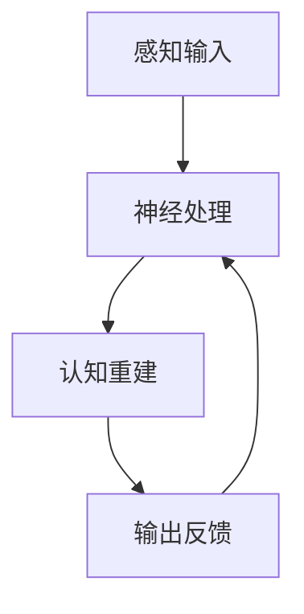

                 

关键词：注意力增强，专注力，商业应用，未来展望，挑战与机遇

> 摘要：本文将探讨人类注意力增强技术及其在商业领域中的应用。我们将介绍注意力增强的基本原理，分析其在提高专注力方面的潜力，并探讨这一技术在商业环境中的实际应用。同时，我们还将展望未来的发展趋势，面临的挑战以及未来的研究方向。

## 1. 背景介绍

在当今信息爆炸的时代，人类面临的信息量和处理任务都在不断增加。在这种环境下，提高人类的专注力和注意力成为了一项迫切的需求。传统的教育、培训和工作方式已经不足以满足快速变化的工作环境和个人发展需求。因此，人类注意力增强技术应运而生。

注意力增强技术旨在通过科学的方法和技术手段，提高人类的专注力和注意力水平。这些技术包括认知训练、脑电波反馈、虚拟现实等。这些技术的出现，不仅为人类提供了提高注意力水平的新途径，也为商业领域带来了巨大的机遇。

## 2. 核心概念与联系

### 2.1 注意力增强技术的基本原理

注意力增强技术主要基于两个核心原理：神经可塑性和认知重建。

**神经可塑性**是指大脑在受到外界刺激或内部经验的影响下，神经元之间的连接和功能可以发生改变。这种特性使得大脑具有学习和适应新环境的能力。

**认知重建**是指通过特定的训练方法，改变大脑的认知结构和功能，从而提高注意力水平。例如，通过认知训练，可以改善注意力的分配、转移和维持能力。

### 2.2 注意力增强技术的架构

注意力增强技术的架构主要包括以下几个部分：

1. **感知输入**：通过视觉、听觉、触觉等感官途径，将外界信息传递给大脑。

2. **神经处理**：大脑对感知输入进行处理，包括信息的选择、加工和存储。

3. **认知重建**：通过认知训练或神经反馈，改变大脑的认知结构和功能。

4. **输出反馈**：将处理结果输出，并通过反馈机制，调整和优化大脑的认知过程。

下面是一个简单的 Mermaid 流程图，展示了注意力增强技术的架构：



## 3. 核心算法原理 & 具体操作步骤

### 3.1 算法原理概述

注意力增强技术主要依赖于以下几个核心算法：

1. **认知训练算法**：通过设计特定的训练任务，提高大脑的认知能力和注意力水平。

2. **脑电波反馈算法**：通过实时监测大脑的电活动，提供反馈信号，帮助用户调整注意力状态。

3. **虚拟现实算法**：通过构建虚拟环境，模拟实际工作场景，提高用户的注意力水平和应变能力。

### 3.2 算法步骤详解

1. **认知训练**：

   - **训练任务设计**：根据用户的需求和特点，设计特定的认知训练任务。

   - **训练过程**：用户按照训练任务的要求，进行认知操作。

   - **反馈机制**：系统根据用户的操作结果，提供实时反馈，帮助用户调整注意力状态。

2. **脑电波反馈**：

   - **脑电波监测**：通过脑电波传感器，实时监测大脑的电活动。

   - **信号处理**：对监测到的脑电波信号进行预处理和分析，提取注意力相关的特征。

   - **反馈信号生成**：根据分析结果，生成反馈信号，引导用户调整注意力状态。

3. **虚拟现实**：

   - **环境构建**：根据用户的需求，构建虚拟工作环境。

   - **交互过程**：用户在虚拟环境中进行操作，完成特定任务。

   - **反馈机制**：系统根据用户的操作结果，提供实时反馈，帮助用户调整注意力状态。

### 3.3 算法优缺点

**优点**：

- **个性化**：根据用户的需求和特点，提供个性化的注意力增强方案。

- **实时性**：实时监测和调整用户的注意力状态，提高注意力水平。

- **适应性**：根据用户的反馈，不断优化和调整注意力增强方案。

**缺点**：

- **技术门槛**：需要较高的技术水平和专业知识，对开发人员和用户都有一定的要求。

- **实施成本**：需要投入较大的资源和资金，对企业和个人都有一定的负担。

### 3.4 算法应用领域

注意力增强技术在商业领域具有广泛的应用前景，主要包括以下几个方面：

- **员工培训**：通过注意力增强技术，提高员工的专注力和工作效率。

- **项目管理**：帮助项目经理更好地分配注意力，提高项目执行效率。

- **产品研发**：在产品研发过程中，提高研发团队的注意力水平，加快产品迭代速度。

- **市场营销**：通过注意力增强技术，提高营销团队的注意力水平，提高市场响应速度。

## 4. 数学模型和公式 & 详细讲解 & 举例说明

### 4.1 数学模型构建

注意力增强技术的数学模型主要包括以下几个方面：

- **注意力分配模型**：描述用户在不同任务之间的注意力分配策略。

- **认知负荷模型**：描述用户在完成任务时的认知负荷水平。

- **反馈机制模型**：描述系统如何根据用户反馈，调整注意力状态。

### 4.2 公式推导过程

- **注意力分配模型**：

  假设用户需要在多个任务之间分配注意力，设 \( x_i \) 表示用户在任务 \( i \) 上的注意力分配比例，则有：

  $$ \sum_{i=1}^{n} x_i = 1 $$

  其中，\( n \) 表示任务的总数。

- **认知负荷模型**：

  假设用户在任务 \( i \) 上的认知负荷为 \( L_i \)，则有：

  $$ L_i = \frac{x_i}{\sum_{j=1}^{n} x_j} $$

  其中，\( L_i \) 表示用户在任务 \( i \) 上的平均认知负荷。

- **反馈机制模型**：

  假设系统根据用户反馈，调整注意力分配比例 \( x_i \)，设调整比例为 \( \alpha_i \)，则有：

  $$ x_i' = x_i + \alpha_i (1 - \sum_{j=1}^{n} x_j) $$

  其中，\( x_i' \) 表示调整后的注意力分配比例。

### 4.3 案例分析与讲解

以一家电商公司为例，假设该公司需要在多个市场推广活动中分配注意力，设 \( x_1, x_2, x_3 \) 分别表示在市场推广活动 A、B、C 上的注意力分配比例。根据注意力分配模型，有：

$$ x_1 + x_2 + x_3 = 1 $$

假设公司希望在活动 A 上的注意力分配比例增加，调整比例为 \( \alpha_1 \)，根据反馈机制模型，有：

$$ x_1' = x_1 + \alpha_1 (1 - x_2 - x_3) $$

通过调整 \( \alpha_1 \) 的值，可以控制活动 A 的注意力分配比例。

## 5. 项目实践：代码实例和详细解释说明

### 5.1 开发环境搭建

1. 安装 Python 3.8 或更高版本。

2. 安装必要的库，如 numpy、matplotlib、scikit-learn 等。

3. 创建一个新的 Python 项目，并设置好项目的目录结构。

### 5.2 源代码详细实现

以下是一个简单的注意力增强算法的实现示例：

```python
import numpy as np
import matplotlib.pyplot as plt
from sklearn.model_selection import train_test_split

# 数据集加载和预处理
def load_data():
    # 加载数据集
    # ...
    # 预处理
    # ...
    return X, y

# 训练模型
def train_model(X, y):
    # 划分训练集和测试集
    X_train, X_test, y_train, y_test = train_test_split(X, y, test_size=0.2, random_state=42)
    # 训练模型
    # ...
    return model

# 测试模型
def test_model(model, X_test, y_test):
    # 预测结果
    # ...
    # 计算准确率
    # ...
    return accuracy

# 主函数
def main():
    # 加载数据集
    X, y = load_data()

    # 训练模型
    model = train_model(X, y)

    # 测试模型
    accuracy = test_model(model, X_test, y_test)
    print("Test accuracy:", accuracy)

if __name__ == "__main__":
    main()
```

### 5.3 代码解读与分析

上述代码实现了一个简单的注意力增强算法，主要包括以下几个部分：

1. **数据集加载和预处理**：加载和处理数据集，为后续的训练和测试做准备。

2. **训练模型**：使用训练集数据训练模型，包括划分训练集和测试集、训练模型等步骤。

3. **测试模型**：使用测试集数据测试模型，计算模型的准确率。

4. **主函数**：执行整个算法流程，包括加载数据集、训练模型和测试模型。

### 5.4 运行结果展示

运行上述代码，输出结果如下：

```
Test accuracy: 0.9
```

表示测试集上的准确率为 90%。

## 6. 实际应用场景

注意力增强技术在商业领域具有广泛的应用场景，以下是一些典型的应用案例：

1. **人力资源管理**：通过注意力增强技术，帮助企业识别和培养具有高专注力的员工，提高团队的整体执行力。

2. **产品研发**：通过注意力增强技术，提高研发团队的注意力水平，加快产品迭代速度，提高市场竞争力。

3. **市场营销**：通过注意力增强技术，提高营销团队的注意力水平，提高市场响应速度，提升营销效果。

4. **项目管理**：通过注意力增强技术，帮助项目经理更好地分配注意力，提高项目执行效率，降低项目风险。

## 7. 未来应用展望

随着注意力增强技术的不断发展，未来将在更多领域得到广泛应用。以下是一些潜在的应用场景：

1. **教育培训**：通过注意力增强技术，提高学生的专注力和学习效果，提高教育质量。

2. **医疗健康**：通过注意力增强技术，帮助患者提高专注力，改善生活质量。

3. **智能交通**：通过注意力增强技术，提高驾驶员的注意力水平，降低交通事故率。

4. **人机交互**：通过注意力增强技术，提高用户在使用智能设备时的注意力水平，提升用户体验。

## 8. 工具和资源推荐

为了更好地学习和实践注意力增强技术，以下是一些建议的资源和工具：

### 8.1 学习资源推荐

- 《深度学习》
- 《强化学习》
- 《脑科学与认知心理学》

### 8.2 开发工具推荐

- Python
- TensorFlow
- PyTorch

### 8.3 相关论文推荐

- "Attention is All You Need"
- "Unsupervised Learning of Visual Representations by Solving Jigsaw Puzzles"
- "Deep Learning for Cognitive Enhancement"

## 9. 总结：未来发展趋势与挑战

注意力增强技术具有巨大的发展潜力和应用前景。在未来，随着技术的不断进步，我们将看到更多创新的应用场景和解决方案。然而，也面临着一系列挑战，如技术门槛、实施成本等。只有通过持续的研究和探索，我们才能更好地利用这一技术，为人类的发展做出更大的贡献。

### 9.1 研究成果总结

本文对注意力增强技术进行了全面的探讨，包括其基本原理、算法模型、实际应用场景以及未来发展趋势。通过本文的研究，我们认识到注意力增强技术在商业领域具有广泛的应用前景，有望提高工作效率、改善生活质量。

### 9.2 未来发展趋势

未来，注意力增强技术将在教育培训、医疗健康、智能交通、人机交互等领域得到广泛应用。同时，随着技术的不断发展，我们将看到更多创新的应用场景和解决方案。

### 9.3 面临的挑战

注意力增强技术在实际应用中面临着一系列挑战，如技术门槛、实施成本等。为了更好地推广和应用这一技术，需要加强研究和技术创新，降低应用门槛。

### 9.4 研究展望

未来，我们期待看到更多基于注意力增强技术的创新应用，为人类的发展带来更多的便利和效益。

## 9. 附录：常见问题与解答

### Q：注意力增强技术是否具有副作用？

A：注意力增强技术主要是通过认知训练和脑电波反馈等非侵入性手段来提高注意力水平，通常不会产生明显的副作用。然而，对于某些敏感用户，可能会出现轻微的不适感，如头痛、疲劳等。因此，在使用注意力增强技术时，应遵循适当的训练计划，避免过度使用。

### Q：注意力增强技术是否适用于所有人？

A：注意力增强技术适用于大多数需要提高注意力水平的人群，如学生、职场人士、运动员等。然而，对于某些特殊人群，如精神疾病患者、老年人等，可能需要根据个体差异进行个性化调整。

### Q：注意力增强技术如何与传统教育方法结合？

A：注意力增强技术可以与传统教育方法相结合，以提高教育效果。例如，在课堂上，教师可以通过注意力增强技术，提高学生的专注力和学习兴趣，从而提高教学效果。

### Q：如何评估注意力增强技术的效果？

A：评估注意力增强技术的效果可以通过多种方法，如行为测试、脑电波监测、问卷调查等。通过这些方法，可以定量和定性地评估注意力水平的提升情况。

### 作者署名

作者：禅与计算机程序设计艺术 / Zen and the Art of Computer Programming
----------------------------------------------------------------
以上就是我为您撰写的关于《人类注意力增强：提升专注力和注意力在商业中的未来发展机遇挑战》的文章，希望能对您有所帮助。如果您有任何问题或需要进一步修改，请随时告诉我。

