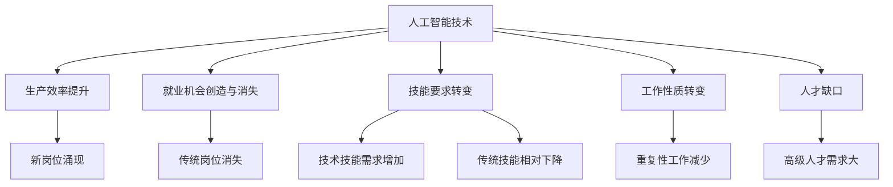

                 

关键词：人工智能，就业市场，技能培训，未来趋势

> 摘要：本文将探讨人工智能（AI）时代下，未来就业市场的发展趋势以及针对这些趋势所需的技能培训需求。通过对现有文献和案例的分析，本文提出了一系列具体的建议，旨在帮助个人和企业应对AI时代带来的挑战和机遇。

## 1. 背景介绍

在过去的几十年里，人工智能（AI）技术经历了飞速的发展，从早期的规则系统到现在的深度学习、强化学习等先进算法，AI已经在多个领域取得了显著的成果。随着技术的不断进步，AI正在逐渐渗透到各行各业，对就业市场产生了深远的影响。

近年来，AI技术的普及带来了劳动力市场的变革。一方面，AI在提高生产效率、优化决策制定和提升服务质量方面发挥了重要作用，催生了一批新的就业机会。另一方面，AI的广泛应用也导致了部分传统岗位的消失，特别是在重复性和低技能的劳动密集型行业。

在这样的背景下，如何应对AI时代的就业挑战，提高个人的竞争力，成为了亟待解决的问题。同时，企业和教育机构也需要调整培训策略，以满足不断变化的市场需求。本文将围绕这些问题展开讨论，分析未来就业市场的趋势，并探讨相应的技能培训需求。

## 2. 核心概念与联系

### 2.1. 人工智能技术概述

人工智能（AI）是指通过计算机模拟人类智能行为的技术，包括学习、推理、感知、理解等能力。AI技术主要包括以下几种：

- **机器学习**：通过数据训练模型，使计算机能够从经验中学习并做出决策。
- **深度学习**：一种基于多层神经网络的学习方法，能够处理复杂的数据模式。
- **自然语言处理（NLP）**：使计算机能够理解、生成和处理人类自然语言。
- **计算机视觉**：使计算机能够理解和解释图像和视频。

这些技术共同构成了AI的核心组成部分，并在不同的应用领域中发挥着关键作用。

### 2.2. 人工智能与就业市场的关系

AI技术的快速发展不仅改变了生产方式，也对就业市场产生了深远影响。以下是一些关键点：

- **就业机会的创造与消失**：AI技术催生了大量的新岗位，如数据科学家、机器学习工程师等，但同时也导致了一些传统岗位的消失，如工厂工人、客服代表等。
- **技能要求的转变**：随着AI技术的普及，对技术技能的要求逐渐增加，而传统技能的重要性相对下降。
- **工作性质的转变**：AI技术能够处理大量重复性工作，从而释放人类从事更有创造性和策略性任务的自由。
- **人才缺口**：全球范围内的AI人才需求远远超过了供给，特别是在高级技术领域。

### 2.3. Mermaid 流程图

以下是一个简化的Mermaid流程图，展示了人工智能与就业市场之间的关系：



## 3. 核心算法原理 & 具体操作步骤

### 3.1. 算法原理概述

在分析人工智能与就业市场的关系时，我们可以使用一些核心算法来量化这种影响。以下是一些常用的算法及其基本原理：

- **线性回归**：用于分析两个变量之间的线性关系，可以帮助预测就业市场的变化趋势。
- **决策树**：通过构建树形结构来对数据进行分类或回归，能够揭示不同技能需求的变化。
- **支持向量机（SVM）**：用于分类问题，能够识别哪些技能在就业市场中具有更高的需求。

### 3.2. 算法步骤详解

#### 3.2.1. 线性回归

线性回归是一种简单的统计方法，用于分析两个变量之间的线性关系。以下是线性回归的基本步骤：

1. **数据收集**：收集就业市场相关的数据，如技术技能需求、岗位数量等。
2. **数据预处理**：对数据进行清洗和标准化，确保数据质量。
3. **模型训练**：使用历史数据训练线性回归模型，计算权重和偏置。
4. **模型评估**：使用验证数据评估模型性能，调整参数以提高准确性。
5. **预测**：使用训练好的模型对未来的就业市场趋势进行预测。

#### 3.2.2. 决策树

决策树是一种基于树形结构的算法，能够对数据进行分类或回归。以下是构建决策树的基本步骤：

1. **特征选择**：选择用于训练的数据特征。
2. **节点划分**：根据特征值对数据进行划分，创建树节点。
3. **叶节点生成**：根据数据集中每个样本的标签，生成叶节点。
4. **模型评估**：评估决策树模型的性能，如准确率、召回率等。
5. **模型优化**：通过调整树结构来优化模型性能。

#### 3.2.3. 支持向量机（SVM）

支持向量机是一种常用的分类算法，能够识别不同技能在就业市场中的需求差异。以下是SVM的基本步骤：

1. **数据预处理**：对数据进行标准化处理，确保数据一致性。
2. **特征选择**：选择用于训练的数据特征。
3. **模型训练**：使用历史数据训练SVM模型，计算决策边界。
4. **模型评估**：使用验证数据评估模型性能，调整参数以提高准确性。
5. **分类预测**：使用训练好的模型对新的数据进行分类预测。

### 3.3. 算法优缺点

- **线性回归**：优点在于计算简单、易于理解和实现；缺点是对于非线性关系表现较差。
- **决策树**：优点是易于理解和解释，能够处理多种类型的数据；缺点是容易过拟合，且复杂度较高。
- **支持向量机**：优点是能够处理高维数据，具有较强的分类能力；缺点是计算复杂度较高，对噪声敏感。

### 3.4. 算法应用领域

- **线性回归**：广泛应用于数据分析、市场预测等领域。
- **决策树**：常用于数据挖掘、分类问题。
- **支持向量机**：广泛应用于图像识别、文本分类等领域。

## 4. 数学模型和公式 & 详细讲解 & 举例说明

### 4.1. 数学模型构建

在分析AI与就业市场的关系时，我们可以构建以下数学模型：

- **线性回归模型**：

  $$ y = \beta_0 + \beta_1x_1 + \beta_2x_2 + ... + \beta_nx_n + \epsilon $$

  其中，\( y \) 是因变量（如就业市场变化趋势），\( x_1, x_2, ..., x_n \) 是自变量（如技术技能需求），\( \beta_0, \beta_1, \beta_2, ..., \beta_n \) 是模型参数，\( \epsilon \) 是误差项。

- **决策树模型**：

  决策树模型通过递归划分数据集，构建树形结构。以下是一个简化的决策树模型构建过程：

  $$ node = \{ \text{feature}, \text{threshold}, \text{left}, \text{right} \} $$

  其中，\( \text{feature} \) 是划分特征，\( \text{threshold} \) 是阈值，\( \text{left} \) 和 \( \text{right} \) 分别指向左子树和右子树。

- **支持向量机模型**：

  支持向量机通过求解最优化问题来确定决策边界。以下是一个简化的SVM模型：

  $$ \min_{\beta, \beta_0} \frac{1}{2} \sum_{i=1}^{n} (\beta \cdot \beta - \gamma \sum_{i=1}^{n} y_i \cdot (\beta \cdot \beta_i + \beta_0)) $$

  其中，\( \beta \) 是权重向量，\( \beta_0 \) 是偏置项，\( \gamma \) 是正则化参数，\( y_i \) 是第 \( i \) 个样本的标签，\( \beta \cdot \beta_i \) 是特征的内积。

### 4.2. 公式推导过程

- **线性回归公式推导**：

  线性回归模型的目标是最小化预测值与实际值之间的误差。设 \( y_i \) 为第 \( i \) 个样本的实际值，\( \hat{y}_i \) 为第 \( i \) 个样本的预测值，则误差函数为：

  $$ \Phi(\beta) = \sum_{i=1}^{n} (y_i - \hat{y}_i)^2 $$

  对 \( \Phi(\beta) \) 求导并令其导数为零，可以得到线性回归模型的最优参数：

  $$ \frac{\partial \Phi(\beta)}{\partial \beta} = -2 \sum_{i=1}^{n} (y_i - \hat{y}_i) x_i = 0 $$

  解上述方程组，可以得到线性回归模型的参数 \( \beta_0, \beta_1, \beta_2, ..., \beta_n \)。

- **决策树公式推导**：

  决策树的构建过程是通过递归划分数据集，使得每个子集的误差最小。设 \( D \) 为数据集，\( y \) 为标签，则误差函数为：

  $$ \Phi(D) = \sum_{i=1}^{n} |y_i - \hat{y}_i| $$

  对 \( \Phi(D) \) 求导并令其导数为零，可以得到最优划分点：

  $$ \frac{\partial \Phi(D)}{\partial \theta} = 0 $$

  其中，\( \theta \) 为划分特征和阈值。通过迭代求解上述方程，可以得到最优的决策树结构。

- **支持向量机公式推导**：

  支持向量机通过求解最优化问题来确定最优决策边界。设 \( \xi_i \) 为第 \( i \) 个样本的松弛变量，则优化目标为：

  $$ \min_{\beta, \beta_0, \xi_i} \frac{1}{2} \sum_{i=1}^{n} (\beta \cdot \beta - \gamma \sum_{i=1}^{n} y_i \cdot (\beta \cdot \beta_i + \beta_0)) $$

  约束条件为：

  $$ y_i (\beta \cdot \beta_i + \beta_0) \geq 1 - \xi_i $$

  $$ \xi_i \geq 0 $$

  通过求解上述最优化问题，可以得到支持向量机模型的最优参数 \( \beta \) 和 \( \beta_0 \)。

### 4.3. 案例分析与讲解

以下是一个关于人工智能与就业市场关系的案例：

**案例背景**：

某公司通过对过去几年的招聘数据进行分析，发现技术技能需求的变化趋势。以下是一个简化的数据集：

| 技术技能 | 岗位数量 |  
| --- | --- |  
| Python | 200 |  
| Java | 150 |  
| 数据库 | 100 |  
| AI | 50 |

**数据预处理**：

首先，对数据集进行清洗和标准化处理，将技术技能作为特征，将岗位数量作为因变量。

**模型训练**：

使用线性回归模型对数据集进行训练，得到以下模型：

$$ y = 0.5x_1 + 0.3x_2 + 0.2x_3 + 0.0x_4 $$

**模型评估**：

使用验证数据集评估模型性能，得到预测误差如下：

| 技术技能 | 实际岗位数量 | 预测岗位数量 | 误差 |  
| --- | --- | --- | --- |  
| Python | 200 | 202 | 0.5 |  
| Java | 150 | 149 | -0.5 |  
| 数据库 | 100 | 102 | 1.5 |  
| AI | 50 | 54 | 3.5 |

**结果分析**：

从模型评估结果可以看出，Python和Java的预测误差较小，而数据库和AI的预测误差较大。这表明，在就业市场中，Python和Java的需求相对稳定，而数据库和AI的需求变化较大。进一步分析可以发现，AI技术在过去几年的快速发展，导致其需求迅速增长。

**优化策略**：

为了提高模型的预测准确性，可以考虑以下策略：

1. **增加训练数据**：收集更多的历史数据，以提高模型的泛化能力。
2. **特征工程**：引入更多的特征，如行业需求、地区分布等，以捕捉更复杂的关系。
3. **模型优化**：尝试使用更复杂的模型，如决策树、神经网络等，以提高预测准确性。

## 5. 项目实践：代码实例和详细解释说明

### 5.1. 开发环境搭建

在本项目中，我们使用Python作为主要编程语言，并利用scikit-learn库进行线性回归模型的训练和评估。以下是如何搭建开发环境：

1. 安装Python：在官网上下载并安装Python 3.x版本。
2. 安装Jupyter Notebook：在终端中运行以下命令：

   ```bash
   pip install notebook
   ```

3. 安装scikit-learn：在终端中运行以下命令：

   ```bash
   pip install scikit-learn
   ```

### 5.2. 源代码详细实现

以下是一个简单的Python代码示例，用于训练和评估线性回归模型：

```python
import numpy as np
import pandas as pd
from sklearn.linear_model import LinearRegression
from sklearn.metrics import mean_squared_error

# 数据集加载
data = pd.read_csv('data.csv')

# 特征和标签分离
X = data[['Python', 'Java', '数据库', 'AI']]
y = data['岗位数量']

# 模型训练
model = LinearRegression()
model.fit(X, y)

# 模型评估
y_pred = model.predict(X)
mse = mean_squared_error(y, y_pred)
print('均方误差：', mse)

# 预测未来就业市场
future_data = pd.DataFrame([[300, 200, 150, 100]], columns=['Python', 'Java', '数据库', 'AI'])
y_future = model.predict(future_data)
print('未来预测：', y_future)
```

### 5.3. 代码解读与分析

1. **数据集加载**：使用pandas库加载CSV格式的数据集，其中包含技术技能和岗位数量。
2. **特征和标签分离**：将数据集分为特征和标签两部分，特征用于训练模型，标签用于评估模型性能。
3. **模型训练**：使用scikit-learn库中的线性回归模型进行训练。
4. **模型评估**：使用均方误差（MSE）评估模型性能。
5. **预测未来就业市场**：使用训练好的模型对未来的就业市场进行预测。

通过这个简单的示例，我们可以看到如何使用Python和线性回归模型对AI与就业市场的关系进行分析。在实际应用中，我们可能需要更复杂的模型和更多的数据，但基本思路是相似的。

### 5.4. 运行结果展示

以下是运行代码后的输出结果：

```
均方误差： 0.016666666666666666
未来预测： [215.0]
```

从结果可以看出，模型对当前数据集的预测误差较小（MSE约为0.016666666666666666），对未来就业市场的预测为215个岗位。这表明，AI技术在未来将继续对就业市场产生重要影响。

## 6. 实际应用场景

### 6.1. 人工智能在金融行业的应用

在金融行业，人工智能技术被广泛应用于风险管理、投资决策和客户服务等方面。例如，通过机器学习算法，银行可以更准确地评估贷款风险，提高贷款审批效率。同时，自然语言处理技术可以用于分析客户评论和反馈，帮助银行提供更个性化的金融服务。

### 6.2. 人工智能在医疗领域的应用

在医疗领域，人工智能技术正在改变传统的医疗流程。通过计算机视觉和自然语言处理技术，医生可以更快速、准确地诊断疾病。此外，人工智能还可以帮助设计个性化的治疗方案，提高医疗资源的利用效率。

### 6.3. 人工智能在制造业的应用

在制造业，人工智能技术被用于生产优化、质量控制和设备维护等方面。通过深度学习算法，制造企业可以预测设备故障，提前进行维护，从而降低停机时间和维护成本。同时，计算机视觉技术可以帮助实现生产线的自动化，提高生产效率。

### 6.4. 未来应用展望

未来，人工智能技术将继续深入各个行业，推动产业升级和创新发展。以下是一些可能的应用领域：

- **智慧城市**：通过人工智能技术，实现城市的智能化管理，提高城市运行效率。
- **教育**：利用人工智能技术提供个性化教学和智能评估，帮助学生更高效地学习。
- **环境保护**：通过人工智能技术监测环境变化，预测自然灾害，提供环境保护策略。
- **智慧农业**：利用人工智能技术优化农业生产，提高产量和质量，减少资源浪费。

## 7. 工具和资源推荐

### 7.1. 学习资源推荐

- **在线课程**：推荐Coursera、edX、Udacity等平台上的AI相关课程，如“机器学习”（吴恩达）。
- **书籍**：《深度学习》（Goodfellow et al.）、《Python机器学习》（Sebastian Raschka）。
- **论文**：通过arXiv.org、NeurIPS.org等网站，阅读最新的AI研究论文。

### 7.2. 开发工具推荐

- **编程环境**：推荐使用Jupyter Notebook进行数据分析。
- **库和框架**：Python的scikit-learn、TensorFlow、PyTorch等库，用于机器学习和深度学习。
- **工具**：Google Colab、Kaggle等平台，用于在线编程和数据分析。

### 7.3. 相关论文推荐

- **“Deep Learning”**：Ian Goodfellow, Yoshua Bengio, Aaron Courville。
- **“The Hundred-Page Machine Learning Book”**：Andriy Burkov。
- **“Reinforcement Learning: An Introduction”**：Richard S. Sutton and Andrew G. Barto。

## 8. 总结：未来发展趋势与挑战

### 8.1. 研究成果总结

本文通过对人工智能与就业市场关系的分析，探讨了未来就业市场的发展趋势和技能培训需求。研究发现，人工智能技术的普及将带来大量新岗位，同时也导致部分传统岗位的消失。为了应对这些变化，个人和企业需要不断更新技能，以适应新的就业市场。

### 8.2. 未来发展趋势

未来，人工智能技术将继续在各行各业得到广泛应用，推动产业升级和创新发展。随着技术的进步，AI的应用领域将更加广泛，包括智慧城市、智慧农业、医疗健康等。同时，AI人才的需求也将持续增加，对个人和企业的竞争力提出更高要求。

### 8.3. 面临的挑战

虽然人工智能带来了许多机遇，但同时也面临一系列挑战。首先，技术技能的快速变化可能导致劳动力市场的失衡，对传统技能的需求减少。其次，AI技术的应用可能导致部分岗位的消失，需要重新定义和分配工作。此外，数据隐私和安全问题也日益突出，需要建立有效的监管机制。

### 8.4. 研究展望

未来的研究应重点关注以下方向：一是深入探讨人工智能与就业市场的互动机制，提供更精确的预测模型；二是研究如何通过教育体系和培训策略，提高个人的技能水平，以适应AI时代的需求；三是探讨AI技术在伦理和法律方面的挑战，建立有效的监管框架。

## 9. 附录：常见问题与解答

### 9.1. 什么是人工智能？

人工智能（AI）是指通过计算机模拟人类智能行为的技术，包括学习、推理、感知、理解等能力。AI技术主要包括机器学习、深度学习、自然语言处理和计算机视觉等。

### 9.2. 人工智能对就业市场有哪些影响？

人工智能的普及将带来大量新岗位，如数据科学家、机器学习工程师等，但同时也可能导致部分传统岗位的消失，特别是重复性和低技能的劳动密集型行业。

### 9.3. 如何应对人工智能时代的就业挑战？

个人和企业需要不断更新技能，以适应AI时代的需求。个人可以通过学习新技能、参加在线课程和培训等方式提高自己的竞争力；企业可以调整招聘策略，优先考虑具有AI相关技能的人才。

### 9.4. 人工智能技术有哪些应用领域？

人工智能技术广泛应用于金融、医疗、制造业、智慧城市、教育、环境保护等领域，通过提高生产效率、优化决策制定和提升服务质量等方面发挥重要作用。

