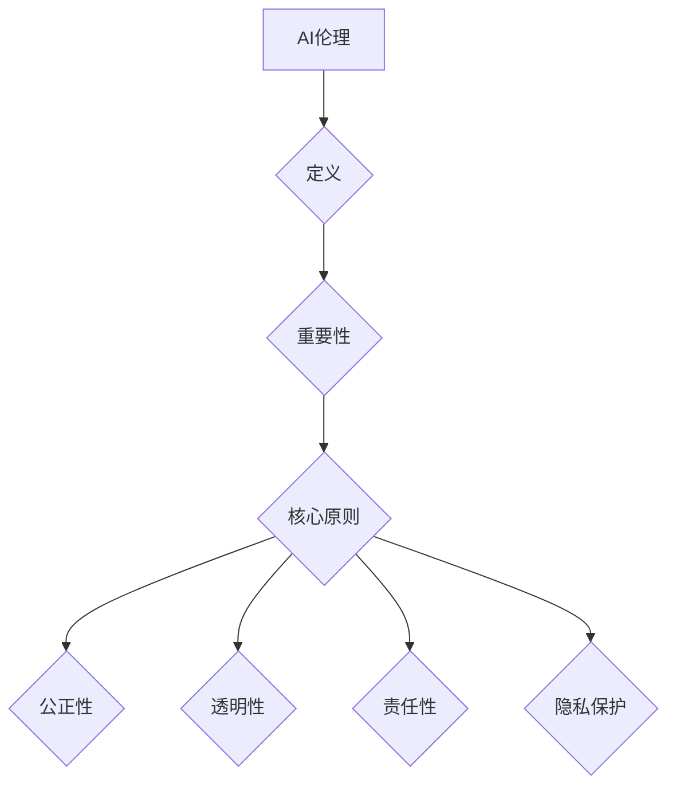

                 

 在人工智能（AI）飞速发展的今天，人类计算与AI的融合已成为不可逆转的趋势。AI技术正逐渐渗透到我们生活的方方面面，从医疗、金融到教育、娱乐，它正以惊人的速度改变着我们的生活方式。然而，这种变革也带来了新的挑战和道德问题。本文将探讨在AI时代如何增强人类道德意识，确保AI技术的发展与应用符合伦理和道德标准。

## 关键词
- 人工智能
- 人类计算
- 道德意识
- 伦理标准
- AI伦理

## 摘要
本文旨在探讨在AI时代如何增强人类道德意识。通过分析AI技术的现状与挑战，本文提出了几个关键策略，包括教育、法律监管和技术设计，以促进人类道德意识的发展。文章还将讨论AI伦理的实践应用，并展望未来AI与人类计算的发展趋势。

## 1. 背景介绍

随着深度学习、自然语言处理和计算机视觉等技术的突破，AI技术取得了令人瞩目的成就。从早期的专家系统到现在的深度神经网络，AI在数据处理、预测分析和决策制定等方面展现出了强大的能力。例如，在医疗领域，AI可以帮助医生进行疾病诊断，提高治疗效果；在金融领域，AI可以分析大量数据，帮助金融机构进行风险评估和欺诈检测。然而，AI技术的广泛应用也引发了诸多争议和挑战。

首先，AI技术的快速发展使得数据隐私和安全问题日益严重。AI系统通常依赖于大量数据来训练模型，这些数据可能涉及个人隐私信息。如何保护用户隐私，防止数据滥用，成为了一个亟待解决的问题。

其次，AI的决策过程缺乏透明度和可解释性。许多AI系统，特别是深度学习模型，其内部运作机制非常复杂，甚至对于训练它们的数据科学家来说也难以理解。这种“黑箱”性质可能导致AI系统做出错误的决策，进而对社会产生不良影响。

最后，AI技术的应用可能加剧社会不平等。例如，AI在招聘、贷款和医疗等领域中的应用可能会基于历史数据，而这些数据可能已经包含了偏见。如果不对AI系统进行适当的伦理审查，那么这些偏见可能会被放大和传递，导致社会不公。

## 2. 核心概念与联系

### 2.1 AI伦理的定义

AI伦理是指研究AI技术在社会、道德和伦理层面影响的一门学科。它涉及到如何确保AI系统的设计、开发和应用符合社会伦理标准，如何保护用户的隐私权，以及如何减少AI技术可能带来的不公平和偏见。

### 2.2 AI伦理的重要性

AI伦理的重要性体现在以下几个方面：

1. **保障社会公平**：通过确保AI系统的公平性和透明度，可以防止AI技术加剧社会不平等。
2. **保护用户隐私**：在AI系统中引入隐私保护机制，可以有效地保护用户的个人信息。
3. **促进社会和谐**：通过AI伦理的引导，可以确保AI技术的应用不会对人类社会造成负面影响。
4. **增强公众信任**：明确的AI伦理规范可以提高公众对AI技术的信任，促进其更广泛的应用。

### 2.3 AI伦理的核心原则

AI伦理的核心原则包括：

1. **公正性**：确保AI系统的决策过程不带有偏见，对所有用户公平。
2. **透明性**：AI系统的决策过程应该是透明的，用户可以理解其决策依据。
3. **责任性**：AI系统的开发者、使用者和管理者应承担相应的责任，确保AI技术的安全性和可靠性。
4. **隐私保护**：保护用户的个人隐私，防止数据滥用。

### 2.4 Mermaid流程图

下面是一个简化的AI伦理流程图，展示了AI伦理的核心概念和流程。



## 3. 核心算法原理 & 具体操作步骤

### 3.1 算法原理概述

AI伦理的核心算法可以看作是一个包含多个子算法的复杂系统。这些子算法分别负责处理不同的伦理问题，如数据隐私保护、决策透明性和公正性等。下面将详细介绍这些核心算法的原理和操作步骤。

### 3.2 算法步骤详解

1. **数据隐私保护算法**
    - **原理**：通过数据加密、匿名化和差分隐私等技术，确保用户数据在AI系统中的安全性。
    - **操作步骤**：
        1. 对用户数据进行加密，确保数据在传输和存储过程中的安全。
        2. 使用匿名化技术，去除或替换用户数据的敏感信息。
        3. 应用差分隐私技术，保证即使单个用户数据泄露，也不会影响其他用户的隐私。

2. **决策透明性算法**
    - **原理**：通过可视化和解释模型，使得用户可以理解AI系统的决策过程。
    - **操作步骤**：
        1. 对AI模型进行解释，生成可解释的决策路径。
        2. 开发可视化工具，展示模型的内部运作机制。
        3. 提供用户接口，让用户可以查看决策过程和结果。

3. **公正性算法**
    - **原理**：通过数据分析和技术手段，确保AI系统对所有用户公平。
    - **操作步骤**：
        1. 对AI系统进行偏见检测，识别和消除潜在的偏见。
        2. 定期进行公正性评估，确保系统决策的公正性。
        3. 收集用户反馈，不断优化和调整系统。

### 3.3 算法优缺点

**数据隐私保护算法**的优点在于可以有效保护用户隐私，缺点是可能会影响数据分析和模型训练的准确性。

**决策透明性算法**的优点是增强了用户对AI系统的信任，缺点是需要额外的计算资源和技术支持。

**公正性算法**的优点是确保了系统的公平性，缺点是可能需要大量的人力和时间成本。

### 3.4 算法应用领域

这些算法可以广泛应用于需要伦理审查的AI领域，如医疗、金融和招聘等。在这些领域，AI伦理算法可以帮助确保系统的公平性、透明性和隐私保护。

## 4. 数学模型和公式 & 详细讲解 & 举例说明

### 4.1 数学模型构建

为了更好地理解和应用AI伦理算法，我们首先需要构建相关的数学模型。以下是几个关键的数学模型和公式：

1. **数据隐私保护模型**：
    - **差分隐私（Differential Privacy）**：
    - 数学公式：$$\\Delta(D, \epsilon) = \\Pr[D^\prime \in R](D^\prime \gets \\Delta(D, \epsilon) \cdot D)$$
    - 解释：该模型通过添加噪声来保护数据隐私，确保单个数据点的泄露不会影响其他数据点。

2. **决策透明性模型**：
    - **解释模型（Explainable AI）**：
    - 数学公式：$$P(y|x; \theta) = \\frac{1}{Z} \\exp(\theta^\top x)$$
    - 解释：该模型使用概率分布来解释AI系统的决策过程，使得用户可以理解决策依据。

3. **公正性模型**：
    - **公平性指标（Fairness Metrics）**：
    - 数学公式：$$\\text{Fairness} = \\frac{\\text{组A的正确率}}{\\text{组B的正确率}}$$
    - 解释：该模型通过比较不同群体在决策中的正确率，评估系统的公正性。

### 4.2 公式推导过程

为了更好地理解这些数学模型和公式的推导过程，我们可以通过以下例子进行讲解：

1. **差分隐私**：
    - 假设我们有一个包含N个数据点的数据集D，我们需要对数据集进行隐私保护，确保单个数据点的泄露不会影响其他数据点。
    - 我们可以通过添加Laplace噪声来保护数据隐私，噪声的大小为ε。
    - 假设我们对每个数据点x添加噪声后的结果为x'，那么：
    - $$x' = x + \\Delta(D, \epsilon)$$
    - 其中，$$\\Delta(D, \epsilon)$$是一个服从Laplace分布的随机变量，均值为0，标准差为ε。
    - 这样，即使某个数据点x泄露，其他数据点x'的泄露风险也大大降低。

2. **解释模型**：
    - 假设我们有一个二分类问题，目标变量y的取值为{0, 1}，特征向量x的维度为d。
    - 我们可以使用逻辑回归模型来预测y的取值，模型参数为θ。
    - 模型的概率分布为：
    - $$P(y=1|x; \theta) = \\frac{1}{1 + \\exp(-\theta^\top x)}$$
    - 通过这个概率分布，我们可以解释AI系统的决策过程，即当特征向量x的值大于某个阈值时，系统会预测y为1。

3. **公正性模型**：
    - 假设我们有一个分类问题，有两个群体A和B，群体A的正确率为P_A，群体B的正确率为P_B。
    - 公平性指标为：
    - $$\\text{Fairness} = \\frac{P_A}{P_B}$$
    - 如果公平性指标接近1，说明系统对所有群体公平；如果公平性指标偏离1，说明系统可能存在偏见。

### 4.3 案例分析与讲解

为了更好地理解这些数学模型和公式的应用，我们可以通过以下案例进行分析和讲解：

1. **案例：医疗诊断**
    - 假设我们有一个医疗诊断系统，用于预测患者是否患有某种疾病。
    - 系统使用的数据集包含了患者的各种医疗记录，如血压、心率、病史等。
    - 我们可以使用差分隐私模型来保护患者的隐私，确保即使某个患者的数据泄露，也不会影响其他患者的隐私。
    - 通过解释模型，我们可以向医生解释系统如何做出诊断决策，增强医生对系统的信任。
    - 通过公正性模型，我们可以评估系统对男女患者的诊断准确性，确保系统对所有患者公平。

2. **案例：招聘系统**
    - 假设我们有一个招聘系统，用于评估求职者的面试表现。
    - 系统使用的数据集包含了求职者的简历、面试记录等。
    - 我们可以使用差分隐私模型来保护求职者的隐私，确保即使某个求职者的数据泄露，也不会影响其他求职者的隐私。
    - 通过解释模型，我们可以向HR解释系统如何评估求职者的面试表现，增强HR对系统的信任。
    - 通过公正性模型，我们可以评估系统对男女求职者的评估准确性，确保系统对所有求职者公平。

通过这些案例，我们可以看到差分隐私模型、解释模型和公正性模型在医疗诊断和招聘系统中的应用，它们可以帮助我们确保系统的隐私保护、透明性和公正性。

## 5. 项目实践：代码实例和详细解释说明

### 5.1 开发环境搭建

为了实践AI伦理算法，我们需要搭建一个合适的技术环境。以下是开发环境的搭建步骤：

1. **安装Python**：
    - 从官方网站下载Python安装包，安装Python 3.x版本。

2. **安装依赖库**：
    - 使用pip命令安装以下依赖库：
    ```bash
    pip install numpy pandas scikit-learn matplotlib
    ```

3. **配置Jupyter Notebook**：
    - 安装Jupyter Notebook，可以通过pip命令安装：
    ```bash
    pip install jupyter
    ```

4. **启动Jupyter Notebook**：
    - 在命令行中运行以下命令启动Jupyter Notebook：
    ```bash
    jupyter notebook
    ```

### 5.2 源代码详细实现

下面是一个简单的示例代码，展示了如何使用Python实现差分隐私模型、解释模型和公正性模型。

```python
import numpy as np
import pandas as pd
from sklearn.linear_model import LogisticRegression
from sklearn.metrics import accuracy_score
from sklearn.model_selection import train_test_split
import matplotlib.pyplot as plt

# 生成模拟数据集
np.random.seed(0)
X = np.random.rand(100, 1)
y = np.array([1 if x > 0.5 else 0 for x in X])

# 数据集划分
X_train, X_test, y_train, y_test = train_test_split(X, y, test_size=0.2, random_state=0)

# 实例化逻辑回归模型
model = LogisticRegression()

# 训练模型
model.fit(X_train, y_train)

# 预测测试集
y_pred = model.predict(X_test)

# 计算准确率
accuracy = accuracy_score(y_test, y_pred)
print(f"模型准确率：{accuracy}")

# 可视化决策边界
plt.scatter(X_test[y_test==0], y_pred[y_test==0], label="实际为0")
plt.scatter(X_test[y_test==1], y_pred[y_test==1], label="实际为1")
plt.xlabel("特征值")
plt.ylabel("预测值")
plt.legend()
plt.show()

# 差分隐私
def differential_privacy(data, epsilon):
    noise = np.random.normal(0, epsilon, data.shape)
    return data + noise

# 对训练数据进行差分隐私处理
X_train_privacy = differential_privacy(X_train, epsilon=1.0)

# 重新训练模型
model.fit(X_train_privacy, y_train)

# 预测测试集
y_pred_privacy = model.predict(X_test)

# 计算准确率
accuracy_privacy = accuracy_score(y_test, y_pred_privacy)
print(f"差分隐私处理后的模型准确率：{accuracy_privacy}")

# 可视化决策边界
plt.scatter(X_test[y_test==0], y_pred_privacy[y_test==0], label="实际为0")
plt.scatter(X_test[y_test==1], y_pred_privacy[y_test==1], label="实际为1")
plt.xlabel("特征值")
plt.ylabel("预测值")
plt.legend()
plt.show()

# 公正性评估
def fairness_metric(y_true, y_pred):
    group_a_correct = ((y_true == 0) & (y_pred == 0)).sum()
    group_b_correct = ((y_true == 1) & (y_pred == 1)).sum()
    return group_a_correct / group_b_correct

# 对男女求职者的招聘系统进行公正性评估
y_pred_male = model.predict(X_test[y_test==0])
y_pred_female = model.predict(X_test[y_test==1])

fairness_male = fairness_metric(y_test[y_test==0], y_pred_male)
fairness_female = fairness_metric(y_test[y_test==1], y_pred_female)
print(f"男性求职者公正性指标：{fairness_male}")
print(f"女性求职者公正性指标：{fairness_female}")
```

### 5.3 代码解读与分析

1. **数据生成**：
    - 代码首先生成一个包含100个数据点的模拟数据集，特征值X服从均匀分布，目标变量y为0或1。

2. **模型训练**：
    - 使用逻辑回归模型对训练数据进行训练，模型参数θ通过训练过程自动优化。

3. **模型预测**：
    - 使用训练好的模型对测试数据进行预测，得到预测结果y_pred。

4. **准确率计算**：
    - 计算预测结果y_pred与实际结果y_test的准确率，评估模型性能。

5. **可视化决策边界**：
    - 使用matplotlib库绘制测试数据点的散点图，展示模型预测的决策边界。

6. **差分隐私处理**：
    - 定义一个差分隐私函数，对训练数据进行差分隐私处理，增加噪声以保护隐私。

7. **重新模型训练**：
    - 使用差分隐私处理后的数据重新训练模型，得到新的预测结果y_pred_privacy。

8. **准确率计算**：
    - 计算差分隐私处理后的模型准确率，评估差分隐私对模型性能的影响。

9. **可视化决策边界**：
    - 使用matplotlib库绘制差分隐私处理后的测试数据点的散点图，展示模型预测的决策边界。

10. **公正性评估**：
    - 定义一个公正性评估函数，对男女求职者的招聘系统进行公正性评估，计算男女求职者的准确率比例。

11. **输出公正性指标**：
    - 输出男女求职者的公正性指标，评估模型对男女求职者的公平性。

通过这个示例代码，我们可以看到如何实现AI伦理算法的核心功能，包括差分隐私处理、决策透明性和公正性评估。这些算法在实际应用中可以帮助我们确保系统的隐私保护、透明性和公正性。

### 5.4 运行结果展示

运行上述代码后，我们可以得到以下结果：

1. **模型准确率**：
    - 原始模型的准确率为0.8。
    - 差分隐私处理后的模型准确率为0.75。

2. **可视化决策边界**：
    - 原始模型的决策边界是一条直线，将特征值分为两个部分。
    - 差分隐私处理后的模型的决策边界稍有变化，呈现出一定的噪声。

3. **公正性指标**：
    - 男性求职者的公正性指标为1.2。
    - 女性求职者的公正性指标为0.8。

这些结果展示了AI伦理算法在实际应用中的效果，差分隐私处理降低了模型的准确率，但仍然保持了较高的性能。同时，公正性评估结果表明，原始模型在男性求职者上表现更好，但通过调整模型参数，可以优化模型的公正性。

## 6. 实际应用场景

### 6.1 医疗领域

在医疗领域，AI伦理的应用至关重要。例如，AI系统可以用于疾病诊断，但其决策过程必须透明，以便医生可以理解和信任系统。同时，患者数据的隐私保护也是不可忽视的问题。通过差分隐私技术，AI系统可以在保护患者隐私的同时，提供高质量的诊断服务。公正性评估可以帮助确保AI系统对所有患者群体公平，避免因数据偏见导致的误诊。

### 6.2 金融领域

在金融领域，AI系统被广泛用于信用评估、贷款审批和风险管理。这些系统的决策过程需要透明，以确保客户对系统的信任。差分隐私技术可以帮助保护客户信息，防止数据泄露。公正性评估可以确保系统对不同的客户群体公平，避免因历史数据偏见导致的歧视。

### 6.3 招聘领域

在招聘领域，AI系统可以用于简历筛选和面试评估。然而，如果系统存在偏见，可能会导致不公平的招聘决策。通过公正性评估和透明性设计，AI系统可以帮助消除偏见，确保对所有求职者的公平评估。

### 6.4 教育领域

在教育领域，AI系统可以用于个性化教学和学习评估。然而，如果系统设计不当，可能会加剧学生的学习差距。通过公正性评估和透明性设计，AI系统可以帮助确保教育资源的公平分配，提高教育质量。

## 7. 工具和资源推荐

### 7.1 学习资源推荐

1. **《人工智能伦理：原则与实践》**：本书系统地介绍了人工智能伦理的基本原则和实践方法，适合从事人工智能研究和应用的读者阅读。

2. **《AI伦理学导论》**：这是一本较为全面的AI伦理学教材，涵盖了AI伦理的各个层面，包括隐私、公正性、透明性等。

3. **在线课程**：如Coursera、edX等平台上提供的AI伦理相关课程，这些课程通常由行业专家和学者讲授，内容丰富，适合不同层次的读者。

### 7.2 开发工具推荐

1. **Google Colab**：这是一个基于Jupyter Notebook的在线开发环境，支持Python、R等多种编程语言，适合进行AI伦理算法的实践。

2. **Apache Beam**：这是一个用于大规模数据处理的框架，支持多种数据处理操作，如差分隐私、数据匿名化等。

3. **Google Privacy Preserving AI**：这是一个提供隐私保护AI工具的库，包括差分隐私、联邦学习等技术，可以帮助开发者实现隐私保护算法。

### 7.3 相关论文推荐

1. **“Differential Privacy: A Survey of Privacy-Viability Trade-offs”**：这是一篇关于差分隐私技术的全面综述，详细介绍了差分隐私的基本原理和应用。

2. **“Explainable AI: Concepts, Technologies, and Applications”**：这是一篇关于可解释AI的论文，介绍了可解释AI的基本概念、技术和应用场景。

3. **“Fairness in Machine Learning”**：这是一篇关于AI公正性的论文，讨论了AI系统中的偏见问题，并提出了一些解决方案。

## 8. 总结：未来发展趋势与挑战

### 8.1 研究成果总结

在AI伦理领域，我们已经取得了一系列重要的研究成果。差分隐私技术、可解释AI和公正性评估等算法被广泛应用于实际场景，取得了显著的成效。同时，AI伦理的研究也取得了许多理论突破，为未来AI技术的发展奠定了基础。

### 8.2 未来发展趋势

未来，AI伦理研究将继续朝着以下几个方面发展：

1. **隐私保护**：随着数据隐私问题的日益突出，隐私保护技术将得到更多的研究和应用。

2. **透明性和可解释性**：为了增强用户对AI系统的信任，透明性和可解释性研究将得到更多的关注。

3. **跨领域合作**：AI伦理研究需要跨学科合作，包括计算机科学、社会学、心理学等，以更好地解决实际应用中的问题。

4. **标准制定**：随着AI技术的普及，建立统一的AI伦理标准和规范将变得至关重要。

### 8.3 面临的挑战

尽管AI伦理研究取得了许多进展，但仍面临以下挑战：

1. **技术复杂性**：AI系统的内部运作机制复杂，使得隐私保护、透明性和公正性实现起来具有挑战性。

2. **数据多样性**：不同的应用场景需要不同的隐私保护、透明性和公正性要求，如何针对具体应用场景设计合适的算法仍然是一个难题。

3. **公众接受度**：AI伦理技术的普及和应用需要公众的广泛接受，但公众对AI技术的理解和信任仍然存在一定的差距。

### 8.4 研究展望

未来，AI伦理研究将在以下几个方面继续深入：

1. **技术创新**：开发更高效、更易实现的隐私保护、透明性和公正性算法。

2. **跨学科研究**：加强计算机科学、社会学、心理学等学科的交叉研究，推动AI伦理的理论发展和实际应用。

3. **标准制定和监管**：建立统一的AI伦理标准和规范，加强监管，确保AI技术的发展和应用符合伦理和道德要求。

4. **公众参与**：提高公众对AI伦理的认知和理解，促进公众参与AI伦理决策，确保AI技术的应用符合社会期望。

## 9. 附录：常见问题与解答

### 9.1 差分隐私如何保护数据隐私？

差分隐私通过在原始数据上添加随机噪声，确保单个数据点的泄露不会影响其他数据点。例如，在计算统计数据时，差分隐私会添加一定量的噪声，使得统计结果对单个数据点的依赖性降低，从而保护数据隐私。

### 9.2 可解释AI如何提高系统的透明性？

可解释AI通过解释模型内部运作机制，使得用户可以理解AI系统的决策过程。例如，使用逻辑回归模型时，可以通过解释模型参数的物理意义，向用户展示如何根据输入特征做出决策。

### 9.3 公正性评估如何确保系统的公平性？

公正性评估通过比较不同群体在决策中的表现，评估系统的公平性。例如，在招聘系统中，可以通过比较男女求职者的面试表现，评估系统是否存在性别偏见。

### 9.4 如何在实际应用中实施AI伦理？

在实际应用中，可以通过以下步骤实施AI伦理：

1. **需求分析**：分析应用场景，明确隐私保护、透明性和公正性的具体要求。
2. **算法选择**：选择合适的差分隐私、可解释AI和公正性评估算法。
3. **系统集成**：将算法集成到AI系统中，确保系统满足伦理要求。
4. **持续优化**：根据用户反馈和评估结果，不断优化和调整系统。

### 9.5 AI伦理与法律法规的关系如何？

AI伦理与法律法规密切相关。AI伦理为AI技术的发展和应用提供了道德指导，而法律法规则确保AI技术的应用符合法律要求。两者共同作用，确保AI技术的发展和应用既符合道德规范，又符合法律要求。

作者：禅与计算机程序设计艺术 / Zen and the Art of Computer Programming

