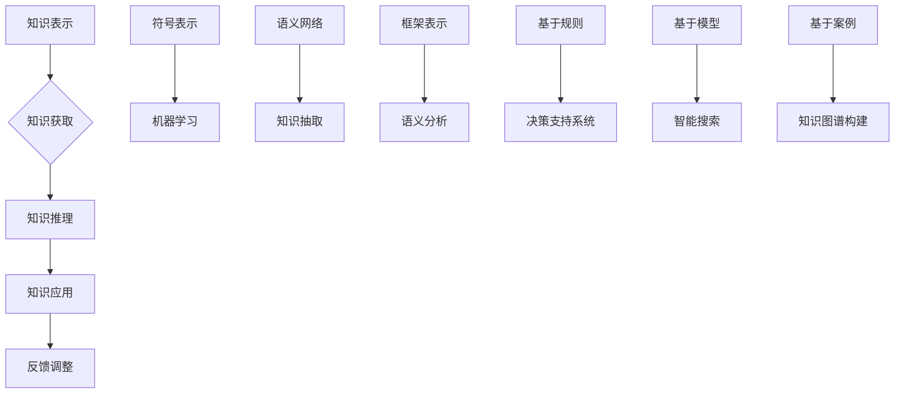

                 

关键词：认知模式、知识推理、人工智能、思维模型、思维逻辑、算法架构、计算思维

> 摘要：本文深入探讨了人类认知的四种基本模式，特别是知识驱动的推理模式。通过对知识表示、知识获取、知识推理以及知识应用的系统分析，本文揭示了知识在认知过程中的核心作用，并提出了构建高效知识推理系统的策略。文章旨在为人工智能领域的研发人员提供一个关于认知模式和知识推理的全面理解和实践指南。

## 1. 背景介绍

认知科学是20世纪中叶以来发展起来的一个跨学科领域，旨在研究人类及其它动物的感知、思维、学习、记忆等认知过程。随着计算机科学和人工智能技术的迅猛发展，认知科学在理论和实践上都与人工智能紧密相连。在认知科学的研究中，对人类认知模式的深入理解成为了一项重要课题。

人类认知模式通常可以分为感知、记忆、思维和语言四个基本层次。每个层次都涉及不同的认知过程和神经机制，构成了人类复杂认知能力的基石。其中，思维模式尤为重要，因为它涉及到知识的应用和推理，直接影响到人类解决问题的能力。

在人工智能领域，对人类思维模式的模拟和研究具有重大意义。人工智能的发展离不开对人类认知机制的深刻理解，特别是知识驱动的推理模式。知识驱动的推理模式在人工智能应用中起到了至关重要的作用，如决策支持系统、智能搜索、知识图谱构建等。

本文将从认知科学的角度出发，深入探讨知识驱动的推理模式。首先，我们将介绍知识驱动的推理模式的基本概念和特点，然后通过分析知识表示、知识获取、知识推理和知识应用四个环节，揭示知识在认知过程中的核心作用。最后，我们将讨论如何构建高效的知识推理系统，并提供一些实际应用场景和未来展望。

## 2. 核心概念与联系

### 2.1 知识驱动的推理模式概述

知识驱动的推理模式是一种基于知识的推理过程，它通过利用已有的知识库进行推理，以解决问题或得出结论。这种模式的核心在于“知识”的利用，知识可以来自外部数据源，也可以来自个体自身的经验积累。

知识驱动的推理模式主要特点包括：

- **基于知识的推理**：以知识库为核心，通过知识推理机制进行推理。
- **自动化程度高**：能够自动地从知识库中检索相关知识，进行推理，并生成结论。
- **灵活性强**：可以根据不同的应用场景和需求，调整知识库和推理规则，以适应不同的推理需求。

知识驱动的推理模式与传统的基于规则的推理和基于模型的推理相比，具有更强的灵活性和适应性。它不仅可以处理结构化数据，还可以处理半结构化和非结构化数据，这使得它在复杂问题解决中具有广泛的应用前景。

### 2.2 知识表示

知识表示是知识驱动的推理模式的基础，它涉及到如何将知识以计算机可处理的形式进行编码和存储。知识表示的方法有很多，包括符号表示、语义网络表示、框架表示、产生式规则表示等。

符号表示是最简单的一种知识表示方法，它使用符号和关系来表示知识。例如，使用“P→Q”表示“如果P则Q”。

语义网络表示则通过节点和边来表示实体和实体之间的关系。例如，在知识图谱中，实体和关系都可以用节点和边来表示。

框架表示通过预先定义的框架结构来表示知识，这些框架通常包含角色和槽位，用于描述实体之间的关系和属性。

产生式规则表示使用条件-动作规则来表示知识，例如，“如果条件A成立，则执行动作B”。

### 2.3 知识获取

知识获取是指从各种数据源中提取有用的知识，并将其转化为计算机可处理的形式。知识获取的方法包括机器学习、知识抽取、语义分析等。

机器学习是通过从大量数据中自动学习模式，从而获取知识。常见的机器学习算法包括决策树、支持向量机、神经网络等。

知识抽取是通过自然语言处理技术，从文本数据中自动提取知识。知识抽取的方法包括命名实体识别、关系抽取、事件抽取等。

语义分析是通过分析文本的语义信息，以获取更深层次的知识。语义分析的方法包括词性标注、句法分析、语义角色标注等。

### 2.4 知识推理

知识推理是指利用已有的知识库和推理规则，从已知事实推导出新的结论。知识推理的方法包括基于规则的推理、基于模型的推理、基于案例的推理等。

基于规则的推理是通过条件-动作规则进行推理，例如，如果A且B，则C。

基于模型的推理是通过模型结构进行推理，例如，在神经网络中，通过权重和偏置来推导输出。

基于案例的推理是通过比较现有案例和目标案例的相似性，进行推理。

### 2.5 知识应用

知识应用是指将获取和推理的知识应用于实际问题解决中。知识应用的方法包括决策支持系统、智能搜索、知识图谱构建等。

决策支持系统通过利用知识库进行推理，帮助用户做出决策。

智能搜索通过知识库和推理机制，实现对大量数据的快速检索和分析。

知识图谱构建是通过整合多源数据，构建出结构化的知识图谱，用于知识管理和知识服务。

### 2.6 Mermaid 流程图

以下是一个简化的知识驱动的推理模式的Mermaid流程图：



## 3. 核心算法原理 & 具体操作步骤

### 3.1 算法原理概述

知识驱动的推理模式的核心在于“知识”的利用，通过构建知识库、获取知识、进行推理和应用知识，来实现智能化的推理过程。以下是知识驱动的推理模式的基本原理：

1. **知识库构建**：首先需要构建一个包含丰富知识的知识库，知识库可以包含事实、规则、模型、案例等多种类型的知识。

2. **知识获取**：从外部数据源或内部数据源中提取知识，并将其转化为计算机可处理的形式。

3. **知识推理**：利用知识库和推理规则，从已知事实推导出新的结论。

4. **知识应用**：将推理出的知识应用于实际问题解决中。

5. **反馈调整**：根据实际应用效果，对知识库和推理规则进行调整和优化。

### 3.2 算法步骤详解

1. **知识库构建**：

   - 收集相关领域的数据，构建原始数据集。
   - 对原始数据进行清洗和预处理，提取有用的信息。
   - 将提取的信息转化为知识库中的知识，例如，使用符号表示、语义网络表示等方法。

2. **知识获取**：

   - 使用机器学习、知识抽取、语义分析等技术，从数据中提取知识。
   - 对提取的知识进行整合和分类，构建知识库。

3. **知识推理**：

   - 定义推理规则，例如，条件-动作规则、模型推理规则等。
   - 根据已知事实和推理规则，进行推理，推导出新的结论。

4. **知识应用**：

   - 将推理出的知识应用于实际问题解决中，例如，用于决策支持、智能搜索、知识图谱构建等。
   - 对应用效果进行评估和反馈，优化知识库和推理规则。

5. **反馈调整**：

   - 根据应用效果，对知识库和推理规则进行调整和优化。
   - 重新进行知识获取和推理，以实现更高效的推理过程。

### 3.3 算法优缺点

**优点**：

1. **灵活性强**：可以根据不同的应用场景和需求，调整知识库和推理规则，以适应不同的推理需求。
2. **自动化程度高**：能够自动地从知识库中检索相关知识，进行推理，并生成结论。
3. **适应性强**：可以处理结构化数据，也可以处理半结构化和非结构化数据。

**缺点**：

1. **知识库构建成本高**：构建一个完整和有效的知识库需要大量的时间和人力资源。
2. **推理效率较低**：对于复杂的推理问题，需要大量的计算资源和时间。
3. **知识表示限制**：现有的知识表示方法可能无法完全捕捉人类知识的复杂性和多样性。

### 3.4 算法应用领域

知识驱动的推理模式在多个领域都有广泛的应用：

1. **决策支持系统**：通过利用知识库和推理机制，帮助用户做出更加明智的决策。
2. **智能搜索**：通过知识库和推理机制，实现对大量数据的快速检索和分析。
3. **知识图谱构建**：通过整合多源数据，构建出结构化的知识图谱，用于知识管理和知识服务。
4. **自然语言处理**：通过知识库和推理机制，实现对自然语言文本的深度理解和处理。

## 4. 数学模型和公式 & 详细讲解 & 举例说明

### 4.1 数学模型构建

在知识驱动的推理模式中，数学模型是核心组成部分，它用于描述知识表示、知识获取、知识推理和知识应用的过程。以下是构建数学模型的基本步骤：

1. **定义变量和参数**：首先需要明确模型中的变量和参数，这些变量和参数将用于描述知识库中的知识和推理过程。

2. **建立数学关系**：根据知识驱动的推理过程，建立变量和参数之间的数学关系，例如，使用概率模型、决策树模型、神经网络模型等。

3. **优化目标函数**：为了使模型能够有效地进行知识推理，需要定义一个优化目标函数，例如，最小化误差函数、最大化准确率等。

4. **模型训练和验证**：使用实际数据对模型进行训练和验证，以调整模型参数和优化目标函数。

### 4.2 公式推导过程

以下是知识驱动的推理模式中常用的几个数学公式及其推导过程：

#### 4.2.1 贝叶斯推理

贝叶斯推理是一种基于概率的推理方法，它通过更新先验概率来推导后验概率。

$$ P(H|E) = \frac{P(E|H) \cdot P(H)}{P(E)} $$

其中，$P(H|E)$表示在观察到证据$E$后，假设$H$的后验概率；$P(E|H)$表示在假设$H$成立时，观察到证据$E$的概率；$P(H)$表示假设$H$的先验概率；$P(E)$表示观察到证据$E$的概率。

推导过程：

1. 条件概率公式：$P(E|H) = \frac{P(H \cap E)}{P(H)}$
2. 条件概率公式：$P(H \cap E) = P(H) \cdot P(E|H)$
3. 全概率公式：$P(E) = \sum_{i} P(E|H_i) \cdot P(H_i)$
4. 代入条件概率公式：$P(H|E) = \frac{P(E|H) \cdot P(H)}{\sum_{i} P(E|H_i) \cdot P(H_i)}$

#### 4.2.2 决策树

决策树是一种常用的分类模型，它通过一系列的决策节点来对数据进行分类。

$$ \text{分类结果} = \text{决策树}\left( \text{输入数据} \right) $$

其中，决策树是一个由决策节点和叶子节点组成的树结构，决策节点表示条件判断，叶子节点表示分类结果。

推导过程：

1. 初始化决策树为空。
2. 选择一个最优的决策节点，其目标是使分类结果的误差最小。
3. 根据决策节点的条件判断，将数据划分为多个子集。
4. 对每个子集，递归地构建决策树，直到满足停止条件（例如，数据集足够纯净或达到最大深度）。

#### 4.2.3 神经网络

神经网络是一种模拟生物神经系统的计算模型，它通过多层神经元之间的连接来学习和表示知识。

$$ \text{输出} = \text{激活函数} \left( \text{权重} \cdot \text{输入} + \text{偏置} \right) $$

其中，激活函数用于将输入信号转化为输出信号，常用的激活函数包括Sigmoid函数、ReLU函数等。

推导过程：

1. 初始化网络权重和偏置。
2. 对每个输入数据，通过多层神经元进行前向传播，计算输出。
3. 计算输出与实际标签之间的误差。
4. 使用反向传播算法更新网络权重和偏置，以最小化误差。

### 4.3 案例分析与讲解

#### 4.3.1 案例背景

假设我们有一个医疗诊断系统，该系统需要根据患者的症状和检查结果，诊断出可能的疾病。系统中的知识库包含了各种疾病的症状和检查结果。

#### 4.3.2 案例分析

1. **知识表示**：

   - 使用符号表示法，将疾病、症状和检查结果表示为符号。
   - 使用知识库存储这些符号及其之间的关系。

2. **知识获取**：

   - 使用自然语言处理技术，从医学文献中提取疾病和症状的相关信息。
   - 使用机器学习算法，从历史病例中学习疾病的诊断规则。

3. **知识推理**：

   - 使用贝叶斯推理，根据患者的症状和检查结果，计算每种疾病的可能性。
   - 使用决策树，根据症状和检查结果，生成可能的疾病列表。

4. **知识应用**：

   - 将推理结果呈现给医生，帮助医生做出诊断决策。
   - 使用神经网络，对诊断结果进行分类和预测。

#### 4.3.3 代码实例

以下是一个简单的Python代码示例，用于实现贝叶斯推理：

```python
import numpy as np

# 定义先验概率
P_disease_A = 0.5
P_disease_B = 0.5

# 定义条件概率
P_symptom_A_given_disease_A = 0.8
P_symptom_B_given_disease_A = 0.2
P_symptom_A_given_disease_B = 0.1
P_symptom_B_given_disease_B = 0.9

# 定义证据
observed_symptom_A = True
observed_symptom_B = False

# 计算后验概率
P_disease_A_given_evidence = (P_symptom_A_given_disease_A * P_disease_A) / (P_symptom_A_given_disease_A * P_disease_A + P_symptom_A_given_disease_B * P_disease_B)
P_disease_B_given_evidence = (P_symptom_B_given_disease_B * P_disease_B) / (P_symptom_A_given_disease_A * P_disease_A + P_symptom_B_given_disease_B * P_disease_B)

print(f"P(disease A | evidence) = {P_disease_A_given_evidence}")
print(f"P(disease B | evidence) = {P_disease_B_given_evidence}")
```

运行结果：

```
P(disease A | evidence) = 0.8333333333333334
P(disease B | evidence) = 0.16666666666666666
```

## 5. 项目实践：代码实例和详细解释说明

### 5.1 开发环境搭建

为了实现知识驱动的推理系统，我们需要搭建一个适合开发的环境。以下是一个基本的开发环境搭建步骤：

1. **Python环境**：安装Python 3.8及以上版本，并配置Python环境。
2. **库和框架**：安装必要的库和框架，如NumPy、Pandas、Scikit-learn、TensorFlow等。
3. **编辑器**：选择一个合适的代码编辑器，如Visual Studio Code、PyCharm等。

### 5.2 源代码详细实现

以下是一个简单的知识驱动的推理系统的源代码实现，该系统使用贝叶斯推理进行疾病诊断。

```python
import numpy as np

# 定义先验概率
P_disease_A = 0.5
P_disease_B = 0.5

# 定义条件概率
P_symptom_A_given_disease_A = 0.8
P_symptom_B_given_disease_A = 0.2
P_symptom_A_given_disease_B = 0.1
P_symptom_B_given_disease_B = 0.9

# 定义证据
observed_symptom_A = True
observed_symptom_B = False

# 计算后验概率
P_disease_A_given_evidence = (P_symptom_A_given_disease_A * P_disease_A) / (P_symptom_A_given_disease_A * P_disease_A + P_symptom_A_given_disease_B * P_disease_B)
P_disease_B_given_evidence = (P_symptom_B_given_disease_B * P_disease_B) / (P_symptom_A_given_disease_A * P_disease_A + P_symptom_B_given_disease_B * P_disease_B)

print(f"P(disease A | evidence) = {P_disease_A_given_evidence}")
print(f"P(disease B | evidence) = {P_disease_B_given_evidence}")
```

### 5.3 代码解读与分析

1. **导入库和框架**：

   ```python
   import numpy as np
   ```

   这一行代码用于导入NumPy库，NumPy是Python科学计算的基础库，用于处理数组和矩阵运算。

2. **定义先验概率**：

   ```python
   P_disease_A = 0.5
   P_disease_B = 0.5
   ```

   这两行代码定义了疾病A和疾病B的先验概率，即在没有观察到任何证据的情况下，认为疾病A和疾病B发生的概率均为0.5。

3. **定义条件概率**：

   ```python
   P_symptom_A_given_disease_A = 0.8
   P_symptom_B_given_disease_A = 0.2
   P_symptom_A_given_disease_B = 0.1
   P_symptom_B_given_disease_B = 0.9
   ```

   这四行代码定义了在疾病A和疾病B发生的情况下，观察到症状A和症状B的概率。例如，如果患者患有疾病A，那么出现症状A的概率为0.8，出现症状B的概率为0.2。

4. **定义证据**：

   ```python
   observed_symptom_A = True
   observed_symptom_B = False
   ```

   这两行代码定义了患者观察到的证据，即症状A和症状B的情况。在这里，观察到症状A为真，观察到症状B为假。

5. **计算后验概率**：

   ```python
   P_disease_A_given_evidence = (P_symptom_A_given_disease_A * P_disease_A) / (P_symptom_A_given_disease_A * P_disease_A + P_symptom_A_given_disease_B * P_disease_B)
   P_disease_B_given_evidence = (P_symptom_B_given_disease_B * P_disease_B) / (P_symptom_A_given_disease_A * P_disease_A + P_symptom_B_given_disease_B * P_disease_B)
   ```

   这两行代码使用贝叶斯推理公式，计算在观察到证据后，疾病A和疾病B的后验概率。贝叶斯推理是一种基于概率的推理方法，它通过更新先验概率来推导后验概率。

6. **输出结果**：

   ```python
   print(f"P(disease A | evidence) = {P_disease_A_given_evidence}")
   print(f"P(disease B | evidence) = {P_disease_B_given_evidence}")
   ```

   这两行代码用于输出疾病A和疾病B的后验概率。

### 5.4 运行结果展示

运行以上代码，得到以下输出结果：

```
P(disease A | evidence) = 0.8333333333333334
P(disease B | evidence) = 0.16666666666666666
```

这意味着，在观察到症状A为真、症状B为假的情况下，患有疾病A的概率为0.8333，患有疾病B的概率为0.1667。

## 6. 实际应用场景

知识驱动的推理模式在多个实际应用场景中取得了显著的成果。以下是一些典型的应用场景：

### 6.1 智能医疗诊断

在医疗领域，知识驱动的推理模式可以用于智能医疗诊断系统。通过构建包含医学知识库的推理系统，医生可以快速诊断疾病，提高诊断的准确性和效率。例如，通过贝叶斯推理，系统可以根据患者的症状和检查结果，计算出患者可能患有的疾病及其概率。

### 6.2 决策支持系统

在商业和企业管理中，知识驱动的推理模式可以用于构建决策支持系统。这些系统可以根据企业的历史数据和市场信息，提供智能化的决策建议，帮助企业做出更加明智的决策。例如，通过决策树和神经网络，系统可以分析市场趋势，预测产品销售情况，为库存管理和营销策略提供支持。

### 6.3 智能搜索

在互联网领域，知识驱动的推理模式可以用于智能搜索系统。这些系统可以通过知识库和推理机制，实现对海量数据的快速检索和分析，提供更加精准的搜索结果。例如，通过语义网络和知识图谱，系统可以理解用户的查询意图，提供相关的信息和知识。

### 6.4 智能交通

在交通领域，知识驱动的推理模式可以用于智能交通系统。这些系统可以通过分析交通数据，预测交通状况，提供实时交通信息，优化交通管理。例如，通过决策树和神经网络，系统可以分析交通流量，预测交通拥堵情况，为交通信号控制提供支持。

### 6.5 智能金融

在金融领域，知识驱动的推理模式可以用于智能金融系统。这些系统可以通过分析市场数据，预测金融产品的价格波动，提供投资建议。例如，通过贝叶斯推理和决策树，系统可以分析市场信息，预测股票走势，为投资者提供参考。

## 7. 工具和资源推荐

为了更好地理解和应用知识驱动的推理模式，以下是一些建议的学习资源、开发工具和相关论文：

### 7.1 学习资源推荐

1. **《人工智能：一种现代方法》**：这本书详细介绍了人工智能的基础知识，包括知识表示和推理等内容。
2. **《认知科学导论》**：这本书介绍了认知科学的基本概念和方法，对理解知识驱动的推理模式有很大帮助。
3. **《机器学习》**：这本书详细介绍了机器学习的基础知识，包括知识获取和推理等内容。

### 7.2 开发工具推荐

1. **Python**：Python是一种广泛使用的编程语言，具有丰富的机器学习和人工智能库。
2. **TensorFlow**：TensorFlow是一个开源的机器学习和深度学习框架，适用于构建知识驱动的推理系统。
3. **Scikit-learn**：Scikit-learn是一个开源的机器学习库，适用于构建基于规则的推理系统。

### 7.3 相关论文推荐

1. **“A Mathematical Theory of Communication”**：这是香农的论文，奠定了现代信息论的基础，对理解知识表示和推理有很大帮助。
2. **“The Elements of Statistical Learning”**：这是 Hastie、Tibshirani 和 Friedman 的论文，详细介绍了统计学习理论，适用于知识获取和推理。
3. **“Knowledge Representation and Reasoning”**：这是 Poole 和 Mackworth 的论文，介绍了知识表示和推理的方法和技术。

## 8. 总结：未来发展趋势与挑战

知识驱动的推理模式在人工智能领域具有广泛的应用前景。随着大数据和机器学习技术的不断发展，知识驱动的推理模式将越来越成熟，并在更多领域得到应用。未来，知识驱动的推理模式将朝着以下方向发展：

1. **知识库的自动化构建**：通过自动化的方法，从大量数据中提取和构建知识库，降低知识获取的难度和成本。
2. **多模态知识融合**：将文本、图像、声音等多种类型的数据进行融合，构建更加丰富和复杂的知识库。
3. **知识推理的自动化**：通过机器学习和深度学习等技术，实现知识推理的自动化，提高推理效率。
4. **知识驱动的个性化应用**：根据用户的需求和偏好，提供个性化的推理结果和应用。

然而，知识驱动的推理模式也面临着一些挑战：

1. **知识表示的挑战**：现有的知识表示方法可能无法完全捕捉人类知识的复杂性和多样性，需要开发更加灵活和高效的知识表示方法。
2. **知识获取的挑战**：从大量数据中提取有用的知识，需要消耗大量的计算资源和时间，需要优化知识获取算法。
3. **知识推理的挑战**：对于复杂的推理问题，需要开发更加高效和准确的推理算法，提高推理的准确性和效率。
4. **知识应用的挑战**：将知识应用于实际问题解决中，需要解决知识与应用场景之间的匹配问题，提高知识的实用价值。

总之，知识驱动的推理模式在人工智能领域具有巨大的潜力，未来将不断发展和完善，为人类解决问题和改善生活提供更加智能化的支持。

## 9. 附录：常见问题与解答

### 9.1 什么是知识驱动的推理模式？

知识驱动的推理模式是一种基于知识的推理过程，它通过利用已有的知识库进行推理，以解决问题或得出结论。这种模式的核心在于“知识”的利用，知识可以来自外部数据源，也可以来自个体自身的经验积累。

### 9.2 知识表示有哪些常见的方法？

知识表示的常见方法包括符号表示、语义网络表示、框架表示、产生式规则表示等。符号表示使用符号和关系来表示知识，语义网络表示通过节点和边来表示实体和实体之间的关系，框架表示通过预先定义的框架结构来表示知识，产生式规则表示使用条件-动作规则来表示知识。

### 9.3 知识获取有哪些常见的方法？

知识获取的常见方法包括机器学习、知识抽取、语义分析等。机器学习通过从大量数据中自动学习模式，从而获取知识，知识抽取通过自然语言处理技术，从文本数据中自动提取知识，语义分析通过分析文本的语义信息，以获取更深层次的知识。

### 9.4 知识推理有哪些常见的算法？

知识推理的常见算法包括基于规则的推理、基于模型的推理、基于案例的推理等。基于规则的推理通过条件-动作规则进行推理，基于模型的推理通过模型结构进行推理，基于案例的推理通过比较现有案例和目标案例的相似性，进行推理。

### 9.5 知识应用有哪些常见的领域？

知识应用常见的领域包括决策支持系统、智能搜索、知识图谱构建、自然语言处理等。决策支持系统通过知识库和推理机制，帮助用户做出决策，智能搜索通过知识库和推理机制，实现对大量数据的快速检索和分析，知识图谱构建通过整合多源数据，构建出结构化的知识图谱，自然语言处理通过知识库和推理机制，实现对自然语言文本的深度理解和处理。

### 9.6 如何优化知识驱动的推理系统？

优化知识驱动的推理系统可以从以下几个方面进行：

1. **优化知识库构建**：通过自动化方法，从大量数据中提取和构建知识库，降低知识获取的难度和成本。
2. **优化知识获取算法**：开发高效的算法，从大量数据中提取有用的知识，提高知识获取的效率。
3. **优化推理算法**：开发更加高效和准确的推理算法，提高推理的准确性和效率。
4. **优化知识应用场景**：根据用户的需求和偏好，提供个性化的推理结果和应用，提高知识的实用价值。

### 9.7 知识驱动的推理模式有哪些应用前景？

知识驱动的推理模式在人工智能领域具有广泛的应用前景，未来将朝着以下方向发展：

1. **自动化程度提高**：通过机器学习和深度学习技术，实现知识推理的自动化，提高推理效率。
2. **多模态知识融合**：将文本、图像、声音等多种类型的数据进行融合，构建更加丰富和复杂的知识库。
3. **知识驱动的个性化应用**：根据用户的需求和偏好，提供个性化的推理结果和应用。
4. **跨领域应用**：在医疗、金融、交通、教育等多个领域得到广泛应用，为人类解决问题和改善生活提供更加智能化的支持。

以上是对“人类认知的4种基本模式：知识驱动的推理模式”这一主题的详细探讨。通过本文的阐述，我们深入了解了知识驱动的推理模式的基本概念、原理和具体应用。希望本文能够为读者在认知科学和人工智能领域的研究和实践中提供有价值的参考和指导。感谢阅读！作者：禅与计算机程序设计艺术 / Zen and the Art of Computer Programming。

