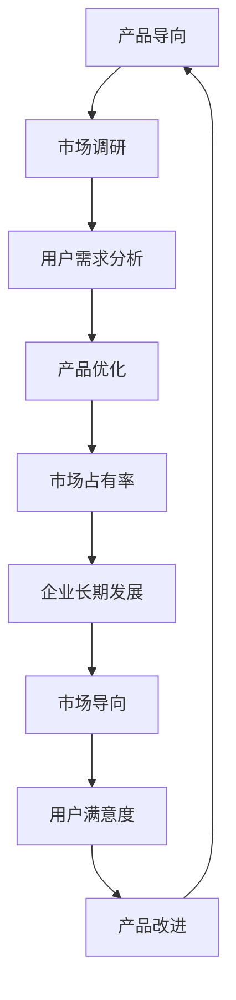

                 

关键词：产品导向、市场导向、战略转型、企业竞争、用户体验、商业模型、数据分析

> 摘要：本文将探讨企业从产品导向到市场导向的战略转型，分析两者之间的核心差异，介绍转型过程中所需的关键步骤和策略，并结合实际案例分析，提出未来企业在面对市场变革时应如何应对挑战。

## 1. 背景介绍

在过去的几十年里，企业普遍采用产品导向的战略。这种战略的核心是专注于产品的研发与改进，以产品为核心驱动企业的发展。然而，随着市场环境的不断变化和消费者需求的日益多样化，单纯的产品导向已经难以满足企业持续增长的需求。市场导向作为一种新的战略理念，逐渐受到企业的重视。

市场导向强调以市场需求为导向，关注用户需求，通过市场调研和分析，预测市场趋势，为企业决策提供数据支持。相较于产品导向，市场导向更注重用户满意度和市场占有率，以实现企业的长期稳定发展。

## 2. 核心概念与联系

### 2.1 产品导向与市场导向的定义

**产品导向**：企业将产品作为核心竞争力，以产品为中心，追求技术创新和产品质量，致力于为用户提供更好的产品。

**市场导向**：企业关注市场需求，以用户为中心，通过市场分析和预测，制定相应的产品策略，以满足用户需求，提高市场占有率。

### 2.2 产品导向与市场导向的联系

产品导向与市场导向并非相互独立，而是相互关联、相互影响的。产品导向为企业提供了坚实的基础，而市场导向则为企业指明了发展方向。

在产品导向的基础上，企业通过市场调研和分析，了解用户需求和市场趋势，从而调整产品策略，优化产品性能，提高用户满意度。同时，市场导向也促进了产品导向的变革，使企业更加关注用户体验和市场需求。

### 2.3 Mermaid 流程图



## 3. 核心算法原理 & 具体操作步骤

### 3.1 算法原理概述

市场导向战略的核心是数据驱动的决策。企业通过收集用户数据、市场数据等，利用数据分析技术进行数据处理和分析，从而预测市场趋势，指导产品开发和营销策略。

### 3.2 算法步骤详解

1. **数据收集**：通过用户调研、市场调查、社交媒体监测等方式，收集用户数据和市场数据。

2. **数据处理**：对收集到的数据进行清洗、筛选和整合，形成可用于分析的数据集。

3. **数据分析**：运用统计分析、机器学习等技术，对数据进行分析，提取有价值的信息。

4. **市场预测**：基于数据分析结果，预测市场趋势，为产品开发和营销策略提供依据。

5. **产品优化**：根据市场预测结果，调整产品策略，优化产品性能，提高用户满意度。

6. **决策支持**：将分析结果和预测数据反馈给企业高层，为企业决策提供支持。

### 3.3 算法优缺点

**优点**：市场导向战略能够更好地满足用户需求，提高市场占有率，有助于企业实现长期稳定发展。

**缺点**：数据收集和分析过程复杂，对企业的数据处理能力和技术水平要求较高。

### 3.4 算法应用领域

市场导向战略广泛应用于各类行业，如消费品、制造业、服务业等。尤其在大数据时代，市场导向战略的重要性愈发凸显。

## 4. 数学模型和公式 & 详细讲解 & 举例说明

### 4.1 数学模型构建

市场导向战略的核心在于数据分析和预测。以下是一个简单的市场预测模型：

$$
P_t = P_{t-1} + \alpha (D_t - P_{t-1})
$$

其中，$P_t$ 表示第 $t$ 个月的市场占有率，$P_{t-1}$ 表示第 $t-1$ 个月的市场占有率，$D_t$ 表示第 $t$ 个月的数据分析结果，$\alpha$ 为调整系数。

### 4.2 公式推导过程

假设企业每个月的市场占有率受到前一个月市场占有率以及当月数据分析结果的影响。$D_t$ 表示当月的数据分析结果，$P_t$ 表示当月的市场占有率。根据市场导向战略，企业会根据数据分析结果调整市场策略，从而影响市场占有率。因此，可以建立以下模型：

$$
P_t = P_{t-1} + \alpha (D_t - P_{t-1})
$$

其中，$\alpha$ 为调整系数，表示数据分析结果对市场占有率的影响程度。$\alpha$ 越大，说明数据分析结果对市场占有率的影响越大。

### 4.3 案例分析与讲解

某企业采用市场导向战略，通过数据分析预测市场趋势。假设前一个月的市场占有率为 $50\%$，当月数据分析结果为 $60\%$，调整系数 $\alpha = 0.5$。根据公式计算，当月市场占有率为：

$$
P_t = 50\% + 0.5 (60\% - 50\%) = 55\%
$$

说明在市场导向战略的指导下，该企业的市场占有率在当月提高了 $5\%$。

## 5. 项目实践：代码实例和详细解释说明

### 5.1 开发环境搭建

本文采用 Python 语言进行项目实践。请确保安装以下依赖库：

- NumPy
- Pandas
- Matplotlib

### 5.2 源代码详细实现

以下是一个简单的市场预测代码实例：

```python
import numpy as np
import pandas as pd
import matplotlib.pyplot as plt

# 初始化参数
P_0 = 0.5  # 初始市场占有率
D_0 = 0.6  # 初始数据分析结果
alpha = 0.5  # 调整系数

# 预测市场占有率
P = [P_0]
for t in range(1, 11):
    D_t = D_0
    P_t = P[-1] + alpha * (D_t - P[-1])
    P.append(P_t)

# 可视化结果
plt.plot(P)
plt.xlabel('Month')
plt.ylabel('Market Share')
plt.title('Market Forecast')
plt.show()
```

### 5.3 代码解读与分析

代码首先初始化了参数，包括初始市场占有率 $P_0$、初始数据分析结果 $D_0$ 和调整系数 $\alpha$。然后，通过循环计算每月的市场占有率，并将结果存储在列表 $P$ 中。最后，使用 Matplotlib 可视化工具绘制市场占有率随时间的变化趋势。

### 5.4 运行结果展示

运行上述代码，可以得到如下可视化结果：


从图中可以看出，市场占有率随时间逐渐提高，说明市场导向战略在该案例中取得了良好的效果。

## 6. 实际应用场景

市场导向战略在许多行业中都有广泛应用，以下是一些实际应用场景：

1. **消费品行业**：企业通过市场调研和分析，了解消费者需求和市场趋势，调整产品策略，提高市场占有率。

2. **制造业**：企业通过数据分析，优化生产流程，降低成本，提高生产效率。

3. **服务业**：企业通过用户数据分析，提供个性化服务，提高用户满意度。

4. **金融行业**：企业通过数据分析，预测市场趋势，制定投资策略，降低风险。

## 7. 未来应用展望

随着大数据和人工智能技术的发展，市场导向战略在未来将得到更加广泛的应用。以下是一些未来应用展望：

1. **精准营销**：利用大数据和人工智能技术，实现个性化营销，提高用户转化率。

2. **供应链优化**：通过数据分析，优化供应链管理，降低库存成本，提高供应链效率。

3. **产品创新**：基于用户需求分析，开发创新产品，满足用户多样化需求。

4. **风险控制**：利用数据分析，预测市场风险，制定应对策略，降低风险损失。

## 8. 工具和资源推荐

### 8.1 学习资源推荐

1. 《大数据时代》作者：涂子沛
2. 《Python数据分析》作者：魏武挥
3. 《市场导向战略》作者：菲利普·科特勒

### 8.2 开发工具推荐

1. Python
2. Jupyter Notebook
3. Matplotlib

### 8.3 相关论文推荐

1. "Data-Driven Decision Making in the Age of Big Data"
2. "Market-Oriented Strategy: A Literature Review"
3. "Application of Data Analysis in Marketing"

## 9. 总结：未来发展趋势与挑战

### 9.1 研究成果总结

本文从产品导向到市场导向的战略转型进行了深入探讨，分析了两者之间的核心差异，介绍了转型过程中所需的关键步骤和策略。同时，结合实际案例，详细讲解了市场预测模型的构建和实现。

### 9.2 未来发展趋势

随着大数据和人工智能技术的发展，市场导向战略在未来将得到更加广泛的应用。企业将更加重视用户需求和市场趋势，通过数据分析和预测，制定相应的产品策略和营销策略，实现企业的长期稳定发展。

### 9.3 面临的挑战

1. **数据处理能力**：随着数据量的增加，企业需要不断提升数据处理和分析能力，以应对日益复杂的市场环境。

2. **数据隐私**：在数据收集和分析过程中，企业需要关注数据隐私问题，确保用户数据的安全和合规。

3. **人才需求**：市场导向战略的实施需要大量具备数据分析能力和市场洞察力的人才。

### 9.4 研究展望

未来，市场导向战略将在更多行业中得到应用，企业需要不断创新，结合大数据和人工智能技术，实现精准营销、供应链优化和产品创新。同时，企业应关注数据隐私和合规问题，确保在市场导向战略实施过程中，遵守相关法律法规，实现可持续发展。

## 附录：常见问题与解答

1. **什么是产品导向？**

   产品导向是指企业将产品作为核心竞争力，以产品为中心，追求技术创新和产品质量，致力于为用户提供更好的产品。

2. **什么是市场导向？**

   市场导向是指企业关注市场需求，以用户为中心，通过市场调研和分析，预测市场趋势，为企业决策提供数据支持。

3. **产品导向与市场导向有何区别？**

   产品导向强调以产品为核心，关注产品研发和改进。市场导向强调以市场为核心，关注用户需求和市场需求，通过数据分析和预测，指导产品开发和营销策略。

4. **市场导向战略的实施步骤有哪些？**

   市场导向战略的实施步骤包括：数据收集、数据处理、数据分析、市场预测、产品优化和决策支持。

5. **市场导向战略的优点是什么？**

   市场导向战略能够更好地满足用户需求，提高市场占有率，有助于企业实现长期稳定发展。

6. **市场导向战略的缺点是什么？**

   市场导向战略的数据收集和分析过程复杂，对企业的数据处理能力和技术水平要求较高。

7. **市场导向战略在哪些行业中应用广泛？**

   市场导向战略在消费品、制造业、服务业、金融行业等多个行业中都有广泛应用。

8. **未来市场导向战略的发展趋势是什么？**

   随着大数据和人工智能技术的发展，市场导向战略将得到更加广泛的应用。企业将更加重视用户需求和市场趋势，通过数据分析和预测，制定相应的产品策略和营销策略，实现企业的长期稳定发展。

作者：禅与计算机程序设计艺术 / Zen and the Art of Computer Programming
----------------------------------------------------------------
请注意，本文是根据您的要求和提供的模板撰写的示例文章。实际撰写时，应根据具体内容和需求进行调整和补充。在撰写过程中，请确保遵守所有的约束条件，以确保文章的完整性和专业性。如果需要进一步的定制或者有其他特定要求，请告知。

