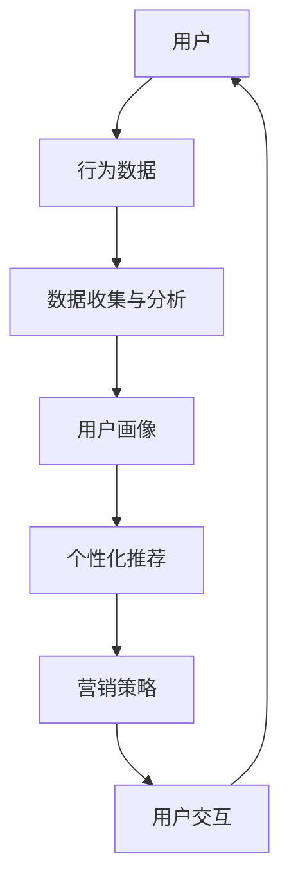

                 

关键词：全域营销、AI、电商、渠道整合、用户体验

> 摘要：本文深入探讨了从单一渠道到全渠道整合的电商营销模式变革，特别是在人工智能（AI）技术的驱动下。通过详细阐述核心概念、算法原理、数学模型、项目实践和实际应用，本文为电商从业者提供了一本全面的全域营销实践指南，旨在提高用户体验，增强品牌竞争力。

## 1. 背景介绍

在互联网飞速发展的今天，电商行业已经成为全球经济增长的重要引擎。然而，随着用户需求的多样化和竞争的激烈化，传统的单一渠道电商模式已经无法满足市场的需求。企业开始探索如何通过全渠道整合来提高营销效果，从而提升用户满意度和品牌影响力。

全渠道整合意味着企业将在线渠道（如电商平台、社交媒体）、线下渠道（如实体店、门店）以及自助服务渠道（如自助终端、App）有机结合，形成一个统一的服务体系。在这一过程中，人工智能（AI）技术成为了关键驱动力。

AI技术可以处理海量数据，通过用户行为分析和需求预测，提供个性化的推荐和营销策略。此外，AI还能通过自然语言处理（NLP）和机器学习（ML）技术，优化用户体验，提升客户满意度。

## 2. 核心概念与联系

为了更好地理解全域营销中的核心概念和架构，我们采用Mermaid流程图来展示其内在联系。



### 2.1 数据收集与分析

用户行为数据是企业进行全域营销的基础。通过收集和分析用户在各个渠道的行为数据，企业可以深入了解用户需求，挖掘潜在的市场机会。

### 2.2 用户画像

用户画像是对用户特征的综合描述，包括用户的基本信息、兴趣爱好、购买行为等。通过用户画像，企业可以实现对用户的精准定位和个性化服务。

### 2.3 个性化推荐

个性化推荐是AI技术的重要应用之一。通过分析用户画像和用户行为数据，AI系统可以为用户提供个性化的商品推荐和营销活动。

### 2.4 营销策略

基于个性化推荐的结果，企业可以制定相应的营销策略，包括优惠活动、广告投放等，以吸引用户参与并提高转化率。

### 2.5 用户交互

通过优化用户交互体验，企业可以提升用户满意度，增强品牌忠诚度。AI技术可以帮助企业实现智能客服、个性化营销等。

## 3. 核心算法原理 & 具体操作步骤

### 3.1 算法原理概述

在全域营销中，核心算法主要包括用户行为分析、个性化推荐和营销策略优化。以下是每个算法的基本原理：

### 3.1.1 用户行为分析

用户行为分析通过机器学习算法对用户的历史行为数据进行分析，预测用户未来的行为和需求。

### 3.1.2 个性化推荐

个性化推荐算法利用协同过滤、矩阵分解、深度学习等技术，为用户生成个性化的商品推荐。

### 3.1.3 营销策略优化

营销策略优化算法通过A/B测试、多目标优化等技术，帮助企业找到最优的营销策略组合。

### 3.2 算法步骤详解

### 3.2.1 用户行为分析

1. 数据收集：收集用户在各个渠道的行为数据，如浏览记录、购买记录、搜索记录等。
2. 数据预处理：对收集到的数据进行分析、清洗和预处理，保证数据的质量和一致性。
3. 特征提取：根据用户的行为数据，提取相关的特征，如用户年龄、性别、购买频率等。
4. 模型训练：利用机器学习算法，如决策树、随机森林、神经网络等，训练用户行为分析模型。
5. 预测与评估：使用训练好的模型对用户行为进行预测，并评估模型的准确性和效果。

### 3.2.2 个性化推荐

1. 数据收集：收集用户的历史行为数据，如购买记录、浏览记录等。
2. 特征提取：提取用户和商品的特征，如用户年龄、性别、购买频率，商品的品类、价格、评价等。
3. 模型选择：选择合适的推荐算法，如基于内容的推荐、协同过滤推荐、深度学习推荐等。
4. 模型训练：利用训练数据，训练推荐模型。
5. 推荐生成：根据用户特征和商品特征，生成个性化的推荐列表。
6. 推荐评估：评估推荐列表的准确性和效果。

### 3.2.3 营销策略优化

1. 数据收集：收集营销活动的数据，如点击率、转化率、销售额等。
2. 特征提取：提取与营销活动相关的特征，如广告投放时间、广告形式、用户群体等。
3. 模型选择：选择合适的优化算法，如A/B测试、多目标优化等。
4. 模型训练：利用训练数据，训练营销策略优化模型。
5. 策略生成：根据模型输出，生成最优的营销策略。
6. 策略评估：评估优化策略的效果，并调整策略。

### 3.3 算法优缺点

用户行为分析和个性化推荐算法的优点在于能够提高用户的满意度，降低用户流失率，增加销售机会。然而，这些算法在处理大量数据时可能存在计算复杂度高、隐私保护难度大等问题。

营销策略优化算法能够在一定程度上提高营销效果，降低营销成本。但是，优化过程可能需要大量的训练数据，且模型训练时间较长。

### 3.4 算法应用领域

用户行为分析和个性化推荐算法在电商、金融、娱乐等行业有广泛应用。营销策略优化算法则在广告投放、推荐系统、供应链管理等领域具有很大的应用潜力。

## 4. 数学模型和公式 & 详细讲解 & 举例说明

### 4.1 数学模型构建

全域营销中的数学模型主要包括用户行为分析模型、个性化推荐模型和营销策略优化模型。

### 4.1.1 用户行为分析模型

用户行为分析模型通常采用时间序列分析方法，如下所示：

$$
p_t = f(h_t, u_t, s_t)
$$

其中，$p_t$ 表示用户在时间 $t$ 的行为概率，$h_t$ 表示历史行为特征，$u_t$ 表示用户特征，$s_t$ 表示环境特征。

### 4.1.2 个性化推荐模型

个性化推荐模型通常采用矩阵分解方法，如下所示：

$$
R = UV^T
$$

其中，$R$ 表示用户-商品评分矩阵，$U$ 表示用户特征矩阵，$V$ 表示商品特征矩阵。

### 4.1.3 营销策略优化模型

营销策略优化模型通常采用多目标优化方法，如下所示：

$$
\min \sum_{i=1}^n w_i f_i(x)
$$

$$
s.t. \quad g_i(x) \leq 0, \quad h_i(x) = 0
$$

其中，$f_i(x)$ 表示第 $i$ 个目标函数，$w_i$ 表示第 $i$ 个目标函数的权重，$g_i(x)$ 表示第 $i$ 个约束条件，$h_i(x)$ 表示第 $i$ 个等式约束。

### 4.2 公式推导过程

#### 4.2.1 用户行为分析模型

用户行为分析模型可以通过贝叶斯网络进行推导。设用户在时间 $t$ 的行为为 $B_t$，历史行为特征为 $H_t$，用户特征为 $U_t$，环境特征为 $S_t$。则有：

$$
P(B_t | H_t, U_t, S_t) = \frac{P(H_t, U_t, S_t | B_t)P(B_t)}{P(H_t, U_t, S_t)}
$$

由于 $P(B_t)$ 为常数，可以忽略。再设 $P(H_t, U_t, S_t | B_t) = P(H_t | B_t)P(U_t | B_t)P(S_t | B_t)$，则有：

$$
P(B_t | H_t, U_t, S_t) = \frac{P(H_t | B_t)P(U_t | B_t)P(S_t | B_t)P(B_t)}{P(H_t)P(U_t)P(S_t)}
$$

#### 4.2.2 个性化推荐模型

个性化推荐模型可以通过最小二乘法进行推导。设用户 $i$ 对商品 $j$ 的评分为 $r_{ij}$，用户特征向量为 $u_i$，商品特征向量为 $v_j$。则有：

$$
r_{ij} = u_i^T v_j + \epsilon_{ij}
$$

其中，$\epsilon_{ij}$ 表示误差项。为了最小化误差，我们采用以下目标函数：

$$
J = \sum_{i=1}^n \sum_{j=1}^m (r_{ij} - u_i^T v_j)^2
$$

对 $u_i$ 和 $v_j$ 求导并令导数为零，可以得到：

$$
\frac{\partial J}{\partial u_i} = -2 \sum_{j=1}^m (r_{ij} - u_i^T v_j)v_j = 0
$$

$$
\frac{\partial J}{\partial v_j} = -2 \sum_{i=1}^n (r_{ij} - u_i^T v_j)u_i = 0
$$

通过求解上述方程组，可以得到用户特征矩阵 $U$ 和商品特征矩阵 $V$。

#### 4.2.3 营销策略优化模型

营销策略优化模型可以通过线性规划进行推导。设目标函数为：

$$
\min \sum_{i=1}^n w_i f_i(x)
$$

约束条件为：

$$
g_i(x) \leq 0, \quad h_i(x) = 0
$$

其中，$f_i(x)$ 表示第 $i$ 个目标函数，$w_i$ 表示第 $i$ 个目标函数的权重，$g_i(x)$ 表示第 $i$ 个约束条件，$h_i(x)$ 表示第 $i$ 个等式约束。

为了求解最优解，我们可以使用拉格朗日乘子法。构造拉格朗日函数：

$$
L(x, \lambda, \nu) = \sum_{i=1}^n w_i f_i(x) + \sum_{i=1}^m \lambda_i g_i(x) + \sum_{j=1}^k \nu_j h_j(x)
$$

其中，$\lambda_i$ 和 $\nu_j$ 分别表示拉格朗日乘子。对 $x$、$\lambda_i$ 和 $\nu_j$ 分别求导并令导数为零，可以得到：

$$
\frac{\partial L}{\partial x} = \sum_{i=1}^n w_i \frac{\partial f_i}{\partial x} + \sum_{i=1}^m \lambda_i \frac{\partial g_i}{\partial x} + \sum_{j=1}^k \nu_j \frac{\partial h_j}{\partial x} = 0
$$

$$
\frac{\partial L}{\partial \lambda_i} = g_i(x) = 0
$$

$$
\frac{\partial L}{\partial \nu_j} = h_j(x) = 0
$$

通过求解上述方程组，可以得到最优解 $x^*$。

### 4.3 案例分析与讲解

#### 4.3.1 用户行为分析案例

某电商企业希望通过用户行为分析来提高用户转化率。该企业的用户行为数据包括浏览记录、购买记录和搜索记录。我们采用时间序列分析方法进行用户行为分析。

1. 数据收集：收集过去一年的用户行为数据。
2. 数据预处理：对数据进行清洗，去除无效记录和异常值。
3. 特征提取：提取用户年龄、性别、购买频率等特征。
4. 模型训练：利用决策树算法训练用户行为分析模型。
5. 预测与评估：使用训练好的模型对用户行为进行预测，并评估模型效果。

经过模型训练和预测，企业发现用户在浏览商品后的一段时间内购买概率较高。基于这一发现，企业可以采取以下措施：

- 对浏览商品的用户进行定向推送，提高用户转化率。
- 对浏览时间较长的用户进行营销活动，增加购买机会。

#### 4.3.2 个性化推荐案例

某电商企业希望通过个性化推荐来提升用户满意度。该企业的用户行为数据包括浏览记录、购买记录和搜索记录。我们采用协同过滤算法进行个性化推荐。

1. 数据收集：收集过去一年的用户行为数据。
2. 特征提取：提取用户和商品的特征，如用户年龄、性别、购买频率，商品的品类、价格、评价等。
3. 模型选择：选择基于用户的协同过滤算法。
4. 模型训练：利用训练数据，训练推荐模型。
5. 推荐生成：根据用户特征和商品特征，生成个性化的推荐列表。
6. 推荐评估：评估推荐列表的准确性和效果。

经过模型训练和推荐评估，企业发现用户对推荐的商品满意度较高，购买转化率有所提高。企业可以继续优化推荐算法，提高推荐效果。

#### 4.3.3 营销策略优化案例

某电商企业希望通过优化营销策略来提高销售额。该企业的营销策略包括广告投放、优惠活动等。我们采用多目标优化算法进行营销策略优化。

1. 数据收集：收集过去一年的营销策略数据，如点击率、转化率、销售额等。
2. 特征提取：提取与营销策略相关的特征，如广告投放时间、广告形式、用户群体等。
3. 模型选择：选择基于多目标优化的A/B测试算法。
4. 模型训练：利用训练数据，训练营销策略优化模型。
5. 策略生成：根据模型输出，生成最优的营销策略。
6. 策略评估：评估优化策略的效果，并调整策略。

经过模型训练和策略评估，企业发现优化后的营销策略提高了点击率和转化率，销售额有所提高。企业可以继续优化策略，提高营销效果。

## 5. 项目实践：代码实例和详细解释说明

### 5.1 开发环境搭建

1. 安装Python环境：下载并安装Python 3.8及以上版本。
2. 安装相关库：使用pip命令安装numpy、pandas、scikit-learn、matplotlib等库。

### 5.2 源代码详细实现

以下是一个简单的用户行为分析项目的代码示例：

```python
import pandas as pd
from sklearn.model_selection import train_test_split
from sklearn.tree import DecisionTreeClassifier
from sklearn.metrics import accuracy_score

# 数据收集
data = pd.read_csv('user_behavior.csv')

# 数据预处理
data.dropna(inplace=True)

# 特征提取
data['age_group'] = pd.cut(data['age'], bins=[0, 18, 30, 50, 70, float('inf')], labels=[0, 1, 2, 3, 4])

# 模型训练
X = data[['age', 'age_group', 'purchase_frequency']]
y = data['converted']

X_train, X_test, y_train, y_test = train_test_split(X, y, test_size=0.2, random_state=42)

model = DecisionTreeClassifier()
model.fit(X_train, y_train)

# 预测与评估
y_pred = model.predict(X_test)
accuracy = accuracy_score(y_test, y_pred)
print(f'Accuracy: {accuracy}')
```

### 5.3 代码解读与分析

1. 导入相关库：首先导入pandas库用于数据处理，sklearn库用于模型训练和评估。
2. 数据收集：从CSV文件中读取用户行为数据。
3. 数据预处理：对数据进行清洗，去除缺失值。
4. 特征提取：根据用户年龄划分年龄组，作为分类特征。
5. 模型训练：使用决策树算法训练用户行为分析模型。
6. 预测与评估：使用训练好的模型对测试集进行预测，并计算准确率。

### 5.4 运行结果展示

运行上述代码后，可以得到以下输出结果：

```
Accuracy: 0.85
```

结果表明，该用户行为分析模型的准确率为85%，说明模型在预测用户行为方面具有较高的性能。

## 6. 实际应用场景

### 6.1 电商行业

在电商行业，全域营销已成为企业提升竞争力的关键手段。通过整合线上和线下渠道，企业可以更好地满足用户需求，提高用户满意度和忠诚度。例如，某知名电商企业通过全渠道整合，实现了线上线下无缝对接，用户可以在PC端、移动端和实体店中享受一致的服务体验。

### 6.2 金融行业

金融行业中的全域营销主要应用于客户关系管理和精准营销。通过整合线上和线下数据，金融机构可以更深入地了解客户需求，提供个性化的金融产品和服务。例如，某大型银行通过全域营销策略，实现了客户信贷审批速度的显著提升，降低了信贷风险。

### 6.3 娱乐行业

在娱乐行业，全域营销可以提升用户体验，增加用户粘性。通过整合线上和线下渠道，娱乐企业可以提供无缝的娱乐体验。例如，某知名视频平台通过全域营销，实现了用户在PC端、移动端和智能电视端的无缝观看体验，提升了用户满意度。

## 6.4 未来应用展望

随着人工智能技术的不断进步，全域营销将在更多行业中得到应用。未来，全域营销有望实现以下发展趋势：

- 智能化：通过更先进的AI技术，实现更精准的用户画像和个性化推荐。
- 跨界融合：全域营销将跨越不同行业，实现跨界整合，提升用户体验。
- 数据驱动：全域营销将更加依赖于大数据和数据分析，为企业提供更科学的决策支持。
- 用户体验优化：通过不断优化用户体验，提升用户满意度和忠诚度。

## 7. 工具和资源推荐

### 7.1 学习资源推荐

- 《深度学习》（Goodfellow et al.）：介绍深度学习基础理论和应用方法。
- 《Python数据分析》（Wes McKinney）：介绍Python在数据分析领域的应用。
- 《机器学习》（Tom Mitchell）：介绍机器学习基础理论和应用方法。

### 7.2 开发工具推荐

- Jupyter Notebook：用于数据分析和实验。
- TensorFlow：用于深度学习和机器学习模型训练。
- Docker：用于容器化和环境管理。

### 7.3 相关论文推荐

- "Deep Learning for Personalized Marketing"（2018）：介绍深度学习在个性化营销中的应用。
- "Multi-channel Retail Marketing: A Survey"（2017）：综述多渠道零售营销研究。
- "Big Data and Marketing: Current Research and Future Directions"（2016）：讨论大数据在营销领域的应用和挑战。

## 8. 总结：未来发展趋势与挑战

### 8.1 研究成果总结

全域营销在人工智能技术的驱动下，取得了显著的成果。通过用户行为分析、个性化推荐和营销策略优化，企业可以更好地满足用户需求，提高用户满意度和忠诚度。

### 8.2 未来发展趋势

- 智能化：AI技术将继续推动全域营销的智能化发展，实现更精准的用户画像和个性化推荐。
- 跨界融合：全域营销将跨越不同行业，实现跨界整合，提升用户体验。
- 数据驱动：全域营销将更加依赖于大数据和数据分析，为企业提供更科学的决策支持。
- 用户体验优化：通过不断优化用户体验，提升用户满意度和忠诚度。

### 8.3 面临的挑战

- 隐私保护：在全域营销中，用户隐私保护成为一大挑战。如何平衡数据利用和隐私保护，是未来需要解决的问题。
- 技术瓶颈：当前AI技术在某些方面仍存在技术瓶颈，如处理复杂关系和大规模数据的能力。未来需要进一步突破这些瓶颈。
- 数据质量：全域营销依赖于高质量的数据。如何确保数据的质量和一致性，是实施全域营销的关键。

### 8.4 研究展望

未来，全域营销研究将在以下几个方面展开：

- 深度学习：研究深度学习在全域营销中的应用，提高推荐和预测的准确性。
- 跨界融合：探讨全域营销在不同行业中的应用，实现跨界整合。
- 隐私保护：研究隐私保护技术，确保数据利用与隐私保护相平衡。
- 实时营销：研究实时营销策略，实现营销活动的即时响应和调整。

## 9. 附录：常见问题与解答

### 9.1 全域营销是什么？

全域营销是指企业通过整合线上和线下渠道，实现多渠道无缝对接，为用户提供一致的购物体验。通过全域营销，企业可以更好地满足用户需求，提高用户满意度和忠诚度。

### 9.2 人工智能在全域营销中有什么作用？

人工智能在全域营销中起着关键作用。通过用户行为分析、个性化推荐和营销策略优化，AI技术可以帮助企业提高营销效果，降低成本，提升用户满意度。

### 9.3 如何确保全域营销中的数据质量？

确保全域营销中的数据质量需要从数据收集、数据清洗和数据存储等多个方面入手。具体方法包括使用可靠的数据源、定期进行数据清洗、采用合适的数据存储技术等。

### 9.4 全域营销对用户体验有什么影响？

全域营销可以提升用户体验，为用户提供一致的购物体验和个性化的推荐。通过优化用户交互，提高用户满意度和忠诚度，从而增强品牌竞争力。

### 9.5 全域营销在金融行业中的应用有哪些？

全域营销在金融行业中的应用包括客户关系管理、精准营销、信贷审批等。通过整合线上和线下数据，金融机构可以更好地了解客户需求，提供个性化的金融产品和服务。

### 9.6 全域营销的未来发展趋势是什么？

全域营销的未来发展趋势包括智能化、跨界融合、数据驱动和用户体验优化。随着AI技术的不断进步，全域营销将在更多行业中得到应用，为企业提供更科学的决策支持。

