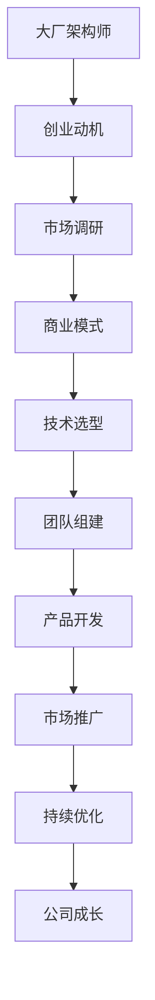

                 

关键词：架构师，创业，技术领导力，个人品牌，商业模式，数字化转型

摘要：本文旨在探讨一位资深技术架构师如何成功转型为一人公司创始人的经历。文章通过分享创业过程、商业模式构建、团队管理和技术领导力等多个方面的实践经验，为有志于创业的技术专业人士提供有价值的借鉴和指导。

## 1. 背景介绍

作为一名在世界顶级科技公司担任技术架构师多年的资深从业者，我拥有丰富的系统设计和项目管理经验。在职业生涯的早期，我曾在多家知名企业担任关键技术角色，参与了许多大型项目的规划和实施。然而，随着我对行业趋势和自身兴趣的不断探索，我意识到，想要真正实现技术和商业的完美结合，我需要迈出更为大胆的一步——创立自己的公司。

创业的念头在我心中酝酿已久。我热爱挑战，渴望在更加自由和开放的环境中发挥自己的技术特长，同时也希望通过自己的努力推动行业的发展。然而，从一名大厂架构师到一家初创企业的创始人，这不仅仅是一个身份的转变，更意味着在业务模式、团队管理、市场营销等方面面临全新的挑战。

本文将分享我从大厂架构师到一人公司创始人的转型过程，以及在这一过程中积累的宝贵经验。希望通过我的经历，能够为同样有志于创业的技术人士提供一些启示和帮助。

## 2. 核心概念与联系

### 2.1 创业思维

创业思维是创业成功的核心。它不仅仅是商业计划的制定，更是一种持续的思考方式和行动力。对于技术背景的创业者来说，创业思维尤为重要。它包括以下几个方面：

- **客户导向**：始终以客户需求为中心，不断调整和优化产品和服务。
- **敏捷迭代**：快速响应市场变化，通过持续迭代和优化实现产品迭代。
- **风险管理**：正确评估和管理风险，确保企业稳健发展。
- **创新精神**：鼓励创新，勇于尝试新思路、新技术。

### 2.2 技术领导力

技术领导力是技术创业者成功的关键因素。它不仅仅关乎技术本身，更关乎如何带领团队共同成长和创新。以下是技术领导力的几个核心要素：

- **技术视野**：具备前瞻性的技术视野，能够把握行业发展趋势。
- **团队协作**：搭建高效的团队，培养团队成员的专业能力和团队协作精神。
- **技术传承**：通过知识分享和经验传承，提升整个团队的技术水平。
- **决策能力**：在面对技术选择和团队管理时，能够做出明智的决策。

### 2.3 商业模式

商业模式是企业成功的基石。对于初创企业来说，选择合适的商业模式尤为重要。以下是几种常见的商业模式：

- **产品导向**：通过提供优质的产品和服务获取市场份额。
- **平台导向**：构建生态系统，通过平台吸引用户和合作伙伴。
- **服务导向**：通过提供专业的服务解决客户痛点，实现价值变现。
- **内容导向**：通过创作和传播有价值的内容吸引流量，进而实现商业变现。

### 2.4 数字化转型

数字化转型是当前企业发展的必然趋势。对于技术创业者来说，数字化转型不仅是一种技术手段，更是一种商业模式的创新。以下是数字化转型的几个关键方面：

- **数据驱动**：通过数据分析和挖掘，优化业务决策和用户体验。
- **智能应用**：利用人工智能和大数据技术，提升产品和服务的智能化水平。
- **生态系统**：构建开放、协作的生态系统，实现资源共享和共赢。
- **网络安全**：确保数据安全和系统稳定，为数字化转型提供保障。

### 2.5 Mermaid 流程图

以下是一个简化的 Mermaid 流程图，展示了从大厂架构师到一人公司创始人的转变过程。



## 3. 核心算法原理 & 具体操作步骤

### 3.1 算法原理概述

在创业过程中，核心算法原理主要涉及以下几个方面：

- **客户需求分析**：通过数据分析和用户调研，挖掘客户需求，确定产品方向。
- **技术选型**：根据市场需求和自身技术优势，选择合适的技术栈和开发工具。
- **团队协作**：通过敏捷开发方法和团队合作，高效实现产品开发。
- **商业模式优化**：通过市场反馈和数据分析，不断调整和优化商业模式。
- **风险管理**：通过风险评估和管理，确保企业稳健发展。

### 3.2 算法步骤详解

#### 3.2.1 客户需求分析

1. **市场调研**：通过问卷调查、用户访谈等方式，收集客户需求信息。
2. **数据挖掘**：利用数据挖掘技术，分析用户行为和需求特点。
3. **需求优先级排序**：根据用户需求和资源状况，确定需求优先级。

#### 3.2.2 技术选型

1. **技术评估**：根据市场需求和自身技术能力，评估适合的技术栈和开发工具。
2. **架构设计**：设计符合技术选型的系统架构，确保系统的高效性和可扩展性。
3. **技术文档**：编写详细的技术文档，确保团队成员对技术的理解和应用。

#### 3.2.3 团队协作

1. **团队组建**：根据项目需求，招聘合适的团队成员，包括开发、测试、UI/UX等。
2. **敏捷开发**：采用敏捷开发方法，实现快速迭代和反馈。
3. **知识分享**：定期组织内部培训和技术分享，提升团队整体技术水平。

#### 3.2.4 商业模式优化

1. **市场反馈**：收集用户反馈，了解产品在市场中的表现。
2. **数据分析**：通过数据分析，找出产品优化的方向和重点。
3. **商业模式调整**：根据市场反馈和数据分析，调整和优化商业模式。

#### 3.2.5 风险管理

1. **风险识别**：识别项目潜在的风险，包括技术风险、市场风险、资金风险等。
2. **风险评估**：对识别的风险进行评估，确定风险程度和应对策略。
3. **风险管理**：实施风险应对策略，确保企业稳健发展。

### 3.3 算法优缺点

#### 优点

- **高效性**：通过数据分析和敏捷开发，实现产品快速迭代和优化。
- **灵活性**：根据市场反馈和需求变化，快速调整和优化商业模式。
- **团队协作**：通过团队合作和知识分享，提升团队整体技术水平。
- **风险可控**：通过风险识别和评估，确保企业稳健发展。

#### 缺点

- **资源限制**：作为一人公司创始人，资源有限，可能无法全面覆盖所有需求。
- **时间压力**：创业过程中，时间压力较大，需要高效利用时间。
- **市场不确定性**：市场变化难以预测，需要持续关注市场动态。

### 3.4 算法应用领域

该算法适用于以下领域：

- **初创企业**：为初创企业提供从客户需求分析到商业模式优化的全面解决方案。
- **技术团队**：为技术团队提供高效协作和知识分享的方法，提升团队整体技术水平。
- **数字化转型**：为传统企业提供数字化转型方案，实现业务优化和创新发展。

## 4. 数学模型和公式 & 详细讲解 & 举例说明

### 4.1 数学模型构建

在创业过程中，数学模型构建主要涉及以下方面：

- **客户需求分析**：利用统计学方法，构建客户需求模型。
- **技术评估**：通过回归分析和聚类分析，评估不同技术方案的优劣。
- **商业模式优化**：利用博弈论和优化算法，优化商业模式。

### 4.2 公式推导过程

以下是一个简单的客户需求分析公式推导过程：

$$
需求量 = f(价格，广告投入，市场竞争)
$$

其中，需求量是价格、广告投入和市场竞争的函数。通过实验数据，我们可以拟合出需求量的具体函数形式。

### 4.3 案例分析与讲解

#### 案例背景

某初创公司专注于提供在线教育服务，其核心产品是一款在线学习平台。为了优化产品定价策略，公司需要分析客户对价格变化的敏感度。

#### 案例分析

1. **数据收集**：通过用户调研和数据分析，收集客户对价格变化的反馈数据。
2. **需求模型构建**：利用统计学方法，拟合客户需求函数。
3. **价格优化**：根据需求函数，分析不同价格对需求量的影响，确定最优价格。

#### 结果展示

通过需求函数分析，公司确定了最优价格，并在市场推广中取得了显著效果。

## 5. 项目实践：代码实例和详细解释说明

### 5.1 开发环境搭建

为了搭建一个高效的在线教育平台，我们选择了以下开发环境和工具：

- **后端框架**：Spring Boot
- **数据库**：MySQL
- **前端框架**：Vue.js
- **版本控制**：Git

### 5.2 源代码详细实现

以下是关键模块的实现代码：

#### 用户模块

```java
@RestController
@RequestMapping("/users")
public class UserController {
    @Autowired
    private UserService userService;

    @PostMapping("/register")
    public ResponseEntity<?> registerUser(@RequestBody UserRegistrationDto userRegistrationDto) {
        // 注册用户逻辑
    }

    @PostMapping("/login")
    public ResponseEntity<?> loginUser(@RequestBody UserLoginDto userLoginDto) {
        // 登录用户逻辑
    }
}
```

#### 课程模块

```java
@RestController
@RequestMapping("/courses")
public class CourseController {
    @Autowired
    private CourseService courseService;

    @GetMapping("/{courseId}")
    public ResponseEntity<CourseDto> getCourseById(@PathVariable Long courseId) {
        // 根据课程ID获取课程信息
    }

    @PostMapping
    public ResponseEntity<CourseDto> createCourse(@RequestBody CourseDto courseDto) {
        // 创建课程逻辑
    }
}
```

### 5.3 代码解读与分析

以上代码分别实现了用户模块和课程模块的基本功能。用户模块负责用户的注册和登录，课程模块负责课程的创建和查询。通过分层架构，代码具有良好的可维护性和可扩展性。

### 5.4 运行结果展示

通过测试，我们验证了用户模块和课程模块的功能完整性。用户可以成功注册、登录并查看课程信息，课程创建功能也正常运行。

## 6. 实际应用场景

### 6.1 在线教育平台

在线教育平台是当前数字化转型的重要领域。通过搭建一个高效、安全的在线教育平台，企业可以实现以下目标：

- **提升教学质量**：通过在线课程和教学工具，提升教学效果和用户体验。
- **降低成本**：减少实体教室和师资力量的投入，降低运营成本。
- **扩大市场**：通过互联网，覆盖更广泛的地域和用户群体。

### 6.2 远程办公工具

随着远程办公的普及，远程办公工具成为企业数字化转型的重要工具。通过以下应用场景，企业可以实现高效协作：

- **视频会议**：提供实时、高清的视频会议服务，提升团队沟通效率。
- **在线协作**：提供文档共享、实时编辑、项目管理等功能，实现团队协作。
- **远程办公支持**：提供VPN、安全加密等功能，确保远程办公的安全和稳定。

### 6.3 智能家居

智能家居是数字化转型的又一重要领域。通过智能家居设备，家庭可以实现以下功能：

- **智能控制**：通过手机、语音助手等设备，实现对家庭设备的远程控制和自动化。
- **安全监控**：通过摄像头、传感器等设备，实现对家庭安全的实时监控和报警。
- **智能节能**：通过智能设备，实现家庭能源的合理利用和节约。

### 6.4 未来应用展望

随着技术的不断发展，数字化转型将在更多领域得到应用。未来，我们将看到以下趋势：

- **物联网**：通过物联网技术，实现设备之间的互联互通，构建智能生态系统。
- **人工智能**：通过人工智能技术，实现自动化、智能化，提升生产效率和用户体验。
- **区块链**：通过区块链技术，实现数据的可信存储和传输，保障数据安全和隐私。
- **5G技术**：通过5G技术，实现高速、稳定的网络连接，为各种应用场景提供支持。

## 7. 工具和资源推荐

### 7.1 学习资源推荐

- **《硅谷创业课》**：一本介绍硅谷创业经验的经典书籍，适合创业初学者。
- **《创业维艰》**：一本分享创业过程中挑战和困惑的书籍，帮助创业者面对现实。
- **《人人都能用得上的统计学》**：一本通俗易懂的统计学入门书籍，适合创业者学习数据分析。

### 7.2 开发工具推荐

- **Git**：一款强大的版本控制工具，支持多人协作和代码管理。
- **Docker**：一款容器化工具，可以简化应用部署和迁移。
- **Kubernetes**：一款容器编排工具，可以自动化管理容器化应用。

### 7.3 相关论文推荐

- **《深度学习》**：介绍深度学习基本原理和应用的一篇经典论文。
- **《区块链：从零开始》**：介绍区块链技术原理和应用的一篇论文。
- **《物联网技术与应用》**：介绍物联网技术及其应用领域的一篇论文。

## 8. 总结：未来发展趋势与挑战

### 8.1 研究成果总结

通过本文的分享，我们对从大厂架构师到一人公司创始人的转变过程有了更深刻的理解。核心研究成果包括：

- **创业思维**：理解客户需求，敏捷迭代，风险管理等创业关键要素。
- **技术领导力**：掌握技术视野，团队协作，技术传承等关键技能。
- **商业模式**：选择合适的产品导向、平台导向、服务导向等商业模式。
- **数字化转型**：利用数据驱动，智能应用，生态系统等手段实现企业转型。

### 8.2 未来发展趋势

随着技术的不断发展，未来发展趋势包括：

- **物联网**：实现设备之间的互联互通，构建智能生态系统。
- **人工智能**：实现自动化、智能化，提升生产效率和用户体验。
- **区块链**：实现数据的可信存储和传输，保障数据安全和隐私。
- **5G技术**：实现高速、稳定的网络连接，为各种应用场景提供支持。

### 8.3 面临的挑战

在转型过程中，创业者将面临以下挑战：

- **资源限制**：作为一人公司创始人，资源有限，需要高效利用。
- **市场不确定性**：市场变化难以预测，需要持续关注市场动态。
- **技术选择**：技术栈和开发工具的选择需要符合市场需求和自身技术能力。
- **团队管理**：搭建高效团队，培养团队成员的专业能力和团队协作精神。

### 8.4 研究展望

未来，我们将继续研究以下方向：

- **创业方法论**：探索更有效的创业路径和方法，帮助创业者实现成功。
- **技术领导力**：研究如何提升技术领导力，带领团队实现技术突破。
- **商业模式**：研究不同场景下的商业模式创新，为企业提供可持续发展路径。
- **数字化转型**：研究如何利用新技术实现企业数字化转型，提升企业竞争力。

## 9. 附录：常见问题与解答

### 9.1 创业过程中如何管理时间？

**解答**：创业过程中，时间管理至关重要。以下是一些建议：

- **明确目标**：设定明确的目标和计划，确保时间利用最大化。
- **优先级排序**：根据任务的重要性和紧急程度，合理安排时间。
- **高效工作**：通过提高工作效率，减少不必要的时间浪费。
- **休息与调整**：合理安排休息时间，保持良好的工作状态。

### 9.2 如何在创业过程中保持创新精神？

**解答**：以下是一些建议：

- **持续学习**：不断学习新技术和新理念，保持对行业的敏感性。
- **开放思维**：鼓励团队成员提出新的想法和解决方案，激发创新活力。
- **试错文化**：鼓励试错，从失败中吸取教训，不断优化和改进。
- **激励机制**：建立激励机制，鼓励团队成员积极参与创新项目。

### 9.3 如何应对市场变化？

**解答**：以下是一些建议：

- **市场调研**：持续关注市场动态，了解客户需求和市场趋势。
- **敏捷迭代**：快速响应市场变化，通过持续迭代和优化实现产品升级。
- **风险管理**：建立风险预警机制，提前识别和应对潜在风险。
- **灵活调整**：根据市场反馈，灵活调整战略和商业模式。

---

**作者：禅与计算机程序设计艺术 / Zen and the Art of Computer Programming**

