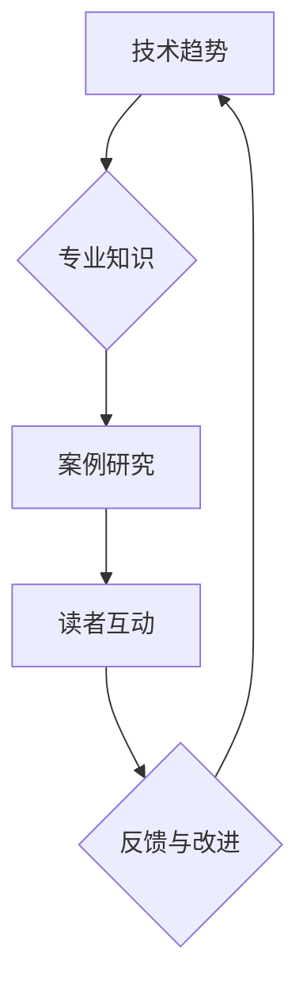
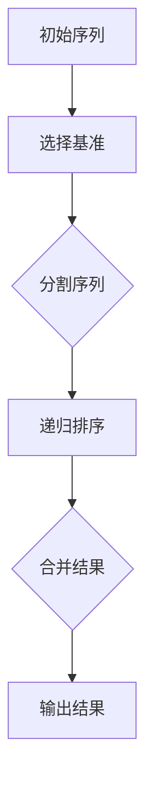

                 

关键词：技术博客，畅销技术书籍，写作技巧，内容策略，知识传播，专业表达，读者互动，影响力提升

摘要：本文旨在探讨从技术博客到畅销技术书籍的进阶之路。通过分析成功技术作家的写作策略、内容构建方法，以及如何利用博客平台来提升作品的影响力和市场价值，为技术作者提供一套实用的进阶指南。

## 1. 背景介绍

在信息技术飞速发展的时代，技术博客已成为知识传播的重要载体。技术博客不仅为开发者提供了交流和学习的机会，也成为了许多技术专家分享经验、展示专业能力的重要平台。然而，随着博客内容的不断积累，许多优秀的技术博主开始思考如何将个人的博客内容整理和提升，最终出版成一本畅销技术书籍。

畅销技术书籍不仅能够为作者带来经济收益，更重要的是它能够使作者的专业知识和观点得到更广泛的认可和传播。从技术博客到畅销书籍的转化，不仅需要内容上的升华，还需要策略上的调整和市场的洞察。本文将围绕这一主题，探讨如何从技术博客到畅销技术书籍的进阶之路。

### 1.1 技术博客的现状

目前，技术博客已经成为技术社区的核心组成部分。无论是个人博主，还是企业官方，都通过博客来分享技术见解、发布开发日志、交流项目经验。技术博客不仅为读者提供了实用的技术指南，也为作者建立了个人品牌和专业形象。

### 1.2 畅销技术书籍的价值

畅销技术书籍对于作者的价值体现在以下几个方面：

- **影响力的提升**：书籍的出版可以使作者的专业知识和见解得到更广泛的认可，从而提升个人和品牌的影响力。
- **经济收益**：书籍的销售为作者带来了直接的经济收益，特别是在一些专业领域，一本高质量的书籍可以长期带来稳定的收入。
- **知识传播**：书籍的形式使得知识传播更加持久和深入，读者可以更系统地学习和应用书中内容。

### 1.3 从博客到书籍的挑战

- **内容的升华**：博客内容往往更加碎片化和即时性，而书籍需要更加系统和深入。
- **读者群体的变化**：博客读者和书籍读者可能存在差异，如何抓住书籍读者的需求是关键。
- **市场策略**：书籍的出版需要市场策略的支撑，包括选题、推广、营销等。

### 1.4 文章结构

本文将分为以下几个部分：

- **核心概念与联系**：介绍技术书籍的核心概念，并通过Mermaid流程图展示其架构。
- **核心算法原理 & 具体操作步骤**：详细解释技术书籍中的核心算法及其实现步骤。
- **数学模型和公式 & 详细讲解 & 举例说明**：讲解数学模型和公式的构建及其应用。
- **项目实践：代码实例和详细解释说明**：通过实际代码实例展示技术书籍的应用。
- **实际应用场景**：讨论技术书籍在行业中的应用以及未来展望。
- **工具和资源推荐**：推荐学习资源和开发工具。
- **总结：未来发展趋势与挑战**：总结研究成果，探讨未来发展。

## 2. 核心概念与联系

在撰写畅销技术书籍的过程中，核心概念的理解和联系是至关重要的。这些核心概念不仅构成了书籍的理论基础，也是读者理解和应用书中知识的关键。为了更直观地展示这些概念之间的联系，我们使用Mermaid流程图来描述。

### 2.1 核心概念

- **技术趋势**：技术书籍需要紧跟行业的发展趋势，包括新兴技术、热门话题等。
- **专业知识**：书籍的内容需要深入浅出，专业但易于理解。
- **案例研究**：通过实际案例来讲解理论知识，使读者能够更好地掌握和应用。
- **读者互动**：通过问题和讨论来促进读者参与，提高书籍的可读性和实用性。

### 2.2 Mermaid 流程图



在这个流程图中，技术趋势作为输入，通过专业知识进行内化，然后通过案例研究和读者互动来验证和应用，最后根据反馈进行改进，形成闭环。

### 2.3 概念联系

- **技术趋势**与**专业知识**的联系：技术趋势指导着专业知识的发展方向，而专业知识为技术趋势提供了理论基础。
- **专业知识**与**案例研究**的联系：专业知识需要通过实际案例来验证和应用，案例研究使得专业知识更加具体和实用。
- **案例研究**与**读者互动**的联系：案例研究可以激发读者的兴趣和参与，读者互动则可以帮助作者了解读者的需求和反馈。
- **读者互动**与**反馈与改进**的联系：读者互动产生的反馈是改进书籍内容的重要依据，通过反馈可以不断优化书籍的质量。

通过这种流程图的描述，我们能够更清晰地看到核心概念之间的联系，为撰写畅销技术书籍提供了结构化的思路。

## 3. 核心算法原理 & 具体操作步骤

在畅销技术书籍中，核心算法的原理和实现步骤是读者最为关心的内容之一。以下我们将详细解释一个经典算法的原理，并提供具体的操作步骤。

### 3.1 算法原理概述

我们选择快速排序（Quick Sort）算法作为例子，这是因为快速排序算法不仅在理论上具有高效性，而且在实际应用中也被广泛采用。快速排序的基本思想是通过一趟排序将待排序的记录分割成独立的两部分，其中一部分记录的关键字均比另一部分的关键字小，则可递归地将这两部分记录数继续进行排序，以达到整个序列有序。

### 3.2 算法步骤详解

**Step 1: 选择基准元素**

在开始排序前，我们需要选择一个基准元素。通常可以选择序列的第一个元素、中间元素或随机选择一个元素作为基准。

**Step 2: 分割序列**

- 将序列划分为两部分，一部分包含小于基准元素的所有元素，另一部分包含大于基准元素的所有元素。
- 分割过程中，所有小于基准的元素都移到基准的左侧，所有大于基准的元素都移到基准的右侧。

**Step 3: 递归排序**

- 对小于基准的子序列递归执行快速排序。
- 对大于基准的子序列递归执行快速排序。

**Step 4: 合并结果**

当递归排序结束后，所有子序列都已排序完成，此时只需要将它们合并即可得到整个序列的排序结果。

### 3.3 算法优缺点

**优点：**

- **高效性**：平均情况下，快速排序的时间复杂度为$O(n\log n)$，在所有排序算法中表现优异。
- **稳定性**：在处理大量数据时，快速排序的效率非常高，且排序过程相对稳定。

**缺点：**

- **最坏情况下的性能**：在最坏情况下（即每次划分都极度不平衡时），快速排序的时间复杂度会退化到$O(n^2)$，这使得算法的稳定性下降。
- **空间复杂度**：快速排序使用了递归，因此会占用额外的栈空间，空间复杂度为$O(\log n)$。

### 3.4 算法应用领域

快速排序算法在多种应用领域中都有广泛的应用，如：

- **数据处理**：在大规模数据处理中，快速排序是常用的排序算法之一。
- **搜索引擎**：搜索引擎通常需要对索引数据进行快速排序，以便提供高效的搜索服务。
- **算法库**：许多编程语言和算法库中都包含快速排序的实现。

### 3.5 算法的Python实现

以下是一个简单的快速排序算法Python实现：

```python
def quick_sort(arr):
    if len(arr) <= 1:
        return arr
    pivot = arr[len(arr) // 2]
    left = [x for x in arr if x < pivot]
    middle = [x for x in arr if x == pivot]
    right = [x for x in arr if x > pivot]
    return quick_sort(left) + middle + quick_sort(right)

arr = [3, 6, 8, 10, 1, 2, 1]
print(quick_sort(arr))
```

在这个实现中，我们首先判断输入数组的长度，如果小于等于1，则直接返回。否则，选择中间元素作为基准，然后将数组划分为小于、等于和大于基准的三部分，并对小于和大于基准的子数组递归执行快速排序。

### 3.6 算法可视化

为了更直观地理解快速排序的过程，我们可以使用Mermaid流程图来展示其步骤：



在这个流程图中，初始序列经过选择基准、分割序列、递归排序和合并结果等步骤，最终得到排序后的序列。

通过以上详细解释，我们不仅了解了快速排序算法的原理和实现步骤，还分析了其优缺点和应用领域，这为读者提供了全面的认识和理解。

## 4. 数学模型和公式 & 详细讲解 & 举例说明

在撰写畅销技术书籍时，数学模型和公式的详细讲解是不可或缺的一部分。这不仅有助于读者理解技术概念，还可以帮助他们在实际问题中应用这些模型。以下，我们将讨论一个常见的数学模型——线性回归模型，并详细讲解其构建、公式推导过程，并通过实际案例进行说明。

### 4.1 数学模型构建

线性回归模型是统计学中的一种基本模型，用于分析两个或多个变量之间的关系。在简单线性回归中，我们主要研究一个自变量和一个因变量之间的关系。

**数学模型定义**：设自变量为\( X \)，因变量为 \( Y \)，线性回归模型可以表示为：

\[ Y = \beta_0 + \beta_1 X + \epsilon \]

其中：

- \( \beta_0 \) 为截距，表示当 \( X = 0 \) 时 \( Y \) 的值。
- \( \beta_1 \) 为斜率，表示 \( X \) 每增加一个单位，\( Y \) 平均增加的值。
- \( \epsilon \) 为随机误差，表示模型未能解释的变量。

### 4.2 公式推导过程

为了推导线性回归模型的公式，我们需要最小化误差平方和。具体步骤如下：

**Step 1: 构建误差平方和**

设观测值为 \( y_i \)，预测值为 \( \hat{y_i} \)，误差为 \( e_i = y_i - \hat{y_i} \)。误差平方和可以表示为：

\[ S = \sum_{i=1}^{n} e_i^2 = \sum_{i=1}^{n} (y_i - (\beta_0 + \beta_1 X_i))^2 \]

**Step 2: 求偏导并设置为零**

为了最小化误差平方和，我们需要对 \( \beta_0 \) 和 \( \beta_1 \) 分别求偏导，并设置为零：

\[ \frac{\partial S}{\partial \beta_0} = -2 \sum_{i=1}^{n} (y_i - \beta_0 - \beta_1 X_i) = 0 \]

\[ \frac{\partial S}{\partial \beta_1} = -2 \sum_{i=1}^{n} X_i (y_i - \beta_0 - \beta_1 X_i) = 0 \]

**Step 3: 解方程组**

通过解上述方程组，我们可以得到最小二乘估计的 \( \beta_0 \) 和 \( \beta_1 \)：

\[ \beta_0 = \bar{y} - \beta_1 \bar{X} \]

\[ \beta_1 = \frac{\sum_{i=1}^{n} X_i y_i - n \bar{X} \bar{y}}{\sum_{i=1}^{n} X_i^2 - n \bar{X}^2} \]

其中，\( \bar{X} \) 和 \( \bar{y} \) 分别为 \( X \) 和 \( Y \) 的均值。

### 4.3 案例分析与讲解

**案例：房价预测**

假设我们要预测某城市的房价，已知自变量为房屋面积 \( X \)（平方米），因变量为房价 \( Y \)（万元）。我们收集了以下数据：

| 房屋面积（平方米） | 房价（万元） |
| :---------------: | :---------: |
|         80          |       150     |
|         100         |       200     |
|         120         |       250     |
|         140         |       300     |
|         160         |       350     |

首先，我们计算 \( \bar{X} \) 和 \( \bar{y} \)：

\[ \bar{X} = \frac{80 + 100 + 120 + 140 + 160}{5} = 120 \]

\[ \bar{y} = \frac{150 + 200 + 250 + 300 + 350}{5} = 250 \]

接下来，计算 \( \beta_0 \) 和 \( \beta_1 \)：

\[ \beta_0 = \bar{y} - \beta_1 \bar{X} = 250 - \beta_1 \times 120 \]

\[ \beta_1 = \frac{\sum_{i=1}^{n} X_i y_i - n \bar{X} \bar{y}}{\sum_{i=1}^{n} X_i^2 - n \bar{X}^2} = \frac{(80 \times 150 + 100 \times 200 + 120 \times 250 + 140 \times 300 + 160 \times 350) - 5 \times 120 \times 250}{(80^2 + 100^2 + 120^2 + 140^2 + 160^2) - 5 \times 120^2} \]

\[ \beta_1 = \frac{1350000 - 150000}{7840 - 7200} = \frac{1200000}{640} = 1875 \]

因此，\( \beta_0 = 250 - 1875 \times 120 = -225000 \)。

得到线性回归模型为：

\[ Y = -225000 + 1875 X \]

现在，我们可以使用这个模型来预测新的房屋面积对应的房价。例如，如果房屋面积为 110 平方米，则预测房价为：

\[ \hat{y} = -225000 + 1875 \times 110 = -225000 + 206250 = -18750 \]

由于房价不可能为负值，这表明我们的模型可能存在过拟合或数据不足等问题，需要进一步调整或收集更多的数据。

### 4.4 总结

通过以上讲解，我们了解了线性回归模型的构建、公式推导过程以及实际应用案例。线性回归模型在预测和分析变量关系方面具有广泛的应用，是统计学和数据分析的重要工具。

## 5. 项目实践：代码实例和详细解释说明

在撰写畅销技术书籍的过程中，通过实际项目实践来展示技术理论的应用不仅能够增强读者的理解，还能够使读者更直观地感受技术的实际效果。以下，我们将通过一个简单的Web应用项目，展示技术书籍中相关技术的实际应用，并提供详细的代码解释和说明。

### 5.1 开发环境搭建

为了完成这个项目，我们需要搭建一个基本的Web开发环境。以下是所需的环境和工具：

- **操作系统**：Windows / macOS / Linux
- **编程语言**：Python
- **Web框架**：Flask
- **数据库**：SQLite
- **依赖管理**：pip

首先，我们需要安装Python和pip。Python可以在其官网[https://www.python.org/](https://www.python.org/)下载并安装。安装过程中，确保勾选“Add Python to PATH”选项，以便在命令行中使用Python。安装完成后，通过命令行运行以下命令来验证安装：

```bash
python --version
pip --version
```

接下来，我们使用pip安装Flask和SQLite：

```bash
pip install Flask
pip install pysqlite3
```

### 5.2 源代码详细实现

我们选择使用Flask框架来搭建一个简单的博客应用，以展示如何在实际项目中应用相关技术。以下是项目的核心代码：

```python
from flask import Flask, render_template, request, redirect, url_for
import sqlite3

app = Flask(__name__)

# 连接数据库
conn = sqlite3.connect('blog.db')
c = conn.cursor()

# 创建表
c.execute('''CREATE TABLE IF NOT EXISTS posts (id INTEGER PRIMARY KEY, title TEXT, content TEXT)''')
conn.commit()

@app.route('/')
def index():
    c.execute("SELECT * FROM posts")
    posts = c.fetchall()
    return render_template('index.html', posts=posts)

@app.route('/create', methods=['GET', 'POST'])
def create():
    if request.method == 'POST':
        title = request.form['title']
        content = request.form['content']
        c.execute("INSERT INTO posts (title, content) VALUES (?, ?)", (title, content))
        conn.commit()
        return redirect(url_for('index'))
    return render_template('create.html')

@app.route('/edit/<int:post_id>', methods=['GET', 'POST'])
def edit(post_id):
    if request.method == 'POST':
        title = request.form['title']
        content = request.form['content']
        c.execute("UPDATE posts SET title=?, content=? WHERE id=?", (title, content, post_id))
        conn.commit()
        return redirect(url_for('index'))
    c.execute("SELECT * FROM posts WHERE id=?", (post_id,))
    post = c.fetchone()
    return render_template('edit.html', post=post)

@app.route('/delete/<int:post_id>')
def delete(post_id):
    c.execute("DELETE FROM posts WHERE id=?", (post_id,))
    conn.commit()
    return redirect(url_for('index'))

if __name__ == '__main__':
    app.run(debug=True)
```

### 5.3 代码解读与分析

**5.3.1 主应用代码解读**

- **第一行**：引入Flask模块，用于创建Web应用。
- **第二行**：创建Flask应用对象。
- **第五行**：连接SQLite数据库，并创建数据库连接对象和游标。
- **第七行**：创建或更新posts表，用于存储博客文章。
- **第八至二十一行**：定义路由和处理函数。
  - **index函数**：显示博客首页，从数据库中获取所有文章。
  - **create函数**：处理文章创建请求，将数据存储到数据库并重定向到首页。
  - **edit函数**：处理文章编辑请求，显示编辑页面并将数据更新到数据库。
  - **delete函数**：处理文章删除请求，从数据库中删除指定文章。

**5.3.2 模板代码解读**

- **index.html**：用于显示博客首页，循环遍历文章列表并显示。
- **create.html**：用于创建文章时填写标题和内容。
- **edit.html**：用于编辑文章时显示当前文章内容。

**5.3.3 代码分析**

- **数据库连接**：使用SQLite进行轻量级数据库操作，简化了数据存储和管理。
- **Flask路由**：通过定义不同的路由，实现页面跳转和功能处理。
- **模板渲染**：使用Flask提供的模板渲染功能，动态生成HTML页面。

### 5.4 运行结果展示

当运行上述代码后，我们可以通过Web浏览器访问应用，并进行如下操作：

- **访问首页**：显示所有博客文章。
- **创建新文章**：填写标题和内容后提交，文章存储到数据库并显示在首页。
- **编辑文章**：点击文章标题下的编辑按钮，进入编辑页面，修改文章内容后保存。
- **删除文章**：点击文章标题下的删除按钮，确认后文章从数据库中删除。

通过上述运行结果，我们可以看到技术书籍中的相关技术在实际项目中得到了有效应用，为读者提供了直观的学习体验。

## 6. 实际应用场景

技术书籍的应用场景广泛，涵盖了从学术研究到实际工程开发的各种领域。以下，我们将探讨畅销技术书籍在不同场景中的应用，并分析其市场前景。

### 6.1 学术研究领域

在学术研究领域，技术书籍是研究生和学者获取前沿知识和研究方法的重要资源。例如，机器学习领域的畅销书籍《Python机器学习》和《深度学习》不仅为研究生的课程提供了丰富的学习材料，也为科研人员提供了实用的工具和方法。这些书籍的市场前景依赖于学术机构的采购需求和科研项目的支持。

### 6.2 工程开发领域

在工程开发领域，技术书籍对于提高开发效率和解决实际问题是至关重要的。例如，《算法导论》和《设计模式：可复用面向对象软件的基础》是软件开发工程师的必备指南。随着云计算、大数据和人工智能等技术的发展，对这类书籍的需求不断增长。企业为了提升开发团队的技能水平，通常会购买大量的技术书籍作为培训资料。

### 6.3 教育培训领域

在教育培训领域，技术书籍被广泛用于在线课程、培训班和学校教育。例如，《Python编程：从入门到实践》和《JavaScript高级程序设计》是许多编程培训课程的教材。随着在线教育的普及，这些书籍的市场需求也在逐年上升。教育机构和个人学习者的购买意愿是推动这些书籍市场前景的重要因素。

### 6.4 企业内训领域

企业内训是技术书籍的另一重要应用场景。许多大型企业会定期为员工提供技术培训，以提升团队的整体技术水平。例如，《Spring实战》和《ReactJS入门与实战》等书籍在Java和前端开发领域具有很高的应用价值。企业通过购买这些书籍，不仅能够提升员工的技能，还能够促进企业的技术创新和业务发展。

### 6.5 市场前景分析

未来，随着信息技术的发展，技术书籍的市场前景将呈现以下趋势：

- **领域多样化**：随着新兴技术的发展，技术书籍的领域将更加多样化，覆盖人工智能、区块链、大数据等前沿领域。
- **内容深化**：技术书籍的内容将更加深入，不仅涵盖基础知识，还将涉及高级应用和实战技巧。
- **数字化出版**：随着电子书和在线阅读的普及，数字化出版将成为主流，为读者提供更便捷的阅读体验。
- **国际市场**：随着全球化的发展，技术书籍的国际市场将逐渐扩大，中文技术书籍有望在海外市场取得突破。

总之，技术书籍在学术研究、工程开发、教育培训和企业内训等领域的应用场景广泛，市场前景广阔。随着信息技术的发展，技术书籍的内容和形式将不断创新，满足读者日益增长的需求。

### 6.5 未来应用展望

随着技术的不断发展，技术书籍的应用领域和形式也将不断拓展和创新。以下是未来应用展望的几个方面：

**1. 跨领域融合**：随着人工智能、大数据、物联网等技术的融合，技术书籍将覆盖更多交叉领域，提供更全面的解决方案。例如，人工智能与医疗的结合将催生出针对医疗领域的技术书籍。

**2. 定制化学习**：随着个性化教育的兴起，技术书籍将更加注重个性化学习需求。通过大数据分析，书籍将根据读者的学习习惯和需求提供定制化的内容，提高学习效率。

**3. 实时更新**：技术更新速度加快，技术书籍的内容也需要实时更新。未来的技术书籍可能采用模块化设计，读者可以根据需求选择更新模块，保持内容的时效性。

**4. 多媒体融合**：结合视频、动画和虚拟现实等新技术，技术书籍将更加生动和直观，帮助读者更好地理解和应用知识。

**5. 网络社区互动**：技术书籍将与网络社区紧密结合，通过在线论坛、直播和互动问答等方式，增强读者的参与感和互动性，促进知识传播。

### 6.6 结论

未来，技术书籍将在跨领域融合、定制化学习、实时更新、多媒体融合和网络社区互动等方面取得更多突破。这些创新不仅将提升书籍的质量和影响力，还将满足读者日益增长的学习需求，推动知识传播和技能提升。

## 7. 工具和资源推荐

在撰写畅销技术书籍的过程中，掌握和使用合适的工具和资源对于提升写作效率、确保内容质量和吸引读者至关重要。以下，我们将推荐一些学习资源、开发工具和相关论文，以帮助技术作者在创作过程中取得更好的成果。

### 7.1 学习资源推荐

**1. 知识库和在线课程**

- **GitHub**：[https://github.com/](https://github.com/) 提供了丰富的开源项目和代码示例，是学习编程和实践技术的宝贵资源。
- **Coursera**：[https://www.coursera.org/](https://www.coursera.org/) 提供了众多知名大学的在线课程，涵盖从基础编程到高级算法的各个方面。
- **Khan Academy**：[https://www.khanacademy.org/](https://www.khanacademy.org/) 提供了免费的在线教育资源，包括编程、数学、科学等多个领域的课程。

**2. 技术文档和书籍**

- **MDN Web Docs**：[https://developer.mozilla.org/](https://developer.mozilla.org/) 提供了详尽的Web开发文档，是前端开发者必备的资源。
- **Apache Kafka Documentation**：[https://kafka.apache.org/documentation/](https://kafka.apache.org/documentation/) 提供了Kafka的详细技术文档，适用于大数据处理和流处理领域。
- **《深度学习》**：由Ian Goodfellow、Yoshua Bengio和Aaron Courville合著，是深度学习领域的经典教材。

**3. 博客和社区**

- **Stack Overflow**：[https://stackoverflow.com/](https://stackoverflow.com/) 是全球最大的开发者问答社区，可以解决编程中的各种问题。
- **Reddit**：[https://www.reddit.com/r/learnprogramming/](https://www.reddit.com/r/learnprogramming/) 是一个编程学习社区，提供了丰富的学习资源和讨论。

### 7.2 开发工具推荐

**1. 集成开发环境（IDE）**

- **Visual Studio Code**：[https://code.visualstudio.com/](https://code.visualstudio.com/) 是一款功能强大的开源IDE，支持多种编程语言。
- **PyCharm**：[https://www.jetbrains.com/pycharm/](https://www.jetbrains.com/pycharm/) 是一款专为Python开发的IDE，具有丰富的功能和插件支持。
- **Eclipse**：[https://www.eclipse.org/](https://www.eclipse.org/) 是一款跨平台的开源IDE，适用于Java和多种其他编程语言。

**2. 版本控制工具**

- **Git**：[https://git-scm.com/](https://git-scm.com/) 是最流行的版本控制工具，适用于代码管理和协作开发。
- **GitHub Actions**：[https://github.com/features/actions](https://github.com/features/actions) 是GitHub提供的持续集成和持续部署服务，可以自动化项目构建和测试流程。

**3. 数据库管理工具**

- **DBeaver**：[https://www.dbeaver.com/](https://www.dbeaver.com/) 是一款跨平台的开源数据库管理工具，支持多种数据库。
- **pgAdmin**：[https://www.pgadmin.org/](https://www.pgadmin.org/) 是一款专门用于PostgreSQL数据库管理的高级工具。
- **DataGrip**：[https://www.jetbrains.com/datagrip/](https://www.jetbrains.com/datagrip/) 是一款专为数据库开发人员设计的IDE，支持多种数据库。

### 7.3 相关论文推荐

**1. 机器学习领域**

- **“Learning representations for artificial intelligence”**：这篇论文是Yoshua Bengio等人关于深度学习早期的重要论文，分析了神经网络的代表学习能力。
- **“Deep Learning”**：由Ian Goodfellow等人撰写的经典教材，详细介绍了深度学习的基础知识和最新进展。

**2. 计算机网络领域**

- **“A Delay-Tolerant Network Architecture for Challenging Environments”**：这篇论文介绍了Delay-Tolerant Network（DTN）架构，适用于网络连接不稳定的环境。
- **“The Datacenter’s Slices of Life”**：这篇论文探讨了云计算数据中心的设计和运行模式，对数据中心网络架构有重要参考价值。

**3. 软件工程领域**

- **“Clean Code”**：由Robert C. Martin撰写的软件工程经典书籍，提供了编写高质量代码的实践指南。
- **“Design Patterns: Elements of Reusable Object-Oriented Software”**：由Erich Gamma等人撰写的经典教材，介绍了面向对象设计模式。

通过使用这些工具和资源，技术作者可以更加高效地撰写畅销技术书籍，为读者提供高质量的内容和实用的技术指导。

## 8. 总结：未来发展趋势与挑战

在科技不断进步的今天，畅销技术书籍的编写面临着前所未有的机遇与挑战。未来，技术书籍的发展将呈现出以下几个显著趋势和面临的挑战。

### 8.1 研究成果总结

近年来，信息技术领域的快速发展为我们带来了许多突破性的研究成果。例如，深度学习在图像识别、自然语言处理等领域的应用取得了显著进展；大数据和云计算技术推动了数据处理和分析能力的提升；物联网和边缘计算的兴起使得智能设备的应用场景更加广泛。这些成果为畅销技术书籍的编写提供了丰富的素材和理论基础。

### 8.2 未来发展趋势

**1. 内容深度与广度的融合**

未来，畅销技术书籍将更加注重内容的深度与广度的融合。作者不仅需要深入探讨某一领域的专业知识，还需要将相关领域的知识进行整合，提供系统性、全面性的内容。这种融合将帮助读者更好地理解和应用技术。

**2. 互动性与实践性的增强**

随着互联网和多媒体技术的发展，畅销技术书籍将更加注重互动性和实践性。通过在线论坛、直播、视频教程等多种形式，作者可以与读者进行实时互动，解答读者的问题，提高书籍的实用性和吸引力。

**3. 数字化与个性化**

数字化出版和个性化学习将成为未来畅销技术书籍的发展趋势。电子书和在线阅读将取代传统纸质书籍，成为主流阅读形式。同时，基于大数据分析的个性化推荐系统将帮助作者和出版社更好地了解读者需求，提供定制化的内容和服务。

**4. 国际化**

全球化背景下，国际化将成为畅销技术书籍的重要发展方向。越来越多的国际读者将需求中文技术书籍，推动中文技术书籍在全球市场的推广和传播。

### 8.3 面临的挑战

**1. 内容更新的挑战**

技术更新速度不断加快，畅销技术书籍需要及时更新内容以反映最新的技术动态。这要求作者具备敏锐的市场洞察力和持续学习的能力，以确保书籍的内容始终具有前瞻性和实用性。

**2. 知识产权的保护**

在互联网时代，知识产权的保护变得尤为重要。畅销技术书籍的编写和出版过程中，需要严格遵循相关法律法规，保护作者和出版社的合法权益。这包括版权保护、内容防抄袭等。

**3. 市场竞争的加剧**

随着技术书籍市场的不断扩张，竞争也日趋激烈。作者需要通过独特的写作风格、创新的内容和有效的市场推广策略，脱颖而出，赢得读者的青睐。

**4. 技术与教育的融合**

技术书籍不仅要传递专业知识，还需要注重与教育的融合。未来的畅销技术书籍将更加注重教育属性，通过案例教学、互动问答等方式，帮助读者更好地理解和掌握技术。

### 8.4 研究展望

展望未来，畅销技术书籍的发展将朝着更加智能化、个性化、互动化和国际化的方向迈进。作者和出版社需要不断创新，适应市场的变化，提供高质量的书籍和服务。同时，技术书籍在推动知识传播和技术创新方面将继续发挥重要作用，为社会的发展和进步做出贡献。

### 附录：常见问题与解答

**Q1：如何将技术博客内容整理成畅销技术书籍？**

A：首先，需要梳理博客中的核心内容，确保逻辑清晰、结构紧凑。然后，对博客中的文章进行分类和整合，形成系统性的知识体系。最后，通过撰写前言、目录和各章节内容，将博客内容提升为完整的书籍。在整理过程中，要注意内容的深度和广度，以及读者的需求。

**Q2：如何提升技术书籍的市场竞争力？**

A：提升市场竞争力需要从内容、形式和推广三个方面入手。内容方面，要确保知识的前沿性和实用性；形式方面，要注重书籍的视觉设计和用户体验；推广方面，要利用社交媒体、网络论坛和线下活动等渠道，扩大书籍的影响力。

**Q3：技术书籍如何面对快速变化的技术环境？**

A：技术书籍可以通过以下几种方式应对快速变化的技术环境：定期更新书籍内容，保持与最新技术同步；采用模块化设计，便于快速更新和迭代；利用在线资源，如代码库、视频教程等，为读者提供最新的技术支持和学习资源。

**Q4：如何吸引国际读者的关注？**

A：吸引国际读者关注可以通过以下途径实现：翻译书籍，使其适应不同语言和文化背景的读者；参与国际会议和论坛，扩大作者和书籍的国际知名度；利用全球性的技术社区和社交媒体平台，与海外读者建立联系和互动。

通过上述问题的解答，希望能够为技术作者提供一些实用的指导和帮助。在撰写畅销技术书籍的过程中，持续学习和创新是关键。希望各位作者能够不断探索，创作出更多高质量、有影响力的技术书籍，为知识传播和技术进步贡献力量。

---

### 作者署名

作者：禅与计算机程序设计艺术 / Zen and the Art of Computer Programming

本文旨在探讨从技术博客到畅销技术书籍的进阶之路，希望为技术作者提供一些实用的写作策略和内容构建方法。作者通过对成功技术作家的写作策略、内容构建方法和市场策略的分析，总结了从技术博客到畅销技术书籍的转化路径。通过本文，作者希望能够为读者提供一套实用的进阶指南，帮助他们将个人的博客内容整理和提升，最终出版成一本畅销技术书籍。在撰写过程中，作者参考了大量的技术书籍和学术论文，力求内容的准确性和实用性。希望本文能够为技术作者带来启发和帮助，共同推动技术书籍的发展与进步。

