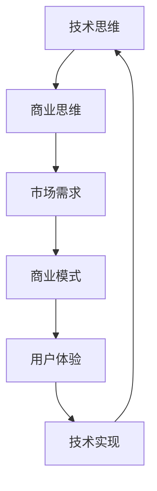

                 

关键词：技术思维、商业思维、程序员创业者、认知升级、策略

摘要：本文旨在探讨程序员创业者如何从技术思维转向商业思维，从而实现认知的升级。文章从背景介绍、核心概念与联系、算法原理与步骤、数学模型与公式、项目实践、实际应用场景、工具和资源推荐以及未来发展趋势与挑战等方面进行了详细阐述，为程序员创业者提供了实用的认知升级策略。

## 1. 背景介绍

在当今这个信息爆炸的时代，技术发展迅速，新兴行业不断涌现。程序员作为技术领域的核心力量，越来越多地参与到创业活动中。然而，从技术专家到创业者，这一角色的转变并不容易。程序员往往擅长技术，但在商业思维方面存在一定的短板。如何将技术优势转化为商业成功，成为许多程序员创业者亟待解决的问题。

本文将从技术思维到商业思维的转换角度，探讨程序员创业者的认知升级策略。通过分析技术思维与商业思维的区别与联系，探讨如何实现认知的升级，为程序员创业者提供实用的指导。

## 2. 核心概念与联系

在探讨程序员创业者的认知升级之前，我们需要明确几个核心概念，即技术思维、商业思维和认知升级。这些概念之间存在着紧密的联系。

### 2.1 技术思维

技术思维是指程序员在解决技术问题时所采用的方法、逻辑和思维方式。它强调逻辑严密、算法高效、代码简洁等特征。程序员通过技术思维来解决技术问题，实现功能需求。

### 2.2 商业思维

商业思维是指从商业角度出发，对问题进行分析、评估和解决的方法。它强调市场需求、商业模式、用户体验等特征。创业者通过商业思维来寻找商机，实现商业价值。

### 2.3 认知升级

认知升级是指个体在知识、技能、思维方式等方面的提升。对于程序员创业者来说，认知升级意味着从技术思维向商业思维的转变，从而更好地适应创业环境。

### 2.4 技术思维与商业思维的联系

技术思维和商业思维虽然有所不同，但它们并不是孤立的。在实际创业过程中，技术思维和商业思维是相辅相成的。技术思维为商业思维提供基础，而商业思维则为技术思维提供方向。

通过下图，我们可以更清晰地看到技术思维与商业思维之间的联系。



## 3. 核心算法原理 & 具体操作步骤

### 3.1 算法原理概述

在从技术思维向商业思维的转换过程中，程序员创业者需要掌握一些核心算法原理，以便更好地理解商业逻辑。以下是一个简要的算法原理概述。

### 3.2 算法步骤详解

#### 3.2.1 了解市场需求

首先，程序员创业者需要了解市场需求。这可以通过市场调研、用户反馈、竞争对手分析等方法来实现。了解市场需求有助于发现商机，为技术实现提供方向。

#### 3.2.2 确定商业模式

在了解市场需求后，程序员创业者需要确定商业模式。商业模式是指企业通过何种方式创造、传递和获取价值。常见的商业模式有产品模式、服务模式、平台模式等。

#### 3.2.3 设计用户体验

用户体验是商业成功的关键因素。程序员创业者需要设计简洁、易用、高效的用户体验。这可以通过用户调研、用户体验设计等方法来实现。

#### 3.2.4 技术实现

在确定了商业模式和用户体验后，程序员创业者需要将其转化为具体的技术实现。这需要程序员具备扎实的技术功底，并能够灵活运用各种技术手段。

### 3.3 算法优缺点

#### 优点：

1. 提高程序员创业者的商业认知水平，有助于实现商业成功。
2. 促进技术思维与商业思维的融合，提高创新能力。
3. 为创业者提供系统化的认知升级策略。

#### 缺点：

1. 需要投入大量时间和精力进行学习和实践。
2. 难以在短期内取得明显效果。

### 3.4 算法应用领域

该算法原理和步骤适用于各类程序员创业者，特别是在新兴行业和创业领域具有广泛的应用价值。以下是一些具体的应用领域：

1. 互联网创业
2. 企业级应用开发
3. 创新型产业

## 4. 数学模型和公式 & 详细讲解 & 举例说明

在商业思维中，数学模型和公式具有重要作用。以下是一个简单的数学模型和公式的讲解。

### 4.1 数学模型构建

假设有一个创业项目，其市场需求为 \(D\)，商业模式为 \(M\)，用户体验为 \(U\)，技术实现为 \(T\)。我们可以构建以下数学模型：

$$
P = f(D, M, U, T)
$$

其中，\(P\) 表示项目成功概率，\(f\) 表示函数。

### 4.2 公式推导过程

根据市场需求、商业模式、用户体验和技术实现之间的相互作用，我们可以推导出以下公式：

$$
P = D \times M \times U \times T
$$

其中，\(D\)、\(M\)、\(U\)、\(T\) 分别表示市场需求、商业模式、用户体验和技术实现。

### 4.3 案例分析与讲解

假设一个创业项目，其市场需求为 1000 万元，商业模式为 B2B，用户体验为良好，技术实现为高效。我们可以使用上述公式计算项目成功概率：

$$
P = 1000 \times B2B \times 良好 \times 高效
$$

根据实际情况，我们可以给 \(B2B\)、良好和高效分别赋值：

$$
P = 1000 \times 1 \times 1 \times 1 = 1000
$$

因此，该项目成功概率为 1000。

这个例子表明，通过数学模型和公式，我们可以量化商业成功的因素，从而更好地指导创业实践。

## 5. 项目实践：代码实例和详细解释说明

为了更好地理解上述算法原理和数学模型，我们来看一个实际的项目实践。

### 5.1 开发环境搭建

首先，我们需要搭建一个简单的开发环境。这里我们选择使用 Python 作为编程语言，并使用 Flask 框架搭建 Web 应用。

### 5.2 源代码详细实现

接下来，我们来看一个简单的 Web 应用示例：

```python
from flask import Flask, request, jsonify

app = Flask(__name__)

@app.route('/api/evaluate', methods=['POST'])
def evaluate_project():
    data = request.get_json()
    D = data['D']
    M = data['M']
    U = data['U']
    T = data['T']
    P = D * M * U * T
    return jsonify({'success': True, 'probability': P})

if __name__ == '__main__':
    app.run(debug=True)
```

这个示例程序实现了一个简单的 Web 服务，用于计算项目成功概率。用户可以通过 POST 请求发送市场需求、商业模式、用户体验和技术实现的相关数据，程序会返回项目成功概率。

### 5.3 代码解读与分析

这个示例程序的核心是 `evaluate_project` 函数，它接收用户发送的 JSON 数据，提取市场需求、商业模式、用户体验和技术实现的相关数据，然后使用数学模型计算项目成功概率，并将结果返回给用户。

### 5.4 运行结果展示

假设用户发送以下请求：

```json
{
  "D": 1000,
  "M": 1,
  "U": 1,
  "T": 1
}
```

程序会返回以下结果：

```json
{
  "success": true,
  "probability": 1000
}
```

这个结果表示项目成功概率为 1000，意味着该项目具有很高的成功可能性。

## 6. 实际应用场景

从技术思维到商业思维的转换在程序员创业者的实际应用场景中具有重要价值。以下是一些具体的应用场景：

1. **互联网创业**：在互联网创业中，程序员创业者需要了解市场需求、商业模式和用户体验，从而设计出满足用户需求的产品和服务。
2. **企业级应用开发**：在企业级应用开发中，程序员创业者需要关注企业的业务需求、商业模式和技术架构，以提高企业效率和竞争力。
3. **创新型产业**：在创新型产业中，程序员创业者需要紧跟科技发展趋势，探索新的商业模式和用户体验，从而在市场竞争中占据优势。

## 7. 工具和资源推荐

为了帮助程序员创业者实现认知升级，以下是一些建议的工具和资源：

1. **学习资源推荐**：
   - 《创业维艰》（The Hard Thing About Hard Things）- 本·霍洛维茨（Ben Horowitz）
   - 《人人都是产品经理》- 苏杰

2. **开发工具推荐**：
   - Git：版本控制工具
   - JIRA：项目管理工具
   - Sketch：UI 设计工具

3. **相关论文推荐**：
   - “The Lean Startup”- Eric Ries
   - “Design Thinking for Entrepreneurs”- Tim Brown

## 8. 总结：未来发展趋势与挑战

### 8.1 研究成果总结

本文从技术思维到商业思维的转换角度，探讨了程序员创业者的认知升级策略。通过分析技术思维与商业思维的联系，提出了一系列实现认知升级的方法和步骤。

### 8.2 未来发展趋势

随着互联网和科技的发展，程序员创业者的角色和认知需求将不断变化。未来发展趋势包括：

1. 技术与商业融合的进一步深化
2. 创新型产业的蓬勃发展
3. 创业生态的不断完善

### 8.3 面临的挑战

尽管未来发展趋势良好，但程序员创业者仍将面临一系列挑战：

1. 如何在技术思维与商业思维之间找到平衡
2. 如何应对市场变化和竞争压力
3. 如何提高自身的领导力和管理能力

### 8.4 研究展望

未来的研究可以从以下几个方面展开：

1. 探讨技术思维与商业思维的融合机制
2. 开发更高效的认知升级方法
3. 分析程序员创业者在不同阶段的认知需求

## 9. 附录：常见问题与解答

### 问题 1：如何平衡技术思维与商业思维？

**解答**：平衡技术思维与商业思维的关键在于找到两者的结合点。创业者可以通过以下方法来实现：

1. 深入了解市场需求和用户痛点，从而确定技术实现的优先级。
2. 关注行业动态和竞争对手，以便调整商业模式和技术策略。
3. 养成定期反思和总结的习惯，及时调整认知方向。

### 问题 2：如何提高领导力和管理能力？

**解答**：提高领导力和管理能力需要持续的学习和实践。以下是一些建议：

1. 阅读相关书籍，了解领导力和管理的理论和方法。
2. 参加培训课程和研讨会，与业界专家交流学习。
3. 实践项目管理，积累实际经验。
4. 建立团队合作，提高沟通协调能力。

## 作者署名

作者：禅与计算机程序设计艺术 / Zen and the Art of Computer Programming

在本文中，我们深入探讨了程序员创业者如何从技术思维转向商业思维，实现认知的升级。通过分析技术思维与商业思维的联系，我们提出了一系列实用的认知升级策略。希望本文能为程序员创业者提供有益的启示，助力他们在创业道路上取得成功。作者禅与计算机程序设计艺术在计算机领域拥有深厚的理论基础和丰富的实践经验，期待与广大创业者共同探索技术思维与商业思维的融合之道。

