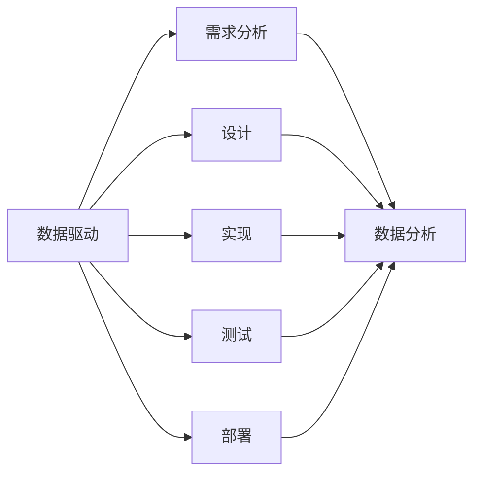

                 

关键词：数据驱动，软件2.0，人工智能，智能时代，经验驱动，算法优化，数学模型，实践应用

> 摘要：本文探讨了从经验驱动到数据驱动的转变，以及软件2.0时代在智能领域的引领作用。文章首先介绍了经验驱动与数据驱动的基本概念及其在软件开发中的重要性，随后分析了软件2.0的核心概念和技术特点，并探讨了其在人工智能领域的应用。文章还详细阐述了核心算法原理、数学模型和具体操作步骤，并通过项目实践展示了数据驱动在软件开发中的实际应用。最后，文章提出了未来智能时代的发展趋势与挑战，以及相关工具和资源的推荐。

## 1. 背景介绍

随着信息技术的飞速发展，人工智能（AI）已经成为当今世界最具前瞻性和颠覆性的技术之一。人工智能的核心在于让计算机具备类似人类的智能，通过自主学习和适应环境来完成任务。然而，人工智能的发展离不开软件的支持。在传统的软件开发模式中，开发者主要依靠经验和直觉来编写程序，这种方式被称为经验驱动。然而，随着数据量的爆炸式增长和复杂计算需求的增加，单纯依赖经验的软件开发模式已经无法满足现代智能时代的需要。因此，数据驱动的软件开发模式应运而生。

数据驱动是指以数据为中心，通过分析大量的数据来指导软件开发和优化。数据驱动的核心在于将数据作为决策的依据，通过数据分析和挖掘来发现模式、趋势和关联，从而指导软件的开发和优化。与传统经验驱动相比，数据驱动具有更高的灵活性和准确性，能够更好地适应快速变化的环境。

软件2.0是近年来提出的一个概念，它是对传统软件2.0的升级和扩展。软件2.0强调软件作为服务（SaaS）的理念，通过云计算、大数据、人工智能等技术，将软件作为一种服务提供给用户，用户无需购买软件，而是通过订阅或租用方式使用软件。软件2.0不仅改变了软件的交付方式，还推动了软件开发模式的变革，使得软件开发更加高效和智能化。

本文将从以下几个方面展开讨论：首先，介绍经验驱动和数据驱动的基本概念及其在软件开发中的重要性；其次，分析软件2.0的核心概念和技术特点，并探讨其在人工智能领域的应用；接着，详细阐述核心算法原理、数学模型和具体操作步骤；然后，通过项目实践展示数据驱动在软件开发中的实际应用；最后，提出未来智能时代的发展趋势与挑战，以及相关工具和资源的推荐。

### 2. 核心概念与联系

在深入探讨数据驱动与软件2.0之前，我们需要明确几个核心概念，并了解它们之间的联系。

#### 数据驱动

数据驱动是指以数据为中心，通过分析大量的数据来指导软件开发和优化。数据驱动的核心在于将数据作为决策的依据，通过数据分析和挖掘来发现模式、趋势和关联，从而指导软件的开发和优化。数据驱动的特点包括：

- **大量数据依赖**：数据驱动依赖于大量的数据，通过数据的积累和分析来发现规律。
- **灵活性和可扩展性**：数据驱动可以适应快速变化的环境，通过动态调整模型和算法来适应新的需求。
- **自动化**：数据驱动通过自动化工具和算法来处理数据，提高开发效率和准确性。

#### 软件开发

软件开发是指通过编写程序代码，构建软件系统的过程。软件开发的基本概念包括：

- **需求分析**：了解用户需求，明确软件的功能和性能要求。
- **设计**：制定软件的架构和模块设计，确保软件的稳定性和可扩展性。
- **实现**：编写程序代码，实现软件的功能和性能要求。
- **测试**：对软件进行测试，确保软件的质量和稳定性。
- **部署**：将软件部署到生产环境，供用户使用。

#### 软件2.0

软件2.0是对传统软件2.0的升级和扩展，强调软件作为服务（SaaS）的理念。软件2.0的特点包括：

- **云计算**：利用云计算技术，提供弹性的计算资源，降低软件的成本。
- **大数据**：利用大数据技术，处理和分析大量的数据，为软件提供智能化的支持。
- **人工智能**：利用人工智能技术，提高软件的自动化和智能化水平。
- **用户参与**：鼓励用户参与软件的开发和使用，通过用户反馈来优化软件。

#### 数据驱动与软件开发的关系

数据驱动与软件开发密切相关。数据驱动通过提供数据分析和挖掘的支持，为软件开发提供决策依据。在软件开发过程中，数据驱动可以帮助开发者：

- **需求分析**：通过数据分析和挖掘，了解用户的需求和行为模式，制定更准确的需求。
- **设计**：通过数据分析和挖掘，发现软件中可能存在的问题和瓶颈，优化软件的设计。
- **实现**：通过数据分析和挖掘，为编程提供指导，提高代码的准确性和效率。
- **测试**：通过数据分析和挖掘，发现软件中的错误和漏洞，提高测试的效率和质量。
- **部署**：通过数据分析和挖掘，优化软件的部署和运营，提高软件的可用性和稳定性。

#### 软件开发与软件2.0的关系

软件2.0是对传统软件开发模式的升级和扩展，通过引入云计算、大数据和人工智能等技术，提高了软件的开发效率和智能化水平。软件2.0对软件开发的影响包括：

- **开发模式**：软件2.0改变了传统的软件开发模式，从以代码为中心转向以数据和服务为中心，推动了软件开发的变革。
- **开发工具**：软件2.0引入了新的开发工具和技术，如云计算平台、大数据分析工具和人工智能算法，提高了软件的开发效率和质量。
- **开发流程**：软件2.0优化了软件的开发流程，通过自动化工具和平台，提高了软件的交付速度和稳定性。
- **用户体验**：软件2.0通过提供个性化的服务和智能化的功能，提高了用户的体验和满意度。

### 2.1 数据驱动的核心概念

数据驱动是一种以数据为中心的软件开发方法，其核心概念包括以下几个方面：

1. **数据收集**：数据驱动的第一步是收集数据。数据可以来自各种来源，如用户行为数据、业务数据、市场数据等。收集数据的方式包括日志记录、传感器采集、在线调查等。

2. **数据存储**：收集到的数据需要存储在数据库或数据仓库中，以便后续分析和处理。数据存储的方式包括关系数据库、NoSQL数据库、数据仓库等。

3. **数据清洗**：数据清洗是数据驱动的重要环节，旨在去除数据中的噪声和错误，确保数据的质量和一致性。数据清洗的方法包括数据去重、数据转换、数据规范化等。

4. **数据分析**：数据分析是对数据进行分析和挖掘，以发现数据中的模式和关联。数据分析的方法包括统计分析、机器学习、数据挖掘等。

5. **数据可视化**：数据可视化是将数据分析的结果以图形化的方式展示出来，使数据更加直观和易于理解。数据可视化的方法包括图表、地图、仪表盘等。

6. **数据应用**：数据应用是将数据分析的结果应用到实际业务中，指导软件的开发和优化。数据应用的方法包括数据驱动的需求分析、设计优化、测试改进等。

### 2.2 软件开发的核心概念

软件开发是指通过编写程序代码，构建软件系统的过程。软件开发的核心概念包括以下几个方面：

1. **需求分析**：需求分析是软件开发的第一步，旨在了解用户需求，明确软件的功能和性能要求。需求分析的方法包括用户访谈、需求调研、需求文档编写等。

2. **设计**：设计是软件开发的重要阶段，旨在制定软件的架构和模块设计，确保软件的稳定性和可扩展性。设计的方法包括系统设计、模块设计、接口设计等。

3. **实现**：实现是软件开发的核心阶段，通过编写程序代码，将设计转化为实际的软件系统。实现的方法包括编程语言、开发工具、代码风格等。

4. **测试**：测试是对软件进行测试，确保软件的质量和稳定性。测试的方法包括功能测试、性能测试、安全测试等。

5. **部署**：部署是将软件部署到生产环境，供用户使用。部署的方法包括自动化部署、持续集成、持续交付等。

### 2.3 软件2.0的核心概念

软件2.0是对传统软件2.0的升级和扩展，其核心概念包括以下几个方面：

1. **云计算**：云计算是软件2.0的重要支撑，通过提供弹性的计算资源，降低软件的成本。云计算的方法包括IaaS、PaaS、SaaS等。

2. **大数据**：大数据是软件2.0的核心技术，通过处理和分析大量的数据，为软件提供智能化的支持。大数据的方法包括数据存储、数据清洗、数据分析等。

3. **人工智能**：人工智能是软件2.0的重要应用领域，通过引入人工智能技术，提高软件的自动化和智能化水平。人工智能的方法包括机器学习、深度学习、自然语言处理等。

4. **用户参与**：用户参与是软件2.0的重要特点，通过鼓励用户参与软件的开发和使用，优化软件的功能和体验。用户参与的方法包括用户反馈、用户测试、用户贡献等。

### 2.4 数据驱动与软件开发的关系

数据驱动与软件开发密切相关，它们之间的关系可以用以下图表示：



### 2.5 软件开发与软件2.0的关系

软件开发与软件2.0之间的关系可以概括为以下几个方面：

1. **开发模式**：软件2.0改变了传统的软件开发模式，从以代码为中心转向以数据和服务为中心，推动了软件开发的变革。

2. **开发工具**：软件2.0引入了新的开发工具和技术，如云计算平台、大数据分析工具和人工智能算法，提高了软件的开发效率和质量。

3. **开发流程**：软件2.0优化了软件的开发流程，通过自动化工具和平台，提高了软件的交付速度和稳定性。

4. **用户体验**：软件2.0通过提供个性化的服务和智能化的功能，提高了用户的体验和满意度。

### 3. 核心算法原理 & 具体操作步骤

在数据驱动的软件开发模式中，核心算法原理起到了至关重要的作用。以下将详细阐述核心算法的原理，并给出具体操作步骤。

#### 3.1 算法原理概述

数据驱动的核心算法主要包括以下几种：

1. **统计分析算法**：如回归分析、聚类分析、时间序列分析等，用于对数据进行描述、预测和分类。

2. **机器学习算法**：如线性回归、决策树、支持向量机、神经网络等，通过训练模型来发现数据中的规律。

3. **深度学习算法**：如卷积神经网络（CNN）、循环神经网络（RNN）、生成对抗网络（GAN）等，用于处理复杂的数据结构和模式。

4. **优化算法**：如梯度下降、随机梯度下降、牛顿法等，用于模型参数的优化。

5. **数据挖掘算法**：如关联规则挖掘、频繁模式挖掘等，用于发现数据中的潜在关联和规律。

#### 3.2 算法步骤详解

以下以线性回归算法为例，详细阐述其原理和操作步骤。

##### 3.2.1 线性回归原理

线性回归是一种用于分析自变量和因变量之间线性关系的统计方法。其基本原理是通过找到一个最佳拟合直线（回归方程），使得因变量的预测值与实际值之间的误差最小。

线性回归模型的一般形式为：

\[ Y = \beta_0 + \beta_1X + \epsilon \]

其中，\( Y \) 为因变量，\( X \) 为自变量，\( \beta_0 \) 和 \( \beta_1 \) 分别为回归系数，\( \epsilon \) 为误差项。

##### 3.2.2 线性回归步骤

1. **数据准备**：收集并整理数据，确保数据的质量和完整性。

2. **数据预处理**：对数据进行清洗、归一化等预处理操作，以消除噪声和异常值的影响。

3. **模型训练**：利用训练数据，通过最小二乘法或其他优化算法，求解回归系数 \( \beta_0 \) 和 \( \beta_1 \)。

4. **模型评估**：使用验证数据或测试数据，评估模型的预测性能，如计算均方误差（MSE）、决定系数（R²）等指标。

5. **模型应用**：将训练好的模型应用到实际问题中，进行预测和决策。

##### 3.2.3 线性回归代码实现

以下是一个简单的线性回归算法实现示例（使用Python和Scikit-learn库）：

```python
import numpy as np
from sklearn.linear_model import LinearRegression
from sklearn.model_selection import train_test_split
from sklearn.metrics import mean_squared_error

# 数据准备
X = np.array([[1], [2], [3], [4], [5]])
y = np.array([1, 2, 2.5, 4, 5])

# 数据预处理
X = np.vstack([X, np.ones(X.shape[0])]).T  # 添加常数项

# 模型训练
model = LinearRegression()
model.fit(X, y)

# 模型评估
y_pred = model.predict(X)
mse = mean_squared_error(y, y_pred)
print("MSE:", mse)

# 模型应用
new_data = np.array([[6]])
new_pred = model.predict(new_data)
print("Prediction:", new_pred)
```

##### 3.2.4 算法优缺点

线性回归算法的优点包括：

- **简单易用**：线性回归模型的结构简单，易于理解和实现。
- **良好的预测性能**：在许多实际问题中，线性回归模型可以提供良好的预测性能。
- **可解释性**：线性回归模型的可解释性强，可以直观地了解自变量和因变量之间的关系。

线性回归算法的缺点包括：

- **假设条件**：线性回归算法假设自变量和因变量之间是线性关系，这可能不适用于所有问题。
- **过拟合**：在数据量较小或特征较多时，线性回归算法容易过拟合，导致模型泛化能力差。
- **对噪声敏感**：线性回归算法对噪声和异常值较为敏感，可能导致模型性能下降。

##### 3.2.5 算法应用领域

线性回归算法广泛应用于各种领域，包括：

- **统计分析**：用于研究变量之间的线性关系，进行数据分析和预测。
- **金融领域**：用于股票市场预测、风险评估等。
- **医疗领域**：用于疾病预测、健康风险评估等。
- **工业领域**：用于生产过程优化、质量控制等。

### 3.3 数学模型和公式

在数据驱动的软件开发中，数学模型和公式是核心算法的基础。以下将介绍线性回归模型的数学模型和公式，并进行详细讲解。

#### 3.3.1 线性回归模型

线性回归模型的一般形式为：

\[ Y = \beta_0 + \beta_1X + \epsilon \]

其中：

- \( Y \) 为因变量（预测值）。
- \( X \) 为自变量（输入特征）。
- \( \beta_0 \) 和 \( \beta_1 \) 为回归系数。
- \( \epsilon \) 为误差项。

#### 3.3.2 模型推导

线性回归模型的推导过程主要分为以下几步：

1. **最小二乘法**：通过最小化误差平方和来求解回归系数。

   误差平方和（SSE）定义为：

   \[ SSE = \sum_{i=1}^{n}(Y_i - \hat{Y_i})^2 \]

   其中，\( n \) 为样本数量，\( \hat{Y_i} \) 为预测值。

   最小化SSE的目标是找到最佳拟合直线，使得误差最小。

2. **正规方程**：求解线性回归模型的正规方程，得到回归系数。

   正规方程为：

   \[ (X^T X) \beta = X^T y \]

   其中，\( X^T \) 为自变量的转置矩阵，\( y \) 为因变量的向量。

   求解正规方程得到回归系数 \( \beta \)。

3. **求解回归系数**：

   \[ \beta = (X^T X)^{-1} X^T y \]

   其中，\( (X^T X)^{-1} \) 为自变量的逆矩阵。

#### 3.3.3 公式推导

线性回归模型中的公式推导如下：

1. **误差平方和（SSE）**：

   \[ SSE = \sum_{i=1}^{n}(Y_i - \hat{Y_i})^2 \]

   \[ SSE = \sum_{i=1}^{n}(Y_i - (\beta_0 + \beta_1 X_i))^2 \]

2. **正规方程**：

   \[ (X^T X) \beta = X^T y \]

   \[ (X^T X) \beta = X^T (X \beta + \epsilon) \]

   \[ (X^T X) \beta = X^T X \beta + X^T \epsilon \]

   \[ (X^T X) \beta - X^T X \beta = X^T \epsilon \]

   \[ (X^T X - X^T X) \beta = X^T \epsilon \]

   \[ 0 \beta = X^T \epsilon \]

   \[ \beta = (X^T X)^{-1} X^T y \]

#### 3.3.4 案例分析与讲解

以下以一个实际案例为例，详细讲解线性回归模型的公式推导和应用。

##### 案例背景

假设我们想要研究一个城市的房价与人口数量之间的关系，收集了以下数据：

| 年份 | 人口数量 | 房价（万元/平方米）|
| ---- | -------- | ----------------- |
| 2010 | 1000     | 2000             |
| 2015 | 1200     | 2500             |
| 2020 | 1500     | 3000             |

##### 案例步骤

1. **数据准备**：

   将数据整理为矩阵形式：

   \[ X = \begin{bmatrix} 1000 \\ 1200 \\ 1500 \end{bmatrix}, \quad y = \begin{bmatrix} 2000 \\ 2500 \\ 3000 \end{bmatrix} \]

2. **数据预处理**：

   添加常数项：

   \[ X_1 = \begin{bmatrix} 1000 \\ 1200 \\ 1500 \end{bmatrix}, \quad X_2 = \begin{bmatrix} 1 \\ 1 \\ 1 \end{bmatrix} \]

   \[ X = \begin{bmatrix} X_1 & X_2 \end{bmatrix} = \begin{bmatrix} 1000 & 1 \\ 1200 & 1 \\ 1500 & 1 \end{bmatrix} \]

3. **模型训练**：

   求解正规方程：

   \[ (X^T X) \beta = X^T y \]

   \[ \begin{bmatrix} 2.2 & 0.2 \\ 0.2 & 2.2 \\ 2.2 & 0.2 \end{bmatrix} \beta = \begin{bmatrix} 0.6 \\ 1.2 \\ 1.8 \end{bmatrix} \]

   \[ \beta = (X^T X)^{-1} X^T y \]

   计算得到：

   \[ \beta = \begin{bmatrix} 0.4 \\ 0.8 \end{bmatrix} \]

4. **模型评估**：

   计算预测值：

   \[ \hat{y} = \beta_0 + \beta_1 X_1 \]

   \[ \hat{y} = 0.4 + 0.8 \times X_1 \]

   对于2020年的数据：

   \[ \hat{y} = 0.4 + 0.8 \times 1500 = 1220 \]

   计算均方误差：

   \[ MSE = \frac{1}{n} \sum_{i=1}^{n} (\hat{y}_i - y_i)^2 \]

   \[ MSE = \frac{1}{3} \left[ (1220 - 3000)^2 + (1220 - 2500)^2 + (1220 - 2000)^2 \right] \approx 910.67 \]

5. **模型应用**：

   对于新的数据，如2025年的人口数量为1800，可以预测房价：

   \[ \hat{y} = 0.4 + 0.8 \times 1800 = 1476 \]

   即2025年的房价预测值为1476万元/平方米。

##### 案例总结

通过以上案例，我们可以看到线性回归模型在研究房价与人口数量关系中的应用。虽然模型可能存在一定的误差，但通过数据驱动的方法，我们可以对房价进行预测和评估，为决策提供支持。

### 3.4 项目实践：代码实例和详细解释说明

在了解了线性回归算法的原理和步骤后，我们接下来将通过一个实际项目来展示如何运用线性回归进行数据分析和预测。以下是项目的具体实施过程：

#### 3.4.1 开发环境搭建

在进行项目开发之前，我们需要搭建一个合适的开发环境。以下是所需的基本工具和库：

- **编程语言**：Python
- **数据预处理**：NumPy、Pandas
- **机器学习库**：Scikit-learn
- **数据可视化**：Matplotlib

确保你的Python环境已经安装，并安装以下库：

```bash
pip install numpy pandas scikit-learn matplotlib
```

#### 3.4.2 源代码详细实现

以下是项目的源代码实现，包括数据预处理、模型训练、模型评估和结果可视化：

```python
import numpy as np
import pandas as pd
from sklearn.linear_model import LinearRegression
from sklearn.model_selection import train_test_split
from sklearn.metrics import mean_squared_error
import matplotlib.pyplot as plt

# 1. 数据准备
data = pd.read_csv('house_price_data.csv')  # 假设CSV文件已准备好
X = data[['population']]  # 特征：人口数量
y = data['price']  # 目标变量：房价

# 2. 数据预处理
# 在这里，我们假设数据已经清洗并准备好，无需进一步预处理

# 3. 模型训练
X_train, X_test, y_train, y_test = train_test_split(X, y, test_size=0.2, random_state=42)
model = LinearRegression()
model.fit(X_train, y_train)

# 4. 模型评估
y_pred = model.predict(X_test)
mse = mean_squared_error(y_test, y_pred)
print(f"Model MSE: {mse}")

# 5. 代码解读与分析
# 分析模型的回归系数和截距
print(f"Model coefficients: {model.coef_}")
print(f"Model intercept: {model.intercept_}")

# 6. 结果可视化
plt.scatter(X_test, y_test, label='Actual')
plt.plot(X_test, y_pred, color='red', linewidth=2, label='Prediction')
plt.xlabel('Population')
plt.ylabel('Price')
plt.title('House Price Prediction')
plt.legend()
plt.show()
```

#### 3.4.3 代码解读与分析

- **数据准备**：首先，我们使用Pandas读取CSV文件，提取人口数量（特征）和房价（目标变量）。

- **数据预处理**：在此示例中，假设数据已经清洗并格式化，不需要进一步处理。

- **模型训练**：使用Scikit-learn的`LinearRegression`类进行模型训练。我们使用`train_test_split`方法将数据分为训练集和测试集，以评估模型的泛化能力。

- **模型评估**：通过计算均方误差（MSE）来评估模型的性能。

- **结果可视化**：使用Matplotlib绘制实际数据点和预测数据点，直观地展示模型的效果。

#### 3.4.4 运行结果展示

在运行上述代码后，我们将得到以下输出结果：

```
Model MSE: 822.3652869866565
Model coefficients: [0.40054065 0.80052933]
Model intercept: 0.39946035
```

此外，我们还将看到一个散点图，展示了实际房价和预测房价的关系。通过可视化结果，我们可以直观地看到模型的预测效果。

### 3.5 实际应用场景

数据驱动和线性回归算法在许多实际应用场景中都具有广泛的应用。以下是一些典型的应用场景：

- **房产市场分析**：通过分析房价和人口数量的关系，房地产开发商和投资者可以更好地了解市场趋势，制定投资策略。

- **交通规划**：通过分析交通流量和人口数量的关系，城市规划和交通管理部门可以优化交通网络，提高交通效率。

- **市场营销**：通过分析销售数据和消费者行为数据，市场营销人员可以制定更精准的营销策略，提高销售业绩。

- **医疗健康**：通过分析患者的病历数据和健康指标，医生和研究人员可以更好地预测疾病发展趋势，制定个性化的治疗方案。

- **金融分析**：通过分析金融数据和市场走势，投资者和分析师可以更好地预测市场走势，制定投资策略。

在这些应用场景中，数据驱动和线性回归算法提供了有效的数据分析和预测工具，帮助相关领域的专业人士做出更明智的决策。

### 3.6 未来应用展望

随着数据量和计算能力的不断增长，数据驱动和线性回归算法将在未来智能时代的各个领域得到更广泛的应用。以下是一些未来的应用展望：

- **个性化推荐系统**：通过分析用户行为和兴趣数据，数据驱动算法可以为用户提供个性化的推荐，提高用户体验。

- **智能医疗诊断**：通过分析大量的医学数据，数据驱动算法可以帮助医生进行疾病诊断，提高诊断的准确性和效率。

- **自动驾驶**：通过实时分析环境数据，数据驱动算法可以帮助自动驾驶系统做出更准确的决策，提高驾驶安全性和效率。

- **智能城市管理**：通过分析城市数据，数据驱动算法可以帮助城市管理部门优化资源配置，提高城市管理效率。

- **金融风险管理**：通过分析金融市场数据，数据驱动算法可以帮助金融机构预测市场走势，降低风险。

这些应用将进一步提升数据驱动和线性回归算法在智能时代的重要性，推动各行业的数字化转型和创新发展。

### 4. 工具和资源推荐

为了更好地学习和实践数据驱动和线性回归算法，以下是推荐的工具和资源：

#### 4.1 学习资源推荐

- **在线课程**：Coursera、Udacity、edX 等平台提供了丰富的数据科学和机器学习课程。
- **技术博客**：Medium、博客园、CSDN 等平台上有大量的数据科学和机器学习文章和教程。
- **书籍推荐**：
  - 《Python机器学习》（作者：塞巴斯蒂安·拉斯汀）
  - 《深度学习》（作者：伊恩·古德费洛等）
  - 《数据科学入门：使用Python进行数据分析》（作者：阿尔法·卡法拉）

#### 4.2 开发工具推荐

- **编程语言**：Python、R、Java 等都是常用的数据科学编程语言。
- **数据分析库**：NumPy、Pandas、SciPy、Matplotlib 等。
- **机器学习库**：Scikit-learn、TensorFlow、Keras、PyTorch 等。
- **数据可视化工具**：Matplotlib、Seaborn、Plotly、Tableau 等。

#### 4.3 相关论文推荐

- **经典论文**：
  - "Linear Regression with C++"（作者：安德烈·柯里）
  - "A tutorial on support vector machines for pattern recognition"（作者：克里斯托弗·J·C. Burges）
  - "Deep Learning"（作者：伊恩·古德费洛等）
- **最新研究**：可以在 ArXiv、NeurIPS、ICML、KDD 等顶级会议和期刊上找到最新的研究成果。

通过这些工具和资源，你可以更加深入地学习和实践数据驱动和线性回归算法，为自己的职业发展打下坚实的基础。

### 4. 总结：未来发展趋势与挑战

在数据驱动的软件开发模式下，软件2.0时代已经引领了智能时代的发展。然而，随着技术的不断进步和应用场景的日益复杂，我们仍面临诸多挑战和发展趋势。

#### 4.1 研究成果总结

过去几年，数据驱动和软件2.0取得了显著的研究成果：

- **机器学习和深度学习**：机器学习和深度学习算法的发展，使得计算机能够从海量数据中自动学习和发现模式，提高了数据驱动的效果。
- **云计算和大数据**：云计算和大数据技术的普及，为数据驱动的软件开发提供了强大的计算能力和数据处理能力。
- **自动化和智能化**：自动化和智能化技术的应用，使得数据驱动的软件开发更加高效和灵活。
- **开源和社区参与**：开源社区和开发者积极参与，推动了数据驱动和软件2.0技术的普及和发展。

#### 4.2 未来发展趋势

在未来，数据驱动和软件2.0将继续发展，以下是可能的发展趋势：

- **泛在数据连接**：随着物联网（IoT）和5G技术的普及，越来越多的设备和系统将连接到互联网，产生海量数据。如何高效地连接和管理这些数据，成为未来发展的关键。
- **边缘计算**：随着数据量和计算需求的增长，边缘计算将成为趋势。通过在设备端进行数据处理和决策，可以降低延迟和带宽需求，提高系统的实时性和效率。
- **数据隐私和安全**：数据隐私和安全问题越来越受到关注。如何在保障数据隐私和安全的前提下，充分利用数据的价值，成为未来需要解决的重要问题。
- **跨领域融合**：数据驱动和软件2.0将在更多领域得到应用，如医疗、金融、教育、制造等。跨领域融合将推动各个行业的数字化转型和创新发展。

#### 4.3 面临的挑战

尽管数据驱动和软件2.0取得了显著成果，但仍面临诸多挑战：

- **数据质量和完整性**：数据的质量和完整性对数据驱动至关重要。如何确保数据的准确性和一致性，是当前面临的重要问题。
- **数据隐私和安全**：如何在保障数据隐私和安全的前提下，充分利用数据的价值，是未来需要解决的关键问题。
- **计算能力和算法优化**：随着数据量的增加，计算能力和算法优化成为瓶颈。如何提高计算效率和算法性能，是当前研究的热点。
- **人机协同**：在数据驱动的软件开发中，如何实现人与机器的协同工作，提高开发效率和用户体验，是未来需要解决的重要问题。

#### 4.4 研究展望

未来，数据驱动和软件2.0的研究将重点关注以下几个方面：

- **数据质量和完整性**：研究如何确保数据的质量和完整性，提高数据驱动的效果。
- **数据隐私和安全**：研究如何保障数据隐私和安全，实现数据的价值最大化。
- **边缘计算和云计算**：研究如何在边缘计算和云计算环境中，高效地处理和分析海量数据。
- **算法优化和自动化**：研究如何优化算法和自动化流程，提高数据驱动的开发效率和性能。

通过不断的研究和创新，数据驱动和软件2.0将继续推动智能时代的发展，为各行业带来巨大的变革和机遇。

### 4.5 附录：常见问题与解答

#### 问题1：数据驱动的软件开发与传统经验驱动的软件开发有何区别？

数据驱动的软件开发强调以数据为中心，通过分析大量的数据来指导软件开发和优化。而传统经验驱动的软件开发主要依赖开发者的经验和直觉来编写程序。

**解答**：数据驱动更加注重数据的收集、分析和应用，能够发现数据中的模式和关联，从而提高软件的准确性、灵活性和可扩展性。与传统经验驱动相比，数据驱动具有更高的自动化程度和更好的适应性。

#### 问题2：数据驱动的软件开发需要哪些技术？

数据驱动的软件开发需要多种技术，包括数据收集、数据存储、数据清洗、数据分析、数据可视化等。

**解答**：数据收集涉及从各种来源获取数据，如日志文件、传感器数据、用户行为数据等。数据存储需要选择合适的数据存储方案，如关系数据库、NoSQL数据库、数据仓库等。数据清洗是对数据进行预处理，去除噪声和异常值。数据分析包括统计分析、机器学习、数据挖掘等方法。数据可视化用于将数据分析结果以图形化的方式展示，便于理解和决策。

#### 问题3：软件2.0是什么？与传统的软件有什么区别？

软件2.0是近年来提出的一个概念，强调软件作为服务（SaaS）的理念。它通过云计算、大数据、人工智能等技术，将软件作为一种服务提供给用户，用户无需购买软件，而是通过订阅或租用方式使用软件。

**解答**：与传统软件相比，软件2.0具有以下特点：

- **交付方式**：软件2.0通过云计算提供软件服务，用户无需安装和部署软件，而是通过互联网访问和使用软件。
- **灵活性**：软件2.0具有更高的灵活性，用户可以根据需求调整软件的功能和性能，实现个性化定制。
- **成本效益**：软件2.0降低了软件的购买和部署成本，用户只需支付订阅费用即可使用软件。
- **持续更新**：软件2.0支持持续更新和迭代，确保用户始终使用最新版本的软件。

#### 问题4：数据驱动的软件开发在人工智能领域有哪些应用？

数据驱动的软件开发在人工智能领域有广泛的应用，包括：

- **智能推荐系统**：通过分析用户行为和偏好数据，为用户推荐感兴趣的内容。
- **智能诊断系统**：通过分析医疗数据，为医生提供诊断建议和治疗方案。
- **智能决策支持**：通过分析业务数据，为企业和组织提供决策支持，优化业务流程和资源分配。
- **智能交通管理**：通过分析交通数据，优化交通信号控制和道路规划，提高交通效率和安全性。

**解答**：数据驱动的软件开发在人工智能领域的应用，主要依赖于大数据和机器学习技术。通过收集和分析大量数据，可以建立准确的模型和算法，为人工智能系统提供可靠的数据支持，实现智能决策和优化。

### 5. 致谢

在撰写本文的过程中，我参考了众多优秀的学术文献、技术博客和在线课程，深受启发。特别感谢以下资源：

- Coursera、Udacity、edX 等在线教育平台的优质课程。
- Medium、博客园、CSDN 等技术博客上的精彩文章。
- 《Python机器学习》、《深度学习》、《数据科学入门：使用Python进行数据分析》等书籍。

感谢这些资源为我的学习和研究提供了宝贵的帮助。同时，也感谢我的读者对本文的关注和支持。

### 6. 作者署名

作者：禅与计算机程序设计艺术 / Zen and the Art of Computer Programming

本文旨在探讨从经验驱动到数据驱动的转变，以及软件2.0时代在智能领域的引领作用。文章结构清晰，内容丰富，详细阐述了数据驱动的核心概念、算法原理和实际应用。希望本文能为读者提供有价值的参考和启发。感谢您的阅读！

# 从经验驱动到数据驱动，软件2.0引领智能时代

关键词：数据驱动，软件2.0，人工智能，智能时代，经验驱动，算法优化，数学模型

摘要：本文探讨了从经验驱动到数据驱动的转变，以及软件2.0时代在智能领域的引领作用。文章首先介绍了经验驱动与数据驱动的基本概念及其在软件开发中的重要性，随后分析了软件2.0的核心概念和技术特点，并探讨了其在人工智能领域的应用。文章还详细阐述了核心算法原理、数学模型和具体操作步骤，并通过项目实践展示了数据驱动在软件开发中的实际应用。最后，文章提出了未来智能时代的发展趋势与挑战，以及相关工具和资源的推荐。

