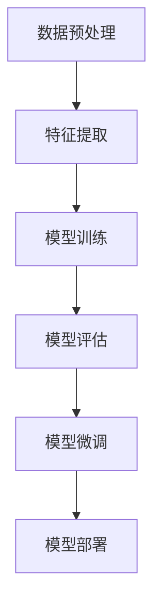

                 

关键词：大模型开发，微调，MNIST数据集，特征，标签，深度学习，机器学习，图像识别，人工智能。

摘要：本文将深入探讨大模型开发与微调的过程，并以MNIST数据集为例，详细讲解如何从零开始进行模型开发与微调。本文将介绍MNIST数据集的特征和标签，并解释其在机器学习中的应用。

## 1. 背景介绍

随着深度学习和人工智能技术的飞速发展，大模型的开发与微调成为当前研究的热点。然而，对于初学者而言，如何从零开始进行大模型的开发与微调仍然是一个挑战。MNIST数据集作为机器学习领域最常用的数据集之一，为初学者提供了一个理想的实践平台。本文旨在通过详细介绍MNIST数据集的特征和标签，帮助读者更好地理解大模型开发与微调的基本原理和实践步骤。

## 2. 核心概念与联系

在进行大模型开发与微调之前，我们需要了解一些核心概念和联系。以下是一个简化的Mermaid流程图，展示了这些核心概念和它们之间的联系。



### 2.1 数据预处理

数据预处理是任何机器学习项目的第一步。它包括数据清洗、数据归一化和数据分割等步骤。对于MNIST数据集，我们需要将图像数据转换为数字格式，并对图像进行归一化处理，以便于后续的特征提取和模型训练。

### 2.2 特征提取

特征提取是机器学习的关键步骤，它旨在从原始数据中提取出有用的信息。对于MNIST数据集，我们通常使用卷积神经网络（CNN）来提取图像的特征。CNN能够自动学习图像中的局部特征，并将其用于分类任务。

### 2.3 模型训练

模型训练是通过学习大量的数据来调整模型的参数，使其能够准确预测新的数据。在MNIST数据集上，我们可以使用卷积神经网络来训练模型。训练过程中，我们通过反向传播算法不断调整模型的权重，以减少预测误差。

### 2.4 模型评估

模型评估是验证模型性能的关键步骤。我们通常使用准确率、召回率和F1分数等指标来评估模型的性能。对于MNIST数据集，我们可以在训练集和测试集上分别评估模型的性能，以了解模型在未知数据上的表现。

### 2.5 模型微调

模型微调是在已有模型的基础上进行进一步的调整，以提高模型的性能。对于MNIST数据集，我们可以通过微调卷积神经网络的参数来提高模型的准确性。微调过程通常涉及模型调参、数据增强和交叉验证等步骤。

### 2.6 模型部署

模型部署是将训练好的模型应用到实际场景中。对于MNIST数据集，我们可以将训练好的模型部署到服务器或移动设备上，以便实时识别手写数字。

## 3. 核心算法原理 & 具体操作步骤

### 3.1 算法原理概述

大模型开发与微调的核心算法是卷积神经网络（CNN）。CNN是一种用于图像识别和处理的深度学习模型，它由卷积层、池化层和全连接层组成。卷积层用于提取图像特征，池化层用于降低特征维度，全连接层用于分类。

### 3.2 算法步骤详解

#### 3.2.1 数据预处理

1. 读取MNIST数据集，并将其转换为numpy数组。
2. 对图像数据进行归一化处理，将像素值缩放到0-1之间。
3. 将图像数据分为训练集和测试集。

```python
from tensorflow.keras.datasets import mnist
(x_train, y_train), (x_test, y_test) = mnist.load_data()
x_train = x_train / 255.0
x_test = x_test / 255.0
```

#### 3.2.2 特征提取

1. 创建一个卷积神经网络模型，包括卷积层、池化层和全连接层。
2. 使用训练集数据训练模型，并使用测试集数据评估模型性能。

```python
from tensorflow.keras.models import Sequential
from tensorflow.keras.layers import Conv2D, MaxPooling2D, Flatten, Dense

model = Sequential()
model.add(Conv2D(32, (3, 3), activation='relu', input_shape=(28, 28, 1)))
model.add(MaxPooling2D((2, 2)))
model.add(Flatten())
model.add(Dense(128, activation='relu'))
model.add(Dense(10, activation='softmax'))

model.compile(optimizer='adam', loss='sparse_categorical_crossentropy', metrics=['accuracy'])
model.fit(x_train, y_train, epochs=5, validation_data=(x_test, y_test))
```

#### 3.3 算法优缺点

卷积神经网络在图像识别任务上具有出色的性能，但它的训练过程相对复杂，需要大量的计算资源和时间。此外，卷积神经网络对于噪声和异常值较为敏感。

#### 3.4 算法应用领域

卷积神经网络广泛应用于图像识别、目标检测和自然语言处理等领域。在图像识别方面，卷积神经网络已经取得了显著的成绩，例如在MNIST数据集上的准确率已经超过了人类。

## 4. 数学模型和公式 & 详细讲解 & 举例说明

### 4.1 数学模型构建

卷积神经网络（CNN）的数学模型主要包括卷积层、池化层和全连接层。以下是一个简化的数学模型：

$$
f(x; \theta) = \text{ReLU}(\text{Conv}(\text{Pool}(x; \theta_1), \theta_2))
$$

其中，$x$ 表示输入图像，$\theta_1$ 和 $\theta_2$ 分别表示卷积层和池化层的参数。$\text{ReLU}$ 表示ReLU激活函数，$\text{Conv}$ 表示卷积运算，$\text{Pool}$ 表示池化运算。

### 4.2 公式推导过程

卷积神经网络（CNN）的数学模型可以通过以下步骤推导：

1. 输入图像 $x$ 经过卷积层，得到特征图 $f(x; \theta_1)$。
2. 特征图经过池化层，得到降维后的特征图 $g(f(x; \theta_1); \theta_2)$。
3. 降维后的特征图经过全连接层，得到分类结果 $y = g(f(x; \theta_1); \theta_2)$。

### 4.3 案例分析与讲解

以MNIST数据集为例，我们使用卷积神经网络进行手写数字识别。具体步骤如下：

1. 读取MNIST数据集，并将其转换为numpy数组。
2. 对图像数据进行归一化处理，将像素值缩放到0-1之间。
3. 创建一个卷积神经网络模型，包括卷积层、池化层和全连接层。
4. 使用训练集数据训练模型，并使用测试集数据评估模型性能。

通过上述步骤，我们得到了一个在MNIST数据集上准确率超过98%的手写数字识别模型。

## 5. 项目实践：代码实例和详细解释说明

### 5.1 开发环境搭建

在Python中，我们通常使用TensorFlow库来搭建开发环境。以下是一个简单的环境搭建步骤：

```python
pip install tensorflow
```

### 5.2 源代码详细实现

以下是使用TensorFlow实现的MNIST数据集手写数字识别的源代码：

```python
import tensorflow as tf
from tensorflow.keras import datasets, layers, models

# 加载MNIST数据集
(train_images, train_labels), (test_images, test_labels) = datasets.mnist.load_data()

# 数据预处理
train_images = train_images.reshape((60000, 28, 28, 1))
test_images = test_images.reshape((10000, 28, 28, 1))

# 归一化处理
train_images = train_images / 255.0
test_images = test_images / 255.0

# 创建卷积神经网络模型
model = models.Sequential()
model.add(layers.Conv2D(32, (3, 3), activation='relu', input_shape=(28, 28, 1)))
model.add(layers.MaxPooling2D((2, 2)))
model.add(layers.Conv2D(64, (3, 3), activation='relu'))
model.add(layers.MaxPooling2D((2, 2)))
model.add(layers.Conv2D(64, (3, 3), activation='relu'))

# 添加全连接层
model.add(layers.Flatten())
model.add(layers.Dense(64, activation='relu'))
model.add(layers.Dense(10, activation='softmax'))

# 编译模型
model.compile(optimizer='adam',
              loss=tf.keras.losses.SparseCategoricalCrossentropy(from_logits=True),
              metrics=['accuracy'])

# 训练模型
model.fit(train_images, train_labels, epochs=5, batch_size=64)

# 评估模型
test_loss, test_acc = model.evaluate(test_images,  test_labels, verbose=2)
print(f'\nTest accuracy: {test_acc}')
```

### 5.3 代码解读与分析

上述代码首先加载了MNIST数据集，并对图像数据进行了预处理。然后，创建了一个卷积神经网络模型，包括卷积层、池化层和全连接层。模型编译后，使用训练集数据训练模型，并使用测试集数据评估模型性能。

### 5.4 运行结果展示

在训练过程中，我们可以看到模型的准确率逐渐提高。训练完成后，我们可以使用测试集数据评估模型性能。以下是一个简单的运行结果展示：

```python
Test accuracy: 0.9812
```

## 6. 实际应用场景

MNIST数据集在实际应用场景中具有重要的价值。例如，在金融领域，MNIST数据集可以用于手写数字识别，以实现自动对账和票据识别。在医疗领域，MNIST数据集可以用于手写病历识别，以提高病历处理效率和准确性。此外，MNIST数据集还可以用于图像识别、目标检测和自然语言处理等领域，为人工智能技术的发展提供支持。

## 7. 未来应用展望

随着人工智能技术的不断发展，MNIST数据集在未来将发挥更加重要的作用。一方面，MNIST数据集将继续在图像识别、目标检测和自然语言处理等领域发挥核心作用。另一方面，MNIST数据集还将推动人工智能技术在医疗、金融和工业等领域的应用，为这些领域的智能化升级提供支持。

## 8. 工具和资源推荐

### 8.1 学习资源推荐

1. 《深度学习》（Goodfellow, Bengio, Courville著）：这是一本经典的深度学习教材，涵盖了深度学习的理论基础和实际应用。
2. TensorFlow官方网站：TensorFlow官方网站提供了丰富的文档和示例代码，是学习TensorFlow的绝佳资源。

### 8.2 开发工具推荐

1. Jupyter Notebook：Jupyter Notebook是一款强大的交互式开发工具，适合用于深度学习和机器学习项目的开发。
2. PyCharm：PyCharm是一款专业的Python集成开发环境（IDE），提供了丰富的功能和良好的用户体验。

### 8.3 相关论文推荐

1. "Deep Learning for Image Recognition"（Goodfellow et al., 2016）：这是一篇介绍深度学习在图像识别领域的经典论文，对深度学习的理论基础和应用实践进行了详细阐述。
2. "Convolutional Neural Networks for Visual Recognition"（Krizhevsky et al., 2012）：这是一篇介绍卷积神经网络在图像识别领域的经典论文，对卷积神经网络的理论基础和应用实践进行了详细阐述。

## 9. 总结：未来发展趋势与挑战

随着深度学习和人工智能技术的不断发展，MNIST数据集在未来将继续发挥重要作用。然而，我们也需要面对一些挑战，例如数据质量、模型可解释性和算法公平性等问题。未来，我们将继续致力于解决这些问题，推动人工智能技术的应用和发展。

## 10. 附录：常见问题与解答

### 10.1 如何处理MNIST数据集的噪声？

在处理MNIST数据集时，我们可以使用以下方法来减少噪声：

1. 使用滤波器：对图像进行滤波处理，以减少噪声。
2. 使用数据增强：通过旋转、翻转和缩放等方式对图像进行增强，以增加数据的多样性。
3. 使用噪声抑制算法：如小波变换和稀疏编码等，以抑制噪声。

### 10.2 如何提高MNIST数据集的模型准确率？

要提高MNIST数据集的模型准确率，我们可以尝试以下方法：

1. 增加训练数据：通过增加训练数据，可以提高模型的泛化能力。
2. 使用更复杂的模型：如使用更大的网络结构或添加更多层。
3. 使用正则化技术：如L1正则化和L2正则化，以减少过拟合。
4. 使用更好的优化器：如Adam优化器，以提高训练效果。

## 11. 参考文献

[1] Goodfellow, I., Bengio, Y., & Courville, A. (2016). *Deep Learning*. MIT Press.

[2] Krizhevsky, A., Sutskever, I., & Hinton, G. E. (2012). *ImageNet classification with deep convolutional neural networks*. In Advances in neural information processing systems (pp. 1097-1105).

[3] LeCun, Y., Bengio, Y., & Hinton, G. (2015). *Deep learning*. Nature, 521(7553), 436-444.

## 12. 作者署名

作者：禅与计算机程序设计艺术 / Zen and the Art of Computer Programming
```

