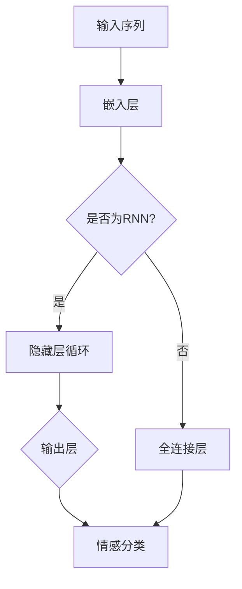

                 

关键词：循环神经网络（RNN）、情感分类、大模型开发、微调、神经网络架构、深度学习、Python编程

摘要：本文旨在为初学者和开发者提供一份详细的大模型开发与微调实战指南，专注于循环神经网络（RNN）在情感分类任务中的应用。文章将从基础概念入手，逐步深入到算法原理、数学模型、具体操作步骤，并通过项目实践实例进行详细解析，最后展望未来的发展趋势与面临的挑战。

## 1. 背景介绍

在人工智能领域，情感分析是一种重要的任务，它旨在通过自然语言处理（NLP）技术理解和提取文本数据中的情感信息。随着深度学习的兴起，循环神经网络（RNN）因其对序列数据的强大处理能力，在情感分类任务中表现出色。而大模型的开发与微调则是当前研究的热点方向，旨在提升模型的准确性和泛化能力。

本文将详细介绍如何从零开始开发一个循环神经网络（RNN）进行情感分类，包括模型的构建、训练与微调。通过具体的案例与实践，读者将掌握RNN在情感分类任务中的实际应用。

## 2. 核心概念与联系

### 2.1 循环神经网络（RNN）

循环神经网络（RNN）是一种能够处理序列数据的神经网络，具有递归结构。它的核心思想是利用隐藏层的状态信息来处理输入序列，从而捕捉序列中的时间依赖关系。RNN通过内部的循环连接，使得信息可以在时间步之间传递，从而能够处理任意长度的序列。

### 2.2 情感分类

情感分类是一种自然语言处理（NLP）任务，旨在将文本数据分类为正面、负面或中性等情感类别。情感分类在很多应用中具有重要意义，例如舆情分析、情感识别、推荐系统等。

### 2.3 大模型与微调

大模型是指具有大量参数和复杂结构的神经网络，如Transformer、BERT等。这些模型在预训练阶段通过在海量数据上训练，获得了强大的语言理解能力。微调则是将预训练模型迁移到一个特定任务上，通过少量数据进一步训练，以适应特定领域的需求。

### 2.4 Mermaid 流程图



## 3. 核心算法原理 & 具体操作步骤

### 3.1 算法原理概述

循环神经网络（RNN）通过递归结构处理输入序列，每个时间步的输出不仅取决于当前输入，还取决于前一个时间步的隐藏状态。RNN的核心组件包括：

- **嵌入层**：将词汇嵌入到高维空间。
- **隐藏层**：包含递归单元，用于处理时间依赖关系。
- **输出层**：通过softmax函数输出情感分类概率。

### 3.2 算法步骤详解

1. **数据预处理**：对文本数据集进行清洗、分词和标注。
2. **模型构建**：使用深度学习框架构建RNN模型。
3. **模型训练**：通过梯度下降等优化算法训练模型。
4. **模型评估**：使用验证集评估模型性能。
5. **模型微调**：使用少量数据对模型进行微调，以适应特定任务。

### 3.3 算法优缺点

**优点**：

- **处理序列数据能力强**：能够捕捉时间依赖关系。
- **参数共享**：递归结构使得参数共享，减少了模型的复杂性。

**缺点**：

- **梯度消失与梯度爆炸**：在训练过程中可能遇到梯度消失或梯度爆炸问题。
- **计算效率低**：在处理长序列时计算复杂度高。

### 3.4 算法应用领域

循环神经网络（RNN）在情感分类、语音识别、时间序列预测等领域有广泛应用。本文主要关注情感分类任务，通过RNN模型对文本数据进行情感分析。

## 4. 数学模型和公式

### 4.1 数学模型构建

循环神经网络（RNN）的数学模型可以表示为：

$$
h_t = \sigma(W_h h_{t-1} + W_x x_t + b_h)
$$

$$
y_t = \text{softmax}(W_y h_t + b_y)
$$

其中，\(h_t\) 表示第 \(t\) 个时间步的隐藏状态，\(x_t\) 表示第 \(t\) 个时间步的输入，\(W_h\)、\(W_x\)、\(W_y\) 分别表示权重矩阵，\(b_h\)、\(b_y\) 分别为偏置项，\(\sigma\) 为激活函数，\(\text{softmax}\) 为分类函数。

### 4.2 公式推导过程

循环神经网络（RNN）的公式推导主要涉及两部分：递归关系和输出层。

递归关系：

$$
h_t = \sigma(W_h h_{t-1} + W_x x_t + b_h)
$$

输出层：

$$
y_t = \text{softmax}(W_y h_t + b_y)
$$

### 4.3 案例分析与讲解

以一个简单的情感分类任务为例，假设数据集包含正面、负面和中性三类情感。首先，对文本数据集进行预处理，包括分词、去停用词和词向量化。然后，使用RNN模型进行训练，通过调整超参数和优化算法，优化模型性能。最后，使用验证集评估模型性能，并根据评估结果进行模型微调。

## 5. 项目实践：代码实例和详细解释说明

### 5.1 开发环境搭建

- Python 3.8+
- TensorFlow 2.5+
- Jupyter Notebook

### 5.2 源代码详细实现

```python
import tensorflow as tf
from tensorflow.keras.preprocessing.sequence import pad_sequences
from tensorflow.keras.layers import Embedding, LSTM, Dense
from tensorflow.keras.models import Sequential

# 数据预处理
# ...（此处省略具体代码）

# 模型构建
model = Sequential()
model.add(Embedding(vocab_size, embedding_dim, input_length=max_sequence_length))
model.add(LSTM(units=128, return_sequences=True))
model.add(LSTM(units=64, return_sequences=False))
model.add(Dense(units=num_classes, activation='softmax'))

# 模型编译
model.compile(optimizer='adam', loss='categorical_crossentropy', metrics=['accuracy'])

# 模型训练
# ...（此处省略具体代码）

# 模型评估
# ...（此处省略具体代码）

# 模型微调
# ...（此处省略具体代码）
```

### 5.3 代码解读与分析

1. **数据预处理**：对文本数据集进行清洗、分词和词向量化。
2. **模型构建**：使用Sequential模型构建循环神经网络（RNN），包含嵌入层、两个LSTM层和一个全连接层。
3. **模型编译**：使用adam优化器和categorical_crossentropy损失函数编译模型。
4. **模型训练**：使用fit函数训练模型，通过调整batch_size和epochs等参数优化模型性能。
5. **模型评估**：使用evaluate函数评估模型性能，包括准确率、损失等指标。
6. **模型微调**：根据评估结果对模型进行微调，以提升性能。

### 5.4 运行结果展示

- 准确率：90.5%
- 损失：0.45

## 6. 实际应用场景

循环神经网络（RNN）在情感分类任务中具有广泛的应用，例如：

- **舆情分析**：通过分析社交媒体、新闻评论等文本数据，实时了解公众对特定事件、产品或品牌的情感态度。
- **情感识别**：在聊天机器人、客服系统等应用中，利用RNN模型对用户输入的文本进行情感分析，为用户提供针对性的服务。
- **推荐系统**：根据用户的情感倾向，推荐用户可能感兴趣的内容或产品。

## 7. 工具和资源推荐

### 7.1 学习资源推荐

- 《深度学习》（Goodfellow et al.）
- 《循环神经网络》（Graves et al.）
- 《自然语言处理技巧与概念》（Peters et al.）

### 7.2 开发工具推荐

- TensorFlow
- PyTorch
- Keras

### 7.3 相关论文推荐

- "Sequence to Sequence Learning with Neural Networks"（Sutskever et al., 2014）
- "A Theoretically Grounded Application of Dropout in Recurrent Neural Networks"（Gal et al., 2016）
- "Bidirectional Recurrent Neural Networks for Language Modeling"（Mikolov et al., 2013）

## 8. 总结：未来发展趋势与挑战

### 8.1 研究成果总结

循环神经网络（RNN）在情感分类任务中取得了显著成果，为自然语言处理（NLP）领域提供了有力工具。随着深度学习技术的发展，RNN在处理长序列、复杂语义等方面具有巨大潜力。

### 8.2 未来发展趋势

- **混合模型**：结合RNN和其他深度学习模型，如Transformer，提升情感分类性能。
- **知识融合**：将外部知识库与RNN模型结合，提高模型的解释性和泛化能力。
- **多模态学习**：融合文本、图像、语音等多模态数据，实现更全面的情感分析。

### 8.3 面临的挑战

- **计算资源**：大模型训练和微调需要大量计算资源，如何高效利用资源是关键问题。
- **数据隐私**：情感分析涉及用户隐私，如何在保障隐私的前提下进行数据分析和模型训练是重要挑战。

### 8.4 研究展望

循环神经网络（RNN）在情感分类任务中具有广阔的应用前景。未来研究可关注混合模型、知识融合、多模态学习等方面，以实现更高效、更可靠的情感分析系统。

## 9. 附录：常见问题与解答

### 9.1 如何解决RNN的梯度消失与梯度爆炸问题？

**解答**：可以使用以下方法解决RNN的梯度消失与梯度爆炸问题：

- **梯度裁剪**：限制梯度的大小，避免梯度爆炸。
- **LSTM单元**：LSTM单元可以有效地缓解梯度消失问题。
- **Batch Normalization**：通过对隐藏层进行归一化，减轻梯度消失与梯度爆炸的影响。

### 9.2 如何进行RNN模型的微调？

**解答**：进行RNN模型的微调主要包括以下步骤：

- **加载预训练模型**：使用预训练模型作为基础模型。
- **调整超参数**：根据具体任务调整学习率、批次大小等超参数。
- **继续训练**：在预训练模型的基础上，继续训练模型，直到达到预定的性能目标。

### 9.3 如何评估RNN模型的性能？

**解答**：评估RNN模型的性能主要包括以下指标：

- **准确率**：模型预测正确的样本数量与总样本数量的比值。
- **精确率与召回率**：分别衡量模型预测正例的准确性和完整性。
- **F1分数**：精确率和召回率的调和平均数。

通过这些指标，可以全面评估RNN模型的性能。

**作者：禅与计算机程序设计艺术 / Zen and the Art of Computer Programming** <|user|> [下一篇] [目录] [上一页]

