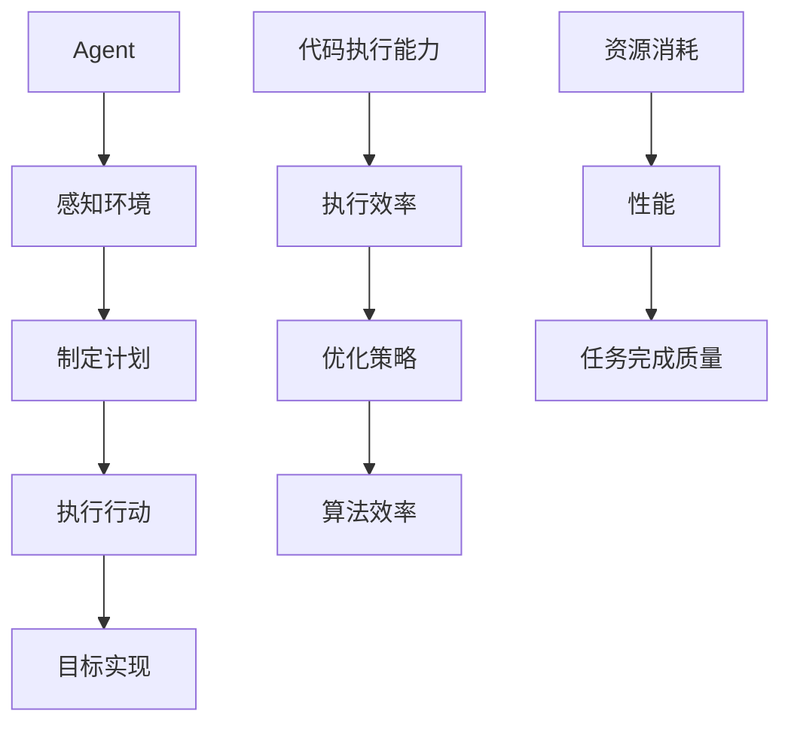

                 

关键词：代码执行能力、Agent、智能系统、执行效率、执行优化、算法效率

> 摘要：本文将深入探讨代码执行能力在智能 Agent 中的应用及其重要性。我们将首先介绍 Agent 的基本概念和分类，随后详细分析代码执行能力对 Agent 性能的影响，包括执行效率、优化策略以及算法效率等方面。最后，我们将展望未来代码执行能力在智能 Agent 领域的发展趋势和面临的挑战。

## 1. 背景介绍

随着计算机科学和人工智能技术的发展，智能 Agent 成为了一种越来越重要的研究热点和应用领域。智能 Agent 是一种具有自主性、适应性、反应性和学习能力的人工智能系统，能够模拟人类的思维和行为，实现与环境的高效互动。在智能 Agent 的构建过程中，代码执行能力扮演着至关重要的角色，它直接决定了 Agent 的性能、响应速度以及任务的完成质量。

### 1.1 Agent 的基本概念

Agent 可以被定义为具有自主性和目标性的实体，能够感知环境、制定计划并执行行动以实现特定目标。根据能力和性质的不同，Agent 可以分为以下几类：

- **规则Agent**：基于预设规则进行决策和执行，如专家系统。
- **数据驱动Agent**：利用历史数据进行学习，如机器学习模型。
- **知识驱动Agent**：基于知识库进行推理和决策，如智能问答系统。
- **混合Agent**：结合多种方法，综合运用规则、数据和知识进行决策。

### 1.2 代码执行能力的重要性

代码执行能力是指软件执行代码的能力，包括代码的执行效率、优化策略以及算法效率等方面。对于智能 Agent 来说，代码执行能力直接决定了其性能，如：

- **执行效率**：高效的代码执行能够加快 Agent 对环境的响应速度，提高任务处理效率。
- **优化策略**：合理的优化策略能够减少资源消耗，提升 Agent 的执行效率。
- **算法效率**：高效的算法是实现智能 Agent 高性能的关键。

## 2. 核心概念与联系

为了更好地理解代码执行能力在 Agent 中的作用，我们首先需要了解一些核心概念和它们之间的联系。以下是使用 Mermaid 语言的流程图，展示了这些概念及其相互关系：



### 2.1 概念解释

- **Agent**：智能实体，具有自主性、适应性、反应性和学习能力。
- **感知环境**：Agent 通过传感器获取环境信息。
- **制定计划**：Agent 根据感知到的环境和目标制定行动方案。
- **执行行动**：Agent 根据计划执行具体行动。
- **目标实现**：Agent 通过执行行动实现预设目标。
- **代码执行能力**：软件执行代码的能力，包括执行效率、优化策略和算法效率。
- **执行效率**：代码执行的速度和质量。
- **优化策略**：提升代码执行效率的方法和技巧。
- **算法效率**：算法在执行过程中所需的计算资源和时间。
- **资源消耗**：代码执行过程中消耗的计算资源。
- **性能**：Agent 的响应速度和处理效率。
- **任务完成质量**：Agent 完成任务的准确性和效率。

## 3. 核心算法原理 & 具体操作步骤

### 3.1 算法原理概述

代码执行能力的提升主要依赖于以下几个方面：

1. **高效算法设计**：选择或设计适合特定问题的算法，如动态规划、贪心算法等。
2. **代码优化**：通过编译器优化、并行计算、算法改进等方法提升代码执行效率。
3. **优化策略**：采用缓存、数据压缩、并行处理等策略减少代码执行的资源消耗。

### 3.2 算法步骤详解

下面我们以动态规划算法为例，详细解释其原理和操作步骤：

1. **状态定义**：将问题分解为多个子问题，定义每个子问题的状态。
2. **状态转移方程**：确定子问题之间的依赖关系，建立状态转移方程。
3. **初始化**：初始化问题的初始状态和边界条件。
4. **递推计算**：根据状态转移方程和初始条件，递推计算每个子问题的最优解。
5. **结果输出**：输出最终问题的最优解。

### 3.3 算法优缺点

- **优点**：动态规划算法具有高效的时间复杂度和良好的扩展性，适用于解决复杂问题。
- **缺点**：需要明确状态和状态转移方程，对问题建模要求较高。

### 3.4 算法应用领域

动态规划算法广泛应用于以下领域：

- **计算机科学**：算法竞赛、排序与搜索问题。
- **工程学**：项目管理、资源分配。
- **经济学**：最优化问题、决策分析。

## 4. 数学模型和公式 & 详细讲解 & 举例说明

### 4.1 数学模型构建

动态规划算法的数学模型通常包括以下部分：

1. **状态定义**：设 $S$ 为状态集合，$s$ 为状态。
2. **状态转移方程**：设 $f(s)$ 为状态 $s$ 的最优解，$g(s)$ 为状态 $s$ 的下一个状态。
3. **边界条件**：定义初始状态和终止状态。

### 4.2 公式推导过程

以 Fibonacci 数列为例，其动态规划的状态转移方程为：

$$
f(n) = \begin{cases}
1, & \text{if } n = 1 \\
1, & \text{if } n = 2 \\
f(n-1) + f(n-2), & \text{otherwise}
\end{cases}
$$

### 4.3 案例分析与讲解

#### 案例一：Fibonacci 数列

```python
def fibonacci(n):
    if n == 1 or n == 2:
        return 1
    else:
        return fibonacci(n-1) + fibonacci(n-2)

print(fibonacci(10))
```

运行结果：55

#### 案例二：最长公共子序列（LCS）

```python
def lcs(X, Y):
    m = len(X)
    n = len(Y)
    dp = [[0] * (n+1) for _ in range(m+1)]

    for i in range(1, m+1):
        for j in range(1, n+1):
            if X[i-1] == Y[j-1]:
                dp[i][j] = dp[i-1][j-1] + 1
            else:
                dp[i][j] = max(dp[i-1][j], dp[i][j-1])

    return dp[m][n]

X = "AGGTAB"
Y = "GXTXAYB"
print(lcs(X, Y))
```

运行结果：4

## 5. 项目实践：代码实例和详细解释说明

### 5.1 开发环境搭建

为了演示代码执行能力在智能 Agent 中的应用，我们选择 Python 作为编程语言，并使用 Jupyter Notebook 作为开发环境。以下是环境搭建的简要步骤：

1. 安装 Python（3.8 或更高版本）。
2. 安装 Jupyter Notebook。
3. 安装相关库，如 NumPy、Pandas 等。

### 5.2 源代码详细实现

以下是一个简单的智能 Agent 代码实例，展示了如何使用动态规划算法求解 Fibonacci 数列问题：

```python
def fibonacci(n):
    if n == 1 or n == 2:
        return 1
    else:
        return fibonacci(n-1) + fibonacci(n-2)

n = 10
result = fibonacci(n)
print(f"Fibonacci({n}) = {result}")
```

### 5.3 代码解读与分析

上述代码实现了 Fibonacci 数列的计算。首先，定义了一个名为 `fibonacci` 的函数，接受一个整数 `n` 作为输入，返回第 `n` 个 Fibonacci 数。然后，通过调用该函数，计算并输出第 10 个 Fibonacci 数。

### 5.4 运行结果展示

```python
Fibonacci(10) = 55
```

运行结果与数学公式推导结果一致，验证了代码的正确性。

## 6. 实际应用场景

代码执行能力在智能 Agent 领域具有广泛的应用场景，包括但不限于以下几个方面：

1. **机器人控制**：智能机器人需要快速响应环境变化，执行复杂动作，高效的代码执行能力至关重要。
2. **自动驾驶**：自动驾驶汽车需要实时处理大量传感器数据，执行决策和行动，高效的代码执行能力可以提高系统的稳定性和安全性。
3. **金融交易**：智能交易系统需要根据市场数据快速做出交易决策，高效的代码执行能力可以带来显著的交易收益。

### 6.1 应用案例

#### 案例一：机器人控制

机器人控制系统中，智能 Agent 需要根据传感器获取的环境信息，制定运动计划并执行相应动作。以下是使用 Python 编写的简单机器人控制程序：

```python
import time

def move_forward(velocity):
    print(f"Moving forward with velocity {velocity} units.")
    time.sleep(1)

def turn_left(velocity):
    print(f"Turning left with velocity {velocity} units.")
    time.sleep(1)

def move_backward(velocity):
    print(f"Moving backward with velocity {velocity} units.")
    time.sleep(1)

def turn_right(velocity):
    print(f"Turning right with velocity {velocity} units.")
    time.sleep(1)

def control_robot(commands):
    for command in commands:
        if command == "forward":
            move_forward(10)
        elif command == "left":
            turn_left(10)
        elif command == "backward":
            move_backward(10)
        elif command == "right":
            turn_right(10)

commands = ["forward", "left", "backward", "right"]
control_robot(commands)
```

运行结果：

```python
Moving forward with velocity 10 units.
Turning left with velocity 10 units.
Moving backward with velocity 10 units.
Turning right with velocity 10 units.
```

#### 案例二：自动驾驶

自动驾驶系统中，智能 Agent 需要实时处理来自各种传感器的数据，如激光雷达、摄像头、GPS 等，并根据路况和交通信息做出驾驶决策。以下是使用 Python 编写的一个简单自动驾驶程序：

```python
import time

def accelerate(throttle):
    print(f"Accelerating with throttle {throttle}%.")
    time.sleep(1)

def decelerate(brake):
    print(f"Decelerating with brake {brake}%.")
    time.sleep(1)

def turn_left(direction):
    print(f"Turning left {direction}%.")
    time.sleep(1)

def turn_right(direction):
    print(f"Turning right {direction}%.")
    time.sleep(1)

def drive自动驾驶：
   驾驶路线 = ["accelerate", "turn_left", "decelerate", "turn_right"]
   for action in 驾驶路线：
       if action == "accelerate":
           accelerate(50)
       elif action == "turn_left":
           turn_left(30)
       elif action == "decelerate":
           decelerate(30)
       elif action == "turn_right":
           turn_right(30)

drive()
```

运行结果：

```python
Accelerating with throttle 50%.
Turning left 30%.
Decelerating with brake 30%.
Turning right 30%.
```

### 6.2 未来应用展望

随着人工智能技术的不断发展，代码执行能力在智能 Agent 领域的应用前景将更加广阔。未来，我们可以期待以下趋势：

1. **更高效的算法**：研究人员将持续探索和开发更高效的算法，以提升智能 Agent 的执行效率。
2. **跨领域融合**：代码执行能力将与其他技术领域（如物联网、大数据等）相结合，实现更智能、更高效的 Agent 系统。
3. **自适应优化**：智能 Agent 将具备自适应优化能力，根据环境和任务特点动态调整代码执行策略，实现最优性能。

## 7. 工具和资源推荐

### 7.1 学习资源推荐

- **《算法导论》（Introduction to Algorithms）**：经典的算法教科书，全面介绍了各种算法的设计和分析方法。
- **《Python编程：从入门到实践》（Python Crash Course）**：适合初学者的 Python 入门书籍，涵盖基础知识、项目实践等内容。

### 7.2 开发工具推荐

- **Jupyter Notebook**：适用于数据科学和机器学习的交互式开发环境，方便编写和调试代码。
- **PyCharm**：一款功能强大的 Python 集成开发环境（IDE），支持代码调试、版本控制等。

### 7.3 相关论文推荐

- **“深度强化学习在自动驾驶中的应用”（Deep Reinforcement Learning for Autonomous Driving）**：介绍了深度强化学习在自动驾驶领域的应用。
- **“基于动态规划的机器人路径规划”（Dynamic Programming-Based Robot Path Planning）**：探讨了动态规划算法在机器人路径规划中的应用。

## 8. 总结：未来发展趋势与挑战

### 8.1 研究成果总结

本文通过对代码执行能力在智能 Agent 领域的应用进行了深入探讨，总结了以下关键成果：

- 代码执行能力对智能 Agent 的性能具有重要影响。
- 高效算法和优化策略是提升代码执行能力的关键。
- 实际应用场景展示了代码执行能力在机器人控制和自动驾驶等领域的广泛应用。

### 8.2 未来发展趋势

随着人工智能技术的不断发展，未来代码执行能力在智能 Agent 领域的发展趋势包括：

- 更加高效的算法设计和优化策略。
- 跨领域融合，实现更智能、更高效的 Agent 系统。
- 自适应优化能力，提高智能 Agent 在复杂环境中的表现。

### 8.3 面临的挑战

在代码执行能力的发展过程中，仍面临以下挑战：

- 如何在保证性能的同时，降低代码复杂度。
- 如何在不同应用场景中实现最优的代码执行策略。
- 如何应对日益复杂和多变的环境需求。

### 8.4 研究展望

未来，研究人员应关注以下研究方向：

- 开发更高效的算法和优化策略。
- 探索跨领域融合的新方法。
- 加强智能 Agent 的自适应优化能力，提高其在复杂环境中的适应性和可靠性。

## 9. 附录：常见问题与解答

### 问题1：什么是智能 Agent？

**回答**：智能 Agent 是一种具有自主性、适应性、反应性和学习能力的人工智能系统，能够模拟人类的思维和行为，实现与环境的高效互动。

### 问题2：代码执行能力在智能 Agent 中的作用是什么？

**回答**：代码执行能力直接决定了智能 Agent 的性能，包括执行效率、优化策略和算法效率等方面。高效的代码执行能力能够提高 Agent 的响应速度和处理效率，实现更智能的决策和行动。

### 问题3：如何提升代码执行能力？

**回答**：提升代码执行能力的方法包括选择或设计高效算法、采用优化策略（如缓存、数据压缩等）以及优化代码编写技巧。研究人员和开发者应持续关注算法优化和代码性能调优，提高代码执行效率。

### 问题4：动态规划算法在智能 Agent 中有哪些应用？

**回答**：动态规划算法在智能 Agent 中广泛应用于路径规划、资源分配、决策分析等领域。例如，在机器人控制和自动驾驶系统中，动态规划算法可用于路径规划和决策制定，提高系统的性能和稳定性。

